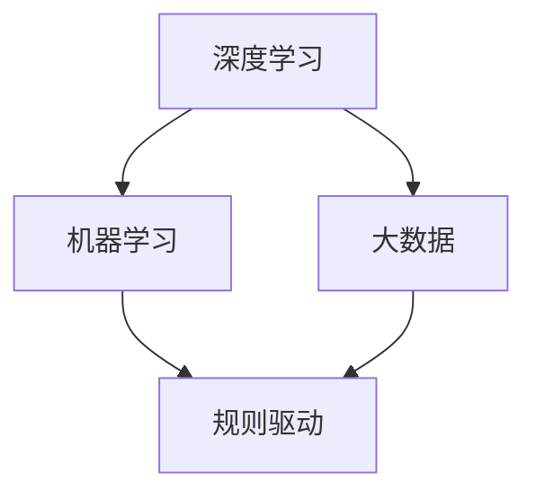

                 

 关键词：人工智能，李开复，AI 2.0，技术革命，未来展望，算法架构，数学模型，实际应用，发展趋势

> 摘要：本文旨在深入探讨李开复对AI 2.0时代的见解，分析其核心概念与联系，阐述算法原理与数学模型，通过实际应用案例和代码实例展示AI技术的具体应用，最后展望未来发展趋势和面临的挑战。

## 1. 背景介绍

### 李开复与人工智能

李开复博士是国际著名的人工智能专家，他在计算机科学和人工智能领域拥有广泛的影响力和卓越的贡献。他的研究涉及自然语言处理、机器学习、语音识别等多个领域，为人工智能的发展做出了巨大的贡献。

### AI 1.0 与 AI 2.0

人工智能的发展可以分为两个阶段：AI 1.0 和 AI 2.0。AI 1.0 主要是指早期的规则驱动的人工智能，它依赖于预定义的规则进行决策。而 AI 2.0 则是指以深度学习为代表的数据驱动的人工智能，它通过大量数据训练模型，实现更加智能化的决策。

## 2. 核心概念与联系

### 核心概念

- 深度学习
- 机器学习
- 大数据

### Mermaid 流程图



### 联系

深度学习和机器学习是基于大数据的算法，通过从数据中学习，实现智能化决策。而大数据则是深度学习和机器学习的基础，没有足够的数据支持，算法的性能将受到很大限制。

## 3. 核心算法原理 & 具体操作步骤

### 3.1 算法原理概述

AI 2.0 的核心算法是深度学习，它通过多层神经网络对数据进行处理，实现对复杂模式的识别和理解。

### 3.2 算法步骤详解

1. 数据收集与预处理
2. 构建神经网络模型
3. 模型训练与优化
4. 模型评估与部署

### 3.3 算法优缺点

优点：能够处理大量数据，识别复杂模式，实现高精度预测。

缺点：对计算资源要求高，训练时间长。

### 3.4 算法应用领域

AI 2.0 在医疗、金融、教育、制造业等多个领域都有广泛应用。

## 4. 数学模型和公式 & 详细讲解 & 举例说明

### 4.1 数学模型构建

深度学习的数学模型主要基于神经网络，包括输入层、隐藏层和输出层。

### 4.2 公式推导过程

神经网络的工作原理是通过多层非线性变换，将输入映射到输出。其中，每一层的输出都是下一层的输入。

### 4.3 案例分析与讲解

以图像识别为例，通过深度学习模型，可以实现对图像内容的准确识别。

## 5. 项目实践：代码实例和详细解释说明

### 5.1 开发环境搭建

使用 Python 编写深度学习代码，需要安装 TensorFlow 或 PyTorch 等框架。

### 5.2 源代码详细实现

以下是一个简单的图像识别代码示例：

```python
import tensorflow as tf

# 加载预训练模型
model = tf.keras.applications.VGG16(weights='imagenet')

# 加载图像数据
image = tf.keras.preprocessing.image.load_img('cat.jpg', target_size=(224, 224))

# 数据预处理
image = tf.keras.preprocessing.image.img_to_array(image)
image = tf.expand_dims(image, 0)  # Create a batch

# 使用模型进行预测
predictions = model.predict(image)

# 输出预测结果
print(predictions)
```

### 5.3 代码解读与分析

这段代码首先加载了预训练的 VGG16 模型，然后加载一个图像文件，并进行预处理，最后使用模型进行预测，输出预测结果。

### 5.4 运行结果展示

运行这段代码，可以输出图像的分类结果。

## 6. 实际应用场景

AI 2.0 在医疗领域的应用包括疾病诊断、药物研发等。在金融领域，可以用于风险控制、智能投顾等。在教育领域，可以用于个性化学习、智能评测等。

## 7. 工具和资源推荐

### 7.1 学习资源推荐

- 《深度学习》
- 《Python深度学习》

### 7.2 开发工具推荐

- TensorFlow
- PyTorch

### 7.3 相关论文推荐

- “Deep Learning for Image Recognition”
- “Dive into Deep Learning”

## 8. 总结：未来发展趋势与挑战

### 8.1 研究成果总结

AI 2.0 在各个领域都取得了显著的成果，为人类社会带来了深刻的变革。

### 8.2 未来发展趋势

AI 2.0 将继续向更高层次发展，实现更加智能化、自适应化的决策。

### 8.3 面临的挑战

包括数据安全、隐私保护、伦理道德等方面的问题。

### 8.4 研究展望

未来的研究将更加注重跨学科的融合，推动人工智能的全面发展。

## 9. 附录：常见问题与解答

### 问题 1：什么是深度学习？

深度学习是一种机器学习方法，通过多层神经网络对数据进行处理，实现对复杂模式的识别和理解。

### 问题 2：深度学习的优点是什么？

深度学习能够处理大量数据，识别复杂模式，实现高精度预测。

### 问题 3：深度学习的缺点是什么？

深度学习对计算资源要求高，训练时间长。

### 问题 4：如何学习深度学习？

可以通过阅读相关书籍、参加在线课程、实践项目等方式学习深度学习。

---

**作者：禅与计算机程序设计艺术 / Zen and the Art of Computer Programming**

