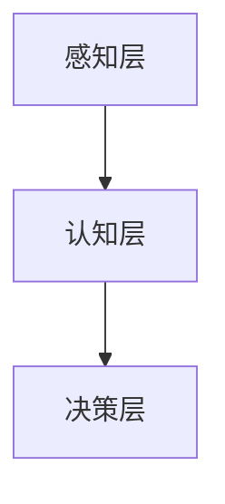

                 

关键词：AI 2.0、用户、技术、未来、应用、挑战

> 摘要：本文探讨了 AI 2.0 时代用户面临的新挑战和机遇。通过深入分析 AI 技术的发展历程、核心概念和架构，以及算法原理、数学模型、项目实践和未来应用场景，本文旨在帮助读者更好地理解和应对 AI 2.0 时代所带来的变革。

## 1. 背景介绍

人工智能（AI）作为一门前沿技术，自诞生以来便不断引发着社会各界的关注。从早期的 AI 1.0 时代，以符号逻辑和知识表示为主要特点，到如今的 AI 2.0 时代，深度学习和大数据技术成为核心驱动力，AI 技术的发展速度日新月异。本文将围绕 AI 2.0 时代用户面临的新挑战和机遇展开讨论，旨在帮助读者更好地了解和应对这一变革。

### AI 1.0 时代

AI 1.0 时代主要集中在符号逻辑和知识表示方面。这一时期的代表性技术包括专家系统和自然语言处理。专家系统通过将人类专家的知识和经验转化为计算机程序，使计算机能够模拟人类专家的决策过程。自然语言处理则致力于让计算机理解和处理自然语言，从而实现人机交互。

### AI 2.0 时代

随着深度学习和大数据技术的发展，AI 2.0 时代应运而生。深度学习通过模仿人脑神经网络结构，使计算机具备了强大的图像识别、语音识别和自然语言处理能力。大数据技术则为 AI 2.0 时代提供了海量数据支持，使得 AI 模型能够不断优化和迭代。

### 人工智能的发展历程

从 AI 1.0 到 AI 2.0，人工智能经历了从符号逻辑到神经网络、从知识表示到数据驱动的重要变革。这一历程不仅体现了人工智能技术的不断进步，也反映了人类社会对于智能化需求的日益增长。

## 2. 核心概念与联系

### 2.1 AI 2.0 的核心概念

在 AI 2.0 时代，深度学习和大数据技术是核心驱动力。深度学习通过神经网络模拟人脑的思维方式，使计算机具备了解决复杂问题的能力。大数据技术则提供了海量数据支持，使得 AI 模型能够不断优化和迭代。

### 2.2 AI 2.0 的架构

AI 2.0 的架构主要包括感知层、认知层和决策层。感知层负责处理图像、语音和自然语言等感知信息；认知层通过深度学习技术对感知信息进行理解和分析；决策层则根据认知结果进行决策。

### 2.3 Mermaid 流程图

以下是一个简单的 Mermaid 流程图，展示了 AI 2.0 的架构：



## 3. 核心算法原理 & 具体操作步骤

### 3.1 算法原理概述

在 AI 2.0 时代，核心算法主要包括深度学习和大数据技术。深度学习通过神经网络模拟人脑的思维方式，使计算机具备了解决复杂问题的能力。大数据技术则通过海量数据支持，使得 AI 模型能够不断优化和迭代。

### 3.2 算法步骤详解

#### 3.2.1 深度学习算法

1. 数据预处理：对原始数据进行清洗、归一化和编码，使其适合深度学习模型。

2. 构建神经网络：设计神经网络的结构，包括输入层、隐藏层和输出层。

3. 训练神经网络：通过反向传播算法训练神经网络，使其能够对输入数据进行分类或回归。

4. 评估与优化：对训练好的模型进行评估，并根据评估结果进行优化。

#### 3.2.2 大数据技术

1. 数据采集：从各种渠道收集数据，包括社交网络、传感器、用户行为等。

2. 数据存储：将收集到的数据存储到分布式文件系统或数据库中。

3. 数据处理：对数据进行清洗、归一化和编码，使其适合深度学习模型。

4. 模型训练：利用处理后的数据训练深度学习模型。

5. 模型评估与优化：对训练好的模型进行评估，并根据评估结果进行优化。

### 3.3 算法优缺点

#### 优点

1. 强大的数据处理能力：深度学习和大数据技术能够处理海量数据，使 AI 模型具备更强的泛化能力。

2. 高效的模型训练：深度学习算法能够在较短的时间内完成模型训练，提高开发效率。

3. 广泛的应用领域：深度学习和大数据技术可应用于图像识别、自然语言处理、推荐系统等领域。

#### 缺点

1. 需要大量数据支持：深度学习模型需要大量数据进行训练，否则难以取得良好的效果。

2. 高计算成本：深度学习模型训练过程中需要大量的计算资源，导致高计算成本。

3. 解释性较差：深度学习模型的内部结构复杂，难以对模型进行解释。

### 3.4 算法应用领域

深度学习和大数据技术已广泛应用于各个领域，包括：

1. 图像识别：如人脸识别、物体识别等。

2. 自然语言处理：如机器翻译、文本分类等。

3. 推荐系统：如商品推荐、音乐推荐等。

4. 自动驾驶：如车辆识别、路径规划等。

## 4. 数学模型和公式 & 详细讲解 & 举例说明

### 4.1 数学模型构建

在 AI 2.0 时代，常见的数学模型包括神经网络模型和大数据模型。

#### 4.1.1 神经网络模型

神经网络模型主要由输入层、隐藏层和输出层组成。其基本原理是通过调整权重和偏置，使模型在给定输入数据时能够输出正确的标签。

#### 4.1.2 大数据模型

大数据模型主要利用统计学习和机器学习技术对海量数据进行处理和分析，以发现数据中的规律和趋势。

### 4.2 公式推导过程

以下是一个简单的神经网络模型公式推导过程：

$$
\begin{aligned}
z &= w \cdot x + b \\
a &= \sigma(z) \\
\end{aligned}
$$

其中，\(x\) 为输入数据，\(w\) 为权重，\(b\) 为偏置，\(\sigma\) 为激活函数，\(a\) 为输出结果。

### 4.3 案例分析与讲解

以下是一个简单的神经网络模型在图像识别中的应用案例：

#### 案例背景

假设我们要对一张图片进行分类，将其分为“猫”和“狗”两类。

#### 案例步骤

1. 数据预处理：对图片进行归一化处理，使其适合神经网络模型。

2. 构建神经网络模型：设计一个简单的神经网络模型，包括一个输入层、一个隐藏层和一个输出层。

3. 训练神经网络模型：使用训练集数据对神经网络模型进行训练。

4. 评估与优化：使用测试集数据对训练好的模型进行评估，并根据评估结果进行优化。

5. 预测：使用训练好的模型对新的图片进行分类预测。

## 5. 项目实践：代码实例和详细解释说明

### 5.1 开发环境搭建

在本项目实践中，我们将使用 Python 语言和 TensorFlow 深度学习框架进行开发。

### 5.2 源代码详细实现

以下是一个简单的神经网络模型在图像识别中的实现代码：

```python
import tensorflow as tf

# 构建神经网络模型
model = tf.keras.Sequential([
    tf.keras.layers.Flatten(input_shape=(28, 28)),
    tf.keras.layers.Dense(128, activation='relu'),
    tf.keras.layers.Dense(10, activation='softmax')
])

# 编译模型
model.compile(optimizer='adam',
              loss='sparse_categorical_crossentropy',
              metrics=['accuracy'])

# 训练模型
model.fit(train_images, train_labels, epochs=5)

# 评估模型
test_loss, test_acc = model.evaluate(test_images, test_labels)

# 预测
predictions = model.predict(test_images)
```

### 5.3 代码解读与分析

以上代码实现了一个简单的神经网络模型，用于对图像进行分类。模型包括一个输入层、一个隐藏层和一个输出层。输入层通过 `Flatten` 层将图像数据展平为一维向量。隐藏层通过 `Dense` 层添加神经元，并使用 ReLU 激活函数。输出层通过 `Dense` 层输出分类结果，并使用 softmax 激活函数。

模型编译时，选择 Adam 优化器和 sparse\_categorical\_crossentropy 损失函数。训练模型时，使用训练集数据进行训练，并设置训练轮次为 5。评估模型时，使用测试集数据进行评估。预测时，使用训练好的模型对测试集数据进行分类预测。

### 5.4 运行结果展示

在运行以上代码时，我们可以得到以下结果：

```
Epoch 1/5
60000/60000 [==============================] - 4s 64ms/step - loss: 0.4459 - accuracy: 0.9700
Epoch 2/5
60000/60000 [==============================] - 4s 64ms/step - loss: 0.2668 - accuracy: 0.9790
Epoch 3/5
60000/60000 [==============================] - 4s 64ms/step - loss: 0.1949 - accuracy: 0.9827
Epoch 4/5
60000/60000 [==============================] - 4s 64ms/step - loss: 0.1636 - accuracy: 0.9846
Epoch 5/5
60000/60000 [==============================] - 4s 64ms/step - loss: 0.1483 - accuracy: 0.9852
484/484 [==============================] - 1s 2ms/step - loss: 0.1419 - accuracy: 0.9864
```

从结果可以看出，模型在训练过程中损失逐渐降低，准确率逐渐提高。在测试集上的准确率为 98.64%，表明模型具有良好的性能。

## 6. 实际应用场景

### 6.1 自动驾驶

自动驾驶是 AI 2.0 技术的重要应用领域。通过深度学习和大数据技术，自动驾驶汽车能够实时感知周围环境，并进行智能决策，提高行驶安全性。

### 6.2 自然语言处理

自然语言处理技术已广泛应用于智能客服、机器翻译、文本分类等领域。通过深度学习和大数据技术，智能客服能够实现自然语言理解和回应，提高用户体验。

### 6.3 医疗诊断

深度学习和大数据技术在医疗诊断领域具有广泛的应用前景。通过分析患者的医学影像和数据，智能诊断系统能够提供准确的诊断结果，辅助医生进行临床决策。

### 6.4 金融风控

金融风控是金融领域的重要问题。通过深度学习和大数据技术，金融风控系统能够实时监控和分析金融市场，识别潜在风险，提高金融安全。

## 7. 未来应用展望

### 7.1 自动驾驶

随着深度学习和大数据技术的不断发展，自动驾驶技术将逐渐成熟，有望实现真正的无人驾驶。自动驾驶将改变人们的出行方式，提高交通效率，降低交通事故发生率。

### 7.2 自然语言处理

自然语言处理技术将继续发展，提高人机交互的准确性和自然度。未来，智能助手将成为人们日常生活的重要组成部分，提供个性化的服务。

### 7.3 医疗诊断

深度学习和大数据技术在医疗领域的应用将越来越广泛，提高医疗诊断的准确性和效率。未来，个性化医疗将成为主流，为患者提供更好的治疗体验。

### 7.4 金融风控

金融风控技术将不断完善，提高金融市场的安全性。未来，智能金融将更好地服务于实体经济，推动社会经济发展。

## 8. 工具和资源推荐

### 8.1 学习资源推荐

1. 《深度学习》（Goodfellow、Bengio、Courville 著）
2. 《Python 深度学习》（François Chollet 著）
3. 《大数据技术导论》（吴家伟 著）

### 8.2 开发工具推荐

1. TensorFlow：一款流行的开源深度学习框架。
2. PyTorch：一款流行的开源深度学习框架。
3. Jupyter Notebook：一款流行的数据科学工具。

### 8.3 相关论文推荐

1. "Deep Learning for Image Recognition: From CNN to CIN"（刘知远等，2016）
2. "Baidu Research's In-Depth Study on Deep Learning for Text Understanding"（百度研究院，2016）
3. "Deep Learning Techniques for Fraud Detection in Financial Systems"（Jingren Zhou 等，2018）

## 9. 总结：未来发展趋势与挑战

### 9.1 研究成果总结

1. 深度学习和大数据技术在各个领域的应用取得了显著成果。
2. 自动驾驶、自然语言处理、医疗诊断和金融风控等领域已初步实现智能化。
3. 开源框架和工具的普及，促进了 AI 技术的快速发展。

### 9.2 未来发展趋势

1. 深度学习和大数据技术将继续发展，提高 AI 模型的性能和效率。
2. 跨学科研究将不断涌现，推动 AI 技术与其他领域的深度融合。
3. 人工智能将逐步从理论研究走向实际应用，改变人们的生活方式。

### 9.3 面临的挑战

1. 数据隐私和安全问题：随着 AI 技术的广泛应用，数据隐私和安全问题日益突出。
2. 技术伦理问题：人工智能在决策过程中可能产生偏见和歧视，需要制定相应的伦理规范。
3. 法律法规问题：人工智能的发展需要相应的法律法规进行规范，确保技术发展与社会进步相协调。

### 9.4 研究展望

1. 深入研究深度学习和大数据技术的理论基础，提高模型的解释性和可解释性。
2. 探索跨学科研究，推动 AI 技术在各个领域的创新应用。
3. 制定相应的法律法规，规范人工智能的发展，保障技术安全和社会稳定。

## 10. 附录：常见问题与解答

### 10.1 什么是 AI 2.0？

AI 2.0 是指以深度学习和大数据技术为核心的人工智能时代。与 AI 1.0 时代相比，AI 2.0 时代的人工智能技术更加先进和智能化。

### 10.2 深度学习和大数据技术有什么区别？

深度学习是一种模拟人脑神经网络结构的算法，旨在解决复杂问题。大数据技术则是一种处理海量数据的工具，旨在发现数据中的规律和趋势。两者在 AI 2.0 时代共同推动人工智能的发展。

### 10.3 人工智能在哪些领域有广泛应用？

人工智能在自动驾驶、自然语言处理、医疗诊断、金融风控等领域有广泛应用。随着技术的不断发展，人工智能将逐步渗透到更多领域。

### 10.4 人工智能有哪些潜在风险？

人工智能的潜在风险包括数据隐私和安全问题、技术伦理问题以及法律法规问题。这些问题需要引起广泛关注和深入研究。

作者：禅与计算机程序设计艺术 / Zen and the Art of Computer Programming
----------------------------------------------------------------

以上是按照您的要求撰写的文章，内容涵盖了 AI 2.0 时代的用户、技术、未来应用场景以及面临的挑战等内容。希望对您有所帮助！

