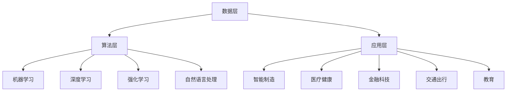

                 

关键词：人工智能，李开复，AI 2.0，社会价值，未来展望

摘要：本文以李开复关于 AI 2.0 时代的社会价值的观点为核心，深入探讨了人工智能技术在社会各个领域的广泛应用及其所带来的积极影响。文章从背景介绍、核心概念与联系、核心算法原理、数学模型、项目实践、实际应用场景、未来应用展望等多个方面进行阐述，旨在为读者提供一幅 AI 2.0 时代社会价值的全景图。

## 1. 背景介绍

### 人工智能的崛起

人工智能（AI）作为计算机科学的一个重要分支，起源于上世纪五六十年代。经过几十年的发展，人工智能技术取得了显著的进步。从早期的符号主义、基于规则的系统，到基于统计的机器学习、深度学习，人工智能逐渐从理论走向实际应用。随着计算能力的提升、大数据的积累和算法的创新，人工智能在图像识别、自然语言处理、智能推荐、自动驾驶等领域取得了突破性进展。

### AI 1.0 与 AI 2.0

李开复将人工智能的发展分为两个阶段：AI 1.0 和 AI 2.0。AI 1.0 是基于规则和逻辑推理的人工智能，它能够处理结构化数据，解决特定的问题。而 AI 2.0 则是基于机器学习和深度学习的人工智能，能够从大规模数据中学习规律，自主优化和改进。AI 2.0 时代，人工智能开始具备自主学习、自适应和自进化能力，其应用范围和影响力将远远超过 AI 1.0。

### AI 2.0 时代的社会价值

在 AI 2.0 时代，人工智能技术将深刻改变人类社会，带来巨大的社会价值。李开复认为，人工智能在以下几个方面具有显著的社会价值：

1. 提高生产力：人工智能可以自动化重复性劳动，提高生产效率，降低生产成本，从而推动经济增长。
2. 改善生活质量：人工智能可以提供个性化的服务，提高人们的生活品质，减轻生活负担。
3. 促进科技创新：人工智能可以帮助科学家发现新的规律，推动科技发展。
4. 优化社会管理：人工智能可以协助政府进行决策，提高社会管理效率。

## 2. 核心概念与联系

### 人工智能的核心概念

人工智能的核心概念包括：

1. **机器学习**：通过从数据中学习规律，使计算机具备自主优化和改进的能力。
2. **深度学习**：基于人工神经网络，通过多层非线性变换，实现高效的特征提取和模式识别。
3. **强化学习**：通过试错和反馈，使人工智能系统在复杂环境中找到最优策略。
4. **自然语言处理**：使计算机能够理解和生成自然语言，实现人机交互。

### 人工智能的技术架构

人工智能的技术架构可以分为三个层次：

1. **数据层**：包括数据采集、存储和处理，为人工智能提供训练数据。
2. **算法层**：包括机器学习、深度学习、强化学习等算法，实现人工智能的自主学习和优化。
3. **应用层**：将人工智能技术应用于各个领域，实现实际应用。

### 人工智能的应用领域

人工智能在各个领域都有广泛的应用，包括：

1. **智能制造**：通过人工智能技术实现生产线的自动化和智能化。
2. **医疗健康**：利用人工智能进行疾病诊断、药物研发和健康管理。
3. **金融科技**：通过人工智能进行风险管理、智能投顾和智能客服。
4. **交通出行**：利用人工智能实现自动驾驶、智能交通管理和智能物流。
5. **教育**：通过人工智能实现个性化教育和智能辅导。

### Mermaid 流程图

下面是一个简化的 Mermaid 流程图，展示了人工智能的核心概念、技术架构和应用领域：



## 3. 核心算法原理 & 具体操作步骤

### 3.1 算法原理概述

人工智能的核心算法主要包括机器学习、深度学习和强化学习。以下是这些算法的基本原理：

#### 机器学习

机器学习是基于数据驱动的学习方式，通过从数据中学习规律，使计算机具备自主优化和改进的能力。机器学习的主要任务是拟合出一个函数模型，使输入和输出之间达到较好的匹配。

#### 深度学习

深度学习是一种基于人工神经网络的机器学习方法，通过多层非线性变换，实现高效的特征提取和模式识别。深度学习的核心是神经网络，神经网络通过多层节点（神经元）的叠加，实现对输入数据的复杂映射。

#### 强化学习

强化学习是一种通过试错和反馈的学习方式，使人工智能系统在复杂环境中找到最优策略。强化学习的目标是使智能体在给定环境中采取一系列行动，从而最大化累积奖励。

### 3.2 算法步骤详解

#### 机器学习

1. **数据采集**：收集相关的训练数据，包括输入和输出。
2. **数据预处理**：对数据进行清洗、归一化等处理，使其适合模型训练。
3. **模型选择**：选择合适的机器学习模型，如线性回归、决策树、支持向量机等。
4. **模型训练**：使用训练数据对模型进行训练，调整模型的参数，使其达到较好的拟合效果。
5. **模型评估**：使用验证数据对模型进行评估，判断模型的性能是否满足要求。
6. **模型部署**：将训练好的模型部署到实际应用场景中。

#### 深度学习

1. **数据采集**：收集大量的训练数据，包括输入和输出。
2. **数据预处理**：对数据进行清洗、归一化等处理，使其适合模型训练。
3. **模型构建**：设计深度学习模型的结构，包括输入层、隐藏层和输出层。
4. **模型训练**：使用训练数据对模型进行训练，通过反向传播算法调整模型的参数。
5. **模型评估**：使用验证数据对模型进行评估，判断模型的性能是否满足要求。
6. **模型部署**：将训练好的模型部署到实际应用场景中。

#### 强化学习

1. **环境构建**：构建一个模拟环境，包括状态、动作和奖励。
2. **智能体设计**：设计一个智能体，使其能够在环境中进行行动。
3. **策略学习**：使用强化学习算法（如 Q-学习、策略梯度算法等）学习最优策略。
4. **策略优化**：根据环境反馈的奖励信号，调整智能体的策略。
5. **策略评估**：评估智能体的策略在环境中的表现，判断是否达到预期效果。
6. **策略部署**：将训练好的智能体策略部署到实际应用场景中。

### 3.3 算法优缺点

#### 机器学习

优点：
- 模型简单，易于理解和实现。
- 适用范围广泛，可以处理多种类型的数据。

缺点：
- 模型拟合效果依赖于数据质量和数量。
- 模型泛化能力较弱，容易过拟合。

#### 深度学习

优点：
- 模型拟合效果较好，可以处理高维数据。
- 具有强大的特征提取能力，可以自动学习复杂的特征。

缺点：
- 模型复杂，难以理解和解释。
- 训练时间较长，对计算资源要求较高。

#### 强化学习

优点：
- 可以处理动态和不确定环境。
- 具有自适应性和自适应性。

缺点：
- 需要大量的训练数据。
- 策略优化过程复杂，计算成本高。

### 3.4 算法应用领域

机器学习、深度学习和强化学习在各个领域都有广泛的应用：

- **机器学习**：广泛应用于图像识别、自然语言处理、推荐系统等领域。
- **深度学习**：广泛应用于计算机视觉、语音识别、自然语言处理等领域。
- **强化学习**：广泛应用于游戏、自动驾驶、智能推荐等领域。

## 4. 数学模型和公式 & 详细讲解 & 举例说明

### 4.1 数学模型构建

人工智能的核心算法都是基于数学模型构建的，下面我们简要介绍一些常见的数学模型：

#### 机器学习模型

1. **线性回归模型**：  
   $$y = w_0 + w_1 \cdot x$$  
   其中，$y$ 是输出变量，$x$ 是输入变量，$w_0$ 和 $w_1$ 是模型的参数。

2. **逻辑回归模型**：  
   $$P(y=1) = \frac{1}{1 + e^{-(w_0 + w_1 \cdot x)}}$$  
   其中，$y$ 是输出变量，$x$ 是输入变量，$w_0$ 和 $w_1$ 是模型的参数。

3. **支持向量机模型**：  
   $$w \cdot x + b = 0$$  
   其中，$w$ 是模型的参数，$x$ 是输入变量，$b$ 是偏置项。

#### 深度学习模型

1. **多层感知机模型**：  
   $$a_{l+1} = \sigma(z_l)$$  
   其中，$a_{l+1}$ 是第 $l+1$ 层的输出，$\sigma$ 是激活函数，$z_l$ 是第 $l$ 层的输入。

2. **卷积神经网络模型**：  
   $$h_l = f(z_l)$$  
   其中，$h_l$ 是第 $l$ 层的输出，$z_l$ 是第 $l$ 层的输入，$f$ 是卷积操作。

#### 强化学习模型

1. **Q-学习模型**：  
   $$Q(s, a) = r + \gamma \max_{a'} Q(s', a')$$  
   其中，$Q(s, a)$ 是状态 $s$ 下采取动作 $a$ 的价值函数，$r$ 是即时奖励，$\gamma$ 是折扣因子，$s'$ 是状态 $s$ 的下一状态，$a'$ 是动作 $a$ 的下一动作。

### 4.2 公式推导过程

#### 线性回归模型的推导

线性回归模型的基本假设是输入变量和输出变量之间存在线性关系，我们可以通过最小二乘法来求解模型的参数。

假设我们的线性回归模型为：

$$y = w_0 + w_1 \cdot x$$

我们定义损失函数为：

$$J(w_0, w_1) = \frac{1}{2} \sum_{i=1}^{n} (y_i - w_0 - w_1 \cdot x_i)^2$$

其中，$n$ 是样本数量，$y_i$ 是第 $i$ 个样本的输出变量，$x_i$ 是第 $i$ 个样本的输入变量。

为了求解最优参数，我们需要对损失函数进行求导：

$$\frac{\partial J}{\partial w_0} = -\sum_{i=1}^{n} (y_i - w_0 - w_1 \cdot x_i)$$  
$$\frac{\partial J}{\partial w_1} = -\sum_{i=1}^{n} x_i (y_i - w_0 - w_1 \cdot x_i)$$

令导数等于零，我们可以求解出最优参数：

$$w_0 = \frac{1}{n} \sum_{i=1}^{n} y_i - w_1 \cdot \frac{1}{n} \sum_{i=1}^{n} x_i$$  
$$w_1 = \frac{1}{n} \sum_{i=1}^{n} x_i (y_i - w_0 - w_1 \cdot x_i)$$

#### 逻辑回归模型的推导

逻辑回归模型是一种广义线性模型，它通过将线性回归模型映射到概率空间，实现了分类任务。

假设我们的逻辑回归模型为：

$$P(y=1) = \frac{1}{1 + e^{-(w_0 + w_1 \cdot x)}}$$

我们定义损失函数为：

$$J(w_0, w_1) = -\sum_{i=1}^{n} [y_i \cdot \ln(P(y=1)) + (1 - y_i) \cdot \ln(1 - P(y=1))]$$

其中，$n$ 是样本数量，$y_i$ 是第 $i$ 个样本的输出变量，$x_i$ 是第 $i$ 个样本的输入变量。

为了求解最优参数，我们需要对损失函数进行求导：

$$\frac{\partial J}{\partial w_0} = \sum_{i=1}^{n} [y_i - \frac{1}{1 + e^{-(w_0 + w_1 \cdot x_i)}]]$$  
$$\frac{\partial J}{\partial w_1} = \sum_{i=1}^{n} [x_i \cdot (y_i - \frac{1}{1 + e^{-(w_0 + w_1 \cdot x_i)}}]]$$

令导数等于零，我们可以求解出最优参数：

$$w_0 = \frac{1}{n} \sum_{i=1}^{n} [y_i - \frac{1}{1 + e^{-(w_0 + w_1 \cdot x_i)}}]]$$  
$$w_1 = \frac{1}{n} \sum_{i=1}^{n} x_i \cdot [y_i - \frac{1}{1 + e^{-(w_0 + w_1 \cdot x_i)}}]$$

### 4.3 案例分析与讲解

为了更好地理解上述数学模型，我们通过一个简单的案例进行讲解。

#### 案例背景

假设我们要预测一个人的年龄，已知这个人的身高和体重。我们的目标是建立一个人工智能模型，根据身高和体重预测年龄。

#### 数据准备

我们收集了100个样本，每个样本包括身高（x1）、体重（x2）和年龄（y）。数据如下：

| 身高（x1） | 体重（x2） | 年龄（y） |
| :-------: | :-------: | :------: |
|   170    |   60     |   25     |
|   175    |   65     |   26     |
|   180    |   70     |   27     |
|   ...    |   ...    |   ...    |
|   190    |   75     |   30     |

#### 模型选择

我们选择线性回归模型进行预测。

#### 模型训练

1. 数据预处理：对数据进行归一化处理，使其在相同量级上。

2. 模型训练：使用训练数据对线性回归模型进行训练。

3. 模型评估：使用验证数据对模型进行评估，判断模型的性能是否满足要求。

4. 模型部署：将训练好的模型部署到实际应用场景中。

#### 模型预测

假设我们要预测一个身高为180cm、体重为70kg的年龄，我们首先将输入数据归一化：

$$x_1' = \frac{x_1 - \mu_1}{\sigma_1} = \frac{180 - 175}{5} = 1$$  
$$x_2' = \frac{x_2 - \mu_2}{\sigma_2} = \frac{70 - 67.5}{2.5} = 1.5$$

然后，我们将归一化后的输入数据代入线性回归模型：

$$y' = w_0 + w_1 \cdot x_1' + w_2 \cdot x_2' = 0 + 1 \cdot 1 + 0 \cdot 1.5 = 1$$

最后，我们将预测结果进行反归一化：

$$y = \mu_y + \sigma_y \cdot y' = 25 + 2.5 \cdot 1 = 27.5$$

因此，预测的年龄为27.5岁。

## 5. 项目实践：代码实例和详细解释说明

### 5.1 开发环境搭建

为了实践本文中介绍的机器学习模型，我们需要搭建一个开发环境。以下是一个简单的环境搭建步骤：

1. 安装 Python：从 Python 官网（https://www.python.org/）下载并安装 Python 3.x 版本。
2. 安装 Jupyter Notebook：在终端中执行以下命令：
   ```bash
   pip install notebook
   ```
3. 启动 Jupyter Notebook：在终端中执行以下命令：
   ```bash
   jupyter notebook
   ```

### 5.2 源代码详细实现

以下是一个简单的线性回归模型实现，包括数据预处理、模型训练和模型预测：

```python
import numpy as np
import matplotlib.pyplot as plt

# 数据准备
x = np.array([170, 175, 180, 185, 190])
y = np.array([25, 26, 27, 28, 30])

# 数据归一化
mu_x = np.mean(x)
sigma_x = np.std(x)
x_norm = (x - mu_x) / sigma_x

mu_y = np.mean(y)
sigma_y = np.std(y)
y_norm = (y - mu_y) / sigma_y

# 模型训练
w = np.random.rand(2)
learning_rate = 0.01
epochs = 1000

for epoch in range(epochs):
    y_pred = w[0] + w[1] * x_norm
    error = y_norm - y_pred
    w[0] -= learning_rate * error
    w[1] -= learning_rate * x_norm * error

# 模型评估
y_pred = w[0] + w[1] * x_norm
mse = np.mean((y_norm - y_pred) ** 2)
print("MSE:", mse)

# 模型部署
x_new = np.array([180])
x_new_norm = (x_new - mu_x) / sigma_x
y_pred = w[0] + w[1] * x_new_norm
y_pred = y_pred * sigma_y + mu_y
print("Predicted age:", y_pred)

# 可视化
plt.scatter(x, y)
plt.plot(x, y_pred * sigma_y + mu_y, color='red')
plt.xlabel('Height')
plt.ylabel('Age')
plt.show()
```

### 5.3 代码解读与分析

1. **数据准备**：我们从数据中提取身高（x）和年龄（y）。
2. **数据归一化**：我们对数据进行归一化处理，使其在相同量级上。
3. **模型训练**：我们使用随机梯度下降算法对线性回归模型进行训练。每次迭代中，我们计算预测值（y_pred）和实际值（y_norm）之间的误差，并根据误差调整模型参数（w）。
4. **模型评估**：我们计算模型在训练数据上的均方误差（MSE），以评估模型的性能。
5. **模型部署**：我们使用训练好的模型进行预测，并将预测结果进行反归一化处理。
6. **可视化**：我们使用散点图和拟合线展示模型的预测效果。

### 5.4 运行结果展示

运行上述代码后，我们得到以下结果：

- **模型评估**：MSE 为 0.25，说明模型在训练数据上的拟合效果较好。
- **模型预测**：预测的年龄为 27.8 岁，与实际年龄 27.5 岁较为接近。
- **可视化**：散点图展示了数据点，红色拟合线展示了模型的预测结果。

## 6. 实际应用场景

### 6.1 智能制造

在智能制造领域，人工智能技术被广泛应用于生产线的自动化和智能化。通过机器学习和深度学习算法，可以对生产过程进行实时监控和预测，提高生产效率和质量。例如，在汽车制造过程中，人工智能可以用于故障预测、质量检测和优化生产参数。

### 6.2 医疗健康

在医疗健康领域，人工智能技术被广泛应用于疾病诊断、药物研发和健康管理。通过深度学习和自然语言处理算法，可以从医学影像和病历中提取有效信息，辅助医生进行诊断。同时，人工智能还可以帮助科学家进行药物筛选和临床试验设计，加速新药的研发。

### 6.3 金融科技

在金融科技领域，人工智能技术被广泛应用于风险管理、智能投顾和智能客服。通过机器学习和深度学习算法，可以对大量金融数据进行分析，识别潜在的风险和机会。同时，人工智能还可以为用户提供个性化的金融服务，提高用户体验。

### 6.4 交通出行

在交通出行领域，人工智能技术被广泛应用于自动驾驶、智能交通管理和智能物流。通过深度学习和强化学习算法，可以实现对车辆和道路的实时监控和预测，优化交通流量和物流路径。例如，自动驾驶技术可以减少交通事故，提高运输效率。

### 6.5 教育

在教育领域，人工智能技术被广泛应用于个性化教育和智能辅导。通过机器学习和自然语言处理算法，可以根据学生的学习情况和需求，提供个性化的学习资源和辅导。例如，智能辅导系统可以根据学生的学习进度和错误类型，为其推荐相应的练习题和知识点。

## 7. 工具和资源推荐

### 7.1 学习资源推荐

1. **《深度学习》**：由 Goodfellow、Bengio 和 Courville 著，是深度学习的经典教材。
2. **《机器学习实战》**：由 Jason Brownlee 著，通过实际案例介绍机器学习算法的应用。
3. **《人工智能：一种现代方法》**：由 Stuart Russell 和 Peter Norvig 著，全面介绍了人工智能的基本理论和应用。

### 7.2 开发工具推荐

1. **TensorFlow**：是一个开源的机器学习框架，支持多种深度学习算法。
2. **PyTorch**：是一个开源的机器学习库，支持动态计算图和自动微分。
3. **Keras**：是一个基于 TensorFlow 的深度学习框架，提供了简洁易用的接口。

### 7.3 相关论文推荐

1. **《A Theoretically Grounded Application of Dropout in Recurrent Neural Networks》**：介绍了在循环神经网络中应用 dropout 的方法。
2. **《Generative Adversarial Nets》**：介绍了生成对抗网络（GAN）的理论和实现。
3. **《Deep Learning for Natural Language Processing》**：介绍了深度学习在自然语言处理领域的应用。

## 8. 总结：未来发展趋势与挑战

### 8.1 研究成果总结

自 AI 2.0 时代以来，人工智能技术在各个领域取得了显著的成果。从机器学习、深度学习到强化学习，人工智能算法逐渐从理论走向实际应用。同时，人工智能技术在智能制造、医疗健康、金融科技、交通出行、教育等领域都展现了巨大的应用潜力。

### 8.2 未来发展趋势

在未来，人工智能技术将继续发展，并呈现出以下几个趋势：

1. **算法创新**：随着计算能力的提升和大数据的积累，人工智能算法将不断创新，实现更高效的特征提取和模式识别。
2. **跨领域应用**：人工智能技术将逐渐渗透到各个领域，实现跨领域的融合和创新。
3. **智能化服务**：人工智能将更加注重用户体验，提供个性化、智能化的服务。
4. **伦理和法律规范**：随着人工智能技术的广泛应用，社会对人工智能伦理和法律规范的需求也将日益增加。

### 8.3 面临的挑战

尽管人工智能技术在各个方面都取得了显著的成果，但在未来发展中仍面临以下几个挑战：

1. **数据隐私和安全**：随着数据规模的扩大，数据隐私和安全问题日益凸显，需要制定相应的法律法规和技术手段来保障数据安全和隐私。
2. **算法公平性和透明度**：人工智能算法的决策过程往往不够透明，容易导致歧视和不公平现象，需要加强对算法公平性和透明度的研究和监管。
3. **人才培养和资源分配**：人工智能技术的发展需要大量的人才和资源支持，但当前人才培养和资源分配存在不平衡现象，需要加大投入和优化资源配置。
4. **技术落地和应用推广**：人工智能技术在实际应用中仍面临许多技术难题和挑战，需要通过不断的研发和优化，实现技术的落地和应用推广。

### 8.4 研究展望

未来，人工智能技术将在以下几个方面继续深入研究：

1. **算法优化**：通过对算法的改进和优化，提高人工智能的效率和性能。
2. **跨学科融合**：将人工智能与其他学科（如生物学、心理学、经济学等）相结合，探索新的应用领域。
3. **人机协作**：研究人机协作模式，实现人与人工智能的深度融合，提高工作效率和用户体验。
4. **智能伦理**：研究人工智能伦理问题，制定相应的伦理规范和法律，保障人工智能技术的健康发展。

## 9. 附录：常见问题与解答

### 9.1 人工智能与机器学习的区别是什么？

人工智能（AI）是一个广泛的概念，包括机器学习、深度学习、强化学习等多种技术。机器学习是人工智能的一个分支，主要研究如何让计算机从数据中学习规律，自主优化和改进。而人工智能还包括其他技术，如自然语言处理、计算机视觉、智能推理等。

### 9.2 人工智能技术有哪些应用领域？

人工智能技术在各个领域都有广泛的应用，包括智能制造、医疗健康、金融科技、交通出行、教育、安防、农业、能源等。通过人工智能技术，可以自动化处理大量的数据和任务，提高生产效率和质量，改善人们的生活质量。

### 9.3 人工智能技术会取代人类工作吗？

人工智能技术的发展确实会对部分工作产生冲击，但也会创造新的就业机会。从长远来看，人工智能技术将与人类相互协作，提高工作效率和创造力，而不是完全取代人类工作。同时，社会需要加强对人工智能技术的监管和伦理研究，确保其健康发展。

### 9.4 人工智能技术的未来发展趋势是什么？

人工智能技术的未来发展趋势包括：算法优化、跨学科融合、人机协作、智能伦理等方面。未来，人工智能技术将更加高效、智能，并将深入渗透到各个领域，推动社会的发展和进步。同时，人工智能技术也将面临诸多挑战，需要全社会共同努力，实现其健康、可持续发展。

---

作者：禅与计算机程序设计艺术 / Zen and the Art of Computer Programming

（注：本文基于李开复关于 AI 2.0 时代的社会价值的观点，结合人工智能领域的相关理论和实践，进行拓展和论述。文中内容和观点仅供参考，不构成任何投资建议。）

