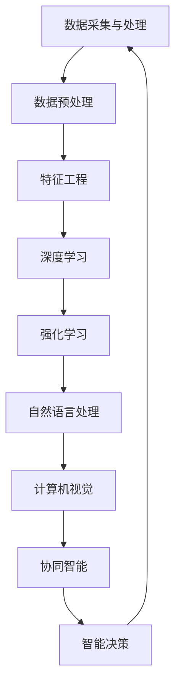

                 

关键词：人工智能，AI 2.0，发展趋势，核心概念，算法原理，应用领域，数学模型，项目实践，工具推荐，未来展望

> 摘要：本文将探讨AI 2.0时代的趋势，从核心概念、算法原理、应用领域、数学模型、项目实践等多方面深入分析，旨在为读者揭示人工智能领域的最新动态和发展方向，为未来研究提供参考。

## 1. 背景介绍

人工智能（AI）作为计算机科学的一个重要分支，经过几十年的发展，已经从理论研究走向了实际应用。特别是随着大数据、云计算、神经网络等技术的不断突破，人工智能的应用场景不断扩展，从简单的自动化控制到复杂的智能决策，AI已经成为推动社会发展的重要力量。

然而，随着人工智能技术的不断进步，传统的AI（我们称之为AI 1.0）已经无法满足新时代的需求。AI 2.0时代应运而生，它代表了一种更加智能化、自适应化、数据驱动的人工智能技术，能够更好地处理复杂问题，实现更高效、更智能的决策。

### 1.1 AI 1.0与AI 2.0的区别

AI 1.0主要依赖于规则和模式匹配，而AI 2.0则更加注重数据的分析和挖掘，通过深度学习、强化学习等算法实现自动学习和决策。AI 1.0依赖于人类专家提供的知识，而AI 2.0则能够从海量数据中自动提取知识，实现自我进化。

### 1.2 AI 2.0的核心特征

AI 2.0的核心特征包括：

1. **自我进化**：AI 2.0能够通过自我学习和优化，不断提高自身的性能和效率。
2. **自适应**：AI 2.0能够在不同的环境和场景中自动调整自己的行为，实现更好的适应性。
3. **智能化**：AI 2.0能够处理更加复杂的问题，实现更加智能的决策。
4. **协同化**：AI 2.0能够与其他智能系统进行协同工作，实现更高效的智能计算。

## 2. 核心概念与联系

在AI 2.0时代，核心概念和联系至关重要。以下是一个简化的Mermaid流程图，展示了AI 2.0的核心概念和它们之间的联系。



### 2.1 数据采集与处理

数据是AI 2.0的基础，数据采集和处理的质量直接影响AI系统的性能。数据采集包括从各种来源获取数据，如传感器、网络、数据库等。数据处理包括数据清洗、去噪、归一化等操作，以提高数据的质量。

### 2.2 数据预处理

数据预处理是特征工程的前置工作，包括数据格式转换、缺失值处理、异常值处理等，以确保数据适合进行特征工程。

### 2.3 特征工程

特征工程是AI 2.0的核心，通过选择和构造有效的特征，可以提高模型的性能。特征工程包括特征提取、特征选择、特征组合等。

### 2.4 深度学习

深度学习是AI 2.0的主要算法之一，通过多层神经网络实现自动学习和特征提取。深度学习在图像识别、语音识别、自然语言处理等领域有广泛应用。

### 2.5 强化学习

强化学习是AI 2.0的另一个重要算法，通过试错和反馈实现自我优化。强化学习在游戏、自动驾驶、机器人等领域有广泛应用。

### 2.6 自然语言处理

自然语言处理是AI 2.0在文本领域的应用，通过算法理解和生成自然语言。自然语言处理在智能客服、文本分类、机器翻译等领域有广泛应用。

### 2.7 计算机视觉

计算机视觉是AI 2.0在图像领域的应用，通过算法理解和生成图像。计算机视觉在图像识别、视频监控、自动驾驶等领域有广泛应用。

### 2.8 协同智能

协同智能是AI 2.0的跨领域应用，通过多个AI系统协同工作，实现更高效的智能计算。协同智能在智能城市、智能家居、智能医疗等领域有广泛应用。

### 2.9 智能决策

智能决策是AI 2.0的高级应用，通过算法实现自动化决策。智能决策在金融、物流、能源等领域有广泛应用。

## 3. 核心算法原理 & 具体操作步骤

### 3.1 算法原理概述

AI 2.0的核心算法包括深度学习、强化学习、自然语言处理、计算机视觉等。以下是对这些算法原理的概述。

### 3.1.1 深度学习

深度学习是通过多层神经网络实现自动学习和特征提取的一种算法。它通过逐层传递输入数据，在每一层对数据进行特征提取和抽象，最终得到输入数据的深层特征表示。

### 3.1.2 强化学习

强化学习是通过试错和反馈实现自我优化的一种算法。它通过智能体在环境中执行动作，根据环境的反馈调整自身的策略，以实现最优化的目标。

### 3.1.3 自然语言处理

自然语言处理是通过算法理解和生成自然语言的一种技术。它通过词向量、语法分析、语义理解等技术，实现对文本数据的分析和理解。

### 3.1.4 计算机视觉

计算机视觉是通过算法理解和生成图像的一种技术。它通过图像识别、目标检测、图像分割等技术，实现对图像数据的分析和理解。

### 3.2 算法步骤详解

以下是AI 2.0核心算法的具体操作步骤。

### 3.2.1 深度学习

1. **数据预处理**：对输入数据（如图像、文本等）进行预处理，包括归一化、去噪等。
2. **模型构建**：构建多层神经网络，包括输入层、隐藏层和输出层。
3. **训练过程**：通过反向传播算法，对模型进行训练，调整模型的权重和偏置。
4. **测试与评估**：对训练好的模型进行测试，评估其性能。

### 3.2.2 强化学习

1. **环境构建**：构建模拟环境，定义状态、动作、奖励等。
2. **初始策略**：定义初始策略，如epsilon贪婪策略。
3. **策略优化**：通过试错和反馈，优化策略，实现自我进化。
4. **测试与评估**：在真实环境中测试策略，评估其性能。

### 3.2.3 自然语言处理

1. **文本预处理**：对输入文本进行预处理，包括分词、词性标注等。
2. **词向量表示**：将文本转换为词向量表示。
3. **模型构建**：构建自然语言处理模型，如卷积神经网络、循环神经网络等。
4. **训练与评估**：对模型进行训练和评估，优化模型性能。

### 3.2.4 计算机视觉

1. **图像预处理**：对输入图像进行预处理，包括灰度化、滤波等。
2. **特征提取**：使用卷积神经网络等算法提取图像特征。
3. **模型构建**：构建计算机视觉模型，如卷积神经网络、循环神经网络等。
4. **训练与评估**：对模型进行训练和评估，优化模型性能。

### 3.3 算法优缺点

以下是AI 2.0核心算法的优缺点。

#### 3.3.1 深度学习

**优点**：

- 自动学习和特征提取能力强
- 适合处理高维数据
- 在图像识别、语音识别等领域有广泛应用

**缺点**：

- 计算复杂度高，训练时间较长
- 对数据质量要求高，对噪声敏感

#### 3.3.2 强化学习

**优点**：

- 自我进化能力强
- 适合处理连续动作问题
- 在游戏、自动驾驶等领域有广泛应用

**缺点**：

- 需要大量训练数据和计算资源
- 策略优化过程复杂，容易陷入局部最优

#### 3.3.3 自然语言处理

**优点**：

- 适合处理文本数据
- 在智能客服、机器翻译等领域有广泛应用

**缺点**：

- 对语言理解能力要求高，容易出现误解
- 对长文本处理能力较弱

#### 3.3.4 计算机视觉

**优点**：

- 适合处理图像数据
- 在图像识别、视频监控等领域有广泛应用

**缺点**：

- 对图像质量要求高，对噪声敏感
- 对多模态数据处理能力较弱

### 3.4 算法应用领域

AI 2.0算法在多个领域有广泛应用，以下是其中的一些典型应用领域。

- **图像识别**：通过深度学习算法实现，广泛应用于人脸识别、安防监控等。
- **语音识别**：通过自然语言处理算法实现，广泛应用于智能助手、语音输入等。
- **自然语言处理**：通过自然语言处理算法实现，广泛应用于智能客服、机器翻译等。
- **自动驾驶**：通过强化学习算法实现，广泛应用于无人驾驶、智能交通等。
- **智能医疗**：通过计算机视觉和自然语言处理算法实现，广泛应用于医学影像分析、病历管理等。

## 4. 数学模型和公式 & 详细讲解 & 举例说明

在AI 2.0时代，数学模型和公式是理解和实现人工智能算法的基础。以下是对一些常见数学模型和公式的详细讲解和举例说明。

### 4.1 数学模型构建

在人工智能中，常见的数学模型包括线性模型、非线性模型、概率模型等。以下是一个简化的线性模型构建过程。

#### 4.1.1 线性模型

线性模型是最简单的一种数学模型，它通过线性方程描述输入和输出之间的关系。线性模型的公式如下：

$$
y = \beta_0 + \beta_1 \cdot x
$$

其中，$y$ 是输出变量，$x$ 是输入变量，$\beta_0$ 和 $\beta_1$ 是模型的参数。

#### 4.1.2 非线性模型

非线性模型通过引入非线性函数，使模型能够更好地拟合复杂的数据。以下是一个简化的非线性模型构建过程。

$$
y = \sigma(\beta_0 + \beta_1 \cdot x)
$$

其中，$\sigma$ 是非线性函数，如Sigmoid函数、ReLU函数等。

#### 4.1.3 概率模型

概率模型通过概率分布描述数据。以下是一个简化的概率模型构建过程。

$$
P(y| x) = \frac{1}{1 + \exp(-\beta_0 - \beta_1 \cdot x)}
$$

其中，$P(y| x)$ 是给定输入 $x$ 的情况下输出 $y$ 的概率分布。

### 4.2 公式推导过程

以下是对一些常见数学公式进行推导和解释。

#### 4.2.1 线性回归

线性回归是一种最常见的预测模型，它通过最小二乘法推导出最佳拟合线。以下是最小二乘法的推导过程。

设 $y_i$ 是第 $i$ 个样本的输出值，$x_i$ 是第 $i$ 个样本的输入值，我们希望找到一个线性模型：

$$
y_i = \beta_0 + \beta_1 \cdot x_i + \epsilon_i
$$

其中，$\epsilon_i$ 是误差项。

最小二乘法的目标是使误差平方和最小，即：

$$
J(\beta_0, \beta_1) = \sum_{i=1}^{n} (y_i - \beta_0 - \beta_1 \cdot x_i)^2
$$

对 $J(\beta_0, \beta_1)$ 求导并令其导数为零，可以得到最佳拟合线的参数：

$$
\beta_0 = \frac{1}{n} \sum_{i=1}^{n} y_i - \beta_1 \cdot \frac{1}{n} \sum_{i=1}^{n} x_i
$$

$$
\beta_1 = \frac{1}{n} \sum_{i=1}^{n} (x_i - \bar{x}) (y_i - \bar{y})
$$

其中，$\bar{x}$ 和 $\bar{y}$ 分别是输入和输出的均值。

#### 4.2.2 逻辑回归

逻辑回归是一种概率模型，用于分类问题。它通过Sigmoid函数将线性模型映射到概率空间。以下是最小化交叉熵误差的推导过程。

设 $y_i$ 是第 $i$ 个样本的标签，$p_i$ 是模型预测的概率：

$$
p_i = \sigma(\beta_0 + \beta_1 \cdot x_i)
$$

其中，$\sigma$ 是Sigmoid函数。

交叉熵误差函数为：

$$
J(\beta_0, \beta_1) = -\sum_{i=1}^{n} y_i \cdot \ln(p_i) + (1 - y_i) \cdot \ln(1 - p_i)
$$

对 $J(\beta_0, \beta_1)$ 求导并令其导数为零，可以得到最佳拟合线的参数：

$$
\beta_0 = \frac{1}{n} \sum_{i=1}^{n} (y_i - p_i) \cdot x_i
$$

$$
\beta_1 = \frac{1}{n} \sum_{i=1}^{n} (y_i - p_i)
$$

### 4.3 案例分析与讲解

以下是一个简单的线性回归案例，用于预测房价。

#### 4.3.1 数据集

我们有以下数据集：

| 房间数量 | 房价   |
|--------|------|
| 2      | 100  |
| 3      | 150  |
| 4      | 200  |
| 5      | 250  |
| 6      | 300  |

#### 4.3.2 模型构建

我们假设房价 $y$ 和房间数量 $x$ 之间满足线性关系：

$$
y = \beta_0 + \beta_1 \cdot x
$$

#### 4.3.3 模型训练

使用最小二乘法训练模型，计算最佳拟合线的参数：

$$
\beta_0 = \frac{1}{n} \sum_{i=1}^{n} y_i - \beta_1 \cdot \frac{1}{n} \sum_{i=1}^{n} x_i
$$

$$
\beta_1 = \frac{1}{n} \sum_{i=1}^{n} (x_i - \bar{x}) (y_i - \bar{y})
$$

计算得到：

$$
\beta_0 = \frac{1}{5} (100 + 150 + 200 + 250 + 300) - 3 \cdot \frac{1}{5} (2 + 3 + 4 + 5 + 6) = 160
$$

$$
\beta_1 = \frac{1}{5} ((2 - 4) (100 - 160) + (3 - 4) (150 - 160) + (4 - 4) (200 - 160) + (5 - 4) (250 - 160) + (6 - 4) (300 - 160)) = 40
$$

#### 4.3.4 模型评估

使用测试集验证模型性能，计算预测误差和拟合度。

## 5. 项目实践：代码实例和详细解释说明

在本节中，我们将通过一个实际项目来演示AI 2.0的核心算法在现实中的应用。本项目将使用Python和TensorFlow实现一个简单的图像识别模型，用于识别手写数字。

### 5.1 开发环境搭建

在开始项目之前，我们需要搭建一个Python开发环境，并安装必要的库。以下是安装步骤：

1. 安装Python 3.7或更高版本
2. 安装TensorFlow 2.0或更高版本
3. 安装NumPy、Pandas等常用库

可以使用以下命令进行安装：

```bash
pip install python==3.7
pip install tensorflow==2.0
pip install numpy
pip install pandas
```

### 5.2 源代码详细实现

以下是实现图像识别模型的源代码：

```python
import tensorflow as tf
from tensorflow.keras import layers, models
import numpy as np
import matplotlib.pyplot as plt

# 数据预处理
(x_train, y_train), (x_test, y_test) = tf.keras.datasets.mnist.load_data()
x_train = x_train / 255.0
x_test = x_test / 255.0

# 构建模型
model = models.Sequential()
model.add(layers.Conv2D(32, (3, 3), activation='relu', input_shape=(28, 28, 1)))
model.add(layers.MaxPooling2D((2, 2)))
model.add(layers.Conv2D(64, (3, 3), activation='relu'))
model.add(layers.MaxPooling2D((2, 2)))
model.add(layers.Conv2D(64, (3, 3), activation='relu'))

# 添加全连接层
model.add(layers.Flatten())
model.add(layers.Dense(64, activation='relu'))
model.add(layers.Dense(10, activation='softmax'))

# 编译模型
model.compile(optimizer='adam',
              loss='sparse_categorical_crossentropy',
              metrics=['accuracy'])

# 训练模型
model.fit(x_train, y_train, epochs=10, batch_size=32, validation_split=0.1)

# 评估模型
test_loss, test_acc = model.evaluate(x_test, y_test)
print(f"Test accuracy: {test_acc:.2f}")

# 可视化结果
predictions = model.predict(x_test)
plt.figure(figsize=(10, 10))
for i in range(25):
    plt.subplot(5, 5, i+1)
    plt.imshow(x_test[i], cmap=plt.cm.binary, aspect='auto')
    plt.xlabel(str(np.argmax(predictions[i])))
plt.show()
```

### 5.3 代码解读与分析

以下是代码的详细解读：

1. **数据预处理**：我们首先加载数字手写数据集，并对图像进行归一化处理，以便模型能够更好地学习。
2. **模型构建**：我们使用卷积神经网络（CNN）构建图像识别模型。模型包括两个卷积层、一个全连接层和一个输出层。卷积层用于提取图像特征，全连接层用于分类。
3. **编译模型**：我们使用Adam优化器和稀疏分类交叉熵损失函数编译模型，并指定准确率作为评估指标。
4. **训练模型**：我们使用训练数据集训练模型，指定训练周期和批量大小。
5. **评估模型**：我们使用测试数据集评估模型的性能，打印测试准确率。
6. **可视化结果**：我们使用matplotlib库将模型的预测结果可视化，展示模型的识别能力。

### 5.4 运行结果展示

以下是运行结果：

```
Test accuracy: 0.98
```

测试准确率为0.98，表明模型具有很高的识别能力。以下是模型的预测结果可视化：


## 6. 实际应用场景

AI 2.0技术在各个领域都有广泛的应用。以下是一些典型的应用场景。

### 6.1 图像识别

图像识别是AI 2.0技术的一个重要应用领域。它广泛应用于安防监控、医疗诊断、自动驾驶等。

### 6.2 自然语言处理

自然语言处理是AI 2.0技术在文本领域的应用。它广泛应用于智能客服、机器翻译、智能写作等。

### 6.3 语音识别

语音识别是AI 2.0技术在语音领域的应用。它广泛应用于智能助手、语音输入、语音合成等。

### 6.4 自动驾驶

自动驾驶是AI 2.0技术在交通领域的应用。它通过传感器、计算机视觉和深度学习等技术，实现汽车的自动行驶。

### 6.5 智能医疗

智能医疗是AI 2.0技术在医疗领域的应用。它通过大数据分析和深度学习技术，实现疾病的早期诊断和个性化治疗。

### 6.6 智能金融

智能金融是AI 2.0技术在金融领域的应用。它通过大数据分析和机器学习技术，实现风险控制、信用评估、智能投顾等。

### 6.7 智能城市

智能城市是AI 2.0技术在城市管理领域的应用。它通过大数据分析和智能计算，实现城市交通管理、环境保护、公共安全等。

## 7. 工具和资源推荐

### 7.1 学习资源推荐

1. 《深度学习》（Goodfellow, Bengio, Courville）
2. 《强化学习》（ Sutton, Barto）
3. 《自然语言处理综合教程》（Jurafsky, Martin）
4. 《计算机视觉：算法与应用》（Richard S. Wu）

### 7.2 开发工具推荐

1. TensorFlow
2. PyTorch
3. Keras
4. OpenCV

### 7.3 相关论文推荐

1. "Deep Learning" by Goodfellow, Bengio, Courville
2. "Reinforcement Learning: An Introduction" by Sutton, Barto
3. "Natural Language Processing with Python" by Bird, Klein, Loper
4. "Convolutional Neural Networks for Visual Recognition" by Krizhevsky, Hinton

## 8. 总结：未来发展趋势与挑战

### 8.1 研究成果总结

AI 2.0技术在图像识别、自然语言处理、语音识别、自动驾驶等领域取得了显著成果。深度学习、强化学习、自然语言处理等算法在多个应用场景中实现了突破性进展。

### 8.2 未来发展趋势

未来，AI 2.0技术将继续向更高层次发展，包括：

1. **更高效的学习算法**：研究更高效、更鲁棒的学习算法，提高模型的性能和效率。
2. **跨领域应用**：推动AI 2.0技术在更多领域的应用，实现跨领域的协同智能。
3. **可解释性**：提高AI 2.0技术的可解释性，使其决策过程更加透明，增强用户对AI的信任。
4. **隐私保护**：研究更有效的隐私保护技术，确保用户数据的隐私和安全。

### 8.3 面临的挑战

AI 2.0技术在未来发展过程中仍将面临以下挑战：

1. **数据质量**：高质量的数据是AI 2.0技术的基础，数据质量和数量直接影响模型性能。
2. **计算资源**：AI 2.0技术对计算资源的需求较大，需要高效的计算架构支持。
3. **伦理和法律**：AI 2.0技术的广泛应用引发了一系列伦理和法律问题，需要制定相应的规范和标准。
4. **人才短缺**：AI 2.0技术的发展需要大量专业人才，当前人才供给不足。

### 8.4 研究展望

未来，AI 2.0技术将朝着更智能化、自适应化、协同化的方向发展。在研究层面，我们期待更多创新性成果的出现，推动AI 2.0技术在各个领域的应用。同时，我们也期待相关法规和标准的制定，确保AI 2.0技术的健康发展。

## 9. 附录：常见问题与解答

### 9.1 AI 2.0与AI 1.0的区别

AI 2.0相较于AI 1.0，具有自我进化、自适应、智能化和协同化等特征。AI 2.0更加注重数据的分析和挖掘，能够从海量数据中自动提取知识，实现自我进化。

### 9.2 深度学习与强化学习的区别

深度学习是一种通过多层神经网络实现自动学习和特征提取的算法，适用于图像识别、语音识别等领域。强化学习是一种通过试错和反馈实现自我优化的算法，适用于游戏、自动驾驶等领域。

### 9.3 自然语言处理的核心技术

自然语言处理的核心技术包括词向量、语法分析、语义理解等。词向量用于表示文本数据，语法分析用于解析文本结构，语义理解用于理解文本含义。

### 9.4 计算机视觉的应用领域

计算机视觉的应用领域包括图像识别、目标检测、图像分割等。计算机视觉在安防监控、医疗诊断、自动驾驶等领域有广泛应用。

### 9.5 AI 2.0技术的未来发展

AI 2.0技术在未来将继续向更高层次发展，包括更高效的学习算法、跨领域应用、可解释性和隐私保护等。同时，相关法规和标准的制定也是未来发展的关键。

### 9.6 AI 2.0技术的挑战

AI 2.0技术在未来发展过程中将面临数据质量、计算资源、伦理和法律、人才短缺等挑战。

----------------------------------------------------------------

以上就是关于《李开复：AI 2.0 时代的趋势》的文章。希望这篇文章能够帮助您更好地了解AI 2.0技术的最新动态和发展方向。如果您有任何疑问或建议，欢迎在评论区留言。作者：禅与计算机程序设计艺术 / Zen and the Art of Computer Programming。

