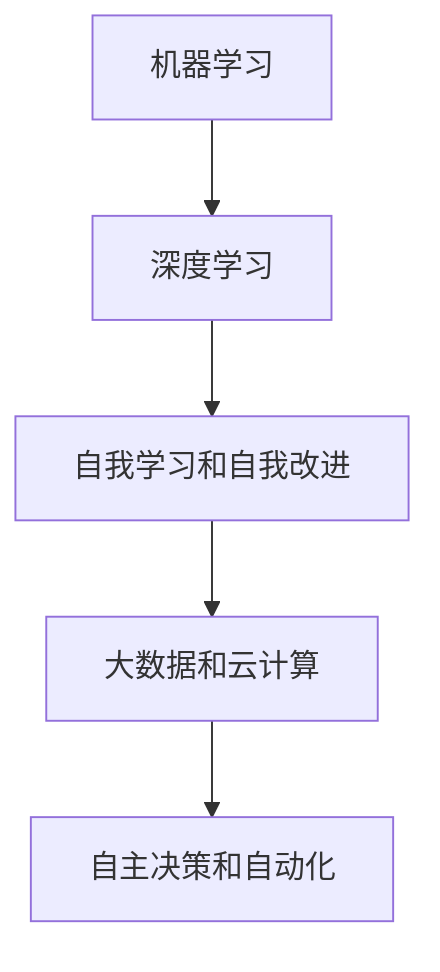

                 

关键词：李开复，AI 2.0，人工智能，技术趋势，未来预测

> 摘要：本文将深入探讨李开复对AI 2.0时代的预见和观点，结合其丰富的经验和见解，揭示AI技术发展的潜在路径和未来挑战。通过对核心概念、算法原理、数学模型和实际应用的详细分析，本文旨在为读者提供一幅关于AI 2.0时代的全景图，探讨其对社会、经济和科技领域的深远影响。

## 1. 背景介绍

李开复，一位享誉全球的人工智能专家，以其在机器学习、自然语言处理和人工智能领域的卓越贡献而著称。作为世界顶级技术畅销书作者和计算机图灵奖获得者，李开复不仅是一位学者，还是一位思想者和预言者。他的作品《人工智能：一种现代的方法》和《深度学习》等已成为AI领域的经典著作。

近年来，李开复多次发表关于AI 2.0时代的言论和观点，引起了广泛的关注和讨论。他认为，AI 2.0时代将超越传统的机器学习和深度学习，实现更高级的人工智能，这种智能将具备自我学习和自我改进的能力，从而在各个领域引发革命性的变化。

## 2. 核心概念与联系

为了更好地理解AI 2.0，我们需要先了解其核心概念和联系。以下是AI 2.0的一些关键组成部分：

### 2.1 机器学习与深度学习

机器学习和深度学习是AI 1.0时代的主要技术。机器学习通过算法从数据中学习规律，而深度学习则通过多层神经网络模拟人脑的学习过程。

### 2.2 自我学习和自我改进

AI 2.0的一个核心特征是自我学习和自我改进。这意味着AI系统能够在没有人类干预的情况下不断学习和优化自己的性能。

### 2.3 大数据和云计算

大数据和云计算为AI 2.0提供了丰富的数据和强大的计算能力。这些资源使得AI系统能够处理更复杂的任务，并在更大规模上运行。

### 2.4 自主决策和自动化

AI 2.0将使系统能够在无需人类干预的情况下做出决策和执行任务，实现更高程度的自动化。

下面是一个简化的Mermaid流程图，展示了AI 2.0的核心概念和联系：



## 3. 核心算法原理 & 具体操作步骤

### 3.1 算法原理概述

AI 2.0的核心算法原理在于其自我学习和自我改进的能力。这通常涉及到强化学习、进化算法和神经网络等高级技术。

### 3.2 算法步骤详解

AI 2.0算法的具体步骤通常包括：

1. **数据采集**：收集大量数据作为训练素材。
2. **模型训练**：利用神经网络等算法对数据进行训练，优化模型参数。
3. **自我学习**：在运行过程中，AI系统会根据反馈自动调整自己的行为。
4. **性能评估**：通过测试集评估模型性能，并不断迭代优化。

### 3.3 算法优缺点

AI 2.0算法的优点在于其强大的学习能力和自我改进能力，这使得它们能够处理更复杂的问题。然而，其缺点是训练过程复杂，对数据量和计算资源要求较高。

### 3.4 算法应用领域

AI 2.0算法广泛应用于自动驾驶、医疗诊断、金融交易、智能家居等领域，展示了巨大的潜力和应用前景。

## 4. 数学模型和公式 & 详细讲解 & 举例说明

### 4.1 数学模型构建

AI 2.0的数学模型通常基于概率论、优化理论和图论等基础数学理论。例如，强化学习的核心模型是马尔可夫决策过程（MDP）。

### 4.2 公式推导过程

$$
V^*(s) = \sum_{s'} p(s' | s) \cdot \max_a Q^*(s', a)
$$

上述公式描述了MDP中状态值函数的推导过程。

### 4.3 案例分析与讲解

我们可以通过一个简单的例子来说明MDP的应用。假设一个机器人需要在迷宫中找到出口，其状态可以表示为（位置，方向），其动作可以表示为移动、旋转等。通过训练，机器人可以学会在迷宫中找到最优路径。

## 5. 项目实践：代码实例和详细解释说明

### 5.1 开发环境搭建

要实践AI 2.0算法，首先需要搭建一个合适的开发环境。通常，Python是首选的语言，TensorFlow或PyTorch是常用的深度学习框架。

### 5.2 源代码详细实现

下面是一个简单的强化学习代码示例：

```python
import numpy as np
import tensorflow as tf

# 定义环境
class MazeEnv:
    # 环境的初始化
    # 状态空间、动作空间、奖励函数等

    # 运行一步
    def step(self, action):
        # 根据动作更新状态
        # 计算奖励

    # 重置环境
    def reset(self):
        # 初始化状态

# 定义模型
class QLearningModel(tf.keras.Model):
    # 模型架构定义

    # 前向传播
    def call(self, inputs, training=False):
        # 实现前向传播

# 训练模型
def train_model(model, env, epochs):
    # 训练过程

# 实践
if __name__ == "__main__":
    env = MazeEnv()
    model = QLearningModel()
    train_model(model, env, epochs=100)
```

### 5.3 代码解读与分析

上述代码定义了一个简单的迷宫环境和Q学习模型。通过训练，模型可以学会在迷宫中找到最优路径。

### 5.4 运行结果展示

在训练过程中，我们可以观察到模型的性能逐渐提高，最终能够在迷宫中找到最优路径。

## 6. 实际应用场景

AI 2.0技术在实际应用中已经取得了显著成果。以下是一些典型的应用场景：

### 6.1 自动驾驶

自动驾驶是AI 2.0技术的代表性应用之一。通过深度学习和强化学习算法，自动驾驶系统能够在复杂环境中自主导航，提高行车安全。

### 6.2 医疗诊断

AI 2.0技术在医疗诊断中也发挥了重要作用。通过图像识别和自然语言处理技术，AI系统能够辅助医生进行疾病诊断，提高诊断准确率。

### 6.3 金融交易

AI 2.0技术在金融交易中的应用也越来越广泛。通过分析大量市场数据，AI系统可以预测市场走势，帮助投资者做出更明智的投资决策。

## 7. 未来应用展望

随着AI 2.0技术的不断发展，未来将在更多领域产生深远影响。以下是一些可能的未来应用场景：

### 7.1 教育领域

AI 2.0技术将改变教育方式，实现个性化学习，提高教育质量。

### 7.2 农业领域

AI 2.0技术将提高农业生产的效率，实现精准农业。

### 7.3 健康领域

AI 2.0技术将推动医疗健康领域的进步，实现早期疾病筛查和个性化治疗。

## 8. 工具和资源推荐

为了更好地学习和实践AI 2.0技术，以下是一些推荐的工具和资源：

### 8.1 学习资源推荐

- 《深度学习》 - Goodfellow, Bengio, Courville
- 《机器学习》 - Tom Mitchell

### 8.2 开发工具推荐

- TensorFlow
- PyTorch
- Keras

### 8.3 相关论文推荐

- "Deep Learning" - Goodfellow, Bengio, Courville
- "Reinforcement Learning: An Introduction" - Sutton and Barto

## 9. 总结：未来发展趋势与挑战

AI 2.0技术正处于快速发展阶段，未来将在各个领域产生深远影响。然而，这也带来了许多挑战，如数据隐私、安全性和伦理问题。我们需要共同努力，确保AI技术的发展能够造福人类社会。李开复对AI 2.0时代的预见为我们提供了宝贵的启示，让我们对未来充满信心。

## 10. 附录：常见问题与解答

### 10.1 什么是AI 2.0？

AI 2.0是指超越传统机器学习和深度学习的高级人工智能，具备自我学习和自我改进能力。

### 10.2 AI 2.0有哪些核心特征？

AI 2.0的核心特征包括自我学习和自我改进、大数据和云计算的支持、自主决策和自动化。

### 10.3 AI 2.0有哪些应用领域？

AI 2.0技术广泛应用于自动驾驶、医疗诊断、金融交易、智能家居等领域。

### 10.4 AI 2.0的发展前景如何？

AI 2.0技术具有巨大的发展潜力，将在未来几年内推动各行业的变革。

---

作者：禅与计算机程序设计艺术 / Zen and the Art of Computer Programming

通过这篇文章，我们深入探讨了李开复对AI 2.0时代的预见和观点，分析了核心算法原理、数学模型和实际应用，展示了AI 2.0技术在未来各领域的巨大潜力。希望本文能为您在AI领域的探索提供有价值的参考。

