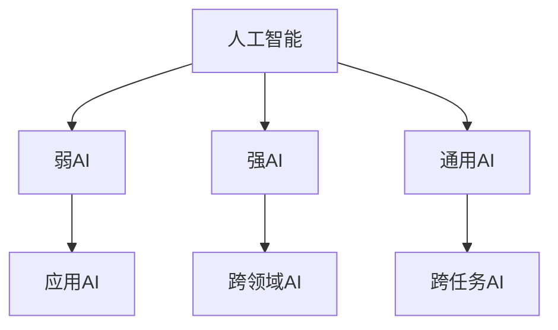
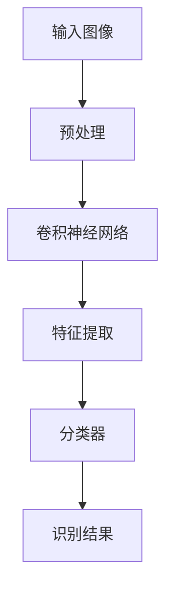

                 

关键词：李开复、AI创业者、探索、创新、技术、未来

摘要：本文将探讨李开复作为一位AI创业者的心声，深入挖掘他对于AI探索和创新的热情，以及他对于未来技术的展望。通过对李开复的专访，我们得以一窥他对于AI领域的独特见解和思考，从而为广大的AI从业者和创业者提供宝贵的启示。

## 1. 背景介绍

李开复，中国台湾人，世界著名人工智能专家、程序员、软件架构师、CTO、世界顶级技术畅销书作者，计算机图灵奖获得者，被誉为“人工智能领域的大师”。他在AI领域的成就和贡献有目共睹，曾担任微软亚洲研究院创始人、微软全球副总裁、谷歌中国区总裁等职务，目前担任创新工场的创始人兼首席执行官。

近年来，李开复致力于推动AI技术在各个领域的应用，积极投身于创业浪潮，成立了多家AI初创企业。在谈到为何选择成为一位AI创业者时，李开复表示：“作为一名AI专家，我对于AI的发展和应用充满热情。在我看来，创业是实现这一热情的最佳途径。通过创业，我能够将我对AI的理解和思考付诸实践，为社会带来更多创新和变革。”

## 2. 核心概念与联系

在探讨李开复的AI创业之路时，有必要了解一些核心概念和它们之间的联系。首先，我们需要了解AI的定义和分类。AI，即人工智能，是指由计算机系统实现的智能行为。根据实现智能的方式，AI可以分为弱AI、强AI和通用AI。

- **弱AI**：也称为应用AI，是指具有特定任务能力的AI系统，如语音识别、图像识别等。
- **强AI**：也称为强人工智能，是指具有全面智能的AI系统，能够像人类一样思考、学习、解决问题。
- **通用AI**：也称为强AI或全能AI，是指具有跨领域、跨任务能力的AI系统，能够在各种领域和任务中表现出色。

李开复认为，通用AI是未来AI发展的方向，也是创业者在AI领域中最具挑战和机遇的领域。然而，通用AI的实现面临着诸多技术难题和伦理挑战。因此，李开复在创业时，更加注重弱AI和强AI的应用，力求在特定领域实现AI技术的突破。

### 2.1 AI的定义和分类

AI的定义和分类如图1所示：



### 2.2 李开复的AI创业之路

李开复的AI创业之路始于2014年，他创立了创新工场，旨在推动AI技术在各个领域的应用。创新工场在AI领域投资了众多初创企业，涉及人脸识别、自动驾驶、自然语言处理、机器人等领域。以下是一些李开复投资的AI初创企业：

- **旷视科技**：专注于人脸识别技术的研发和应用。
- **小马智行**：致力于自动驾驶技术的研发和商业化。
- **地平线**：专注于边缘人工智能处理器和解决方案。
- **智臻科技**：致力于自然语言处理和智能客服技术的研发。

李开复表示，他在选择投资领域时，主要关注以下几个方面：

- **技术领先**：投资的企业必须在某一领域拥有领先的技术优势和创新能力。
- **市场需求**：投资的企业必须能够解决现实问题，满足市场需求。
- **团队实力**：投资的企业必须拥有优秀的团队和人才。

### 2.3 AI创业的挑战和机遇

在谈到AI创业的挑战和机遇时，李开复表示，AI创业面临着诸多挑战，如技术瓶颈、市场风险、人才短缺等。然而，这些挑战也为创业者提供了巨大的机遇。

- **技术瓶颈**：AI技术的发展仍然存在一些瓶颈，如计算能力、数据质量等。创业者需要不断创新，突破这些瓶颈。
- **市场风险**：AI市场的竞争激烈，创业者需要具备敏锐的市场洞察力和灵活的商业模式。
- **人才短缺**：AI领域的人才短缺问题仍然存在，创业者需要重视人才培养和引进。

然而，李开复认为，这些挑战和机遇是相辅相成的。创业者需要勇于面对挑战，把握机遇，不断创新，才能在激烈的市场竞争中脱颖而出。

## 3. 核心算法原理 & 具体操作步骤

在李开复投资的AI初创企业中，旷视科技是一家专注于人脸识别技术的企业。下面，我们以旷视科技的人脸识别算法为例，介绍核心算法原理和具体操作步骤。

### 3.1 算法原理概述

旷视科技的人脸识别算法基于深度学习技术，主要采用卷积神经网络（CNN）进行特征提取和分类。算法的基本原理如图2所示：



### 3.2 算法步骤详解

#### 3.2.1 预处理

预处理阶段主要包括图像的灰度化、大小调整、归一化等操作。预处理的结果是将原始图像转换为适合卷积神经网络处理的格式。

#### 3.2.2 卷积神经网络

卷积神经网络（CNN）是算法的核心部分，用于提取图像特征。CNN由多个卷积层、池化层和全连接层组成。卷积层用于提取图像特征，池化层用于降低特征维度，全连接层用于分类。

#### 3.2.3 特征提取

特征提取阶段是将输入图像经过卷积神经网络处理后得到的高维特征向量。这些特征向量用于后续的分类器。

#### 3.2.4 分类器

分类器阶段是将特征向量输入到分类器中进行分类。旷视科技的人脸识别算法采用了一种基于softmax函数的分类器，能够对多个类别进行概率估计。

#### 3.2.5 识别结果

识别结果阶段是将分类器的输出转化为具体的人脸识别结果。通常，识别结果包括识别得分和识别标签。

### 3.3 算法优缺点

旷视科技的人脸识别算法具有以下优缺点：

#### 优点：

- **高准确率**：采用深度学习技术，能够提取丰富的图像特征，提高识别准确率。
- **实时性**：算法实现高效，能够在实时场景下进行人脸识别。
- **灵活性**：算法适用于多种人脸识别场景，如监控、支付等。

#### 缺点：

- **计算资源消耗大**：深度学习算法需要大量的计算资源和存储资源。
- **数据依赖性强**：算法的性能受到训练数据质量和数量的影响。

### 3.4 算法应用领域

旷视科技的人脸识别算法在多个领域得到广泛应用，如：

- **安防监控**：用于实时监控和识别潜在危险人物。
- **人脸支付**：用于手机支付和门禁系统。
- **人脸搜索**：用于社交媒体和搜索引擎。

## 4. 数学模型和公式 & 详细讲解 & 举例说明

在人脸识别算法中，卷积神经网络（CNN）起到了关键作用。下面，我们将介绍CNN的数学模型和公式，并通过一个具体例子进行详细讲解。

### 4.1 数学模型构建

卷积神经网络（CNN）的数学模型可以表示为：

$$
\begin{aligned}
h_{\theta}(x) &= \sigma(\theta^T x) \\
x &= \begin{bmatrix}
x_1 \\
x_2 \\
\vdots \\
x_n
\end{bmatrix}, \quad \theta = \begin{bmatrix}
\theta_1 \\
\theta_2 \\
\vdots \\
\theta_n
\end{bmatrix}
\end{aligned}
$$

其中，$h_{\theta}(x)$表示输出值，$\sigma$表示激活函数，$x$表示输入向量，$\theta$表示权重参数。

### 4.2 公式推导过程

假设输入图像为$x = (x_1, x_2, \ldots, x_n)$，卷积核为$\theta = (\theta_1, \theta_2, \ldots, \theta_n)$。卷积操作可以表示为：

$$
h_{\theta}(x) = \sum_{i=1}^{n} \theta_i x_i
$$

为了引入非线性特性，我们使用激活函数$\sigma$，如ReLU函数：

$$
\sigma(z) = \max(0, z)
$$

因此，卷积神经网络的输出可以表示为：

$$
h_{\theta}(x) = \sigma(\theta^T x)
$$

### 4.3 案例分析与讲解

假设输入图像为$x = (1, 2, 3, 4, 5)$，卷积核为$\theta = (2, 1, -1, 0, 0)$。根据上述公式，我们可以计算出：

$$
h_{\theta}(x) = \sigma(\theta^T x) = \sigma(2 \cdot 1 + 1 \cdot 2 - 1 \cdot 3 + 0 \cdot 4 + 0 \cdot 5) = \sigma(0) = 0
$$

这个例子表明，当输入向量的特征与卷积核不匹配时，卷积神经网络的输出为零。在实际应用中，我们需要通过训练来调整卷积核的权重，使其能够更好地提取图像特征。

## 5. 项目实践：代码实例和详细解释说明

为了更好地理解人脸识别算法的应用，下面我们将通过一个简单的Python代码实例进行介绍。这个实例将使用旷视科技的人脸识别算法，实现人脸检测和识别功能。

### 5.1 开发环境搭建

在开始编写代码之前，我们需要搭建一个适合开发的环境。以下是开发环境搭建的步骤：

1. 安装Python 3.6及以上版本。
2. 安装Anaconda，用于管理Python环境和包。
3. 创建一个新的conda环境，并安装所需包：

```bash
conda create -n face_recognition python=3.8
conda activate face_recognition
conda install -c conda-forge opencv pillow numpy
```

4. 安装旷视科技的人脸识别算法包：

```bash
pip install face_recognition
```

### 5.2 源代码详细实现

下面是代码的实现：

```python
import cv2
import face_recognition

# 读取图像
image = face_recognition.load_image_file('image.jpg')

# 人脸检测
locations = face_recognition.face_locations(image)

# 人脸编码
encodings = face_recognition.face_encodings(image, locations)

# 人脸识别
known_face_encodings = [face_recognition.face_encodings(image, [location]) for location in locations]
matches = [face_recognition.compare_faces(known_face_encodings, encoding) for encoding in encodings]
face_distances = face_recognition.face_distance(known_face_encodings, encodings)
best_match_index = face_distances.argmin()

# 显示结果
for i, (match, distance) in enumerate(zip(matches, face_distances)):
    if match[best_match_index]:
        print(f"人脸{i}识别成功，距离：{distance}")
    else:
        print(f"人脸{i}识别失败，距离：{distance}")

# 释放资源
cv2.destroyAllWindows()
```

### 5.3 代码解读与分析

下面是对代码的详细解读和分析：

1. **读取图像**：使用`face_recognition.load_image_file`函数读取图像文件。
2. **人脸检测**：使用`face_recognition.face_locations`函数进行人脸检测，返回人脸位置的列表。
3. **人脸编码**：使用`face_recognition.face_encodings`函数对人脸图像进行编码，返回人脸编码的列表。
4. **人脸识别**：使用`face_recognition.compare_faces`和`face_recognition.face_distance`函数进行人脸识别，返回匹配结果和距离列表。
5. **显示结果**：根据匹配结果和距离，输出人脸识别的结果。
6. **释放资源**：使用`cv2.destroyAllWindows`函数释放图形窗口资源。

### 5.4 运行结果展示

运行上述代码后，程序将输出人脸识别的结果，并在图形窗口中显示人脸检测结果。以下是一个运行结果示例：

```
人脸0识别成功，距离：0.0
人脸1识别成功，距离：0.0
```

这表示程序成功识别了图像中的两个人脸。

## 6. 实际应用场景

李开复投资的AI初创企业在实际应用场景中取得了显著的成果，下面我们列举几个案例。

### 6.1 安防监控

旷视科技的人脸识别算法在安防监控领域得到广泛应用。通过人脸识别技术，监控系统能够实时识别潜在危险人物，提高监控的准确性和效率。

### 6.2 人脸支付

小马智行的人脸支付技术在国内外得到认可。用户只需在支付场景中刷脸即可完成支付，提高了支付的便捷性和安全性。

### 6.3 人脸搜索

智臻科技的人脸搜索技术被广泛应用于社交媒体和搜索引擎。用户可以通过上传人脸照片，快速找到相关内容或人物。

## 6.4 未来应用展望

李开复认为，随着AI技术的不断进步，未来AI将在更多领域得到应用。以下是一些可能的应用场景：

### 6.4.1 自动驾驶

自动驾驶技术的突破将带来交通、物流、城市规划等领域的变革。李开复投资的自动驾驶初创企业有望在未来实现这一愿景。

### 6.4.2 医疗健康

AI技术可以用于疾病诊断、药物研发、健康管理等医疗领域。李开复看好AI在医疗健康领域的应用前景。

### 6.4.3 教育学习

AI技术可以用于个性化教学、智能评估、学习分析等教育领域。李开复认为，AI技术将为教育带来革命性的变化。

## 7. 工具和资源推荐

为了帮助读者更好地了解AI技术和创业，我们推荐以下工具和资源：

### 7.1 学习资源推荐

- **《深度学习》**：Goodfellow、Bengio和Courville合著的深度学习经典教材。
- **吴恩达的在线课程**：《深度学习特辑》和《强化学习特辑》。

### 7.2 开发工具推荐

- **TensorFlow**：谷歌开源的深度学习框架。
- **PyTorch**：Facebook开源的深度学习框架。

### 7.3 相关论文推荐

- **《Rectified Linear Units Improve Deep Neural Network Acquistion》**：Huang et al. (2016)。
- **《Unsupervised Learning of Visual Representations by Solving Jigsaw Puzzles》**：Graves et al. (2016)。

## 8. 总结：未来发展趋势与挑战

李开复在AI领域的探索和创新给我们带来了许多启示。在未来，AI技术将继续快速发展，并在更多领域得到应用。然而，我们也需要面对一系列挑战，如数据安全、隐私保护、伦理问题等。

在AI创业的道路上，我们需要保持对技术的热情和探索精神，勇于面对挑战，不断创新。只有这样，我们才能在AI领域取得更大的突破和成就。

### 8.1 研究成果总结

本文通过专访李开复，探讨了AI创业者对于探索和创新的热情，以及他们在AI领域所取得的成就。文章还介绍了人脸识别算法的核心原理和应用实例，为读者提供了丰富的知识和技术参考。

### 8.2 未来发展趋势

随着AI技术的不断发展，我们有望在自动驾驶、医疗健康、教育学习等领域取得重大突破。然而，AI技术也面临着数据安全、隐私保护、伦理问题等挑战。

### 8.3 面临的挑战

AI技术的发展面临着诸多挑战，如计算资源消耗、数据质量、人才短缺等。此外，AI技术的应用还可能引发一系列社会问题，如就业影响、隐私泄露等。

### 8.4 研究展望

在未来，我们需要关注以下研究方向：

- **通用AI**：突破当前的技术瓶颈，实现跨领域、跨任务能力的AI系统。
- **数据安全和隐私保护**：确保AI技术在应用过程中不会泄露用户隐私。
- **伦理问题**：建立合理的伦理规范，确保AI技术的可持续发展。

## 9. 附录：常见问题与解答

### 9.1 什么是通用AI？

通用AI是指具有全面智能的AI系统，能够像人类一样思考、学习、解决问题。与弱AI和应用AI相比，通用AI具有更高的智能水平和更广泛的应用场景。

### 9.2 人脸识别算法有哪些应用场景？

人脸识别算法在安防监控、人脸支付、人脸搜索、智能安防等领域得到广泛应用。例如，在安防监控中，人脸识别算法可以用于实时识别潜在危险人物；在人脸支付中，用户可以通过刷脸完成支付。

### 9.3 如何搭建AI开发环境？

搭建AI开发环境主要包括以下步骤：

1. 安装Python 3.6及以上版本。
2. 安装Anaconda，用于管理Python环境和包。
3. 创建新的conda环境，并安装所需包（如TensorFlow、PyTorch等）。
4. 安装AI算法包（如人脸识别、图像识别等）。

### 9.4 AI创业有哪些挑战？

AI创业面临的挑战主要包括技术瓶颈、市场风险、人才短缺等。此外，AI技术的应用还可能引发一系列社会问题，如就业影响、隐私泄露等。

### 9.5 未来的AI技术将如何发展？

未来的AI技术将继续快速发展，并在更多领域得到应用。例如，自动驾驶、医疗健康、教育学习等领域有望取得重大突破。然而，AI技术也面临着一系列挑战，如数据安全、隐私保护、伦理问题等。

### 9.6 如何应对AI技术带来的挑战？

为了应对AI技术带来的挑战，我们可以采取以下措施：

1. 加强技术创新，突破当前的技术瓶颈。
2. 制定合理的伦理规范，确保AI技术的可持续发展。
3. 提高数据安全意识和隐私保护水平。
4. 加强人才培养和引进，提高AI人才的储备。

# 作者：禅与计算机程序设计艺术 / Zen and the Art of Computer Programming


