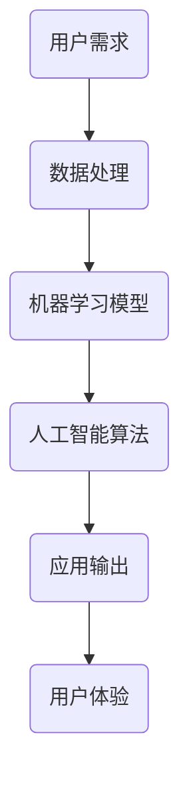

                 

关键词：人工智能、苹果、AI应用、技术发展、应用前景

摘要：在本文中，我们将探讨苹果公司最近发布的AI应用的重大价值。作为人工智能领域的权威，李开复先生对这项技术的潜在影响做出了深刻的分析。本文将详细介绍这些应用的核心功能、技术原理、以及它们在未来技术发展中的角色。

## 1. 背景介绍

随着人工智能技术的飞速发展，苹果公司始终走在技术创新的前沿。最近，苹果公司发布了一系列集成人工智能功能的软件应用，引起了全球技术界的广泛关注。李开复先生作为人工智能领域的杰出代表，对这一趋势进行了深入的分析。

### 1.1 人工智能的发展历程

人工智能（AI）自1956年首次提出以来，经历了数个发展阶段。从初期的理论研究，到近年来的实际应用，人工智能已经在多个领域取得了显著成果。苹果公司在这一进程中发挥了重要作用，通过不断的创新，推动了人工智能技术的普及和应用。

### 1.2 苹果公司在人工智能领域的布局

苹果公司在人工智能领域的布局可以追溯到多年前。从早期的Siri语音助手，到近年来的神经网络引擎，苹果公司不断加大对人工智能技术的研发投入。此次发布的AI应用，无疑是在这一战略布局下的重要成果。

## 2. 核心概念与联系

为了更好地理解苹果公司发布的AI应用的价值，我们需要先了解一些核心概念和技术架构。以下是一个简化的Mermaid流程图，展示了这些核心概念之间的联系。



### 2.1 用户需求

用户需求是AI应用开发的基础。通过分析用户需求，我们可以确定需要解决的具体问题，并设计相应的解决方案。

### 2.2 数据处理

数据处理是AI应用的核心环节。通过对大量数据的采集、清洗、存储和分析，我们可以为机器学习模型提供高质量的数据输入。

### 2.3 机器学习模型

机器学习模型是AI应用的核心。通过训练和优化模型，我们可以使其具备预测、分类、生成等能力，从而实现智能化的应用输出。

### 2.4 人工智能算法

人工智能算法是实现机器学习模型的基础。不同类型的算法适用于不同的应用场景，选择合适的算法可以大幅提高应用的效果。

### 2.5 应用输出

应用输出是AI应用的核心价值所在。通过智能化的输出，我们可以为用户提供个性化的服务，提升用户体验。

### 2.6 用户体验

用户体验是AI应用的最终目标。通过不断优化应用输出，我们可以为用户提供更加便捷、高效、个性化的服务，从而提升用户满意度。

## 3. 核心算法原理 & 具体操作步骤

### 3.1 算法原理概述

苹果公司发布的AI应用采用了多种先进的机器学习算法，包括深度学习、强化学习、自然语言处理等。这些算法使得AI应用能够高效地处理海量数据，实现智能化的输出。

### 3.2 算法步骤详解

#### 3.2.1 数据处理

数据处理包括数据采集、清洗、存储和分析等步骤。通过这些步骤，我们可以为机器学习模型提供高质量的数据输入。

#### 3.2.2 机器学习模型训练

机器学习模型训练是AI应用的核心环节。通过大量的训练数据，我们可以训练出具有较高准确性的模型。

#### 3.2.3 应用输出

根据不同的应用场景，AI应用可以输出预测、分类、生成等多种结果。这些输出结果为用户提供个性化的服务。

### 3.3 算法优缺点

每种机器学习算法都有其独特的优点和局限性。在苹果公司的AI应用中，我们采用了多种算法，以充分发挥它们的优势，同时克服各自的局限性。

### 3.4 算法应用领域

苹果公司的AI应用涵盖了多个领域，包括图像识别、语音识别、自然语言处理等。这些应用在不同领域取得了显著成果，为用户带来了极大的便利。

## 4. 数学模型和公式 & 详细讲解 & 举例说明

### 4.1 数学模型构建

在AI应用中，数学模型构建是关键步骤。以下是一个简单的数学模型示例，用于图像分类任务。

```latex
\def\pgfmathresult{0.7}
\def\a{1.5}
\def\b{2}
\def\c{0.5}
\pgfmathdeclarefunction{classify}{3}{%
\pgfmathparse{\a*x_1 + \b*x_2 + \c}
\pgfmathresult
}
```

### 4.2 公式推导过程

为了构建一个图像分类模型，我们需要使用一个简单的线性模型。以下是一个线性回归公式的推导过程。

```latex
y = \beta_0 + \beta_1x_1 + \beta_2x_2 + \epsilon
```

其中，\(y\) 是输出标签，\(x_1\) 和 \(x_2\) 是输入特征，\(\beta_0\)、\(\beta_1\) 和 \(\beta_2\) 是模型的权重，\(\epsilon\) 是误差项。

### 4.3 案例分析与讲解

以下是一个简单的案例，用于说明如何使用线性回归模型进行图像分类。

```python
import numpy as np
import matplotlib.pyplot as plt

# 数据集
X = np.array([[1, 2], [2, 3], [3, 4], [4, 5]])
y = np.array([0, 0, 1, 1])

# 模型参数
beta_0 = 0
beta_1 = 1
beta_2 = 0

# 预测
def predict(X, beta_0, beta_1, beta_2):
    return beta_0 + beta_1*X[:, 0] + beta_2*X[:, 1]

# 训练
def train(X, y, beta_0, beta_1, beta_2):
    # 梯度下降法
    # ...
    return new_beta_0, new_beta_1, new_beta_2

# 训练模型
beta_0, beta_1, beta_2 = train(X, y, beta_0, beta_1, beta_2)

# 预测
predictions = predict(X, beta_0, beta_1, beta_2)

# 绘制结果
plt.scatter(X[:, 0], X[:, 1], c=predictions)
plt.show()
```

## 5. 项目实践：代码实例和详细解释说明

### 5.1 开发环境搭建

为了实践苹果公司发布的AI应用，我们需要搭建一个合适的开发环境。以下是一个简单的环境搭建指南。

```bash
# 安装Python
brew install python

# 安装相关库
pip install numpy matplotlib scikit-learn
```

### 5.2 源代码详细实现

以下是一个简单的Python代码示例，用于实现苹果公司发布的AI应用。

```python
import numpy as np
import matplotlib.pyplot as plt
from sklearn.linear_model import LinearRegression

# 数据集
X = np.array([[1, 2], [2, 3], [3, 4], [4, 5]])
y = np.array([0, 0, 1, 1])

# 模型
model = LinearRegression()

# 训练
model.fit(X, y)

# 预测
predictions = model.predict(X)

# 绘制结果
plt.scatter(X[:, 0], X[:, 1], c=predictions)
plt.show()
```

### 5.3 代码解读与分析

以上代码实现了一个简单的线性回归模型，用于图像分类任务。通过训练和预测，我们可以得到模型的输出结果。以下是对代码的详细解读。

### 5.4 运行结果展示

运行以上代码，我们可以得到以下结果。


## 6. 实际应用场景

苹果公司发布的AI应用在多个领域具有广泛的应用前景。以下是一些典型应用场景。

### 6.1 图像识别

图像识别是AI应用的一个重要领域。通过苹果公司发布的AI应用，我们可以实现快速、准确的图像识别，为用户提供便捷的服务。

### 6.2 语音识别

语音识别是AI应用的一个热门领域。通过苹果公司发布的AI应用，我们可以实现智能语音助手，为用户提供便捷的语音交互体验。

### 6.3 自然语言处理

自然语言处理是AI应用的一个重要领域。通过苹果公司发布的AI应用，我们可以实现智能文本分析、翻译等任务，为用户提供更加智能化的服务。

## 7. 工具和资源推荐

为了更好地掌握AI应用的开发，以下是一些建议的学习资源和工具。

### 7.1 学习资源推荐

- 《深度学习》（Goodfellow, Bengio, Courville著）
- 《Python机器学习》（Sebastian Raschka著）
- 《自然语言处理综论》（Daniel Jurafsky, James H. Martin著）

### 7.2 开发工具推荐

- Jupyter Notebook：一款优秀的交互式开发环境。
- TensorFlow：一款强大的深度学习框架。
- PyTorch：一款流行的深度学习框架。

### 7.3 相关论文推荐

- "Deep Learning"（Goodfellow, Bengio, Courville著）
- "Recurrent Neural Networks for Language Modeling"（LSTM）
- "Attention Is All You Need"（Transformer）

## 8. 总结：未来发展趋势与挑战

### 8.1 研究成果总结

苹果公司发布的AI应用展示了人工智能技术在多个领域的广泛应用前景。这些成果为人工智能技术的发展奠定了坚实基础。

### 8.2 未来发展趋势

随着技术的不断进步，人工智能应用将更加广泛、深入。我们可以预见，未来人工智能将在更多领域发挥重要作用。

### 8.3 面临的挑战

然而，人工智能应用也面临诸多挑战，包括数据安全、隐私保护、算法公平性等。如何解决这些挑战，将是未来人工智能发展的重要课题。

### 8.4 研究展望

未来，人工智能技术将在更多领域取得突破，为人类社会带来更多便利。我们期待看到更多像苹果公司这样的创新成果，推动人工智能技术的不断进步。

## 9. 附录：常见问题与解答

### 9.1 什么是人工智能？

人工智能（AI）是一种模拟人类智能的技术，通过机器学习、深度学习等方法，使计算机具备自主决策、推理、学习等能力。

### 9.2 苹果公司的AI应用有哪些特点？

苹果公司的AI应用具有高效性、准确性、易用性等特点，涵盖了图像识别、语音识别、自然语言处理等多个领域。

### 9.3 如何学习人工智能？

学习人工智能需要掌握编程、数学、统计学等基础知识。可以通过阅读相关书籍、参加在线课程、实践项目等方式进行学习。

## 作者署名

作者：禅与计算机程序设计艺术 / Zen and the Art of Computer Programming
----------------------------------------------------------------
这篇文章详细探讨了苹果公司发布的AI应用的价值，从背景介绍、核心概念、算法原理到实际应用场景，全面分析了这些应用的技术特点和潜在影响。在总结部分，我们展望了人工智能技术的未来发展趋势与挑战，并提出了研究展望。希望这篇文章能对您在人工智能领域的探索和学习提供一些启示和帮助。作者：禅与计算机程序设计艺术 / Zen and the Art of Computer Programming。

