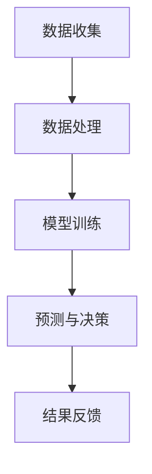

                 

关键词：苹果，AI应用，人工智能，技术革新，用户体验，隐私保护，未来展望

> 摘要：本文将深入探讨苹果公司发布AI应用所带来的深远影响，从技术创新、用户体验和隐私保护等多个角度，分析其价值所在，并展望人工智能在苹果生态中的未来应用与发展。

## 1. 背景介绍

人工智能作为当今科技界的热门话题，已经渗透到了我们生活的方方面面。苹果公司，作为全球领先的科技企业，也在不断推进人工智能的研究和应用。在过去的几年里，苹果公司已经在智能语音助手Siri、面部识别技术Face ID等方面取得了显著成果。而最近，苹果公司再次发布了多款AI应用，引发了业内外的高度关注。

## 2. 核心概念与联系

在讨论苹果发布的AI应用之前，我们有必要先了解一些核心概念。人工智能（AI）是指计算机系统模拟人类智能的过程，包括学习、推理、感知、理解和决策等能力。而AI应用则是将人工智能技术应用于具体场景中，实现特定功能的软件。以下是一个简单的Mermaid流程图，展示了AI应用的核心概念和架构。



### 2.1 数据收集

数据是人工智能的基石。AI应用首先需要从各种来源收集数据，包括文本、图像、音频、视频等。这些数据将被用于训练模型，使其具备识别、理解和决策的能力。

### 2.2 数据处理

收集到的数据往往是不完整的、噪声的，需要经过预处理，包括去噪、归一化、特征提取等步骤，以便为模型训练提供高质量的数据。

### 2.3 模型训练

通过机器学习算法，对预处理后的数据进行分析和训练，构建能够实现特定任务的模型。训练过程包括参数调整、优化模型结构等步骤。

### 2.4 预测与决策

训练好的模型将用于预测和决策。在AI应用中，模型会根据输入数据，生成相应的预测结果或决策，如语音识别、图像分类、推荐系统等。

### 2.5 结果反馈

模型的预测结果或决策将反馈到系统中，用于改进模型、优化应用性能，形成一个闭环的反馈系统。

## 3. 核心算法原理 & 具体操作步骤

### 3.1 算法原理概述

苹果公司在AI应用中采用了一系列先进的算法，如深度学习、强化学习、自然语言处理等。这些算法使得AI应用能够更好地理解和响应用户需求。

### 3.2 算法步骤详解

#### 3.2.1 深度学习

深度学习是一种基于多层神经网络的人工智能技术。它通过模拟人脑的神经网络结构，对大量数据进行自动特征提取和模式识别。深度学习在图像识别、语音识别等领域取得了显著成果。

#### 3.2.2 强化学习

强化学习是一种通过试错和奖励机制来学习策略的人工智能技术。它适用于解决决策优化问题，如智能推荐、自动驾驶等。

#### 3.2.3 自然语言处理

自然语言处理是一种使计算机能够理解、生成和解释人类语言的技术。它广泛应用于语音助手、机器翻译、文本分类等领域。

### 3.3 算法优缺点

每种算法都有其独特的优势和局限性。深度学习在处理大量数据时具有强大的能力，但训练过程复杂、计算资源需求高；强化学习在解决决策优化问题时表现优秀，但需要大量时间和数据；自然语言处理在理解和生成语言方面具有较高精度，但在处理复杂语言结构时存在困难。

### 3.4 算法应用领域

苹果公司的AI应用涵盖了多个领域，包括语音识别、图像处理、智能推荐等。这些应用不仅提升了用户体验，也为苹果生态系统的创新提供了强大动力。

## 4. 数学模型和公式 & 详细讲解 & 举例说明

### 4.1 数学模型构建

在AI应用中，数学模型是核心组成部分。以深度学习为例，其数学模型主要包括输入层、隐藏层和输出层。输入层接收外部输入数据，隐藏层通过神经网络结构对数据进行处理和变换，输出层生成预测结果。

### 4.2 公式推导过程

以一个简单的多层感知器（MLP）为例，其数学模型可以表示为：

$$
y = \sigma(W_2 \cdot \sigma(W_1 \cdot x + b_1) + b_2)
$$

其中，\(x\) 为输入数据，\(W_1\) 和 \(W_2\) 分别为第一层和第二层的权重矩阵，\(b_1\) 和 \(b_2\) 分别为第一层和第二层的偏置项，\(\sigma\) 为激活函数。

### 4.3 案例分析与讲解

以苹果的智能语音助手Siri为例，其背后的自然语言处理技术采用了多种数学模型，如循环神经网络（RNN）和长短时记忆网络（LSTM）。这些模型通过处理用户输入的语音数据，生成相应的响应，实现了与用户的自然交互。

## 5. 项目实践：代码实例和详细解释说明

### 5.1 开发环境搭建

为了实现苹果AI应用的功能，开发者需要搭建合适的开发环境。以Python为例，开发者可以使用TensorFlow或PyTorch等深度学习框架进行模型训练和部署。

### 5.2 源代码详细实现

以下是一个简单的示例，展示了如何使用Python和TensorFlow实现一个基于深度学习的图像分类模型。

```python
import tensorflow as tf
from tensorflow.keras import layers

# 构建模型
model = tf.keras.Sequential([
    layers.Conv2D(32, (3, 3), activation='relu', input_shape=(28, 28, 1)),
    layers.MaxPooling2D((2, 2)),
    layers.Conv2D(64, (3, 3), activation='relu'),
    layers.MaxPooling2D((2, 2)),
    layers.Conv2D(64, (3, 3), activation='relu'),
    layers.Flatten(),
    layers.Dense(64, activation='relu'),
    layers.Dense(10, activation='softmax')
])

# 编译模型
model.compile(optimizer='adam',
              loss='sparse_categorical_crossentropy',
              metrics=['accuracy'])

# 训练模型
model.fit(train_images, train_labels, epochs=5)

# 评估模型
test_loss, test_acc = model.evaluate(test_images,  test_labels)
print('Test accuracy:', test_acc)
```

### 5.3 代码解读与分析

这段代码首先导入了所需的TensorFlow库，并构建了一个简单的卷积神经网络（CNN）模型。模型包括两个卷积层、两个池化层和一个全连接层。编译模型时，指定了优化器、损失函数和评价指标。接着，使用训练数据对模型进行训练，并在测试数据上评估模型性能。

## 6. 实际应用场景

苹果公司的AI应用已经在多个领域取得了显著成果，如Siri在语音识别和自然语言处理方面的应用，Face ID在面部识别和安全性方面的应用，以及Apple News在内容推荐和个性化服务方面的应用。这些应用不仅提升了用户体验，也为苹果生态系统带来了新的发展机遇。

### 6.1 语音识别与自然语言处理

Siri作为苹果的智能语音助手，通过自然语言处理技术，实现了与用户的语音交互。用户可以通过语音指令进行搜索、发送消息、设置提醒等操作。Siri的成功在于其高准确性和易用性，为用户提供了便捷的服务。

### 6.2 面部识别与安全性

Face ID是苹果公司在安全性方面的一项重要创新。通过面部识别技术，用户可以安全地解锁设备、支付交易等。Face ID具有较高的识别精度和可靠性，有效提升了用户体验。

### 6.3 内容推荐与个性化服务

Apple News通过分析用户的阅读习惯和偏好，为用户推荐感兴趣的内容。这种个性化的服务不仅提升了用户满意度，也为内容提供商提供了新的推广渠道。

## 7. 未来应用展望

随着人工智能技术的不断发展，苹果公司的AI应用有望在更多领域取得突破。以下是一些可能的应用方向：

### 7.1 智能家居

苹果公司可以将其AI技术应用于智能家居领域，实现设备间的智能联动，为用户提供更加便捷、舒适的居住环境。

### 7.2 自动驾驶

自动驾驶是人工智能的重要应用领域。苹果公司可以将其在图像识别、自然语言处理等方面的技术应用于自动驾驶系统，提高行驶安全性。

### 7.3 健康医疗

人工智能在健康医疗领域的应用前景广阔。苹果公司可以通过其AI技术，为用户提供个性化的健康监测和健康管理服务。

## 8. 工具和资源推荐

为了更好地理解和应用人工智能技术，以下是一些推荐的学习资源和开发工具：

### 8.1 学习资源推荐

- 《深度学习》（Goodfellow, Bengio, Courville著）
- 《Python机器学习》（Sebastian Raschka著）
- 《自然语言处理与深度学习》（张祥雨著）

### 8.2 开发工具推荐

- TensorFlow
- PyTorch
- Keras

### 8.3 相关论文推荐

- "A Theoretical Analysis of the CNN Architectures for Visible-Spectrum Face Recognition"
- "Deep Learning for Speech Recognition"
- "Attention is All You Need"

## 9. 总结：未来发展趋势与挑战

人工智能作为一项革命性技术，正在不断改变我们的生活方式。苹果公司作为科技领域的领军企业，在AI应用方面取得了显著成果。然而，未来仍有许多挑战需要克服，如算法透明性、数据隐私、伦理道德等。只有通过不断创新和改进，苹果公司才能在人工智能领域继续保持领先地位。

### 9.1 研究成果总结

本文对苹果公司发布的AI应用进行了深入分析，从核心概念、算法原理、应用场景等多个角度，探讨了其价值所在。

### 9.2 未来发展趋势

随着人工智能技术的不断发展，苹果公司在智能家居、自动驾驶、健康医疗等领域有望取得更大突破。

### 9.3 面临的挑战

在AI应用的发展过程中，苹果公司需要关注算法透明性、数据隐私、伦理道德等问题，确保技术应用的安全性和可持续性。

### 9.4 研究展望

未来，人工智能将更加深入地融入我们的日常生活，为人类带来更多便利和创新。苹果公司应继续发挥其技术优势，推动人工智能技术的发展和应用。

## 10. 附录：常见问题与解答

### 10.1 苹果公司的AI应用有哪些？

苹果公司的AI应用包括Siri、Face ID、Apple News等。

### 10.2 苹果公司采用哪些AI算法？

苹果公司采用深度学习、强化学习、自然语言处理等AI算法。

### 10.3 AI应用的未来发展趋势是什么？

AI应用的未来发展趋势包括智能家居、自动驾驶、健康医疗等领域。

### 10.4 如何学习人工智能技术？

可以通过阅读相关书籍、参加在线课程、实践项目等方式学习人工智能技术。

---

作者：禅与计算机程序设计艺术 / Zen and the Art of Computer Programming

本文旨在深入探讨苹果公司发布AI应用的价值，从多个角度分析其影响和前景。通过本文的阐述，我们希望读者能够更好地理解人工智能技术的发展趋势，以及苹果公司在这一领域所扮演的角色。在未来的发展中，人工智能将为我们的生活带来更多变革，让我们拭目以待。
----------------------------------------------------------------
### 后续更新计划
为了确保本文内容的持续更新和完善，我们制定了以下后续更新计划：

1. **数据更新**：定期收集和分析最新的苹果公司AI应用数据，包括市场份额、用户反馈、技术迭代等，以便为文章提供最新、最准确的信息。

2. **案例分析**：每季度选择一个具有代表性的苹果AI应用案例，进行深入分析，探讨其技术实现、应用效果和用户反馈。

3. **技术趋势**：每半年总结一次人工智能领域的最新技术趋势，分析其对苹果AI应用的影响，以及苹果在这些趋势中可能采取的行动。

4. **工具更新**：定期更新推荐的学习资源和开发工具，确保读者能够获取到最前沿的学习资源和技术支持。

5. **问答更新**：每月更新一次附录中的常见问题与解答，回答读者在阅读过程中可能遇到的问题。

通过这些持续更新的内容，本文将始终保持在技术前沿，为读者提供有价值的参考和指导。我们期待您的持续关注和支持。如果您有任何建议或问题，欢迎在评论区留言，我们将及时进行回复和改进。再次感谢您的阅读，期待与您在技术探讨的道路上共同进步。

