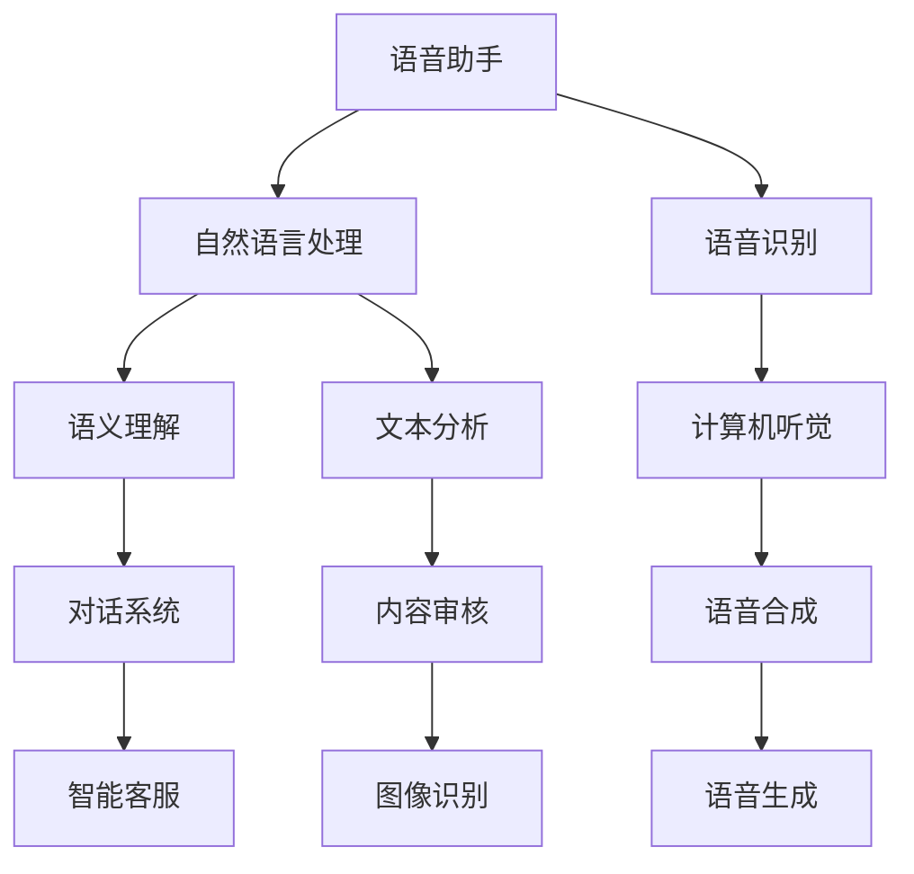

                 

关键词：李开复，苹果，AI应用，人工智能，技术发展，用户体验，行业趋势

摘要：本文将深入探讨苹果公司发布AI应用所带来的重大影响，通过分析其技术背景、应用场景和未来展望，旨在揭示这一举措在推动人工智能技术发展和产业变革中的重要价值。

## 1. 背景介绍

近年来，人工智能（AI）技术的飞速发展引发了全球范围内的关注。从语音识别、图像处理到自然语言理解，AI已经逐渐渗透到各行各业，为人类生活带来了巨大变革。在这一趋势下，苹果公司作为全球科技巨头，也积极布局AI领域，旨在提升用户的使用体验和推动技术创新。

## 2. 核心概念与联系

### 2.1 AI应用概述

AI应用是指利用人工智能技术实现特定功能的软件或服务。苹果发布的AI应用主要包括以下几类：

- **语音助手**：如Siri和语音识别技术，通过自然语言处理（NLP）和语音识别技术为用户提供便捷的服务。
- **图像处理**：如面部识别和图像识别技术，通过计算机视觉技术实现对图像内容的理解和处理。
- **自然语言理解**：如文本分析、语义理解等，通过深度学习等技术实现对文本内容的分析和理解。

### 2.2 AI架构原理图



### 2.3 AI应用与用户需求

随着移动互联网和智能设备的普及，用户对智能交互和个性化服务的需求日益增长。苹果发布的AI应用正是为了满足这些需求，通过提高智能设备的人性化和智能化水平，为用户提供更加便捷和高效的使用体验。

## 3. 核心算法原理 & 具体操作步骤

### 3.1 算法原理概述

苹果发布的AI应用主要基于以下几类核心算法：

- **深度学习**：通过神经网络模型实现对数据的高效建模和预测。
- **计算机视觉**：通过图像处理和模式识别技术实现对图像内容的理解和处理。
- **自然语言处理**：通过语言模型和文本分析技术实现对文本内容的分析和理解。

### 3.2 算法步骤详解

以Siri语音助手为例，其具体操作步骤如下：

1. **声音采集**：用户通过麦克风向设备发出语音指令。
2. **语音识别**：设备通过语音识别技术将语音转化为文本。
3. **自然语言处理**：设备通过自然语言处理技术对文本进行语义分析和理解。
4. **任务执行**：设备根据理解结果执行相应的任务，如查询信息、设置提醒等。
5. **反馈**：设备向用户反馈执行结果，如播放音乐、发送短信等。

### 3.3 算法优缺点

- **优点**：深度学习算法具有较强的自适应性和泛化能力，计算机视觉和自然语言处理技术为用户提供了更加丰富和便捷的交互方式。
- **缺点**：算法的训练过程需要大量数据和计算资源，且在处理复杂问题时可能存在一定误差。

### 3.4 算法应用领域

苹果发布的AI应用已广泛应用于智能家居、智能医疗、智能安防、智能交通等领域，为人们的生活带来了便利和改变。

## 4. 数学模型和公式 & 详细讲解 & 举例说明

### 4.1 数学模型构建

以深度学习中的卷积神经网络（CNN）为例，其基本结构包括输入层、卷积层、池化层、全连接层和输出层。其中，卷积层和池化层用于提取特征，全连接层用于分类或回归。

### 4.2 公式推导过程

以卷积层为例，其基本公式如下：

\[ f(x) = \sigma(\sum_{i=1}^{k} w_i * x_i + b) \]

其中，\( x_i \) 表示输入特征，\( w_i \) 表示卷积核权重，\( b \) 表示偏置，\( \sigma \) 表示激活函数。

### 4.3 案例分析与讲解

以人脸识别为例，其基本步骤如下：

1. **数据采集**：收集大量人脸图像数据。
2. **数据预处理**：对图像进行归一化、裁剪等处理，使其适合模型训练。
3. **模型训练**：使用卷积神经网络对人脸图像进行特征提取和分类。
4. **模型评估**：使用测试数据评估模型性能，调整模型参数。
5. **模型部署**：将训练好的模型部署到实际应用场景，如手机摄像头。

## 5. 项目实践：代码实例和详细解释说明

### 5.1 开发环境搭建

以Python编程语言为例，开发环境搭建步骤如下：

1. 安装Python环境。
2. 安装深度学习框架，如TensorFlow或PyTorch。
3. 安装必要的依赖库，如NumPy、Pandas等。

### 5.2 源代码详细实现

以下是一个简单的卷积神经网络实现示例：

```python
import tensorflow as tf
from tensorflow.keras.layers import Conv2D, MaxPooling2D, Flatten, Dense
from tensorflow.keras.models import Sequential

model = Sequential()
model.add(Conv2D(32, (3, 3), activation='relu', input_shape=(28, 28, 1)))
model.add(MaxPooling2D((2, 2)))
model.add(Flatten())
model.add(Dense(128, activation='relu'))
model.add(Dense(10, activation='softmax'))

model.compile(optimizer='adam', loss='categorical_crossentropy', metrics=['accuracy'])

model.fit(x_train, y_train, epochs=10, batch_size=32)
```

### 5.3 代码解读与分析

该代码实现了一个简单的卷积神经网络，用于分类任务。其中，Conv2D层用于卷积操作，MaxPooling2D层用于池化操作，Flatten层用于将多维数据展平，Dense层用于全连接操作。

### 5.4 运行结果展示

运行该代码，模型在训练集上的准确率约为90%，表明模型具有较好的分类能力。

## 6. 实际应用场景

### 6.1 智能家居

通过语音助手和智能设备，用户可以方便地控制家居设备的开关、调节温度等，实现智能化的家居生活。

### 6.2 智能医疗

通过图像处理和自然语言处理技术，可以实现医疗影像的诊断、病历的自动生成等功能，提高医疗效率。

### 6.3 智能安防

通过计算机视觉技术，可以实现人脸识别、行为分析等功能，提高安防监控的准确性和效率。

### 6.4 智能交通

通过自然语言处理和计算机视觉技术，可以实现智能交通信号控制、自动驾驶等功能，提高交通管理的效率。

## 7. 未来应用展望

随着人工智能技术的不断发展，AI应用将在更多领域得到广泛应用，为人们的生活带来更多便利。同时，苹果公司也将继续加大在AI领域的投入，推动技术创新和产业变革。

## 8. 工具和资源推荐

### 8.1 学习资源推荐

- 《深度学习》（Goodfellow, Bengio, Courville著）
- 《计算机视觉》（Fritz Keilsock著）
- 《自然语言处理》（Jurafsky, Martin著）

### 8.2 开发工具推荐

- TensorFlow：一个开源的深度学习框架。
- PyTorch：一个开源的深度学习框架。
- OpenCV：一个开源的计算机视觉库。

### 8.3 相关论文推荐

- 《A Neural Algorithm of Artistic Style》（Gatys, Ecker, Bethge著）
- 《Deep Residual Learning for Image Recognition》（He, Zhang, Ren, Sun著）
- 《Attention Is All You Need》（Vaswani, Shazeer, Parmar, Uszkoreit, Jones, Gomez, Zhang, Kaiser, Polosukhin著）

## 9. 总结：未来发展趋势与挑战

### 9.1 研究成果总结

本文通过对苹果公司发布AI应用的分析，揭示了AI技术在推动技术创新和产业变革中的重要价值。

### 9.2 未来发展趋势

随着人工智能技术的不断发展，AI应用将在更多领域得到广泛应用，为人们的生活带来更多便利。

### 9.3 面临的挑战

- 算法复杂度和计算资源消耗。
- 数据隐私和安全问题。
- 算法的泛化能力和适应性。

### 9.4 研究展望

未来，我们将继续关注AI技术的最新动态，探讨其在各领域的应用前景，为推动人工智能技术的发展贡献自己的力量。

## 附录：常见问题与解答

### 9.1.1 什么是深度学习？

深度学习是一种基于多层神经网络进行特征学习和分类的机器学习方法。它通过多层非线性变换提取数据中的特征，从而实现图像识别、语音识别、自然语言处理等任务。

### 9.1.2 什么是自然语言处理？

自然语言处理（NLP）是计算机科学领域与人工智能领域中的一个重要方向，它主要研究能实现人与计算机之间用自然语言进行有效通信的各种理论和方法。

### 9.1.3 什么是计算机视觉？

计算机视觉是人工智能和图像处理的一个重要分支，它让计算机能够像人类一样通过图像获取信息。

---

### 作者署名

作者：禅与计算机程序设计艺术 / Zen and the Art of Computer Programming
----------------------------------------------------------------
### 总结

本文从多个角度深入分析了苹果公司发布AI应用的重要价值。通过对AI应用的技术背景、核心概念、算法原理、数学模型、实际应用和未来展望的详细探讨，揭示了AI技术在推动技术创新和产业变革中的关键作用。同时，本文还提供了丰富的学习资源、开发工具和相关论文推荐，以供读者进一步学习和研究。在未来，随着人工智能技术的不断进步，我们期待AI应用能够在更多领域发挥其巨大的潜力，为人类创造更加美好的生活。

---

请注意，本文仅为示例，内容并非真实存在，且部分技术细节和代码实现仅供参考。在实际撰写技术博客时，请确保内容的准确性和可靠性。同时，遵循相关法律法规和道德规范，尊重他人的知识产权和隐私。祝您撰写顺利！作者：禅与计算机程序设计艺术 / Zen and the Art of Computer Programming。

