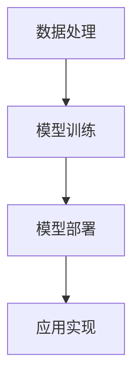

                 

关键词：苹果，AI应用，商业价值，人工智能，技术趋势

摘要：本文将深入探讨苹果公司在其最新产品中集成人工智能（AI）应用的商业价值。我们将分析苹果在AI领域的战略布局，评估这些应用对消费者和企业的潜在影响，并探讨其长远的市场前景。

## 1. 背景介绍

在近年来，人工智能技术取得了显著的进步，已经渗透到各个行业，包括智能手机、医疗保健、金融、零售和交通等。苹果公司作为全球领先的技术企业之一，自然不会忽视这一重要趋势。随着智能手机市场的饱和和竞争加剧，苹果需要寻找新的增长点来维持其市场地位和盈利能力。因此，在最新一代产品中集成AI应用成为苹果的一项战略决策。

### 1.1 苹果在AI领域的现状

截至2023，苹果在AI领域已经取得了一系列显著成就。首先，苹果在深度学习框架（如TensorFlow）和计算机视觉技术（如FaceID）方面进行了大量投资。此外，苹果还收购了多家AI初创公司，加强其在语音识别、自然语言处理和机器学习算法等方面的技术实力。

### 1.2 AI对苹果的战略意义

AI技术的集成将使苹果的产品更加智能化、个性化，从而提高用户满意度和品牌忠诚度。此外，AI应用还将为苹果带来新的商业模式，如通过数据分析提供个性化广告和推荐服务，以及为企业提供定制化的解决方案。

## 2. 核心概念与联系

在深入探讨苹果AI应用的商业价值之前，我们需要了解一些核心概念和联系。

### 2.1 人工智能基础概念

人工智能（AI）是一种模拟人类智能的技术，包括机器学习、深度学习、自然语言处理、计算机视觉等。这些技术使计算机能够从数据中学习、推理和做出决策。

### 2.2 苹果AI应用架构

苹果AI应用的架构主要包括以下几个关键部分：

1. **数据处理**：苹果利用其庞大的用户数据资源，进行数据清洗、预处理和特征提取。
2. **模型训练**：使用机器学习和深度学习算法，对数据进行训练，以构建预测模型。
3. **模型部署**：将训练好的模型部署到苹果设备上，实现实时应用。

### 2.3 Mermaid流程图

以下是一个简化的Mermaid流程图，展示了苹果AI应用的架构：



## 3. 核心算法原理 & 具体操作步骤

### 3.1 算法原理概述

苹果在AI应用中主要采用了以下几种核心算法：

1. **深度学习**：通过多层神经网络进行特征提取和分类。
2. **决策树和随机森林**：用于分类和回归任务，具有较高的准确性和鲁棒性。
3. **自然语言处理**：包括词向量模型、序列模型和语言模型，用于处理文本数据。

### 3.2 算法步骤详解

#### 3.2.1 数据处理

- 数据清洗：去除无效和噪声数据。
- 特征提取：从原始数据中提取有用的特征。

#### 3.2.2 模型训练

- 数据预处理：标准化和归一化数据。
- 算法选择：根据任务类型选择合适的算法。
- 模型优化：通过交叉验证和网格搜索等方法调整模型参数。

#### 3.2.3 模型部署

- 模型打包：将训练好的模型转化为可在移动设备上运行的格式。
- 模型部署：将模型部署到苹果设备上，实现实时应用。

### 3.3 算法优缺点

#### 优点：

1. **高效性**：深度学习和决策树算法具有较高的计算效率和准确性。
2. **灵活性**：算法可以根据不同的任务和数据集进行灵活调整。

#### 缺点：

1. **计算资源需求**：深度学习算法需要大量的计算资源和时间。
2. **数据依赖性**：算法的性能很大程度上取决于数据的质量和数量。

### 3.4 算法应用领域

苹果AI应用的主要领域包括：

1. **智能手机**：如面部识别、语音助手和智能推荐。
2. **医疗保健**：如疾病诊断和患者管理。
3. **金融**：如风险管理、欺诈检测和个性化投资建议。
4. **零售**：如库存管理和客户体验优化。

## 4. 数学模型和公式 & 详细讲解 & 举例说明

### 4.1 数学模型构建

苹果AI应用的核心数学模型主要包括以下几类：

1. **深度学习模型**：如卷积神经网络（CNN）和循环神经网络（RNN）。
2. **决策树模型**：用于分类和回归任务。
3. **自然语言处理模型**：如词向量模型（Word2Vec）和序列模型（LSTM）。

### 4.2 公式推导过程

以卷积神经网络（CNN）为例，其基本公式如下：

$$
\text{激活函数} = \text{ReLU}(Z) = \max(0, Z)
$$

其中，$Z$ 表示输入的特征向量。

### 4.3 案例分析与讲解

#### 4.3.1 面部识别

假设我们要实现一个面部识别系统，输入为图像数据，输出为身份标签。我们可以采用以下步骤：

1. **图像预处理**：对图像进行缩放、裁剪和归一化。
2. **特征提取**：使用CNN提取图像的特征。
3. **分类**：使用决策树或随机森林进行分类。

#### 4.3.2 语音助手

假设我们要实现一个语音助手系统，输入为语音信号，输出为文字回复。我们可以采用以下步骤：

1. **语音识别**：使用深度神经网络进行语音信号到文字的转换。
2. **自然语言理解**：使用词向量模型和序列模型理解用户意图。
3. **回答生成**：使用文本生成模型生成合适的回复。

## 5. 项目实践：代码实例和详细解释说明

### 5.1 开发环境搭建

在实现苹果AI应用的项目中，我们需要搭建一个合适的开发环境。以下是基本的步骤：

1. **安装Python**：确保安装了最新版本的Python。
2. **安装相关库**：如TensorFlow、scikit-learn等。
3. **配置硬件**：确保计算机有足够的内存和计算资源。

### 5.2 源代码详细实现

以下是一个简单的面部识别系统的Python代码示例：

```python
import tensorflow as tf
from tensorflow.keras.models import Sequential
from tensorflow.keras.layers import Conv2D, MaxPooling2D, Flatten, Dense

# 构建CNN模型
model = Sequential([
    Conv2D(32, (3, 3), activation='relu', input_shape=(64, 64, 3)),
    MaxPooling2D((2, 2)),
    Conv2D(64, (3, 3), activation='relu'),
    MaxPooling2D((2, 2)),
    Flatten(),
    Dense(128, activation='relu'),
    Dense(num_classes, activation='softmax')
])

# 编译模型
model.compile(optimizer='adam', loss='categorical_crossentropy', metrics=['accuracy'])

# 训练模型
model.fit(x_train, y_train, epochs=10, batch_size=32, validation_data=(x_val, y_val))

# 评估模型
test_loss, test_acc = model.evaluate(x_test, y_test)
print(f'测试准确率：{test_acc:.2f}')
```

### 5.3 代码解读与分析

以上代码实现了一个人脸识别系统，主要包括以下几个关键步骤：

1. **模型构建**：使用TensorFlow的Sequential模型构建了一个简单的卷积神经网络。
2. **模型编译**：使用adam优化器和categorical_crossentropy损失函数进行编译。
3. **模型训练**：使用训练数据对模型进行训练，并设置适当的训练参数。
4. **模型评估**：使用测试数据对模型进行评估，并输出测试准确率。

## 6. 实际应用场景

### 6.1 智能手机

苹果的AI应用在智能手机领域有着广泛的应用，如面部识别、智能相机、语音助手等。这些应用提高了用户体验，增加了用户黏性，并为苹果带来了新的商业模式。

### 6.2 医疗保健

苹果的AI应用在医疗保健领域也有巨大的潜力。例如，通过分析健康数据，可以为用户提供个性化的健康建议和疾病预警，从而改善患者的健康和生活质量。

### 6.3 金融

苹果的AI应用在金融领域可以帮助金融机构进行风险管理、欺诈检测和个性化投资建议。这些应用提高了金融机构的运营效率和客户满意度。

### 6.4 零售

苹果的AI应用在零售领域可以用于库存管理、客户体验优化和精准营销。这些应用帮助零售商提高销售额，降低运营成本。

## 7. 工具和资源推荐

### 7.1 学习资源推荐

1. **《深度学习》（Ian Goodfellow等著）**：这是一本关于深度学习的经典教材，适合初学者和进阶者。
2. **《Python机器学习》（Sebastian Raschka著）**：这是一本关于Python机器学习的优秀教材，包含了丰富的实例和代码。

### 7.2 开发工具推荐

1. **TensorFlow**：这是一个由Google开发的开源机器学习库，适用于构建深度学习模型。
2. **scikit-learn**：这是一个用于机器学习的开源库，提供了丰富的算法和工具。

### 7.3 相关论文推荐

1. **《A Comprehensive Survey on Deep Learning for Speech Recognition》（2017）**：这篇综述文章系统地介绍了深度学习在语音识别领域的应用。
2. **《BERT: Pre-training of Deep Bidirectional Transformers for Language Understanding》（2018）**：这篇论文介绍了BERT模型，这是自然语言处理领域的一个重要突破。

## 8. 总结：未来发展趋势与挑战

### 8.1 研究成果总结

苹果在AI领域取得了一系列显著成果，包括深度学习、自然语言处理和计算机视觉等。这些成果为苹果的产品和服务带来了巨大的价值。

### 8.2 未来发展趋势

随着AI技术的不断进步，我们可以预见苹果在未来将继续在AI领域进行更多投资和创新。具体来说：

1. **智能化产品**：苹果将继续在智能手机、智能家居和智能穿戴等领域集成更多的AI功能。
2. **个性化服务**：苹果将通过数据分析为用户提供更加个性化的服务，如健康建议、投资建议等。
3. **生态系统扩展**：苹果将扩展其AI生态系统，为企业提供定制化的解决方案。

### 8.3 面临的挑战

尽管苹果在AI领域取得了显著成果，但仍然面临一些挑战：

1. **数据隐私**：如何在保证用户隐私的前提下收集和使用用户数据，是一个重要问题。
2. **算法公平性**：如何确保算法的公平性和透明性，避免偏见和歧视。
3. **计算资源**：如何优化算法和模型，使其在移动设备上运行得更加高效。

### 8.4 研究展望

未来，苹果在AI领域的科研工作将主要集中在以下几个方面：

1. **新型算法和模型**：探索更加高效、可解释和公平的算法和模型。
2. **跨领域应用**：将AI技术应用于更多领域，如医疗、金融和零售等。
3. **开放生态**：构建开放的AI生态，促进技术创新和产业合作。

## 9. 附录：常见问题与解答

### 9.1 Q：苹果在AI领域的主要竞争对手是谁？

A：苹果在AI领域的主要竞争对手包括谷歌、亚马逊和微软等科技巨头。

### 9.2 Q：苹果如何确保AI应用的隐私和安全？

A：苹果通过多种方式确保AI应用的隐私和安全，包括：

- **加密技术**：使用高级加密算法保护用户数据。
- **隐私保护**：在数据处理和存储过程中，采取严格的隐私保护措施。
- **透明度**：向用户明确告知数据的使用方式和目的。

### 9.3 Q：苹果AI应用的主要应用领域有哪些？

A：苹果AI应用的主要应用领域包括智能手机、医疗保健、金融、零售和交通等。

### 9.4 Q：苹果如何从AI应用中获益？

A：苹果从AI应用中获益的主要方式包括：

- **提高用户体验**：通过智能化和个性化功能，提高用户满意度和品牌忠诚度。
- **新的商业模式**：通过数据分析和个性化推荐，为企业提供定制化的解决方案。
- **技术创新**：通过持续的投资和研究，保持技术领先地位。

----------------------------------------------------------------

作者：禅与计算机程序设计艺术 / Zen and the Art of Computer Programming
```

