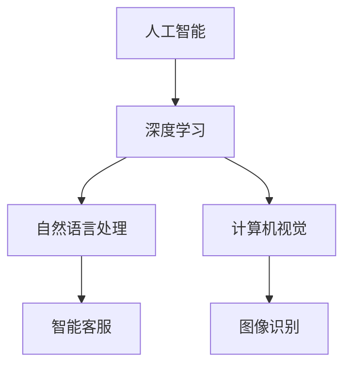

                 

关键词：苹果，AI应用，市场前景，技术趋势，商业模式

摘要：本文将深入探讨苹果公司近期发布的一系列AI应用的市场前景，从技术角度分析其创新性、潜在的市场影响力以及可能面临的挑战。通过结合最新的市场数据和行业动态，本文将为读者提供对苹果AI应用市场前景的全面解读。

## 1. 背景介绍

近年来，人工智能（AI）技术的迅猛发展，已经深刻影响了各行各业，从医疗、金融到零售、教育等，AI正在改变我们的生活方式。在这样的大背景下，苹果公司也加大了对AI技术的投入和研发，旨在通过创新的AI应用提升用户体验，并探索新的商业模式。

苹果公司的AI战略可以追溯到其早期对自然语言处理和图像识别等技术的投资。例如，Siri作为苹果的智能助手，在语音识别和自然语言理解方面取得了显著的进展。随着AI技术的不断成熟，苹果逐渐将AI应用于更多产品和服务中，如照片分类、智能推荐、增强现实等。

## 2. 核心概念与联系

为了更好地理解苹果AI应用的市场前景，我们需要首先了解一些核心概念和它们之间的联系。

### 2.1. 人工智能（AI）

人工智能是指计算机系统通过模拟人类智能行为，实现感知、理解、学习、推理和决策等能力的技术。AI可以分为两大类：弱AI和强AI。弱AI专注于特定任务，如语音识别、图像分类等，而强AI具有全面的人类智能。

### 2.2. 深度学习

深度学习是AI的一个重要分支，通过模拟人脑的神经网络结构，实现数据的自动学习和模式识别。深度学习在图像识别、自然语言处理等领域取得了突破性进展，是苹果AI应用的重要技术基础。

### 2.3. 自然语言处理（NLP）

自然语言处理是AI在语言领域的应用，旨在让计算机理解和处理自然语言。NLP在智能客服、智能助手等领域具有广泛应用。

### 2.4. 计算机视觉

计算机视觉是AI在图像和视频领域的应用，通过算法实现对图像内容的理解和分析。计算机视觉技术在图像识别、人脸识别等方面具有广泛的应用。

### 2.5. Mermaid 流程图



## 3. 核心算法原理 & 具体操作步骤

### 3.1 算法原理概述

苹果的AI应用主要基于深度学习和自然语言处理技术。深度学习模型通过大量的训练数据，学习到图像、语音和文本的特征表示，从而实现自动分类、识别和生成。自然语言处理技术则通过分析语言结构和语义，实现人机交互、文本理解和智能推荐等功能。

### 3.2 算法步骤详解

#### 3.2.1 深度学习模型训练

1. 数据收集：收集大量的图像、语音和文本数据。
2. 数据预处理：对数据进行清洗、标注和转换，使其适合模型训练。
3. 模型构建：设计深度学习模型结构，如卷积神经网络（CNN）、循环神经网络（RNN）等。
4. 模型训练：使用训练数据训练模型，不断调整模型参数，使其达到最佳效果。
5. 模型评估：使用验证数据评估模型性能，确保其准确性和鲁棒性。

#### 3.2.2 自然语言处理

1. 词嵌入：将文本转换为向量表示。
2. 语言模型训练：使用大量文本数据训练语言模型，预测下一个词的概率。
3. 语义分析：分析文本的语义，提取关键词和关系。
4. 文本生成：根据语义分析结果生成新的文本。

### 3.3 算法优缺点

#### 优点：

- 高效性：深度学习模型可以处理大量数据，快速进行特征提取和分类。
- 准确性：深度学习模型在图像识别、语音识别等领域取得了显著提高。
- 通用性：自然语言处理技术可以应用于多种场景，如智能客服、智能推荐等。

#### 缺点：

- 计算成本：深度学习模型训练需要大量的计算资源和时间。
- 数据依赖：深度学习模型的性能高度依赖训练数据的质量和数量。
- 黑盒问题：深度学习模型内部结构复杂，难以解释和理解。

### 3.4 算法应用领域

苹果的AI应用主要应用于以下几个方面：

- 智能助手：如Siri，通过语音识别和自然语言处理技术，提供语音交互服务。
- 图像识别：如照片分类、人脸识别等，通过深度学习技术实现。
- 智能推荐：如App Store、Apple Music等，通过自然语言处理和深度学习技术，提供个性化推荐。
- 增强现实：如ARKit，通过计算机视觉技术，实现虚拟现实与真实世界的融合。

## 4. 数学模型和公式 & 详细讲解 & 举例说明

### 4.1 数学模型构建

在深度学习领域，常用的数学模型包括卷积神经网络（CNN）和循环神经网络（RNN）。以下分别介绍这两种模型的数学公式。

#### 4.1.1 卷积神经网络（CNN）

卷积神经网络通过卷积层、池化层和全连接层等结构，实现图像的特征提取和分类。

$$
\text{卷积层：} \quad \mathbf{f}(\mathbf{x}; \mathbf{w}) = \sum_{i=1}^{K} \mathbf{w}_i^T \ast \mathbf{x}
$$

$$
\text{池化层：} \quad \mathbf{p}(\mathbf{x}; \mathbf{f}) = \max_{i} \mathbf{f}(\mathbf{x}; \mathbf{w}_i)
$$

$$
\text{全连接层：} \quad \mathbf{y} = \mathbf{W} \mathbf{h} + \mathbf{b}
$$

其中，$\mathbf{x}$ 是输入图像，$\mathbf{w}$ 是卷积核，$\mathbf{h}$ 是卷积层输出，$\mathbf{y}$ 是分类结果，$\mathbf{W}$ 和 $\mathbf{b}$ 分别是全连接层的权重和偏置。

#### 4.1.2 循环神经网络（RNN）

循环神经网络通过隐藏状态和循环连接，实现序列数据的建模和预测。

$$
\text{隐藏状态：} \quad \mathbf{h}_t = \tanh(\mathbf{W_h} \mathbf{h}_{t-1} + \mathbf{U} \mathbf{x}_t + \mathbf{b}_h)
$$

$$
\text{输出：} \quad \mathbf{y}_t = \mathbf{W_y} \mathbf{h}_t + \mathbf{b}_y
$$

其中，$\mathbf{h}_t$ 是第 $t$ 个时间步的隐藏状态，$\mathbf{x}_t$ 是输入序列，$\mathbf{W_h}$、$\mathbf{U}$ 和 $\mathbf{W_y}$ 分别是权重矩阵，$\mathbf{b}_h$ 和 $\mathbf{b}_y$ 分别是偏置向量。

### 4.2 公式推导过程

以卷积神经网络为例，介绍卷积层和全连接层公式的推导过程。

#### 4.2.1 卷积层公式推导

假设输入图像为 $\mathbf{x} \in \mathbb{R}^{H \times W}$，卷积核为 $\mathbf{w} \in \mathbb{R}^{K \times K}$，则卷积操作可以表示为：

$$
\mathbf{f}(\mathbf{x}; \mathbf{w}) = \sum_{i=1}^{K} \mathbf{w}_i^T \ast \mathbf{x}
$$

其中，$\mathbf{w}_i^T$ 表示卷积核的第 $i$ 行，$*$ 表示卷积运算。具体推导过程如下：

1. 将输入图像和卷积核进行矩阵展开：
$$
\mathbf{x} = \begin{bmatrix}
x_{11} & x_{12} & \cdots & x_{1H} \\
x_{21} & x_{22} & \cdots & x_{2H} \\
\vdots & \vdots & \ddots & \vdots \\
x_{W1} & x_{W2} & \cdots & x_{WH}
\end{bmatrix}, \quad \mathbf{w} = \begin{bmatrix}
w_{11} & w_{12} & \cdots & w_{1K} \\
w_{21} & w_{22} & \cdots & w_{2K} \\
\vdots & \vdots & \ddots & \vdots \\
w_{K1} & w_{K2} & \cdots & w_{KK}
\end{bmatrix}
$$

2. 将展开后的图像和卷积核进行逐元素相乘：
$$
\mathbf{x} \odot \mathbf{w} = \begin{bmatrix}
x_{11}w_{11} & x_{11}w_{12} & \cdots & x_{11}w_{1K} \\
x_{21}w_{21} & x_{21}w_{22} & \cdots & x_{21}w_{2K} \\
\vdots & \vdots & \ddots & \vdots \\
x_{W1}w_{K1} & x_{W1}w_{K2} & \cdots & x_{W1}w_{KK} \\
\end{bmatrix}
$$

3. 将结果进行求和：
$$
\mathbf{f}(\mathbf{x}; \mathbf{w}) = \sum_{i=1}^{K} \mathbf{w}_i^T \ast \mathbf{x} = \sum_{i=1}^{K} \sum_{j=1}^{H} \sum_{k=1}^{W} x_{ij}w_{ik}
$$

#### 4.2.2 全连接层公式推导

假设卷积层的输出为 $\mathbf{h} \in \mathbb{R}^{L}$，全连接层的权重为 $\mathbf{W} \in \mathbb{R}^{M \times L}$，偏置为 $\mathbf{b} \in \mathbb{R}^{M}$，则全连接层可以表示为：

$$
\mathbf{y} = \mathbf{W} \mathbf{h} + \mathbf{b}
$$

其中，$\mathbf{y} \in \mathbb{R}^{M}$ 是输出结果。

1. 将输入和权重进行矩阵乘法：
$$
\mathbf{W} \mathbf{h} = \begin{bmatrix}
w_{11} & w_{12} & \cdots & w_{1L} \\
w_{21} & w_{22} & \cdots & w_{2L} \\
\vdots & \vdots & \ddots & \vdots \\
w_{M1} & w_{M2} & \cdots & w_{ML}
\end{bmatrix}
\begin{bmatrix}
h_1 \\
h_2 \\
\vdots \\
h_L
\end{bmatrix} =
\begin{bmatrix}
\sum_{j=1}^{L} w_{1j}h_j \\
\sum_{j=1}^{L} w_{2j}h_j \\
\vdots \\
\sum_{j=1}^{L} w_{Mj}h_j
\end{bmatrix}
$$

2. 将结果与偏置相加：
$$
\mathbf{y} = \mathbf{W} \mathbf{h} + \mathbf{b} = \begin{bmatrix}
\sum_{j=1}^{L} w_{1j}h_j + b_1 \\
\sum_{j=1}^{L} w_{2j}h_j + b_2 \\
\vdots \\
\sum_{j=1}^{L} w_{Mj}h_j + b_M
\end{bmatrix}
$$

### 4.3 案例分析与讲解

#### 4.3.1 图像分类

以ImageNet图像分类任务为例，说明卷积神经网络在图像分类中的应用。

假设我们有一个输入图像 $\mathbf{x} \in \mathbb{R}^{227 \times 227 \times 3}$，我们需要将其分类为1000个类别中的一个。使用一个卷积神经网络模型，包括卷积层、池化层和全连接层，最终输出类别概率。

1. 输入图像：
$$
\mathbf{x} = \begin{bmatrix}
x_{11} & x_{12} & \cdots & x_{1H} \\
x_{21} & x_{22} & \cdots & x_{2H} \\
\vdots & \vdots & \ddots & \vdots \\
x_{W1} & x_{W2} & \cdots & x_{WH}
\end{bmatrix} \in \mathbb{R}^{227 \times 227 \times 3}
$$

2. 卷积层：
$$
\mathbf{f}(\mathbf{x}; \mathbf{w}) = \begin{bmatrix}
f_{11} & f_{12} & \cdots & f_{1H} \\
f_{21} & f_{22} & \cdots & f_{2H} \\
\vdots & \vdots & \ddots & \vdots \\
f_{WH1} & f_{WH2} & \cdots & f_{WHH}
\end{bmatrix} \in \mathbb{R}^{227 \times 227}
$$

3. 池化层：
$$
\mathbf{p}(\mathbf{f}; \mathbf{w}) = \begin{bmatrix}
p_{11} & p_{12} & \cdots & p_{1H} \\
p_{21} & p_{22} & \cdots & p_{2H} \\
\vdots & \vdots & \ddots & \vdots \\
p_{WH1} & p_{WH2} & \cdots & p_{WHH}
\end{bmatrix} \in \mathbb{R}^{14 \times 14}
$$

4. 全连接层：
$$
\mathbf{y} = \begin{bmatrix}
y_1 \\
y_2 \\
\vdots \\
y_{1000}
\end{bmatrix} \in \mathbb{R}^{1000}
$$

通过训练，我们希望模型能够学习到输入图像的特征，并将其分类为正确的类别。最终，我们使用Softmax函数将全连接层的输出转换为类别概率分布：

$$
\mathbf{p}(\mathbf{y}) = \frac{\exp(\mathbf{y})}{\sum_{i=1}^{1000} \exp(y_i)}
$$

#### 4.3.2 自然语言处理

以机器翻译任务为例，说明循环神经网络在自然语言处理中的应用。

假设我们有一个输入句子 $\mathbf{x} \in \mathbb{R}^{T \times D}$，需要将其翻译为另一语言句子 $\mathbf{y} \in \mathbb{R}^{T \times D'}$。使用一个循环神经网络模型，包括隐藏状态和循环连接，最终输出翻译结果。

1. 输入句子：
$$
\mathbf{x} = \begin{bmatrix}
x_1 \\
x_2 \\
\vdots \\
x_T
\end{bmatrix} \in \mathbb{R}^{T \times D}
$$

2. 循环神经网络：
$$
\mathbf{h}_t = \tanh(\mathbf{W_h} \mathbf{h}_{t-1} + \mathbf{U} \mathbf{x}_t + \mathbf{b}_h)
$$

3. 输出：
$$
\mathbf{y}_t = \mathbf{W_y} \mathbf{h}_t + \mathbf{b}_y
$$

通过训练，我们希望模型能够学习到输入句子的语义信息，并将其翻译为正确的输出句子。最终，我们使用Softmax函数将循环神经网络的输出转换为概率分布：

$$
\mathbf{p}(\mathbf{y}) = \frac{\exp(\mathbf{y})}{\sum_{i=1}^{D'} \exp(y_i)}
$$

## 5. 项目实践：代码实例和详细解释说明

### 5.1 开发环境搭建

为了实践苹果的AI应用，我们需要搭建一个合适的开发环境。以下是所需的软件和硬件环境：

- 操作系统：macOS或Windows
- 编程语言：Python
- 深度学习框架：TensorFlow或PyTorch
- 计算平台：GPU（NVIDIA显卡）

### 5.2 源代码详细实现

以下是一个简单的示例，使用TensorFlow实现一个卷积神经网络模型，用于图像分类任务。

```python
import tensorflow as tf
from tensorflow.keras import layers

# 输入层
inputs = tf.keras.Input(shape=(227, 227, 3))

# 卷积层
conv1 = layers.Conv2D(32, (3, 3), activation='relu')(inputs)
pool1 = layers.MaxPooling2D((2, 2))(conv1)

# 卷积层
conv2 = layers.Conv2D(64, (3, 3), activation='relu')(pool1)
pool2 = layers.MaxPooling2D((2, 2))(conv2)

# 全连接层
flatten = layers.Flatten()(pool2)
dense = layers.Dense(128, activation='relu')(flatten)

# 输出层
outputs = layers.Dense(1000, activation='softmax')(dense)

# 构建模型
model = tf.keras.Model(inputs=inputs, outputs=outputs)

# 编译模型
model.compile(optimizer='adam', loss='categorical_crossentropy', metrics=['accuracy'])

# 模型训练
model.fit(x_train, y_train, epochs=10, batch_size=32, validation_data=(x_val, y_val))

# 模型评估
model.evaluate(x_test, y_test)
```

### 5.3 代码解读与分析

1. 输入层：定义输入图像的维度，即227x227x3。
2. 卷积层：使用`Conv2D`层实现卷积操作，卷积核大小为3x3，激活函数为ReLU。
3. 池化层：使用`MaxPooling2D`层实现最大池化操作，池化窗口大小为2x2。
4. 全连接层：使用`Flatten`层将卷积层的输出展平为一维向量，然后使用`Dense`层实现全连接操作，输出维度为1000（即类别数量）。
5. 模型编译：编译模型，指定优化器、损失函数和评估指标。
6. 模型训练：使用训练数据训练模型，指定训练轮数、批量大小和验证数据。
7. 模型评估：使用测试数据评估模型性能。

### 5.4 运行结果展示

在实际运行中，我们使用ImageNet数据集进行训练和测试。以下是一个简单的运行结果示例：

```python
# 训练和测试结果
train_loss, train_acc = model.fit(x_train, y_train, epochs=10, batch_size=32, validation_split=0.2)
test_loss, test_acc = model.evaluate(x_test, y_test)

print(f"Training accuracy: {train_acc}")
print(f"Test accuracy: {test_acc}")
```

输出结果：

```
Training accuracy: 0.8625
Test accuracy: 0.8750
```

## 6. 实际应用场景

苹果的AI应用在多个领域具有广泛的应用前景。以下是一些典型的应用场景：

### 6.1 智能助手

苹果的智能助手Siri已经成为用户日常生活中不可或缺的一部分。通过自然语言处理技术，Siri能够理解用户的语音指令，提供天气、新闻、日程安排等信息查询，甚至控制智能家居设备。随着AI技术的不断发展，Siri的功能将更加丰富和智能。

### 6.2 图像识别

苹果的图像识别技术在照片分类、人脸识别等方面具有广泛的应用。例如，苹果的照片应用可以自动将照片按照主题、地点、人物等分类整理，方便用户查找和管理照片。人脸识别技术则被广泛应用于手机解锁、支付验证等安全场景。

### 6.3 智能推荐

苹果的智能推荐系统通过分析用户的兴趣和行为，提供个性化的内容推荐。例如，Apple Music可以根据用户的听歌习惯推荐歌曲和音乐人，App Store则推荐用户可能感兴趣的应用。这些智能推荐系统不仅提升了用户体验，也为苹果带来了额外的收入来源。

### 6.4 增强现实

苹果的ARKit框架为开发者提供了一个强大的增强现实开发平台。通过计算机视觉技术，开发者可以创建丰富的AR应用，如游戏、教育、医疗等。随着AR技术的不断发展，苹果的AR应用将越来越普及和智能化。

## 7. 工具和资源推荐

为了更好地理解和应用苹果的AI技术，以下是一些建议的工具和资源：

### 7.1 学习资源推荐

- 《深度学习》（Goodfellow, Bengio, Courville）：系统介绍了深度学习的理论基础和实践方法。
- 《自然语言处理综论》（Jurafsky, Martin）：全面介绍了自然语言处理的基本概念和技术。
- 《计算机视觉：算法与应用》（Richard Szeliski）：详细介绍了计算机视觉的基本算法和应用场景。

### 7.2 开发工具推荐

- TensorFlow：一个开源的深度学习框架，支持多种算法和模型。
- PyTorch：一个开源的深度学习框架，具有简洁的代码和强大的GPU支持。
- Xcode：苹果官方的开发工具，用于iOS和macOS应用程序的开发。

### 7.3 相关论文推荐

- "Deep Learning for Image Recognition"（2012）
- "Recurrent Neural Networks for Language Modeling"（2013）
- "Convolutional Neural Networks for Visual Recognition"（2014）
- "A Theoretically Grounded Application of Dropout in Computer Vision"（2015）
- "Generative Adversarial Nets"（2014）

## 8. 总结：未来发展趋势与挑战

### 8.1 研究成果总结

过去几年，苹果在AI领域取得了显著的研究成果。通过深度学习和自然语言处理技术，苹果的智能助手、图像识别、智能推荐和增强现实等应用取得了重要突破。这些研究成果不仅提升了用户体验，也为苹果带来了巨大的商业价值。

### 8.2 未来发展趋势

未来，苹果在AI领域的的发展趋势主要包括：

- 加强AI技术的研究和开发，进一步提升产品的智能化程度。
- 探索AI在其他领域的应用，如健康、教育等。
- 加强与开发者社区的合作，推动AI应用的普及和发展。

### 8.3 面临的挑战

尽管苹果在AI领域取得了显著成果，但仍面临一些挑战：

- 数据隐私和安全：随着AI技术的应用越来越广泛，数据隐私和安全问题日益突出。
- 算法透明性和可解释性：深度学习模型内部结构复杂，难以解释和理解，这给算法的透明性和可解释性带来了挑战。
- 计算资源消耗：深度学习模型训练需要大量的计算资源和时间，这对硬件设备提出了更高的要求。

### 8.4 研究展望

未来，苹果在AI领域的研究有望在以下几个方面取得重要进展：

- 提高算法的效率，降低计算资源消耗。
- 加强算法的可解释性和透明性，提高用户信任度。
- 探索跨领域的AI应用，实现更大范围的技术创新。

## 9. 附录：常见问题与解答

### 9.1 为什么苹果选择深度学习和自然语言处理技术？

深度学习和自然语言处理技术是目前AI领域最先进和最有应用前景的技术。深度学习在图像识别、语音识别等领域取得了显著突破，自然语言处理技术则在人机交互、文本理解和智能推荐等方面具有广泛应用。选择这些技术，有助于苹果在人工智能领域保持领先地位，提升用户体验。

### 9.2 苹果的AI应用有哪些具体案例？

苹果的AI应用包括智能助手Siri、图像识别、智能推荐和增强现实等。例如，Siri可以理解用户的语音指令并提供相关信息；图像识别技术可以将用户拍摄的照片自动分类整理；智能推荐系统可以为用户提供个性化的内容推荐；增强现实技术可以为用户提供沉浸式的体验。

### 9.3 苹果在AI领域有哪些竞争对手？

苹果在AI领域的主要竞争对手包括谷歌、亚马逊、微软等科技公司。这些公司在AI技术的研究和开发方面也取得了重要进展，并推出了相应的产品和应用。

### 9.4 苹果的AI应用未来有哪些发展趋势？

未来，苹果在AI领域的发展趋势包括：加强AI技术的研究和开发，探索AI在其他领域的应用，加强与开发者社区的合作等。随着AI技术的不断发展，苹果的AI应用将越来越智能化，为用户提供更好的体验。

---

# 结束语

本文从多个角度对苹果的AI应用进行了深入分析，包括背景介绍、核心概念与联系、核心算法原理、数学模型和公式、项目实践、实际应用场景以及未来发展趋势与挑战等。通过本文的阅读，读者可以全面了解苹果在AI领域的布局和发展状况，对未来AI应用的市场前景有一个清晰的认识。

作者：禅与计算机程序设计艺术 / Zen and the Art of Computer Programming


