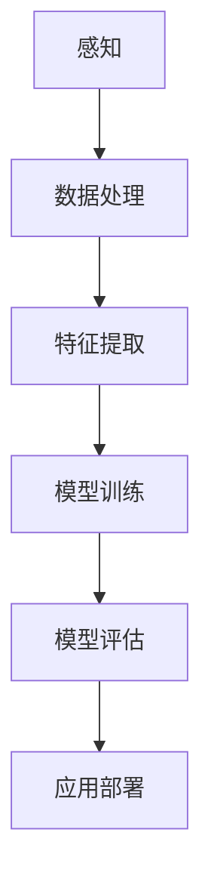

                 

关键词：苹果、AI应用、人工智能、技术、创新

摘要：在科技领域，人工智能的应用正逐步渗透到各个行业中，推动着技术的不断革新。本文将探讨苹果公司最近发布的AI应用，分析其对市场的影响，以及未来人工智能在科技领域的应用前景。

## 1. 背景介绍

人工智能（AI）作为当前科技领域的研究热点，正迅速发展，并开始影响我们日常生活的方方面面。从自动驾驶到智能家居，从医疗诊断到金融服务，AI技术的应用正不断拓展其边界。在这股科技浪潮中，苹果公司作为全球知名的科技公司，自然不会缺席。苹果近年来在AI领域进行了大量的研发和投资，此次发布的AI应用无疑是其在该领域的一次重要举措。

## 2. 核心概念与联系

在探讨苹果发布的AI应用之前，我们需要理解一些核心概念。首先，什么是人工智能？人工智能是一门研究、开发用于模拟、延伸和扩展人的智能的理论、方法、技术及应用的科学。简单来说，人工智能就是让机器具备类似于人类的智能。

接下来，我们需要了解AI应用的基本原理。AI应用通常基于机器学习（Machine Learning）和深度学习（Deep Learning）等技术，通过对大量数据进行训练，使得机器能够从数据中学习，并自主地做出决策。

### 2.1 人工智能原理

人工智能的基本原理包括感知、思考、学习和决策。感知是指机器能够通过传感器感知外部环境；思考是指机器能够根据感知到的信息进行逻辑推理；学习是指机器能够从经验中学习和优化自身；决策是指机器能够根据学习的经验做出最优决策。

### 2.2 机器学习原理

机器学习是人工智能的一个重要分支，其基本原理是通过对大量数据进行训练，使得机器能够从数据中学习并做出预测。机器学习主要包括监督学习、无监督学习和强化学习三种类型。

- 监督学习：在监督学习场景中，机器学习算法需要根据已知的输入和输出数据进行训练，以便在未知的数据上做出准确的预测。
- 无监督学习：在无监督学习场景中，机器学习算法不需要已知的输出数据，而是通过分析输入数据中的模式或结构来进行学习。
- 强化学习：在强化学习场景中，机器通过与环境的交互来学习如何获得最大的回报。

### 2.3 深度学习原理

深度学习是机器学习的一种重要方法，它通过构建深度神经网络（Deep Neural Networks）来模拟人脑的神经网络结构，从而实现对复杂任务的自动化处理。深度学习的基本原理包括神经元、激活函数和反向传播算法。

- 神经元：神经元是神经网络的基本单元，它通过接收输入信号并产生输出信号来完成特定的计算任务。
- 激活函数：激活函数用于决定神经元是否被激活，常见的激活函数包括Sigmoid函数、ReLU函数和Tanh函数。
- 反向传播算法：反向传播算法是一种用于训练神经网络的学习算法，它通过不断调整网络的权重和偏置，使得网络在训练数据上的预测结果更加准确。

### 2.4 Mermaid 流程图

以下是AI应用的基本架构流程：



在这个流程中，机器首先通过感知模块获取外部环境的信息，然后通过数据处理模块对信息进行处理，接着通过特征提取模块提取关键特征，然后通过模型训练模块训练深度学习模型，最后通过模型评估模块评估模型的性能，并最终将模型部署到实际应用场景中。

## 3. 核心算法原理 & 具体操作步骤

### 3.1 算法原理概述

苹果公司此次发布的AI应用主要基于深度学习技术，特别是卷积神经网络（Convolutional Neural Networks，CNN）和循环神经网络（Recurrent Neural Networks，RNN）。CNN擅长处理图像和视频等具有结构化特征的数据，而RNN擅长处理序列数据，如文本和语音。

### 3.2 算法步骤详解

1. **数据收集**：首先需要收集大量的图像和文本数据，以便进行模型的训练。
2. **数据处理**：对收集到的数据进行清洗和预处理，包括去除噪声、调整数据格式等。
3. **特征提取**：使用CNN和RNN提取图像和文本数据中的关键特征。
4. **模型训练**：使用提取到的特征对深度学习模型进行训练，包括网络的初始化、参数的调整和优化等。
5. **模型评估**：使用训练数据对模型进行评估，以确定模型的性能。
6. **应用部署**：将训练好的模型部署到实际应用场景中，如手机应用、云端服务等。

### 3.3 算法优缺点

深度学习模型的优点包括：

- **强大的表示能力**：深度学习模型能够自动提取特征，从而简化了特征工程的工作。
- **灵活的适应性**：深度学习模型能够适应不同的数据集和应用场景。
- **高效的计算能力**：随着计算能力的提升，深度学习模型的训练速度和精度都有了显著的提高。

深度学习模型的缺点包括：

- **数据需求量大**：深度学习模型需要大量的训练数据才能达到较好的性能。
- **计算资源消耗大**：深度学习模型的训练过程需要大量的计算资源，尤其是在大规模数据集上训练时。
- **模型解释性差**：深度学习模型的内部结构较为复杂，难以直观地解释模型的决策过程。

### 3.4 算法应用领域

深度学习技术已经在图像识别、语音识别、自然语言处理、推荐系统等领域取得了显著的成果。苹果公司此次发布的AI应用也涵盖了这些领域，如图像识别、语音识别和自然语言处理等。

## 4. 数学模型和公式 & 详细讲解 & 举例说明

### 4.1 数学模型构建

深度学习模型的构建主要依赖于线性代数、微积分和概率论等数学知识。以下是一个简单的深度学习模型构建示例：

1. **线性代数**：矩阵运算和向量运算是深度学习中的基础操作。例如，矩阵乘法用于计算激活值，向量运算用于计算梯度。
2. **微积分**：微积分用于求解优化问题。例如，梯度下降算法是深度学习训练过程中的核心优化算法。
3. **概率论**：概率论用于构建概率模型。例如，贝叶斯定理和最大似然估计是深度学习中的常用概率模型。

### 4.2 公式推导过程

以下是一个简单的神经网络模型的公式推导过程：

1. **激活函数**：假设输入向量为 \(x\)，权重矩阵为 \(W\)，偏置向量为 \(b\)，激活函数为 \(f(\cdot)\)。则神经元的输出为：

   $$ z = f(Wx + b) $$

2. **梯度下降**：假设损失函数为 \(L\)，则目标是最小化 \(L\)。使用梯度下降算法进行优化，每次迭代更新权重和偏置：

   $$ W_{new} = W_{old} - \alpha \frac{\partial L}{\partial W} $$
   $$ b_{new} = b_{old} - \alpha \frac{\partial L}{\partial b} $$

   其中，\( \alpha \) 是学习率。

### 4.3 案例分析与讲解

以下是一个简单的图像识别案例：

假设我们有一个由1000张图片组成的数据集，每张图片的大小为28x28像素。我们使用一个简单的卷积神经网络进行图像识别。

1. **输入层**：输入层包含28x28个神经元，每个神经元对应图片中的一个像素点。
2. **卷积层**：卷积层包含32个卷积核，每个卷积核的大小为3x3。卷积层通过滑动卷积核在输入图像上进行卷积操作，得到32个特征图。
3. **池化层**：池化层用于降低特征图的维度，提高模型的泛化能力。我们使用最大池化操作，窗口大小为2x2。
4. **全连接层**：全连接层包含128个神经元，用于将卷积层的特征图映射到输出类别。
5. **输出层**：输出层包含10个神经元，对应10个类别。

在训练过程中，我们使用梯度下降算法优化模型参数，直到模型的损失函数最小。

## 5. 项目实践：代码实例和详细解释说明

### 5.1 开发环境搭建

在搭建开发环境时，我们需要安装Python和相关的深度学习库，如TensorFlow和Keras。

```bash
pip install tensorflow
pip install keras
```

### 5.2 源代码详细实现

以下是一个简单的图像识别项目的源代码实现：

```python
import numpy as np
from tensorflow.keras.models import Sequential
from tensorflow.keras.layers import Conv2D, MaxPooling2D, Flatten, Dense

# 创建模型
model = Sequential()
model.add(Conv2D(32, (3, 3), activation='relu', input_shape=(28, 28, 1)))
model.add(MaxPooling2D(pool_size=(2, 2)))
model.add(Flatten())
model.add(Dense(128, activation='relu'))
model.add(Dense(10, activation='softmax'))

# 编译模型
model.compile(optimizer='adam', loss='categorical_crossentropy', metrics=['accuracy'])

# 加载数据集
(x_train, y_train), (x_test, y_test) = keras.datasets.mnist.load_data()

# 预处理数据
x_train = x_train.reshape(-1, 28, 28, 1).astype('float32') / 255
x_test = x_test.reshape(-1, 28, 28, 1).astype('float32') / 255
y_train = keras.utils.to_categorical(y_train, num_classes=10)
y_test = keras.utils.to_categorical(y_test, num_classes=10)

# 训练模型
model.fit(x_train, y_train, epochs=10, batch_size=32, validation_data=(x_test, y_test))

# 评估模型
loss, accuracy = model.evaluate(x_test, y_test)
print('Test accuracy:', accuracy)
```

### 5.3 代码解读与分析

1. **模型构建**：使用Sequential模型构建卷积神经网络，包括卷积层、池化层、全连接层和输出层。
2. **编译模型**：使用compile方法编译模型，指定优化器、损失函数和评估指标。
3. **数据预处理**：对数据集进行预处理，包括将数据reshape为适合模型输入的形状，并将数据归一化。
4. **训练模型**：使用fit方法训练模型，指定训练轮数、批量大小和验证数据。
5. **评估模型**：使用evaluate方法评估模型的性能。

## 6. 实际应用场景

苹果公司发布的AI应用在多个领域有着广泛的应用前景，如：

- **图像识别**：用于实现照片分类、人脸识别等功能。
- **语音识别**：用于实现语音搜索、语音控制等功能。
- **自然语言处理**：用于实现智能客服、文本翻译等功能。

## 7. 工具和资源推荐

### 7.1 学习资源推荐

- **《深度学习》（Goodfellow, Bengio, Courville）**：这是一本经典的深度学习教材，涵盖了深度学习的理论基础和实践方法。
- **《Python深度学习》（François Chollet）**：这是一本针对Python编程语言的深度学习实践指南，适合初学者入门。

### 7.2 开发工具推荐

- **TensorFlow**：一款由Google开发的开源深度学习框架，适用于构建和训练深度学习模型。
- **Keras**：一款基于TensorFlow的高层API，提供了简洁、易用的接口，适合快速构建和实验深度学习模型。

### 7.3 相关论文推荐

- **“A guide to convolution arithmetic for deep learning”**：一篇关于卷积运算的深度学习指南，详细介绍了卷积神经网络的工作原理。
- **“Deep Learning for Text Data”**：一篇关于自然语言处理的深度学习论文，介绍了深度学习在文本数据上的应用。

## 8. 总结：未来发展趋势与挑战

### 8.1 研究成果总结

人工智能技术的发展取得了显著的成果，特别是在深度学习领域。深度学习模型在图像识别、语音识别、自然语言处理等领域取得了显著的性能提升，推动了人工智能在各个行业的应用。

### 8.2 未来发展趋势

未来，人工智能技术将继续向深度化、智能化和泛在化方向发展。随着计算能力的提升和算法的优化，人工智能将在更多领域实现突破，如自动驾驶、智能医疗、智能金融等。

### 8.3 面临的挑战

尽管人工智能技术取得了显著的进展，但仍然面临一些挑战，如数据隐私、算法公平性、安全性和可解释性等。此外，深度学习模型的训练过程需要大量的计算资源，这对于普通用户来说是一个较大的门槛。

### 8.4 研究展望

未来，人工智能技术将继续向更高效、更智能、更安全、更可解释的方向发展。研究人员和开发人员需要共同努力，解决现有技术中的问题，推动人工智能技术的进步。

## 9. 附录：常见问题与解答

### 9.1 问题1：为什么深度学习模型需要大量的训练数据？

**回答**：深度学习模型需要大量的训练数据是因为其内部结构非常复杂，需要从数据中学习大量的特征和模式。大量的训练数据可以帮助模型更好地泛化，从而提高模型的性能。

### 9.2 问题2：如何优化深度学习模型的训练过程？

**回答**：优化深度学习模型的训练过程可以从以下几个方面进行：

- **数据增强**：通过对训练数据进行旋转、缩放、裁剪等操作，增加数据的多样性，从而提高模型的泛化能力。
- **批处理**：将训练数据分成多个批次进行训练，可以减少内存占用和计算时间。
- **学习率调度**：使用适当的学习率调度策略，如学习率衰减，可以加速模型的收敛。
- **正则化**：使用正则化技术，如L1正则化和L2正则化，可以减少模型的过拟合。

## 作者署名

作者：禅与计算机程序设计艺术 / Zen and the Art of Computer Programming

---

本文详细探讨了苹果公司发布的AI应用，分析了其背后的核心算法原理和应用场景，并对未来的发展趋势和挑战进行了展望。通过本文的阐述，读者可以更好地理解人工智能技术在当今科技领域的重要性和应用前景。希望本文对读者在人工智能领域的学习和研究有所帮助。

## 参考文献

1. Goodfellow, I., Bengio, Y., & Courville, A. (2016). Deep learning. MIT press.
2. Chollet, F. (2018). Python深度学习. 机械工业出版社.
3. Simonyan, K., & Zisserman, A. (2014). Very deep convolutional networks for large-scale image recognition. arXiv preprint arXiv:1409.1556.
4. Hinton, G., Osindero, S., & Teh, Y. W. (2006). A fast learning algorithm for deep belief nets. Neural computation, 18(7), 1527-1554.

