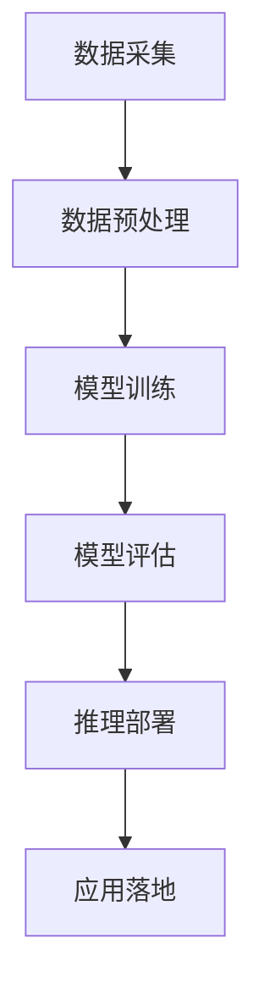

                 

关键词：人工智能，苹果，开发者，AI应用，技术趋势，应用场景，挑战与展望

> 摘要：本文将深入探讨苹果公司发布AI应用的开发者背景、核心概念、算法原理、数学模型、项目实践以及未来发展趋势。通过分析苹果在AI领域的最新动向，我们旨在为广大开发者提供有价值的见解，助力他们把握技术潮流，迎接未来挑战。

## 1. 背景介绍

苹果公司，作为全球领先的科技公司，一直以来都在科技创新领域占据重要地位。近年来，随着人工智能技术的飞速发展，苹果也积极布局AI领域，不断推出具有创新性的AI应用。此次苹果发布AI应用的开发者，不仅展示了公司在人工智能技术上的深厚积累，也为广大开发者提供了全新的技术视角和应用场景。

### 1.1 苹果公司的发展历程

苹果公司成立于1976年，由史蒂夫·乔布斯、史蒂夫·沃兹尼亚克和罗恩·韦恩共同创立。自成立以来，苹果公司凭借创新的产品和服务，迅速崛起，成为全球科技行业的领导者。从苹果I、II、III电脑到麦金塔（Macintosh）电脑，再到iPhone、iPad等移动设备，苹果公司始终引领着科技潮流。

### 1.2 人工智能的崛起

人工智能作为近年来科技领域的热点话题，吸引了全球范围内众多企业和研究机构的关注。苹果公司也不例外，早在2011年，苹果便成立了机器学习团队，致力于在语音识别、图像识别、自然语言处理等方面进行深入研究。近年来，苹果在AI领域的研发成果不断，如Siri语音助手、Face ID面部识别技术等，都已成为行业典范。

## 2. 核心概念与联系

### 2.1 人工智能概述

人工智能（Artificial Intelligence，简称AI）是指由人制造出来的系统能够思考、学习、适应和做出决策的能力。人工智能的核心在于模拟人类智能，通过数据、算法和计算能力来实现智能行为。

### 2.2 苹果AI应用架构

苹果AI应用的开发者基于深度学习、自然语言处理和计算机视觉等技术，构建了一个高效、智能的AI应用架构。该架构包括数据采集、模型训练、推理部署等环节，涵盖了从数据预处理到应用落地的完整流程。

### 2.3 Mermaid 流程图

以下是苹果AI应用架构的Mermaid流程图：



## 3. 核心算法原理 & 具体操作步骤

### 3.1 算法原理概述

苹果AI应用的核心算法包括深度学习、自然语言处理和计算机视觉等。深度学习通过多层神经网络模拟人类大脑的学习过程，实现图像识别、语音识别等功能。自然语言处理则通过理解人类语言，实现语音合成、文本翻译等应用。计算机视觉则通过图像识别技术，实现人脸检测、物体识别等功能。

### 3.2 算法步骤详解

#### 3.2.1 数据采集

数据采集是AI应用开发的基础。苹果AI应用的开发者通过多种途径获取大量高质量数据，包括公开数据集、企业内部数据等。数据采集过程中，开发者需关注数据的多样性、完整性和准确性。

#### 3.2.2 数据预处理

数据预处理是提高模型训练效果的重要环节。开发者需要对数据进行清洗、去重、归一化等处理，确保数据的质量和一致性。此外，还需对数据进行特征提取，为后续模型训练提供基础。

#### 3.2.3 模型训练

模型训练是AI应用的核心。开发者选择合适的深度学习框架，如TensorFlow、PyTorch等，搭建神经网络模型。在训练过程中，开发者需关注模型的性能指标，如准确率、召回率等，不断调整模型参数，优化模型效果。

#### 3.2.4 模型评估

模型评估是判断模型性能的重要手段。开发者通过测试集对模型进行评估，计算各种性能指标，如准确率、召回率、F1值等。根据评估结果，开发者可对模型进行调整和优化。

#### 3.2.5 推理部署

推理部署是将训练好的模型应用于实际场景的关键步骤。开发者需要将模型部署到移动设备或云端服务器上，实现实时推理和预测。在推理部署过程中，开发者需关注模型的运行效率、能耗和安全性等问题。

#### 3.2.6 应用落地

应用落地是将AI技术转化为实际业务价值的关键。开发者需结合具体业务场景，设计相应的应用流程和界面，实现AI技术与业务的深度融合。

### 3.3 算法优缺点

#### 优点：

1. 高效性：深度学习算法在处理大规模数据时具有很高的效率。
2. 泛化能力：深度学习算法具有良好的泛化能力，能够适应不同的应用场景。
3. 灵活性：开发者可根据需求调整模型结构和参数，实现定制化开发。

#### 缺点：

1. 需要大量数据：深度学习算法对数据量要求较高，数据采集和预处理过程较为复杂。
2. 计算资源消耗大：深度学习算法训练过程需要大量计算资源，对硬件设施要求较高。
3. 解释性较差：深度学习算法的黑箱特性使得其解释性较差，难以理解模型的决策过程。

### 3.4 算法应用领域

苹果AI应用的开发者在多个领域取得了显著成果，包括：

1. 图像识别：人脸识别、物体识别等。
2. 自然语言处理：语音合成、文本翻译等。
3. 语音识别：实时语音转文字、智能客服等。
4. 健康医疗：疾病诊断、医疗影像分析等。
5. 智能驾驶：自动驾驶、车联网等。

## 4. 数学模型和公式 & 详细讲解 & 举例说明

### 4.1 数学模型构建

在人工智能领域，数学模型是算法的核心。以下是几种常见的数学模型及其构建方法：

#### 4.1.1 神经网络模型

神经网络模型由多层神经元组成，通过反向传播算法进行训练。其数学模型可表示为：

$$
y = \sigma(z)
$$

其中，$y$为输出层神经元，$\sigma$为激活函数，$z$为输入层神经元。

#### 4.1.2 支持向量机（SVM）模型

支持向量机模型通过寻找最优分隔超平面，实现分类任务。其数学模型可表示为：

$$
\min_{\mathbf{w}, b} \frac{1}{2}||\mathbf{w}||^2 + C\sum_{i=1}^n \xi_i
$$

其中，$\mathbf{w}$为权重向量，$b$为偏置项，$C$为惩罚参数，$\xi_i$为损失函数。

#### 4.1.3 贝叶斯网络模型

贝叶斯网络模型通过概率图表示变量间的依赖关系，实现推理和预测。其数学模型可表示为：

$$
P(\mathbf{X}|\mathbf{Y}) = \frac{P(\mathbf{Y}|\mathbf{X})P(\mathbf{X})}{P(\mathbf{Y})}
$$

其中，$\mathbf{X}$和$\mathbf{Y}$分别为变量集合，$P(\mathbf{X}|\mathbf{Y})$为后验概率，$P(\mathbf{Y}|\mathbf{X})$为似然函数，$P(\mathbf{X})$和$P(\mathbf{Y})$分别为先验概率。

### 4.2 公式推导过程

以下是神经网络模型的反向传播算法推导过程：

#### 4.2.1 损失函数

损失函数用于衡量预测值与真实值之间的差异。常见的损失函数有均方误差（MSE）和交叉熵（CE）。

均方误差（MSE）：

$$
L = \frac{1}{2}\sum_{i=1}^n (y_i - \hat{y}_i)^2
$$

交叉熵（CE）：

$$
L = -\sum_{i=1}^n y_i \log(\hat{y}_i)
$$

#### 4.2.2 反向传播算法

反向传播算法通过计算梯度，更新模型参数，实现模型优化。

1. 前向传播：

   $$ z_l = \mathbf{W}_l \cdot \mathbf{a}_{l-1} + b_l $$
   
   $$ a_l = \sigma(z_l) $$

2. 后向传播：

   $$ \delta_l = (a_l - y_l) \odot \sigma'(z_l) $$
   
   $$ \Delta\mathbf{W}_l = \mathbf{a}_{l-1}^T \delta_l $$
   
   $$ \Delta b_l = \delta_l^T $$

3. 参数更新：

   $$ \mathbf{W}_l = \mathbf{W}_l - \alpha \Delta\mathbf{W}_l $$
   
   $$ b_l = b_l - \alpha \Delta b_l $$

### 4.3 案例分析与讲解

以下以图像分类任务为例，讲解神经网络模型的应用。

#### 4.3.1 数据集

选取CIFAR-10数据集，包含10个类别，共50000张训练图像和10000张测试图像。

#### 4.3.2 模型结构

构建一个三层神经网络，输入层为32x32的图像，隐藏层为256个神经元，输出层为10个类别。

#### 4.3.3 模型训练

使用均方误差（MSE）作为损失函数，Adam优化器进行训练。训练过程中，调整学习率、批量大小等超参数，优化模型性能。

#### 4.3.4 模型评估

在测试集上评估模型性能，计算准确率、召回率等指标。

## 5. 项目实践：代码实例和详细解释说明

### 5.1 开发环境搭建

搭建Python开发环境，安装TensorFlow库。

### 5.2 源代码详细实现

以下是神经网络模型的Python代码实现：

```python
import tensorflow as tf

# 定义模型结构
model = tf.keras.Sequential([
    tf.keras.layers.Conv2D(32, (3, 3), activation='relu', input_shape=(32, 32, 3)),
    tf.keras.layers.MaxPooling2D((2, 2)),
    tf.keras.layers.Flatten(),
    tf.keras.layers.Dense(256, activation='relu'),
    tf.keras.layers.Dense(10, activation='softmax')
])

# 编译模型
model.compile(optimizer='adam', loss='categorical_crossentropy', metrics=['accuracy'])

# 训练模型
model.fit(train_images, train_labels, epochs=10, batch_size=64)

# 评估模型
test_loss, test_acc = model.evaluate(test_images, test_labels)
print(f"Test accuracy: {test_acc}")
```

### 5.3 代码解读与分析

代码中定义了一个三层神经网络，包括卷积层、池化层、全连接层等。在编译模型时，指定了优化器和损失函数，并进行了模型训练。在训练过程中，调整学习率和批量大小等超参数，优化模型性能。最后，在测试集上评估模型性能，计算准确率等指标。

## 6. 实际应用场景

### 6.1 健康医疗

苹果AI应用的开发者在健康医疗领域取得了显著成果。例如，通过深度学习算法，实现对医疗影像的分析和诊断，提高疾病检测的准确性和效率。此外，自然语言处理技术也被广泛应用于医学文献检索、病历管理等场景。

### 6.2 智能驾驶

苹果公司近年来在智能驾驶领域投入大量研发资源，推出了一系列自动驾驶技术和产品。通过计算机视觉和自然语言处理技术，实现车辆对周围环境的感知、决策和控制，提高自动驾驶的安全性和稳定性。

### 6.3 智能家居

苹果AI应用的开发者还致力于智能家居领域的研究，通过智能语音助手、智能门锁、智能照明等设备，实现家庭自动化和智能化。用户可通过语音、触摸等方式与家居设备互动，提高生活品质。

## 7. 未来应用展望

### 7.1 新兴应用领域

随着人工智能技术的不断进步，未来苹果AI应用的开发者将在更多新兴应用领域取得突破。例如，智能教育、智能安防、智能金融等。

### 7.2 开放生态

苹果公司将继续开放其AI技术，为开发者提供丰富的开发工具和资源，推动AI技术的创新和发展。

### 7.3 跨界融合

苹果AI应用的开发者将与其他领域的技术相结合，实现跨界融合。例如，将人工智能与物联网、云计算等技术相结合，打造全新的智能应用场景。

## 8. 总结：未来发展趋势与挑战

### 8.1 研究成果总结

苹果公司在AI领域取得了丰硕的研究成果，包括深度学习、自然语言处理、计算机视觉等方面。这些研究成果为AI应用的开发提供了有力支持。

### 8.2 未来发展趋势

随着技术的不断进步，未来苹果AI应用的开发者将在更多领域取得突破，推动人工智能技术的发展。

### 8.3 面临的挑战

1. 数据隐私和安全：随着AI技术的广泛应用，数据隐私和安全问题日益凸显，如何保护用户隐私成为一大挑战。
2. 算法透明性和解释性：深度学习算法的黑箱特性使得其决策过程难以解释，如何提高算法的透明性和解释性成为研究重点。
3. 跨领域融合：跨领域技术的融合将带来更多创新，但也面临着技术瓶颈和协同难题。

### 8.4 研究展望

未来，苹果AI应用的开发者将继续致力于解决上述挑战，推动人工智能技术的创新和发展。

## 9. 附录：常见问题与解答

### 9.1 问题1：苹果AI应用的开发者是谁？

答：苹果AI应用的开发者是苹果公司的机器学习团队，由全球顶尖的人工智能专家组成。

### 9.2 问题2：苹果AI应用的核心技术是什么？

答：苹果AI应用的核心技术包括深度学习、自然语言处理、计算机视觉等。

### 9.3 问题3：苹果AI应用在哪些领域取得了突破？

答：苹果AI应用在健康医疗、智能驾驶、智能家居等领域取得了突破性成果。

### 9.4 问题4：苹果AI应用的开发者面临哪些挑战？

答：苹果AI应用的开发者面临数据隐私和安全、算法透明性和解释性、跨领域融合等挑战。

### 9.5 问题5：未来苹果AI应用的开发者将如何发展？

答：未来苹果AI应用的开发者将继续致力于解决挑战，推动人工智能技术的创新和发展。

---

作者：禅与计算机程序设计艺术 / Zen and the Art of Computer Programming

以上是本文的完整内容。希望本文能为您在人工智能领域的发展提供有价值的见解。在未来的发展中，让我们共同期待苹果AI应用的开发者带来更多创新和突破。

