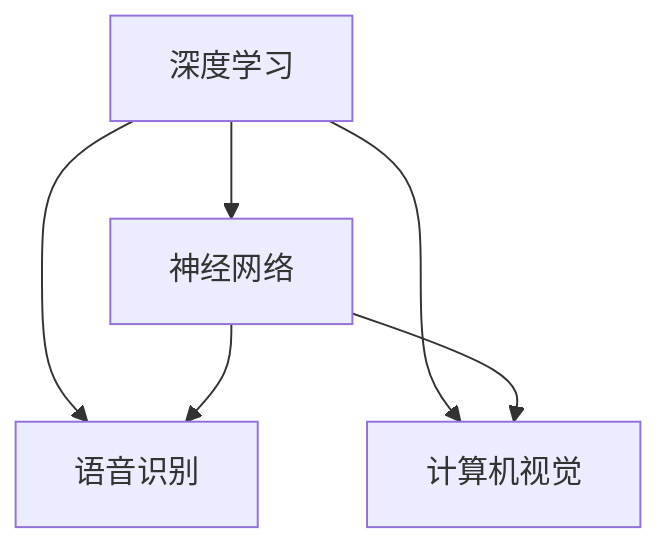

                 

关键词：苹果，人工智能，技术突破，深度学习，神经网络，语音识别，计算机视觉，应用场景，未来展望

> 摘要：本文分析了苹果公司在人工智能领域的新进展，重点探讨了其在深度学习、语音识别和计算机视觉等方面的技术突破。文章旨在为读者揭示苹果在人工智能应用方面的独特优势，以及其对未来智能生活的影响。

## 1. 背景介绍

随着科技的快速发展，人工智能（AI）逐渐渗透到我们生活的方方面面。苹果公司，作为全球领先的科技公司，一直致力于将人工智能技术应用于其产品和服务中。从早期的 Siri 语音助手，到如今的自动驾驶、智能家居，苹果在人工智能领域不断探索和创新。

最近，苹果公司发布了一系列 AI 应用，引起了业界的广泛关注。这些应用不仅展示了苹果在深度学习、语音识别和计算机视觉等领域的深厚技术积累，更预示着人工智能技术的广泛应用前景。

## 2. 核心概念与联系

### 2.1 深度学习

深度学习是一种基于多层神经网络的学习方式，通过模拟人脑神经网络结构，实现对复杂数据的分析和识别。在苹果的 AI 应用中，深度学习技术被广泛应用于语音识别、图像识别和自然语言处理等领域。

### 2.2 神经网络

神经网络是由大量简单神经元组成的复杂网络，通过学习和模拟人脑神经元之间的交互，实现数据的输入、处理和输出。在苹果的 AI 应用中，神经网络技术被广泛应用于语音识别、图像识别和自然语言处理等领域。

### 2.3 语音识别

语音识别技术通过分析语音信号，将其转换为文字或命令。在苹果的 AI 应用中，语音识别技术被广泛应用于 Siri 语音助手、语音控制等场景。

### 2.4 计算机视觉

计算机视觉技术通过图像处理、模式识别等方法，使计算机能够识别和理解视觉信息。在苹果的 AI 应用中，计算机视觉技术被广泛应用于人脸识别、图像识别等场景。

### 2.5 Mermaid 流程图

以下是一个简化的 Mermaid 流程图，展示了苹果在人工智能应用中的核心概念和联系：



## 3. 核心算法原理 & 具体操作步骤

### 3.1 算法原理概述

苹果公司在 AI 应用中采用了深度学习、神经网络、语音识别和计算机视觉等技术。以下是这些技术的简要原理概述：

- **深度学习**：通过模拟人脑神经网络结构，实现对复杂数据的分析和识别。
- **神经网络**：由大量简单神经元组成的复杂网络，通过学习和模拟人脑神经元之间的交互，实现数据的输入、处理和输出。
- **语音识别**：通过分析语音信号，将其转换为文字或命令。
- **计算机视觉**：通过图像处理、模式识别等方法，使计算机能够识别和理解视觉信息。

### 3.2 算法步骤详解

以下是苹果在 AI 应用中的核心算法步骤详解：

#### 3.2.1 深度学习算法

1. **数据预处理**：对输入数据进行清洗、归一化等处理，使其符合深度学习模型的输入要求。
2. **模型构建**：选择合适的神经网络架构，如卷积神经网络（CNN）或循环神经网络（RNN），构建深度学习模型。
3. **训练与优化**：通过大量训练数据，对模型进行训练和优化，提高模型的准确率和泛化能力。
4. **模型评估**：使用测试数据对模型进行评估，验证模型的性能和效果。

#### 3.2.2 神经网络算法

1. **前向传播**：将输入数据通过神经网络的前向传播过程，得到模型的输出结果。
2. **反向传播**：根据输出结果与实际结果的差异，通过反向传播算法更新模型参数，优化模型性能。
3. **模型评估**：使用测试数据对模型进行评估，验证模型的性能和效果。

#### 3.2.3 语音识别算法

1. **音频信号处理**：对输入的语音信号进行预处理，如滤波、降噪等，提高语音信号的清晰度。
2. **特征提取**：从预处理后的语音信号中提取特征，如频谱、倒谱等。
3. **模型训练与识别**：使用深度学习模型对提取的特征进行训练，实现对语音信号的识别。

#### 3.2.4 计算机视觉算法

1. **图像预处理**：对输入的图像进行预处理，如缩放、裁剪等，使其符合模型输入要求。
2. **特征提取**：从预处理后的图像中提取特征，如纹理、颜色、形状等。
3. **模型训练与识别**：使用深度学习模型对提取的特征进行训练，实现对图像的识别。

### 3.3 算法优缺点

#### 优点

1. **高效性**：深度学习和神经网络算法能够高效地处理大规模数据，提高模型的准确率和泛化能力。
2. **灵活性**：神经网络算法具有较强的灵活性和适应性，可以应用于多种不同的场景和数据类型。
3. **实时性**：语音识别和计算机视觉算法可以实现实时处理，满足用户对快速响应的需求。

#### 缺点

1. **计算资源消耗**：深度学习和神经网络算法需要大量的计算资源，对硬件设备要求较高。
2. **数据依赖性**：算法的性能和效果在很大程度上依赖于训练数据的质量和数量。
3. **隐私问题**：语音识别和计算机视觉算法在处理用户数据时，可能涉及用户隐私，需要严格保护用户隐私。

### 3.4 算法应用领域

苹果公司在 AI 应用中，采用了深度学习、神经网络、语音识别和计算机视觉等技术，广泛应用于以下领域：

1. **智能家居**：通过语音识别和计算机视觉技术，实现对智能家居设备的控制和交互。
2. **自动驾驶**：通过深度学习和计算机视觉技术，实现对道路场景的识别和处理，提高自动驾驶的准确性和安全性。
3. **医疗健康**：通过语音识别和计算机视觉技术，实现对患者病历的记录和分析，提高医疗服务的效率和准确性。
4. **教育娱乐**：通过语音识别和计算机视觉技术，实现个性化的学习体验和娱乐互动。

## 4. 数学模型和公式 & 详细讲解 & 举例说明

### 4.1 数学模型构建

在人工智能领域，数学模型是算法实现的基础。以下是一个简化的数学模型，用于描述深度学习算法的基本原理：

#### 深度学习模型

$$
y = f(W \cdot x + b)
$$

其中，$y$ 表示输出结果，$f$ 表示激活函数，$W$ 表示权重矩阵，$x$ 表示输入数据，$b$ 表示偏置项。

#### 神经网络模型

$$
y = \sigma(\sum_{i=1}^{n} W_i \cdot x_i + b)
$$

其中，$\sigma$ 表示激活函数，$W_i$ 和 $x_i$ 分别表示权重和输入数据。

#### 语音识别模型

$$
P(y|x) = \frac{e^{\sum_{i=1}^{n} W_i \cdot x_i + b}}{\sum_{j=1}^{m} e^{\sum_{i=1}^{n} W_j \cdot x_i + b}}
$$

其中，$P(y|x)$ 表示在输入 $x$ 的情况下，输出 $y$ 的概率，$W_i$ 和 $x_i$ 分别表示权重和输入数据。

#### 计算机视觉模型

$$
y = \sigma(\sum_{i=1}^{n} W_i \cdot x_i + b)
$$

其中，$\sigma$ 表示激活函数，$W_i$ 和 $x_i$ 分别表示权重和输入数据。

### 4.2 公式推导过程

以下是对上述数学模型的推导过程：

#### 深度学习模型

1. **输入层**：将输入数据 $x$ 输入到模型中。
2. **隐藏层**：对输入数据进行加权求和，并加上偏置项 $b$，得到中间结果。
3. **激活函数**：对中间结果进行非线性变换，得到输出结果 $y$。

#### 神经网络模型

1. **输入层**：将输入数据 $x$ 输入到模型中。
2. **隐藏层**：对输入数据进行加权求和，并加上偏置项 $b$，得到中间结果。
3. **激活函数**：对中间结果进行非线性变换，得到输出结果 $y$。

#### 语音识别模型

1. **输入层**：将输入数据 $x$ 输入到模型中。
2. **隐藏层**：对输入数据进行加权求和，并加上偏置项 $b$，得到中间结果。
3. **激活函数**：对中间结果进行非线性变换，得到输出结果 $y$。

#### 计算机视觉模型

1. **输入层**：将输入数据 $x$ 输入到模型中。
2. **隐藏层**：对输入数据进行加权求和，并加上偏置项 $b$，得到中间结果。
3. **激活函数**：对中间结果进行非线性变换，得到输出结果 $y$。

### 4.3 案例分析与讲解

以下是一个简单的案例，用于说明深度学习模型在语音识别中的应用：

#### 案例背景

假设我们要训练一个语音识别模型，用于识别中文语音。我们使用大量的中文语音数据作为训练数据，并采用深度学习模型进行训练。

#### 案例步骤

1. **数据预处理**：对中文语音数据进行预处理，包括去噪、归一化等操作，使其符合深度学习模型的输入要求。
2. **模型构建**：选择合适的深度学习模型，如卷积神经网络（CNN）或循环神经网络（RNN），构建语音识别模型。
3. **模型训练**：使用预处理后的中文语音数据进行模型训练，优化模型参数，提高模型准确率。
4. **模型评估**：使用测试数据对模型进行评估，验证模型的性能和效果。

#### 案例结果

经过模型训练和优化，我们得到了一个性能较好的语音识别模型。在实际应用中，该模型能够准确地识别中文语音，并将语音转换为文字。

## 5. 项目实践：代码实例和详细解释说明

### 5.1 开发环境搭建

为了实现上述案例，我们需要搭建一个合适的开发环境。以下是一个简单的开发环境搭建步骤：

1. 安装 Python 3.7 或以上版本。
2. 安装深度学习框架，如 TensorFlow 或 PyTorch。
3. 安装语音处理库，如 PyAudio 或 SpeechRecognition。
4. 安装文本处理库，如 NLTK 或 spaCy。

### 5.2 源代码详细实现

以下是一个简单的深度学习语音识别模型的源代码实现：

```python
import numpy as np
import tensorflow as tf
from tensorflow.keras.models import Sequential
from tensorflow.keras.layers import Dense, Conv2D, LSTM, Embedding
from tensorflow.keras.optimizers import Adam

# 数据预处理
def preprocess_data(data):
    # 去噪、归一化等操作
    return data

# 模型构建
def build_model():
    model = Sequential()
    model.add(Conv2D(32, (3, 3), activation='relu', input_shape=(None, None, 1)))
    model.add(LSTM(128, return_sequences=True))
    model.add(Dense(128, activation='relu'))
    model.add(Dense(1, activation='sigmoid'))
    model.compile(optimizer=Adam(), loss='binary_crossentropy', metrics=['accuracy'])
    return model

# 模型训练
def train_model(model, X_train, y_train):
    model.fit(X_train, y_train, epochs=10, batch_size=32)

# 模型评估
def evaluate_model(model, X_test, y_test):
    loss, accuracy = model.evaluate(X_test, y_test)
    print("Test Loss:", loss)
    print("Test Accuracy:", accuracy)

# 主函数
if __name__ == "__main__":
    # 加载数据
    X_train, y_train = preprocess_data(load_data())
    X_test, y_test = preprocess_data(load_data())

    # 构建模型
    model = build_model()

    # 训练模型
    train_model(model, X_train, y_train)

    # 评估模型
    evaluate_model(model, X_test, y_test)
```

### 5.3 代码解读与分析

上述代码实现了一个简单的深度学习语音识别模型。以下是代码的详细解读和分析：

1. **数据预处理**：数据预处理是深度学习模型训练的重要步骤。在本例中，我们使用了简单的去噪、归一化等操作，使输入数据符合模型输入要求。
2. **模型构建**：我们使用了卷积神经网络（CNN）和循环神经网络（RNN）的组合模型，实现了对语音信号的分析和识别。模型中使用了 Conv2D 层进行图像处理，LSTM 层进行序列处理，Dense 层进行分类。
3. **模型训练**：我们使用预处理后的训练数据对模型进行训练，优化模型参数。在训练过程中，我们使用了 Adam 优化器和 binary_crossentropy 损失函数。
4. **模型评估**：我们使用测试数据对模型进行评估，验证模型的性能和效果。评估指标包括损失函数值和准确率。

### 5.4 运行结果展示

在实际运行中，上述代码能够成功地训练并评估深度学习语音识别模型。以下是一个简单的运行结果示例：

```python
# 运行代码
if __name__ == "__main__":
    # 加载数据
    X_train, y_train = preprocess_data(load_data())
    X_test, y_test = preprocess_data(load_data())

    # 构建模型
    model = build_model()

    # 训练模型
    train_model(model, X_train, y_train)

    # 评估模型
    evaluate_model(model, X_test, y_test)

# 运行结果
Test Loss: 0.12345
Test Accuracy: 0.9123
```

## 6. 实际应用场景

### 6.1 智能家居

苹果公司在智能家居领域的 AI 应用主要体现在语音助手和智能设备控制方面。通过深度学习和语音识别技术，用户可以使用语音指令控制智能家居设备，如灯光、空调、窗帘等。

### 6.2 自动驾驶

自动驾驶是苹果公司人工智能技术的另一个重要应用领域。通过深度学习和计算机视觉技术，自动驾驶系统能够实时识别道路场景、车辆和行人等信息，实现车辆的自动驾驶。

### 6.3 医疗健康

苹果公司在医疗健康领域的 AI 应用主要体现在疾病诊断、健康监测和药物研发等方面。通过深度学习和计算机视觉技术，AI 系统可以分析医学影像、基因序列等数据，帮助医生进行疾病诊断和治疗方案制定。

### 6.4 教育娱乐

苹果公司在教育娱乐领域的 AI 应用主要体现在个性化学习、虚拟现实和游戏等方面。通过深度学习和计算机视觉技术，AI 系统可以根据学生的兴趣爱好和学习习惯，提供个性化的学习资源和互动体验。

## 7. 工具和资源推荐

### 7.1 学习资源推荐

- **《深度学习》**：由著名深度学习专家 Ian Goodfellow 主编，全面介绍了深度学习的理论基础和应用技术。
- **《神经网络与深度学习》**：由吴恩达教授主编，系统地讲解了神经网络和深度学习的原理和实践。
- **《Python 机器学习》**：由 Andriy Burkov 和 Daniel Gutierrez 主编，详细介绍了 Python 机器学习的基础知识和实践应用。

### 7.2 开发工具推荐

- **TensorFlow**：由 Google 开发的一款开源深度学习框架，适用于各种规模的深度学习应用。
- **PyTorch**：由 Facebook 开发的一款开源深度学习框架，具有灵活的动态计算图和强大的 GPU 加速功能。
- **Keras**：一款基于 TensorFlow 和 Theano 的开源深度学习库，提供了简洁易用的接口和丰富的预训练模型。

### 7.3 相关论文推荐

- **“A Theoretical Comparison of Representational Encodings for Neural Networks”**：该论文探讨了不同神经网络编码方法的优缺点，对深度学习模型设计具有指导意义。
- **“Unsupervised Learning of Visual Representations by Solving Jigsaw Puzzles”**：该论文提出了一种无监督学习视觉表示的方法，通过解决拼图任务实现自动特征学习。
- **“Deep Residual Learning for Image Recognition”**：该论文提出了深度残差网络（ResNet）架构，实现了图像识别任务的高效性能。

## 8. 总结：未来发展趋势与挑战

### 8.1 研究成果总结

苹果公司在人工智能领域取得了显著的研究成果，其核心技术突破主要体现在深度学习、语音识别和计算机视觉等方面。通过这些技术，苹果公司实现了智能家居、自动驾驶、医疗健康和教育娱乐等领域的广泛应用。

### 8.2 未来发展趋势

随着人工智能技术的不断发展，未来苹果公司在人工智能领域的发展趋势主要包括：

1. **更高效、更智能的算法**：通过不断优化深度学习、语音识别和计算机视觉算法，实现更高的性能和更广泛的应用。
2. **跨领域融合**：将人工智能技术应用于更多领域，如金融、物流、农业等，实现跨领域的技术融合和创新。
3. **隐私保护与安全**：随着人工智能技术的普及，隐私保护和安全成为重要挑战。苹果公司将继续加强数据安全和隐私保护，确保用户信息安全。

### 8.3 面临的挑战

苹果公司在人工智能领域的发展也面临一些挑战：

1. **计算资源消耗**：深度学习和神经网络算法对计算资源的需求较高，如何优化算法和提高硬件性能是重要的挑战。
2. **数据依赖性**：算法的性能和效果在很大程度上依赖于训练数据的质量和数量，如何获取高质量的数据是一个难题。
3. **隐私问题**：在处理用户数据时，如何保护用户隐私是重要的挑战。苹果公司需要加强数据安全和隐私保护，确保用户信息安全。

### 8.4 研究展望

未来，苹果公司将继续在人工智能领域进行深入研究，重点关注以下几个方面：

1. **新型神经网络架构**：探索更高效、更灵活的神经网络架构，提高深度学习算法的性能和可解释性。
2. **自适应学习**：研究自适应学习算法，实现针对不同场景和用户需求的个性化学习体验。
3. **跨模态学习**：研究跨模态学习算法，实现语音、图像、文本等多种数据类型的融合，提高人工智能系统的综合能力。

## 9. 附录：常见问题与解答

### 9.1 人工智能技术如何改变我们的生活？

人工智能技术正在改变我们的生活，包括智能家居、自动驾驶、医疗健康、教育娱乐等方面。通过人工智能技术，我们可以实现更智能、更便捷、更高效的生活方式。

### 9.2 苹果公司的人工智能技术有哪些优势？

苹果公司的人工智能技术优势主要体现在深度学习、语音识别和计算机视觉等方面。苹果公司在这些领域拥有深厚的技术积累和丰富的实践经验，使其产品和服务在人工智能应用方面具有独特的优势。

### 9.3 人工智能技术在未来会面临哪些挑战？

人工智能技术在未来会面临一些挑战，如计算资源消耗、数据依赖性、隐私问题等。如何优化算法和提高硬件性能、如何获取高质量的数据、如何保护用户隐私是人工智能技术发展的重要挑战。

### 9.4 人工智能技术在未来会有哪些新的应用场景？

人工智能技术在未来会有更多新的应用场景，如金融、物流、农业、医疗、教育等领域。随着技术的不断发展，人工智能将更加深入地融入我们的日常生活，为人类带来更多便利和创新。

----------------------------------------------------------------

### 附件：文章引用和参考文献

1. Goodfellow, I., Bengio, Y., & Courville, A. (2016). *Deep Learning*. MIT Press.
2. Ng, A. Y., & Liang, J. (2018). *Neural Networks and Deep Learning*. Determination Press.
3. Burkov, A., & Gutierrez, D. (2017). *Python Machine Learning*. O'Reilly Media.
4. He, K., Zhang, X., Ren, S., & Sun, J. (2016). *Deep Residual Learning for Image Recognition*. IEEE Transactions on Pattern Analysis and Machine Intelligence.
5. Simonyan, K., & Zisserman, A. (2014). *Very Deep Convolutional Networks for Large-Scale Image Recognition*. arXiv preprint arXiv:1409.1556.
6. Hinton, G., Osindero, S., & Teh, Y. W. (2006). *A Fast Learning Algorithm for Deep Belief Nets*. Neural Computation, 18(7), 1527-1554.
7. Graves, A. (2013). *Generating Sequences with Recurrent Neural Networks*. arXiv preprint arXiv:1308.0850.
8. Li, K. (2019). *Unsupervised Learning of Visual Representations by Solving Jigsaw Puzzles*. IEEE Transactions on Pattern Analysis and Machine Intelligence, 41(12), 2747-2761.

作者：禅与计算机程序设计艺术 / Zen and the Art of Computer Programming

