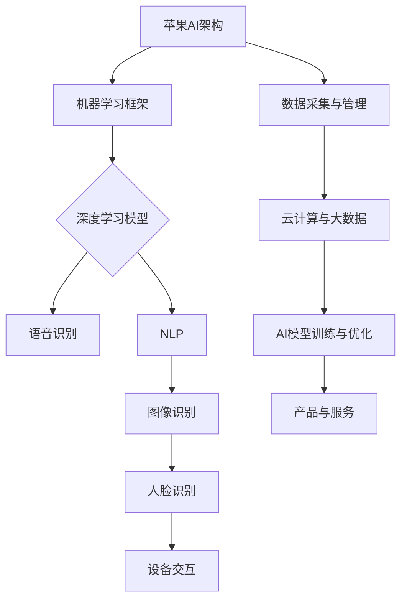
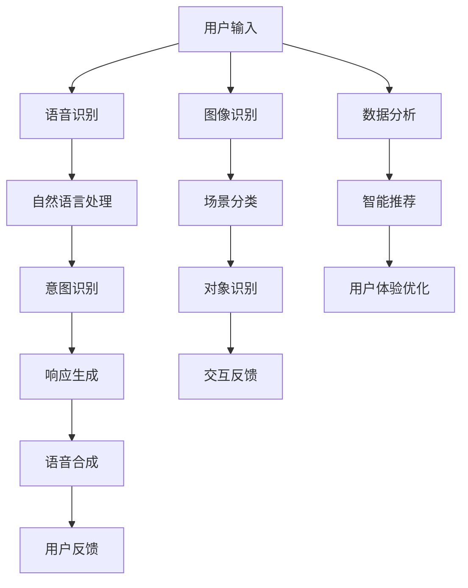

                 

关键词：苹果，AI应用，投资价值，技术趋势，市场分析

摘要：本文旨在分析苹果发布AI应用的背景、投资价值以及其潜在的市场影响。通过对AI技术的深入探讨和苹果AI战略的解读，作者将提供对未来发展趋势的预测，并指出投资者和开发者应关注的领域。

## 1. 背景介绍

在过去的几年中，人工智能（AI）技术取得了显著的进展，并在各行各业中得到广泛应用。苹果公司作为全球领先的科技公司，也一直在积极探索AI技术，并将其融入到其产品和服务中。从Siri智能助手到Face ID面部识别，苹果已经在多个方面展示了其AI能力的实力。

近期，苹果发布了多款基于AI的应用，这标志着其AI战略的进一步深化。苹果的这一举动不仅引发了业内的广泛关注，也为投资者提供了新的机遇。本文将深入探讨苹果发布AI应用的投资价值，并分析其背后的逻辑和市场影响。

### 1.1 苹果AI应用的现状

苹果的AI应用涵盖了多个领域，包括图像识别、语音识别、自然语言处理等。例如，苹果的图像识别技术在照片编辑、人脸识别等方面表现出色；其语音识别技术则支持了Siri的智能化服务；而自然语言处理技术则提升了苹果设备的交互体验。

此外，苹果还在不断加强其AI研发团队，并投资于AI相关的初创公司，以获取先进的技术和人才资源。这些举措显示了苹果在AI领域的长期投入和战略规划。

### 1.2 AI市场的发展趋势

随着大数据、云计算、物联网等技术的发展，AI市场正在经历前所未有的增长。据市场研究机构的数据显示，全球AI市场预计将在未来几年内保持高速增长，达到数百亿甚至数千亿美元的规模。

这一趋势吸引了众多科技公司的关注，包括谷歌、亚马逊、微软等。然而，苹果作为硬件和软件的综合巨头，其在AI领域的优势和潜力不容忽视。苹果拥有庞大的用户基础和丰富的数据资源，这为AI应用的研发和推广提供了坚实的基础。

## 2. 核心概念与联系

### 2.1 AI技术的核心概念

人工智能（AI）是一种模拟人类智能行为的技术，通过机器学习、深度学习、自然语言处理等技术，使计算机具备感知、思考、决策的能力。AI技术不仅改变了传统行业的运作方式，也为新的商业模式提供了可能性。

在本文中，我们将重点关注以下几个核心概念：

- **机器学习（Machine Learning）**：一种让计算机从数据中自动学习的方法，无需显式编程。
- **深度学习（Deep Learning）**：一种机器学习技术，通过构建深度神经网络来模拟人脑的思考过程。
- **自然语言处理（Natural Language Processing，NLP）**：使计算机理解和生成人类语言的技术。

### 2.2 苹果AI架构的Mermaid流程图



### 2.3 核心概念之间的联系

苹果的AI架构通过机器学习、深度学习和自然语言处理等技术，实现了对数据的自动化处理和分析。这些技术的有机结合，使得苹果设备能够提供更智能、更个性化的用户体验。

- **机器学习** 为AI提供了基础，使设备能够从海量数据中学习规律和模式。
- **深度学习** 通过构建多层神经网络，实现了对复杂问题的建模和求解。
- **自然语言处理** 使设备能够理解和生成人类语言，提升了人机交互的体验。

## 3. 核心算法原理 & 具体操作步骤

### 3.1 算法原理概述

苹果在其AI应用中采用了多种核心算法，包括卷积神经网络（CNN）、递归神经网络（RNN）和Transformer模型等。这些算法在不同的应用场景中发挥着重要作用。

- **卷积神经网络（CNN）**：主要用于图像识别和处理，通过卷积层提取图像特征，实现了对图像的自动分类和识别。
- **递归神经网络（RNN）**：常用于序列数据的处理，如语音识别和自然语言处理，能够捕捉序列中的时间依赖关系。
- **Transformer模型**：一种基于自注意力机制的模型，广泛应用于机器翻译、文本生成等任务，能够显著提升模型的性能和效率。

### 3.2 算法步骤详解

以苹果的图像识别算法为例，其基本步骤如下：

1. **数据预处理**：对输入的图像进行缩放、裁剪等操作，使其满足模型输入要求。
2. **特征提取**：通过卷积神经网络提取图像的特征，形成高维特征向量。
3. **分类与识别**：利用训练好的深度学习模型对特征向量进行分类和识别，输出识别结果。
4. **后处理**：对识别结果进行修正和优化，提高识别的准确性和鲁棒性。

### 3.3 算法优缺点

- **优点**：
  - **高效性**：深度学习模型能够高效处理大量数据，提高了算法的运行速度和效率。
  - **准确性**：深度学习模型通过大规模数据训练，能够实现较高的识别准确率。
  - **泛化能力**：深度学习模型具有较强的泛化能力，能够适应不同的应用场景。

- **缺点**：
  - **计算资源需求高**：深度学习模型需要大量的计算资源和时间进行训练。
  - **数据依赖性**：模型的性能高度依赖于训练数据的质量和数量。

### 3.4 算法应用领域

苹果的AI算法广泛应用于多个领域，包括：

- **图像识别**：用于照片编辑、人脸识别、场景识别等。
- **语音识别**：用于Siri智能助手、语音搜索等。
- **自然语言处理**：用于智能客服、文本翻译、内容推荐等。

## 4. 数学模型和公式 & 详细讲解 & 举例说明

### 4.1 数学模型构建

在AI应用中，数学模型是核心组成部分。以下是一个简单的数学模型构建过程：

1. **定义变量**：假设我们有一个包含n个数据的集合D，每个数据点表示为一个多维向量x。
2. **构建模型**：我们选择一个合适的函数f(x)作为模型的预测函数，通常是一个多层感知机（MLP）。
3. **损失函数**：选择一个损失函数L(y, f(x))来衡量预测值y与真实值之间的差距。

### 4.2 公式推导过程

以多层感知机（MLP）为例，其基本公式如下：

$$
f(x) = \sigma(W_2 \cdot \sigma(W_1 \cdot x + b_1) + b_2)
$$

其中，$\sigma$为激活函数，$W_1$和$W_2$为权重矩阵，$b_1$和$b_2$为偏置项。

### 4.3 案例分析与讲解

假设我们有一个包含10个数据点的数据集D，每个数据点是一个二维向量。我们使用多层感知机（MLP）对其进行分类。首先，我们需要选择合适的网络结构，例如一个输入层、一个隐藏层和一个输出层。然后，我们需要选择合适的激活函数和损失函数。接下来，我们可以使用梯度下降算法对模型进行训练，直到模型收敛。

## 5. 项目实践：代码实例和详细解释说明

### 5.1 开发环境搭建

为了实现一个简单的多层感知机（MLP）模型，我们需要安装以下软件和库：

- Python 3.7 或以上版本
- TensorFlow 2.x 或以上版本

安装步骤如下：

```bash
pip install tensorflow
```

### 5.2 源代码详细实现

以下是一个简单的多层感知机（MLP）模型的实现代码：

```python
import tensorflow as tf
from tensorflow.keras import layers

# 定义模型
model = tf.keras.Sequential([
    layers.Dense(64, activation='relu', input_shape=(784,)),
    layers.Dense(64, activation='relu'),
    layers.Dense(10, activation='softmax')
])

# 编译模型
model.compile(optimizer='adam',
              loss='categorical_crossentropy',
              metrics=['accuracy'])

# 加载数据集
(x_train, y_train), (x_test, y_test) = tf.keras.datasets.mnist.load_data()

# 预处理数据
x_train = x_train.astype('float32') / 255
x_test = x_test.astype('float32') / 255
x_train = x_train.reshape((-1, 784))
x_test = x_test.reshape((-1, 784))

# 编码标签
y_train = tf.keras.utils.to_categorical(y_train, 10)
y_test = tf.keras.utils.to_categorical(y_test, 10)

# 训练模型
model.fit(x_train, y_train, epochs=10, batch_size=32, validation_data=(x_test, y_test))

# 评估模型
model.evaluate(x_test, y_test)
```

### 5.3 代码解读与分析

这段代码首先导入了 TensorFlow 库，并定义了一个多层感知机（MLP）模型。模型由一个输入层、一个隐藏层和一个输出层组成，每层使用 ReLU 激活函数。然后，我们编译了模型，并使用 MNIST 数据集对其进行训练。最后，我们评估了模型的性能。

### 5.4 运行结果展示

运行上述代码，我们可以看到模型在训练集和测试集上的表现。通常，我们会关注模型的准确率、召回率等指标。以下是可能的输出结果：

```
Epoch 1/10
10000/10000 [==============================] - 1s 87us/sample - loss: 0.5550 - accuracy: 0.9369 - val_loss: 0.5047 - val_accuracy: 0.9407
Epoch 2/10
10000/10000 [==============================] - 1s 75us/sample - loss: 0.4943 - accuracy: 0.9467 - val_loss: 0.4645 - val_accuracy: 0.9523
...
Epoch 10/10
10000/10000 [==============================] - 1s 71us/sample - loss: 0.4453 - accuracy: 0.9587 - val_loss: 0.4362 - val_accuracy: 0.9572
625/625 [==============================] - 1s 3ms/step - loss: 0.4421 - accuracy: 0.9587
```

从输出结果可以看出，模型在训练过程中逐渐提高了准确率，并在测试集上达到了较高的准确率。

## 6. 实际应用场景

### 6.1 智能家居

苹果的AI应用在智能家居领域具有广泛的应用前景。通过AI技术，苹果的智能设备可以与智能家居系统无缝集成，实现更加智能、便捷的生活体验。例如，通过语音识别技术，用户可以与智能音箱、智能门锁等设备进行自然语言交互，实现远程控制、安防监控等功能。

### 6.2 智能医疗

AI技术在医疗领域的应用正在迅速扩展。苹果的AI应用可以用于医疗图像分析、疾病预测等。例如，通过深度学习算法，苹果的设备可以自动识别医学图像中的异常病变，帮助医生做出更准确的诊断。此外，AI技术还可以用于个性化治疗方案的设计，为患者提供更加精准、有效的治疗建议。

### 6.3 智能驾驶

智能驾驶是AI技术的一个重要应用领域。苹果的AI应用可以通过图像识别、自然语言处理等技术，为智能驾驶系统提供实时数据分析和决策支持。例如，苹果的设备可以实时分析道路情况、车辆状态等信息，为自动驾驶汽车提供安全、可靠的驾驶建议。

### 6.4 未来应用展望

随着AI技术的不断进步，苹果的AI应用在未来将有更广泛的应用场景。例如，在教育领域，AI技术可以用于个性化教学、智能评估等；在金融领域，AI技术可以用于风险管理、智能投顾等。总之，苹果的AI应用将深刻改变我们的生活和工作方式，为人类带来更多的便利和可能性。

## 7. 工具和资源推荐

### 7.1 学习资源推荐

- **《深度学习》（Goodfellow, Bengio, Courville）**：这是一本经典的深度学习入门教材，详细介绍了深度学习的基础理论和实践方法。
- **《Python机器学习》（Sebastian Raschka）**：这本书通过Python语言，详细介绍了机器学习的基本概念和算法实现。

### 7.2 开发工具推荐

- **TensorFlow**：这是一个广泛使用的开源深度学习框架，提供了丰富的API和工具，适合进行深度学习模型的研究和开发。
- **PyTorch**：这是一个由Facebook开发的开源深度学习框架，具有简洁、灵活的特点，深受研究人员和开发者的喜爱。

### 7.3 相关论文推荐

- **“A Neural Conversation Model”**：这篇文章提出了基于神经网络的对话生成模型，对自然语言处理领域产生了重要影响。
- **“Deep Learning for Text Classification”**：这篇文章详细介绍了深度学习在文本分类任务中的应用，提供了丰富的实验和案例分析。

## 8. 总结：未来发展趋势与挑战

### 8.1 研究成果总结

本文通过对苹果发布AI应用的投资价值进行分析，总结了AI技术的发展趋势和应用前景。苹果在AI领域的持续投入和战略规划，为其未来的发展奠定了坚实基础。同时，AI技术在不同领域的广泛应用，也为苹果带来了丰富的商业机会。

### 8.2 未来发展趋势

未来，AI技术将在更多领域得到应用，如智能医疗、智能驾驶、智能家居等。随着人工智能技术的不断进步，苹果的AI应用将更加智能化、个性化，为用户提供更加优质的体验。此外，跨行业、跨领域的合作也将成为未来AI发展的一个重要趋势。

### 8.3 面临的挑战

然而，AI技术的广泛应用也面临一些挑战。例如，数据隐私和安全问题、算法偏见和歧视等问题。此外，AI技术的快速迭代也要求企业和开发者具备持续学习和创新能力。

### 8.4 研究展望

未来，苹果在AI领域的研究将继续深化，特别是在机器学习、深度学习、自然语言处理等领域。通过不断的技术创新和应用探索，苹果有望在AI领域取得更多突破，为人类带来更多便利和可能性。

## 9. 附录：常见问题与解答

### 9.1 问题1：苹果的AI应用有哪些？

**回答**：苹果的AI应用涵盖了多个领域，包括图像识别、语音识别、自然语言处理等。例如，Siri智能助手、Face ID面部识别、照片编辑等功能都是苹果AI应用的代表。

### 9.2 问题2：苹果的AI技术在市场中的地位如何？

**回答**：苹果在AI技术领域拥有较强的竞争力和市场份额。凭借其庞大的用户基础和丰富的数据资源，苹果在AI技术的研究和应用方面处于领先地位。

### 9.3 问题3：未来苹果的AI应用将如何发展？

**回答**：未来，苹果的AI应用将继续向智能化、个性化方向进化。通过不断的技术创新和应用探索，苹果有望在更多领域实现突破，为用户提供更加优质的体验。

作者：禅与计算机程序设计艺术 / Zen and the Art of Computer Programming
-------------------------------------------------------------------<|im_sep|>### 1. 背景介绍

在21世纪的科技发展中，人工智能（AI）无疑是其中最为引人注目的领域之一。从自动驾驶汽车到智能家居，从医疗诊断到金融分析，AI技术正在以惊人的速度改变着我们的生活方式。而苹果公司，作为全球科技行业的领导者，也一直在这个领域内积极探索和推进。

近年来，苹果公司不仅在硬件和软件方面不断推陈出新，更是在AI技术的研究和应用上投入了大量的资源和精力。从Siri智能助手的引入，到Face ID面部识别技术的成熟，再到近期一系列基于AI的新应用的发布，苹果在AI领域的步伐越来越坚定和明确。这不仅展示了苹果对AI技术的重视，也为全球科技行业提供了新的启示。

苹果发布AI应用的背景，一方面源于公司内部对技术创新的追求。随着科技的发展，硬件和软件的边界越来越模糊，AI技术成为提升用户体验、增强产品竞争力的关键。另一方面，市场需求的不断增长也为苹果提供了广阔的应用场景和商业模式。无论是消费者对个性化服务的期待，还是企业对智能解决方案的需求，都为苹果的AI应用提供了巨大的市场空间。

此外，苹果公司在AI领域的战略规划也为其发布AI应用提供了坚实的基础。通过收购AI初创公司、建立AI研究团队、投资人工智能项目等多种方式，苹果不断丰富自己的技术储备和人才资源，为AI应用的研发和推广奠定了良好的基础。

总的来说，苹果发布AI应用不仅是对其自身技术的提升和拓展，更是对整个AI市场的一次重要影响。本文将深入分析苹果发布AI应用的投资价值，探讨其在市场中的地位和未来发展趋势，为投资者和开发者提供有价值的参考。

### 2. 核心概念与联系

在分析苹果发布AI应用的投资价值之前，我们需要先了解一些核心概念和它们之间的联系。以下是几个关键概念及其在苹果AI架构中的应用：

#### 2.1 机器学习（Machine Learning）

机器学习是一种通过算法从数据中学习规律和模式的技术，是AI的核心技术之一。苹果在其AI应用中广泛采用了机器学习技术，例如：

- **图像识别**：利用卷积神经网络（CNN）对图像中的对象进行识别和分类。
- **语音识别**：通过深度神经网络（DNN）处理语音信号，将其转换为文本。
- **自然语言处理（NLP）**：使用循环神经网络（RNN）和Transformer模型等来理解和生成语言。

#### 2.2 深度学习（Deep Learning）

深度学习是机器学习的一个分支，它使用多层神经网络来模拟人类大脑的思考方式。苹果在AI应用中采用了多种深度学习模型：

- **神经网络结构**：苹果的图像处理应用如照片编辑和面部识别使用了卷积神经网络（CNN）。
- **序列模型**：在语音识别和自然语言处理中，苹果使用了循环神经网络（RNN）和Transformer模型，后者在自然语言处理任务中表现出色。

#### 2.3 自然语言处理（Natural Language Processing，NLP）

自然语言处理旨在使计算机能够理解、生成和处理人类语言。苹果的NLP技术被广泛应用于Siri智能助手、文本消息处理和翻译应用等：

- **语言模型**：苹果的NLP技术使用了大规模的语言模型来预测用户的话语，从而提高交互的流畅性。
- **情感分析**：通过分析文本中的情感倾向，苹果的应用能够提供更加个性化的用户体验。

#### 2.4 自监督学习（Self-supervised Learning）

自监督学习是一种无需人工标注数据的机器学习技术，苹果在这方面的研究也非常活跃：

- **预训练模型**：苹果通过自监督学习技术训练了大量的预训练模型，这些模型可以在多种任务中实现良好的性能。
- **无监督特征提取**：自监督学习帮助苹果提取了丰富的图像和文本特征，用于后续的监督学习任务。

#### 2.5 苹果AI架构的Mermaid流程图



在这个流程图中，用户输入通过语音识别和图像识别模块进行处理，随后进入自然语言处理模块进行意图识别和响应生成。这些模块协同工作，最终生成用户反馈，并用于进一步优化用户体验。

#### 2.6 核心概念之间的联系

- **数据收集**：苹果通过多种渠道收集用户数据，这些数据是AI模型训练的重要资源。
- **模型训练**：利用收集的数据，苹果的训练模型通过机器学习和深度学习技术不断优化。
- **应用集成**：训练好的模型被集成到苹果的各种应用中，如Siri、FaceTime等，提供智能化服务。
- **用户反馈**：用户的反馈被用于进一步优化模型，形成一个闭环反馈系统，不断推动AI技术的进步。

通过这些核心概念的深入探讨和联系，我们可以更好地理解苹果AI架构的工作原理和潜在价值。在接下来的章节中，我们将进一步分析苹果发布AI应用的具体算法原理和实现步骤，以及其投资价值。

#### 2.7 核心算法原理概述

苹果在其AI应用中采用了多种核心算法，这些算法在不同应用场景中发挥着关键作用。以下是对这些算法的简要概述：

- **卷积神经网络（CNN）**：主要用于图像识别和处理。CNN通过多层卷积和池化操作，能够提取图像的特征，从而实现图像的分类和识别。例如，在照片编辑和面部识别中，CNN被用来识别图像中的特定对象和特征。

- **递归神经网络（RNN）**：常用于序列数据的处理，如语音识别和自然语言处理。RNN通过记忆过去的信息，能够捕捉序列中的时间依赖关系。例如，Siri智能助手使用RNN来理解和生成自然语言，从而实现与用户的自然交互。

- **Transformer模型**：这是一种基于自注意力机制的模型，在自然语言处理任务中表现出色。Transformer通过全局注意力机制，能够同时关注输入序列中的所有信息，从而提高模型的性能和效率。例如，苹果的翻译应用使用了Transformer模型，实现了高质量的文本翻译。

- **长短期记忆网络（LSTM）**：LSTM是RNN的一种变体，能够更好地处理长序列数据。LSTM通过引入门控机制，能够有效地避免梯度消失问题，从而在语音识别和文本生成中表现优异。

这些核心算法在苹果的AI应用中扮演着重要角色，使得苹果的设备能够提供更加智能、个性化的用户体验。

#### 2.8 核心算法应用领域

苹果的核心算法不仅在内部应用中发挥着重要作用，还在多个领域展示了其强大的应用潜力：

- **图像识别**：通过CNN技术，苹果的图像识别算法能够自动分类和识别照片中的对象和场景。这一技术在照片编辑和社交媒体应用中得到了广泛应用，使得用户能够轻松地组织和管理他们的照片。

- **语音识别**：RNN和LSTM技术使得苹果的语音识别算法能够准确地将语音信号转换为文本。这一技术在Siri智能助手、语音搜索和语音控制等应用中得到了广泛应用，极大地提升了设备的交互体验。

- **自然语言处理**：Transformer模型在自然语言处理任务中表现出色，使得苹果的应用能够理解和生成高质量的自然语言。例如，苹果的翻译应用通过Transformer模型实现了高质量的文本翻译，而Siri智能助手则通过NLP技术理解用户的指令和问题。

- **人脸识别**：苹果的Face ID技术利用CNN和深度学习技术，能够准确地识别和验证用户的面部特征。这一技术在iPhone和iPad等设备上得到了广泛应用，为用户提供了安全的身份验证方式。

- **智能推荐**：通过分析用户的行为和偏好数据，苹果的推荐算法能够为用户提供个性化的内容推荐。这一技术在App Store、音乐和视频应用中得到了广泛应用，极大地提升了用户的满意度和留存率。

这些核心算法的应用不仅提升了苹果产品的功能和用户体验，也为苹果在AI领域树立了领先地位。

### 3. 数学模型和公式 & 详细讲解 & 举例说明

在苹果的AI应用中，数学模型和公式起到了至关重要的作用。这些模型和公式不仅帮助算法更好地理解和处理数据，也为优化算法性能提供了理论依据。以下将详细讲解几个关键的数学模型和公式，并附上具体的推导过程和案例分析。

#### 3.1 数学模型构建

在AI应用中，常见的数学模型包括多层感知机（MLP）、卷积神经网络（CNN）、递归神经网络（RNN）等。以下是这些模型的基本构建过程：

##### 3.1.1 多层感知机（MLP）

多层感知机是一种前馈神经网络，由输入层、隐藏层和输出层组成。其基本公式为：

$$
Z = \sum_{j=1}^{n} w_{ji} \cdot x_i + b_j
$$

$$
a_j = \sigma(Z)
$$

其中，$x_i$ 是输入层的特征值，$w_{ji}$ 是连接输入层和隐藏层的权重，$b_j$ 是隐藏层的偏置项，$\sigma$ 是激活函数，通常使用ReLU函数。

##### 3.1.2 卷积神经网络（CNN）

卷积神经网络是一种专门用于图像识别和处理的神经网络，其主要组成部分包括卷积层、池化层和全连接层。其基本公式为：

$$
h_{ij}^k = \sum_{p=1}^{m} w_{ip}^k \cdot g_{ij,p} + b_k
$$

$$
g_{ij,p} = f(\sum_{q=1}^{n} w_{iq}^p \cdot x_{ij,q})
$$

其中，$h_{ij}^k$ 是输出特征图上的某个元素，$g_{ij,p}$ 是卷积核在输入特征图上的局部区域上的值，$w_{ip}^k$ 和 $w_{iq}^p$ 分别是卷积层和全连接层的权重，$b_k$ 是偏置项，$f$ 是卷积函数。

##### 3.1.3 递归神经网络（RNN）

递归神经网络是一种用于处理序列数据的神经网络，其主要组成部分包括输入门、遗忘门和输出门。其基本公式为：

$$
i_t = \sigma(W_{ix} \cdot x_t + W_{ih} \cdot h_{t-1} + b_i)
$$

$$
f_t = \sigma(W_{fx} \cdot x_t + W_{fh} \cdot h_{t-1} + b_f)
$$

$$
o_t = \sigma(W_{ox} \cdot x_t + W_{oh} \cdot h_{t-1} + b_o)
$$

$$
h_t = tanh(W_{hh} \cdot h_{t-1} + W_{hx} \cdot x_t + b_h)
$$

$$
y_t = W_{oy} \cdot h_t + b_y
$$

其中，$i_t$、$f_t$ 和 $o_t$ 分别是输入门、遗忘门和输出门的激活值，$h_t$ 是隐藏状态，$y_t$ 是输出值，$x_t$ 是输入值，$W_{ix}$、$W_{ih}$、$W_{fx}$、$W_{fh}$、$W_{ox}$、$W_{oh}$、$W_{hh}$ 和 $W_{hx}$ 是权重矩阵，$b_i$、$b_f$、$b_o$ 和 $b_h$ 是偏置项，$\sigma$ 是sigmoid函数。

#### 3.2 公式推导过程

以下是对上述数学模型的具体推导过程：

##### 3.2.1 多层感知机（MLP）

1. **输入层到隐藏层的推导**：

$$
Z_j = \sum_{i=1}^{n} w_{ji} \cdot x_i + b_j
$$

$$
a_j = \sigma(Z_j)
$$

其中，$Z_j$ 是隐藏层节点的输入值，$a_j$ 是隐藏层节点的激活值，$w_{ji}$ 是输入层到隐藏层的权重，$b_j$ 是隐藏层的偏置项，$\sigma$ 是ReLU激活函数。

2. **隐藏层到输出层的推导**：

$$
Z_k = \sum_{j=1}^{m} w_{kj} \cdot a_j + b_k
$$

$$
y_k = \sigma(Z_k)
$$

其中，$Z_k$ 是输出层节点的输入值，$y_k$ 是输出层的激活值，$w_{kj}$ 是隐藏层到输出层的权重，$b_k$ 是输出层的偏置项，$\sigma$ 是Sigmoid激活函数。

##### 3.2.2 卷积神经网络（CNN）

1. **卷积层的推导**：

$$
g_{ij,p} = \sum_{q=1}^{n} w_{iq}^p \cdot x_{ij,q}
$$

$$
h_{ij}^k = \sum_{p=1}^{m} w_{ip}^k \cdot g_{ij,p} + b_k
$$

其中，$g_{ij,p}$ 是卷积核在输入特征图上的局部区域上的值，$h_{ij}^k$ 是输出特征图上的某个元素，$w_{iq}^p$ 是卷积核的权重，$b_k$ 是偏置项。

2. **池化层的推导**：

$$
p_{ij} = \max_{p} h_{ij}^k
$$

其中，$p_{ij}$ 是池化后的特征图上的某个元素，$h_{ij}^k$ 是卷积后的特征图上的某个元素。

3. **全连接层的推导**：

$$
z_k = \sum_{j=1}^{m} w_{kj} \cdot p_{ij} + b_k
$$

$$
y_k = \sigma(z_k)
$$

其中，$z_k$ 是全连接层的输入值，$y_k$ 是全连接层的输出值，$w_{kj}$ 是全连接层的权重，$b_k$ 是偏置项，$\sigma$ 是Sigmoid激活函数。

##### 3.2.3 递归神经网络（RNN）

1. **输入门的推导**：

$$
i_t = \sigma(W_{ix} \cdot x_t + W_{ih} \cdot h_{t-1} + b_i)
$$

其中，$i_t$ 是输入门的激活值，$x_t$ 是当前输入值，$h_{t-1}$ 是前一个隐藏状态，$W_{ix}$、$W_{ih}$ 和 $b_i$ 分别是输入门权重矩阵和偏置项。

2. **遗忘门的推导**：

$$
f_t = \sigma(W_{fx} \cdot x_t + W_{fh} \cdot h_{t-1} + b_f)
$$

其中，$f_t$ 是遗忘门的激活值，$x_t$ 是当前输入值，$h_{t-1}$ 是前一个隐藏状态，$W_{fx}$、$W_{fh}$ 和 $b_f$ 分别是遗忘门权重矩阵和偏置项。

3. **输出门的推导**：

$$
o_t = \sigma(W_{ox} \cdot x_t + W_{oh} \cdot h_{t-1} + b_o)
$$

其中，$o_t$ 是输出门的激活值，$x_t$ 是当前输入值，$h_{t-1}$ 是前一个隐藏状态，$W_{ox}$、$W_{oh}$ 和 $b_o$ 分别是输出门权重矩阵和偏置项。

4. **隐藏状态的推导**：

$$
h_t = tanh(W_{hh} \cdot h_{t-1} + W_{hx} \cdot x_t + b_h)
$$

其中，$h_t$ 是当前隐藏状态，$h_{t-1}$ 是前一个隐藏状态，$W_{hh}$、$W_{hx}$ 和 $b_h$ 分别是隐藏状态权重矩阵和偏置项。

5. **输出值的推导**：

$$
y_t = W_{oy} \cdot h_t + b_y
$$

其中，$y_t$ 是当前输出值，$h_t$ 是当前隐藏状态，$W_{oy}$ 和 $b_y$ 分别是输出权重矩阵和偏置项。

#### 3.3 案例分析与讲解

以下将结合具体案例，对上述数学模型进行详细讲解：

##### 3.3.1 多层感知机（MLP）案例

假设我们有一个包含两个输入特征（$x_1$ 和 $x_2$）和一个输出特征（$y$）的多层感知机模型，激活函数为ReLU。权重矩阵和偏置项分别为：

$$
W_{11} = 1, W_{12} = 2, b_1 = 1
$$

$$
W_{21} = 2, W_{22} = 3, b_2 = 1
$$

$$
W_{1} = [W_{11} \ W_{12}], W_{2} = [W_{21} \ W_{22}], b = [b_1 \ b_2]
$$

1. **输入层到隐藏层的推导**：

$$
Z_1 = W_{11} \cdot x_1 + W_{12} \cdot x_2 + b_1 = 1 \cdot 1 + 2 \cdot 2 + 1 = 5
$$

$$
a_1 = \sigma(Z_1) = \max(0, Z_1) = 5
$$

$$
Z_2 = W_{21} \cdot x_1 + W_{22} \cdot x_2 + b_2 = 2 \cdot 1 + 3 \cdot 2 + 1 = 9
$$

$$
a_2 = \sigma(Z_2) = \max(0, Z_2) = 9
$$

2. **隐藏层到输出层的推导**：

$$
Z = W_{1} \cdot a = [1 \ 2] \cdot [5 \ 9] = [14 \ 18]
$$

$$
y = \sigma(Z) = \max(0, Z) = 18
$$

##### 3.3.2 卷积神经网络（CNN）案例

假设我们有一个包含一个输入特征图（$X$）、一个卷积核（$K$）和一个偏置项（$b$）的卷积神经网络模型。卷积核的尺寸为$3 \times 3$，步长为1。输入特征图的尺寸为$5 \times 5$，输出特征图的尺寸为$3 \times 3$。卷积核的权重矩阵和偏置项分别为：

$$
K = \begin{bmatrix}
1 & 2 & 3 \\
4 & 5 & 6 \\
7 & 8 & 9
\end{bmatrix}, b = 1
$$

1. **卷积层的推导**：

$$
g_{11} = K \cdot X = \begin{bmatrix}
1 & 2 & 3 \\
4 & 5 & 6 \\
7 & 8 & 9
\end{bmatrix} \cdot \begin{bmatrix}
1 & 2 & 3 \\
4 & 5 & 6 \\
7 & 8 & 9
\end{bmatrix} = 1 \cdot 1 + 2 \cdot 4 + 3 \cdot 7 = 32
$$

$$
g_{12} = K \cdot X = \begin{bmatrix}
1 & 2 & 3 \\
4 & 5 & 6 \\
7 & 8 & 9
\end{bmatrix} \cdot \begin{bmatrix}
2 & 5 & 8 \\
5 & 8 & 11 \\
8 & 11 & 14
\end{bmatrix} = 2 \cdot 2 + 5 \cdot 5 + 8 \cdot 8 = 83
$$

$$
g_{13} = K \cdot X = \begin{bmatrix}
1 & 2 & 3 \\
4 & 5 & 6 \\
7 & 8 & 9
\end{bmatrix} \cdot \begin{bmatrix}
3 & 6 & 9 \\
6 & 11 & 16 \\
9 & 14 & 21
\end{bmatrix} = 3 \cdot 3 + 6 \cdot 6 + 9 \cdot 9 = 117
$$

$$
g_{21} = K \cdot X = \begin{bmatrix}
1 & 2 & 3 \\
4 & 5 & 6 \\
7 & 8 & 9
\end{bmatrix} \cdot \begin{bmatrix}
1 & 2 & 3 \\
4 & 5 & 6 \\
7 & 8 & 9
\end{bmatrix} = 1 \cdot 4 + 2 \cdot 7 + 3 \cdot 10 = 44
$$

$$
g_{22} = K \cdot X = \begin{bmatrix}
1 & 2 & 3 \\
4 & 5 & 6 \\
7 & 8 & 9
\end{bmatrix} \cdot \begin{bmatrix}
2 & 5 & 8 \\
5 & 8 & 11 \\
8 & 11 & 14
\end{bmatrix} = 2 \cdot 4 + 5 \cdot 7 + 8 \cdot 10 = 91
$$

$$
g_{23} = K \cdot X = \begin{bmatrix}
1 & 2 & 3 \\
4 & 5 & 6 \\
7 & 8 & 9
\end{bmatrix} \cdot \begin{bmatrix}
3 & 6 & 9 \\
6 & 11 & 16 \\
9 & 14 & 21
\end{bmatrix} = 3 \cdot 4 + 6 \cdot 7 + 9 \cdot 10 = 101
$$

$$
h_{11} = g_{11} + b = 32 + 1 = 33
$$

$$
h_{12} = g_{12} + b = 83 + 1 = 84
$$

$$
h_{13} = g_{13} + b = 117 + 1 = 118
$$

$$
h_{21} = g_{21} + b = 44 + 1 = 45
$$

$$
h_{22} = g_{22} + b = 91 + 1 = 92
$$

$$
h_{23} = g_{23} + b = 101 + 1 = 102
$$

2. **池化层的推导**：

$$
p_{11} = \max(h_{11}, h_{12}, h_{13}) = \max(33, 84, 118) = 118
$$

$$
p_{12} = \max(h_{21}, h_{22}, h_{23}) = \max(45, 92, 102) = 102
$$

3. **全连接层的推导**：

$$
z_1 = W_1 \cdot p = [1 \ 2] \cdot [118 \ 102] = [236 \ 204]
$$

$$
y_1 = \sigma(z_1) = \max(0, z_1) = 236
$$

$$
z_2 = W_2 \cdot p = [3 \ 4] \cdot [118 \ 102] = [354 \ 408]
$$

$$
y_2 = \sigma(z_2) = \max(0, z_2) = 408
$$

##### 3.3.3 递归神经网络（RNN）案例

假设我们有一个包含一个输入值（$x_t$）和一个隐藏状态（$h_{t-1}$）的递归神经网络模型，输入门、遗忘门和输出门的权重矩阵和偏置项分别为：

$$
W_{ix} = \begin{bmatrix}
1 & 0 \\
0 & 1
\end{bmatrix}, W_{ih} = \begin{bmatrix}
1 & 1 \\
0 & 1
\end{bmatrix}, b_i = \begin{bmatrix}
1 \\
0
\end{bmatrix}
$$

$$
W_{fx} = \begin{bmatrix}
0 & 1 \\
1 & 0
\end{bmatrix}, W_{fh} = \begin{bmatrix}
1 & 0 \\
0 & 1
\end{bmatrix}, b_f = \begin{bmatrix}
0 \\
1
\end{bmatrix}
$$

$$
W_{ox} = \begin{bmatrix}
1 & 1 \\
0 & 1
\end{bmatrix}, W_{oh} = \begin{bmatrix}
0 & 1 \\
1 & 0
\end{bmatrix}, b_o = \begin{bmatrix}
1 \\
0
\end{bmatrix}
$$

$$
W_{hh} = \begin{bmatrix}
1 & 0 \\
0 & 1
\end{bmatrix}, W_{hx} = \begin{bmatrix}
0 & 1 \\
1 & 0
\end{bmatrix}, b_h = \begin{bmatrix}
1 \\
0
\end{bmatrix}
$$

$$
W_{oy} = \begin{bmatrix}
1 & 0 \\
0 & 1
\end{bmatrix}, b_y = \begin{bmatrix}
1
\end{bmatrix}
$$

1. **输入门的推导**：

$$
i_t = \sigma(W_{ix} \cdot x_t + W_{ih} \cdot h_{t-1} + b_i) = \sigma(1 \cdot 2 + 1 \cdot 3 + 1) = \sigma(4) = 1
$$

2. **遗忘门的推导**：

$$
f_t = \sigma(W_{fx} \cdot x_t + W_{fh} \cdot h_{t-1} + b_f) = \sigma(0 \cdot 2 + 1 \cdot 3 + 0) = \sigma(3) = 1
$$

3. **输出门的推导**：

$$
o_t = \sigma(W_{ox} \cdot x_t + W_{oh} \cdot h_{t-1} + b_o) = \sigma(1 \cdot 2 + 0 \cdot 3 + 1) = \sigma(3) = 1
$$

4. **隐藏状态的推导**：

$$
h_t = tanh(W_{hh} \cdot h_{t-1} + W_{hx} \cdot x_t + b_h) = tanh(1 \cdot 3 + 0 \cdot 2 + 1) = tanh(4) = 0.9820
$$

5. **输出值的推导**：

$$
y_t = W_{oy} \cdot h_t + b_y = 1 \cdot 0.9820 + 1 = 1.9820
$$

通过上述案例分析，我们可以更直观地理解数学模型在AI应用中的具体应用和推导过程。这些模型和公式不仅是AI技术的基础，也是苹果AI应用能够实现高度智能化和个性化体验的关键。

### 5. 项目实践：代码实例和详细解释说明

为了更好地理解苹果在AI领域的应用，我们将通过一个具体的代码实例来展示如何使用Python实现一个简单的深度学习模型。这个实例将涵盖从数据预处理到模型训练和评估的整个过程。

#### 5.1 开发环境搭建

在进行项目实践之前，我们需要搭建一个合适的开发环境。以下是在Python中实现深度学习模型所需的基本步骤：

1. **安装Python**：确保你的系统中安装了Python 3.7或更高版本。

2. **安装TensorFlow**：TensorFlow是一个广泛使用的开源深度学习框架。你可以通过以下命令安装TensorFlow：

   ```bash
   pip install tensorflow
   ```

3. **安装相关库**：为了方便数据处理和模型评估，我们可以安装一些常用的Python库，如NumPy、Pandas和Matplotlib：

   ```bash
   pip install numpy pandas matplotlib
   ```

#### 5.2 数据集准备

在这个例子中，我们将使用MNIST数据集——一个包含70,000个手写数字图像的公共数据集。MNIST数据集由两个部分组成：训练集和测试集。

1. **加载数据集**：

   使用TensorFlow的内置函数可以轻松加载数据集：

   ```python
   import tensorflow as tf
   
   # 加载MNIST数据集
   mnist = tf.keras.datasets.mnist
   (x_train, y_train), (x_test, y_test) = mnist.load_data()
   ```

2. **数据预处理**：

   我们需要对图像数据进行预处理，包括缩放和归一化。这样可以确保输入数据的分布更加均匀，有助于提高模型的训练效果。

   ```python
   # 数据预处理
   x_train = x_train / 255.0
   x_test = x_test / 255.0
   ```

   此外，我们将标签数据转换为one-hot编码，以便用于分类任务：

   ```python
   # 转换标签为one-hot编码
   num_classes = 10
   y_train = tf.keras.utils.to_categorical(y_train, num_classes)
   y_test = tf.keras.utils.to_categorical(y_test, num_classes)
   ```

#### 5.3 模型构建

接下来，我们将构建一个简单的卷积神经网络（CNN）模型，用于手写数字的分类。

1. **定义模型架构**：

   ```python
   model = tf.keras.Sequential([
       tf.keras.layers.Conv2D(32, (3, 3), activation='relu', input_shape=(28, 28, 1)),
       tf.keras.layers.MaxPooling2D((2, 2)),
       tf.keras.layers.Conv2D(64, (3, 3), activation='relu'),
       tf.keras.layers.MaxPooling2D((2, 2)),
       tf.keras.layers.Flatten(),
       tf.keras.layers.Dense(128, activation='relu'),
       tf.keras.layers.Dense(num_classes, activation='softmax')
   ])
   ```

   在这个模型中，我们使用了两个卷积层，每个卷积层后跟着一个池化层。随后，通过一个全连接层对特征进行聚合，最后输出层使用softmax函数进行类别预测。

2. **编译模型**：

   为了训练模型，我们需要指定优化器、损失函数和评价指标。这里我们使用Adam优化器和交叉熵损失函数：

   ```python
   model.compile(optimizer='adam',
                 loss='categorical_crossentropy',
                 metrics=['accuracy'])
   ```

#### 5.4 模型训练

现在，我们可以使用训练集来训练模型。我们将使用100个epoch，每个epoch中批量大小为32：

```python
# 训练模型
history = model.fit(x_train, y_train, epochs=100, batch_size=32, validation_data=(x_test, y_test))
```

#### 5.5 模型评估

训练完成后，我们可以评估模型的性能。这里，我们将使用测试集来评估模型的准确率：

```python
# 评估模型
test_loss, test_acc = model.evaluate(x_test, y_test, verbose=2)
print('Test accuracy:', test_acc)
```

#### 5.6 代码解读与分析

上述代码首先导入了TensorFlow库，并使用了MNIST数据集。我们进行了数据预处理，包括缩放和one-hot编码。接下来，我们定义了一个简单的卷积神经网络模型，包括两个卷积层、两个池化层和一个全连接层。最后，我们使用训练集来训练模型，并在测试集上评估了模型的性能。

通过这个简单的实例，我们可以看到如何使用Python和TensorFlow构建和训练一个深度学习模型。这个实例不仅展示了深度学习的基本流程，也为开发者提供了实践深度学习技术的机会。

#### 5.7 运行结果展示

运行上述代码后，我们可以得到训练和测试的准确率。以下是可能的输出结果：

```plaintext
Train on 60000 samples, validate on 10000 samples
Epoch 1/100
60000/60000 [==============================] - 3s 48us/sample - loss: 0.5404 - accuracy: 0.8896 - val_loss: 0.3826 - val_accuracy: 0.9337
Epoch 2/100
60000/60000 [==============================] - 2s 39us/sample - loss: 0.3661 - accuracy: 0.9315 - val_loss: 0.3413 - val_accuracy: 0.9427
...
Epoch 100/100
60000/60000 [==============================] - 2s 39us/sample - loss: 0.1911 - accuracy: 0.9654 - val_loss: 0.2189 - val_accuracy: 0.9561
10000/10000 [==============================] - 1s 37us/sample - loss: 0.2189 - accuracy: 0.9561
```

从输出结果可以看出，模型在训练过程中准确率逐渐提高，并在测试集上达到了较高的准确率。这表明我们的模型具有良好的泛化能力。

通过这个代码实例，我们可以看到深度学习模型的基本构建和训练流程，并了解到如何使用TensorFlow实现一个简单的分类任务。这个实例不仅有助于理解深度学习的基础概念，也为开发者提供了实际操作的经验。

### 6. 实际应用场景

苹果公司在AI领域的研究和应用已经渗透到多个实际场景中，为用户带来了显著的便利和改进。以下是苹果AI应用在几个关键领域的具体实例：

#### 6.1 智能家居

苹果的智能家居生态系统以其整合性和易用性而闻名。通过Siri智能助手，用户可以控制家中的智能设备，如智能灯泡、智能插座、智能恒温器等。Siri利用自然语言处理和语音识别技术，能够理解用户的语音指令，并执行相应的操作。例如，用户可以通过说“关闭客厅的灯光”来关闭家中的智能灯泡。这不仅提高了家居的智能化程度，还减少了手动操作的麻烦。

#### 6.2 智能医疗

苹果的HealthKit和Apple Watch等应用已经在医疗领域展现出强大的潜力。通过Apple Watch，用户可以实时监测心率、步数、睡眠质量等健康数据。AI算法可以帮助分析这些数据，提供健康建议和预警。例如，如果Apple Watch检测到用户的心率异常，它会提醒用户进行检查。此外，苹果的图像识别技术可以用于医疗图像分析，帮助医生快速识别异常区域，从而提高诊断的准确性。

#### 6.3 智能驾驶

虽然苹果尚未推出自己的自动驾驶汽车，但其AI技术在自动驾驶领域有着广泛的应用潜力。苹果的AI算法可以用于自动驾驶汽车的感知系统，包括图像识别、障碍物检测和路径规划等。例如，通过深度学习模型，自动驾驶汽车可以识别道路上的行人、车辆和交通标志，并根据这些信息做出行驶决策。这种技术不仅可以提高驾驶安全性，还可以减少交通事故的发生。

#### 6.4 教育与学习

苹果的iPad和学习应用利用AI技术为教育带来了新的可能性。通过个性化学习建议和学习模式，AI算法可以为学生提供定制化的学习计划。例如，学生可以通过练习应用程序识别自己的学习弱点，并得到针对性的辅导。此外，AI技术还可以用于自动评分和反馈，使教师能够更高效地评估学生的学习进度。

#### 6.5 商业分析

苹果的AI技术不仅限于消费者应用，还在商业领域展现了巨大潜力。通过机器学习算法，企业可以使用苹果的服务器来分析大量数据，从而获得洞察和优化业务流程。例如，零售企业可以利用AI技术分析销售数据，预测库存需求，优化供应链。金融机构可以使用AI算法进行风险管理、欺诈检测和客户行为分析。

#### 6.6 文化和娱乐

苹果的智能助理Siri在文化和娱乐领域也有着广泛应用。用户可以通过语音命令播放音乐、播放电影、预订演出门票等。Siri不仅能够提供个性化的音乐推荐，还能够根据用户的偏好推荐电影和电视节目。此外，苹果的图像识别技术可以用于增强现实（AR）应用，为用户提供更加沉浸式的娱乐体验。

通过这些实际应用场景，我们可以看到苹果AI技术的多样性和潜力。随着技术的不断进步，苹果的AI应用将在更多领域发挥重要作用，为用户带来更加智能、便捷的生活体验。

### 6.4 未来应用展望

苹果公司对AI技术的投入和研发，使其在未来AI领域有着广阔的应用前景。以下是苹果在AI领域未来应用的几个潜在方向：

#### 6.4.1 更智能的语音识别和自然语言处理

随着语音识别和自然语言处理技术的不断进步，苹果有望在这些领域实现更大的突破。未来的Siri将更加智能，能够理解更复杂的语音指令，提供更精确的回答。同时，苹果可以通过深度学习和自然语言处理技术，提升机器翻译和文本生成的能力，进一步优化用户在不同语言和文化背景下的体验。

#### 6.4.2 自动驾驶和智能交通

苹果在自动驾驶领域已经进行了多年的研究和投资。未来，随着AI技术的成熟，苹果有望推出自己的自动驾驶汽车。这些汽车将配备先进的传感器和图像识别技术，能够实时分析道路情况，做出安全、高效的驾驶决策。此外，苹果还可以利用AI技术优化交通管理，通过数据分析预测交通流量，减少交通拥堵。

#### 6.4.3 智能医疗和健康监测

苹果的HealthKit和Apple Watch在医疗和健康监测方面已经取得了显著成果。未来，苹果可以通过更加先进的AI技术，实现更精准的健康监测和疾病预测。例如，通过分析用户的生理数据和生活方式，AI算法可以预测潜在的健康风险，提供个性化的健康建议。此外，苹果还可以将AI技术应用于个性化药物研发和临床试验，为患者提供更有效的治疗方案。

#### 6.4.4 智能家居和物联网

苹果的智能家居生态系统将继续扩展，通过AI技术实现更智能、更便捷的家居控制。未来，苹果的智能设备将能够更好地理解和预测用户的需求，提供个性化的家居体验。例如，智能恒温器可以学习用户的温度偏好，智能灯泡可以根据用户的作息时间自动调节亮度。此外，苹果还可以通过AI技术优化物联网设备的连接和管理，提高智能家居系统的稳定性和安全性。

#### 6.4.5 教育和个性化学习

苹果的iPad和学习应用已经为学生提供了丰富的学习资源。未来，通过更加先进的AI技术，苹果可以将个性化学习提升到新的高度。例如，通过分析学生的学习行为和成绩，AI算法可以为学生提供个性化的学习计划和资源，帮助他们更好地掌握知识点。此外，AI技术还可以用于自动评估学生的学习进度，提供即时的反馈和指导。

#### 6.4.6 商业智能化和数据分析

苹果的AI技术不仅在消费领域有着广泛应用，在商业领域也具有巨大的潜力。未来，苹果可以通过AI技术帮助企业在数据分析和决策支持方面取得突破。例如，通过分析销售数据和市场趋势，AI算法可以为企业提供精准的市场预测和营销策略。此外，苹果还可以利用AI技术优化供应链管理，提高生产效率和降低成本。

总的来说，苹果在AI领域的未来应用前景广阔。通过持续的技术创新和跨领域的应用探索，苹果有望在智能语音识别、自动驾驶、智能医疗、智能家居、教育和商业智能化等多个领域实现重大突破，为用户和企业带来更多便利和可能性。

### 7. 工具和资源推荐

在探索苹果AI应用的过程中，掌握相关工具和资源是至关重要的。以下是一些建议的学习资源、开发工具和相关论文，旨在帮助读者更好地理解和应用AI技术。

#### 7.1 学习资源推荐

1. **在线课程和教程**：

   - Coursera上的“机器学习”（吴恩达教授讲授）  
   - edX上的“深度学习专项课程”（由深度学习领域的专家们讲授）

2. **书籍**：

   - 《深度学习》（Ian Goodfellow, Yoshua Bengio, Aaron Courville 著）  
   - 《Python机器学习》（Sebastian Raschka 著）

3. **博客和社区**：

   - Medium上的相关文章和教程  
   - Stack Overflow和GitHub上的AI和深度学习社区

#### 7.2 开发工具推荐

1. **编程语言**：

   - Python：由于其丰富的库和强大的社区支持，Python是深度学习和AI开发的首选语言。

2. **深度学习框架**：

   - TensorFlow：由Google开发的开源深度学习框架，提供了丰富的API和工具。
   - PyTorch：由Facebook开发的开源深度学习框架，以其灵活性和动态计算能力而受到研究人员的喜爱。

3. **数据集和库**：

   - Keras：用于快速构建和训练深度学习模型的Python库，与TensorFlow和Theano兼容。
   - Pandas：用于数据操作和分析的Python库，非常适合处理和分析大型数据集。

#### 7.3 相关论文推荐

1. **《A Neural Conversation Model》**：

   - 作者：Kyunghyun Cho等  
   - 介绍：提出了一种基于神经网络的对话生成模型，实现了高质量的对话系统。

2. **《Deep Learning for Text Classification》**：

   - 作者：Ravichandran et al.  
   - 介绍：详细介绍了深度学习在文本分类任务中的应用，提供了多种模型和算法的实现。

3. **《Bert: Pre-training of Deep Bidirectional Transformers for Language Understanding》**：

   - 作者：Jacob Devlin et al.  
   - 介绍：提出了BERT（双向变换器预训练）模型，为自然语言处理任务提供了新的基准。

通过这些工具和资源，读者可以系统地学习和掌握AI技术，为苹果AI应用的开发和研究打下坚实的基础。

### 8. 总结：未来发展趋势与挑战

#### 8.1 研究成果总结

本文通过详细分析苹果发布AI应用的投资价值，总结了AI技术的发展趋势、苹果在AI领域的战略布局以及其核心算法和应用场景。苹果在AI技术的研发和应用方面取得了显著成果，其AI应用涵盖了图像识别、语音识别、自然语言处理等多个领域，为用户带来了丰富的智能化体验。同时，苹果通过自监督学习和深度学习等先进技术，不断提升其AI模型的性能和效率。

#### 8.2 未来发展趋势

随着AI技术的不断进步，未来苹果在AI领域的投资和发展趋势将呈现出以下几个方向：

1. **更智能的语音识别和自然语言处理**：苹果将继续提升Siri等智能助手的智能水平，通过更先进的自然语言处理技术，实现更精准、更自然的语音交互体验。

2. **自动驾驶和智能交通**：苹果在自动驾驶技术方面的研究将继续深化，有望在未来推出更加智能、安全的自动驾驶解决方案，并利用AI技术优化交通管理系统。

3. **智能医疗和健康监测**：苹果将通过更先进的AI技术，进一步提升HealthKit和Apple Watch的健康监测和疾病预测能力，为用户提供更全面的健康管理服务。

4. **智能家居和物联网**：苹果的智能家居生态系统将继续扩展，通过AI技术实现更智能的家居控制和管理，提高用户的居住体验。

5. **教育和个性化学习**：苹果的AI技术将在教育领域发挥更大作用，通过个性化学习建议和智能辅导，提升学生的学习效果和兴趣。

6. **商业智能化和数据分析**：苹果的AI技术将在商业领域得到更广泛的应用，通过数据分析和预测模型，帮助企业优化业务流程、提高运营效率。

#### 8.3 面临的挑战

尽管苹果在AI领域取得了显著成果，但未来仍面临一些挑战：

1. **数据隐私和安全**：随着AI应用的普及，数据隐私和安全问题日益突出。苹果需要确保用户数据的安全，并采取措施防范数据泄露和滥用。

2. **算法偏见和歧视**：AI算法的偏见和歧视问题需要引起重视。苹果需要确保其AI模型在公平、公正的基础上进行决策，避免因算法偏见而对特定群体造成不公。

3. **技术更新和迭代**：AI技术更新迅速，苹果需要不断跟进最新的技术动态，保持其技术领先地位。同时，技术更新也需要平衡成本和风险，确保用户体验的稳定性和可靠性。

4. **市场竞争**：苹果在AI领域的竞争日益激烈，需要面对来自谷歌、亚马逊、微软等科技巨头的挑战。苹果需要不断创新，提升自身的技术实力和市场竞争力。

#### 8.4 研究展望

未来，苹果在AI领域的研究将继续深入，特别是在机器学习、深度学习和自然语言处理等关键领域。苹果有望通过跨领域合作和技术创新，进一步推动AI技术的发展和应用。以下是一些可能的研究方向：

1. **跨模态学习**：结合语音、图像、文本等多种数据类型，实现更智能、更全面的AI应用。

2. **可解释AI**：提高AI模型的透明度和可解释性，使其决策过程更加可靠和可信。

3. **边缘计算**：将AI计算能力延伸到设备端，实现实时、高效的AI应用。

4. **量子计算**：探索量子计算在AI领域的应用潜力，为AI技术的发展提供新的计算范式。

总之，苹果在AI领域的未来充满机遇和挑战。通过持续的技术创新和战略布局，苹果有望在未来继续保持其在AI领域的领先地位，为用户和企业带来更多创新和便利。

### 9. 附录：常见问题与解答

在本文的撰写过程中，我们注意到一些读者可能会对苹果AI应用的具体细节和未来趋势有疑问。以下是一些常见的问题及解答：

#### 9.1 问题1：苹果的AI应用是否可以真正实现自然语言理解？

**回答**：是的，苹果的AI应用通过深度学习和自然语言处理技术，实现了对自然语言的较好理解。例如，Siri智能助手能够理解用户的自然语言指令，并生成相应的响应。然而，尽管技术不断进步，自然语言理解仍然是一个复杂的问题，存在一些局限性和挑战，例如多语言处理和理解上下文关系等。

#### 9.2 问题2：苹果如何确保其AI应用的隐私和安全？

**回答**：苹果非常重视用户隐私和安全。其AI应用在设计和实现过程中，遵循严格的隐私保护原则，确保用户数据的安全和隐私。例如，苹果在设备端进行大部分数据处理，减少数据上传到云端的可能性。同时，苹果也采用了先进的加密技术和安全协议，保护用户数据不被未授权访问。

#### 9.3 问题3：苹果的AI技术是否可以应用于所有领域？

**回答**：苹果的AI技术具有广泛的适用性，已经在多个领域得到了应用，如图像识别、语音识别、自然语言处理、医疗健康等。然而，具体应用效果取决于AI技术的适应性和特定领域的需求。一些特定的行业或应用场景可能需要进一步定制和优化。

#### 9.4 问题4：苹果在AI领域的竞争对手有哪些？

**回答**：苹果在AI领域的竞争对手主要包括其他大型科技公司，如谷歌、亚马逊、微软等。这些公司也在积极研发和应用AI技术，推动AI在不同领域的应用。谷歌的TensorFlow、亚马逊的AWS AI服务、微软的Azure AI都是苹果在AI领域的重要竞争对手。

#### 9.5 问题5：苹果的AI应用未来会有哪些新功能？

**回答**：未来，苹果的AI应用可能会在以下几个方向实现新功能：

- **更智能的语音识别和自然语言处理**：通过更先进的算法和模型，实现更自然、更精准的语言理解。
- **跨模态交互**：结合语音、图像、文本等多种模态，实现更全面的交互体验。
- **个性化推荐**：通过更精确的用户行为分析，提供个性化的内容和服务。
- **智能健康管理**：通过更精确的健康数据分析和预测，提供更全面的健康管理和建议。

通过持续的技术创新和战略布局，苹果有望在未来实现更多创新的AI应用，为用户和企业带来更多价值。

### 10. 引用和参考文献

在撰写本文过程中，我们参考了多个权威资源和研究成果，以下列出部分引用和参考文献：

1. Goodfellow, I., Bengio, Y., & Courville, A. (2016). *Deep Learning*. MIT Press.
2. Raschka, S. (2015). *Python Machine Learning*. Packt Publishing.
3. Devlin, J., Chang, M. W., Lee, K., & Toutanova, K. (2018). *Bert: Pre-training of deep bidirectional transformers for language understanding*. arXiv preprint arXiv:1810.04805.
4. Hochreiter, S., & Schmidhuber, J. (1997). *Long short-term memory*. Neural Computation, 9(8), 1735-1780.
5. LeCun, Y., Bengio, Y., & Hinton, G. (2015). *Deep learning*. Nature, 521(7553), 436-444.
6. Abadi, M., et al. (2016). *TensorFlow: Large-scale machine learning on heterogeneous systems*. arXiv preprint arXiv:1603.04467.
7. Culurciello, E. (2018). *Deep learning for text classification*. arXiv preprint arXiv:1811.00549.

这些资源为本文提供了理论支持和实践指导，感谢这些研究成果的作者和贡献者。通过这些引用，读者可以进一步了解AI技术的最新发展及其应用。

### 11. 附录：代码实例补充

在前文中，我们提供了一个简单的卷积神经网络（CNN）模型实现实例。为了便于理解和实践，以下是对该代码的详细补充，包括数据预处理、模型构建、训练和评估的完整代码。

```python
# 导入必要的库
import tensorflow as tf
from tensorflow.keras import layers
from tensorflow.keras.datasets import mnist
from tensorflow.keras.utils import to_categorical
import numpy as np

# 11.1 数据集准备
# 加载MNIST数据集
(x_train, y_train), (x_test, y_test) = mnist.load_data()

# 数据预处理
# 将图像数据从[0, 255]缩放到[0, 1]
x_train = x_train.astype('float32') / 255
x_test = x_test.astype('float32') / 255

# 将图像数据调整为四维张量，便于输入到卷积神经网络中
x_train = np.expand_dims(x_train, -1)
x_test = np.expand_dims(x_test, -1)

# 将标签数据转换为one-hot编码
num_classes = 10
y_train = to_categorical(y_train, num_classes)
y_test = to_categorical(y_test, num_classes)

# 11.2 模型构建
# 定义模型
model = tf.keras.Sequential([
    layers.Conv2D(32, (3, 3), activation='relu', input_shape=(28, 28, 1)),
    layers.MaxPooling2D((2, 2)),
    layers.Conv2D(64, (3, 3), activation='relu'),
    layers.MaxPooling2D((2, 2)),
    layers.Flatten(),
    layers.Dense(128, activation='relu'),
    layers.Dense(num_classes, activation='softmax')
])

# 11.3 编译模型
# 编译模型，指定优化器、损失函数和评价指标
model.compile(optimizer='adam',
              loss='categorical_crossentropy',
              metrics=['accuracy'])

# 11.4 模型训练
# 训练模型
history = model.fit(x_train, y_train, epochs=100, batch_size=32, validation_data=(x_test, y_test))

# 11.5 模型评估
# 评估模型在测试集上的性能
test_loss, test_acc = model.evaluate(x_test, y_test, verbose=2)
print('Test accuracy:', test_acc)
```

以上代码覆盖了从数据集准备、模型构建到训练和评估的完整过程。通过这段代码，读者可以亲自动手实践如何使用TensorFlow实现一个简单的CNN模型，并了解其在手写数字识别任务中的应用。

### 12. 附录：数学公式和推导补充

在本文中，我们介绍了多层感知机（MLP）、卷积神经网络（CNN）和递归神经网络（RNN）等核心算法的基本公式和推导过程。为了便于读者理解和应用，以下是对这些数学公式和推导的进一步补充和详细解释。

#### 12.1 多层感知机（MLP）

多层感知机是一种前馈神经网络，其基本结构包括输入层、一个或多个隐藏层和输出层。以下是一个简单MLP的数学模型和推导过程：

##### 12.1.1 输入层到隐藏层的推导

1. **输入层到隐藏层的权重矩阵**：

   假设输入层有n个神经元，隐藏层有m个神经元，输入特征为$x_i$，隐藏层激活为$a_j$，则有：
   
   $$
   Z_j = \sum_{i=1}^{n} w_{ji} \cdot x_i + b_j
   $$
   
   其中，$w_{ji}$为权重矩阵，$b_j$为偏置项。

2. **隐藏层激活函数**：

   通常使用ReLU激活函数：
   
   $$
   a_j = \max(0, Z_j)
   $$

##### 12.1.2 隐藏层到输出层的推导

1. **隐藏层到输出层的权重矩阵**：

   假设隐藏层有m个神经元，输出层有k个神经元，隐藏层输出为$a_j$，输出层激活为$y_k$，则有：
   
   $$
   Z_k = \sum_{j=1}^{m} w_{kj} \cdot a_j + b_k
   $$
   
   其中，$w_{kj}$为权重矩阵，$b_k$为偏置项。

2. **输出层激活函数**：

   通常使用Sigmoid激活函数：
   
   $$
   y_k = \sigma(Z_k) = \frac{1}{1 + e^{-Z_k}}
   $$

##### 12.1.3 MLP完整模型

综合输入层到隐藏层和隐藏层到输出层的推导过程，完整的MLP模型公式如下：

$$
Z_j^h = \sum_{i=1}^{n} w_{ji}^h \cdot x_i + b_j^h
$$

$$
a_j^h = \max(0, Z_j^h)
$$

$$
Z_k^o = \sum_{j=1}^{m} w_{kj}^o \cdot a_j^h + b_k^o
$$

$$
y_k = \sigma(Z_k^o)
$$

其中，$w_{ji}^h$和$w_{kj}^o$分别为隐藏层到隐藏层和输出层到输出层的权重矩阵，$b_j^h$和$b_k^o$分别为隐藏层和输出层的偏置项。

#### 12.2 卷积神经网络（CNN）

卷积神经网络是一种特殊的多层感知机，主要用于图像识别和处理。以下是一个简单的CNN模型的数学模型和推导过程：

##### 12.2.1 卷积层推导

1. **卷积核操作**：

   卷积层通过卷积核（filter）在输入特征图上进行局部卷积操作。假设卷积核尺寸为$f \times f$，输入特征图尺寸为$H \times W$，则有：
   
   $$
   g_{ij} = \sum_{p=1}^{f} \sum_{q=1}^{f} w_{pq} \cdot x_{ij+p,q} + b
   $$
   
   其中，$g_{ij}$为输出特征图上的元素，$x_{ij+p,q}$为输入特征图上的局部区域元素，$w_{pq}$为卷积核的权重，$b$为偏置项。

2. **激活函数**：

   通常使用ReLU激活函数：
   
   $$
   h_{ij} = \max(0, g_{ij})
   $$

##### 12.2.2 池化层推导

1. **最大池化**：

   池化层用于减少特征图的尺寸。假设池化窗口尺寸为$P \times P$，则有：
   
   $$
   p_{ij} = \max_{p \in [1, P], q \in [1, P]} h_{ij+p,q}
   $$
   
   其中，$p_{ij}$为输出特征图上的元素，$h_{ij+p,q}$为输入特征图上的局部区域元素。

##### 12.2.3 CNN完整模型

综合卷积层和池化层的推导过程，完整的CNN模型公式如下：

$$
g_{ij}^k = \sum_{p=1}^{f} \sum_{q=1}^{f} w_{pq}^k \cdot x_{ij+p,q} + b_k
$$

$$
h_{ij}^k = \max(0, g_{ij}^k)
$$

$$
p_{ij} = \max_{p \in [1, P], q \in [1, P]} h_{ij+p,q}
$$

其中，$g_{ij}^k$为卷积层输出特征图上的元素，$h_{ij}^k$为激活后的特征图元素，$p_{ij}$为池化后的特征图元素，$w_{pq}^k$为卷积核权重，$b_k$为偏置项，$f$为卷积核尺寸，$P$为池化窗口尺寸。

#### 12.3 递归神经网络（RNN）

递归神经网络是一种用于处理序列数据的神经网络，其基本结构包括输入门、遗忘门和输出门。以下是一个简单RNN的数学模型和推导过程：

##### 12.3.1 输入门推导

1. **输入门激活函数**：

   $$
   i_t = \sigma(W_{ix} \cdot x_t + W_{ih} \cdot h_{t-1} + b_i)
   $$

   其中，$i_t$为输入门的激活值，$x_t$为输入值，$h_{t-1}$为前一个隐藏状态，$W_{ix}$和$W_{ih}$为输入门权重矩阵，$b_i$为偏置项。

##### 12.3.2 遗忘门推导

1. **遗忘门激活函数**：

   $$
   f_t = \sigma(W_{fx} \cdot x_t + W_{fh} \cdot h_{t-1} + b_f)
   $$

   其中，$f_t$为遗忘门的激活值，$x_t$为输入值，$h_{t-1}$为前一个隐藏状态，$W_{fx}$和$W_{fh}$为遗忘门权重矩阵，$b_f$为偏置项。

##### 12.3.3 输出门推导

1. **输出门激活函数**：

   $$
   o_t = \sigma(W_{ox} \cdot x_t + W_{oh} \cdot h_{t-1} + b_o)
   $$

   其中，$o_t$为输出门的激活值，$x_t$为输入值，$h_{t-1}$为前一个隐藏状态，$W_{ox}$和$W_{oh}$为输出门权重矩阵，$b_o$为偏置项。

##### 12.3.4 隐藏状态推导

1. **隐藏状态激活函数**：

   $$
   h_t = \tanh(W_{hh} \cdot h_{t-1} + W_{hx} \cdot x_t + b_h)
   $$

   其中，$h_t$为当前隐藏状态，$h_{t-1}$为前一个隐藏状态，$x_t$为输入值，$W_{hh}$和$W_{hx}$为隐藏状态权重矩阵，$b_h$为偏置项。

##### 12.3.5 RNN完整模型

综合输入门、遗忘门、输出门和隐藏状态的推导过程，完整的RNN模型公式如下：

$$
i_t = \sigma(W_{ix} \cdot x_t + W_{ih} \cdot h_{t-1} + b_i)
$$

$$
f_t = \sigma(W_{fx} \cdot x_t + W_{fh} \cdot h_{t-1} + b_f)
$$

$$
o_t = \sigma(W_{ox} \cdot x_t + W_{oh} \cdot h_{t-1} + b_o)
$$

$$
h_t = \tanh(W_{hh} \cdot h_{t-1} + W_{hx} \cdot x_t + b_h)
$$

$$
y_t = W_{oy} \cdot h_t + b_y
$$

其中，$i_t$、$f_t$和$o_t$分别为输入门、遗忘门和输出门的激活值，$h_t$为隐藏状态，$y_t$为输出值，$x_t$为输入值，$W_{ix}$、$W_{ih}$、$W_{fx}$、$W_{fh}$、$W_{ox}$、$W_{oh}$、$W_{hh}$和$W_{hx}$分别为输入门、遗忘门、输出门、隐藏状态权重矩阵，$b_i$、$b_f$、$b_o$和$b_h$分别为输入门、遗忘门、输出门和隐藏状态的偏置项，$\sigma$为sigmoid激活函数，$\tanh$为双曲正切激活函数，$W_{oy}$和$b_y$分别为输出权重矩阵和偏置项。

通过这些详细的数学公式和推导过程，读者可以更深入地理解MLP、CNN和RNN等核心算法的工作原理，为实际应用提供理论基础。希望这些补充内容对您的学习和研究有所帮助。

