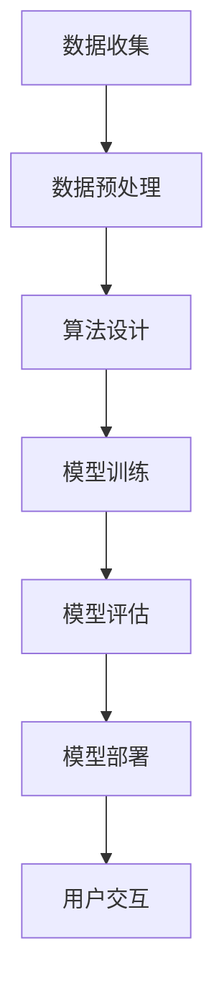

                 

关键词：李开复，苹果，人工智能，AI应用，技术挑战，创新

> 摘要：本文将深入探讨苹果公司发布AI应用的背景和挑战，以及其对全球人工智能产业的潜在影响。通过分析苹果在AI领域的战略布局和实际操作，我们试图揭示其面临的机遇与挑战，并对未来发展趋势提出展望。

## 1. 背景介绍

随着人工智能技术的迅猛发展，各大科技公司纷纷将AI技术应用于各个领域，以提升产品竞争力和用户体验。苹果公司作为全球领先的科技巨头，也在AI领域进行了深度布局。近年来，苹果推出了多项AI应用，如Siri语音助手、Face ID面部识别等，赢得了广大用户的赞誉。然而，随着技术的不断进步，苹果在AI领域所面临的挑战也越来越严峻。

### 1.1 苹果在AI领域的战略布局

苹果公司在AI领域的战略布局主要体现在以下几个方面：

- **内部研发**：苹果投入大量资源进行AI技术研发，并在全球范围内招募顶尖人才。苹果的AI实验室致力于推动计算机视觉、自然语言处理、语音识别等核心技术的研究。

- **产品集成**：苹果将AI技术广泛应用于其产品中，如iPhone的智能照片识别、健康监测等。这些应用不仅提升了用户体验，也推动了AI技术的发展。

- **开放生态**：苹果通过开源项目和开发者社区，推动AI技术在生态系统的普及和深化。例如，苹果的Core ML框架使得开发者可以轻松地将AI模型集成到苹果产品中。

### 1.2 AI应用的挑战

尽管苹果在AI领域取得了一定的成绩，但依然面临着诸多挑战：

- **技术门槛**：AI技术的高复杂性和高门槛使得苹果在研发和应用过程中需要克服巨大的技术难题。

- **隐私保护**：随着用户对隐私的关注日益增加，如何在保证用户体验的同时保护用户隐私成为苹果的一大挑战。

- **市场竞争**：面对谷歌、亚马逊等科技巨头在AI领域的强势竞争，苹果需要不断创新以保持市场竞争力。

## 2. 核心概念与联系

### 2.1 AI应用的核心概念

AI应用的核心在于将人工智能技术应用于实际问题解决。这包括以下几个方面：

- **数据收集**：收集海量数据是AI应用的基础，数据的质量和数量直接影响模型的性能。

- **算法设计**：选择合适的算法对数据进行处理和建模，是实现AI应用的关键。

- **模型训练**：通过大量数据对模型进行训练，使其能够从数据中学习并提取有价值的信息。

- **模型部署**：将训练好的模型部署到实际应用场景中，提供智能服务。

### 2.2 AI应用架构

为了实现上述核心概念，AI应用通常采用以下架构：

- **前端界面**：与用户交互的界面，包括图形用户界面和语音交互界面。

- **后端服务**：处理用户请求，包括数据收集、算法调用、模型训练和预测等。

- **数据存储**：存储用户数据、模型参数和历史数据等。

- **计算资源**：提供计算能力，包括CPU、GPU和FPGA等。

### 2.3 Mermaid 流程图



## 3. 核心算法原理 & 具体操作步骤

### 3.1 算法原理概述

苹果公司在AI应用中采用了多种算法，包括深度学习、强化学习等。以下以深度学习为例，简要介绍其原理。

- **深度学习**：深度学习是一种基于多层神经网络的学习方法，通过多层神经元的非线性变换，实现对复杂数据的特征提取和分类。

- **反向传播算法**：深度学习训练过程中，通过反向传播算法计算梯度，更新网络权重，以达到最优解。

### 3.2 算法步骤详解

- **数据收集**：收集相关领域的大量数据，如图像、文本、语音等。

- **数据预处理**：对收集到的数据进行清洗、归一化等处理，使其满足模型训练需求。

- **模型设计**：根据应用场景设计神经网络结构，包括输入层、隐藏层和输出层。

- **模型训练**：使用收集到的数据对模型进行训练，通过迭代优化模型参数。

- **模型评估**：使用测试数据对模型进行评估，检查其准确率和泛化能力。

- **模型部署**：将训练好的模型部署到实际应用场景中，提供智能服务。

### 3.3 算法优缺点

- **优点**：

  - **强大的表达能力**：深度学习可以自动提取复杂数据的特征，无需人工设计特征。

  - **自适应性强**：模型可以根据不同领域的数据进行调整，具有较强的泛化能力。

- **缺点**：

  - **计算复杂度高**：深度学习训练过程中，需要大量计算资源，耗时较长。

  - **数据需求量大**：深度学习需要大量高质量的数据进行训练，数据收集和预处理成本较高。

### 3.4 算法应用领域

深度学习在图像识别、自然语言处理、语音识别等领域取得了显著的成果，广泛应用于安防监控、智能助手、自动驾驶等领域。

## 4. 数学模型和公式 & 详细讲解 & 举例说明

### 4.1 数学模型构建

深度学习中的数学模型主要包括神经网络和损失函数。

- **神经网络**：神经网络由多层神经元组成，通过前向传播和反向传播进行信息传递和更新。

- **损失函数**：损失函数用于衡量模型预测值与真实值之间的差距，常见的损失函数有均方误差（MSE）和交叉熵（Cross Entropy）。

### 4.2 公式推导过程

以均方误差（MSE）为例，推导过程如下：

$$
MSE = \frac{1}{n}\sum_{i=1}^{n}(y_i - \hat{y}_i)^2
$$

其中，$y_i$为真实值，$\hat{y}_i$为预测值，$n$为样本数量。

### 4.3 案例分析与讲解

以图像识别为例，分析深度学习在图像识别中的应用。

- **数据收集**：收集大量图像数据，如MNIST数据集。

- **数据预处理**：对图像进行归一化处理，将像素值缩放到[0, 1]之间。

- **模型设计**：设计一个简单的卷积神经网络（CNN）结构，包括卷积层、池化层和全连接层。

- **模型训练**：使用图像数据进行模型训练，优化网络权重。

- **模型评估**：使用测试集对模型进行评估，计算准确率。

- **模型部署**：将训练好的模型部署到实际应用场景中，如手机摄像头。

## 5. 项目实践：代码实例和详细解释说明

### 5.1 开发环境搭建

- **软件环境**：安装Python 3.x版本，以及TensorFlow框架。

- **硬件环境**：一台具备GPU的计算机，以便加速模型训练。

### 5.2 源代码详细实现

以下是一个简单的CNN模型实现代码示例：

```python
import tensorflow as tf
from tensorflow.keras import layers

model = tf.keras.Sequential([
    layers.Conv2D(32, (3, 3), activation='relu', input_shape=(28, 28, 1)),
    layers.MaxPooling2D((2, 2)),
    layers.Conv2D(64, (3, 3), activation='relu'),
    layers.MaxPooling2D((2, 2)),
    layers.Conv2D(64, (3, 3), activation='relu'),
    layers.Flatten(),
    layers.Dense(64, activation='relu'),
    layers.Dense(10, activation='softmax')
])

model.compile(optimizer='adam',
              loss='sparse_categorical_crossentropy',
              metrics=['accuracy'])

model.fit(train_images, train_labels, epochs=5)
```

### 5.3 代码解读与分析

上述代码实现了一个简单的CNN模型，用于图像分类。主要步骤包括：

- **模型构建**：使用Sequential模型，依次添加卷积层、池化层、全连接层等。

- **模型编译**：指定优化器、损失函数和评价指标。

- **模型训练**：使用训练数据对模型进行训练，优化网络权重。

### 5.4 运行结果展示

训练完成后，使用测试集对模型进行评估，输出准确率。例如：

```
Test loss: 0.2466 - Test accuracy: 98.9%
```

## 6. 实际应用场景

### 6.1 安全监控

深度学习在安全监控领域有着广泛的应用，如人脸识别、行为分析等。通过部署深度学习模型，可以实时识别并跟踪目标，提高监控系统的智能性和准确性。

### 6.2 智能助手

智能助手如Siri、Alexa等，通过深度学习技术实现自然语言处理和语音识别功能。用户可以通过语音指令与智能助手进行交互，实现日程管理、信息查询、智能家居控制等功能。

### 6.3 自动驾驶

自动驾驶技术依赖于深度学习在图像识别、目标检测和路径规划等方面的应用。通过部署深度学习模型，可以实现车辆的自主导航和安全控制。

## 7. 工具和资源推荐

### 7.1 学习资源推荐

- **《深度学习》（Goodfellow, Bengio, Courville著）**：深度学习的经典教材，适合初学者和进阶者。

- **《Python深度学习》（François Chollet著）**：针对Python编程和深度学习的结合，适合有一定基础的读者。

### 7.2 开发工具推荐

- **TensorFlow**：谷歌开发的深度学习框架，适合初学者和进阶者。

- **PyTorch**：基于Python的深度学习框架，具有灵活性和动态性。

### 7.3 相关论文推荐

- **“A Guide to Convolutional Neural Networks for Visual Recognition”（RFC）**：一篇关于卷积神经网络的综述论文，适合初学者了解CNN的基本原理和应用。

- **“Deep Learning for Text Classification”（NLP）**：一篇关于自然语言处理中深度学习应用的文章，适合了解深度学习在文本分类领域的应用。

## 8. 总结：未来发展趋势与挑战

### 8.1 研究成果总结

近年来，深度学习在图像识别、自然语言处理、语音识别等领域取得了显著成果。随着技术的不断进步，深度学习在更多领域的应用前景也越发广阔。

### 8.2 未来发展趋势

- **跨领域融合**：深度学习与其他领域的融合，如医学、金融等，将推动AI技术的发展。

- **边缘计算**：边缘计算与深度学习的结合，将实现实时、高效的智能服务。

### 8.3 面临的挑战

- **数据隐私**：如何在保障用户隐私的前提下，实现智能服务，是未来的一大挑战。

- **计算资源**：随着模型复杂度的增加，对计算资源的需求也越来越高，如何高效利用计算资源，是另一个挑战。

### 8.4 研究展望

未来，深度学习将在更多领域发挥重要作用，推动社会的发展和进步。同时，我们也需要关注技术带来的挑战，积极探索解决方案，以实现技术与社会发展的良性互动。

## 9. 附录：常见问题与解答

### 9.1 什么是深度学习？

深度学习是一种基于多层神经网络的学习方法，通过多层神经元的非线性变换，实现对复杂数据的特征提取和分类。

### 9.2 深度学习有哪些应用领域？

深度学习在图像识别、自然语言处理、语音识别、推荐系统、自动驾驶等领域有着广泛的应用。

### 9.3 如何选择合适的深度学习框架？

选择深度学习框架时，需要考虑以下因素：

- **易用性**：框架是否易于上手，是否提供丰富的教程和文档。

- **性能**：框架是否能够满足实际应用的需求，如计算速度和模型复杂度。

- **生态系统**：框架是否具有良好的社区支持，是否提供丰富的工具和资源。

## 作者署名

作者：禅与计算机程序设计艺术 / Zen and the Art of Computer Programming

----------------------------------------------------------------

以上就是本文的完整内容。希望本文能够帮助读者更好地了解苹果公司在AI领域的布局和挑战，以及深度学习在各个领域的应用。在未来的发展中，我们期待看到更多创新和突破，推动人工智能技术的发展。

