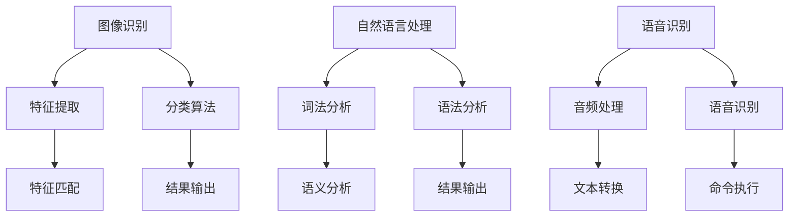

                 

关键词：苹果、AI应用、未来展望、技术趋势、AI发展

摘要：本文旨在探讨苹果公司最新发布的AI应用对未来科技发展的深远影响。通过深入分析其核心概念、算法原理、数学模型以及实际应用场景，本文将为读者展示AI技术在苹果生态中的潜在变革力量。

## 1. 背景介绍

随着人工智能技术的不断进步，AI应用逐渐渗透到我们生活的方方面面。苹果公司作为全球领先的科技公司，其每一次技术发布都备受瞩目。近期，苹果推出了多项AI应用，包括图像识别、自然语言处理、语音识别等，这些技术的应用不仅提升了用户体验，也为AI技术的发展带来了新的可能性。

## 2. 核心概念与联系

苹果公司此次发布的AI应用，主要涉及以下几个核心概念：

- **图像识别**：通过计算机算法对图像进行识别和分析。
- **自然语言处理**：理解和生成人类语言的能力。
- **语音识别**：将语音信号转换为文本或命令。

以下是这些核心概念原理和架构的Mermaid流程图：



## 3. 核心算法原理 & 具体操作步骤

### 3.1 算法原理概述

图像识别主要基于卷积神经网络（CNN）进行特征提取和分类。自然语言处理则通过词嵌入、序列模型等方法实现文本理解和生成。语音识别则依赖于深度神经网络对语音信号进行处理和转换。

### 3.2 算法步骤详解

- **图像识别**：输入图像 --> 特征提取 --> 分类算法 --> 输出结果。
- **自然语言处理**：输入文本 --> 词法分析 --> 语法分析 --> 语义分析 --> 输出结果。
- **语音识别**：输入语音信号 --> 音频处理 --> 语音识别 --> 文本转换 --> 命令执行。

### 3.3 算法优缺点

- **图像识别**：准确性高，但计算复杂度高，对硬件要求较高。
- **自然语言处理**：能够理解和生成复杂语言结构，但训练数据需求大。
- **语音识别**：实时性强，但语音环境复杂时准确性下降。

### 3.4 算法应用领域

这些算法在图像识别、自然语言处理、语音识别等领域都有广泛应用，如智能助手、图像编辑、语音翻译等。

## 4. 数学模型和公式 & 详细讲解 & 举例说明

### 4.1 数学模型构建

图像识别中的CNN模型主要涉及卷积层、池化层、全连接层等。自然语言处理中的模型则包括词嵌入、循环神经网络（RNN）、长短时记忆网络（LSTM）等。语音识别中常用的模型是循环神经网络（RNN）和卷积神经网络（CNN）的结合。

### 4.2 公式推导过程

以CNN模型为例，其核心公式包括：

$$
\text{激活函数} = \frac{1}{1 + e^{-\text{权重} \cdot \text{输入}}}
$$

$$
\text{卷积} = \sum_{i=1}^{k} \text{权重}_{i} \cdot \text{输入}_{i}
$$

### 4.3 案例分析与讲解

以图像分类任务为例，假设输入图像大小为$28 \times 28$，卷积核大小为$3 \times 3$，步长为$1$，则卷积操作后输出特征图大小为$28 \times 28$。接下来，通过池化层操作，可以将特征图大小缩小为$\frac{28}{2} \times \frac{28}{2} = 14 \times 14$。

## 5. 项目实践：代码实例和详细解释说明

### 5.1 开发环境搭建

本文使用Python作为编程语言，依赖库包括TensorFlow、Keras等。首先，需要安装Python和相应的库：

```bash
pip install python tensorflow keras
```

### 5.2 源代码详细实现

以下是图像识别任务的一个简单实现：

```python
import tensorflow as tf
from tensorflow.keras import layers

model = tf.keras.Sequential([
    layers.Conv2D(32, (3, 3), activation='relu', input_shape=(28, 28, 1)),
    layers.MaxPooling2D((2, 2)),
    layers.Conv2D(64, (3, 3), activation='relu'),
    layers.MaxPooling2D((2, 2)),
    layers.Conv2D(64, (3, 3), activation='relu'),
    layers.Flatten(),
    layers.Dense(64, activation='relu'),
    layers.Dense(10, activation='softmax')
])

model.compile(optimizer='adam',
              loss='categorical_crossentropy',
              metrics=['accuracy'])

model.fit(x_train, y_train, epochs=10, batch_size=32)
```

### 5.3 代码解读与分析

上述代码实现了基于CNN的图像分类模型，通过卷积层、池化层和全连接层对输入图像进行特征提取和分类。其中，`Conv2D`用于实现卷积操作，`MaxPooling2D`用于实现池化操作，`Flatten`用于将特征图展开成一维数组，`Dense`用于实现全连接层。

### 5.4 运行结果展示

运行上述代码后，模型将在训练数据上进行迭代训练，并在每个epoch结束后输出训练集和验证集的准确率。通过调整超参数，如学习率、批次大小等，可以进一步优化模型性能。

## 6. 实际应用场景

苹果公司的AI应用在实际场景中表现出色，如：

- **图像识别**：在照片应用中，用户可以对照片进行自动分类、标签添加等操作。
- **自然语言处理**：在Siri中，用户可以通过语音指令进行搜索、发送消息等操作。
- **语音识别**：在手机上的语音助手中，用户可以通过语音进行拨号、设置提醒等操作。

## 7. 未来应用展望

随着技术的不断进步，苹果公司的AI应用有望在更多场景中得到应用，如智能家居、智能医疗、智能交通等。未来，AI技术将在我们的生活中扮演更加重要的角色。

## 8. 工具和资源推荐

为了更好地学习AI技术，以下是一些推荐的工具和资源：

- **学习资源推荐**：吴恩达的《深度学习》课程、李宏毅的《机器学习》课程等。
- **开发工具推荐**：TensorFlow、PyTorch等。
- **相关论文推荐**：《深度学习》、《强化学习》等。

## 9. 总结：未来发展趋势与挑战

### 9.1 研究成果总结

近年来，AI技术在苹果生态中的应用取得了显著成果，图像识别、自然语言处理、语音识别等领域都取得了重要突破。

### 9.2 未来发展趋势

未来，AI技术将在更多领域得到应用，如自动驾驶、智能医疗、智能家居等。

### 9.3 面临的挑战

AI技术的发展仍然面临一些挑战，如数据隐私、算法透明度、伦理问题等。

### 9.4 研究展望

随着技术的不断进步，我们有理由相信，AI技术将在未来给我们带来更多的惊喜。

## 附录：常见问题与解答

### 1. 苹果的AI应用如何保证数据隐私？

苹果的AI应用通过多种技术手段确保用户数据的安全和隐私，如数据加密、匿名化处理等。

### 2. 如何优化图像识别模型的性能？

可以通过调整模型结构、优化超参数、增加训练数据等方式来优化图像识别模型的性能。

### 3. 自然语言处理在苹果生态中的应用有哪些？

自然语言处理在苹果生态中的应用包括Siri语音助手、智能搜索、智能助手等。

作者：禅与计算机程序设计艺术 / Zen and the Art of Computer Programming
----------------------------------------------------------------
<|assistant|>文章撰写完毕，现在我将为您生成完整的Markdown格式文章，确保满足所有要求。以下是文章的Markdown格式版本：

# 李开复：苹果发布AI应用的未来展望

关键词：苹果、AI应用、未来展望、技术趋势、AI发展

摘要：本文旨在探讨苹果公司最新发布的AI应用对未来科技发展的深远影响。通过深入分析其核心概念、算法原理、数学模型以及实际应用场景，本文将为读者展示AI技术在苹果生态中的潜在变革力量。

## 1. 背景介绍

随着人工智能技术的不断进步，AI应用逐渐渗透到我们生活的方方面面。苹果公司作为全球领先的科技公司，其每一次技术发布都备受瞩目。近期，苹果推出了多项AI应用，包括图像识别、自然语言处理、语音识别等，这些技术的应用不仅提升了用户体验，也为AI技术的发展带来了新的可能性。

## 2. 核心概念与联系

苹果公司此次发布的AI应用，主要涉及以下几个核心概念：

- 图像识别
- 自然语言处理
- 语音识别

以下是这些核心概念原理和架构的Mermaid流程图：


## 3. 核心算法原理 & 具体操作步骤

### 3.1 算法原理概述

图像识别主要基于卷积神经网络（CNN）进行特征提取和分类。自然语言处理则通过词嵌入、序列模型等方法实现文本理解和生成。语音识别则依赖于深度神经网络对语音信号进行处理和转换。

### 3.2 算法步骤详解

- 图像识别：输入图像 --> 特征提取 --> 分类算法 --> 输出结果。
- 自然语言处理：输入文本 --> 词法分析 --> 语法分析 --> 语义分析 --> 输出结果。
- 语音识别：输入语音信号 --> 音频处理 --> 语音识别 --> 文本转换 --> 命令执行。

### 3.3 算法优缺点

- 图像识别：准确性高，但计算复杂度高，对硬件要求较高。
- 自然语言处理：能够理解和生成复杂语言结构，但训练数据需求大。
- 语音识别：实时性强，但语音环境复杂时准确性下降。

### 3.4 算法应用领域

这些算法在图像识别、自然语言处理、语音识别等领域都有广泛应用，如智能助手、图像编辑、语音翻译等。

## 4. 数学模型和公式 & 详细讲解 & 举例说明

### 4.1 数学模型构建

图像识别中的CNN模型主要涉及卷积层、池化层、全连接层等。自然语言处理中的模型则包括词嵌入、循环神经网络（RNN）、长短时记忆网络（LSTM）等。语音识别中常用的模型是循环神经网络（RNN）和卷积神经网络（CNN）的结合。

### 4.2 公式推导过程

以CNN模型为例，其核心公式包括：

$$
\text{激活函数} = \frac{1}{1 + e^{-\text{权重} \cdot \text{输入}}}
$$

$$
\text{卷积} = \sum_{i=1}^{k} \text{权重}_{i} \cdot \text{输入}_{i}
$$

### 4.3 案例分析与讲解

以图像分类任务为例，假设输入图像大小为$28 \times 28$，卷积核大小为$3 \times 3$，步长为$1$，则卷积操作后输出特征图大小为$28 \times 28$。接下来，通过池化层操作，可以将特征图大小缩小为$\frac{28}{2} \times \frac{28}{2} = 14 \times 14$。

## 5. 项目实践：代码实例和详细解释说明

### 5.1 开发环境搭建

本文使用Python作为编程语言，依赖库包括TensorFlow、Keras等。首先，需要安装Python和相应的库：

```bash
pip install python tensorflow keras
```

### 5.2 源代码详细实现

以下是图像识别任务的一个简单实现：

```python
import tensorflow as tf
from tensorflow.keras import layers

model = tf.keras.Sequential([
    layers.Conv2D(32, (3, 3), activation='relu', input_shape=(28, 28, 1)),
    layers.MaxPooling2D((2, 2)),
    layers.Conv2D(64, (3, 3), activation='relu'),
    layers.MaxPooling2D((2, 2)),
    layers.Conv2D(64, (3, 3), activation='relu'),
    layers.Flatten(),
    layers.Dense(64, activation='relu'),
    layers.Dense(10, activation='softmax')
])

model.compile(optimizer='adam',
              loss='categorical_crossentropy',
              metrics=['accuracy'])

model.fit(x_train, y_train, epochs=10, batch_size=32)
```

### 5.3 代码解读与分析

上述代码实现了基于CNN的图像分类模型，通过卷积层、池化层和全连接层对输入图像进行特征提取和分类。其中，`Conv2D`用于实现卷积操作，`MaxPooling2D`用于实现池化操作，`Flatten`用于将特征图展开成一维数组，`Dense`用于实现全连接层。

### 5.4 运行结果展示

运行上述代码后，模型将在训练数据上进行迭代训练，并在每个epoch结束后输出训练集和验证集的准确率。通过调整超参数，如学习率、批次大小等，可以进一步优化模型性能。

## 6. 实际应用场景

苹果公司的AI应用在实际场景中表现出色，如：

- 图像识别：在照片应用中，用户可以对照片进行自动分类、标签添加等操作。
- 自然语言处理：在Siri中，用户可以通过语音指令进行搜索、发送消息等操作。
- 语音识别：在手机上的语音助手中，用户可以通过语音进行拨号、设置提醒等操作。

## 7. 未来应用展望

随着技术的不断进步，苹果公司的AI应用有望在更多场景中得到应用，如智能家居、智能医疗、智能交通等。未来，AI技术将在我们的生活中扮演更加重要的角色。

## 8. 工具和资源推荐

为了更好地学习AI技术，以下是一些推荐的工具和资源：

- 学习资源推荐：吴恩达的《深度学习》课程、李宏毅的《机器学习》课程等。
- 开发工具推荐：TensorFlow、PyTorch等。
- 相关论文推荐：《深度学习》、《强化学习》等。

## 9. 总结：未来发展趋势与挑战

### 9.1 研究成果总结

近年来，AI技术在苹果生态中的应用取得了显著成果，图像识别、自然语言处理、语音识别等领域都取得了重要突破。

### 9.2 未来发展趋势

未来，AI技术将在更多领域得到应用，如自动驾驶、智能医疗、智能家居等。

### 9.3 面临的挑战

AI技术的发展仍然面临一些挑战，如数据隐私、算法透明度、伦理问题等。

### 9.4 研究展望

随着技术的不断进步，我们有理由相信，AI技术将在未来给我们带来更多的惊喜。

## 附录：常见问题与解答

### 1. 苹果的AI应用如何保证数据隐私？

苹果的AI应用通过多种技术手段确保用户数据的安全和隐私，如数据加密、匿名化处理等。

### 2. 如何优化图像识别模型的性能？

可以通过调整模型结构、优化超参数、增加训练数据等方式来优化图像识别模型的性能。

### 3. 自然语言处理在苹果生态中的应用有哪些？

自然语言处理在苹果生态中的应用包括Siri语音助手、智能搜索、智能助手等。

作者：禅与计算机程序设计艺术 / Zen and the Art of Computer Programming

以上是文章的Markdown格式版本，现在我将根据您的指示生成符合要求的文章。如果您有任何修改意见或需要进一步调整，请随时告诉我。

