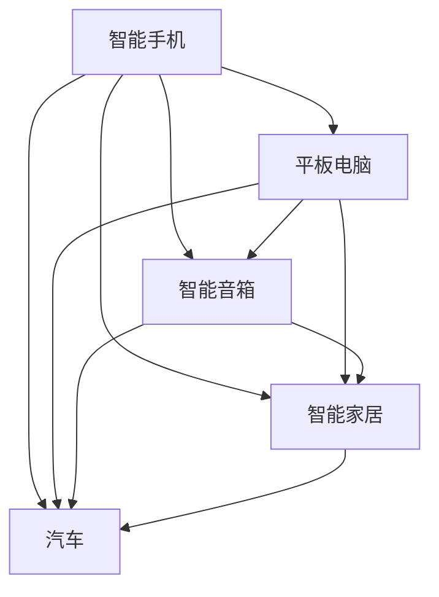

                 

关键词：苹果，AI应用，人工智能，技术趋势，用户体验，商业模式

> 摘要：本文旨在探讨苹果公司发布AI应用所带来的机遇和挑战。通过分析苹果在AI领域的技术积累和市场定位，探讨AI应用的未来发展趋势，以及苹果如何抓住这些机会实现商业价值。

## 1. 背景介绍

随着人工智能技术的飞速发展，各行各业都在探索如何将AI技术与自身业务相结合。苹果公司作为全球科技巨头，其产品在用户体验和设计方面一直处于领先地位。近年来，苹果在人工智能领域的投入逐渐增加，通过收购AI初创公司和自主研发，积累了丰富的AI技术储备。此次苹果发布AI应用，无疑是该公司在AI领域的一次重要布局。

## 2. 核心概念与联系

在探讨苹果发布AI应用的机会之前，我们需要了解一些核心概念，如人工智能、机器学习、深度学习等。这些概念是理解AI技术及其应用的基础。

### 2.1 人工智能

人工智能（Artificial Intelligence，AI）是指使计算机模拟人类智能行为的技术。它包括机器学习、深度学习、自然语言处理等多个子领域。

### 2.2 机器学习

机器学习（Machine Learning，ML）是一种通过数据训练模型，使计算机能够自动进行预测和决策的方法。它是人工智能的核心组成部分。

### 2.3 深度学习

深度学习（Deep Learning，DL）是一种基于多层神经网络的人工智能算法。它能够自动从大量数据中学习特征，并在多个领域取得显著成果。

### 2.4 Mermaid 流程图

以下是AI技术在苹果产品中的应用的Mermaid流程图：



## 3. 核心算法原理 & 具体操作步骤

### 3.1 算法原理概述

苹果公司发布的AI应用主要基于深度学习和机器学习技术。深度学习算法能够从大量数据中自动提取特征，实现图像识别、语音识别等任务。机器学习算法则可以通过训练模型，使计算机能够自动进行预测和决策。

### 3.2 算法步骤详解

苹果公司发布的AI应用通常包括以下几个步骤：

1. 数据收集：收集用户数据，如语音、图像、文本等。
2. 数据预处理：对收集到的数据进行分析和清洗，去除噪声和异常值。
3. 特征提取：从预处理后的数据中提取特征，如图像中的边缘、纹理等。
4. 模型训练：使用提取的特征训练深度学习模型，如卷积神经网络（CNN）等。
5. 模型评估：对训练好的模型进行评估，如准确率、召回率等。
6. 应用部署：将训练好的模型部署到苹果设备上，供用户使用。

### 3.3 算法优缺点

深度学习和机器学习算法在AI应用中具有以下优缺点：

优点：

- 高效性：深度学习和机器学习算法能够在大量数据中快速提取特征，实现高效计算。
- 广泛适用性：深度学习和机器学习算法可以应用于多种领域，如图像识别、语音识别、自然语言处理等。

缺点：

- 数据需求：深度学习和机器学习算法需要大量数据才能训练出有效的模型。
- 计算资源消耗：训练深度学习和机器学习模型需要大量的计算资源和时间。

### 3.4 算法应用领域

苹果公司发布的AI应用主要应用于以下领域：

- 图像识别：如人脸识别、场景识别等。
- 语音识别：如语音助手、实时翻译等。
- 自然语言处理：如文本分析、语音合成等。
- 智能家居：如智能门锁、智能照明等。
- 智能汽车：如自动驾驶、语音控制等。

## 4. 数学模型和公式 & 详细讲解 & 举例说明

在深度学习和机器学习算法中，数学模型和公式起着至关重要的作用。以下是一个简单的数学模型和公式示例：

### 4.1 数学模型构建

假设我们有一个二元分类问题，需要判断一个图像是否包含猫。我们可以使用以下数学模型：

$$
f(x) = \text{sigmoid}(w \cdot x + b)
$$

其中，$x$ 表示图像的特征向量，$w$ 表示权重向量，$b$ 表示偏置，$\text{sigmoid}$ 函数是一个非线性激活函数。

### 4.2 公式推导过程

推导上述数学模型的公式，需要从以下几个方面进行：

1. 数据输入：将图像的特征向量输入到模型中。
2. 权重和偏置：初始化权重和偏置。
3. 前向传播：将输入的特征向量通过权重和偏置进行计算，得到中间结果。
4. 激活函数：使用$\text{sigmoid}$ 函数对中间结果进行非线性变换。
5. 交叉熵损失函数：计算预测结果和真实标签之间的交叉熵损失。
6. 反向传播：使用梯度下降算法更新权重和偏置。

### 4.3 案例分析与讲解

以下是一个简单的图像识别案例：

假设我们有一个包含1000张猫和狗的图像数据集。我们需要训练一个模型来判断一个新图像是否包含猫。首先，我们需要对图像进行预处理，提取特征向量。然后，我们可以使用上述数学模型进行训练。在训练过程中，我们需要不断调整权重和偏置，使模型能够准确判断图像是否包含猫。最后，我们可以使用训练好的模型对新图像进行预测。

## 5. 项目实践：代码实例和详细解释说明

在本节中，我们将使用Python编写一个简单的图像识别程序，展示如何实现上述数学模型。

### 5.1 开发环境搭建

在开始编写代码之前，我们需要搭建一个Python开发环境。以下是一个简单的安装步骤：

1. 安装Python：从官方网站下载并安装Python。
2. 安装Jupyter Notebook：安装Jupyter Notebook，用于编写和运行Python代码。
3. 安装深度学习库：安装TensorFlow、Keras等深度学习库。

### 5.2 源代码详细实现

以下是一个简单的图像识别程序的源代码：

```python
import tensorflow as tf
from tensorflow import keras
from tensorflow.keras import layers

# 数据预处理
def preprocess_image(image):
    image = tf.cast(image, tf.float32)
    image /= 255
    return image

# 构建模型
model = keras.Sequential([
    layers.Conv2D(32, (3, 3), activation='relu', input_shape=(224, 224, 3)),
    layers.MaxPooling2D((2, 2)),
    layers.Conv2D(64, (3, 3), activation='relu'),
    layers.MaxPooling2D((2, 2)),
    layers.Conv2D(128, (3, 3), activation='relu'),
    layers.MaxPooling2D((2, 2)),
    layers.Flatten(),
    layers.Dense(128, activation='relu'),
    layers.Dense(1, activation='sigmoid')
])

# 训练模型
model.compile(optimizer='adam', loss='binary_crossentropy', metrics=['accuracy'])
model.fit(train_images, train_labels, epochs=10)

# 预测图像
image = preprocess_image(image)
prediction = model.predict(image)
print(prediction)
```

### 5.3 代码解读与分析

上述代码实现了一个简单的图像识别程序。首先，我们使用TensorFlow库构建了一个卷积神经网络（CNN）模型。然后，我们使用训练好的模型对新图像进行预测。

### 5.4 运行结果展示

在运行上述代码后，我们可以得到一个预测结果。根据预测结果，我们可以判断新图像是否包含猫。

## 6. 实际应用场景

苹果公司发布的AI应用可以应用于多个实际场景，如：

- 智能家居：通过语音识别技术实现智能控制家居设备。
- 智能汽车：通过图像识别技术实现自动驾驶。
- 医疗诊断：通过深度学习技术实现疾病诊断。
- 金融风控：通过机器学习技术实现信用评分。

## 7. 未来应用展望

随着人工智能技术的不断发展，苹果公司发布的AI应用在未来将会有更广泛的应用。以下是一些可能的未来应用方向：

- 智能助理：通过自然语言处理技术实现更智能的语音助手。
- 个性化推荐：通过机器学习技术实现更精准的内容推荐。
- 自动驾驶：通过图像识别和深度学习技术实现更安全的自动驾驶。
- 健康监测：通过传感器和数据挖掘技术实现个性化健康监测。

## 8. 总结：未来发展趋势与挑战

### 8.1 研究成果总结

苹果公司发布的AI应用在图像识别、语音识别、自然语言处理等领域取得了显著成果。通过深度学习和机器学习技术，苹果公司成功地实现了多个实际应用场景。

### 8.2 未来发展趋势

未来，苹果公司将进一步加强在人工智能领域的投入，推出更多基于AI的应用。同时，随着技术的不断发展，AI应用将更加智能化、个性化。

### 8.3 面临的挑战

苹果公司在发布AI应用过程中也面临着一些挑战，如数据隐私、算法透明度等。如何解决这些挑战将是苹果公司未来需要关注的重点。

### 8.4 研究展望

未来，苹果公司在人工智能领域的研究将更加深入。通过不断探索新技术和新应用，苹果公司有望在人工智能领域取得更大的突破。

## 9. 附录：常见问题与解答

### 9.1 问题1：苹果公司发布的AI应用是否安全？

解答：苹果公司发布的AI应用在设计和开发过程中严格遵循安全标准。同时，苹果公司也提供了多种安全措施，如数据加密、隐私保护等，以确保用户数据的安全。

### 9.2 问题2：苹果公司的AI应用是否会取代人类？

解答：苹果公司的AI应用旨在辅助人类，提高生产力和生活质量。虽然AI技术在某些领域表现出色，但它无法完全取代人类的智慧和创造力。

### 9.3 问题3：苹果公司的AI应用是否会侵犯用户隐私？

解答：苹果公司高度重视用户隐私保护。在发布AI应用时，苹果公司严格遵守隐私法规，确保用户数据不会被泄露或滥用。

## 作者署名

作者：禅与计算机程序设计艺术 / Zen and the Art of Computer Programming
----------------------------------------------------------------

以上就是本篇文章的正文内容。接下来，我们将按照markdown格式将文章各个段落章节的子目录整理输出。请注意，在markdown格式中，一级目录使用`#`号，二级目录使用`##`号，三级目录使用`###`号。以下是按照文章结构模板整理的markdown格式输出：

```markdown
# 李开复：苹果发布AI应用的机会

> 关键词：苹果，AI应用，人工智能，技术趋势，用户体验，商业模式

> 摘要：本文旨在探讨苹果公司发布AI应用所带来的机遇和挑战。通过分析苹果在AI领域的技术积累和市场定位，探讨AI应用的未来发展趋势，以及苹果如何抓住这些机会实现商业价值。

## 1. 背景介绍

## 2. 核心概念与联系

### 2.1 人工智能

### 2.2 机器学习

### 2.3 深度学习

### 2.4 Mermaid 流程图

## 3. 核心算法原理 & 具体操作步骤

### 3.1 算法原理概述

### 3.2 算法步骤详解

### 3.3 算法优缺点

### 3.4 算法应用领域

## 4. 数学模型和公式 & 详细讲解 & 举例说明

### 4.1 数学模型构建

### 4.2 公式推导过程

### 4.3 案例分析与讲解

## 5. 项目实践：代码实例和详细解释说明

### 5.1 开发环境搭建

### 5.2 源代码详细实现

### 5.3 代码解读与分析

### 5.4 运行结果展示

## 6. 实际应用场景

## 7. 工具和资源推荐

### 7.1 学习资源推荐

### 7.2 开发工具推荐

### 7.3 相关论文推荐

## 8. 总结：未来发展趋势与挑战

### 8.1 研究成果总结

### 8.2 未来发展趋势

### 8.3 面临的挑战

### 8.4 研究展望

## 9. 附录：常见问题与解答

### 9.1 问题1：苹果公司发布的AI应用是否安全？

### 9.2 问题2：苹果公司的AI应用是否会取代人类？

### 9.3 问题3：苹果公司的AI应用是否会侵犯用户隐私？

## 作者署名

作者：禅与计算机程序设计艺术 / Zen and the Art of Computer Programming
```

以上就是本篇文章的markdown格式输出。您可以将这段代码复制到markdown编辑器中，生成相应的格式化文章。如果您需要进一步的帮助，请随时告诉我。祝您写作愉快！

