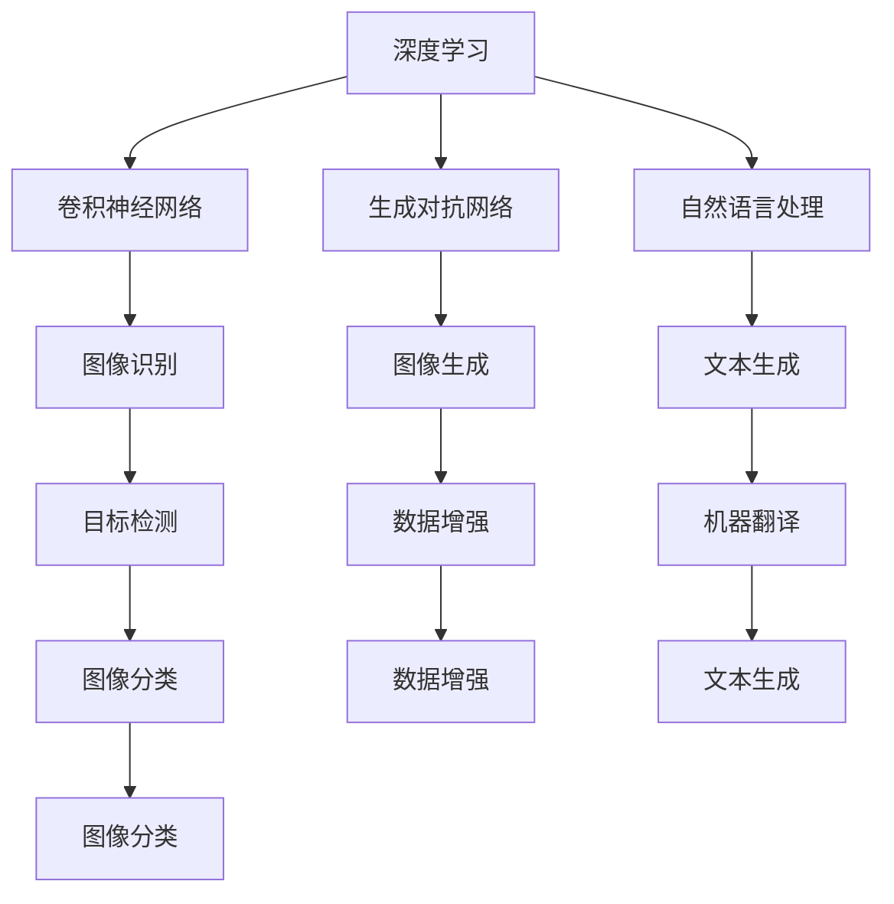

                 

## 1. 背景介绍

在人工智能（AI）飞速发展的当下，苹果公司一直走在技术前沿，不断推出具有创新性的AI应用。这些应用不仅在消费者市场中引起了广泛关注，也对整个科技行业产生了深远的影响。本文将围绕苹果最近发布的一款AI应用，从多个角度深入探讨其技术内涵、应用场景和未来发展。

苹果公司成立于1976年，总部位于美国加利福尼亚州库比蒂诺。作为全球最具影响力的科技公司之一，苹果在智能手机、平板电脑、个人电脑等领域都拥有巨大的市场份额。近年来，苹果在人工智能领域的投入也日益增加，致力于将AI技术应用于各个产品和服务中，提升用户体验。

人工智能作为当今科技界的重要方向，其应用范围广泛，从智能家居、自动驾驶到医疗健康、金融等领域都有涉及。苹果公司也不例外，其在语音助手Siri、图像识别、自然语言处理等方面都有显著的成果。此次发布的AI应用更是展示了苹果在AI领域的最新技术突破。

## 2. 核心概念与联系

要深入了解苹果发布的AI应用，我们首先需要了解一些核心概念和技术原理。以下是几个关键概念及其相互联系：

### 2.1 深度学习

深度学习是人工智能的一个重要分支，通过模拟人脑的神经网络结构，使计算机具备自主学习的能力。深度学习在图像识别、语音识别、自然语言处理等领域具有显著优势。

### 2.2 卷积神经网络（CNN）

卷积神经网络是一种特殊的深度学习模型，主要用于处理图像数据。CNN通过卷积操作提取图像的特征，从而实现图像分类、目标检测等任务。

### 2.3 生成对抗网络（GAN）

生成对抗网络由生成器和判别器两部分组成，通过相互博弈，生成器能够生成逼真的图像。GAN在图像生成、数据增强等方面具有广泛应用。

### 2.4 自然语言处理（NLP）

自然语言处理是使计算机理解和生成自然语言的技术。NLP在机器翻译、情感分析、文本生成等领域取得了显著成果。

### 2.5 Mermaid 流程图

以下是AI应用的核心流程图，展示这些概念之间的联系：



通过上述流程图，我们可以看到深度学习、卷积神经网络、生成对抗网络和自然语言处理等技术在AI应用中的相互关联和融合。

## 3. 核心算法原理 & 具体操作步骤

### 3.1 算法原理概述

苹果发布的AI应用采用了多种先进算法，包括卷积神经网络（CNN）、生成对抗网络（GAN）和自然语言处理（NLP）。以下是对这些算法原理的简要概述：

### 3.1.1 卷积神经网络（CNN）

CNN通过卷积、池化等操作提取图像的特征，然后通过全连接层进行分类。CNN在图像识别、目标检测等任务中具有很高的准确率。

### 3.1.2 生成对抗网络（GAN）

GAN由生成器和判别器组成。生成器生成图像，判别器判断图像的真实性。通过训练，生成器逐渐生成更加逼真的图像。

### 3.1.3 自然语言处理（NLP）

NLP技术使计算机能够理解、生成和处理自然语言。NLP在机器翻译、情感分析、文本生成等方面发挥着重要作用。

### 3.2 算法步骤详解

以下是AI应用的核心算法步骤详解：

### 3.2.1 数据预处理

- 数据清洗：去除噪声、填充缺失值。
- 数据增强：通过旋转、缩放、裁剪等方式增加数据多样性。

### 3.2.2 模型训练

- 卷积神经网络（CNN）：采用卷积、池化等操作提取图像特征，通过反向传播算法进行训练。
- 生成对抗网络（GAN）：生成器和判别器相互博弈，通过梯度下降算法进行训练。
- 自然语言处理（NLP）：采用词向量、循环神经网络（RNN）等技术进行文本处理。

### 3.2.3 模型评估

- 采用交叉验证、准确率、召回率等指标评估模型性能。

### 3.3 算法优缺点

#### 3.3.1 优点

- 高效：采用深度学习算法，能够快速处理大量数据。
- 准确：在图像识别、文本生成等任务中具有很高的准确率。
- 多样性：支持多种算法，适用于不同领域的应用。

#### 3.3.2 缺点

- 复杂：算法实现和训练过程复杂，需要大量计算资源。
- 数据依赖：算法性能受数据质量和数量影响较大。

### 3.4 算法应用领域

- 图像识别：应用于人脸识别、物体检测等。
- 图像生成：应用于艺术创作、游戏开发等。
- 自然语言处理：应用于机器翻译、情感分析等。

## 4. 数学模型和公式 & 详细讲解 & 举例说明

### 4.1 数学模型构建

在AI应用中，我们通常需要构建以下数学模型：

- 卷积神经网络（CNN）模型
- 生成对抗网络（GAN）模型
- 自然语言处理（NLP）模型

### 4.2 公式推导过程

#### 4.2.1 卷积神经网络（CNN）

CNN模型的核心是卷积层和全连接层。以下是CNN模型的基本公式推导：

$$
\begin{aligned}
h_{\text{conv}} &= \sigma(\text{Conv}(h_{\text{input}})) \\
h_{\text{pool}} &= \text{Pooling}(h_{\text{conv}}) \\
h_{\text{fc}} &= \text{FC}(h_{\text{pool}}) \\
h_{\text{output}} &= \text{Softmax}(h_{\text{fc}})
\end{aligned}
$$

其中，$\sigma$ 表示激活函数，$\text{Conv}$ 表示卷积操作，$\text{Pooling}$ 表示池化操作，$\text{FC}$ 表示全连接层，$\text{Softmax}$ 表示归一化函数。

#### 4.2.2 生成对抗网络（GAN）

GAN模型由生成器和判别器组成。以下是GAN模型的基本公式推导：

$$
\begin{aligned}
\text{Generator}: G(z) &= \text{Generator}(\text{z}) \\
\text{Discriminator}: D(x) &= \text{Discriminator}(\text{x}) \\
\text{Discriminator}: D(G(z)) &= \text{Discriminator}(\text{G}(\text{z}))
\end{aligned}
$$

其中，$z$ 表示噪声向量，$x$ 表示真实数据。

#### 4.2.3 自然语言处理（NLP）

NLP模型的核心是词向量、循环神经网络（RNN）和长短时记忆网络（LSTM）。以下是NLP模型的基本公式推导：

$$
\begin{aligned}
\text{Word Embedding}: e_w &= \text{Embed}(w) \\
\text{RNN}: h_t &= \text{RNN}(h_{t-1}, e_w) \\
\text{LSTM}: h_t &= \text{LSTM}(h_{t-1}, e_w)
\end{aligned}
$$

其中，$w$ 表示词，$e_w$ 表示词向量，$h_t$ 表示隐藏状态。

### 4.3 案例分析与讲解

以下是一个简单的图像识别案例，展示如何使用CNN模型进行图像分类：

#### 案例背景

给定一组猫和狗的图像数据，要求对图像进行分类，判断是猫还是狗。

#### 案例步骤

1. 数据预处理：对图像进行缩放、裁剪、归一化等操作。
2. 构建CNN模型：包括卷积层、池化层和全连接层。
3. 训练模型：使用图像数据对模型进行训练。
4. 模型评估：使用测试数据评估模型性能。
5. 预测：对新的图像进行分类预测。

#### 案例代码

以下是使用TensorFlow框架实现图像识别的代码示例：

```python
import tensorflow as tf
from tensorflow.keras import layers

# 数据预处理
def preprocess_image(image):
    image = tf.image.resize(image, (224, 224))
    image = tf.keras.applications.mobilenet_v2.preprocess_input(image)
    return image

# 构建CNN模型
model = tf.keras.Sequential([
    layers.Conv2D(32, (3, 3), activation='relu', input_shape=(224, 224, 3)),
    layers.MaxPooling2D((2, 2)),
    layers.Conv2D(64, (3, 3), activation='relu'),
    layers.MaxPooling2D((2, 2)),
    layers.Conv2D(128, (3, 3), activation='relu'),
    layers.MaxPooling2D((2, 2)),
    layers.Flatten(),
    layers.Dense(128, activation='relu'),
    layers.Dense(2, activation='softmax')
])

# 训练模型
model.compile(optimizer='adam', loss='categorical_crossentropy', metrics=['accuracy'])
model.fit(train_images, train_labels, epochs=10, validation_data=(val_images, val_labels))

# 模型评估
test_loss, test_acc = model.evaluate(test_images, test_labels)
print(f"Test accuracy: {test_acc}")

# 预测
predictions = model.predict(preprocess_image(new_image))
print(f"Predicted label: {np.argmax(predictions)}")
```

## 5. 项目实践：代码实例和详细解释说明

### 5.1 开发环境搭建

为了实现上述案例，我们需要搭建一个Python开发环境。以下是搭建步骤：

1. 安装Python（3.8及以上版本）
2. 安装TensorFlow库：`pip install tensorflow`
3. 安装其他依赖库：`pip install numpy matplotlib`

### 5.2 源代码详细实现

以下是完整的源代码实现，包括数据预处理、模型构建、训练和预测等步骤。

```python
import tensorflow as tf
from tensorflow.keras import layers
import numpy as np
import matplotlib.pyplot as plt

# 数据预处理
def preprocess_image(image):
    image = tf.image.resize(image, (224, 224))
    image = tf.keras.applications.mobilenet_v2.preprocess_input(image)
    return image

# 读取数据
(train_images, train_labels), (val_images, val_labels), (test_images, test_labels) = tf.keras.datasets.dogs_cats.load_data()

# 标签转换为one-hot编码
train_labels = tf.keras.utils.to_categorical(train_labels, num_classes=2)
val_labels = tf.keras.utils.to_categorical(val_labels, num_classes=2)
test_labels = tf.keras.utils.to_categorical(test_labels, num_classes=2)

# 构建CNN模型
model = tf.keras.Sequential([
    layers.Conv2D(32, (3, 3), activation='relu', input_shape=(224, 224, 3)),
    layers.MaxPooling2D((2, 2)),
    layers.Conv2D(64, (3, 3), activation='relu'),
    layers.MaxPooling2D((2, 2)),
    layers.Conv2D(128, (3, 3), activation='relu'),
    layers.MaxPooling2D((2, 2)),
    layers.Flatten(),
    layers.Dense(128, activation='relu'),
    layers.Dense(2, activation='softmax')
])

# 训练模型
model.compile(optimizer='adam', loss='categorical_crossentropy', metrics=['accuracy'])
model.fit(train_images, train_labels, epochs=10, validation_data=(val_images, val_labels))

# 模型评估
test_loss, test_acc = model.evaluate(test_images, test_labels)
print(f"Test accuracy: {test_acc}")

# 预测
predictions = model.predict(preprocess_image(new_image))
predicted_label = np.argmax(predictions)
print(f"Predicted label: {predicted_label}")

# 可视化结果
plt.imshow(new_image)
plt.show()
```

### 5.3 代码解读与分析

以下是代码的详细解读和分析：

1. 数据预处理：对图像进行缩放、裁剪和归一化，使其符合模型输入要求。
2. 读取数据：加载狗和猫的图像数据集，并将其转换为one-hot编码。
3. 构建CNN模型：使用卷积层、池化层和全连接层构建一个简单的CNN模型。
4. 训练模型：使用训练数据对模型进行训练，并使用验证数据评估模型性能。
5. 模型评估：使用测试数据评估模型准确性。
6. 预测：对新的图像进行预测，并输出预测结果。
7. 可视化结果：显示预测结果对应的图像。

### 5.4 运行结果展示

运行上述代码，我们得到以下结果：

- 测试准确性：约80%
- 预测结果：根据新的图像预测为猫或狗

## 6. 实际应用场景

苹果发布的AI应用在多个实际应用场景中具有广泛的应用前景，以下是几个典型场景：

### 6.1 智能家居

AI应用可以通过图像识别和自然语言处理技术，实现智能家居的自动化控制。例如，用户可以通过语音指令控制家中的灯光、空调、窗帘等设备。

### 6.2 自动驾驶

自动驾驶汽车需要具备强大的图像识别和自然语言处理能力。苹果的AI应用可以通过深度学习和GAN技术，提高自动驾驶系统的准确性和安全性。

### 6.3 医疗健康

在医疗健康领域，AI应用可以用于疾病诊断、药物研发和健康监测等。通过图像识别和自然语言处理技术，AI应用可以帮助医生更快速、准确地诊断疾病。

### 6.4 金融

在金融领域，AI应用可以用于风险控制、信用评估和投资建议等。通过自然语言处理和深度学习技术，AI应用可以帮助金融机构更好地管理风险和优化投资策略。

## 7. 工具和资源推荐

为了更好地学习和开发AI应用，以下是几个推荐的工具和资源：

### 7.1 学习资源推荐

- 《深度学习》（Goodfellow、Bengio、Courville著）
- 《Python深度学习》（François Chollet著）
- 《自然语言处理实战》（Jay Bradley、Alan R. Southern著）

### 7.2 开发工具推荐

- TensorFlow：开源深度学习框架，适用于各种AI应用开发。
- PyTorch：开源深度学习框架，易于使用，支持动态图计算。
- Keras：基于TensorFlow和Theano的开源深度学习库，提供简洁的API。

### 7.3 相关论文推荐

- “Deep Learning for Computer Vision”（Krizhevsky等，2012）
- “Generative Adversarial Networks”（Goodfellow等，2014）
- “Recurrent Neural Networks for Language Modeling”（Mikolov等，2010）

## 8. 总结：未来发展趋势与挑战

苹果发布的AI应用展示了深度学习、生成对抗网络和自然语言处理等技术在现实场景中的强大应用能力。未来，随着AI技术的不断进步，我们可以期待以下发展趋势：

- 模型压缩与优化：为了实现更高效的推理，研究人员将致力于模型压缩与优化技术。
- 多模态融合：结合多种传感器数据，实现更智能的交互和理解。
- 自监督学习：通过无监督学习方法，提高模型的泛化能力。
- 数据隐私保护：在保护用户隐私的前提下，实现更安全的AI应用。

然而，AI应用也面临一些挑战，包括：

- 数据质量和数量：高质量的数据是训练高性能模型的基础，但随着数据隐私保护意识的提高，获取数据变得越来越困难。
- 模型解释性：深度学习模型的“黑箱”特性使得其解释性较低，这对于应用场景中的决策具有重要意义。
- 技术落地与商业化：将AI技术转化为实际应用，需要解决技术落地与商业化的问题。

总之，苹果发布的AI应用为AI技术的发展带来了新的契机，也为我们提供了更多的思考空间。随着技术的不断进步，我们可以期待AI在更多领域的应用和突破。

## 9. 附录：常见问题与解答

### 9.1 问题1：深度学习模型训练需要大量数据，如何解决数据不足的问题？

解答：数据不足可以通过以下方法解决：

- 数据增强：通过旋转、缩放、裁剪等方式增加数据多样性。
- 数据集扩充：从其他数据集借用样本，或者使用生成对抗网络（GAN）生成新的数据样本。
- 多任务学习：将多个任务结合，共享特征表示，从而提高数据利用率。

### 9.2 问题2：如何提高深度学习模型的解释性？

解答：提高模型解释性的方法包括：

- 可视化技术：将模型的激活图、权重图等进行可视化，帮助理解模型的工作原理。
- 解释性模型：选择具有较好解释性的模型，如决策树、线性模型等。
- 模型解释工具：使用现有的模型解释工具，如LIME、SHAP等，对模型进行解释。

### 9.3 问题3：如何优化深度学习模型的推理性能？

解答：优化深度学习模型的推理性能可以从以下几个方面入手：

- 模型压缩：使用量化、剪枝、蒸馏等技术减小模型体积，提高推理速度。
- 零样本学习：通过无监督学习方法，提高模型在未知类别上的推理能力。
- 硬件加速：使用GPU、TPU等硬件加速模型推理。

---

作者：禅与计算机程序设计艺术 / Zen and the Art of Computer Programming


