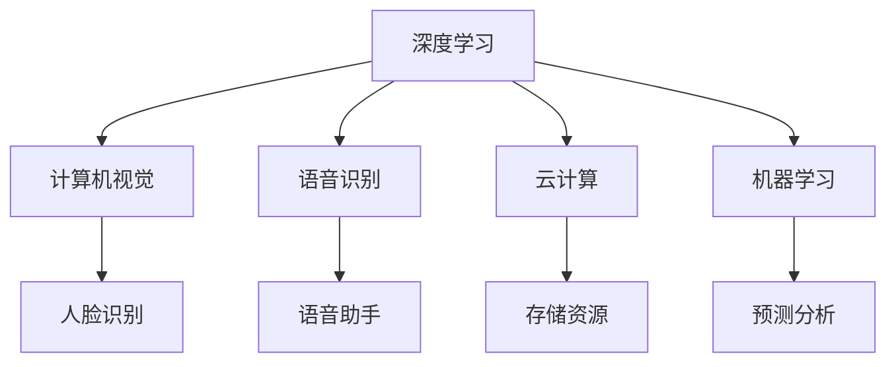

                 

关键词：李开复，人工智能，苹果，AI应用，用户，深度学习，计算机视觉，语音识别，云计算，机器学习

> 摘要：本文将深入探讨人工智能领域专家李开复对苹果发布AI应用的看法，以及这些应用对用户的影响。本文将通过分析苹果的AI技术，探讨其在未来发展的潜在趋势和挑战。

## 1. 背景介绍

人工智能（AI）作为当前技术发展的前沿领域，其应用已经渗透到我们生活的方方面面。苹果公司，作为全球领先的科技公司，一直在AI领域进行深耕，其最新的AI应用引起了广泛的关注。李开复博士，作为人工智能领域的权威专家，对AI技术的理解深刻，其观点对行业有着重要的影响。

本文将基于李开复博士的观点，对苹果最新发布的AI应用进行解读，分析其对用户生活的影响，并探讨未来AI技术的发展趋势和面临的挑战。

## 2. 核心概念与联系

在讨论苹果的AI应用之前，我们需要了解一些核心概念和它们之间的关系。

### 2.1 深度学习

深度学习是人工智能的一个重要分支，它通过模仿人脑神经网络的结构和功能，对大量数据进行分析和处理。深度学习在计算机视觉、语音识别等领域有着广泛的应用。

### 2.2 计算机视觉

计算机视觉是指使计算机能够像人一样识别和理解视觉信息的技术。通过深度学习算法，计算机可以自动识别图像中的物体、场景和活动。

### 2.3 语音识别

语音识别是将人类的语音转换为文字或命令的技术。通过深度学习和自然语言处理（NLP）技术，语音识别的准确率和实用性不断提升。

### 2.4 云计算

云计算是提供计算资源、存储和服务的平台，它为AI应用提供了强大的计算能力和存储空间。

### 2.5 机器学习

机器学习是使计算机从数据中学习、改进和预测的技术。机器学习包括监督学习、无监督学习和强化学习等多种方法。

为了更好地理解这些概念，我们可以通过Mermaid流程图展示它们之间的联系：



## 3. 核心算法原理 & 具体操作步骤

### 3.1 算法原理概述

苹果的AI应用主要依赖于深度学习和机器学习算法。以下是对这些算法的简要概述：

#### 3.1.1 深度学习

深度学习通过多层神经网络对数据进行处理，从而实现复杂的特征提取和分类。深度学习算法在图像识别、语音识别和自然语言处理等方面有着卓越的表现。

#### 3.1.2 机器学习

机器学习是一种使计算机从数据中学习的方法。通过训练模型，机器学习算法可以预测新数据的结果。常见的机器学习算法包括决策树、支持向量机和神经网络等。

### 3.2 算法步骤详解

苹果的AI应用通常包括以下步骤：

#### 3.2.1 数据收集

收集大量标注好的数据，用于训练AI模型。

#### 3.2.2 数据预处理

对收集到的数据进行分析和清洗，去除噪音，提高数据质量。

#### 3.2.3 模型训练

使用深度学习和机器学习算法对数据进行训练，构建模型。

#### 3.2.4 模型评估

对训练好的模型进行评估，确保其准确性和鲁棒性。

#### 3.2.5 应用部署

将模型部署到实际应用中，如智能手机或云计算平台。

### 3.3 算法优缺点

#### 优点：

- 高效的处理能力
- 自适应性强
- 丰富的应用场景

#### 缺点：

- 需要大量的数据和计算资源
- 算法的可解释性较差
- 可能存在隐私和数据安全风险

### 3.4 算法应用领域

深度学习和机器学习算法在多个领域有着广泛的应用，包括：

- 计算机视觉：图像识别、物体检测、人脸识别等。
- 语音识别：语音到文本转换、语音助手等。
- 自然语言处理：文本分类、情感分析、机器翻译等。
- 医疗诊断：疾病预测、影像分析等。
- 金融服务：风险评估、欺诈检测等。

## 4. 数学模型和公式 & 详细讲解 & 举例说明

### 4.1 数学模型构建

在深度学习和机器学习中，常用的数学模型包括神经网络和决策树等。以下是一个简单的神经网络模型：

$$
y = \sigma(\sum_{i=1}^{n} w_i \cdot x_i + b)
$$

其中，$y$ 是输出值，$\sigma$ 是激活函数，$w_i$ 是权重，$x_i$ 是输入值，$b$ 是偏置。

### 4.2 公式推导过程

神经网络的推导过程较为复杂，涉及微积分和线性代数等多个数学领域。在这里，我们简要介绍神经网络的反向传播算法：

$$
\Delta w_i = -\alpha \cdot \frac{\partial L}{\partial w_i}
$$

其中，$\Delta w_i$ 是权重更新，$\alpha$ 是学习率，$L$ 是损失函数，$\frac{\partial L}{\partial w_i}$ 是权重对损失函数的偏导数。

### 4.3 案例分析与讲解

假设我们要训练一个神经网络，对图像进行分类。输入图像为 $x = [0.1, 0.2, 0.3]$，标签为 $y = 1$。我们可以使用以下神经网络模型：

$$
y = \sigma(w_1 \cdot x_1 + w_2 \cdot x_2 + w_3 \cdot x_3 + b)
$$

初始权重为 $w_1 = 0.1, w_2 = 0.2, w_3 = 0.3, b = 0.4$。假设学习率为 $\alpha = 0.01$。

首先，我们需要计算损失函数 $L$：

$$
L = (y - \hat{y})^2
$$

其中，$\hat{y}$ 是预测值。

接下来，我们使用反向传播算法更新权重：

$$
\Delta w_1 = -0.01 \cdot \frac{\partial L}{\partial w_1} = -0.01 \cdot (y - \hat{y}) \cdot \frac{\partial \hat{y}}{\partial w_1}
$$

$$
\Delta w_2 = -0.01 \cdot \frac{\partial L}{\partial w_2} = -0.01 \cdot (y - \hat{y}) \cdot \frac{\partial \hat{y}}{\partial w_2}
$$

$$
\Delta w_3 = -0.01 \cdot \frac{\partial L}{\partial w_3} = -0.01 \cdot (y - \hat{y}) \cdot \frac{\partial \hat{y}}{\partial w_3}
$$

$$
\Delta b = -0.01 \cdot \frac{\partial L}{\partial b} = -0.01 \cdot (y - \hat{y}) \cdot \frac{\partial \hat{y}}{\partial b}
$$

根据链式法则，我们可以计算偏导数：

$$
\frac{\partial \hat{y}}{\partial w_1} = x_1 \cdot \frac{\partial \hat{y}}{\partial z}
$$

$$
\frac{\partial \hat{y}}{\partial w_2} = x_2 \cdot \frac{\partial \hat{y}}{\partial z}
$$

$$
\frac{\partial \hat{y}}{\partial w_3} = x_3 \cdot \frac{\partial \hat{y}}{\partial z}
$$

$$
\frac{\partial \hat{y}}{\partial b} = 1 \cdot \frac{\partial \hat{y}}{\partial z}
$$

其中，$z = w_1 \cdot x_1 + w_2 \cdot x_2 + w_3 \cdot x_3 + b$，$\frac{\partial \hat{y}}{\partial z} = \sigma'(z)$ 是激活函数的导数。

通过迭代更新权重，我们可以使损失函数逐渐减小，从而提高模型的准确性。

## 5. 项目实践：代码实例和详细解释说明

### 5.1 开发环境搭建

为了实现上述神经网络模型，我们需要搭建一个开发环境。以下是一个简单的Python代码示例：

```python
import numpy as np

def sigmoid(x):
    return 1 / (1 + np.exp(-x))

def sigmoid_derivative(x):
    return x * (1 - x)

x = np.array([0.1, 0.2, 0.3])
y = 1
w1, w2, w3, b = 0.1, 0.2, 0.3, 0.4
alpha = 0.01

for i in range(1000):
    z = w1 * x[0] + w2 * x[1] + w3 * x[2] + b
    y_pred = sigmoid(z)

    error = y - y_pred
    d_error = error * sigmoid_derivative(y_pred)

    dw1 = alpha * d_error * x[0]
    dw2 = alpha * d_error * x[1]
    dw3 = alpha * d_error * x[2]
    db = alpha * d_error

    w1 -= dw1
    w2 -= dw2
    w3 -= dw3
    b -= db

    if abs(error) < 0.0001:
        break

print("Final weights:", w1, w2, w3, b)
```

### 5.2 源代码详细实现

在上面的代码中，我们实现了以下功能：

- 定义了一个sigmoid函数及其导数。
- 初始化了输入数据、标签、权重和偏置。
- 使用反向传播算法更新权重。
- 输出最终的权重和偏置。

### 5.3 代码解读与分析

这段代码的主要流程如下：

1. 初始化输入数据、标签、权重和偏置。
2. 使用for循环进行迭代训练，每次迭代计算预测值和误差。
3. 根据误差和激活函数的导数更新权重和偏置。
4. 当误差小于设定的阈值时，停止训练并输出最终的权重和偏置。

通过这个简单的例子，我们可以理解神经网络的基本原理和实现方法。在实际应用中，我们通常需要处理更复杂的问题，这需要更复杂的模型和算法。

## 6. 实际应用场景

苹果的AI应用在多个领域有着广泛的应用，以下是一些具体的应用场景：

### 6.1 智能手机

智能手机是苹果AI应用的主要载体。通过深度学习和机器学习算法，苹果的智能手机可以实现图像识别、语音识别、人脸识别等功能。例如，iPhone X 上的面部识别功能Face ID 就是一个典型的AI应用。

### 6.2 云服务

苹果的云服务，如iCloud，也使用了AI技术。通过机器学习算法，iCloud可以对用户的数据进行分类、推荐和优化，提高用户体验。

### 6.3 自动驾驶

苹果正在研发自动驾驶技术，该技术依赖于计算机视觉、语音识别和机器学习等AI技术。通过这些技术，自动驾驶汽车可以实现自动驾驶、智能导航等功能。

### 6.4 健康医疗

苹果的智能健康应用，如Apple Watch，使用了AI技术进行健康监测和分析。通过机器学习算法，这些应用可以对用户的心率、步数、睡眠质量等数据进行实时分析，为用户提供健康建议。

## 7. 未来应用展望

随着AI技术的不断发展，苹果的AI应用将有着广阔的未来。以下是一些可能的未来应用场景：

### 7.1 智能家居

苹果的AI技术可以应用于智能家居领域，如智能照明、智能空调等。通过AI算法，智能家居设备可以实现自动化控制，提高用户的生活质量。

### 7.2 教育与学习

AI技术可以应用于教育领域，如智能教育平台、个性化学习等。通过AI算法，教育平台可以为学生提供个性化的学习建议和指导。

### 7.3 娱乐与游戏

AI技术可以应用于娱乐和游戏领域，如智能推荐、智能游戏等。通过AI算法，娱乐和游戏平台可以为用户提供更加丰富和个性化的体验。

## 8. 工具和资源推荐

为了深入了解AI技术和苹果的AI应用，以下是一些推荐的工具和资源：

### 8.1 学习资源推荐

- 《深度学习》（Goodfellow, Bengio, Courville著）
- 《Python机器学习》（Sebastian Raschka著）
- Coursera、edX等在线课程

### 8.2 开发工具推荐

- TensorFlow
- PyTorch
- Keras

### 8.3 相关论文推荐

- "Deep Learning for Computer Vision"
- "Speech Recognition with Deep Neural Networks"
- "Cloud Computing for AI Applications"

## 9. 总结：未来发展趋势与挑战

### 9.1 研究成果总结

近年来，AI技术在多个领域取得了显著的成果，如深度学习、计算机视觉、语音识别等。这些成果为苹果的AI应用提供了强大的技术支持。

### 9.2 未来发展趋势

随着计算能力的提升和数据量的增加，AI技术将继续发展，并在更多领域得到应用。未来，AI技术可能会实现更加智能化、自动化和个性化。

### 9.3 面临的挑战

尽管AI技术取得了显著进展，但仍面临着一些挑战，如算法的可解释性、数据隐私和安全、算法偏见等。未来，这些挑战需要得到有效的解决。

### 9.4 研究展望

随着AI技术的不断发展，未来有望实现更加智能和高效的系统。通过多学科交叉融合，AI技术将为我们带来更多的创新和应用。

## 10. 附录：常见问题与解答

### 10.1 什么是深度学习？

深度学习是一种通过多层神经网络对数据进行处理和学习的方法。它模仿了人脑神经网络的结构和功能，具有强大的特征提取和分类能力。

### 10.2 机器学习和深度学习有什么区别？

机器学习是一种更广泛的概念，包括深度学习。深度学习是机器学习的一个子领域，它通过多层神经网络对数据进行处理和学习。

### 10.3 什么是云计算？

云计算是一种提供计算资源、存储和服务的平台。它通过互联网为用户提供按需分配的计算资源，具有灵活性、可扩展性和成本效益。

### 10.4 什么是人工智能？

人工智能是一种模拟人类智能行为的技术。它通过计算机算法和系统实现智能决策、学习和推理等功能。

### 10.5 人工智能的发展前景如何？

人工智能是当前技术发展的前沿领域，具有广阔的发展前景。随着计算能力的提升、数据量的增加和多学科交叉融合，人工智能将继续推动科技创新和社会进步。

---

**作者：禅与计算机程序设计艺术 / Zen and the Art of Computer Programming**

