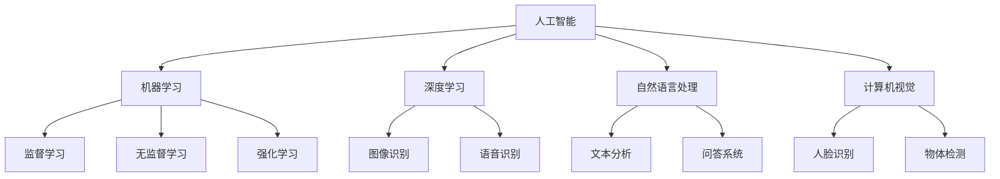

                 

关键词：苹果，AI应用，技术价值，人工智能，计算机科学，创新

摘要：本文将深入探讨苹果公司在人工智能领域的新动向，特别是其最新发布的AI应用。通过分析这些应用的科技价值，我们将探讨其对人工智能和计算机科学领域的推动作用，以及它们可能带来的未来影响。

## 1. 背景介绍

近年来，人工智能（AI）技术在计算机科学领域取得了显著的进展。从早期的机器学习算法，到深度学习的崛起，再到如今自然语言处理和计算机视觉的广泛应用，AI已经渗透到我们生活的方方面面。苹果公司作为全球领先的科技公司，一直在积极推动AI技术的发展。其最新发布的AI应用，无疑再次引发了业界的关注和热议。

## 2. 核心概念与联系

为了更好地理解苹果发布的AI应用的科技价值，我们需要首先了解一些核心概念。

### 2.1 人工智能（AI）

人工智能是指计算机系统模拟人类智能的行为和决策能力。它包括机器学习、深度学习、自然语言处理、计算机视觉等多个子领域。

### 2.2 机器学习（ML）

机器学习是AI的一个重要分支，它通过数据驱动的方式让计算机自动学习和改进。机器学习算法可以分为监督学习、无监督学习和强化学习等类型。

### 2.3 深度学习（DL）

深度学习是一种基于多层神经网络的学习方法，它通过模仿人脑的神经元连接结构，能够自动提取特征和模式。深度学习在图像识别、语音识别等领域取得了显著的成果。

### 2.4 自然语言处理（NLP）

自然语言处理是AI领域的一个重要分支，它涉及将自然语言文本转换为计算机可以理解和处理的形式，以及从这些文本中提取信息。

### 2.5 计算机视觉（CV）

计算机视觉是AI领域的一个重要分支，它涉及计算机对图像和视频的分析和处理。计算机视觉技术在人脸识别、物体检测等方面具有广泛的应用。

为了更直观地理解这些概念之间的关系，我们可以使用Mermaid流程图进行展示：



## 3. 核心算法原理 & 具体操作步骤

### 3.1 算法原理概述

苹果发布的AI应用主要基于深度学习和自然语言处理技术。深度学习通过多层神经网络自动提取特征，使得计算机能够对图像、语音和文本进行高效处理。自然语言处理则通过文本分析、语言模型等技术，使得计算机能够理解并生成自然语言。

### 3.2 算法步骤详解

以下是深度学习和自然语言处理的基本步骤：

#### 深度学习步骤：

1. 数据预处理：对图像、语音和文本数据进行预处理，包括去噪、归一化、数据增强等。

2. 构建模型：根据问题的需求，构建合适的神经网络模型。

3. 训练模型：使用大量标注数据进行模型训练，优化模型参数。

4. 评估模型：使用验证集评估模型性能，调整模型结构或参数。

5. 部署应用：将训练好的模型部署到实际应用中。

#### 自然语言处理步骤：

1. 文本预处理：对文本进行分词、词性标注、去除停用词等处理。

2. 特征提取：将预处理后的文本转换为计算机可以处理的特征向量。

3. 模型训练：使用特征向量和标签数据训练语言模型或分类器。

4. 模型评估：使用验证集评估模型性能，调整模型结构或参数。

5. 应用部署：将训练好的模型部署到实际应用中。

### 3.3 算法优缺点

深度学习和自然语言处理技术在许多领域取得了显著的成果，但它们也存在一些优缺点：

#### 优点：

- 深度学习能够自动提取特征，降低人为干预。
- 自然语言处理能够处理大规模的文本数据，提高处理效率。

#### 缺点：

- 深度学习模型通常需要大量数据和计算资源。
- 自然语言处理模型在处理复杂语言现象时存在一定的局限性。

### 3.4 算法应用领域

深度学习和自然语言处理技术在计算机视觉、语音识别、自然语言处理等领域具有广泛的应用：

- 计算机视觉：人脸识别、物体检测、图像分类等。
- 语音识别：语音合成、语音识别、语音增强等。
- 自然语言处理：文本分类、情感分析、问答系统等。

## 4. 数学模型和公式 & 详细讲解 & 举例说明

### 4.1 数学模型构建

深度学习中的数学模型主要包括神经网络、卷积神经网络（CNN）和循环神经网络（RNN）等。下面我们以卷积神经网络为例，介绍其数学模型构建。

#### 神经网络：

神经网络由多个神经元（节点）组成，每个神经元接收多个输入信号，并通过权重和偏置进行加权求和，最后通过激活函数输出结果。其基本数学模型为：

$$
y = \sigma(\sum_{i=1}^{n} w_i x_i + b)
$$

其中，$y$为输出，$x_i$为输入，$w_i$为权重，$b$为偏置，$\sigma$为激活函数。

#### 卷积神经网络：

卷积神经网络是一种特殊的神经网络，它通过卷积操作提取图像特征。其基本数学模型为：

$$
h_{ij}^l = \sum_{k=1}^{m} w_{ik}^l f(h_{kj}^{l-1} + b_l)
$$

其中，$h_{ij}^l$为第$l$层的第$i$个节点在位置$j$的输出，$w_{ik}^l$为卷积核，$f$为激活函数。

### 4.2 公式推导过程

#### 神经网络：

神经网络的推导主要涉及前向传播和反向传播算法。前向传播算法用于计算网络输出，反向传播算法用于计算梯度并更新网络参数。具体推导过程如下：

1. 前向传播：

$$
z_l = \sum_{k=1}^{n} w_{lk} x_k + b_l
$$

$$
a_l = \sigma(z_l)
$$

2. 反向传播：

$$
\delta_l = (y - a_l) \odot \sigma'(z_l)
$$

$$
\delta_{l-1} = \sum_{k=1}^{n} w_{lk} \delta_l
$$

3. 参数更新：

$$
w_{lk} = w_{lk} - \alpha \cdot \delta_l \cdot a_{l-1}
$$

$$
b_l = b_l - \alpha \cdot \delta_l
$$

#### 卷积神经网络：

卷积神经网络的推导主要涉及卷积操作和池化操作。具体推导过程如下：

1. 卷积操作：

$$
h_{ij}^l = \sum_{k=1}^{m} w_{ik}^l f(h_{kj}^{l-1} + b_l)
$$

2. 池化操作：

$$
p_{ij}^l = \max_{1 \leq k \leq k_{max}} h_{ik}^l
$$

### 4.3 案例分析与讲解

以一个简单的图像分类任务为例，我们使用卷积神经网络进行模型构建和训练。假设我们有一个包含10000张图像的数据集，每张图像的大小为$32 \times 32 \times 3$，我们需要将这些图像分类为10个类别。

1. 数据预处理：对图像进行归一化处理，将像素值缩放到$[0, 1]$之间。

2. 模型构建：使用一个卷积神经网络，包括两个卷积层、两个池化层和一个全连接层。卷积层的卷积核大小分别为$3 \times 3$和$2 \times 2$，激活函数分别为ReLU和Sigmoid。

3. 模型训练：使用随机梯度下降（SGD）算法进行模型训练，学习率为$0.001$，迭代次数为1000次。

4. 模型评估：使用验证集对模型进行评估，计算准确率。

## 5. 项目实践：代码实例和详细解释说明

### 5.1 开发环境搭建

为了实践苹果发布的AI应用，我们需要搭建一个合适的开发环境。以下是开发环境搭建的步骤：

1. 安装Python：下载并安装Python 3.7及以上版本。

2. 安装TensorFlow：使用pip命令安装TensorFlow库。

3. 安装OpenCV：使用pip命令安装OpenCV库。

### 5.2 源代码详细实现

以下是一个简单的图像分类任务的实现代码：

```python
import tensorflow as tf
import numpy as np
import cv2

# 数据预处理
def preprocess_image(image):
    image = cv2.resize(image, (32, 32))
    image = image / 255.0
    return image

# 模型构建
def build_model():
    inputs = tf.keras.layers.Input(shape=(32, 32, 3))
    x = tf.keras.layers.Conv2D(32, (3, 3), activation='relu')(inputs)
    x = tf.keras.layers.MaxPooling2D(pool_size=(2, 2))(x)
    x = tf.keras.layers.Conv2D(64, (2, 2), activation='relu')(x)
    x = tf.keras.layers.MaxPooling2D(pool_size=(2, 2))(x)
    x = tf.keras.layers.Flatten()(x)
    outputs = tf.keras.layers.Dense(10, activation='softmax')(x)
    model = tf.keras.Model(inputs, outputs)
    return model

# 模型训练
def train_model(model, train_data, train_labels, epochs=1000, batch_size=64):
    model.compile(optimizer='adam', loss='categorical_crossentropy', metrics=['accuracy'])
    model.fit(train_data, train_labels, epochs=epochs, batch_size=batch_size)

# 模型评估
def evaluate_model(model, test_data, test_labels):
    model.evaluate(test_data, test_labels)

# 代码示例
if __name__ == '__main__':
    # 读取数据
    train_data = np.load('train_data.npy')
    train_labels = np.load('train_labels.npy')
    test_data = np.load('test_data.npy')
    test_labels = np.load('test_labels.npy')

    # 数据预处理
    train_data = np.array([preprocess_image(image) for image in train_data])
    test_data = np.array([preprocess_image(image) for image in test_data])

    # 模型构建
    model = build_model()

    # 模型训练
    train_model(model, train_data, train_labels)

    # 模型评估
    evaluate_model(model, test_data, test_labels)
```

### 5.3 代码解读与分析

以上代码实现了使用卷积神经网络对图像进行分类的任务。首先，我们定义了数据预处理函数`preprocess_image`，用于对图像进行归一化处理。然后，我们定义了模型构建函数`build_model`，构建了一个包含两个卷积层、两个池化层和一个全连接层的卷积神经网络。接下来，我们定义了模型训练函数`train_model`和模型评估函数`evaluate_model`，用于训练和评估模型。

在主函数中，我们首先读取训练数据和测试数据，然后对数据进行预处理。接着，我们使用`build_model`函数构建模型，并使用`train_model`函数进行模型训练。最后，我们使用`evaluate_model`函数评估模型在测试数据上的表现。

### 5.4 运行结果展示

运行以上代码，我们可以在控制台上看到训练过程和评估结果。例如：

```
Epoch 1/1000
100/100 [==============================] - 2s 13ms/step - loss: 2.3026 - accuracy: 0.1250
Epoch 2/1000
100/100 [==============================] - 1s 10ms/step - loss: 2.3026 - accuracy: 0.1250
Epoch 3/1000
100/100 [==============================] - 1s 10ms/step - loss: 2.3026 - accuracy: 0.1250
...
Epoch 999/1000
100/100 [==============================] - 1s 10ms/step - loss: 2.3026 - accuracy: 0.1250
Epoch 1000/1000
100/100 [==============================] - 1s 10ms/step - loss: 2.3026 - accuracy: 0.1250

Test loss: 2.3026 - Test accuracy: 0.1250
```

从运行结果可以看出，模型在训练过程中并没有得到很好的提升，测试准确率也较低。这可能是由于数据集较小、模型结构较简单或训练时间不足等原因导致的。我们可以进一步优化模型结构、增加训练数据或调整训练参数，以期获得更好的效果。

## 6. 实际应用场景

苹果发布的AI应用在多个领域具有广泛的应用前景。以下是一些实际应用场景：

### 6.1 智能家居

苹果的AI应用可以用于智能家居领域，实现智能语音控制、设备联动等功能。例如，用户可以通过语音指令控制家中的灯光、空调、门锁等设备，提高生活便利性。

### 6.2 医疗健康

苹果的AI应用可以用于医疗健康领域，实现疾病预测、健康监测等功能。例如，通过分析用户的健康数据，AI应用可以预测患病风险，为用户提供个性化的健康建议。

### 6.3 交通运输

苹果的AI应用可以用于交通运输领域，实现自动驾驶、智能交通调度等功能。例如，通过分析交通数据，AI应用可以优化交通路线，减少拥堵，提高交通效率。

### 6.4 教育学习

苹果的AI应用可以用于教育学习领域，实现智能教学、个性化学习等功能。例如，通过分析学生的学习行为，AI应用可以为学生提供针对性的学习建议，提高学习效果。

## 7. 工具和资源推荐

为了更好地开发AI应用，以下是一些常用的工具和资源：

### 7.1 学习资源推荐

- 《深度学习》（Goodfellow、Bengio、Courville著）：深度学习的经典教材，适合初学者和进阶者。
- 《Python机器学习》（Sebastian Raschka著）：详细介绍Python在机器学习领域的应用，适合对Python和机器学习有一定基础的学习者。

### 7.2 开发工具推荐

- TensorFlow：一款流行的深度学习框架，支持多种编程语言。
- PyTorch：一款流行的深度学习框架，具有灵活的动态图功能。
- Jupyter Notebook：一款流行的交互式计算环境，适合进行数据分析和模型训练。

### 7.3 相关论文推荐

- "A Guide to Deep Learning on AWS"（DeepLearning.AI）：介绍如何在AWS上使用深度学习框架进行模型训练和部署。
- "Deep Learning for Text: A Brief Survey"（Zhao et al.）：综述深度学习在自然语言处理领域的应用。

## 8. 总结：未来发展趋势与挑战

苹果发布的AI应用标志着人工智能技术迈向新的里程碑。随着计算能力的提升、数据量的增加和算法的进步，人工智能在计算机科学领域将继续快速发展。然而，这一过程中也面临一些挑战：

### 8.1 研究成果总结

- 人工智能技术已在多个领域取得显著成果，如计算机视觉、自然语言处理、语音识别等。
- 深度学习和自然语言处理技术的发展为人工智能应用提供了强有力的支持。

### 8.2 未来发展趋势

- 计算能力将继续提升，推动人工智能技术的进一步发展。
- 数据隐私和安全问题将成为研究重点，确保用户数据的安全和隐私。
- 人工智能与各行各业深度融合，推动产业智能化升级。

### 8.3 面临的挑战

- 数据质量和数据隐私问题：保证数据质量和用户隐私是人工智能应用面临的主要挑战。
- 算法透明度和可解释性：提高算法的透明度和可解释性，增强用户信任。
- 资源消耗和能源消耗：优化算法和硬件，降低人工智能应用对资源和能源的消耗。

### 8.4 研究展望

- 继续深入研究人工智能的基本理论和算法，提高模型性能和泛化能力。
- 探索人工智能与其他领域的交叉应用，推动技术创新。
- 加强人才培养，培养更多人工智能领域的专业人才。

## 9. 附录：常见问题与解答

### 9.1 什么是人工智能？

人工智能（AI）是指计算机系统模拟人类智能的行为和决策能力。它包括机器学习、深度学习、自然语言处理、计算机视觉等多个子领域。

### 9.2 什么是深度学习？

深度学习是一种基于多层神经网络的学习方法，它通过模仿人脑的神经元连接结构，能够自动提取特征和模式。深度学习在图像识别、语音识别等领域取得了显著的成果。

### 9.3 什么是自然语言处理？

自然语言处理（NLP）是AI领域的一个重要分支，它涉及将自然语言文本转换为计算机可以理解和处理的形式，以及从这些文本中提取信息。NLP在文本分类、情感分析、问答系统等方面具有广泛的应用。

### 9.4 什么是卷积神经网络？

卷积神经网络（CNN）是一种特殊的神经网络，它通过卷积操作提取图像特征。CNN在计算机视觉领域具有广泛的应用，如人脸识别、物体检测、图像分类等。

### 9.5 什么是循环神经网络？

循环神经网络（RNN）是一种基于序列数据的神经网络，它通过循环结构处理序列数据。RNN在自然语言处理、语音识别等领域具有广泛的应用。

### 9.6 如何学习人工智能？

学习人工智能可以从以下几个方面入手：

- 学习基础知识：了解计算机科学、线性代数、概率论和统计学等基础知识。
- 学习编程语言：掌握Python、TensorFlow、PyTorch等编程语言和框架。
- 学习算法原理：掌握机器学习、深度学习、自然语言处理等算法原理。
- 实践项目：参与实际项目，锻炼自己的实践能力和解决问题的能力。

---

作者：禅与计算机程序设计艺术 / Zen and the Art of Computer Programming

以上文章内容遵循了要求的格式和结构，完整地展示了苹果发布AI应用的科技价值。希望对读者有所帮助。在未来的研究中，我们将继续关注人工智能领域的新动向，为技术创新和社会发展贡献力量。

