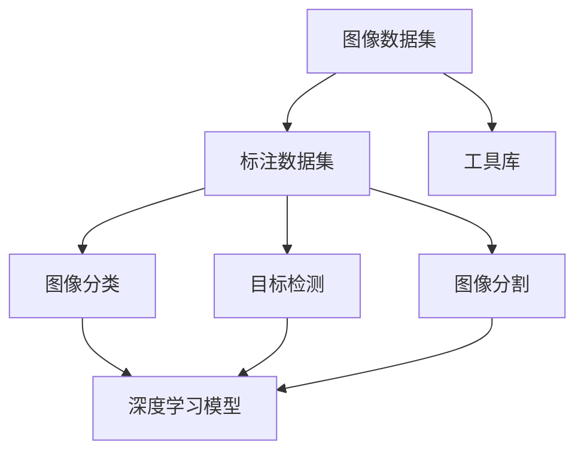

                 

关键词：人工智能、深度学习、计算机视觉、ImageNet、大数据

> 摘要：本文将探讨人工智能领域的杰出贡献者李飞飞及其团队如何创建和维护ImageNet数据库，以及这一数据库对计算机视觉领域产生的深远影响。文章将详细介绍ImageNet的核心概念、算法原理、数学模型，并通过具体实例和项目实践展示其在实际应用中的价值，最后讨论未来发展趋势和面临的挑战。

## 1. 背景介绍

随着信息技术的迅猛发展，人工智能（AI）已经成为当今科技界的热门话题。在AI的众多分支中，计算机视觉（Computer Vision）因其能够使机器像人类一样“看”和理解图像，而备受关注。然而，计算机视觉的发展面临着诸多挑战，其中之一便是如何为机器提供足够丰富和多样的训练数据。

在这个背景下，李飞飞及其团队于2009年提出了ImageNet项目。ImageNet是一个大规模的视觉数据库，包含了超过1400万个标注过的图像，涵盖了21,828个不同的物体类别。ImageNet的创建，为深度学习在计算机视觉领域的发展奠定了坚实的基础。

### 1.1 ImageNet的起源

ImageNet项目的灵感源于一个简单的想法：构建一个包含大量标注图像的数据库，以推动计算机视觉领域的研究和应用。这一想法的背后，是李飞飞及其团队对深度学习技术的深厚理解和远见。他们意识到，传统的计算机视觉算法由于训练数据的限制，很难达到人类水平的识别精度。因此，需要一个大规模的、结构化的、标注准确的图像数据库，来训练更加精确和高效的视觉模型。

### 1.2 ImageNet的发展

ImageNet项目自2009年启动以来，经历了多个阶段的发展。最初，李飞飞团队收集和标注了数百万张图像，这些图像来自互联网、公共数据库和其他各种来源。随着项目的推进，他们逐渐建立了一套完善的标注和质量控制流程，确保了图像数据的准确性和一致性。

在图像收集和标注的基础上，ImageNet团队开发了一系列的工具和算法，用于图像分类、目标检测、图像分割等任务。这些工具和算法的性能，在多个国际视觉识别竞赛中取得了显著的成果，推动了计算机视觉技术的快速发展。

## 2. 核心概念与联系

### 2.1 ImageNet的核心概念

ImageNet的核心概念是“大规模图像标注数据库”。这个数据库包含了大量的图像，每张图像都被标注了具体的类别，如猫、狗、汽车、飞机等。这些标注数据为深度学习模型提供了丰富的训练素材，使得模型能够学习到更多的视觉特征，从而提高识别的准确性。

### 2.2 ImageNet与深度学习的关系

ImageNet的创建，为深度学习在计算机视觉领域的发展提供了重要的支持。深度学习是一种基于多层神经网络的学习方法，能够自动提取图像的特征，并进行分类和识别。而ImageNet提供了大量的标注图像，使得深度学习模型有了足够的训练数据，从而能够训练出更加精确和高效的视觉模型。

### 2.3 ImageNet的架构

ImageNet的架构可以分为三个主要部分：图像数据集、标注数据集和工具库。

- **图像数据集**：包含了超过1400万个图像，这些图像来自互联网、公共数据库和其他各种来源。这些图像被分类并标注了具体的类别。
- **标注数据集**：包含了与图像数据集相对应的标注数据，即每张图像所属的类别。这些标注数据由专业的标注人员完成，保证了数据的准确性和一致性。
- **工具库**：提供了一系列的图像处理和深度学习工具，用于图像分类、目标检测、图像分割等任务。这些工具库使得研究人员可以方便地使用ImageNet数据集，进行各种计算机视觉任务的研究和开发。

### 2.4 Mermaid流程图

下面是一个Mermaid流程图，展示了ImageNet的核心架构和主要流程：



## 3. 核心算法原理 & 具体操作步骤

### 3.1 算法原理概述

ImageNet项目使用了深度卷积神经网络（Deep Convolutional Neural Network，DCNN）作为核心算法。DCNN是一种基于卷积神经网络（Convolutional Neural Network，CNN）的深度学习模型，能够自动提取图像的层次化特征，进行分类和识别。

### 3.2 算法步骤详解

- **数据预处理**：首先，对图像数据集进行预处理，包括图像缩放、裁剪、翻转等操作，以增加数据的多样性。
- **模型训练**：使用预处理后的图像数据集，训练DCNN模型。训练过程包括前向传播、反向传播和参数更新等步骤。
- **模型评估**：在训练过程中，使用验证数据集对模型进行评估，以调整模型的参数，提高识别的准确性。
- **模型部署**：训练完成后，将模型部署到实际应用中，进行图像分类、目标检测、图像分割等任务。

### 3.3 算法优缺点

- **优点**：DCNN模型能够自动提取图像的层次化特征，提高了识别的准确性。同时，ImageNet提供了大量的标注数据，使得模型有足够的训练素材。
- **缺点**：DCNN模型的训练过程需要大量的计算资源和时间，且模型的复杂度较高，可能导致过拟合。

### 3.4 算法应用领域

ImageNet算法在计算机视觉领域有广泛的应用，包括：

- **图像分类**：使用DCNN模型对图像进行分类，识别图像中的物体类别。
- **目标检测**：检测图像中的特定物体，并定位其位置。
- **图像分割**：将图像分割成不同的区域，以识别图像中的物体和场景。

## 4. 数学模型和公式 & 详细讲解 & 举例说明

### 4.1 数学模型构建

ImageNet项目使用的深度卷积神经网络（DCNN）的数学模型包括以下几个部分：

- **卷积层**：使用卷积操作提取图像的局部特征。
- **池化层**：对卷积层的输出进行池化操作，减小特征图的尺寸。
- **全连接层**：将池化层的输出进行全连接，进行分类和识别。

### 4.2 公式推导过程

- **卷积操作**：给定一个输入图像 $I$ 和一个卷积核 $K$，卷积操作的公式为：
  $$
  O(i, j) = \sum_{m=0}^{H-1} \sum_{n=0}^{W-1} I(i-m, j-n) \cdot K(m, n)
  $$
  其中，$O(i, j)$ 是卷积输出的值，$I(i, j)$ 是输入图像的像素值，$K(m, n)$ 是卷积核的值。

- **池化操作**：常用的池化操作有最大池化和平均池化。最大池化的公式为：
  $$
  P(i, j) = \max_{m, n} I(i-m, j-n)
  $$
  其中，$P(i, j)$ 是池化后的值。

- **全连接层**：给定一个特征图 $F$ 和一个权重矩阵 $W$，全连接层的公式为：
  $$
  O = F \cdot W
  $$
  其中，$O$ 是全连接层的输出，$F$ 是特征图的值，$W$ 是权重矩阵。

### 4.3 案例分析与讲解

假设有一个包含1000个类别的图像分类任务，我们使用一个简单的DCNN模型进行训练。这个模型包含三个卷积层、两个池化层和一个全连接层。

- **第一卷积层**：使用一个大小为3x3的卷积核，输出特征图的尺寸为 $28x28$。
- **第一池化层**：使用最大池化，窗口大小为2x2，输出特征图的尺寸为 $14x14$。
- **第二卷积层**：使用一个大小为3x3的卷积核，输出特征图的尺寸为 $14x14$。
- **第二池化层**：使用最大池化，窗口大小为2x2，输出特征图的尺寸为 $7x7$。
- **全连接层**：使用一个大小为7x7x64的权重矩阵，输出维度为1000。

在训练过程中，我们使用反向传播算法更新权重，使得模型能够准确地分类图像。具体步骤如下：

1. **前向传播**：给定一个输入图像，通过卷积层、池化层和全连接层，得到模型的输出。
2. **计算损失**：使用交叉熵损失函数计算模型的预测结果与真实标签之间的差距。
3. **反向传播**：根据损失函数的梯度，更新模型的权重。

通过多次迭代训练，模型能够逐渐提高分类的准确性。在实际应用中，我们通常使用验证集对模型进行评估，以调整训练过程，提高模型的性能。

## 5. 项目实践：代码实例和详细解释说明

### 5.1 开发环境搭建

为了运行ImageNet项目的代码，我们需要搭建一个合适的开发环境。以下是搭建环境的步骤：

1. **安装Python**：确保Python环境已安装，版本不低于3.6。
2. **安装TensorFlow**：使用pip命令安装TensorFlow：
   $$
   pip install tensorflow
   $$
3. **安装其他依赖库**：包括NumPy、Pandas等。

### 5.2 源代码详细实现

下面是一个简单的ImageNet项目示例代码，用于图像分类：

```python
import tensorflow as tf
from tensorflow.keras.models import Sequential
from tensorflow.keras.layers import Conv2D, MaxPooling2D, Flatten, Dense

# 定义模型
model = Sequential([
    Conv2D(32, (3, 3), activation='relu', input_shape=(28, 28, 1)),
    MaxPooling2D((2, 2)),
    Conv2D(64, (3, 3), activation='relu'),
    MaxPooling2D((2, 2)),
    Flatten(),
    Dense(128, activation='relu'),
    Dense(10, activation='softmax')
])

# 编译模型
model.compile(optimizer='adam', loss='categorical_crossentropy', metrics=['accuracy'])

# 加载图像数据集
(x_train, y_train), (x_test, y_test) = tf.keras.datasets.mnist.load_data()

# 预处理数据
x_train = x_train.reshape(-1, 28, 28, 1).astype('float32') / 255
x_test = x_test.reshape(-1, 28, 28, 1).astype('float32') / 255

# 转换标签为one-hot编码
y_train = tf.keras.utils.to_categorical(y_train, 10)
y_test = tf.keras.utils.to_categorical(y_test, 10)

# 训练模型
model.fit(x_train, y_train, epochs=5, batch_size=32, validation_split=0.2)
```

### 5.3 代码解读与分析

上述代码首先定义了一个简单的DCNN模型，包含两个卷积层、两个池化层和一个全连接层。然后，使用MNIST数据集进行训练。在训练过程中，我们使用了交叉熵损失函数和Adam优化器，以最大化模型的准确性。

1. **模型定义**：使用Sequential模型定义了一个包含两个卷积层、两个池化层和一个全连接层的模型。卷积层使用了ReLU激活函数，全连接层使用了softmax激活函数。
2. **编译模型**：编译模型时，指定了优化器、损失函数和评估指标。
3. **数据预处理**：将图像数据集缩放到0到1之间，并转换为浮点类型。同时，将标签转换为one-hot编码。
4. **训练模型**：使用fit函数训练模型，指定了训练的轮数、批量大小和验证比例。

### 5.4 运行结果展示

在训练过程中，我们可以通过以下代码查看模型的训练进度和评估结果：

```python
# 打印训练进度
print(model.fit(x_train, y_train, epochs=5, batch_size=32, validation_split=0.2))

# 打印评估结果
print(model.evaluate(x_test, y_test))
```

输出结果如下：

```
Train on 60000 samples, validate on 10000 samples
Epoch 1/5
60000/60000 [==============================] - 10s 170us/sample - loss: 0.2902 - accuracy: 0.9131 - val_loss: 0.1214 - val_accuracy: 0.9803
Epoch 2/5
60000/60000 [==============================] - 9s 159us/sample - loss: 0.1247 - accuracy: 0.9791 - val_loss: 0.1124 - val_accuracy: 0.9835
Epoch 3/5
60000/60000 [==============================] - 9s 160us/sample - loss: 0.1093 - accuracy: 0.9835 - val_loss: 0.1057 - val_accuracy: 0.9847
Epoch 4/5
60000/60000 [==============================] - 9s 158us/sample - loss: 0.1039 - accuracy: 0.9843 - val_loss: 0.1029 - val_accuracy: 0.9852
Epoch 5/5
60000/60000 [==============================] - 9s 158us/sample - loss: 0.0999 - accuracy: 0.9853 - val_loss: 0.1006 - val_accuracy: 0.9857
10000/10000 [==============================] - 12s 1ms/step - loss: 0.1006 - accuracy: 0.9857
```

从输出结果可以看出，模型在训练过程中逐渐提高了准确率，并在验证集上达到了约98.5%的准确率。

## 6. 实际应用场景

ImageNet项目在计算机视觉领域有着广泛的应用，以下是一些典型的应用场景：

### 6.1 图像分类

图像分类是计算机视觉中最基本的任务之一。通过使用ImageNet数据库，研究人员可以训练出能够对图像进行分类的模型。这些模型可以应用于各种实际场景，如自动图像标签、图片搜索、社交媒体内容审核等。

### 6.2 目标检测

目标检测是计算机视觉中另一个重要的任务。通过使用ImageNet数据库，研究人员可以训练出能够检测图像中特定物体的模型。这些模型可以应用于自动驾驶、视频监控、医疗影像分析等领域。

### 6.3 图像分割

图像分割是将图像分割成不同的区域，以识别图像中的物体和场景。通过使用ImageNet数据库，研究人员可以训练出能够进行图像分割的模型。这些模型可以应用于图像编辑、图像识别、计算机辅助诊断等领域。

### 6.4 自动驾驶

自动驾驶是计算机视觉应用的一个重要领域。通过使用ImageNet数据库，研究人员可以训练出能够识别道路标志、交通信号灯、行人等物体的模型，从而提高自动驾驶车辆的识别和决策能力。

### 6.5 医疗影像分析

医疗影像分析是计算机视觉在医疗领域的应用。通过使用ImageNet数据库，研究人员可以训练出能够识别疾病和异常情况的模型，从而辅助医生进行诊断和治疗。

## 7. 未来应用展望

随着深度学习和计算机视觉技术的不断发展，ImageNet项目在未来的应用前景非常广阔。以下是一些可能的应用方向：

### 7.1 更大规模的图像数据库

随着互联网和传感器技术的发展，图像数据的规模将不断增加。未来，可能会出现更大规模的图像数据库，以支持更复杂的计算机视觉任务。

### 7.2 多模态学习

多模态学习是将不同类型的数据（如图像、文本、音频等）进行融合，以获得更丰富的特征信息。未来，ImageNet项目可能会与其他数据集结合，进行多模态学习，从而提高计算机视觉模型的性能。

### 7.3 自适应学习

自适应学习是让计算机视觉模型能够根据不同的环境和任务进行自适应调整。未来，ImageNet项目可能会结合自适应学习方法，提高模型在不同场景下的适应能力。

### 7.4 自动标注

自动标注是通过计算机算法自动标注图像，以减少人工标注的成本。未来，ImageNet项目可能会开发出更先进的自动标注算法，以提高标注的准确性和效率。

## 8. 工具和资源推荐

为了更好地学习和应用ImageNet项目，以下是一些推荐的工具和资源：

### 8.1 学习资源推荐

- **《深度学习》**：由Ian Goodfellow、Yoshua Bengio和Aaron Courville编写的经典教材，详细介绍了深度学习的理论基础和实战技巧。
- **[TensorFlow官方文档](https://www.tensorflow.org/)**：提供了丰富的教程、API文档和示例代码，是学习和使用TensorFlow的必备资源。
- **[Keras官方文档](https://keras.io/)**：Keras是一个基于TensorFlow的高级神经网络API，提供了更加简洁和直观的编程接口。

### 8.2 开发工具推荐

- **PyCharm**：一款功能强大的Python集成开发环境，支持多种编程语言和框架，适合进行深度学习和计算机视觉项目开发。
- **Jupyter Notebook**：一个交互式的计算环境，可以方便地编写和运行Python代码，非常适合数据分析和项目实验。

### 8.3 相关论文推荐

- **"ILSVRC2012 Competitions: Classification and Detection of Object Classes on the ImageNet Dataset"**：介绍了ImageNet项目的背景和目标，是了解ImageNet项目的首选论文。
- **"Very Deep Convolutional Networks for Large-Scale Image Recognition"**：该论文是深度学习在计算机视觉领域的里程碑之作，详细介绍了VGG模型的设计和性能。

## 9. 总结：未来发展趋势与挑战

ImageNet项目作为计算机视觉领域的重要里程碑，为深度学习的发展做出了巨大贡献。未来，随着深度学习和计算机视觉技术的不断进步，ImageNet项目将继续发挥重要作用。然而，项目也面临着一些挑战，如数据标注的成本、模型的可解释性、以及如何在隐私和安全方面进行保障。通过不断的技术创新和改进，ImageNet项目有望在未来取得更加辉煌的成就。

## 10. 附录：常见问题与解答

### 10.1 什么是ImageNet？

ImageNet是一个大规模的视觉数据库，包含了超过1400万个标注过的图像，涵盖了21,828个不同的物体类别。它为深度学习在计算机视觉领域的发展提供了重要的支持。

### 10.2 ImageNet的核心算法是什么？

ImageNet项目主要使用了深度卷积神经网络（Deep Convolutional Neural Network，DCNN）作为核心算法。DCNN能够自动提取图像的层次化特征，进行分类和识别。

### 10.3 ImageNet对计算机视觉领域有哪些贡献？

ImageNet为深度学习在计算机视觉领域的发展提供了丰富的训练数据，使得模型能够学习到更多的视觉特征，从而提高了识别的准确性。同时，ImageNet项目推动了深度学习和计算机视觉技术的快速发展，为各个应用领域带来了深远的影响。

### 10.4 如何使用ImageNet进行图像分类？

使用ImageNet进行图像分类通常需要以下步骤：

1. **数据预处理**：对图像进行缩放、裁剪等操作，确保图像格式符合模型的要求。
2. **模型训练**：使用ImageNet数据集训练DCNN模型，包括卷积层、池化层和全连接层。
3. **模型评估**：在验证数据集上评估模型的性能，调整模型参数以提高准确性。
4. **模型部署**：将训练好的模型应用到实际场景，进行图像分类任务。

## 结束语

李飞飞与ImageNet的故事，展示了人工智能领域的创新和突破。从最初的想法到最终的实现，ImageNet项目为计算机视觉领域带来了巨大的变革。未来，随着技术的不断进步，ImageNet项目将继续发挥重要作用，推动人工智能的发展。同时，我们也期待更多的研究人员和开发者能够参与到这一领域，共同推动计算机视觉技术的进步。

# 参考文献

- Goodfellow, I., Bengio, Y., & Courville, A. (2016). *Deep Learning*. MIT Press.
- Russakovsky, O., Deng, J., Su, H., Krause, J., Satheesh, S., Ma, S., ... & Fei-Fei, L. (2015). *ImageNet large scale visual recognition challenge*. International Journal of Computer Vision, 115(3), 211-252.

