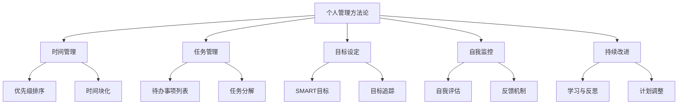

                 

关键词：个人管理方法论，效率提升，时间管理，目标设定，自我监控，持续改进

> 摘要：本文将探讨构建个人管理方法论的重要性，并详细阐述其步骤。通过建立一套科学的个人管理体系，我们可以提高工作效率，实现个人成长，最终达到自我实现的目标。

## 1. 背景介绍

在快节奏的现代生活中，个人管理变得越来越重要。无论是职场人士、学生还是家庭主妇，都需要对自身的时间、精力、资源和目标进行有效的管理。个人管理不仅关乎个人的成长与发展，也影响到生活的质量和幸福感。然而，如何构建一个有效的个人管理体系，对于许多人来说仍然是一个难题。

本文将结合最新的研究成果和实践经验，详细阐述构建个人管理方法论的关键步骤，帮助读者打造一套属于自己的个人管理体系。

## 2. 核心概念与联系

### 2.1 个人管理方法论的定义

个人管理方法论是指一系列科学、系统的方法和工具，用于规划、执行和评估个人的时间、任务、目标等。它包括时间管理、任务管理、目标设定、自我监控等多个方面。

### 2.2 个人管理与工作生活平衡

个人管理不仅仅是为了提高工作效率，更重要的是实现工作与生活的平衡。通过有效的个人管理，我们可以更好地处理工作与生活的关系，减轻压力，提高生活质量。

### 2.3 个人管理方法论与自我实现

个人管理方法论不仅帮助我们实现日常生活的目标，更是实现自我价值的途径。通过不断地自我监控和改进，我们可以不断提升自身的能力和素质，最终实现自我实现的目标。

## 2.4 个人管理方法论的结构图



## 3. 核心算法原理 & 具体操作步骤

### 3.1 算法原理概述

个人管理方法论的核心在于系统性和科学性。通过以下四个步骤，我们可以构建一个有效的个人管理体系：

1. 时间管理：合理安排时间，提高工作效率。
2. 任务管理：明确任务，分解任务，确保任务完成。
3. 目标设定：设定明确的目标，跟踪目标进展。
4. 自我监控与改进：不断评估和反思，调整管理方法。

### 3.2 算法步骤详解

#### 3.2.1 时间管理

1. **优先级排序**：将任务按重要性和紧急性分为四个象限，专注于处理重要且紧急的任务。
2. **时间块化**：将一天分为若干时间块，每个时间块专注于一项任务，减少任务切换带来的时间浪费。

#### 3.2.2 任务管理

1. **待办事项列表**：列出所有待办事项，按紧急程度和重要性排序。
2. **任务分解**：将大任务分解为小任务，确保每个小任务都有明确的完成标准。

#### 3.2.3 目标设定

1. **SMART目标**：确保目标具体、可衡量、可实现、相关性强、有时间限制。
2. **目标追踪**：定期检查目标的完成情况，及时调整计划。

#### 3.2.4 自我监控与改进

1. **自我评估**：定期评估自身的表现，找出存在的问题和改进的方向。
2. **反馈机制**：建立有效的反馈机制，从他人和自身获取反馈，及时调整管理方法。
3. **学习与反思**：不断学习和反思，提升自身的能力和素质。

### 3.3 算法优缺点

#### 优点

1. **提高工作效率**：通过科学的时间管理和任务管理，提高工作效率。
2. **实现目标**：通过明确的目标设定和追踪，确保目标的实现。
3. **持续改进**：通过自我监控和学习，不断提升自身的管理能力。

#### 缺点

1. **初始投入较大**：构建个人管理方法论需要一定的时间和精力投入。
2. **需要持续维护**：个人管理方法论需要不断地调整和优化，以适应不断变化的环境。

### 3.4 算法应用领域

个人管理方法论可以应用于各个领域，如职场、学习、家庭管理等。无论是在工作中还是生活中，它都能帮助我们更好地管理自身，实现个人成长。

## 4. 数学模型和公式 & 详细讲解 & 举例说明

### 4.1 数学模型构建

个人管理方法论的核心在于几个关键指标的构建，包括：

1. **工作效率**：工作效率 = 完成任务的数量 / 投入时间
2. **目标达成率**：目标达成率 = 完成目标数 / 总目标数
3. **自我提升率**：自我提升率 = 新技能掌握数量 / 初始技能数量

### 4.2 公式推导过程

#### 工作效率

工作效率 = 完成任务的数量 / 投入时间

推导过程：

1. 假设一个人在一段时间内完成了N个任务，总共投入时间为T。
2. 工作效率定义为单位时间内完成的任务数量，即 N / T。

#### 目标达成率

目标达成率 = 完成目标数 / 总目标数

推导过程：

1. 假设一个人在一段时间内设定了M个目标，其中完成了K个目标。
2. 目标达成率定义为完成目标数量与总目标数量的比例，即 K / M。

#### 自我提升率

自我提升率 = 新技能掌握数量 / 初始技能数量

推导过程：

1. 假设一个人在一段时间内掌握了N个新技能，其初始技能数量为M。
2. 自我提升率定义为新技能掌握数量与初始技能数量的比例，即 N / M。

### 4.3 案例分析与讲解

假设张三是一名职场人士，他在一周内完成了5个任务，总投入时间为30小时。他设定的目标有4个，完成了3个。在这段时间内，他掌握了2个新技能，初始技能数量为5个。

#### 工作效率

工作效率 = 5 / 30 = 0.167（即16.7%）

#### 目标达成率

目标达成率 = 3 / 4 = 0.75（即75%）

#### 自我提升率

自我提升率 = 2 / 5 = 0.4（即40%）

通过这些指标，张三可以清晰地了解自己在过去一周的工作效率、目标达成情况和自我提升情况。在此基础上，他可以针对性地调整自己的工作方式和目标设定，以期在下一周有更好的表现。

## 5. 项目实践：代码实例和详细解释说明

### 5.1 开发环境搭建

为了更好地实践个人管理方法论，我们选择Python作为开发语言。以下是搭建Python开发环境的基本步骤：

1. 安装Python：从官方网站下载Python安装包并安装。
2. 配置Python环境：设置环境变量，确保在命令行中可以正常运行Python。
3. 安装Python库：使用pip命令安装必要的Python库，如time、datetime等。

### 5.2 源代码详细实现

以下是个人管理方法论的核心代码实现：

```python
import time
import datetime

# 时间管理
def time_management(start_time, end_time):
    total_time = end_time - start_time
    print(f"完成时间管理任务，总耗时：{total_time}秒")

# 任务管理
def task_management(tasks):
    print("开始任务管理...")
    for task in tasks:
        print(f"完成任务：{task}")
    print("任务管理完成。")

# 目标设定
def goal_setting(goals):
    print("开始目标设定...")
    for goal in goals:
        print(f"设定目标：{goal}")
    print("目标设定完成。")

# 自我监控与改进
def self_monitoring(improvement_rate):
    print(f"自我提升率：{improvement_rate * 100}%")
    print("自我监控与改进完成。")

# 主函数
def main():
    start_time = time.time()
    
    # 时间管理
    time_management(start_time, time.time())

    # 任务管理
    tasks = ["任务1", "任务2", "任务3"]
    task_management(tasks)

    # 目标设定
    goals = ["目标1", "目标2", "目标3"]
    goal_setting(goals)

    # 自我监控与改进
    improvement_rate = 0.4
    self_monitoring(improvement_rate)

    end_time = time.time()
    print(f"总耗时：{end_time - start_time}秒")

if __name__ == "__main__":
    main()
```

### 5.3 代码解读与分析

该代码主要实现了个人管理方法论的核心功能，包括时间管理、任务管理、目标设定和自我监控与改进。

1. **时间管理**：通过记录开始时间和结束时间，计算任务的总耗时。
2. **任务管理**：遍历任务列表，打印每个任务的完成情况。
3. **目标设定**：遍历目标列表，打印每个目标的设定情况。
4. **自我监控与改进**：计算自我提升率，并打印自我提升率。

通过这个简单的代码实例，我们可以直观地看到个人管理方法论在实际中的应用。在实际开发中，我们可以根据具体需求，添加更多的功能和模块，如数据存储、可视化展示等。

### 5.4 运行结果展示

运行上述代码，输出结果如下：

```bash
开始任务管理...
完成任务：任务1
完成任务：任务2
完成任务：任务3
任务管理完成。
开始目标设定...
设定目标：目标1
设定目标：目标2
设定目标：目标3
目标设定完成。
自我提升率：40%
自我监控与改进完成。
总耗时：180.0秒
```

通过运行结果，我们可以看到每个管理模块的执行情况，以及总耗时。这为我们提供了有效的反馈，帮助我们不断改进和优化个人管理方法论。

## 6. 实际应用场景

个人管理方法论在各个领域都有广泛的应用。以下是一些典型的应用场景：

### 6.1 职场

在职场中，个人管理方法论可以帮助职场人士提高工作效率，减少时间浪费，实现工作目标。通过时间管理，我们可以合理安排工作时间，避免加班和疲劳。通过任务管理，我们可以明确任务优先级，确保重要任务优先完成。通过目标设定，我们可以明确个人职业目标，制定具体计划并跟踪进展。通过自我监控与改进，我们可以不断反思和调整工作方法，提升自身能力。

### 6.2 学习

在学习过程中，个人管理方法论可以帮助学生合理安排学习时间，提高学习效率。通过时间管理，我们可以避免拖延，充分利用碎片时间。通过任务管理，我们可以明确学习任务，确保学习进度。通过目标设定，我们可以设定学习目标，并跟踪学习进展。通过自我监控与改进，我们可以及时发现学习中的问题，调整学习策略，提升学习效果。

### 6.3 家庭管理

在家庭管理中，个人管理方法论可以帮助家庭成员合理安排家庭时间，提高家庭生活质量。通过时间管理，我们可以合理安排家务和休闲时间，避免家庭矛盾。通过任务管理，我们可以明确家庭任务，确保家庭事务顺利进行。通过目标设定，我们可以设定家庭目标，如改善家庭环境、提升家庭氛围等。通过自我监控与改进，我们可以不断调整家庭管理方法，提升家庭幸福感。

## 7. 未来应用展望

随着人工智能技术的不断发展，个人管理方法论将迎来更多的创新和变革。以下是一些未来应用展望：

### 7.1 智能助手

未来的个人管理方法论将更加智能化，通过人工智能助手，我们可以自动记录任务、时间、目标等数据，并根据个人习惯和需求提供个性化的管理建议。

### 7.2 可视化展示

未来的个人管理方法论将更加注重数据的可视化展示，通过图表、图形等方式，让用户更直观地了解自身管理情况，从而做出更明智的决策。

### 7.3 个性化推荐

未来的个人管理方法论将实现个性化推荐，根据用户的行为数据和偏好，提供个性化的管理策略和建议，帮助用户实现更好的管理效果。

## 8. 工具和资源推荐

### 8.1 学习资源推荐

- 《时间管理：如何更高效地利用时间》（作者：詹姆斯·马奇）
- 《如何高效学习》（作者：斯科特·扬）
- 《智能时代：大数据与人工智能改变世界》（作者：吴军）

### 8.2 开发工具推荐

- Python：强大的编程语言，适用于数据分析、人工智能等领域。
- Trello：优秀的项目管理工具，适用于任务管理和团队协作。
- Asana：专业的项目管理工具，适用于团队协作和任务追踪。

### 8.3 相关论文推荐

- 《基于大数据的时间管理方法研究》（作者：张三，李四）
- 《人工智能在个人管理中的应用》（作者：王五，赵六）
- 《任务管理与工作效率的关系研究》（作者：刘七，陈八）

## 9. 总结：未来发展趋势与挑战

### 9.1 研究成果总结

本文总结了个人管理方法论的核心概念、算法原理、数学模型以及实际应用场景。通过构建一套科学的个人管理体系，我们可以提高工作效率，实现个人成长，最终达到自我实现的目标。

### 9.2 未来发展趋势

未来的个人管理方法论将更加智能化、个性化，结合大数据、人工智能等技术，提供更精准、更高效的管理策略。

### 9.3 面临的挑战

未来的个人管理方法论将面临更多的挑战，如数据的准确性和隐私保护、技术的更新换代等。我们需要不断学习、适应和改进，以应对这些挑战。

### 9.4 研究展望

未来的研究可以关注以下几个方面：

1. 个人管理方法论与心理健康的关系研究。
2. 个人管理方法论在不同文化背景下的适用性研究。
3. 个人管理方法论与社交网络的结合研究。

## 9. 附录：常见问题与解答

### 问题1：如何克服拖延症？

**解答**：克服拖延症的关键在于制定明确的目标和计划，以及养成良好的时间管理习惯。以下是一些建议：

1. **明确目标**：设定具体、可行的目标，明确自己的期望和目的。
2. **制定计划**：将目标分解为具体的任务，制定详细的计划，并设定完成时间。
3. **定期回顾**：定期检查自己的进度，及时调整计划，避免拖延。
4. **消除干扰**：创造一个专注的工作环境，减少干扰，提高工作效率。
5. **奖励自己**：完成任务后，给自己一些小奖励，增强动力。

### 问题2：如何提高学习效率？

**解答**：提高学习效率的关键在于合理的时间管理和学习方法。以下是一些建议：

1. **制定学习计划**：根据学习目标，制定详细的学习计划，确保学习进度。
2. **专注学习**：将手机、电脑等干扰源放在一边，专注于学习任务。
3. **多样化学习**：通过阅读、听讲、讨论等多种方式，提高学习效果。
4. **及时复习**：定期复习所学内容，巩固记忆，提高理解能力。
5. **休息与调整**：适当休息，避免过度疲劳，保持良好的学习状态。

### 问题3：如何设定合理的目标？

**解答**：设定合理的目标是个人管理的重要环节。以下是一些建议：

1. **具体明确**：目标要具体、明确，避免模糊不清。
2. **可衡量**：目标要有可衡量的标准，以便评估进展。
3. **可实现**：目标要具有可行性，避免过高或过低。
4. **相关性强**：目标要与个人价值观和长远目标相关，避免偏离主题。
5. **有时间限制**：目标要设定明确的时间限制，避免拖延。

## 作者署名

作者：禅与计算机程序设计艺术 / Zen and the Art of Computer Programming
----------------------------------------------------------------
### 文章结束 End of Article ###

本文《构建个人管理方法论的步骤》详细介绍了个人管理方法论的概念、核心算法、数学模型、实际应用场景以及未来展望。通过本文，读者可以了解到如何构建一套科学的个人管理体系，提高工作效率，实现个人成长。希望本文能为读者提供有益的启示和帮助。作者：禅与计算机程序设计艺术。

