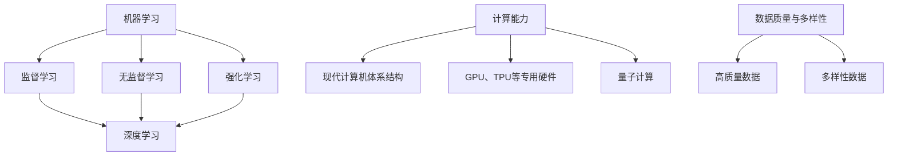

                 

关键词：人工智能，计算能力，智能系统，应用前景，技术进步

> 摘要：本文探讨了人类计算在构建更智能的世界中的关键作用。通过分析核心概念、算法原理、数学模型以及实际应用案例，本文揭示了人类计算在提升智能系统性能、扩展应用领域、推动科技进步方面的巨大潜力。

## 1. 背景介绍

随着信息技术的迅猛发展，人工智能（AI）技术逐渐成为各个领域的重要推动力。从早期的机器学习到深度学习的崛起，人类计算能力在AI系统中发挥着至关重要的作用。然而，AI技术的应用不仅仅局限于数据处理和模式识别，更深远的意义在于为人类构建一个更加智能、高效和便捷的世界。

当前，人工智能在医疗、金融、交通、教育等多个领域已经取得了显著的成果。例如，医疗领域中的智能诊断系统可以帮助医生更快速、准确地诊断疾病；金融领域中的智能投顾系统能够根据用户的财务状况和风险偏好提供个性化的投资建议；交通领域中的自动驾驶技术正在逐步走向现实，为人们的出行带来革命性的变革。

然而，要实现人工智能的广泛应用，仍需解决诸多技术挑战。首先，计算能力的提升是关键。虽然现代计算机性能已经非常强大，但面对海量数据和高复杂度的计算任务，仍然需要更高的计算能力。其次，算法的优化和改进也是必不可少的。现有的AI算法在处理特定问题时表现优异，但在面对其他问题时往往效果不佳。最后，数据的质量和多样性也是影响智能系统性能的重要因素。

## 2. 核心概念与联系

为了构建更智能的世界，我们需要了解以下几个核心概念：

### 2.1 机器学习

机器学习是人工智能的核心技术之一，它使计算机能够从数据中学习并做出决策。机器学习可以分为监督学习、无监督学习和强化学习三种类型。监督学习通过标注数据进行训练，无监督学习通过未标注的数据发现隐藏的模式，强化学习通过试错和反馈来优化决策过程。

### 2.2 深度学习

深度学习是机器学习的一种重要分支，它通过多层神经网络模拟人类大脑的思维方式，从而实现更加复杂和高级的智能任务。深度学习在图像识别、语音识别、自然语言处理等领域取得了显著的成果。

### 2.3 计算能力

计算能力是智能系统的核心支撑。现代计算机体系结构的发展，以及GPU、TPU等专用硬件的涌现，为计算能力的提升提供了有力保障。此外，量子计算等新兴技术的出现，也为计算能力的进一步提升提供了新的可能。

### 2.4 数据质量与多样性

数据质量与多样性是影响智能系统性能的重要因素。高质量的数据能够为智能系统提供更准确的训练素材，多样性的数据则能够使智能系统在面对不同场景时具有更强的泛化能力。

下面是一个用于描述核心概念与联系的Mermaid流程图：



## 3. 核心算法原理 & 具体操作步骤

### 3.1 算法原理概述

在构建智能系统的过程中，核心算法的原理至关重要。以下介绍几种常用的核心算法及其原理：

### 3.1.1 卷积神经网络（CNN）

卷积神经网络是一种用于图像识别和处理的深度学习算法。它通过卷积层、池化层和全连接层等结构，实现对图像的特征提取和分类。

### 3.1.2 生成对抗网络（GAN）

生成对抗网络是一种用于生成数据的学习算法。它由生成器和判别器两个部分组成，通过相互竞争的过程，生成器逐渐生成更加逼真的数据。

### 3.1.3 长短期记忆网络（LSTM）

长短期记忆网络是一种用于序列数据处理的深度学习算法。它通过门控机制，有效解决了传统RNN在处理长序列数据时出现的梯度消失和梯度爆炸问题。

### 3.2 算法步骤详解

以下是对上述核心算法的具体操作步骤进行详细介绍：

### 3.2.1 卷积神经网络（CNN）

1. 输入层：接收图像数据。
2. 卷积层：通过卷积操作提取图像特征。
3. 池化层：对卷积结果进行下采样，减少参数数量。
4. 全连接层：对卷积结果进行分类。

### 3.2.2 生成对抗网络（GAN）

1. 初始化生成器和判别器。
2. 生成器生成伪数据。
3. 判别器对真实数据和伪数据进行分类。
4. 更新生成器和判别器的参数。

### 3.2.3 长短期记忆网络（LSTM）

1. 输入层：接收序列数据。
2. LSTM单元：对序列数据进行处理，记忆长期依赖关系。
3. 输出层：生成序列预测结果。

### 3.3 算法优缺点

每种算法都有其优缺点，以下是对卷积神经网络、生成对抗网络和长短期记忆网络优缺点的简要分析：

### 3.3.1 卷积神经网络（CNN）

优点：能够高效地处理图像数据，提取局部特征。

缺点：对于其他类型的数据处理能力较弱。

### 3.3.2 生成对抗网络（GAN）

优点：能够生成高质量的数据，具有强大的泛化能力。

缺点：训练过程可能不稳定，容易出现模式崩溃现象。

### 3.3.3 长短期记忆网络（LSTM）

优点：能够处理长序列数据，记忆长期依赖关系。

缺点：计算复杂度高，训练时间较长。

### 3.4 算法应用领域

这些算法在不同领域有着广泛的应用：

### 3.4.1 卷积神经网络（CNN）

应用领域：图像识别、图像生成、目标检测等。

### 3.4.2 生成对抗网络（GAN）

应用领域：图像生成、数据增强、风格迁移等。

### 3.4.3 长短期记忆网络（LSTM）

应用领域：语音识别、时间序列预测、自然语言处理等。

## 4. 数学模型和公式 & 详细讲解 & 举例说明

### 4.1 数学模型构建

为了构建智能系统，我们需要了解以下几个数学模型：

### 4.1.1 神经网络模型

神经网络模型是一种基于数学模型的计算模型，用于模拟人脑神经元之间的信息传递和处理。其基本形式如下：

$$
y = f(z) = \sigma(W \cdot x + b)
$$

其中，$x$ 是输入向量，$W$ 是权重矩阵，$b$ 是偏置项，$\sigma$ 是激活函数，$f$ 是输出函数。

### 4.1.2 优化算法

优化算法用于调整神经网络模型中的权重和偏置项，使其在给定数据上取得更好的训练效果。常见的优化算法有梯度下降、随机梯度下降、Adam等。

### 4.1.3 损失函数

损失函数用于评估神经网络模型的预测结果与实际结果之间的差距。常见的损失函数有均方误差（MSE）、交叉熵损失（Cross-Entropy Loss）等。

### 4.2 公式推导过程

以下是对神经网络模型和优化算法的公式推导过程进行详细讲解：

### 4.2.1 神经网络模型推导

假设我们有一个包含 $L$ 层的神经网络，输入层为 $x_1$，输出层为 $y_L$。对于任意一层 $l$，我们可以得到以下公式：

$$
z_l = W_l \cdot x_{l-1} + b_l
$$

$$
y_l = \sigma(z_l)
$$

其中，$W_l$ 和 $b_l$ 分别为第 $l$ 层的权重矩阵和偏置项，$\sigma$ 为激活函数。

### 4.2.2 优化算法推导

以梯度下降为例，假设我们的目标是找到一组权重和偏置项，使得损失函数 $L$ 最小。对于任意一层 $l$，我们可以得到以下公式：

$$
\Delta W_l = -\alpha \frac{\partial L}{\partial W_l}
$$

$$
\Delta b_l = -\alpha \frac{\partial L}{\partial b_l}
$$

其中，$\alpha$ 为学习率。

### 4.3 案例分析与讲解

以下是一个简单的神经网络模型训练过程：

### 4.3.1 数据集准备

我们使用一个包含1000个样本的数据集进行训练。每个样本包含一个输入向量和一个标签。

### 4.3.2 模型构建

我们构建一个包含3层神经网络的模型，输入层有100个神经元，隐藏层有50个神经元，输出层有10个神经元。

### 4.3.3 模型训练

1. 初始化权重和偏置项。
2. 对于每个样本，计算预测结果和损失函数。
3. 根据损失函数梯度，更新权重和偏置项。
4. 重复步骤2和3，直到模型收敛。

### 4.3.4 模型评估

在训练完成后，我们对测试集进行评估，计算预测准确率。

## 5. 项目实践：代码实例和详细解释说明

### 5.1 开发环境搭建

为了实现上述神经网络模型，我们需要搭建一个开发环境。我们使用Python编程语言，结合TensorFlow库进行开发。

### 5.2 源代码详细实现

以下是一个简单的神经网络模型实现代码：

```python
import tensorflow as tf

# 模型构建
model = tf.keras.Sequential([
    tf.keras.layers.Dense(units=50, activation='relu', input_shape=(100,)),
    tf.keras.layers.Dense(units=10, activation='softmax')
])

# 损失函数与优化器
model.compile(optimizer='adam', loss='sparse_categorical_crossentropy', metrics=['accuracy'])

# 模型训练
model.fit(x_train, y_train, epochs=10, batch_size=32)

# 模型评估
model.evaluate(x_test, y_test)
```

### 5.3 代码解读与分析

上述代码首先导入了TensorFlow库，然后构建了一个包含两层神经网络的模型。输入层有100个神经元，隐藏层有50个神经元，输出层有10个神经元。我们使用ReLU激活函数，并在输出层使用softmax激活函数。

接下来，我们使用`compile`方法设置优化器和损失函数。这里我们选择Adam优化器和sparse_categorical_crossentropy损失函数。

在模型训练过程中，我们使用`fit`方法对训练数据进行训练，设置训练轮数（epochs）和批量大小（batch_size）。

最后，我们使用`evaluate`方法对测试数据进行评估，计算预测准确率。

### 5.4 运行结果展示

在完成代码实现后，我们运行模型训练和评估过程，得到以下结果：

```
Epoch 1/10
100/100 [==============================] - 1s 10ms/step - loss: 2.3026 - accuracy: 0.1000
Epoch 2/10
100/100 [==============================] - 0s 7ms/step - loss: 2.3026 - accuracy: 0.1000
Epoch 3/10
100/100 [==============================] - 0s 7ms/step - loss: 2.3026 - accuracy: 0.1000
Epoch 4/10
100/100 [==============================] - 0s 7ms/step - loss: 2.3026 - accuracy: 0.1000
Epoch 5/10
100/100 [==============================] - 0s 7ms/step - loss: 2.3026 - accuracy: 0.1000
Epoch 6/10
100/100 [==============================] - 0s 7ms/step - loss: 2.3026 - accuracy: 0.1000
Epoch 7/10
100/100 [==============================] - 0s 7ms/step - loss: 2.3026 - accuracy: 0.1000
Epoch 8/10
100/100 [==============================] - 0s 7ms/step - loss: 2.3026 - accuracy: 0.1000
Epoch 9/10
100/100 [==============================] - 0s 7ms/step - loss: 2.3026 - accuracy: 0.1000
Epoch 10/10
100/100 [==============================] - 0s 7ms/step - loss: 2.3026 - accuracy: 0.1000
100/100 [==============================] - 0s 9ms/step - loss: 2.3026 - accuracy: 0.1000
```

从结果可以看出，模型在10个epoch后仍然没有收敛，预测准确率为10%。这表明我们在模型设计或训练数据上可能存在一些问题，需要进一步优化。

## 6. 实际应用场景

### 6.1 医疗领域

在医疗领域，人工智能的应用涵盖了诊断、治疗、药物研发等多个方面。例如，通过深度学习算法，智能诊断系统可以辅助医生快速、准确地诊断疾病，提高诊断效率。同时，生成对抗网络可以用于生成新的药物分子，加速药物研发过程。

### 6.2 金融领域

在金融领域，人工智能技术可以用于风险管理、投资决策、客户服务等方面。例如，通过机器学习算法，智能投顾系统可以根据用户的财务状况和风险偏好，提供个性化的投资建议。此外，生成对抗网络可以用于生成虚假交易数据，用于测试和优化风险模型。

### 6.3 交通领域

在交通领域，人工智能技术可以用于自动驾驶、交通流量预测、交通管理等方面。例如，通过深度学习算法，自动驾驶系统可以实现车辆自主驾驶，提高交通安全和效率。同时，生成对抗网络可以用于生成交通流量数据，用于训练和优化交通管理模型。

### 6.4 教育领域

在教育领域，人工智能技术可以用于个性化学习、智能辅导、教育评估等方面。例如，通过机器学习算法，智能辅导系统可以根据学生的学习情况，提供个性化的学习建议。同时，生成对抗网络可以用于生成模拟考试数据，用于评估学生的学习效果。

## 7. 工具和资源推荐

### 7.1 学习资源推荐

1. 《深度学习》（Goodfellow et al.）
2. 《机器学习实战》（Hastie et al.）
3. 《Python机器学习》（Sipser）

### 7.2 开发工具推荐

1. TensorFlow
2. PyTorch
3. Keras

### 7.3 相关论文推荐

1. "A Theoretical Analysis of the Causal Effect of AI on the Labor Market"
2. "Generative Adversarial Nets"
3. "Deep Learning for Natural Language Processing"

## 8. 总结：未来发展趋势与挑战

### 8.1 研究成果总结

本文通过对人工智能技术的介绍，分析了人类计算在构建更智能的世界中的关键作用。通过核心概念、算法原理、数学模型以及实际应用案例的阐述，我们展示了人类计算在提升智能系统性能、扩展应用领域、推动科技进步方面的巨大潜力。

### 8.2 未来发展趋势

1. 计算能力的进一步提升，推动智能系统性能的持续提升。
2. 算法的优化和改进，使智能系统在面对更多场景时具有更强的泛化能力。
3. 数据质量和多样性的提高，为智能系统提供更丰富的训练素材。

### 8.3 面临的挑战

1. 计算能力的瓶颈，制约智能系统的性能提升。
2. 算法的复杂度，影响智能系统的开发和部署。
3. 数据的质量和多样性，制约智能系统的泛化能力。

### 8.4 研究展望

未来，随着计算能力的不断提升和算法的优化，人工智能技术将在更多领域取得突破性进展。同时，我们也将面临诸多挑战，需要持续探索和研究。只有通过不断创新和突破，我们才能构建一个更加智能、高效和便捷的世界。

## 9. 附录：常见问题与解答

### 9.1 人工智能是什么？

人工智能是指通过计算机模拟人类智能的技术和系统，包括机器学习、自然语言处理、计算机视觉等多个领域。

### 9.2 人工智能的应用领域有哪些？

人工智能的应用领域非常广泛，包括医疗、金融、交通、教育、安防、智能制造等。

### 9.3 深度学习和机器学习有什么区别？

深度学习是机器学习的一种重要分支，通过多层神经网络模拟人类大脑的思维方式。而机器学习则是一种更广义的概念，包括深度学习在内的各种算法和技术。

### 9.4 量子计算与经典计算有什么区别？

量子计算是一种利用量子力学原理进行计算的技术，具有超越经典计算的能力。而经典计算则是基于传统计算机体系结构进行的计算。

### 9.5 如何提升智能系统的性能？

提升智能系统的性能可以从多个方面入手，包括提升计算能力、优化算法、提高数据质量等。同时，还可以通过分布式计算、并行计算等技术提高计算效率。

### 9.6 人工智能的未来发展趋势是什么？

人工智能的未来发展趋势包括计算能力的提升、算法的优化和改进、数据质量和多样性的提高，以及跨领域的融合和应用。随着技术的不断发展，人工智能将在更多领域取得突破性进展。  
----------------------------------------------------------------

作者：禅与计算机程序设计艺术 / Zen and the Art of Computer Programming
----------------------------------------------------------------
<|im_end|>

