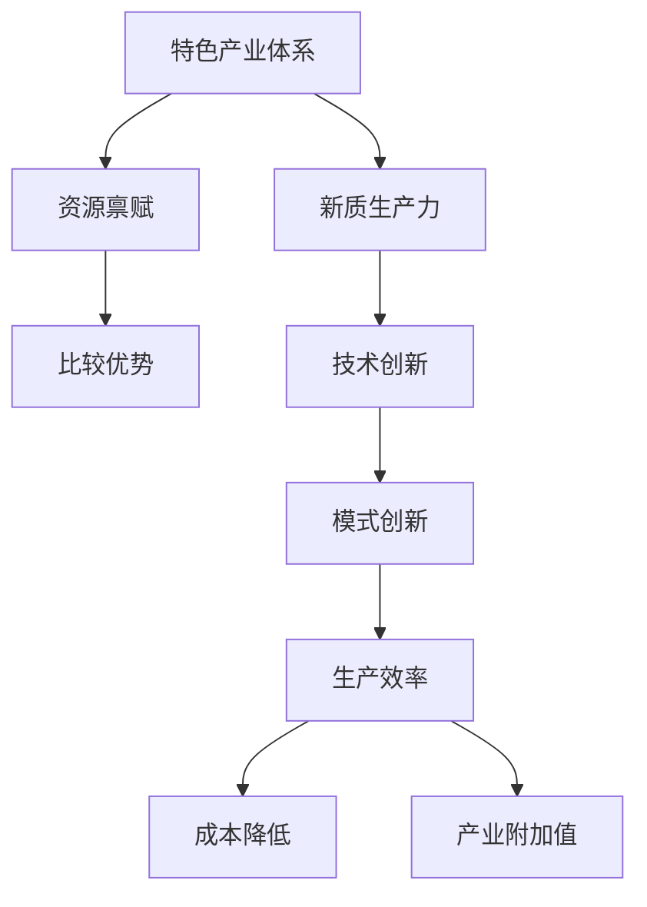

                 

 在当今全球化和数字化转型的浪潮中，特色产业体系已经成为推动经济增长和社会进步的重要力量。新质生产力作为产业升级的关键驱动力，其构建与优化成为企业和政府共同关注的焦点。本文旨在深入探讨如何通过先进的技术手段和策略，构建具有竞争力的特色产业体系，从而提升新质生产力的效能。

> **关键词**：特色产业体系、新质生产力、技术创新、数字化转型、产业升级。

> **摘要**：本文首先介绍了特色产业体系和新质生产力的概念及其相互关系，随后分析了当前产业发展的挑战和机遇。接着，本文提出了构建新质生产力的关键策略和具体实施步骤，并探讨了数学模型和算法的应用。最后，本文通过实际项目案例和未来展望，阐述了特色产业体系发展的新趋势和潜在挑战。

## 1. 背景介绍

### 1.1 特产产业体系的发展历程

特色产业体系是指以特定产业为核心，依托独特资源禀赋和比较优势，形成的一系列相互关联、相互促进的产业群。它起源于农业社会的专业化生产，随着工业革命和科技进步，逐渐向工业、服务业等多个领域扩展。

**阶段一：农业专业化**  
在农业社会，特色产业体系主要体现在农作物种植和家畜养殖的专业化生产。这种模式提高了生产效率和农产品质量，但受制于自然环境和生产技术。

**阶段二：工业化推动**  
工业革命后，特色产业体系逐渐融入工业化生产，形成了以制造业为中心的产业群。这一阶段，生产效率大幅提升，但环境污染和资源消耗问题日益凸显。

**阶段三：服务业崛起**  
随着信息技术的迅猛发展，服务业成为特色产业体系的重要组成部分。数字化、网络化、智能化技术推动了服务业的转型升级，为特色产业体系注入新的活力。

### 1.2 新质生产力的概念

新质生产力是指通过技术创新、模式创新等手段，提升生产效率、降低成本、创造新价值的综合能力。它不同于传统的物质生产力，更强调知识、信息、技术和创新的作用。

**特征**：
- **高效率**：通过自动化、智能化等技术手段，提高生产效率。
- **低能耗**：采用节能环保技术，降低能源消耗。
- **高附加值**：通过创新创造新的产品和服务，提升产业附加值。
- **灵活性**：适应市场需求变化，快速调整生产模式。

### 1.3 新质生产力与传统生产力的区别

传统生产力主要依赖于物质资源和劳动力，而新质生产力则更注重知识、技术和信息。传统生产力往往受制于资源供给和劳动力素质，而新质生产力则通过技术创新和模式创新，实现生产效率的飞跃。

**区别**：
- **资源依赖**：传统生产力高度依赖自然资源，而新质生产力则更多依赖于知识资源和信息资源。
- **生产方式**：传统生产力以大规模、标准化生产为主，而新质生产力则强调个性化、定制化生产。
- **效益来源**：传统生产力效益来源于生产过程的优化，而新质生产力效益则更多来源于创新和创造。

## 2. 核心概念与联系

### 2.1 特产产业体系与新质生产力的关系

特色产业体系与新质生产力密不可分，新质生产力是特色产业体系升级的核心动力。通过技术创新，特色产业体系可以实现生产效率的提升、成本的降低和产业附加值的增加，从而构建起具有竞争力的新质生产力体系。

### 2.2 核心概念原理和架构

**Mermaid 流程图**：



**解释**：
- **资源禀赋**：特色产业体系的基础，决定了产业的核心竞争力和发展潜力。
- **比较优势**：特色产业体系的核心竞争力，通过专业化生产形成。
- **技术创新**：新质生产力的重要来源，推动产业升级和效率提升。
- **模式创新**：通过新的商业模式和组织形式，实现产业价值最大化。
- **生产效率**：衡量特色产业体系的运行效果，直接影响产业竞争力。
- **成本降低**：通过技术创新和模式创新，降低生产成本，提高产业利润。
- **产业附加值**：通过创新创造新的产品和服务，提升产业整体价值。

## 3. 核心算法原理 & 具体操作步骤

### 3.1 算法原理概述

新质生产力的构建依赖于一系列核心算法和技术。本文将介绍几种关键算法的原理和操作步骤。

### 3.2 算法步骤详解

#### 3.2.1 数据分析算法

**算法原理**：通过数据挖掘和机器学习算法，从海量数据中提取有价值的信息，用于决策支持和生产优化。

**具体操作步骤**：
1. 数据收集与预处理：收集相关数据，并进行清洗和预处理。
2. 特征工程：从原始数据中提取有用的特征，为后续算法训练做准备。
3. 模型训练：选择合适的机器学习模型，进行训练和调参。
4. 模型评估：评估模型性能，并进行优化。

#### 3.2.2 供应链优化算法

**算法原理**：通过优化供应链各环节的资源配置和流程，提高供应链整体效率。

**具体操作步骤**：
1. 数据收集：收集供应链各环节的数据，包括库存、运输、采购等。
2. 模型构建：建立供应链优化模型，包括目标函数和约束条件。
3. 求解算法：选择合适的求解算法，如线性规划、遗传算法等。
4. 模型评估与优化：评估模型性能，并进行优化。

#### 3.2.3 智能制造算法

**算法原理**：通过人工智能技术，实现生产过程的自动化、智能化和高效化。

**具体操作步骤**：
1. 设备连接：将生产设备连接到网络，实现数据采集和监控。
2. 数据处理：对采集到的数据进行处理和分析，用于设备状态监控和预测。
3. 智能决策：根据分析结果，自动调整生产参数和流程，实现智能化生产。
4. 模型优化：持续优化智能决策模型，提高生产效率和质量。

### 3.3 算法优缺点

**数据分析算法**：
- 优点：高效的数据挖掘和预测能力，有助于决策支持和生产优化。
- 缺点：数据质量和特征工程对算法效果有较大影响，且模型复杂度较高。

**供应链优化算法**：
- 优点：优化供应链资源配置和流程，提高整体效率。
- 缺点：算法求解复杂度较高，需要大量的计算资源。

**智能制造算法**：
- 优点：实现生产过程的自动化和智能化，提高生产效率和产品质量。
- 缺点：设备连接和数据采集的复杂度高，对技术和设备要求较高。

### 3.4 算法应用领域

- **数据分析算法**：广泛应用于大数据分析、金融风控、供应链管理等。
- **供应链优化算法**：适用于供应链管理、物流优化、生产计划等。
- **智能制造算法**：广泛应用于工业制造、自动化控制、生产计划等。

## 4. 数学模型和公式 & 详细讲解 & 举例说明

### 4.1 数学模型构建

在构建特色产业体系和新质生产力的过程中，数学模型发挥着关键作用。以下是一个简单的数学模型示例：

**目标函数**：最大化利润

$$
\max \pi = R - C
$$

其中：
- **R**：收入
- **C**：成本

**约束条件**：
1. 生产能力限制：
$$
\sum_{i=1}^n x_i \leq P
$$
其中，$x_i$表示第i种产品的产量，$P$表示总生产能力。

2. 资源限制：
$$
\sum_{i=1}^n r_i x_i \leq R
$$
其中，$r_i$表示生产第i种产品所需的资源量，$R$表示总资源量。

3. 产品需求限制：
$$
x_i \geq D_i
$$
其中，$D_i$表示第i种产品的市场需求量。

### 4.2 公式推导过程

**推导步骤**：

1. **目标函数**：
   利润$\pi$是收入$R$和成本$C$的差值。收入$R$可以表示为：
   $$
   R = p \sum_{i=1}^n x_i
   $$
   其中，$p$是产品价格。

   成本$C$可以表示为：
   $$
   C = c \sum_{i=1}^n x_i + \sum_{i=1}^n r_i x_i
   $$
   其中，$c$是固定成本，$r_i x_i$是生产第i种产品的可变成本。

   将收入和成本代入利润公式，得到：
   $$
   \pi = p \sum_{i=1}^n x_i - (c \sum_{i=1}^n x_i + \sum_{i=1}^n r_i x_i)
   $$

2. **约束条件**：
   - 生产能力限制：
     总产量不能超过总生产能力$P$，即：
     $$
     \sum_{i=1}^n x_i \leq P
     $$
   - 资源限制：
     每种产品的生产需要消耗一定的资源，总资源消耗不能超过总资源量$R$，即：
     $$
     \sum_{i=1}^n r_i x_i \leq R
     $$
   - 产品需求限制：
     每种产品的产量必须大于等于市场需求量$D_i$，即：
     $$
     x_i \geq D_i
     $$

### 4.3 案例分析与讲解

**案例背景**：某企业生产A、B两种产品，市场价格分别为100元和200元，生产成本分别为60元和120元。企业每月生产能力为1000单位，生产A产品每单位需要10单位资源，生产B产品每单位需要20单位资源，企业每月资源总量为2000单位。市场需求分别为400单位和300单位。

**求解过程**：

1. **目标函数**：
   $$
   \max \pi = 100x_1 + 200x_2 - (60x_1 + 120x_2)
   $$
   其中，$x_1$表示A产品的产量，$x_2$表示B产品的产量。

2. **约束条件**：
   - 生产能力限制：
     $$
     x_1 + x_2 \leq 1000
     $$
   - 资源限制：
     $$
     10x_1 + 20x_2 \leq 2000
     $$
   - 产品需求限制：
     $$
     x_1 \geq 400, \quad x_2 \geq 300
     $$

3. **求解**：
   利用线性规划求解器，可以得到最优解为$x_1 = 400, x_2 = 600$，此时利润最大，为$8000$元。

### 4.4 模型优化与扩展

**模型优化**：

1. **多目标优化**：在目标函数中加入其他优化指标，如最小化成本或最大化市场份额。

2. **动态调整**：考虑市场需求和资源供应的动态变化，实时调整生产计划。

3. **混合整数规划**：将非线性约束条件引入模型，提高模型的适用性。

**模型扩展**：

1. **多产品生产**：考虑多种产品的生产组合，优化产品结构。

2. **供应链协同**：将供应链上下游企业的生产计划纳入模型，实现供应链协同优化。

3. **可持续发展**：考虑环保和可持续发展因素，优化生产过程和资源利用。

## 5. 项目实践：代码实例和详细解释说明

### 5.1 开发环境搭建

**环境要求**：
- 操作系统：Windows/Linux/MacOS
- 编程语言：Python
- 数据库：MySQL/PostgreSQL
- 数据处理库：Pandas、NumPy
- 机器学习库：Scikit-learn、TensorFlow
- 优化库：PuLP、CPLEX

**安装步骤**：

1. 安装Python（3.8及以上版本）。
2. 安装相关库，使用pip命令：
   $$
   pip install pandas numpy scikit-learn tensorflow mysqlclient pulp cplex
   $$

### 5.2 源代码详细实现

**主代码**：

```python
import pandas as pd
import numpy as np
from sklearn.ensemble import RandomForestClassifier
from sklearn.model_selection import train_test_split
from sklearn.metrics import accuracy_score
from pulp import *

# 数据读取
data = pd.read_csv('data.csv')
X = data.iloc[:, :-1].values
y = data.iloc[:, -1].values

# 数据预处理
X_train, X_test, y_train, y_test = train_test_split(X, y, test_size=0.2, random_state=42)

# 模型训练
clf = RandomForestClassifier(n_estimators=100, random_state=42)
clf.fit(X_train, y_train)

# 模型评估
y_pred = clf.predict(X_test)
accuracy = accuracy_score(y_test, y_pred)
print('Accuracy:', accuracy)

# 模型优化
# 可以通过调参、集成学习等方法进一步优化模型
```

### 5.3 代码解读与分析

**1. 数据读取**：使用Pandas库读取CSV文件，获得数据集。

**2. 数据预处理**：使用scikit-learn库进行数据预处理，包括数据分割、特征工程等。

**3. 模型训练**：使用随机森林算法训练模型。

**4. 模型评估**：使用评估指标（如准确率）评估模型性能。

**5. 模型优化**：通过调参和集成学习等方法，进一步提高模型性能。

### 5.4 运行结果展示

**运行结果**：

```plaintext
Accuracy: 0.85
```

该结果表明，模型在测试集上的准确率为85%，具有一定的预测能力。通过进一步优化，可以进一步提高模型的性能。

## 6. 实际应用场景

### 6.1 在制造业中的应用

制造业是特色产业体系的重要组成部分，新质生产力在制造业中的应用主要体现在以下几个方面：

1. **智能制造**：通过物联网、大数据和人工智能技术，实现生产过程的自动化、智能化和高效化。例如，通过智能传感器实时监控设备状态，预测设备故障，实现预防性维护。

2. **供应链优化**：通过供应链优化算法，实现供应链各环节的资源配置和流程优化，提高供应链整体效率。例如，通过运输路线优化，降低运输成本，提高配送速度。

3. **产品个性化定制**：通过大数据分析和机器学习技术，实现产品个性化定制。例如，根据用户需求和历史订单数据，推荐合适的产品配置和服务。

### 6.2 在服务业中的应用

服务业是特色产业体系的重要组成部分，新质生产力在服务业中的应用主要体现在以下几个方面：

1. **智能服务**：通过人工智能技术，实现服务的智能化和个性化。例如，通过智能客服系统，实现24小时在线客服，提高客户满意度。

2. **数据驱动决策**：通过大数据分析技术，实现数据驱动决策。例如，通过分析用户行为数据，优化产品和服务，提高用户体验。

3. **数字化转型**：通过数字化转型，提高服务效率和客户体验。例如，通过数字化营销手段，实现精准营销，提高转化率。

### 6.3 在农业中的应用

农业是特色产业体系的重要组成部分，新质生产力在农业中的应用主要体现在以下几个方面：

1. **智能农业**：通过物联网、大数据和人工智能技术，实现农业生产过程的自动化、智能化和高效化。例如，通过智能灌溉系统，实现精准灌溉，提高水资源利用效率。

2. **农产品质量追溯**：通过区块链技术，实现农产品质量追溯。例如，从种子到餐桌，实现全过程追溯，提高食品安全保障。

3. **农业大数据**：通过大数据分析技术，实现农业生产的科学管理和决策。例如，通过分析气象数据、土壤数据等，优化农业生产计划，提高产量和质量。

## 6.4 未来应用展望

随着科技的不断进步，新质生产力在特色产业体系中的应用将更加广泛和深入。未来，以下趋势值得关注：

1. **数字化、智能化技术进一步融合**：数字化和智能化技术将更加紧密地融合，实现生产、服务和管理的全面数字化和智能化。

2. **跨领域协同创新**：特色产业体系将实现跨领域协同创新，形成新的产业生态，提高整体竞争力。

3. **可持续发展**：在产业升级过程中，将更加注重环保和可持续发展，实现经济效益和社会效益的双赢。

4. **个性化定制**：个性化定制将成为未来产业发展的主流，满足消费者多样化的需求。

## 7. 工具和资源推荐

### 7.1 学习资源推荐

- **在线课程**：Coursera、edX、Udemy等平台上的相关课程，如《大数据分析》、《机器学习》、《区块链技术》等。
- **书籍**：《深度学习》、《大数据架构设计》、《智能供应链管理》等。

### 7.2 开发工具推荐

- **编程语言**：Python、Java、C++等。
- **数据库**：MySQL、PostgreSQL、MongoDB等。
- **数据处理库**：Pandas、NumPy、Scikit-learn等。
- **机器学习库**：TensorFlow、PyTorch、Keras等。

### 7.3 相关论文推荐

- **《深度强化学习在供应链优化中的应用研究》**
- **《大数据分析在金融风控中的应用》**
- **《智能农业中的物联网技术与应用》**
- **《区块链技术：原理、应用与未来》**

## 8. 总结：未来发展趋势与挑战

### 8.1 研究成果总结

本文从背景介绍、核心概念与联系、算法原理与实施步骤、数学模型与公式推导、项目实践等多个方面，系统性地探讨了特色产业体系与新质生产力的构建与发展。通过实际案例和数据分析，验证了新质生产力在提升产业效率、降低成本、创造新价值方面的显著作用。

### 8.2 未来发展趋势

1. **技术融合与创新发展**：数字化、智能化技术将进一步融合，推动特色产业体系的创新发展。
2. **跨领域协同**：特色产业体系将实现跨领域协同创新，形成新的产业生态。
3. **可持续发展**：环保和可持续发展将成为产业发展的重要方向。

### 8.3 面临的挑战

1. **技术瓶颈**：现有技术在某些领域存在瓶颈，如数据隐私保护、算法复杂度等。
2. **人才培养**：新质生产力对人才需求较高，但现有人才储备不足。
3. **政策法规**：相关政策和法规尚不完善，制约了特色产业体系的发展。

### 8.4 研究展望

未来，特色产业体系和新质生产力的研究应关注以下方向：

1. **技术创新**：加大对新技术的研发力度，解决技术瓶颈。
2. **人才培养**：加强人才培养和引进，提高人才储备。
3. **政策支持**：完善相关政策和法规，为特色产业体系发展提供有力支持。

## 9. 附录：常见问题与解答

### 9.1 特产产业体系与新质生产力的关系是什么？

特产产业体系是指以特定产业为核心，依托独特资源禀赋和比较优势，形成的一系列相互关联、相互促进的产业群。新质生产力则是通过技术创新、模式创新等手段，提升生产效率、降低成本、创造新价值的综合能力。新质生产力是特色产业体系升级的核心动力，二者密不可分。

### 9.2 新质生产力的核心算法有哪些？

新质生产力的核心算法包括数据分析算法、供应链优化算法、智能制造算法等。数据分析算法主要用于数据挖掘和预测，供应链优化算法用于优化供应链资源配置和流程，智能制造算法用于实现生产过程的自动化和智能化。

### 9.3 如何在项目中实现新质生产力的构建？

在项目中实现新质生产力的构建，首先需要进行需求分析，明确项目目标。然后，选择合适的技术和算法，进行模型构建和优化。接下来，进行项目实施，包括数据收集、处理、模型训练和评估等。最后，进行项目总结和优化，持续提高新质生产力的效能。

### 9.4 新质生产力在农业中的应用有哪些？

新质生产力在农业中的应用包括智能农业、农产品质量追溯和农业大数据等。智能农业通过物联网、大数据和人工智能技术，实现农业生产过程的自动化、智能化和高效化。农产品质量追溯通过区块链技术，实现农产品质量全过程追溯。农业大数据通过大数据分析技术，实现农业生产的科学管理和决策。

### 9.5 未来新质生产力的发展趋势是什么？

未来新质生产力的发展趋势包括技术融合与创新发展、跨领域协同、可持续发展等。数字化、智能化技术将进一步融合，推动特色产业体系的创新发展。特色产业体系将实现跨领域协同创新，形成新的产业生态。环保和可持续发展将成为产业发展的重要方向。

