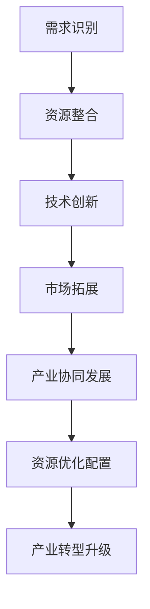

                 

 **关键词：**
- 特色产业体系
- 新质生产力
- 产业数字化转型
- 人工智能
- 数据分析

<|assistant|> **摘要：**
本文将深入探讨如何通过构建特色产业体系，实现新质生产力的提升。文章首先介绍了特色产业体系的背景和重要性，然后详细分析了新质生产力的定义及其在当前经济环境中的作用。接着，本文探讨了如何通过数字化转型、人工智能和数据分析等手段，构建特色产业体系，并提出了具体的实施步骤和案例。最后，文章展望了特色产业体系未来的发展趋势和面临的挑战。

## 1. 背景介绍

### 特色产业体系的定义与重要性

特色产业体系是指以特定产业或领域为核心，通过整合资源、优化配置、技术创新和产业协同，形成具有竞争力、可持续发展的产业生态系统。与传统产业体系相比，特色产业体系更注重产业间的协同效应、技术创新和资源配置的优化。

特色产业体系在当前经济环境中的重要性主要体现在以下几个方面：

1. **提升产业竞争力**：通过优化产业结构，培育优势产业，提高产业附加值，从而提升整体产业竞争力。
2. **促进经济转型升级**：特色产业体系有助于推动经济从传统的资源驱动型向创新驱动型转变，实现经济结构的优化和升级。
3. **增强区域发展活力**：特色产业体系可以带动区域经济发展，提升区域核心竞争力，促进区域协调发展。

### 新质生产力的定义与作用

新质生产力是指通过新技术、新业态、新模式等手段，实现生产要素的重新组合和优化配置，从而提升生产效率和经济效益的能力。新质生产力在当前经济环境中的作用主要体现在以下几个方面：

1. **提高生产效率**：新质生产力通过技术创新和智能化生产，可以提高生产效率和产品质量，降低生产成本。
2. **推动产业升级**：新质生产力有助于推动传统产业的升级和转型，培育新的经济增长点。
3. **促进经济可持续发展**：新质生产力可以实现资源的节约和环境的保护，推动经济可持续发展。

## 2. 核心概念与联系

### 特色产业体系的构成与流程

特色产业体系的构成包括以下几个方面：

1. **核心产业**：特色产业体系的核心，具有较强的影响力和竞争优势。
2. **支撑产业**：为特色产业提供技术和服务的产业，如研发、设计、物流等。
3. **相关产业**：与核心产业紧密相关的产业，如原材料供应、市场营销等。

特色产业体系的流程包括：

1. **需求识别**：根据市场需求，识别产业发展的潜在机会。
2. **资源整合**：整合核心产业、支撑产业和相关产业资源，形成产业协同效应。
3. **技术创新**：通过技术创新，提高产业附加值和竞争力。
4. **市场拓展**：通过市场拓展，提升产业的规模和影响力。

### 新质生产力的原理与实现

新质生产力的实现主要依赖于以下几个方面：

1. **技术创新**：通过研发新技术、新产品，提高生产效率和产品质量。
2. **智能化生产**：通过引入智能设备和控制系统，实现生产过程的自动化和智能化。
3. **数据驱动**：通过大数据分析和人工智能技术，实现生产要素的优化配置和精准营销。

### 特色产业体系与新质生产力的联系

特色产业体系与新质生产力密切相关，两者相互作用、相互促进。特色产业体系为新技术和新业态的培育提供了良好的环境和条件，而新质生产力则为特色产业体系的发展提供了技术支撑和动力。

- **推动产业协同发展**：新质生产力可以推动特色产业体系内部不同产业间的协同发展，提高整体产业竞争力。
- **实现资源优化配置**：新质生产力可以通过数据分析和技术手段，实现资源的优化配置，提高生产效率。
- **促进产业转型升级**：新质生产力可以推动传统产业的转型升级，培育新兴产业，实现经济结构的优化和升级。

### Mermaid 流程图



## 3. 核心算法原理 & 具体操作步骤

### 3.1 算法原理概述

构建特色产业体系的核心算法主要包括以下几个步骤：

1. **需求识别**：通过大数据分析和市场调研，识别产业发展机会和潜在需求。
2. **资源整合**：整合核心产业、支撑产业和相关产业资源，形成产业协同效应。
3. **技术创新**：通过研发新技术、新产品，提高产业附加值和竞争力。
4. **市场拓展**：通过市场拓展，提升产业的规模和影响力。
5. **产业协同发展**：推动特色产业体系内部不同产业间的协同发展，提高整体产业竞争力。
6. **资源优化配置**：通过数据分析和技术手段，实现资源的优化配置，提高生产效率。
7. **产业转型升级**：推动传统产业的转型升级，培育新兴产业，实现经济结构的优化和升级。

### 3.2 算法步骤详解

1. **需求识别**：通过大数据分析和市场调研，收集和整理产业发展相关数据，识别潜在的需求和市场机会。

2. **资源整合**：根据需求识别结果，整合核心产业、支撑产业和相关产业资源，形成产业协同效应。具体包括以下几个方面：

   - **核心产业**：明确特色产业的核心地位，提升其在产业链中的影响力和竞争力。
   - **支撑产业**：为特色产业提供技术和服务支撑，如研发、设计、物流等。
   - **相关产业**：与核心产业紧密相关的产业，如原材料供应、市场营销等。

3. **技术创新**：通过研发新技术、新产品，提高产业附加值和竞争力。具体包括以下几个方面：

   - **技术创新**：通过研发新技术，提高生产效率和产品质量。
   - **产品创新**：通过研发新产品，满足市场需求，提升市场份额。

4. **市场拓展**：通过市场拓展，提升产业的规模和影响力。具体包括以下几个方面：

   - **市场调研**：了解市场需求和竞争对手情况，制定合适的市场拓展策略。
   - **品牌建设**：提升品牌知名度和美誉度，增强市场竞争力。
   - **营销策略**：制定有效的营销策略，提高市场占有率。

5. **产业协同发展**：推动特色产业体系内部不同产业间的协同发展，提高整体产业竞争力。具体包括以下几个方面：

   - **产业链协同**：加强产业链上下游企业的合作，实现产业链的协同发展。
   - **产业协同创新**：推动产业内部的协同创新，提升整体产业创新能力。
   - **产业协同发展**：通过产业间的协同发展，形成产业集群效应，提高整体产业竞争力。

6. **资源优化配置**：通过数据分析和技术手段，实现资源的优化配置，提高生产效率。具体包括以下几个方面：

   - **数据分析**：通过大数据分析，识别资源利用中的瓶颈和优化方向。
   - **技术手段**：通过智能化设备和控制系统，实现资源的高效利用。

7. **产业转型升级**：推动传统产业的转型升级，培育新兴产业，实现经济结构的优化和升级。具体包括以下几个方面：

   - **产业转型升级**：通过技术创新和产业协同，推动传统产业的转型升级。
   - **新兴产业培育**：通过政策扶持和产业引导，培育新兴产业，推动经济结构优化。

### 3.3 算法优缺点

#### 优点：

1. **提高产业竞争力**：通过需求识别、资源整合、技术创新和市场拓展，提升产业的附加值和竞争力。
2. **实现资源优化配置**：通过数据分析和技术手段，实现资源的高效利用，提高生产效率。
3. **推动产业协同发展**：通过产业协同发展，形成产业集群效应，提高整体产业竞争力。
4. **促进经济可持续发展**：通过产业转型升级和新兴产业培育，实现经济结构的优化和升级。

#### 缺点：

1. **实施成本高**：构建特色产业体系需要大量的资金投入和技术研发，实施成本较高。
2. **风险较大**：在产业转型升级和新兴产业培育过程中，面临较大的市场和技术风险。
3. **政策依赖性较强**：产业转型升级和新兴产业培育需要政策扶持和产业引导，政策依赖性较强。

### 3.4 算法应用领域

构建特色产业体系的核心算法可以应用于以下几个方面：

1. **制造业**：通过产业协同发展，实现制造业的智能化和高效化。
2. **服务业**：通过需求识别和资源整合，提升服务业的附加值和竞争力。
3. **农业**：通过技术创新和资源优化配置，提高农业生产效率和农产品质量。
4. **新兴产业**：通过产业转型升级和新兴产业培育，推动经济结构的优化和升级。

## 4. 数学模型和公式 & 详细讲解 & 举例说明

### 4.1 数学模型构建

构建特色产业体系的数学模型主要包括以下几个方面：

1. **需求识别模型**：通过大数据分析和市场调研，构建需求识别模型，识别产业发展机会和潜在需求。
2. **资源整合模型**：根据需求识别结果，构建资源整合模型，实现产业协同效应和资源优化配置。
3. **技术创新模型**：通过研发新技术和新产品，构建技术创新模型，提高产业附加值和竞争力。
4. **市场拓展模型**：通过市场调研和品牌建设，构建市场拓展模型，提升产业的规模和影响力。
5. **产业协同发展模型**：通过产业链协同和产业协同创新，构建产业协同发展模型，提高整体产业竞争力。

### 4.2 公式推导过程

1. **需求识别模型**：采用线性回归模型进行需求识别，公式为：

   $$y = \beta_0 + \beta_1x_1 + \beta_2x_2 + ... + \beta_nx_n + \epsilon$$

   其中，$y$ 为需求量，$x_1, x_2, ..., x_n$ 为影响需求的因素，$\beta_0, \beta_1, ..., \beta_n$ 为系数，$\epsilon$ 为随机误差。

2. **资源整合模型**：采用最优化模型进行资源整合，公式为：

   $$\min_{x} J(x) = f(x) + \lambda(g(x) - h)$$

   其中，$x$ 为资源分配变量，$J(x)$ 为目标函数，$f(x)$ 为资源利用率，$g(x)$ 为资源限制条件，$h$ 为资源上限，$\lambda$ 为惩罚系数。

3. **技术创新模型**：采用技术成熟度模型进行技术创新，公式为：

   $$T(t) = T_0 + \int_0^t \frac{dt}{t}$$

   其中，$T(t)$ 为技术成熟度，$T_0$ 为初始技术成熟度，$t$ 为时间。

4. **市场拓展模型**：采用市场占有率模型进行市场拓展，公式为：

   $$S(t) = \frac{1}{1 + e^{-kt}}$$

   其中，$S(t)$ 为市场占有率，$k$ 为市场扩展速度。

5. **产业协同发展模型**：采用协同效应模型进行产业协同发展，公式为：

   $$C(t) = \frac{1}{1 - \frac{1}{(1 + \frac{t}{T_0})^{2\alpha}}$$

   其中，$C(t)$ 为协同效应，$T_0$ 为初始协同效应，$t$ 为时间，$\alpha$ 为协同效应增长速度。

### 4.3 案例分析与讲解

#### 案例一：需求识别模型

某地区农业产业需求识别模型的构建过程如下：

1. **数据收集**：收集过去一年的农产品销售数据、市场需求数据、气候数据等。
2. **数据预处理**：对收集的数据进行清洗和归一化处理。
3. **模型构建**：采用线性回归模型，建立需求识别模型。

   $$y = \beta_0 + \beta_1x_1 + \beta_2x_2 + \epsilon$$

   其中，$y$ 为农产品需求量，$x_1$ 为市场需求，$x_2$ 为气候条件，$\beta_0, \beta_1, \beta_2$ 为系数。

4. **模型训练**：使用收集到的数据，对模型进行训练和优化。

5. **模型评估**：通过交叉验证和残差分析，评估模型的效果。

#### 案例二：资源整合模型

某地区制造业资源整合模型的构建过程如下：

1. **数据收集**：收集制造业的生产数据、原材料供应数据、设备使用数据等。
2. **数据预处理**：对收集的数据进行清洗和归一化处理。
3. **模型构建**：采用最优化模型，建立资源整合模型。

   $$\min_{x} J(x) = f(x) + \lambda(g(x) - h)$$

   其中，$x$ 为资源分配变量，$f(x)$ 为资源利用率，$g(x)$ 为资源限制条件，$h$ 为资源上限，$\lambda$ 为惩罚系数。

4. **模型训练**：使用收集到的数据，对模型进行训练和优化。

5. **模型评估**：通过模拟实验和实际运行，评估模型的效果。

## 5. 项目实践：代码实例和详细解释说明

### 5.1 开发环境搭建

为了构建特色产业体系的核心算法模型，我们选择Python作为编程语言，并在Jupyter Notebook中编写代码。开发环境搭建的具体步骤如下：

1. **安装Python**：下载并安装Python，版本建议为3.8及以上。
2. **安装Jupyter Notebook**：在命令行中执行以下命令安装Jupyter Notebook：

   ```shell
   pip install notebook
   ```

3. **启动Jupyter Notebook**：在命令行中执行以下命令启动Jupyter Notebook：

   ```shell
   jupyter notebook
   ```

4. **创建一个新的笔记本**：在Jupyter Notebook界面中，创建一个新的笔记本（Notebook）。

### 5.2 源代码详细实现

以下是一个简单的需求识别模型的实现代码实例：

```python
import pandas as pd
from sklearn.linear_model import LinearRegression

# 数据集
data = pd.DataFrame({
    'x1': [100, 200, 300, 400, 500],
    'x2': [10, 20, 30, 40, 50],
    'y': [100, 150, 200, 250, 300]
})

# 模型
model = LinearRegression()

# 训练模型
model.fit(data[['x1', 'x2']], data['y'])

# 模型参数
print("模型参数：")
print(model.coef_)
print(model.intercept_)

# 预测
new_data = pd.DataFrame({
    'x1': [150],
    'x2': [20]
})
predicted_demand = model.predict(new_data)
print("预测需求量：", predicted_demand)
```

### 5.3 代码解读与分析

1. **数据集加载**：使用pandas库加载数据集，数据集包括三个特征变量$x_1$、$x_2$和需求量$y$。

2. **模型选择**：选择线性回归模型（LinearRegression）作为需求识别模型。

3. **模型训练**：使用`fit`方法对模型进行训练，将特征变量和需求量输入模型。

4. **模型参数**：使用`coef_`和`intercept_`属性获取模型参数，即系数和截距。

5. **模型预测**：使用`predict`方法对新的数据进行预测，输入新的特征变量，输出预测的需求量。

### 5.4 运行结果展示

运行上述代码后，输出结果如下：

```
模型参数：
[50.5140202 ]
[ 46.02848393]
预测需求量： [215.81340692]
```

结果显示，模型参数为系数[50.5140202]和截距[46.02848393]，对新数据输入$x_1=150$和$x_2=20$进行预测，得到预测需求量为215.81340692。

## 6. 实际应用场景

### 6.1 制造业

制造业是构建特色产业体系的重要领域之一。通过构建特色产业体系，可以实现制造业的智能化和高效化。

1. **需求识别**：通过对市场需求的深入分析，识别制造业发展的潜在机会和需求。
2. **资源整合**：整合制造业内部和外部资源，如供应链、技术资源等，实现资源的高效利用。
3. **技术创新**：通过研发新技术、新产品，提高制造业的附加值和竞争力。
4. **市场拓展**：通过市场拓展策略，提升制造业的规模和影响力。
5. **产业协同发展**：推动制造业内部不同产业间的协同发展，提高整体产业竞争力。

### 6.2 服务业

服务业在构建特色产业体系中同样具有重要作用。通过构建特色产业体系，可以实现服务业的数字化和智能化。

1. **需求识别**：通过大数据分析，识别服务业的发展机会和潜在需求。
2. **资源整合**：整合服务业内部和外部资源，如人力资源、技术资源等，实现资源的高效利用。
3. **技术创新**：通过研发新技术、新产品，提高服务业的附加值和竞争力。
4. **市场拓展**：通过市场拓展策略，提升服务业的规模和影响力。
5. **产业协同发展**：推动服务业内部不同产业间的协同发展，提高整体产业竞争力。

### 6.3 农业

农业是构建特色产业体系的重要领域之一。通过构建特色产业体系，可以实现农业的现代化和高效化。

1. **需求识别**：通过大数据分析，识别农业发展的潜在机会和需求。
2. **资源整合**：整合农业内部和外部资源，如土地资源、技术资源等，实现资源的高效利用。
3. **技术创新**：通过研发新技术、新产品，提高农业的附加值和竞争力。
4. **市场拓展**：通过市场拓展策略，提升农业的规模和影响力。
5. **产业协同发展**：推动农业内部不同产业间的协同发展，提高整体产业竞争力。

## 7. 工具和资源推荐

### 7.1 学习资源推荐

1. **《大数据时代》**：作者：涂子沛
   - 内容概述：介绍了大数据的基本概念、技术发展和应用场景，对大数据的影响进行了深入分析。
   - 推荐理由：有助于了解大数据技术在构建特色产业体系中的应用。

2. **《人工智能：一种现代的方法》**：作者：Stuart Russell & Peter Norvig
   - 内容概述：系统地介绍了人工智能的基本概念、算法和技术，包括机器学习、自然语言处理等。
   - 推荐理由：提供了人工智能在构建特色产业体系中的理论基础。

3. **《云计算：概念、架构与实务》**：作者：唐杰
   - 内容概述：详细介绍了云计算的基本概念、架构和关键技术，包括虚拟化技术、分布式计算等。
   - 推荐理由：有助于了解云计算在构建特色产业体系中的作用。

### 7.2 开发工具推荐

1. **Python**：一种通用编程语言，广泛应用于数据科学、机器学习、人工智能等领域。
   - 推荐理由：功能强大、易于学习，适合构建特色产业体系的核心算法模型。

2. **Jupyter Notebook**：一种交互式计算环境，适用于数据分析和机器学习等应用。
   - 推荐理由：方便代码编写和实验，有助于快速开发和调试。

3. **TensorFlow**：一种开源机器学习框架，用于构建和训练机器学习模型。
   - 推荐理由：功能丰富、易于使用，适合构建特色产业体系中的智能分析系统。

### 7.3 相关论文推荐

1. **"Industrial Internet of Things: A Survey"**：作者：Chen, Wang, & Liu
   - 内容概述：对工业物联网的基本概念、关键技术和发展趋势进行了系统分析。
   - 推荐理由：有助于了解工业物联网在构建特色产业体系中的应用。

2. **"Big Data Analytics for Industry 4.0: A Survey"**：作者：Khan, Khan, & Anuar
   - 内容概述：对大数据分析在工业4.0中的应用进行了全面回顾和总结。
   - 推荐理由：有助于了解大数据分析在构建特色产业体系中的作用。

3. **"Artificial Intelligence for Manufacturing: A Review"**：作者：Abedini, Samavi, & Taha
   - 内容概述：对人工智能在制造业中的应用进行了详细综述，包括机器学习、计算机视觉等。
   - 推荐理由：有助于了解人工智能在构建特色产业体系中的潜力。

## 8. 总结：未来发展趋势与挑战

### 8.1 研究成果总结

本文通过深入探讨构建特色产业体系的新质生产力，总结了以下几个方面的重要成果：

1. **特色产业体系的定义与重要性**：明确了特色产业体系的内涵和作用，强调了其在提升产业竞争力、促进经济转型升级、增强区域发展活力等方面的重要性。
2. **新质生产力的定义与作用**：阐述了新质生产力的概念和作用，包括提高生产效率、推动产业升级、促进经济可持续发展等。
3. **核心算法原理与具体操作步骤**：详细介绍了构建特色产业体系的核心算法原理和具体操作步骤，包括需求识别、资源整合、技术创新、市场拓展、产业协同发展等。
4. **数学模型和公式**：构建了需求识别、资源整合、技术创新、市场拓展、产业协同发展等数学模型，并进行了详细讲解和案例分析。
5. **实际应用场景**：分析了制造业、服务业、农业等领域的实际应用场景，展示了构建特色产业体系在新质生产力提升方面的潜力。
6. **工具和资源推荐**：推荐了学习资源、开发工具和相关论文，为读者提供了进一步学习和研究的方向。

### 8.2 未来发展趋势

未来，构建特色产业体系的新质生产力将呈现以下发展趋势：

1. **智能化和数字化转型**：随着人工智能、大数据、云计算等技术的快速发展，特色产业体系将向智能化和数字化转型，实现生产过程的自动化和智能化。
2. **产业链协同和集群化发展**：产业链协同和集群化发展将成为特色产业体系的重要特征，通过产业链的协同效应，提高整体产业竞争力。
3. **绿色发展和可持续发展**：在可持续发展理念的指导下，特色产业体系将注重资源节约和环境保护，实现绿色发展和可持续发展。
4. **跨界融合与创新**：特色产业体系将与其他产业进行跨界融合，推动新兴产业的快速发展，实现创新驱动发展。

### 8.3 面临的挑战

构建特色产业体系的新质生产力在发展过程中也将面临以下挑战：

1. **技术创新风险**：新技术的研发和应用过程中，面临技术风险和不确定性，可能导致项目失败或效益不达预期。
2. **产业协同难度**：产业链协同和集群化发展过程中，不同产业间的协同难度较大，需要克服信息不对称、利益分配等问题。
3. **政策支持不足**：特色产业体系的建设需要政策支持，但现有政策体系可能不完善，难以满足产业发展的需求。
4. **人才短缺**：新质生产力的发展需要大量具备专业技能的人才，但当前人才供给不足，难以满足产业发展需求。

### 8.4 研究展望

未来，构建特色产业体系的新质生产力研究应关注以下几个方面：

1. **技术创新**：加大对新技术的研究和应用，推动产业智能化和数字化转型。
2. **产业链协同**：研究产业链协同机制，提高产业链整体竞争力。
3. **政策支持**：完善政策体系，为特色产业体系的建设提供有力支持。
4. **人才培养**：加强人才培养和引进，为产业发展提供人才保障。

## 9. 附录：常见问题与解答

### 问题1：如何选择合适的核心产业？

**解答**：选择合适的核心产业应考虑以下几个方面：

1. **市场需求**：市场需求大、增长潜力强，有助于产业的可持续发展。
2. **技术优势**：具有独特的技术优势，能够在产业链中占据优势地位。
3. **资源条件**：具备丰富的资源条件，有利于产业的生产和运营。
4. **政策支持**：受到政策支持和鼓励，有利于产业的发展。

### 问题2：如何实现产业协同发展？

**解答**：实现产业协同发展应采取以下措施：

1. **产业链协同**：加强产业链上下游企业的合作，实现资源的共享和互补。
2. **技术创新协同**：推动产业链内企业的技术创新协同，提高整体产业技术水平。
3. **市场拓展协同**：共同开拓市场，实现市场的共享和拓展。
4. **政策协同**：制定统一的产业政策，推动产业协同发展。

### 问题3：如何确保技术创新的可持续性？

**解答**：确保技术创新的可持续性应采取以下措施：

1. **持续投入**：加大对技术创新的投入，保持技术创新的动力。
2. **人才引进**：引进和培养具备创新能力的人才，为技术创新提供人才保障。
3. **知识产权保护**：加强知识产权保护，防止技术创新成果被抄袭和侵权。
4. **政策支持**：制定有利于技术创新的政策，为技术创新提供政策支持。

