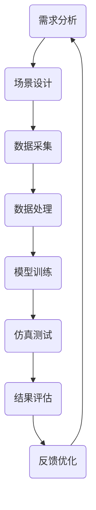

                 

关键词：自动驾驶、仿真平台、数据集、算法、质量考量

> 摘要：本文详细探讨了构建高质量自动驾驶仿真平台与数据集的关键考量。首先介绍了自动驾驶技术的发展背景，随后深入分析了仿真平台和数据集在自动驾驶技术中的重要性，并提出了构建高质量仿真平台和数据集的具体方法和步骤。最后，本文展望了自动驾驶技术的发展趋势和面临的挑战。

## 1. 背景介绍

自动驾驶技术作为智能交通系统的重要组成部分，旨在实现车辆在无需人类操作的情况下，依靠先进的传感器、控制系统和决策算法自主完成行驶任务。随着人工智能技术的不断发展，自动驾驶技术逐渐从理论研究走向实际应用，已成为全球汽车产业和科技企业竞相投入的领域。

### 自动驾驶技术的发展背景

自动驾驶技术的发展经历了多个阶段。最初，自动驾驶技术主要集中在自动导航和自动泊车等简单的功能上。随着传感器技术和计算机视觉算法的进步，自动驾驶技术逐渐向更复杂的场景和任务扩展，如高速公路自动驾驶、城市道路自动驾驶等。当前，自动驾驶技术已经进入L3和L4级别，即部分自动驾驶和高度自动驾驶阶段。

### 自动驾驶技术的应用领域

自动驾驶技术广泛应用于公共交通、物流运输、个人出行等多个领域。例如，在公共交通领域，自动驾驶公交车已经在北京、上海等城市进行试点运行；在物流运输领域，自动驾驶卡车和无人配送车正在逐渐普及；在个人出行领域，自动驾驶出租车和私家车也引起了广泛关注。

## 2. 核心概念与联系

构建高质量的自动驾驶仿真平台与数据集是自动驾驶技术发展的重要环节。以下是相关核心概念及其之间的联系：

### 仿真平台

仿真平台是自动驾驶技术研发的重要基础设施，用于模拟不同的交通场景、环境条件和车辆状态，帮助开发人员测试和验证自动驾驶算法的性能和安全性。仿真平台的核心功能包括：

1. **场景模拟**：模拟不同交通场景，如城市道路、高速公路、隧道、恶劣天气等。
2. **环境建模**：建立道路、车辆、行人、其他交通参与者的三维模型。
3. **传感器模拟**：模拟自动驾驶车辆上的各类传感器，如雷达、激光雷达、摄像头等。
4. **决策与控制**：提供自动驾驶车辆的决策与控制算法，实现对车辆运动的模拟。

### 数据集

数据集是自动驾驶算法训练和测试的重要资源。高质量的数据集能够提供丰富、多样、真实的驾驶场景，有助于提升自动驾驶算法的准确性和鲁棒性。数据集的主要构成包括：

1. **场景数据**：包括道路、车辆、行人、交通信号灯等交通参与者的静态和动态信息。
2. **传感器数据**：包括摄像头、雷达、激光雷达等传感器的原始数据。
3. **行为数据**：包括自动驾驶车辆的决策、控制信息等。
4. **标注数据**：对场景、传感器数据和行为的标注，以便算法训练和评估。

### 仿真平台与数据集的联系

仿真平台与数据集之间紧密相关，仿真平台需要高质量的数据集作为支撑，而数据集则需要通过仿真平台进行验证和优化。以下是仿真平台与数据集之间的联系：

1. **数据集生成**：仿真平台可以模拟各种驾驶场景，为数据集生成提供场景背景。
2. **数据集验证**：仿真平台可以用于验证数据集的真实性和有效性。
3. **算法训练**：仿真平台可以用于自动驾驶算法的训练和测试，数据集则是算法训练的重要资源。
4. **反馈优化**：通过仿真平台对自动驾驶算法的测试结果，可以对数据集进行优化和调整。

### Mermaid 流程图

以下是构建高质量自动驾驶仿真平台与数据集的 Mermaid 流程图：



## 3. 核心算法原理 & 具体操作步骤

### 3.1 算法原理概述

构建高质量的自动驾驶仿真平台与数据集涉及多个核心算法，包括场景生成算法、传感器数据处理算法、自动驾驶决策算法等。以下是这些算法的基本原理概述：

1. **场景生成算法**：基于概率模型或机器学习算法，生成符合真实驾驶场景的数据集。常见的场景生成算法有马尔可夫决策过程（MDP）和生成对抗网络（GAN）等。
2. **传感器数据处理算法**：对采集到的传感器数据进行预处理、特征提取和融合，以提高数据质量和算法性能。常见的传感器数据处理算法有贝叶斯滤波、卡尔曼滤波和深度学习等。
3. **自动驾驶决策算法**：根据传感器数据和场景信息，生成自动驾驶车辆的决策和控制指令。常见的自动驾驶决策算法有深度强化学习、基于规则的控制策略和混合智能控制等。

### 3.2 算法步骤详解

以下是构建高质量自动驾驶仿真平台与数据集的具体操作步骤：

1. **需求分析**：明确仿真平台与数据集的需求，包括场景类型、传感器配置、算法目标等。
2. **场景设计**：根据需求设计仿真场景，包括道路、车辆、行人、交通信号灯等交通参与者。
3. **数据采集**：通过仿真平台模拟不同驾驶场景，采集传感器数据、场景数据和行为数据。
4. **数据处理**：对采集到的数据进行预处理、特征提取和融合，以提高数据质量和算法性能。
5. **模型训练**：利用采集到的数据训练自动驾驶决策算法，如深度强化学习模型。
6. **仿真测试**：在仿真平台中测试自动驾驶算法的性能和稳定性，根据测试结果进行调整和优化。
7. **结果评估**：评估自动驾驶算法在不同场景下的性能，如路径规划精度、反应速度等。
8. **反馈优化**：根据评估结果对仿真平台、数据集和算法进行优化和调整，提高整体性能。

### 3.3 算法优缺点

1. **场景生成算法**：优点是能够生成丰富的驾驶场景数据，有助于提升自动驾驶算法的泛化能力；缺点是计算复杂度较高，生成数据的质量和真实性难以保证。
2. **传感器数据处理算法**：优点是能够提高传感器数据的可靠性和准确性，有助于提升自动驾驶算法的性能；缺点是对数据处理算法的要求较高，实现复杂。
3. **自动驾驶决策算法**：优点是能够生成有效的决策和控制指令，提高自动驾驶车辆的稳定性；缺点是算法的鲁棒性和适应性有待提高。

### 3.4 算法应用领域

1. **场景生成算法**：广泛应用于自动驾驶算法训练、测试和评估，如自动驾驶车辆测试场、自动驾驶出租车和无人配送车等。
2. **传感器数据处理算法**：广泛应用于自动驾驶车辆上的传感器数据预处理和特征提取，如摄像头、雷达、激光雷达等。
3. **自动驾驶决策算法**：广泛应用于自动驾驶车辆的控制和决策，如高速公路自动驾驶、城市道路自动驾驶等。

## 4. 数学模型和公式 & 详细讲解 & 举例说明

### 4.1 数学模型构建

构建高质量的自动驾驶仿真平台与数据集需要建立一系列数学模型，包括场景生成模型、传感器数据处理模型和自动驾驶决策模型。以下是这些模型的构建过程：

1. **场景生成模型**：
   - 马尔可夫决策过程（MDP）模型：
     $$ V^*(s) = \arg \min_{\pi} \sum_{s'} p(s' | s, a) \cdot \mathbb{E}_{\pi}[R(s', a)] $$
   - 生成对抗网络（GAN）模型：
     $$ G(z) = \mathcal{N}(z; 0, 1) $$
     $$ D(x) = \mathcal{N}(x; \mu_x, \sigma_x^2) $$
2. **传感器数据处理模型**：
   - 贝叶斯滤波模型：
     $$ p(x_t | u_t, x_{t-1}) = \frac{p(x_t | u_t) \cdot p(u_t | x_{t-1})}{p(u_t)} $$
   - 卡尔曼滤波模型：
     $$ x_t = A \cdot x_{t-1} + B \cdot u_t $$
     $$ P_t = A \cdot P_{t-1} \cdot A^T + Q $$
3. **自动驾驶决策模型**：
   - 深度强化学习模型：
     $$ Q(s, a) = \sum_{s'} \gamma \cdot r(s', a) \cdot p(s' | s, a) $$
   - 基于规则的决策模型：
     $$ \text{if} \, \text{condition} \, \text{then} \, \text{action} $$

### 4.2 公式推导过程

以下是各个数学模型的推导过程：

1. **马尔可夫决策过程（MDP）模型**：
   - 目标是最小化期望回报：
     $$ \mathbb{E}_{\pi}[R(s, a)] = \sum_{s'} p(s' | s, a) \cdot R(s', a) $$
   - 使用贝尔曼方程迭代求解最优策略：
     $$ V^*(s) = \arg \min_{\pi} \sum_{s'} p(s' | s, a) \cdot \mathbb{E}_{\pi}[R(s', a)] $$
     $$ V^*(s) = \sum_{a} \pi(a | s) \cdot \sum_{s'} p(s' | s, a) \cdot \mathbb{E}_{\pi}[R(s', a)] $$
2. **生成对抗网络（GAN）模型**：
   - 生成器 G 和判别器 D 的对抗训练过程：
     - 生成器 G 的损失函数：
       $$ \mathcal{L}_G = \mathbb{E}_{z \sim \mathcal{N}(0, 1)} [\log D(G(z))] $$
     - 判别器 D 的损失函数：
       $$ \mathcal{L}_D = \mathbb{E}_{x \sim \mathcal{X}} [\log D(x)] + \mathbb{E}_{z \sim \mathcal{N}(0, 1)} [\log (1 - D(G(z))] $$
3. **贝叶斯滤波模型**：
   - 递归滤波过程：
     $$ p(x_t | u_t, x_{t-1}) = \frac{p(x_t | u_t) \cdot p(u_t | x_{t-1})}{p(u_t)} $$
     $$ p(u_t | x_{t-1}) = \frac{p(x_{t-1} | u_t) \cdot p(u_t)}{p(x_{t-1})} $$
     $$ p(x_{t-1} | u_t) = \int_{x_{t-1}} p(x_{t-1} | u_t, x_{t}) p(x_{t}) dx_{t} $$
4. **卡尔曼滤波模型**：
   - 状态转移方程和观测方程：
     $$ x_t = A \cdot x_{t-1} + B \cdot u_t $$
     $$ y_t = H \cdot x_t + v_t $$
   - 卡尔曼滤波递推公式：
     $$ P_t = A \cdot P_{t-1} \cdot A^T + Q $$
     $$ K_t = P_t \cdot H^T \cdot (H \cdot P_t \cdot H^T + R)^{-1} $$
     $$ x_t = x_{t-1} + K_t \cdot (y_t - H \cdot x_t) $$
     $$ P_t = (I - K_t \cdot H) \cdot P_{t-1} $$

### 4.3 案例分析与讲解

以下是一个具体的案例，说明如何利用数学模型构建高质量的自动驾驶仿真平台与数据集：

**案例：使用生成对抗网络（GAN）生成自动驾驶场景数据集**

1. **场景设计**：设计一个包含城市道路、车辆、行人和交通信号灯的自动驾驶场景。
2. **数据采集**：通过仿真平台模拟不同的驾驶场景，采集包含传感器数据、场景数据和行为的原始数据。
3. **数据处理**：对采集到的数据进行预处理，包括图像增强、归一化等操作。
4. **模型训练**：利用生成对抗网络（GAN）模型训练生成器 G 和判别器 D，生成高质量的自动驾驶场景数据。
5. **仿真测试**：在仿真平台中测试生成的自动驾驶场景数据，评估数据集的真实性和有效性。
6. **结果评估**：根据测试结果调整 GAN 模型的参数，优化生成的自动驾驶场景数据集。

通过以上步骤，可以构建一个高质量的自动驾驶仿真平台与数据集，为自动驾驶算法的训练和测试提供有力支持。

## 5. 项目实践：代码实例和详细解释说明

### 5.1 开发环境搭建

为了构建高质量的自动驾驶仿真平台与数据集，我们需要搭建一个适合开发的环境。以下是搭建环境的步骤：

1. **安装 Python 环境**：确保 Python 环境已经安装，版本建议为 Python 3.8 或更高版本。
2. **安装依赖库**：安装以下 Python 库：
   ```python
   pip install numpy pandas matplotlib torch torchvision
   ```
3. **配置 CUDA 环境**：如果使用 GPU 进行训练，需要配置 CUDA 环境，确保 Python 库 torch 和 torchvision 可以使用 GPU。

### 5.2 源代码详细实现

以下是一个简单的代码实例，用于生成自动驾驶场景数据集。该实例使用生成对抗网络（GAN）模型进行训练。

```python
import torch
import torch.nn as nn
import torch.optim as optim
from torchvision import datasets, transforms
from torch.utils.data import DataLoader
from torchvision.utils import save_image

# 数据预处理
transform = transforms.Compose([
    transforms.Resize((256, 256)),
    transforms.ToTensor(),
])

# 生成器 G 的实现
class Generator(nn.Module):
    def __init__(self):
        super(Generator, self).__init__()
        self.model = nn.Sequential(
            nn.ConvTranspose2d(100, 256, 4, 1, 0, bias=False),
            nn.BatchNorm2d(256),
            nn.ReLU(True),
            nn.ConvTranspose2d(256, 128, 4, 2, 1, bias=False),
            nn.BatchNorm2d(128),
            nn.ReLU(True),
            nn.ConvTranspose2d(128, 64, 4, 2, 1, bias=False),
            nn.BatchNorm2d(64),
            nn.ReLU(True),
            nn.ConvTranspose2d(64, 3, 4, 2, 1, bias=False),
            nn.Tanh()
        )

    def forward(self, x):
        return self.model(x)

# 判别器 D 的实现
class Discriminator(nn.Module):
    def __init__(self):
        super(Discriminator, self).__init__()
        self.model = nn.Sequential(
            nn.Conv2d(3, 64, 4, 2, 1, bias=False),
            nn.LeakyReLU(0.2, inplace=True),
            nn.Conv2d(64, 128, 4, 2, 1, bias=False),
            nn.BatchNorm2d(128),
            nn.LeakyReLU(0.2, inplace=True),
            nn.Conv2d(128, 256, 4, 2, 1, bias=False),
            nn.BatchNorm2d(256),
            nn.LeakyReLU(0.2, inplace=True),
            nn.Conv2d(256, 1, 4, 1, 0, bias=False),
            nn.Sigmoid()
        )

    def forward(self, x):
        return self.model(x)

# 模型实例化
generator = Generator()
discriminator = Discriminator()

# 损失函数和优化器
criterion = nn.BCELoss()
optimizer_g = optim.Adam(generator.parameters(), lr=0.0002, betas=(0.5, 0.999))
optimizer_d = optim.Adam(discriminator.parameters(), lr=0.0002, betas=(0.5, 0.999))

# 数据集加载
dataloader = DataLoader(datasets.ImageFolder('data', transform=transform), batch_size=128, shuffle=True)

# 训练过程
for epoch in range(100):
    for i, (images, _) in enumerate(dataloader):
        # 训练判别器
        real_images = images.cuda()
        real_labels = torch.ones(images.size(0), 1).cuda()
        fake_labels = torch.zeros(images.size(0), 1).cuda()

        optimizer_d.zero_grad()
        outputs = discriminator(real_images)
        loss_d_real = criterion(outputs, real_labels)
        outputs = discriminator(generator(z).cuda())
        loss_d_fake = criterion(outputs, fake_labels)
        loss_d = (loss_d_real + loss_d_fake) / 2
        loss_d.backward()
        optimizer_d.step()

        # 训练生成器
        z = torch.randn(images.size(0), 100, 1, 1).cuda()
        optimizer_g.zero_grad()
        outputs = discriminator(generator(z).cuda())
        loss_g = criterion(outputs, real_labels)
        loss_g.backward()
        optimizer_g.step()

        # 保存生成图像
        if (i+1) % 50 == 0:
            with torch.no_grad():
                fake_images = generator(z).cuda()
            save_image(fake_images, 'output/fake_samples_epoch_{}.png'.format(epoch+1))

print("Training completed.")
```

### 5.3 代码解读与分析

以上代码实现了一个基于生成对抗网络（GAN）的自动驾驶场景数据集生成过程。以下是代码的主要部分及其解读：

1. **数据预处理**：使用 torchvision 库对图像进行预处理，包括图像尺寸调整和数据转换为张量。
2. **生成器 G 的实现**：定义一个生成器网络，使用卷积转置层（ConvTranspose2d）和批量归一化（BatchNorm2d）等层进行特征提取和上采样，最终生成图像。
3. **判别器 D 的实现**：定义一个判别器网络，使用卷积层（Conv2d）和批量归一化（BatchNorm2d）等层进行特征提取和下采样，最后输出二值分类结果。
4. **模型实例化**：创建生成器和判别器实例，并设置损失函数和优化器。
5. **数据集加载**：使用 DataLoader 加载训练数据集，并将数据移动到 GPU 进行计算。
6. **训练过程**：循环迭代地训练判别器和生成器。首先训练判别器，通过对比真实图像和生成图像的判别结果计算损失，并更新判别器参数。然后训练生成器，通过对比生成图像和真实图像的判别结果计算损失，并更新生成器参数。每 50 个迭代保存一次生成的图像。

通过以上代码实例，我们可以构建一个简单的自动驾驶场景数据集生成器，用于自动驾驶算法的训练和测试。

## 6. 实际应用场景

### 6.1 高速公路自动驾驶

高速公路自动驾驶是目前自动驾驶技术发展的重要方向。高速公路环境相对简单，交通规则明确，适合自动驾驶车辆的运行。构建高质量的仿真平台与数据集，有助于测试和验证自动驾驶算法在高速公路场景下的性能。例如，通过仿真平台模拟不同天气条件、交通流量和道路状况，评估自动驾驶车辆在不同场景下的稳定性和安全性。

### 6.2 城市道路自动驾驶

城市道路自动驾驶面临更复杂的交通环境和安全挑战。城市道路包含各种交通参与者，如行人、自行车、公交车等，且交通规则相对灵活。构建高质量的仿真平台与数据集，可以模拟真实的城市道路场景，为自动驾驶算法提供丰富的测试数据。例如，通过仿真平台模拟不同时间段、不同交通流量和道路拥堵情况，评估自动驾驶车辆在城市道路上的适应能力和安全性。

### 6.3 物流运输自动驾驶

物流运输自动驾驶是自动驾驶技术的重要应用领域。物流运输过程中，自动驾驶车辆需要应对复杂的环境和任务，如货物装卸、货物跟踪、物流配送等。构建高质量的仿真平台与数据集，可以模拟各种物流运输场景，为自动驾驶算法提供全面的测试数据。例如，通过仿真平台模拟不同物流中心的布局、货物种类和运输路线，评估自动驾驶车辆的物流运输效率和准确性。

### 6.4 公共交通自动驾驶

公共交通自动驾驶是智能交通系统的重要组成部分。自动驾驶公交车和出租车可以为城市居民提供便捷、高效的出行服务。构建高质量的仿真平台与数据集，可以模拟公共交通运营场景，为自动驾驶算法提供全面的测试数据。例如，通过仿真平台模拟不同公共交通线路、交通流量和乘客需求，评估自动驾驶公共交通车辆的运营效率和服务质量。

## 7. 工具和资源推荐

### 7.1 学习资源推荐

1. **书籍**：
   - 《深度学习》（Goodfellow, I., Bengio, Y., & Courville, A.）
   - 《机器学习》（Mitchell, T. M.）
   - 《自动驾驶技术：概念、系统与实现》（Zhang, J.）
2. **在线课程**：
   - Coursera：深度学习、机器学习、自动驾驶技术等课程
   - edX：机器学习、神经网络、自动驾驶技术等课程
3. **论文**：
   - “Generative Adversarial Networks” (Ian J. Goodfellow et al.)
   - “Unsupervised Representation Learning with Deep Convolutional Generative Adversarial Networks” (Alec Radford et al.)

### 7.2 开发工具推荐

1. **编程语言**：Python
2. **深度学习框架**：PyTorch、TensorFlow
3. **仿真平台**：CARLA（仿真城市交通场景）、AirSim（仿真飞行器场景）
4. **数据集**：KITTI（自动驾驶数据集）、COCO（计算机视觉数据集）

### 7.3 相关论文推荐

1. “Generative Adversarial Networks”（Ian J. Goodfellow et al.，2014）
2. “Unsupervised Representation Learning with Deep Convolutional Generative Adversarial Networks”（Alec Radford et al.，2015）
3. “Safe and Scalable Learning of Deep Controllers for Autonomous Vehicles”（Pieter Abbeel et al.，2017）

## 8. 总结：未来发展趋势与挑战

### 8.1 研究成果总结

随着人工智能技术的快速发展，自动驾驶仿真平台与数据集的研究取得了显著成果。生成对抗网络（GAN）等深度学习算法的引入，提高了自动驾驶场景数据集的生成质量和真实性。仿真平台的功能不断完善，可以模拟各种复杂的驾驶场景，为自动驾驶算法的训练和测试提供了有力支持。

### 8.2 未来发展趋势

1. **数据集质量提升**：未来将重点关注数据集的质量，通过多种方法提高数据集的真实性和多样性。
2. **多模态数据融合**：结合多种传感器数据，如摄像头、雷达、激光雷达等，提高自动驾驶场景的感知能力和决策能力。
3. **跨域迁移学习**：利用跨域迁移学习技术，将自动驾驶算法在不同驾驶场景下的性能进行优化。
4. **实时仿真平台**：构建实时仿真平台，提高自动驾驶算法在真实环境中的适应能力和稳定性。

### 8.3 面临的挑战

1. **数据稀缺性**：真实驾驶场景数据稀缺，限制了自动驾驶算法的训练和测试。
2. **数据质量问题**：数据集中的噪声、缺失值等问题，对自动驾驶算法的性能产生不利影响。
3. **安全性与可靠性**：自动驾驶仿真平台需要保证算法在复杂环境下的安全性和可靠性。
4. **法律法规**：自动驾驶技术的发展需要完善的法律法规支持，以确保其在实际应用中的合法性和安全性。

### 8.4 研究展望

未来，自动驾驶仿真平台与数据集的研究将朝着更高质量、更广泛应用的方向发展。通过不断创新和优化，构建更加真实、多样和高质量的自动驾驶仿真平台与数据集，为自动驾驶技术的研发和应用提供有力支持。

## 9. 附录：常见问题与解答

### 9.1 什么是生成对抗网络（GAN）？

生成对抗网络（GAN）是一种深度学习模型，由生成器和判别器两个神经网络组成。生成器通过生成假数据来欺骗判别器，而判别器则通过区分真实数据和假数据来评估生成器的性能。通过对抗训练，生成器逐渐提高生成数据的质量，判别器逐渐提高识别能力。

### 9.2 如何评估自动驾驶仿真平台的质量？

评估自动驾驶仿真平台的质量可以从多个方面进行，包括：

1. **场景真实性**：仿真平台能否真实模拟各种驾驶场景，包括交通流量、道路状况、天气条件等。
2. **传感器数据质量**：仿真平台生成的传感器数据是否准确、完整，是否能够反映真实环境中的信息。
3. **算法适应性**：自动驾驶算法在仿真平台上的性能是否稳定，能否适应不同场景和任务。
4. **计算效率**：仿真平台的计算效率是否满足实际需求，能否在合理时间内完成仿真任务。

### 9.3 如何处理自动驾驶仿真平台中的数据缺失问题？

处理自动驾驶仿真平台中的数据缺失问题可以采用以下方法：

1. **插值补全**：使用插值算法，根据相邻数据点填补缺失数据。
2. **均值填补**：将缺失数据替换为该变量的均值。
3. **基于模型的补全**：使用机器学习模型，根据其他变量的信息预测缺失数据。
4. **数据增强**：通过数据增强技术，生成新的数据填补缺失部分，提高数据集的丰富性和多样性。

### 9.4 如何评估自动驾驶算法的性能？

评估自动驾驶算法的性能可以从多个方面进行，包括：

1. **路径规划精度**：评估自动驾驶算法生成的行驶路径是否准确、高效。
2. **反应速度**：评估自动驾驶算法在遇到紧急情况时的反应速度和稳定性。
3. **安全性**：评估自动驾驶算法在复杂环境下的安全性能，包括避免碰撞、遵守交通规则等。
4. **适应性**：评估自动驾驶算法在不同场景和任务下的适应能力。

---

**作者：禅与计算机程序设计艺术 / Zen and the Art of Computer Programming**

