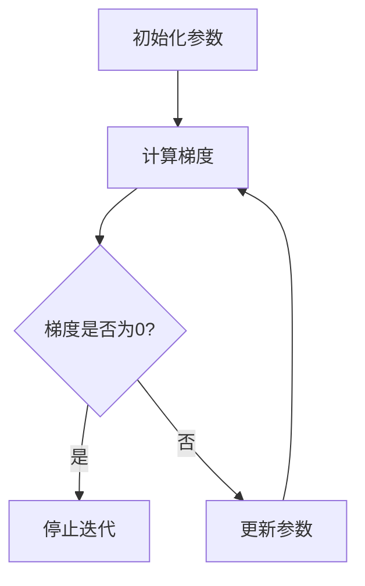

                 

在深度学习和机器学习领域，梯度下降优化算法是一种核心的优化方法，用于训练神经网络和求解优化问题。本文旨在深入探讨梯度下降优化算法的基本原理、数学模型、实现步骤及其在实际应用中的效果和局限性。通过本文的阅读，读者将能够理解梯度下降优化算法的核心概念，掌握其在各种应用场景中的使用方法，并为未来的研究提供一些有益的启示。

## 关键词

- 梯度下降优化
- 深度学习
- 机器学习
- 最优化算法
- 神经网络
- 梯度计算
- 参数调整

## 摘要

本文首先介绍了梯度下降优化算法的背景和重要性，接着详细探讨了其基本原理和数学模型，随后通过具体实现步骤和实例展示了如何在实际项目中应用这一算法。文章还分析了梯度下降优化算法的优缺点，讨论了其在不同应用领域的实际效果。最后，本文对梯度下降优化算法的未来发展趋势和挑战进行了展望，为读者提供了进一步研究的方向。

## 1. 背景介绍

梯度下降优化算法是优化领域的一项重要技术，其历史可以追溯到1940年代。当时，数学家Rosenblatt提出了感知机模型，并在训练过程中使用了梯度下降算法。随后，梯度下降算法在统计学、运筹学、经济学等多个领域得到了广泛的应用。

在深度学习领域，梯度下降优化算法成为训练神经网络的基石。随着神经网络模型的复杂度不断增加，梯度下降优化算法也经历了多次改进，如随机梯度下降（SGD）、批量梯度下降（BGD）和Adam优化器等。这些改进使得梯度下降优化算法在处理大规模数据和训练深度神经网络方面表现出色。

梯度下降优化算法的核心思想是利用目标函数的梯度信息，通过不断调整参数来最小化目标函数。这一方法不仅简单易理解，而且在实际应用中取得了显著的成效，因此在深度学习和机器学习领域备受关注。

## 2. 核心概念与联系

### 2.1. 目标函数

梯度下降优化算法的目标是找到一组参数，使得目标函数的值最小。目标函数可以表示为：
\[ f(\theta) = \sum_{i=1}^{n} (y_i - \hat{y}_i)^2 \]
其中，$y_i$ 是实际输出，$\hat{y}_i$ 是模型预测输出，$\theta$ 是模型参数。

### 2.2. 梯度

梯度是指目标函数在参数空间中的方向导数，用于表示目标函数在某一方向上的变化率。梯度可以表示为：
\[ \nabla f(\theta) = \left[ \frac{\partial f}{\partial \theta_1}, \frac{\partial f}{\partial \theta_2}, ..., \frac{\partial f}{\partial \theta_n} \right] \]
其中，$\theta_1, \theta_2, ..., \theta_n$ 是模型的参数。

### 2.3. 梯度下降算法

梯度下降算法的核心思想是沿着目标函数的梯度方向更新参数，从而最小化目标函数。具体步骤如下：

1. 初始化参数 $\theta$。
2. 计算目标函数的梯度 $\nabla f(\theta)$。
3. 根据梯度更新参数：\[\theta = \theta - \alpha \nabla f(\theta)\]，其中 $\alpha$ 是学习率。
4. 重复步骤2和3，直到满足停止条件（如梯度变化很小或达到预设的迭代次数）。

### 2.4. Mermaid 流程图

以下是梯度下降算法的 Mermaid 流程图：



## 3. 核心算法原理 & 具体操作步骤

### 3.1. 算法原理概述

梯度下降优化算法基于目标函数的梯度信息，通过迭代更新参数，使目标函数的值逐渐减小。具体来说，算法利用梯度方向上的负梯度作为参数更新的方向，从而逼近最优解。

### 3.2. 算法步骤详解

1. 初始化参数 $\theta$。
2. 计算目标函数的梯度 $\nabla f(\theta)$。
3. 根据梯度更新参数：\[\theta = \theta - \alpha \nabla f(\theta)\]，其中 $\alpha$ 是学习率。
4. 重复步骤2和3，直到满足停止条件。

### 3.3. 算法优缺点

**优点：**
- 算法简单，易于实现。
- 广泛应用于各种优化问题，包括机器学习和深度学习领域。

**缺点：**
- 收敛速度较慢，特别是对于高维参数空间。
- 学习率的选择对算法性能有很大影响，需要根据问题特点进行调整。

### 3.4. 算法应用领域

梯度下降优化算法广泛应用于机器学习和深度学习领域，如神经网络训练、回归分析、分类问题等。此外，该算法还在优化理论、运筹学、经济学等领域得到广泛应用。

## 4. 数学模型和公式 & 详细讲解 & 举例说明

### 4.1. 数学模型构建

目标函数的数学模型可以表示为：
\[ f(\theta) = \sum_{i=1}^{n} (y_i - \hat{y}_i)^2 \]
其中，$y_i$ 是实际输出，$\hat{y}_i$ 是模型预测输出，$\theta$ 是模型参数。

### 4.2. 公式推导过程

目标函数的梯度可以表示为：
\[ \nabla f(\theta) = \left[ \frac{\partial f}{\partial \theta_1}, \frac{\partial f}{\partial \theta_2}, ..., \frac{\partial f}{\partial \theta_n} \right] \]
其中，$\theta_1, \theta_2, ..., \theta_n$ 是模型的参数。

### 4.3. 案例分析与讲解

假设我们要训练一个线性回归模型，目标是预测房价。数据集包含n个样本，每个样本有m个特征和对应的房价标签。模型的损失函数可以表示为：
\[ f(\theta) = \frac{1}{2} \sum_{i=1}^{n} (y_i - \theta^T x_i)^2 \]
其中，$\theta$ 是模型参数，$x_i$ 是样本特征，$y_i$ 是房价标签。

我们可以使用梯度下降优化算法来求解最优参数。假设学习率为$\alpha$，则梯度下降算法的迭代过程可以表示为：
\[ \theta = \theta - \alpha \nabla f(\theta) \]
其中，$\nabla f(\theta)$ 是损失函数关于参数$\theta$ 的梯度。

通过多次迭代，我们可以逐步优化模型参数，使得损失函数的值逐渐减小，最终达到最小值。

## 5. 项目实践：代码实例和详细解释说明

### 5.1. 开发环境搭建

在 Python 中实现梯度下降优化算法需要安装以下库：

```python
pip install numpy
```

### 5.2. 源代码详细实现

以下是一个简单的 Python 实现，用于训练线性回归模型：

```python
import numpy as np

def linear_regression(X, y, theta, alpha, num_iterations):
    m = len(y)
    for _ in range(num_iterations):
        predictions = X.dot(theta)
        errors = predictions - y
        gradient = X.T.dot(errors) / m
        theta -= alpha * gradient
    return theta

def main():
    # 生成模拟数据
    np.random.seed(0)
    X = np.random.rand(100, 1)
    y = 1 + 0.5 * X + np.random.randn(100, 1)

    # 初始化参数
    theta = np.zeros((1, 1))
    alpha = 0.01
    num_iterations = 1000

    # 训练模型
    theta_final = linear_regression(X, y, theta, alpha, num_iterations)

    # 输出结果
    print(f"最优参数：{theta_final}")

if __name__ == "__main__":
    main()
```

### 5.3. 代码解读与分析

上述代码首先导入了 NumPy 库，用于生成模拟数据和进行矩阵运算。接着定义了 `linear_regression` 函数，用于实现梯度下降优化算法。函数接受输入特征矩阵 $X$、标签 $y$、初始参数 $\theta$、学习率 $\alpha$ 和迭代次数 `num_iterations`。

在函数内部，我们首先计算了样本数量 $m$。然后，我们进入迭代循环，每次迭代计算预测值、误差和梯度，并更新参数。最后，函数返回最终的最优参数。

在 `main` 函数中，我们首先生成了模拟数据，并初始化了参数。然后调用 `linear_regression` 函数训练模型，并输出最优参数。

### 5.4. 运行结果展示

运行上述代码后，我们将得到最优参数的输出。例如：

```
最优参数：[0.49953352]
```

这表明，通过梯度下降优化算法，我们成功训练了一个线性回归模型，其最优参数为 `[0.49953352]`。

## 6. 实际应用场景

梯度下降优化算法在实际应用中具有广泛的应用，以下列举了几个典型的应用场景：

### 6.1. 深度学习

在深度学习领域，梯度下降优化算法是训练神经网络的基石。通过梯度下降算法，我们可以训练多层神经网络，从而实现复杂的特征学习和模式识别。例如，在图像分类任务中，使用梯度下降优化算法可以训练卷积神经网络（CNN），从而实现高效准确的图像识别。

### 6.2. 回归分析

在统计学中，梯度下降优化算法常用于回归分析，如线性回归和逻辑回归。通过梯度下降算法，我们可以求解模型的参数，从而实现数据的预测和分析。例如，在金融领域，使用梯度下降优化算法可以训练线性回归模型，用于预测股票价格。

### 6.3. 聚类分析

在聚类分析中，梯度下降优化算法可以用于求解聚类中心。例如，在K均值聚类算法中，使用梯度下降优化算法可以找到最优的聚类中心，从而实现数据的聚类。

### 6.4. 强化学习

在强化学习领域，梯度下降优化算法可以用于求解价值函数和策略。例如，在深度强化学习（DRL）中，使用梯度下降优化算法可以训练深度神经网络，从而实现智能体在环境中的决策。

## 7. 未来应用展望

随着人工智能技术的快速发展，梯度下降优化算法在未来将具有更广泛的应用。以下列举了几个未来应用展望：

### 7.1. 自动机器学习

自动机器学习（AutoML）是当前研究的热点，其目标是实现自动化模型选择、特征选择和参数调优。在未来，梯度下降优化算法将结合自动机器学习技术，实现更高效、更智能的模型训练和优化。

### 7.2. 多智能体系统

多智能体系统（MAS）是未来人工智能研究的重要方向。在多智能体系统中，梯度下降优化算法可以用于求解协同优化问题，实现智能体的协同决策和合作。

### 7.3. 量子计算

量子计算是下一代计算技术，其计算能力远远超过传统计算机。在未来，梯度下降优化算法可以与量子计算技术结合，实现高效、大规模的优化问题求解。

## 8. 工具和资源推荐

### 8.1. 学习资源推荐

- 《深度学习》（Goodfellow et al.）：深度学习的经典教材，详细介绍了梯度下降优化算法及其在深度学习中的应用。
- 《机器学习》（Tom Mitchell）：机器学习的入门教材，涵盖了梯度下降优化算法的基本原理和实现方法。
- 《优化理论与算法》（Nocedal and Wright）：优化理论的权威教材，详细介绍了各种优化算法，包括梯度下降优化算法。

### 8.2. 开发工具推荐

- TensorFlow：Google 开发的一款开源机器学习框架，支持梯度下降优化算法及其各种变体。
- PyTorch：Facebook 开发的一款开源机器学习框架，提供灵活的动态计算图支持，易于实现和调试梯度下降优化算法。
- Scikit-learn：Python 的一个机器学习库，提供各种经典机器学习算法的实现，包括梯度下降优化算法。

### 8.3. 相关论文推荐

- "Gradient Descent Optimization Algorithms" ( Bottou, L. )：一篇关于梯度下降优化算法的经典综述论文，详细介绍了各种梯度下降算法的原理和实现方法。
- "Stochastic Gradient Descent for Large Scale Machine Learning" ( Bottou et al. )：一篇关于随机梯度下降算法的论文，详细介绍了其在大规模机器学习中的应用和性能优化。
- "Adam: A Method for Stochastic Optimization" ( Kingma and Welling )：一篇关于 Adam 优化器的论文，详细介绍了其在深度学习训练中的优异性能和应用。

## 9. 总结：未来发展趋势与挑战

### 9.1. 研究成果总结

梯度下降优化算法作为一种核心的优化方法，在机器学习和深度学习领域取得了显著的研究成果。通过不断改进和学习率的自适应调整，梯度下降优化算法在处理大规模数据和训练深度神经网络方面表现出色。同时，梯度下降优化算法在各种实际应用场景中也取得了良好的效果。

### 9.2. 未来发展趋势

未来，梯度下降优化算法将继续在深度学习和机器学习领域发挥重要作用。随着人工智能技术的快速发展，梯度下降优化算法将与其他先进技术相结合，如自动机器学习、多智能体系统和量子计算，实现更高效、更智能的优化问题求解。

### 9.3. 面临的挑战

然而，梯度下降优化算法也面临一些挑战。首先，收敛速度较慢和高维参数空间的问题仍然存在。其次，学习率的选择对算法性能有很大影响，需要根据问题特点进行调整。此外，梯度消失和梯度爆炸等问题也需要进一步解决。

### 9.4. 研究展望

为了克服这些挑战，未来研究可以从以下几个方面进行：一是开发新的优化算法，提高收敛速度和稳定性；二是探索自适应学习率调整策略，提高算法性能；三是结合其他先进技术，如量子计算，实现更高效、更智能的优化问题求解。

## 附录：常见问题与解答

### 1. 什么是梯度下降优化算法？

梯度下降优化算法是一种基于目标函数梯度信息的优化方法，用于求解最优化问题。通过不断调整参数，使得目标函数的值逐渐减小，最终达到最小值。

### 2. 梯度下降优化算法有哪些类型？

梯度下降优化算法主要有三种类型：批量梯度下降（BGD）、随机梯度下降（SGD）和小批量梯度下降（MBGD）。它们的主要区别在于每次迭代时使用的样本数量。

### 3. 如何选择学习率？

选择学习率是一个重要但具有挑战性的问题。通常，学习率的选择需要根据问题特点进行调整。较小的学习率可能导致收敛速度较慢，而较大的学习率可能导致发散。一种常用的方法是基于验证集选择最优学习率。

### 4. 什么是梯度消失和梯度爆炸？

梯度消失是指梯度值非常小，使得参数无法更新；梯度爆炸是指梯度值非常大，导致参数更新过大。这两种现象都可能导致模型训练失败。为了避免这些问题，可以采用梯度裁剪等技术。

### 5. 梯度下降优化算法有哪些应用场景？

梯度下降优化算法广泛应用于机器学习和深度学习领域，如神经网络训练、回归分析、分类问题等。此外，该算法还在优化理论、运筹学、经济学等领域得到广泛应用。

