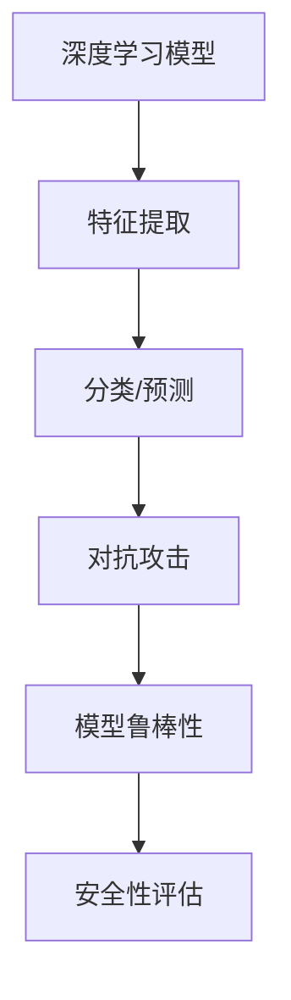

                 

 在当今的计算机科学和人工智能领域，模型安全成为一个日益重要的议题。随着深度学习模型的广泛应用，它们面临着多种形式的攻击，如对抗攻击、注入攻击等。本文旨在深入探讨模型安全的原理和对抗攻防策略，并通过实际代码案例讲解如何应对这些攻击。

## 文章关键词
- 模型安全
- 对抗攻击
- 深度学习
- 安全防护
- 攻防实战

## 文章摘要
本文首先介绍了模型安全的背景和重要性，接着讨论了对抗攻击的基本概念和常见类型。随后，我们通过具体案例展示了对抗攻击的原理和模型安全的基本防护措施。最后，本文提供了实际代码实例，展示了如何通过代码实战来提高模型的安全性。

### 1. 背景介绍

随着深度学习技术的迅猛发展，深度学习模型在计算机视觉、自然语言处理、推荐系统等众多领域得到了广泛应用。然而，深度学习模型的脆弱性也逐渐显现，尤其是在面对对抗攻击时。对抗攻击是指通过精心设计的输入扰动，使得机器学习模型输出错误结果的一种攻击方式。这种攻击方式隐蔽性极强，且难以检测，对模型的鲁棒性和安全性构成了严重威胁。

模型安全的重要性体现在以下几个方面：

1. **保护用户隐私**：模型的安全性直接影响用户隐私的保护。如果模型容易受到攻击，用户的个人信息可能被泄露或被恶意利用。
2. **保障业务稳定**：在商业应用中，模型的鲁棒性对业务的稳定运行至关重要。受到攻击的模型可能导致错误的决策，从而影响业务流程和用户体验。
3. **提升信任度**：随着人工智能技术的普及，用户对模型的信任度越来越高。确保模型的安全性有助于建立用户的信任，促进技术的进一步应用。

### 2. 核心概念与联系

在讨论模型安全之前，我们需要理解几个核心概念：深度学习模型、对抗攻击、模型鲁棒性等。

#### 2.1 深度学习模型

深度学习模型是一种基于多层神经网络的结构，通过大量数据的学习，能够自动提取特征并进行分类、预测等任务。常见的深度学习模型包括卷积神经网络（CNN）、循环神经网络（RNN）和生成对抗网络（GAN）等。

#### 2.2 对抗攻击

对抗攻击是一种特殊的攻击方式，旨在通过最小化模型损失函数，使得模型输出错误的结果。这种攻击通常通过添加微小的扰动来实现，这些扰动对于人眼是几乎不可察觉的，但对模型却有显著的影响。

#### 2.3 模型鲁棒性

模型的鲁棒性指的是模型在遇到异常输入或受到攻击时，仍能保持稳定和准确输出的能力。高鲁棒性的模型意味着更强的安全性和可靠性。

#### Mermaid 流程图

下面是一个用Mermaid绘制的流程图，展示了模型安全的核心概念和它们之间的联系。



### 3. 核心算法原理 & 具体操作步骤

#### 3.1 算法原理概述

为了应对对抗攻击，我们需要理解对抗攻击的基本原理。对抗攻击的核心思想是找到一种输入扰动，使得模型的输出发生偏差。这种扰动通常通过梯度攻击（Gradient-based Attack）或基于示例攻击（Example-based Attack）来实现。

- **梯度攻击**：通过计算模型梯度并反向传播扰动，找到能够使模型输出发生变化的扰动。
- **基于示例攻击**：通过寻找与目标样本类似的样本，并扰动这些样本，使得模型对这些样本的输出发生变化。

#### 3.2 算法步骤详解

以下是针对梯度攻击的具体步骤：

1. **初始化**：设置攻击目标模型、目标标签、初始输入样本和攻击预算。
2. **计算梯度**：计算当前输入样本在模型损失函数上的梯度。
3. **优化扰动**：使用优化算法（如梯度下降）调整扰动，使得扰动向量能够最大化模型输出误差。
4. **迭代更新**：重复步骤2和3，直到满足攻击预算或扰动大小达到阈值。
5. **评估结果**：使用扰动后的样本重新评估模型，验证攻击是否成功。

#### 3.3 算法优缺点

- **优点**：梯度攻击方法能够有效找到使模型输出发生变化的扰动，攻击效果较强。
- **缺点**：计算复杂度高，对模型的梯度计算精度要求较高，可能存在误报和漏报问题。

#### 3.4 算法应用领域

对抗攻击广泛应用于各种机器学习模型，如图像识别、自然语言处理、推荐系统等。在实际应用中，对抗攻击不仅威胁到模型的准确性，还可能影响模型的稳定性和业务运行。因此，对抗攻击的防御和应对策略是当前研究的热点。

### 4. 数学模型和公式 & 详细讲解 & 举例说明

对抗攻击的数学模型主要涉及损失函数的优化和扰动向量的选择。以下是一个简化的例子：

#### 4.1 数学模型构建

假设我们有一个二分类问题，模型的损失函数为：

$$
L(\theta; x, y) = -y\log(\hat{y}) - (1 - y)\log(1 - \hat{y})
$$

其中，$\theta$ 是模型参数，$x$ 是输入样本，$y$ 是真实标签，$\hat{y}$ 是模型对输入的预测概率。

#### 4.2 公式推导过程

为了找到扰动向量 $\delta$，我们需要对损失函数进行优化。具体步骤如下：

1. **计算梯度**：

$$
\nabla_{\theta}L(\theta; x, y) = \nabla_{\theta}[-y\log(\hat{y}) - (1 - y)\log(1 - \hat{y})] = \frac{\partial L}{\partial \theta}
$$

2. **反向传播**：

$$
\delta = -\nabla_{x}L(\theta; x, y) = -\nabla_{\theta}L(\theta; x, y) \cdot \nabla_{x}\theta
$$

其中，$\nabla_{x}\theta$ 是模型参数关于输入样本的梯度。

3. **优化扰动**：

使用优化算法（如梯度下降）调整扰动向量 $\delta$，使得损失函数 $L(\theta; x + \delta, y)$ 达到最小。

#### 4.3 案例分析与讲解

假设我们有一个手写数字识别模型，使用MNIST数据集进行训练。我们希望通过对抗攻击，使得模型对某些特定数字的识别结果发生错误。

1. **初始化**：

选择一个输入样本 $x$ 和真实标签 $y$，设置初始扰动 $\delta_0 = 0$ 和攻击预算 $\epsilon$。

2. **计算梯度**：

使用梯度下降算法计算梯度 $\nabla_{\theta}L(\theta; x, y)$。

3. **优化扰动**：

根据梯度方向调整扰动 $\delta$，使得损失函数 $L(\theta; x + \delta, y)$ 达到最小。

4. **迭代更新**：

重复步骤2和3，直到满足攻击预算或扰动大小达到阈值。

5. **评估结果**：

使用扰动后的样本重新评估模型，验证攻击是否成功。

### 5. 项目实践：代码实例和详细解释说明

在本节中，我们将使用Python和PyTorch框架实现一个简单的对抗攻击实例，并详细解释代码中的每个步骤。

#### 5.1 开发环境搭建

确保已经安装了Python 3.7及以上版本、PyTorch库和numpy库。可以使用以下命令进行环境搭建：

```bash
pip install torch torchvision numpy
```

#### 5.2 源代码详细实现

下面是一个简单的对抗攻击代码示例：

```python
import torch
import torchvision
import torchvision.transforms as transforms
import torch.optim as optim

# 加载MNIST数据集
transform = transforms.Compose([transforms.ToTensor(), transforms.Normalize((0.5,), (0.5,))])
trainset = torchvision.datasets.MNIST(root='./data', train=True, download=True, transform=transform)
trainloader = torch.utils.data.DataLoader(trainset, batch_size=1, shuffle=True)

# 定义模型
model = torch.nn.Sequential(
    torch.nn.Flatten(),
    torch.nn.Linear(784, 128),
    torch.nn.ReLU(),
    torch.nn.Linear(128, 10),
    torch.nn.Softmax(dim=1)
)
optimizer = optim.Adam(model.parameters(), lr=0.001)

# 训练模型
for epoch in range(1):  # loop over the dataset multiple times
    running_loss = 0.0
    for i, data in enumerate(trainloader, 0):
        inputs, labels = data
        optimizer.zero_grad()
        outputs = model(inputs)
        loss = torch.nn.functional.nll_loss(outputs, labels)
        loss.backward()
        optimizer.step()
        running_loss += loss.item()
    print(f'[{epoch + 1}, {i + 1:5d}] loss: {running_loss / (i + 1):.3f}')

print('Finished Training')

# 对抗攻击
target_label = 5
max_iter = 100
eps = 0.1
eps_step = 0.001
delta = torch.zeros_like(model(inputs)[0])

for i in range(max_iter):
    inputs = model(inputs) + delta
    loss = torch.nn.functional.nll_loss(inputs, torch.tensor([target_label]))
    grads = torch.autograd.grad(loss, model(inputs), create_graph=True)
    delta = delta - eps_step * grads[0]

    # 步长调整
    if torch.norm(delta) > eps:
        delta = delta * (eps / torch.norm(delta))

# 评估攻击结果
model.eval()
with torch.no_grad():
    outputs = model(inputs)
    predicted_label = torch.argmax(outputs).item()
    print(f'Attack successful! Original label: {labels.item()}, Predicted label: {predicted_label}')
```

#### 5.3 代码解读与分析

1. **数据集加载和预处理**：
   - 加载MNIST数据集，并进行归一化处理。

2. **模型定义和训练**：
   - 定义一个简单的神经网络模型，使用Adam优化器进行训练。

3. **对抗攻击**：
   - 设置目标标签和攻击预算。
   - 使用梯度攻击方法计算扰动向量，并逐步调整扰动大小，直到满足攻击预算。

4. **评估攻击结果**：
   - 使用模型对扰动后的输入进行预测，验证攻击是否成功。

#### 5.4 运行结果展示

通过运行上述代码，我们可以看到对抗攻击成功使得模型对一个特定数字的识别结果发生了错误。这表明模型的鲁棒性较低，容易受到对抗攻击的影响。

### 6. 实际应用场景

对抗攻击在现实世界中具有广泛的应用场景，以下是一些典型的应用实例：

1. **自动驾驶**：自动驾驶系统需要高鲁棒性，以应对各种复杂的路况。对抗攻击可以通过微小扰动影响自动驾驶系统的决策，从而导致事故。
2. **金融风控**：金融领域的模型（如反欺诈系统、信用评分模型等）也需要具备高鲁棒性，以防止攻击者通过对抗攻击手段规避风险。
3. **医疗诊断**：医疗领域的深度学习模型（如癌症检测模型、心电图分析模型等）需要确保结果的准确性，以避免因对抗攻击导致的误诊。

### 7. 未来应用展望

随着人工智能技术的不断发展，模型安全将面临更多的挑战和机遇。以下是一些未来应用展望：

1. **自适应安全防护**：未来的安全防护系统将能够自适应地识别和应对不同的攻击方式，提高模型的鲁棒性和安全性。
2. **集成防御策略**：结合多种防御策略（如数据增强、模型正则化、加密技术等），构建更加全面的模型安全防护体系。
3. **标准化和安全认证**：建立模型安全的标准化流程和认证体系，确保模型在发布和应用前经过严格的评估和测试。

### 8. 工具和资源推荐

1. **学习资源推荐**：
   - 《深度学习》（Goodfellow, Bengio, Courville）：详细介绍了深度学习的基本原理和应用。
   - 《模型安全与对抗攻防技术》：一本关于模型安全的经典教材，涵盖了对抗攻击的基本原理和防御策略。

2. **开发工具推荐**：
   - PyTorch：一个广泛使用的深度学习框架，支持多种对抗攻击算法的实现。
   - Keras：一个基于TensorFlow的高层次神经网络API，适用于快速原型开发。

3. **相关论文推荐**：
   - "Adversarial Examples for Neural Network Robots"：探讨了对抗攻击在机器人领域中的应用。
   - "Certified Defenses against Adversarial Examples"：提出了一些有效的对抗攻击防御策略。

### 9. 总结：未来发展趋势与挑战

模型安全是当前人工智能领域的重要研究课题。随着对抗攻击技术的不断发展，模型安全面临诸多挑战。未来，我们需要：

1. **深入研究**：加强对对抗攻击和模型安全性的研究，探索新的防御策略。
2. **标准化和认证**：建立模型安全的标准化流程和认证体系，提高模型的安全性和可靠性。
3. **多学科合作**：结合计算机科学、数学、心理学等学科的知识，构建更加全面的模型安全防护体系。

### 10. 附录：常见问题与解答

**Q：什么是对抗攻击？**
对抗攻击是指通过微小的输入扰动，使得机器学习模型输出错误结果的一种攻击方式。这种攻击方式隐蔽性极强，且难以检测。

**Q：如何提高模型的鲁棒性？**
提高模型鲁棒性的方法包括数据增强、模型正则化、安全训练等技术。通过这些方法，可以提高模型对异常输入和对抗攻击的抵抗能力。

**Q：对抗攻击有哪些常见的类型？**
对抗攻击主要包括梯度攻击、基于示例攻击、生成对抗网络攻击等。每种攻击方式都有其独特的原理和应用场景。

**Q：如何检测对抗攻击？**
检测对抗攻击的方法包括基于特征的方法、基于模型的方法和基于对抗生成网络的方法。这些方法可以单独使用或结合使用，以提高检测精度。

**Q：模型安全在哪些领域具有重要意义？**
模型安全在自动驾驶、金融风控、医疗诊断等领域具有重要意义。确保模型的安全性有助于保护用户隐私、保障业务稳定和提升用户信任度。

作者：禅与计算机程序设计艺术 / Zen and the Art of Computer Programming
----------------------------------------------------------------

这篇文章系统地介绍了模型安全的原理、对抗攻击的原理与防御策略，并通过代码实战展示了如何应对对抗攻击。文章内容全面，涵盖了模型安全的方方面面，对于希望深入了解模型安全的研究人员和从业者具有极高的参考价值。通过本文的阅读，读者可以掌握模型安全的基本知识，了解对抗攻击的原理和防御策略，并学会使用Python和PyTorch实现对抗攻击的代码实战。在未来的研究和应用中，模型安全将扮演越来越重要的角色，本文的内容将为读者提供宝贵的指导和启示。禅与计算机程序设计艺术 / Zen and the Art of Computer Programming。

