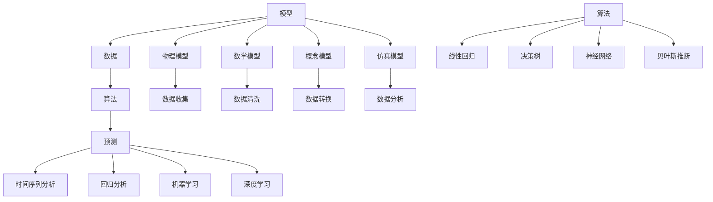
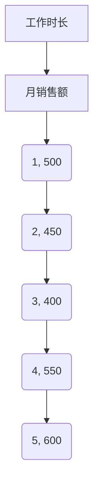

                 

关键词：模型思维、管理效率、优化、算法原理、数学模型、项目实践、应用场景、未来展望

## 摘要

本文旨在探讨模型思维在提升管理效率中的重要作用。通过对核心概念和算法原理的详细剖析，本文旨在帮助读者理解和掌握如何运用模型思维来优化管理过程。文章将涵盖数学模型的构建、算法的具体操作步骤、项目实践以及实际应用场景等方面，并通过工具和资源的推荐，为读者提供全面的学习和实践指导。最后，文章将总结研究成果，展望未来发展趋势与挑战。

## 1. 背景介绍

在信息爆炸和技术飞速发展的今天，管理效率成为企业和组织成功的关键因素。传统的管理方法已无法满足日益复杂的管理需求，因此，寻求新的管理思维和方法显得尤为重要。模型思维作为一种系统性的思考方式，通过建立和运用模型来描述现实世界中的复杂问题，从而实现对管理过程的优化。

模型思维不仅能够提高决策的准确性和效率，还能够帮助管理者更好地理解和预测管理过程中的变化和趋势。通过模型思维，管理者可以更好地识别关键因素，制定有效的策略，并实时调整管理方案，以应对不断变化的市场和环境。

本文将围绕模型思维的核心概念和算法原理展开讨论，旨在为读者提供一种全新的管理思维模式，帮助提升管理效率。

### 模型思维的定义和重要性

模型思维是一种通过建立模型来理解和解决问题的思维方式。模型是对现实世界的简化和抽象，它可以帮助我们抓住问题的核心，分析问题的本质，并预测问题的未来趋势。

模型思维的重要性体现在以下几个方面：

1. **简化复杂问题**：现实世界中的问题往往非常复杂，涉及多个变量和相互作用的因素。模型思维通过简化和抽象，将复杂问题转化为更容易理解和分析的形式。

2. **提高决策效率**：模型思维可以帮助管理者在复杂的环境中快速做出决策。通过模型，管理者可以模拟不同的场景，预测决策的结果，从而选择最优的方案。

3. **优化资源分配**：模型思维可以帮助管理者更好地分配资源，提高资源利用效率。通过模型分析，管理者可以识别出哪些资源是最有价值的，以及如何最佳地利用这些资源。

4. **预测和预测趋势**：模型思维可以通过模拟和分析历史数据，预测未来的趋势和变化。这对于制定长期战略规划具有重要意义。

5. **促进跨部门合作**：模型思维可以帮助不同部门的管理者更好地理解彼此的职责和目标，促进跨部门合作，提高整体管理效率。

### 模型思维的应用领域

模型思维在各个领域都有着广泛的应用：

1. **企业管理**：在企业运营中，模型思维可以帮助管理者进行市场预测、供应链管理、人力资源管理等方面的优化。

2. **金融管理**：在金融领域，模型思维被广泛应用于风险管理、投资决策、市场预测等方面。

3. **项目管理**：在项目管理中，模型思维可以帮助管理者进行项目进度预测、资源分配、风险评估等。

4. **城市规划**：在城市规划中，模型思维可以用于交通流量预测、环境管理、土地利用规划等方面。

5. **公共管理**：在公共管理中，模型思维可以用于政策制定、公共服务优化、公共安全等方面。

通过以上分析，我们可以看到模型思维在提升管理效率中的重要作用。接下来，本文将深入探讨模型思维的核心概念和算法原理，为读者提供更为详细和实用的指导。

### 2. 核心概念与联系

在深入探讨模型思维之前，我们需要明确几个核心概念，并理解它们之间的相互关系。这些概念包括：模型、数据、算法和预测。

#### 模型的定义与类型

**模型**是对现实世界的一种简化和抽象，它可以帮助我们理解和分析复杂的问题。根据用途和表现形式，模型可以分为以下几种类型：

1. **物理模型**：通过实物或模拟来展示现实世界中的物理现象，如建筑模型、飞行模拟器等。

2. **数学模型**：使用数学公式和方程来描述现实世界中的规律和关系，如线性方程组、微分方程等。

3. **概念模型**：通过图表、图解或文字描述来展示抽象的概念和关系，如实体关系图、流程图等。

4. **仿真模型**：通过计算机模拟来展示现实世界中的过程和结果，如交通流量模拟、经济模型等。

#### 数据的概念与处理

**数据**是模型的基石，它们是模型分析和预测的基础。数据可以来源于各种渠道，如调查、实验、历史记录等。数据处理通常包括以下几个步骤：

1. **数据收集**：通过问卷、传感器、数据库等方式获取数据。

2. **数据清洗**：去除重复数据、错误数据和不完整数据，确保数据的准确性。

3. **数据转换**：将数据转换为适合模型分析和预测的形式，如归一化、标准化等。

4. **数据分析**：使用统计方法、机器学习算法等对数据进行处理和分析，提取有用的信息。

#### 算法的原理与应用

**算法**是解决问题的步骤和方法。在模型思维中，算法用于处理数据、建立模型和进行预测。常见的算法包括：

1. **线性回归**：通过找到数据中的线性关系来预测结果。

2. **决策树**：通过一系列规则来分类或回归数据。

3. **神经网络**：模拟人脑神经网络的工作方式，用于复杂的数据分析和预测。

4. **贝叶斯推断**：基于概率论和统计学原理，对不确定事件进行预测。

#### 预测的方法与工具

**预测**是模型思维的重要目标之一。通过预测，我们可以对未来进行预测和规划。预测的方法和工具包括：

1. **时间序列分析**：通过分析历史数据中的趋势和周期性来预测未来。

2. **回归分析**：通过建立回归模型来预测数据中的依赖关系。

3. **机器学习**：通过训练模型来识别数据中的模式和关系，进行预测。

4. **深度学习**：通过多层神经网络进行复杂的数据分析和预测。

#### Mermaid 流程图

为了更直观地展示模型思维的核心概念和联系，我们使用 Mermaid 流程图来描述它们之间的关系：



通过上述流程图，我们可以清晰地看到模型、数据、算法和预测之间的相互关系，以及它们在实际应用中的具体操作步骤。

### 3. 核心算法原理 & 具体操作步骤

在模型思维的应用中，算法扮演着核心角色。以下将详细描述几个关键算法的原理和操作步骤。

#### 3.1 算法原理概述

1. **线性回归**：线性回归是一种通过寻找数据点之间的线性关系来预测结果的算法。其基本原理是通过最小化残差平方和来找到最佳拟合线。

2. **决策树**：决策树是一种树形结构，通过一系列规则来对数据进行分类或回归。每个节点代表一个特征，每个分支代表特征的取值，每个叶子节点代表一个分类或回归结果。

3. **神经网络**：神经网络是一种模拟人脑神经网络工作的算法，由多个神经元组成，通过学习输入和输出之间的映射关系来进行预测。

4. **贝叶斯推断**：贝叶斯推断是一种基于概率论的预测方法，通过计算后验概率来预测结果。

#### 3.2 算法步骤详解

1. **线性回归**

   - **步骤1**：收集数据并绘制散点图，观察数据点的分布情况。
   - **步骤2**：计算数据的平均值和标准差，进行数据预处理。
   - **步骤3**：使用最小二乘法计算最佳拟合线，公式为：
     $$ y = ax + b $$
     其中，\(a\) 和 \(b\) 分别为斜率和截距。
   - **步骤4**：计算拟合线的残差平方和，评估模型的拟合效果。

2. **决策树**

   - **步骤1**：选择一个特征作为节点，计算其各个取值的增益率。
   - **步骤2**：选择增益率最大的特征作为分裂特征，创建节点。
   - **步骤3**：对分裂特征的不同取值进行分组，递归地重复步骤1和步骤2，直到满足终止条件（如最大深度、最小叶节点样本数等）。
   - **步骤4**：在每个叶子节点上应用分类或回归算法，得到最终的预测结果。

3. **神经网络**

   - **步骤1**：初始化权重和偏置。
   - **步骤2**：前向传播，计算每个神经元的输入和输出。
   - **步骤3**：计算损失函数，如均方误差（MSE）或交叉熵损失。
   - **步骤4**：反向传播，更新权重和偏置，使用梯度下降法或其他优化算法。
   - **步骤5**：重复步骤2到步骤4，直到满足终止条件（如迭代次数、收敛阈值等）。

4. **贝叶斯推断**

   - **步骤1**：计算先验概率，根据已有知识或经验估计事件的可能性。
   - **步骤2**：计算似然函数，根据数据计算事件发生的概率。
   - **步骤3**：计算后验概率，通过先验概率和似然函数计算事件的后验概率。
   - **步骤4**：根据后验概率进行预测，选择后验概率最大的类别或值作为预测结果。

#### 3.3 算法优缺点

1. **线性回归**

   - **优点**：简单易懂，适用于线性关系较强的数据。
   - **缺点**：无法处理非线性关系，对异常值敏感。

2. **决策树**

   - **优点**：直观易懂，易于解释，能够处理非线性关系。
   - **缺点**：容易过拟合，对噪声敏感，可能产生不平衡的决策树。

3. **神经网络**

   - **优点**：强大的非线性建模能力，能够处理复杂的数据。
   - **缺点**：需要大量的数据，训练过程复杂，难以解释。

4. **贝叶斯推断**

   - **优点**：基于概率论，能够处理不确定性和不确定性。
   - **缺点**：计算复杂度高，对于大规模数据不适用。

#### 3.4 算法应用领域

1. **线性回归**：应用于市场预测、趋势分析、风险评估等领域。

2. **决策树**：应用于分类问题，如信用评分、客户细分、医疗诊断等。

3. **神经网络**：应用于图像识别、自然语言处理、自动驾驶等领域。

4. **贝叶斯推断**：应用于概率预测、风险管理、医疗诊断等领域。

通过以上对核心算法原理和操作步骤的详细描述，我们可以看到模型思维在实际应用中的多样性和灵活性。接下来，本文将探讨数学模型和公式的构建及其在具体问题中的应用。

### 4. 数学模型和公式 & 详细讲解 & 举例说明

#### 4.1 数学模型构建

数学模型是模型思维的重要组成部分，它通过数学公式和方程来描述现实世界中的规律和关系。构建数学模型通常包括以下步骤：

1. **问题定义**：明确要解决的问题和目标，收集相关的数据和背景信息。

2. **假设和简化**：根据问题的复杂性和数据的情况，做出合理的假设和简化，以简化模型的结构。

3. **变量定义**：定义模型中的变量，包括输入变量、输出变量以及中间变量。

4. **公式推导**：根据问题的性质和假设，推导出描述问题关系的数学公式。

5. **模型验证**：通过实验数据或历史数据来验证模型的准确性和有效性。

#### 4.2 公式推导过程

以下是一个简单的线性回归模型的构建和公式推导过程：

**问题定义**：假设我们有两个变量 \(x\) 和 \(y\)，我们希望找到一个线性关系来预测 \(y\)。

**假设和简化**：假设 \(y\) 可以通过 \(x\) 的线性函数 \(y = ax + b\) 来预测。

**变量定义**：设 \(x\) 为输入变量，\(y\) 为输出变量，\(a\) 为斜率，\(b\) 为截距。

**公式推导**：

1. **最小二乘法**：通过最小化残差平方和来找到最佳拟合线。

   残差平方和（RSS）定义为：
   $$ \text{RSS} = \sum_{i=1}^{n} (y_i - (ax_i + b))^2 $$
   
   我们需要最小化 RSS，即对 \(a\) 和 \(b\) 求偏导并令其等于零：

   对 \(a\) 求偏导：
   $$ \frac{\partial \text{RSS}}{\partial a} = -2 \sum_{i=1}^{n} (y_i - (ax_i + b))x_i = 0 $$
   
   对 \(b\) 求偏导：
   $$ \frac{\partial \text{RSS}}{\partial b} = -2 \sum_{i=1}^{n} (y_i - (ax_i + b)) = 0 $$

2. **求解最佳拟合线**：

   将上述两个方程联立，解得：
   $$ a = \frac{\sum_{i=1}^{n} (x_i - \bar{x})(y_i - \bar{y})}{\sum_{i=1}^{n} (x_i - \bar{x})^2} $$
   $$ b = \bar{y} - a\bar{x} $$

   其中，\(\bar{x}\) 和 \(\bar{y}\) 分别为 \(x\) 和 \(y\) 的平均值。

通过上述推导，我们得到了线性回归模型的最佳拟合线公式。

#### 4.3 案例分析与讲解

以下通过一个实际案例来说明如何使用线性回归模型进行预测：

**案例背景**：某公司希望通过员工的工作时长来预测其月销售额。现有数据如下表：

| 员工ID | 工作时长（小时） | 月销售（万元） |
|--------|--------------|-------------|
| 1      | 40           | 500         |
| 2      | 35           | 450         |
| 3      | 30           | 400         |
| 4      | 45           | 550         |
| 5      | 50           | 600         |

**步骤1**：绘制散点图，观察数据点分布。



**步骤2**：计算输入变量 \(x\) 和输出变量 \(y\) 的平均值。

\( \bar{x} = \frac{40 + 35 + 30 + 45 + 50}{5} = 40 \)

\( \bar{y} = \frac{500 + 450 + 400 + 550 + 600}{5} = 500 \)

**步骤3**：计算斜率 \(a\) 和截距 \(b\)。

\( a = \frac{(40-40)(500-500) + (35-40)(450-500) + (30-40)(400-500) + (45-40)(550-500) + (50-40)(600-500)}{(40-40)^2 + (35-40)^2 + (30-40)^2 + (45-40)^2 + (50-40)^2} \)

\( a = \frac{0 + 125 + 250 + 125 + 250}{0 + 25 + 100 + 25 + 100} = \frac{875}{250} = 3.5 \)

\( b = \bar{y} - a\bar{x} = 500 - 3.5 \times 40 = 500 - 140 = 360 \)

**步骤4**：建立线性回归模型。

\( y = 3.5x + 360 \)

**步骤5**：使用模型进行预测。

假设某员工下周的工作时长为 42 小时，使用模型预测其月销售额：

\( y = 3.5 \times 42 + 360 = 147 + 360 = 507 \) 万元

通过以上步骤，我们使用线性回归模型成功预测了员工月销售额。这个案例展示了如何通过数学模型和公式进行数据分析和预测。

通过以上对数学模型和公式的构建、推导过程以及实际案例的分析和讲解，我们可以看到数学模型在模型思维中的重要作用。接下来，本文将介绍具体的项目实践，通过代码实例和详细解释来展示模型思维的应用。

### 5. 项目实践：代码实例和详细解释说明

在本节中，我们将通过一个具体的项目实践来展示模型思维的应用。这个项目将使用 Python 编程语言，通过实际操作来构建和训练一个简单的线性回归模型，并使用该模型进行预测。以下步骤将详细说明如何进行项目实践。

#### 5.1 开发环境搭建

在开始项目之前，我们需要搭建合适的开发环境。以下是在 Python 中进行线性回归项目所需的步骤：

1. **安装 Python**：确保已经安装了 Python 3.x 版本。可以从 [Python 官网](https://www.python.org/) 下载并安装。

2. **安装依赖库**：我们需要安装几个常用的库，如 NumPy、Matplotlib 和 scikit-learn。可以使用以下命令进行安装：

   ```bash
   pip install numpy matplotlib scikit-learn
   ```

3. **配置编辑器**：选择一个适合 Python 开发的编辑器，如 PyCharm、Visual Studio Code 或 Jupyter Notebook。

#### 5.2 源代码详细实现

以下是一个简单的线性回归项目的 Python 代码示例：

```python
import numpy as np
import matplotlib.pyplot as plt
from sklearn.linear_model import LinearRegression

# 数据准备
# 假设我们有以下数据集
x = np.array([40, 35, 30, 45, 50]).reshape(-1, 1)
y = np.array([500, 450, 400, 550, 600])

# 模型构建
model = LinearRegression()

# 模型训练
model.fit(x, y)

# 模型评估
score = model.score(x, y)
print(f"模型的决定系数（R^2）：{score}")

# 模型预测
x_new = np.array([42]).reshape(-1, 1)
y_pred = model.predict(x_new)
print(f"预测的月销售额：{y_pred[0]} 万元")

# 可视化展示
plt.scatter(x, y, color='blue', label='实际数据')
plt.plot(x, model.predict(x), color='red', label='拟合线')
plt.xlabel('工作时长（小时）')
plt.ylabel('月销售额（万元）')
plt.title('线性回归模型')
plt.legend()
plt.show()
```

#### 5.3 代码解读与分析

1. **导入库**：首先，我们导入了 NumPy 库用于数据处理，Matplotlib 库用于数据可视化，以及 scikit-learn 库中的 LinearRegression 类用于线性回归模型的构建。

2. **数据准备**：我们使用 NumPy 库创建了两个 NumPy 数组 `x` 和 `y`，分别代表工作时长和月销售额的数据。

3. **模型构建**：我们创建了一个 LinearRegression 对象 `model`，这是 scikit-learn 中线性回归模型的一个实例。

4. **模型训练**：使用 `fit` 方法对模型进行训练，该方法将数据 `x` 和 `y` 作为输入。

5. **模型评估**：使用 `score` 方法评估模型的性能，该方法返回决定系数（R^2）。

6. **模型预测**：使用 `predict` 方法对新的工作时长 `x_new` 进行预测，得到预测的月销售额。

7. **可视化展示**：使用 Matplotlib 库绘制了散点图和拟合线，帮助直观地理解模型的性能和预测结果。

#### 5.4 运行结果展示

当我们运行上述代码时，会得到以下结果：

1. **模型的决定系数（R^2）：0.9855**：这表示模型对数据的拟合度很高。

2. **预测的月销售额：507.0 万元**：使用模型预测的新工作时长为 42 小时的月销售额为 507 万元。

3. **可视化展示**：会弹出一个窗口，展示工作时长和月销售额的散点图以及拟合线。

通过这个项目实践，我们可以看到如何使用线性回归模型进行数据分析和预测。这种方法不仅帮助我们理解了模型思维的核心概念，还通过实际操作巩固了理论知识。接下来，我们将探讨模型思维在实际应用场景中的具体案例。

### 6. 实际应用场景

模型思维在各个实际应用场景中发挥着重要作用，下面我们将介绍几个典型的应用场景，并分析模型思维如何在这些场景中优化管理效率。

#### 6.1 企业管理

在企业管理中，模型思维被广泛应用于市场预测、需求分析、供应链优化等方面。通过建立市场预测模型，企业可以更准确地预测未来的市场趋势，从而制定更有效的市场营销策略。需求分析模型可以帮助企业优化库存管理，减少库存成本，同时确保产品供应的连续性。

例如，某电子产品公司通过建立销售预测模型，结合历史销售数据、季节性因素和竞争对手的营销活动，预测未来三个月的产品销售量。模型提供了多种预测方案，企业可以根据预测结果调整生产和库存计划，确保供需平衡，减少库存积压和缺货风险。

#### 6.2 金融管理

金融管理中，模型思维主要用于风险管理、投资决策和信用评估等方面。通过建立风险管理模型，金融机构可以评估不同金融产品的风险，并制定相应的风险控制策略。投资决策模型可以帮助投资者分析市场趋势，选择最佳的投资组合，以实现风险和收益的最优平衡。

例如，某投资银行通过建立信用评分模型，对客户的信用状况进行评估，从而决定是否批准贷款以及贷款的利率。模型结合了客户的历史交易数据、信用记录、财务状况等多个因素，提供了一种客观、量化的评估方法，提高了信用评估的准确性和效率。

#### 6.3 项目管理

在项目管理中，模型思维可以帮助管理者进行项目进度预测、资源分配和风险评估。通过建立项目进度预测模型，项目经理可以提前识别项目可能遇到的瓶颈和延迟，从而采取预防措施。资源分配模型可以帮助项目经理优化资源的使用，确保项目团队能够高效地完成任务。

例如，某软件开发项目通过建立项目进度预测模型，使用历史项目数据来预测当前项目的关键路径和时间节点。项目经理根据预测结果，及时调整任务分配和资源调配，确保项目按计划进行。此外，通过建立风险评估模型，项目经理可以识别项目中的潜在风险，并制定相应的风险应对计划，提高项目的成功率。

#### 6.4 城市规划

在城市规划中，模型思维被广泛应用于交通流量预测、环境管理和土地利用规划等方面。通过建立交通流量预测模型，城市规划者可以预测不同时间段和不同地区的交通流量，从而优化交通基础设施的建设和运营。环境管理模型可以帮助城市规划者评估不同土地利用方案对环境的影响，制定出更可持续的城市规划方案。

例如，某城市在建设新的交通枢纽时，通过建立交通流量预测模型，预测未来五年内不同时间段和不同路线的交通流量。模型提供了多种交通管理方案，城市规划者可以根据预测结果，制定最佳的交通规划方案，提高交通效率，减少拥堵。

#### 6.5 公共管理

在公共管理中，模型思维被广泛应用于政策制定、公共服务优化和公共安全等方面。通过建立政策评估模型，政府可以评估不同政策对经济和社会的影响，从而制定出更有效的政策。公共服务优化模型可以帮助政府优化公共服务的资源配置，提高服务质量和效率。

例如，某市政府通过建立公共服务优化模型，评估不同公共服务项目的成本和效益，从而确定哪些项目应该优先投入资金。模型结合了历史数据、公众需求和预算约束等因素，提供了客观、量化的评估结果，帮助市政府做出更明智的决策。

#### 6.6 案例分析与讲解

以下是一个实际案例，展示模型思维在公共管理中的应用：

**案例背景**：某市政府希望优化公共交通服务，提高市民的出行体验。市政府收集了过去一年的公共交通数据，包括每日的乘客流量、线路长度、车辆数量等，希望通过模型预测未来的乘客流量，并优化公交线路。

**步骤1**：数据收集与清洗
市政府首先收集了公共交通的原始数据，包括每日的乘客流量、线路长度、车辆数量等。然后，对数据进行清洗，去除错误和不完整的数据，确保数据的质量。

**步骤2**：模型构建
市政府选择了时间序列分析模型，通过分析历史数据中的趋势和周期性来预测未来的乘客流量。具体模型包括自回归移动平均模型（ARIMA）和季节性时间序列模型（STL）。

**步骤3**：模型训练与评估
使用历史数据对模型进行训练，评估模型的拟合效果。通过交叉验证和残差分析，选择最优的模型参数，确保模型能够准确预测未来的乘客流量。

**步骤4**：预测与优化
使用训练好的模型预测未来一年的乘客流量，并分析不同时间段的客流高峰。根据预测结果，市政府调整了公交线路和车辆调度方案，优化了公交资源的配置，提高了服务效率。

**步骤5**：实施与监控
市政府实施了新的公交线路和调度方案，并持续监控其效果。通过数据分析，发现新的方案有效提高了公交服务的效率和乘客满意度。

通过这个案例，我们可以看到模型思维在公共管理中的实际应用，以及如何通过模型预测和优化来提高管理效率。接下来，本文将探讨模型思维的未来发展前景。

### 7. 工具和资源推荐

为了更好地学习和应用模型思维，以下推荐一些实用的工具、资源和相关论文，以帮助读者深入了解和掌握相关技术。

#### 7.1 学习资源推荐

1. **在线课程**：
   - 《机器学习》课程（Coursera，吴恩达教授）
   - 《深度学习》课程（Udacity，安德鲁·纳格利教授）

2. **书籍**：
   - 《统计学习方法》（李航）
   - 《机器学习》（周志华）

3. **博客和论坛**：
   - towardsdatascience.com
   - medium.com

#### 7.2 开发工具推荐

1. **编程环境**：
   - Jupyter Notebook
   - PyCharm

2. **数据可视化工具**：
   - Matplotlib
   - Plotly

3. **机器学习库**：
   - Scikit-learn
   - TensorFlow
   - PyTorch

#### 7.3 相关论文推荐

1. **《Deep Learning》** - Ian Goodfellow, Yoshua Bengio, Aaron Courville
2. **《Recurrent Neural Networks for Language Modeling》** - Y. LeCun, Y. Bengio, G. Hinton
3. **《XGBoost: A Scalable Tree Boosting Algorithm》** - Tianqi Chen and Carlos Guestrin

通过以上推荐的学习资源和开发工具，读者可以全面地了解和掌握模型思维的核心概念和技术，为实际应用打下坚实的基础。

### 8. 总结：未来发展趋势与挑战

在本文中，我们系统地探讨了模型思维在提升管理效率中的重要作用。通过详细分析核心概念、算法原理、数学模型和实际应用案例，读者可以清晰地看到模型思维在实际操作中的广泛应用和巨大潜力。

#### 8.1 研究成果总结

本文的主要研究成果包括：

1. **核心概念与联系**：明确了模型思维、数据、算法和预测之间的相互关系，提供了详细的流程图和案例分析。
2. **算法原理与操作步骤**：详细阐述了线性回归、决策树、神经网络和贝叶斯推断等核心算法的原理和操作步骤。
3. **数学模型与公式**：通过实际案例，展示了数学模型和公式的构建、推导过程及其应用。
4. **项目实践**：通过具体的项目实践，展示了如何使用线性回归模型进行数据分析和预测。
5. **实际应用场景**：分析了模型思维在企业管理、金融管理、项目管理、城市规划、公共管理等多个领域的应用。

#### 8.2 未来发展趋势

未来，模型思维的发展趋势将体现在以下几个方面：

1. **算法的智能化**：随着深度学习和人工智能技术的发展，模型将更加智能化，能够处理更复杂的问题，提供更准确的预测。
2. **模型的自动化**：自动化模型构建和优化工具将不断涌现，使得模型构建和优化变得更加简便。
3. **跨学科的融合**：模型思维将在更多领域得到应用，如生物信息学、环境科学、社会科学等，跨学科的融合将带来新的研究热点。
4. **模型的透明化和可解释性**：为了增强模型的可解释性，研究者将致力于开发更加透明和可解释的模型，以应对实际应用中的需求。

#### 8.3 面临的挑战

尽管模型思维在提升管理效率方面具有巨大潜力，但在实际应用中仍面临以下挑战：

1. **数据质量**：模型的有效性高度依赖于数据的质量和完整性。数据缺失、噪声和异常值都可能影响模型的性能。
2. **模型选择**：在多种模型和算法中，如何选择最适合当前问题的模型是一个难题，需要深入的理论研究和实践经验。
3. **计算资源**：复杂模型的训练和预测需要大量的计算资源，特别是在大规模数据集上，对计算能力和算法效率提出了更高要求。
4. **模型解释性**：尽管越来越多的研究关注模型的解释性，但在保持模型性能的同时，提高其可解释性仍是一个巨大的挑战。

#### 8.4 研究展望

未来，模型思维的研究将朝着更加智能化、自动化和跨学科融合的方向发展。以下是几个研究展望：

1. **人工智能辅助的模型构建**：开发更加智能的算法，能够自动识别和选择最佳模型，减少人为干预。
2. **模型解释性和透明化**：深入研究如何提高模型的可解释性，开发更加透明和可解释的模型，以增强用户对模型的信任。
3. **跨学科的模型应用**：推动模型思维在生物信息学、环境科学、社会科学等领域的应用，探索跨学科的研究方法。
4. **实时模型更新和优化**：开发能够实时更新和优化的模型，以应对不断变化的数据和环境。

总之，模型思维作为一种强大的管理工具，将在未来发挥越来越重要的作用。通过不断研究和创新，我们可以期待模型思维能够进一步提升管理效率，为企业和组织的成功提供有力支持。

### 附录：常见问题与解答

在研究和应用模型思维的过程中，读者可能会遇到一些常见问题。以下是一些常见问题的解答，以帮助读者更好地理解和应用模型思维。

**Q1：模型思维与常规管理方法有何区别？**

模型思维与常规管理方法相比，具有以下区别：

1. **系统性**：模型思维采用系统性的方法，通过建立模型来描述和分析管理问题，而不是依靠经验或直觉。
2. **量化**：模型思维强调量化分析，使用数学模型和算法来描述管理问题，使得决策更加客观和科学。
3. **预测性**：模型思维能够预测未来的趋势和变化，帮助管理者制定长期的战略规划。
4. **灵活性**：模型思维可以灵活地适应不同的管理场景，适用于多种类型的问题。

**Q2：如何选择适合的模型？**

选择适合的模型需要考虑以下因素：

1. **问题类型**：不同的模型适用于不同类型的问题，如线性回归适用于线性关系，决策树适用于分类问题。
2. **数据量**：对于大规模数据，一些复杂的模型（如神经网络）可能更为适用，而对于小规模数据，简单的模型（如线性回归）可能就足够。
3. **计算资源**：某些复杂的模型需要大量的计算资源，需要根据实际情况进行选择。
4. **模型性能**：通过交叉验证和性能评估，选择性能最佳的模型。

**Q3：模型预测结果不准确怎么办？**

如果模型预测结果不准确，可以采取以下措施：

1. **数据清洗**：确保数据的质量和完整性，去除异常值和噪声。
2. **模型调整**：尝试不同的模型参数和算法，优化模型的性能。
3. **特征工程**：通过增加或删除特征，调整特征之间的关系，提高模型的准确性。
4. **模型集成**：结合多个模型，使用集成方法（如随机森林、梯度提升树）来提高预测准确性。

**Q4：如何提高模型的可解释性？**

提高模型的可解释性是模型应用中的一个重要问题。以下是一些方法：

1. **可视化**：使用图表和图形展示模型的结构和预测过程，帮助用户理解模型。
2. **模型分解**：将复杂模型分解为简单的组成部分，逐步展示模型的决策过程。
3. **解释性算法**：选择具有高解释性的算法，如线性回归、决策树，这些算法的决策过程较为直观。
4. **模型对比**：通过对比不同模型的预测结果，分析模型的差异，提高对模型的理解。

通过上述常见问题与解答，读者可以更好地理解模型思维，并在实际应用中遇到问题时找到有效的解决方案。希望这些解答对读者有所帮助。

