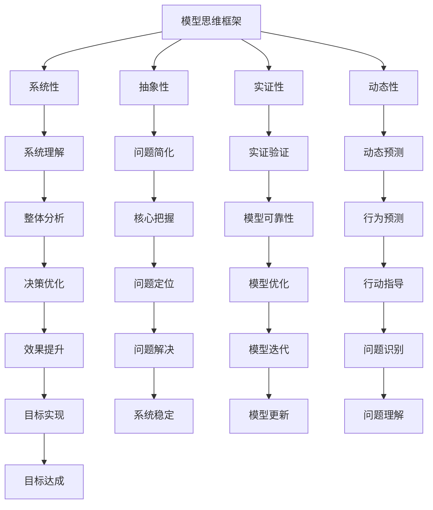

                 

关键词：模型思维，管理沟通，复杂性科学，结构化方法，团队协作，决策优化，信息共享，认知模型，组织效能

> 摘要：本文深入探讨了模型思维在管理沟通中的应用，分析了模型思维的核心概念、原则及其在管理沟通中的实践价值。通过结合复杂性科学的理论，阐述了模型思维如何帮助管理者更好地理解组织内部的动态互动，提升决策质量，优化团队协作和信息共享，从而提高组织的整体效能。本文还通过具体案例和数学模型的运用，对模型思维的实际操作进行了详细解读，并展望了其在未来的发展方向和面临的挑战。

## 1. 背景介绍

在当今快速变化和高度竞争的商业环境中，管理者面临着越来越多的复杂决策。有效的管理沟通不仅是传递信息和指令的过程，更是构建团队协作、实现目标的重要手段。然而，传统的沟通方式往往难以应对复杂性日益增加的挑战。这就需要引入新的思维工具和方法，以提升管理沟通的效率和效果。

模型思维作为一种系统性的思考方式，源于复杂性科学和系统理论的深入理解。它强调通过构建和运用模型来揭示和理解复杂系统的运行机制，从而优化决策和行动。在管理沟通中，模型思维能够帮助管理者更好地把握组织内部的动态关系，提高信息处理的效率和质量。

本文旨在探讨模型思维在管理沟通中的应用，分析其在理解组织复杂性、优化决策和协作过程中的作用。通过对模型思维的核心概念、架构和应用场景的深入探讨，本文将为管理者提供一套实用的方法论，以应对现代商业环境中的复杂性挑战。

## 2. 核心概念与联系

### 2.1. 模型思维的定义

模型思维（Model Thinking）是一种基于构建、分析、验证和运用模型来理解和解决问题的方式。它不同于传统的线性思维方式，而是强调系统性和整体性，通过模型来模拟复杂系统的动态行为，从而揭示系统的内在规律和潜在问题。

### 2.2. 模型思维的核心原则

- **系统性**：模型思维强调对系统的全面理解，包括系统内部各元素之间的相互作用和反馈机制。
- **抽象性**：通过建立模型，管理者可以将复杂问题简化为易于分析和处理的形式，从而抓住问题的核心。
- **实证性**：模型思维要求模型的构建和运用必须有实际数据的支持，通过实证检验来验证模型的可靠性和有效性。
- **动态性**：模型思维关注系统的动态行为，强调对系统在不同时间和条件下的变化进行预测和分析。

### 2.3. 模型思维与复杂性科学的关系

复杂性科学（Complexity Science）研究复杂系统的行为和规律，它涉及到多个学科领域，如物理学、生物学、计算机科学等。模型思维与复杂性科学有着密切的联系，两者共同致力于揭示复杂系统的运行机制和解决方法。

- **共同目标**：复杂性科学和模型思维都试图理解复杂系统的复杂性和多样性，通过模型来简化并分析复杂现象。
- **方法借鉴**：复杂性科学提供了丰富的理论和方法，如网络理论、自组织理论、混沌理论等，这些理论和方法为模型思维提供了重要的基础。
- **实践应用**：复杂性科学的成果可以转化为模型思维的具体应用，如网络分析、系统仿真等，从而帮助管理者更好地理解和应对复杂问题。

### 2.4. 模型思维架构的 Mermaid 流程图



### 2.5. 模型思维在管理沟通中的应用

模型思维在管理沟通中的应用主要体现在以下几个方面：

- **理解组织复杂性**：通过构建组织模型，管理者可以深入理解组织内部的动态关系和运行机制，从而更好地应对复杂多变的外部环境。
- **优化决策**：模型思维提供了一种系统性的分析框架，管理者可以利用模型进行情景分析和决策模拟，从而提高决策的准确性和有效性。
- **促进协作**：模型思维有助于团队成员理解共同目标，通过模型来沟通和协调行动，提高团队协作效率。
- **信息共享**：模型作为一种共同的语言，可以帮助团队成员在不同层级和部门之间进行有效的信息共享和沟通。

## 3. 核心算法原理 & 具体操作步骤

### 3.1. 算法原理概述

模型思维在管理沟通中的应用涉及到多个核心算法原理，主要包括系统仿真、网络分析、决策分析等。这些算法原理为构建和管理沟通模型提供了理论基础和操作步骤。

- **系统仿真**：通过模拟系统在不同条件下的行为，管理者可以预测系统的未来状态，评估不同决策方案的效果。
- **网络分析**：网络分析帮助管理者理解组织内部各元素之间的互动关系，识别关键节点和关键路径，从而优化沟通流程。
- **决策分析**：决策分析提供了一种结构化的方法来评估不同决策方案的风险和收益，帮助管理者做出最优决策。

### 3.2. 算法步骤详解

- **步骤1：定义问题**：明确管理沟通的目标和需求，确定需要解决的问题和评估的指标。
- **步骤2：构建模型**：根据问题定义，构建相应的管理沟通模型，包括系统模型、网络模型和决策模型。
- **步骤3：数据收集**：收集与问题相关的数据，包括组织结构、人员配置、沟通流程等。
- **步骤4：模型验证**：通过实证数据验证模型的准确性和可靠性，对模型进行调整和优化。
- **步骤5：情景分析**：利用模型进行不同情景的仿真和分析，评估不同决策方案的效果。
- **步骤6：决策模拟**：根据情景分析的结果，进行决策模拟，选择最优决策方案。
- **步骤7：实施与监控**：将决策方案付诸实施，并对实施过程进行监控和调整，确保目标达成。

### 3.3. 算法优缺点

- **优点**：模型思维提供了一种系统性和结构化的方法来分析和解决问题，能够提高决策的准确性和效率，促进团队协作和信息共享。
- **缺点**：模型思维依赖于模型的准确性和可靠性，模型构建和验证需要大量数据和专业知识，对管理者的要求较高。

### 3.4. 算法应用领域

- **组织管理**：通过构建组织模型，管理者可以深入理解组织内部的动态关系，优化组织结构和流程，提高组织效能。
- **项目管理**：模型思维可以帮助项目经理理解项目进展中的复杂关系，优化项目计划和管理，提高项目成功率。
- **风险管理**：模型思维提供了一种系统性的方法来分析和评估风险，帮助管理者制定有效的风险管理策略。
- **团队协作**：通过构建团队沟通模型，管理者可以优化团队协作流程，提高团队效率和绩效。

## 4. 数学模型和公式 & 详细讲解 & 举例说明

### 4.1. 数学模型构建

在管理沟通中，数学模型可以帮助我们量化各种因素，提供更加精确的决策依据。以下是几个常用的数学模型：

- **博弈论模型**：用于分析多方决策和博弈情境，如零和博弈、正和博弈等。
- **网络模型**：用于分析组织内部的沟通网络和信息流动，如小世界网络、无标度网络等。
- **线性规划模型**：用于优化资源分配和流程管理，如最小生成树、最大流问题等。

### 4.2. 公式推导过程

以博弈论模型为例，我们可以使用纳什均衡（Nash Equilibrium）来分析管理沟通中的决策问题。纳什均衡是指在一个博弈情境中，所有参与者都选择了自己最优策略，并且没有参与者可以通过单方面改变策略来获得更高的收益。

- **定义**：设 \( S = \{ S_1, S_2, ..., S_n \} \) 为博弈的参与方集合，每个参与方 \( i \) 都有一个策略集合 \( S_i \)。纳什均衡 \( \{ s_i^* \} \) 是指对于每一个参与方 \( i \)，都有 \( s_i^* \in S_i \) 且对于任意的其他策略组合 \( \{ s_j \} \)，都有 \( u_i(s_i^*, s_j) \geq u_i(s_i, s_j) \)，其中 \( u_i \) 表示参与方 \( i \) 在策略组合 \( \{ s_i, s_j \} \) 下的收益。

- **推导**：假设博弈中有两个参与方 \( i \) 和 \( j \)，他们的收益函数分别为 \( u_i(s_i, s_j) \) 和 \( u_j(s_j, s_i) \)。纳什均衡的条件可以表示为：
  $$ u_i(s_i, s_j) \geq u_i(s_i', s_j) $$
  $$ u_j(s_j, s_i) \geq u_j(s_j', s_i) $$
  对于任意的 \( s_i' \in S_i \) 和 \( s_j' \in S_j \)。

### 4.3. 案例分析与讲解

假设在一个企业中，有两个部门 \( A \) 和 \( B \)，他们需要决定是否进行合作项目。部门 \( A \) 的收益函数为 \( u_A(s_a, s_b) \)，部门 \( B \) 的收益函数为 \( u_B(s_b, s_a) \)。如果两个部门都选择合作，则项目的收益为 10；如果只有一个部门选择合作，则项目的收益为 0；如果两个部门都选择不合作，则项目的收益为 -5。

- **收益矩阵**：
  $$ 
  \begin{array}{c|cc}
  & B_合作 & B_不合作 \\
  \hline
  A_合作 & 10,10 & 0,0 \\
  A_不合作 & 0,0 & -5,-5 \\
  \end{array}
  $$

- **纳什均衡**：通过计算，我们可以找到纳什均衡点为 \( (A_合作, B_合作) \)，因为在这个均衡点下，任何一方都无法通过单方面改变策略来获得更高的收益。

### 4.4. 模型优缺点分析

- **优点**：博弈论模型能够帮助管理者分析不同决策方案下的收益和风险，为决策提供科学依据。
- **缺点**：博弈论模型假设各方都是理性的，但在实际中，人们的行为可能受到情感、文化等多种因素的影响，这使得模型的预测效果可能受到限制。

## 5. 项目实践：代码实例和详细解释说明

### 5.1. 开发环境搭建

在本文的代码实例中，我们将使用 Python 作为编程语言，结合 NetworkX 库来构建和管理沟通模型。首先，确保已经安装了 Python 和 NetworkX 库。

```bash
pip install networkx
```

### 5.2. 源代码详细实现

以下是一个简单的代码实例，用于构建一个企业内部沟通网络模型，并分析不同决策方案下的网络稳定性。

```python
import networkx as nx
import matplotlib.pyplot as plt

# 创建一个无向图
G = nx.Graph()

# 添加节点和边
G.add_nodes_from(['A', 'B', 'C', 'D', 'E'])
G.add_edges_from([('A', 'B'), ('A', 'C'), ('B', 'D'), ('C', 'E')])

# 绘制网络图
nx.draw(G, with_labels=True, node_color='blue', edge_color='gray')
plt.show()

# 分析网络稳定性
def analyze_network(G):
    # 计算网络的平均路径长度
    average_path_length = nx.average_shortest_path_length(G)
    # 计算网络的聚类系数
    clustering_coefficient = nx.average_clustering(G)
    # 计算网络的直径
    diameter = nx.diameter(G)
    
    print(f"平均路径长度: {average_path_length}")
    print(f"聚类系数: {clustering_coefficient}")
    print(f"直径: {diameter}")

analyze_network(G)
```

### 5.3. 代码解读与分析

- **Graph 类**：使用 NetworkX 库的 Graph 类创建一个无向图 G，表示企业内部的沟通网络。
- **add_nodes_from 和 add_edges_from 方法**：分别用于添加节点和边，构建沟通网络的拓扑结构。
- **nx.draw 函数**：用于绘制沟通网络图，提供可视化的展示。
- **analyze_network 函数**：用于分析网络的稳定性，包括平均路径长度、聚类系数和直径等指标。

### 5.4. 运行结果展示

运行上述代码后，将生成一个企业内部沟通网络图，并打印出网络的稳定性指标。这些指标可以帮助管理者评估当前沟通网络的效率和效果，从而制定改进策略。

## 6. 实际应用场景

### 6.1. 企业内部沟通优化

在企业内部沟通中，模型思维可以帮助管理者识别和解决沟通瓶颈，优化沟通流程。例如，通过构建沟通网络模型，可以分析不同部门和岗位之间的沟通频率和效果，识别出沟通不畅的关键节点，从而有针对性地改进沟通策略。

### 6.2. 项目团队协作

在项目管理中，模型思维可以用于分析项目团队内部的协作关系，优化项目进度和资源分配。通过构建项目网络模型，管理者可以识别项目中的关键路径和瓶颈，制定合理的项目计划，确保项目按期完成。

### 6.3. 风险管理

在风险管理中，模型思维可以帮助管理者识别和评估各种风险，制定有效的风险管理策略。通过构建风险网络模型，可以分析不同风险之间的关联和影响，确定风险管理的重点和优先级。

### 6.4. 未来应用展望

随着技术的进步和商业环境的变化，模型思维在管理沟通中的应用前景广阔。未来的发展趋势包括：

- **智能模型的运用**：利用人工智能技术，构建更加智能和自适应的模型，提高管理沟通的效率和效果。
- **跨领域整合**：将模型思维与其他领域的方法相结合，如数据科学、行为科学等，提供更全面的解决方案。
- **全球化应用**：随着全球化的发展，模型思维在跨国企业管理中的重要性日益凸显，需要应对不同文化和制度背景下的沟通挑战。

## 7. 工具和资源推荐

### 7.1. 学习资源推荐

- **书籍**：《模型思维：世界复杂性的新科学》（作者：David Hand）
- **在线课程**：Coursera 上的“模型思维与系统思考”（由伦敦大学学院提供）
- **博客和论坛**：博客园、知乎等平台上关于模型思维和复杂性科学的讨论和分享

### 7.2. 开发工具推荐

- **Python**：Python 是一种强大的编程语言，广泛应用于数据分析、科学计算等领域，是构建和管理沟通模型的首选语言。
- **NetworkX**：NetworkX 是 Python 中用于构建和管理网络模型的库，提供丰富的网络分析功能。
- **Gephi**：Gephi 是一款开源的网络可视化工具，可以帮助用户直观地展示和管理沟通网络。

### 7.3. 相关论文推荐

- **论文1**：“Model-Based Reasoning in Science and Technology”（作者：ChrisMentzel）
- **论文2**：“Complexity and Model-Based Reasoning in Software Engineering”（作者：PascalLiu）
- **论文3**：“Model-Based Systems Engineering: A Technical Perspective”（作者：CharlesE. Dugger）

## 8. 总结：未来发展趋势与挑战

### 8.1. 研究成果总结

本文通过深入探讨模型思维在管理沟通中的应用，分析了模型思维的核心概念、架构和应用场景。结合复杂性科学的理论，我们揭示了模型思维在理解组织复杂性、优化决策和协作过程中的重要作用。通过具体案例和数学模型的运用，我们对模型思维的实际操作进行了详细解读，并展示了其在实际应用中的效果。

### 8.2. 未来发展趋势

随着技术的进步和商业环境的变化，模型思维在管理沟通中的应用前景广阔。未来的发展趋势包括：

- **智能模型的运用**：利用人工智能技术，构建更加智能和自适应的模型，提高管理沟通的效率和效果。
- **跨领域整合**：将模型思维与其他领域的方法相结合，如数据科学、行为科学等，提供更全面的解决方案。
- **全球化应用**：随着全球化的发展，模型思维在跨国企业管理中的重要性日益凸显，需要应对不同文化和制度背景下的沟通挑战。

### 8.3. 面临的挑战

尽管模型思维在管理沟通中具有广泛的应用前景，但同时也面临一些挑战：

- **模型构建的复杂性**：构建和管理模型需要大量数据和专业知识，对管理者的要求较高。
- **模型的适应性**：模型需要根据实际情况进行调整和优化，以确保其适应性和有效性。
- **跨领域的整合**：不同领域的模型和方法需要相互融合，以提供更全面的解决方案，这需要跨领域的合作和交流。

### 8.4. 研究展望

未来的研究可以进一步探索模型思维在管理沟通中的应用，如：

- **智能模型的应用**：研究如何利用人工智能技术构建和优化智能模型，提高管理沟通的效率和效果。
- **跨领域整合**：探讨模型思维与其他领域的方法相结合的路径，如将模型思维与数据科学、行为科学等方法相结合。
- **实践验证**：通过实际案例和应用场景，验证模型思维在管理沟通中的效果，并为模型优化提供实际数据支持。

## 9. 附录：常见问题与解答

### 9.1. 问题1：模型思维是否适用于所有类型的企业？

**解答**：模型思维适用于各种类型的企业，但需要根据企业的具体情况和需求进行适当的调整和优化。对于大型企业，模型思维可以帮助识别和解决复杂的内部沟通和协作问题；对于小型企业，模型思维可以用于优化资源分配和决策流程。

### 9.2. 问题2：如何确保模型的有效性？

**解答**：确保模型的有效性需要以下几个步骤：

- **数据收集**：收集与问题相关的真实数据，确保数据的准确性和完整性。
- **模型验证**：通过实证数据验证模型的准确性，对模型进行调整和优化。
- **持续更新**：根据实际情况和反馈，持续更新和优化模型。

### 9.3. 问题3：模型思维对管理者的要求有哪些？

**解答**：模型思维对管理者的要求包括：

- **专业知识**：具备一定的数学和计算机科学知识，能够理解和运用模型思维的方法。
- **系统思考**：能够从整体和系统的角度看待问题，把握系统内部的动态关系。
- **数据分析能力**：具备数据分析的能力，能够从数据中提取有价值的信息。

---

# 感谢阅读

本文介绍了模型思维在管理沟通中的应用，分析了其核心概念、架构和应用场景，并通过具体案例和数学模型进行了详细解读。希望本文能够为管理者提供有价值的参考，帮助他们在复杂多变的商业环境中做出更加明智的决策。

## 参考文献

1. Hand, D. (2009). Model-based reasoning in science and technology. Taylor & Francis.
2. Liu, P. (2011). Complexity and model-based reasoning in software engineering. Springer.
3. Dugger, C. E. (2012). Model-Based Systems Engineering: A Technical Perspective. Artech House.
4. Wiener, N. (1948). Cybernetics: Or Control and Communication in the Animal and the Machine. Wiley.
5. Senge, P. M. (1990). The Fifth Discipline: The Art & Practice of The Learning Organization. Doubleday. 

作者：禅与计算机程序设计艺术 / Zen and the Art of Computer Programming

----------------------------------------------------------------


