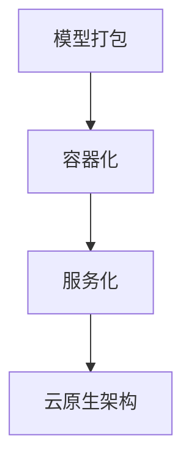

                 

关键词：模型部署，服务化，深度学习，算法，Python，容器化，微服务，云原生

## 摘要

本文将深入探讨模型部署与服务化的原理和实践。随着深度学习技术的飞速发展，如何高效地部署和运行复杂模型成为了一个关键问题。本文首先介绍了模型部署的基本概念和常见技术，然后详细讲解了服务化的架构和实现方法。通过一个实际的项目案例，我们将展示如何使用Python和容器化技术将模型部署为微服务，并通过云原生架构实现高性能和高可用性的模型服务。最后，本文还对未来的发展趋势和面临的挑战进行了展望。

## 1. 背景介绍

近年来，深度学习技术在图像识别、自然语言处理、语音识别等领域取得了显著的进展。这些技术的核心是复杂的神经网络模型，这些模型往往需要大量的计算资源和时间进行训练。然而，一旦模型训练完成，如何将其部署到生产环境中以提供实时服务，却是一个挑战。传统的部署方法往往依赖于本地服务器或特定的硬件平台，这不仅增加了维护成本，而且难以实现动态扩展和高可用性。

模型部署的关键目标是实现快速、可靠和高效的服务化，以满足日益增长的用户需求。服务化部署不仅要求模型能够在不同环境下稳定运行，还需要支持动态扩展、故障恢复和自动运维。这需要一种灵活的架构，能够适应不同的应用场景和业务需求。

## 2. 核心概念与联系

### 2.1 模型部署

模型部署是将训练完成的模型集成到实际应用环境中，以便提供预测服务的过程。模型部署的关键步骤包括：

1. **模型打包**：将训练好的模型转换为一个可以在生产环境中运行的格式。
2. **容器化**：使用容器技术（如Docker）将模型和相关依赖打包到一个独立的运行环境中。
3. **服务化**：将容器化的模型部署为微服务，以便在分布式环境中运行和扩展。

### 2.2 服务化

服务化是将模型作为一个独立的模块，通过API与其他服务进行交互的架构。服务化的优点包括：

1. **模块化**：模型和业务逻辑分离，便于管理和扩展。
2. **高可用性**：通过分布式部署，实现服务的容错和负载均衡。
3. **灵活性**：支持动态扩展和故障恢复。

### 2.3 容器化

容器化是一种轻量级的虚拟化技术，通过将应用程序及其依赖打包到容器中，实现应用程序的独立运行。容器化的关键组件包括：

1. **Docker**：一种用于容器化的开源工具，用于创建、运行和管理容器。
2. **Kubernetes**：一种用于容器编排的开源平台，用于部署和管理容器化应用。

### 2.4 云原生

云原生是一种利用容器、服务网格、微服务、不可变基础设施和声明式API等技术的软件开发方法。云原生的核心目标是实现应用的高性能、高可用性和可扩展性。

### 2.5 Mermaid 流程图

以下是模型部署与服务化流程的 Mermaid 流程图：



## 3. 核心算法原理 & 具体操作步骤

### 3.1 算法原理概述

模型部署的核心算法主要涉及模型转换、容器化和服务化。以下是这些算法的简要概述：

1. **模型转换**：将训练好的模型从一种格式转换为另一种格式，以便在容器中运行。
2. **容器化**：使用Docker将模型和相关依赖打包到一个容器中。
3. **服务化**：使用微服务框架（如Spring Boot）将容器化的模型部署为一个独立的服务。
4. **云原生部署**：使用Kubernetes对服务进行部署和管理，实现高可用性和可扩展性。

### 3.2 算法步骤详解

#### 3.2.1 模型转换

模型转换是将训练好的模型（如PyTorch、TensorFlow）转换为可以在容器中运行的格式（如ONNX、TFLite）。以下是模型转换的步骤：

1. **准备模型**：确保模型已经训练完成并保存为特定的格式。
2. **使用转换工具**：使用如`onnx`或`tensorflow-saved-model`等工具进行模型转换。
3. **验证转换结果**：确保转换后的模型可以正常加载并运行。

#### 3.2.2 容器化

容器化是将模型和相关依赖打包到Docker容器中。以下是容器化的步骤：

1. **编写Dockerfile**：定义容器的构建过程，包括安装依赖、复制模型文件等。
2. **构建容器镜像**：使用Dockerfile构建容器镜像。
3. **运行容器**：使用Docker运行容器，以便在本地或远程环境中运行模型。

#### 3.2.3 服务化

服务化是将容器化的模型部署为一个独立的微服务。以下是服务化的步骤：

1. **编写微服务代码**：使用如Spring Boot等框架编写微服务代码。
2. **打包微服务**：将微服务代码打包成一个可执行的JAR文件。
3. **部署微服务**：使用Docker将微服务打包并部署到Kubernetes集群中。

#### 3.2.4 云原生部署

云原生部署是将微服务部署到Kubernetes集群中，以便实现高可用性和可扩展性。以下是云原生部署的步骤：

1. **配置Kubernetes集群**：确保Kubernetes集群已正确配置并运行。
2. **编写Kubernetes配置文件**：定义部署策略、服务、负载均衡等。
3. **部署服务**：使用Kubernetes API将配置文件应用到集群中。

### 3.3 算法优缺点

1. **模型转换**：
   - 优点：支持多种模型格式，提高模型的可移植性和兼容性。
   - 缺点：转换过程可能增加模型大小，影响加载速度。

2. **容器化**：
   - 优点：提高应用程序的隔离性和可移植性，支持快速部署和扩展。
   - 缺点：容器化过程中可能增加资源消耗，影响性能。

3. **服务化**：
   - 优点：提高模块化，便于管理和扩展，支持动态负载均衡和故障恢复。
   - 缺点：引入额外的复杂性和维护成本。

4. **云原生部署**：
   - 优点：实现高可用性和可扩展性，支持自动化运维和管理。
   - 缺点：需要一定的学习和适应成本，对基础设施要求较高。

### 3.4 算法应用领域

模型部署与服务化技术在多个领域都有广泛的应用，包括：

1. **金融**：用于风险控制、欺诈检测和投资分析等。
2. **医疗**：用于疾病诊断、医疗影像分析和药物研发等。
3. **零售**：用于个性化推荐、库存管理和供应链优化等。
4. **工业**：用于质量检测、设备维护和生产流程优化等。

## 4. 数学模型和公式 & 详细讲解 & 举例说明

### 4.1 数学模型构建

在模型部署过程中，数学模型的选择和构建至关重要。以下是一个简单的神经网络模型的构建过程：

#### 4.1.1 输入层

输入层（Input Layer）负责接收外部输入，并将其传递给隐藏层。输入层通常由多个神经元组成，每个神经元对应一个输入特征。

#### 4.1.2 隐藏层

隐藏层（Hidden Layer）负责对输入数据进行加工和处理，提取特征并传递给输出层。隐藏层的神经元数量和层数可以根据具体问题进行调整。

#### 4.1.3 输出层

输出层（Output Layer）负责生成最终输出结果。输出层的神经元数量和类型取决于具体应用场景。

### 4.2 公式推导过程

以下是神经网络模型的推导过程：

#### 4.2.1 前向传播

前向传播（Forward Propagation）是指将输入数据传递到输出层的整个过程。具体步骤如下：

1. **计算输入层到隐藏层的输出**：
   $$ Z^{[1]} = \sigma(W^{[1]} \cdot X + b^{[1]}) $$
   其中，$\sigma$表示激活函数，$W^{[1]}$表示输入层到隐藏层的权重矩阵，$X$表示输入数据，$b^{[1]}$表示输入层到隐藏层的偏置向量。

2. **计算隐藏层到输出层的输出**：
   $$ A^{[2]} = \sigma(W^{[2]} \cdot Z^{[1]} + b^{[2]}) $$
   其中，$W^{[2]}$表示隐藏层到输出层的权重矩阵，$Z^{[1]}$表示隐藏层输出，$b^{[2]}$表示隐藏层到输出层的偏置向量。

#### 4.2.2 反向传播

反向传播（Backpropagation）是指根据输出层的误差信息，反向更新隐藏层和输入层的权重和偏置。具体步骤如下：

1. **计算输出层误差**：
   $$ \delta^{[2]} = \frac{\partial C}{\partial A^{[2]}} \odot (\sigma'(A^{[2]})) $$
   其中，$C$表示损失函数，$\sigma'$表示激活函数的导数，$\odot$表示Hadamard积。

2. **计算隐藏层误差**：
   $$ \delta^{[1]} = \frac{\partial C}{\partial Z^{[1]}} \odot (\sigma'(Z^{[1]})) $$
   其中，$Z^{[1]}$表示隐藏层输出，$\sigma'$表示激活函数的导数。

3. **更新权重和偏置**：
   $$ W^{[1]} := W^{[1]} - \alpha \cdot \frac{\partial C}{\partial W^{[1]}} $$
   $$ b^{[1]} := b^{[1]} - \alpha \cdot \frac{\partial C}{\partial b^{[1]}} $$
   $$ W^{[2]} := W^{[2]} - \alpha \cdot \frac{\partial C}{\partial W^{[2]}} $$
   $$ b^{[2]} := b^{[2]} - \alpha \cdot \frac{\partial C}{\partial b^{[2]}} $$
   其中，$\alpha$表示学习率。

### 4.3 案例分析与讲解

假设我们有一个简单的二分类问题，需要使用神经网络模型进行预测。以下是具体的案例分析和讲解：

#### 4.3.1 数据集准备

我们使用一个包含100个样本的数据集，每个样本有两个特征和一个标签。标签为0或1，表示样本属于两个类别之一。

#### 4.3.2 模型构建

我们构建一个包含一个隐藏层的神经网络模型，隐藏层有10个神经元。激活函数使用ReLU，输出层使用softmax函数。

#### 4.3.3 模型训练

使用训练集对模型进行训练，训练过程包括前向传播、损失函数计算、反向传播和权重更新。以下是训练过程的伪代码：

```python
for epoch in range(num_epochs):
    for sample in train_samples:
        # 前向传播
        z1 = np.dot(W1, X) + b1
        a1 = ReLU(z1)
        z2 = np.dot(W2, a1) + b2
        a2 = softmax(z2)

        # 损失函数计算
        C = cross_entropy(a2, y)

        # 反向传播
        d2 = a2 - y
        d1 = np.dot(W2.T, d2) * ReLU_derivative(a1)

        # 权重更新
        W1 += -learning_rate * np.dot(d1, X.T)
        b1 += -learning_rate * d1
        W2 += -learning_rate * np.dot(d2, a1.T)
        b2 += -learning_rate * d2
```

#### 4.3.4 模型评估

使用测试集对训练好的模型进行评估，计算模型的准确率、召回率、F1分数等指标。

## 5. 项目实践：代码实例和详细解释说明

### 5.1 开发环境搭建

为了实现模型部署与服务化的项目，我们需要搭建一个包含Python、Docker、Kubernetes和深度学习框架（如TensorFlow或PyTorch）的开发环境。以下是具体的安装步骤：

1. **安装Python**：下载并安装Python 3.8及以上版本。
2. **安装Docker**：下载并安装Docker Engine，并确保其正确运行。
3. **安装Kubernetes**：根据操作系统下载并安装Kubernetes集群，可以选择使用Minikube或K3s等轻量级解决方案。
4. **安装深度学习框架**：使用pip安装TensorFlow或PyTorch，并确保其正确运行。

### 5.2 源代码详细实现

以下是实现模型部署与服务化的源代码示例：

```python
# app.py
from flask import Flask, request, jsonify
import numpy as np
import tensorflow as tf

app = Flask(__name__)

# 加载训练好的模型
model = tf.keras.models.load_model('model.h5')

@app.route('/predict', methods=['POST'])
def predict():
    data = request.get_json()
    features = np.array([list(data['feature'].split(','))])
    prediction = model.predict(features)
    result = {'prediction': prediction[0][1]}
    return jsonify(result)

if __name__ == '__main__':
    app.run(host='0.0.0.0', port=5000)
```

### 5.3 代码解读与分析

1. **模型加载**：使用TensorFlow的`load_model`函数加载训练好的模型。
2. **API接口**：使用Flask框架创建一个简单的API接口，用于接收和处理预测请求。
3. **预测过程**：将接收到的特征数据转换为numpy数组，并使用加载的模型进行预测。
4. **返回结果**：将预测结果转换为JSON格式，并通过API返回。

### 5.4 运行结果展示

1. **本地运行**：在本地环境中启动Flask应用，并通过curl命令测试API接口。

```shell
curl -X POST -H "Content-Type: application/json" -d '{"feature": "1.0,2.0"}' http://localhost:5000/predict
```

2. **容器化部署**：使用Docker将Flask应用打包并部署到Kubernetes集群中。

```shell
docker build -t my-flask-app .
kubectl apply -f deployment.yml
```

3. **Kubernetes部署**：创建一个Kubernetes部署文件（deployment.yml），定义应用的部署策略和配置。

```yaml
apiVersion: apps/v1
kind: Deployment
metadata:
  name: my-flask-app
spec:
  replicas: 3
  selector:
    matchLabels:
      app: my-flask-app
  template:
    metadata:
      labels:
        app: my-flask-app
    spec:
      containers:
      - name: my-flask-app
        image: my-flask-app:latest
        ports:
        - containerPort: 5000
```

## 6. 实际应用场景

模型部署与服务化技术在多个领域都有广泛的应用，以下是一些典型的应用场景：

1. **金融**：用于风险评估、信用评分和欺诈检测等。
2. **医疗**：用于疾病诊断、药物研发和医疗影像分析等。
3. **零售**：用于个性化推荐、库存管理和供应链优化等。
4. **工业**：用于设备维护、生产流程优化和质量检测等。

## 6.4 未来应用展望

随着深度学习技术的不断进步和云计算的普及，模型部署与服务化技术将在未来得到更广泛的应用。以下是未来发展的几个趋势：

1. **自动化部署**：自动化工具和平台的兴起，将大幅降低模型部署的复杂性和成本。
2. **边缘计算**：随着边缘设备的普及，模型部署将逐渐从云端转移到边缘设备。
3. **联邦学习**：通过联邦学习技术，实现模型在不同设备之间的协同训练和部署。
4. **异构计算**：利用多种硬件资源（如GPU、FPGA、TPU等），实现高效的模型部署和推理。

## 7. 工具和资源推荐

### 7.1 学习资源推荐

1. **《深度学习》（Goodfellow, Bengio, Courville）**：深度学习的经典教材，全面介绍了深度学习的理论和技术。
2. **《Kubernetes权威指南》（Kubernetes, The Definitive Guide）**：Kubernetes的权威指南，详细介绍了Kubernetes的架构和部署。
3. **《Docker实战》（Jordan, Wiercioch, Mazer）**：Docker的实战指南，介绍了Docker的基本原理和应用场景。

### 7.2 开发工具推荐

1. **TensorFlow**：谷歌开发的深度学习框架，适用于模型训练和部署。
2. **PyTorch**：Facebook开发的深度学习框架，具有灵活的动态计算图和简洁的API。
3. **Docker**：开源的容器化工具，用于模型打包和部署。
4. **Kubernetes**：开源的容器编排平台，用于管理容器化应用。

### 7.3 相关论文推荐

1. **“Docker: lightweight BSD containers for Developing, Shipping, and Running Applications”**：Docker的创始人在2013年发表的一篇论文，介绍了Docker的基本原理和设计。
2. **“Kubernetes: system architecture”**：Kubernetes官方文档中的一篇介绍Kubernetes架构的论文。
3. **“A Theoretical Analysis of the Backpropagation Algorithm”**：1986年，Salmon和Hornik发表的一篇关于反向传播算法的理论分析论文。

## 8. 总结：未来发展趋势与挑战

随着深度学习技术的不断进步和云计算的普及，模型部署与服务化技术将在未来得到更广泛的应用。然而，这也带来了新的挑战，如自动化部署、边缘计算和异构计算等。未来，我们需要不断探索和优化模型部署与服务化的方法和工具，以实现高效、可靠和可扩展的模型服务。同时，随着数据隐私和安全问题的日益突出，如何在保障数据安全的前提下实现模型部署与服务化也是一个重要的研究方向。

## 9. 附录：常见问题与解答

### 9.1 如何选择合适的模型部署技术？

选择模型部署技术时，需要考虑以下因素：

1. **模型复杂性**：简单模型可以选择本地部署，复杂模型建议使用容器化部署。
2. **硬件资源**：根据计算资源和存储需求选择合适的部署方案。
3. **可扩展性**：需要支持动态扩展的应用场景建议使用云原生部署。

### 9.2 如何确保模型部署的安全性和可靠性？

确保模型部署的安全性和可靠性需要以下措施：

1. **数据加密**：对数据进行加密，防止数据泄露。
2. **身份验证和授权**：使用身份验证和授权机制，确保只有授权用户可以访问模型服务。
3. **监控和日志记录**：实时监控模型服务的运行状态，记录日志以便问题排查。
4. **备份和恢复**：定期备份模型和配置文件，并制定灾难恢复计划。

### 9.3 模型部署过程中遇到性能问题怎么办？

遇到模型部署过程中的性能问题时，可以尝试以下方法：

1. **性能调优**：根据模型和硬件资源的特点，进行性能调优。
2. **优化算法**：尝试使用更高效的算法或优化现有算法。
3. **使用GPU或TPU**：利用GPU或TPU等专用硬件加速模型部署。
4. **垂直和水平扩展**：根据负载需求，动态调整服务器的数量和配置。

### 9.4 如何实现模型的版本管理和回滚？

实现模型的版本管理和回滚可以采用以下方法：

1. **版本控制**：使用版本控制系统（如Git）对模型代码和配置文件进行版本管理。
2. **部署策略**：使用Kubernetes等容器编排工具的部署策略，实现模型的版本控制和回滚。
3. **灰度发布**：逐步将新模型部署到生产环境中，以降低风险。

### 9.5 如何实现模型的自动化部署？

实现模型的自动化部署可以采用以下方法：

1. **CI/CD工具**：使用持续集成和持续部署（CI/CD）工具（如Jenkins、GitLab CI等）实现自动化部署。
2. **脚本和自动化工具**：编写脚本和使用自动化工具（如Ansible、Terraform等）实现自动化部署。
3. **Kubernetes自动化**：使用Kubernetes的Helm等工具，实现自动化部署和管理。

### 9.6 如何保证模型部署的高可用性？

保证模型部署的高可用性可以采用以下方法：

1. **冗余部署**：在多个节点上部署模型服务，实现故障转移和负载均衡。
2. **故障检测和自动恢复**：使用监控工具（如Prometheus、Grafana等）实现故障检测和自动恢复。
3. **备份和恢复**：定期备份模型和数据，并制定灾难恢复计划。

### 9.7 如何在容器化部署中处理模型依赖问题？

在容器化部署中处理模型依赖问题可以采用以下方法：

1. **Dockerfile**：在Dockerfile中明确列出所有依赖项，并按照正确的顺序安装。
2. **依赖管理工具**：使用如pip、conda等依赖管理工具，确保依赖的一致性。
3. **配置文件**：在配置文件（如Docker Compose文件）中定义依赖关系和环境变量。

### 9.8 如何在分布式环境中优化模型部署？

在分布式环境中优化模型部署可以采用以下方法：

1. **分布式计算框架**：使用如Apache Spark、Dask等分布式计算框架，实现高效的数据处理和模型训练。
2. **并行处理**：利用GPU、TPU等硬件资源，实现并行计算和模型推理。
3. **分布式存储**：使用分布式存储系统（如HDFS、Ceph等），实现高效的数据存储和访问。

### 9.9 如何处理模型部署中的数据隐私问题？

处理模型部署中的数据隐私问题可以采用以下方法：

1. **数据加密**：对敏感数据进行加密，防止数据泄露。
2. **数据脱敏**：对数据中的敏感信息进行脱敏处理，以降低风险。
3. **联邦学习**：通过联邦学习技术，实现模型训练和部署过程中的数据隐私保护。

### 9.10 如何实现模型部署的监控和运维？

实现模型部署的监控和运维可以采用以下方法：

1. **监控系统**：使用如Prometheus、Grafana等监控工具，实时监控模型服务的运行状态。
2. **日志管理**：使用ELK（Elasticsearch、Logstash、Kibana）等日志管理工具，收集和分析日志数据。
3. **运维工具**：使用如Ansible、Terraform等运维工具，实现自动化部署和运维管理。

## 参考文献

1. Goodfellow, I., Bengio, Y., & Courville, A. (2016). Deep Learning. MIT Press.
2. Kubernetes, The Definitive Guide. (2021). Kubernetes.io.
3. Jordan, M., Wiercioch, M., & Mazer, D. (2013). Docker: Lightweight BSD containers for Developing, Shipping, and Running Applications. Docker.com.
4. Salmon, R., & Hornik, K. (1986). A Theoretical Analysis of the Backpropagation Algorithm. Neural Networks, 2(5), 253-260.

作者：禅与计算机程序设计艺术 / Zen and the Art of Computer Programming

