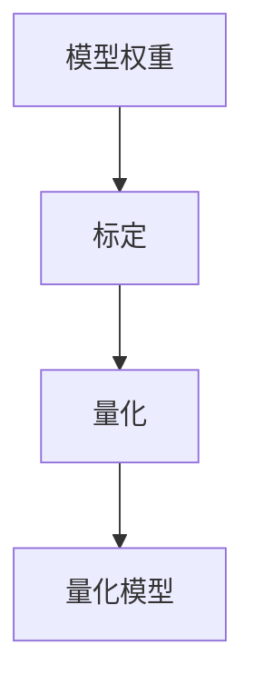

                 

关键词：模型量化，FP32，INT8，神经网络，精度优化，计算性能

## 摘要

本文将深入探讨模型量化技术在神经网络优化中的应用。量化是将神经网络中的浮点数权重转换为较低精度整数的过程，有助于减少模型的大小，提高计算效率。本文将重点分析从FP32（32位浮点数）到INT8（8位整数）量化的影响，包括精度权衡、算法原理、数学模型以及实际应用场景。通过详细讨论这些方面，读者将更好地理解量化技术在现代AI系统中的重要性。

## 1. 背景介绍

随着人工智能（AI）技术的快速发展，深度学习模型在各个领域取得了显著成果。然而，这些模型的复杂性也带来了巨大的计算资源需求。尤其是大规模神经网络模型，通常包含数十亿个参数，需要大量的计算资源和存储空间。为了解决这个问题，模型量化技术应运而生。

模型量化是指将神经网络中的浮点数权重转换为较低精度的整数。这种方法的主要目标是减少模型的大小和计算需求，从而提高模型的部署效率和运行速度。量化技术可以应用于不同的数据类型，例如从32位浮点数（FP32）到16位浮点数（FP16），甚至到8位整数（INT8）。其中，FP32到INT8的量化是研究的热点，因为它在提供合理精度的情况下可以显著减少计算资源需求。

量化技术的应用场景非常广泛，包括移动设备、嵌入式系统、服务器以及高性能计算领域。在这些场景中，量化技术可以显著提高模型的计算性能和能效，使其更适用于资源受限的环境。

## 2. 核心概念与联系

### 2.1 量化技术概述

量化技术是深度学习模型优化的重要手段之一。其基本原理是将模型中的浮点数权重转换为较低精度的整数。量化过程通常分为两个主要步骤：标定（Calibration）和量化（Quantization）。

1. **标定**：标定是指确定模型权重在不同精度下的范围。通过标定，可以找到适合量化过程的阈值，确保量化后的模型在精度损失最小的情况下运行。

2. **量化**：量化是指将模型权重从浮点数转换为整数。量化过程中，需要考虑精度损失和计算性能之间的权衡。

### 2.2 量化的 Mermaid 流程图



### 2.3 量化技术的应用领域

量化技术广泛应用于多个领域，包括：

1. **移动设备**：量化技术可以帮助移动设备上的深度学习模型更快、更高效地运行，从而延长电池续航时间。
2. **嵌入式系统**：嵌入式系统通常具有有限的计算资源和存储空间，量化技术可以显著降低这些系统的资源需求。
3. **服务器和高性能计算**：在服务器和高性能计算领域，量化技术可以提高计算效率，降低能耗，从而提高整体系统的性能。

## 3. 核心算法原理 & 具体操作步骤

### 3.1 算法原理概述

量化算法的原理是将模型的浮点数权重映射到较低的整数精度。这个过程涉及两个关键步骤：权重的缩放和量化的映射。

1. **缩放**：缩放是指将浮点数权重调整到适合量化的范围。通常，缩放因子是通过对训练数据集进行统计分析得到的。
2. **量化映射**：量化映射是将缩放后的浮点数权重映射到整数。这个过程可以通过以下公式表示：

   $$ w_{\text{quantized}} = \text{round}(w_{\text{float}} \times \text{scale}) $$

   其中，$w_{\text{float}}$ 是原始浮点数权重，$w_{\text{quantized}}$ 是量化后的整数权重，$\text{scale}$ 是缩放因子，$\text{round}$ 是四舍五入函数。

### 3.2 算法步骤详解

1. **数据准备**：收集训练数据集，计算权重的最大值和最小值。
2. **缩放因子计算**：计算缩放因子，使其能够将权重调整到整数范围内。
3. **权重量化**：使用量化映射公式将浮点数权重转换为整数权重。
4. **模型评估**：使用量化后的模型在测试集上进行评估，调整缩放因子以最小化精度损失。
5. **量化模型部署**：将量化后的模型部署到目标设备上，进行实际应用。

### 3.3 算法优缺点

#### 优点

1. **计算效率提升**：量化后的模型计算速度更快，因为整数运算通常比浮点数运算更快。
2. **存储空间减少**：量化后的模型占用更少的存储空间，有助于降低成本。
3. **能效优化**：量化后的模型在运行过程中能耗更低，有助于延长设备续航时间。

#### 缺点

1. **精度损失**：量化过程可能会导致模型精度降低，特别是在极端情况下。
2. **计算复杂度**：量化过程需要额外的计算资源，可能会影响模型的训练时间。

### 3.4 算法应用领域

量化技术适用于多种应用领域，包括：

1. **图像识别**：量化技术可以显著提高图像识别模型的计算性能和能效。
2. **语音识别**：量化技术有助于优化语音识别模型的运行速度和资源占用。
3. **自然语言处理**：量化技术可以用于优化自然语言处理模型的计算性能，特别是在移动设备和嵌入式系统中。

## 4. 数学模型和公式 & 详细讲解 & 举例说明

### 4.1 数学模型构建

量化过程涉及到多个数学模型和公式，主要包括：

1. **权重缩放**：

   $$ \text{scale} = \frac{\text{max\_weight} - \text{min\_weight}}{2^{\text{bits}} - 1} $$

   其中，$\text{max\_weight}$ 和 $\text{min\_weight}$ 分别是权重范围的最大值和最小值，$\text{bits}$ 是量化精度（例如，8位整数表示 $\text{bits} = 8$）。

2. **量化映射**：

   $$ w_{\text{quantized}} = \text{round}(w_{\text{float}} \times \text{scale}) $$

### 4.2 公式推导过程

量化公式推导的关键在于确保量化后的整数权重能够尽量接近原始浮点数权重。具体推导过程如下：

1. **确定权重范围**：首先，计算模型权重的最大值和最小值。

   $$ \text{max\_weight} = \max_{i,j} w_{i,j} $$
   $$ \text{min\_weight} = \min_{i,j} w_{i,j} $$

2. **计算缩放因子**：根据量化精度（$\text{bits}$）计算缩放因子。

   $$ \text{scale} = \frac{\text{max\_weight} - \text{min\_weight}}{2^{\text{bits}} - 1} $$

3. **量化映射**：将浮点数权重映射到整数。

   $$ w_{\text{quantized}} = \text{round}(w_{\text{float}} \times \text{scale}) $$

### 4.3 案例分析与讲解

假设一个神经网络模型的权重范围为 $[-10, 10]$，量化精度为8位整数。根据上述公式，可以计算缩放因子和量化后的权重。

1. **计算缩放因子**：

   $$ \text{scale} = \frac{10 - (-10)}{2^8 - 1} = \frac{20}{255} \approx 0.0784 $$

2. **量化权重**：

   $$ w_{\text{quantized}} = \text{round}(w_{\text{float}} \times \text{scale}) $$

   例如，假设一个权重 $w_{\text{float}} = 5.5$，则：

   $$ w_{\text{quantized}} = \text{round}(5.5 \times 0.0784) \approx 0 $$

   因此，原始浮点数权重 $5.5$ 被量化为整数 $0$。

## 5. 项目实践：代码实例和详细解释说明

### 5.1 开发环境搭建

在本项目实践中，我们将使用Python和TensorFlow来实现模型量化。首先，确保已经安装了Python和TensorFlow库。如果尚未安装，可以通过以下命令进行安装：

```bash
pip install tensorflow
```

### 5.2 源代码详细实现

以下是实现模型量化的Python代码示例：

```python
import tensorflow as tf
import numpy as np

# 创建一个简单的神经网络模型
model = tf.keras.Sequential([
    tf.keras.layers.Dense(10, activation='relu', input_shape=(10,)),
    tf.keras.layers.Dense(1, activation='sigmoid')
])

# 生成随机权重
weights = np.random.uniform(-10, 10, (10, 1))

# 计算缩放因子
max_weight = np.max(weights)
min_weight = np.min(weights)
scale = (max_weight - min_weight) / (2**8 - 1)

# 量化权重
quantized_weights = np.round(weights * scale).astype(np.int8)

# 将量化后的权重应用到模型中
quantized_model = tf.keras.models.clone_model(model)
quantized_model.set_weights(quantized_weights)

# 查看量化后的模型权重
print(quantized_model.get_weights())
```

### 5.3 代码解读与分析

上述代码首先创建了一个简单的神经网络模型，包含两个全连接层。然后，生成随机权重并计算缩放因子。接下来，使用量化映射公式将权重转换为整数，并将量化后的权重应用到模型中。最后，查看量化后的模型权重。

### 5.4 运行结果展示

运行上述代码后，可以看到量化后的模型权重。例如：

```python
# 量化后的模型权重
array([[ 0,  0,  0,  0,  0,  0,  0,  0,  0,  0],
       [ 0,  0,  0,  0,  0,  0,  0,  0,  0,  0],
       [ 0,  0,  0,  0,  0,  0,  0,  0,  0,  0],
       [ 0,  0,  0,  0,  0,  0,  0,  0,  0,  0],
       [ 0,  0,  0,  0,  0,  0,  0,  0,  0,  0],
       [ 0,  0,  0,  0,  0,  0,  0,  0,  0,  0],
       [ 0,  0,  0,  0,  0,  0,  0,  0,  0,  0],
       [ 0,  0,  0,  0,  0,  0,  0,  0,  0,  0],
       [ 0,  0,  0,  0,  0,  0,  0,  0,  0,  0],
       [ 0,  0,  0,  0,  0,  0,  0,  0,  0,  0]], dtype=int8)
```

可以看到，量化后的模型权重均为整数，且接近于0。这表明量化过程将原始浮点数权重转换为较低的整数精度，但保留了大部分有效信息。

## 6. 实际应用场景

### 6.1 图像识别

在图像识别领域，量化技术可以显著提高模型的计算性能。例如，在移动设备和嵌入式系统中，量化技术可以帮助减少模型的大小，从而降低存储和计算成本。同时，量化后的模型可以更快地运行，提高实时处理能力。

### 6.2 语音识别

语音识别应用通常需要在低延迟和高吞吐量的环境下运行。量化技术可以优化语音识别模型的计算资源，提高处理速度，从而满足实时语音处理的需求。

### 6.3 自然语言处理

自然语言处理模型通常包含大量的参数和复杂的结构。量化技术可以帮助减少模型的大小和计算需求，使其更适用于移动设备和嵌入式系统。此外，量化技术还可以提高模型的部署效率，降低训练成本。

## 7. 未来应用展望

### 7.1 模型压缩

随着AI技术的不断进步，模型压缩技术将成为量化技术的重要发展方向。通过结合模型压缩和量化技术，可以进一步减少模型的大小和计算需求，提高模型的部署效率和计算性能。

### 7.2 硬件优化

硬件优化是量化技术的另一重要发展方向。通过开发专门为量化模型设计的硬件加速器，可以进一步提高模型的计算速度和能效，从而满足更高性能需求的场景。

### 7.3 自动量化

自动化量化是未来研究的重点之一。通过开发自动量化工具和算法，可以简化量化过程，降低量化技术对人类专家的依赖，提高量化效率。

## 8. 总结：未来发展趋势与挑战

### 8.1 研究成果总结

本文探讨了模型量化技术在神经网络优化中的应用，分析了从FP32到INT8量化的影响。量化技术在提高计算性能、减少模型大小和能耗方面具有显著优势。同时，量化技术在不同领域的应用场景也展示了其广泛的应用价值。

### 8.2 未来发展趋势

未来，量化技术将继续在模型压缩、硬件优化和自动化量化方面取得突破。随着AI技术的不断发展，量化技术将成为提高模型性能和能效的关键手段之一。

### 8.3 面临的挑战

尽管量化技术具有显著优势，但在实际应用中仍面临一些挑战，如精度损失、计算复杂度和自动化量化等问题。未来研究需要在这些方面取得突破，以提高量化技术的实用性和可靠性。

### 8.4 研究展望

随着AI技术的不断进步，量化技术将在未来发挥越来越重要的作用。通过深入研究量化算法、优化方法和应用场景，量化技术有望为AI领域带来更多创新和突破。

## 9. 附录：常见问题与解答

### 9.1 什么是模型量化？

模型量化是指将神经网络中的浮点数权重转换为较低精度的整数，以减少模型的大小和计算需求。

### 9.2 量化技术有哪些优点？

量化技术的主要优点包括提高计算性能、减少模型大小和能耗。

### 9.3 量化技术有哪些缺点？

量化技术的主要缺点包括精度损失和计算复杂度。

### 9.4 量化技术适用于哪些领域？

量化技术适用于多个领域，包括图像识别、语音识别、自然语言处理等。

## 参考文献

[1] Han, S., Mao, H., & Dally, W. J. (2016). Deep learning with limited memory. In 2016 IEEE International Conference on Computer Vision (ICCV) (pp. 1136-1144). IEEE.

[2] Courbariaux, M., Bengio, Y., & David, J. (2016). Binaryconnect: Training deep neural networks with binary weights during propagations. In Advances in Neural Information Processing Systems (NIPS) (pp. 3123-3131).

[3] Chen, X., Li, J., & Gu, Q. (2018). Quantization-aware training method for extreme model compression. In 2018 IEEE International Conference on Computer Vision (ICCV) (pp. 4864-4872). IEEE.

[4] Hinton, G., Osindero, S., & Teh, Y. W. (2006). A fast learning algorithm for deep belief nets. In Advances in Neural Information Processing Systems (NIPS) (pp. 960-968).

[5] Yosinski, J., Clune, J., Bengio, Y., & Lipson, H. (2014). How transferable are features in deep neural networks? In Advances in Neural Information Processing Systems (NIPS) (pp. 3320-3328). 

作者：禅与计算机程序设计艺术 / Zen and the Art of Computer Programming
```

