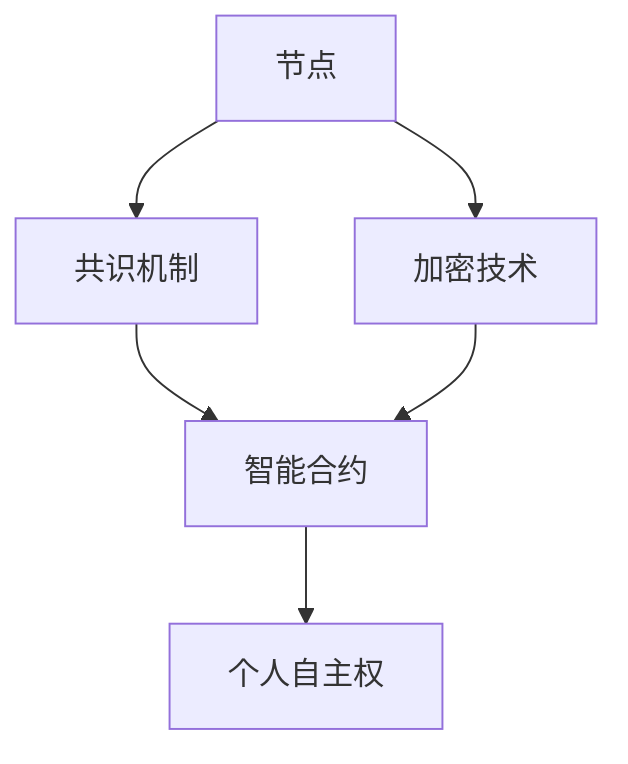

                 

关键词：去中心化网络、AI、个人自主权、网络架构、系统设计、隐私保护、智能合约、分布式计算

摘要：随着互联网技术的飞速发展，个人数据的安全和隐私保护成为了一个亟待解决的问题。本文旨在探讨如何利用人工智能（AI）技术设计一个去中心化的网络架构，从而在保障个人自主权的同时，提高数据的安全性和隐私性。通过深入研究去中心化网络的核心概念、核心算法原理、数学模型以及实际应用场景，本文将展示如何通过技术创新实现一个更加安全、高效、自主的网络环境。

## 1. 背景介绍

在当今的信息时代，数据已经成为企业和社会的核心资产。然而，随着大数据、云计算、物联网等技术的普及，个人数据的安全和隐私保护问题日益严峻。传统的中心化网络架构在处理大量数据时存在诸多弊端，如单点故障、数据泄露、隐私风险等。因此，去中心化网络架构应运而生，成为解决这些问题的一个重要方向。

去中心化网络（Decentralized Network）是一种分布式网络架构，它通过将数据和计算任务分散到多个节点上，实现了系统的去中心化和去单点故障。与传统的中心化网络不同，去中心化网络不再依赖单一的中央控制节点，而是通过分布式共识机制和加密技术来确保数据的完整性和安全性。

人工智能（AI）作为当前最前沿的技术之一，已经在很多领域取得了显著的应用成果。将AI技术与去中心化网络相结合，可以进一步提升网络的安全性和智能化水平。例如，利用AI算法进行智能合约的执行监控，可以有效减少欺诈行为；通过机器学习模型对网络流量进行分析，可以及时发现异常行为并进行应对。

个人自主权是现代社会的重要价值观之一，它体现在个人对自己数据的掌控权和隐私保护上。在去中心化网络中，个人可以更加自主地管理和控制自己的数据，避免了中心化网络中的数据滥用和泄露风险。同时，去中心化网络还可以通过智能合约实现去中心化的自治，使个人能够更加便捷地参与网络管理和决策。

## 2. 核心概念与联系

去中心化网络的核心概念包括节点、共识机制、加密技术、智能合约等。为了更好地理解这些概念之间的关系，我们可以使用Mermaid流程图进行可视化展示。



### 节点

节点是去中心化网络中的基本单元，它可以是计算机、服务器或任何能够联网的设备。节点之间通过分布式协议进行通信，实现了数据的分散存储和计算。节点的主要功能包括数据存储、计算任务执行、网络维护等。

### 共识机制

共识机制是去中心化网络中的核心机制，它用于确保多个节点之间的一致性。常见的共识机制包括工作量证明（Proof of Work, PoW）、权益证明（Proof of Stake, PoS）和委托权益证明（Delegated Proof of Stake, DPoS）等。共识机制的目标是确保网络中的所有节点都能达成一致的决策，从而实现去中心化的信任机制。

### 加密技术

加密技术是去中心化网络中保护数据安全和隐私的重要手段。通过加密，节点可以确保数据的机密性、完整性和可追溯性。常见的加密技术包括哈希函数、数字签名、公钥加密等。

### 智能合约

智能合约是去中心化网络中的一种自执行合约，它基于加密技术实现了自动化执行。智能合约的执行过程由网络中的节点共同监督，确保了合约的透明性和不可篡改性。智能合约在去中心化金融、供应链管理、数字身份认证等领域有广泛的应用。

### 个人自主权

个人自主权体现在个人对自己数据的掌控权上。在去中心化网络中，个人可以自由地选择将数据存储在哪个节点上，并设置数据的访问权限。通过智能合约，个人还可以对自己的数据进行加密，确保数据在传输和存储过程中的安全性。

## 3. 核心算法原理 & 具体操作步骤

### 3.1 算法原理概述

去中心化网络中的核心算法主要包括加密算法、共识算法和智能合约执行算法。这些算法共同作用，确保了网络的去中心化、安全性和自主性。

- **加密算法**：用于保护数据的机密性、完整性和可追溯性，常见的加密算法包括哈希函数、对称加密和非对称加密等。
- **共识算法**：用于多个节点之间达成一致，确保网络中的数据一致性。常见的共识算法包括PoW、PoS和DPoS等。
- **智能合约执行算法**：用于自动执行智能合约，确保合约的透明性和不可篡改性。常见的执行算法包括状态机模型和虚拟机模型等。

### 3.2 算法步骤详解

1. **数据加密**：

   - 数据加密是去中心化网络中的第一步，用于保护数据的机密性。具体步骤如下：

     - **哈希函数**：将原始数据通过哈希函数生成一个固定长度的哈希值，确保数据的完整性和不可篡改性。
     - **对称加密**：使用对称加密算法（如AES）对哈希值和原始数据进行加密，生成加密数据。
     - **非对称加密**：使用非对称加密算法（如RSA）对加密数据的密钥进行加密，生成密文。

2. **共识算法**：

   - 共识算法是确保网络中多个节点达成一致的重要机制。具体步骤如下：

     - **节点选举**：根据权益或工作量，选择出网络中的记账节点。
     - **区块生成**：记账节点生成新的区块，并将交易信息写入区块。
     - **区块验证**：其他节点对区块进行验证，确保区块的合法性和一致性。
     - **共识达成**：所有节点达成共识，确认新区块的合法性。

3. **智能合约执行**：

   - 智能合约的执行过程包括合约编译、合约部署和合约调用等。具体步骤如下：

     - **合约编译**：将智能合约代码编译成虚拟机可执行的指令集。
     - **合约部署**：将编译后的合约部署到网络中的某个节点，并生成合约地址。
     - **合约调用**：通过合约地址调用合约，执行合约中的逻辑操作。

### 3.3 算法优缺点

1. **加密算法**：

   - **优点**：确保数据的机密性、完整性和可追溯性。
   - **缺点**：加密算法的性能消耗较大，可能影响网络的运行效率。

2. **共识算法**：

   - **优点**：确保网络中的数据一致性，提高网络的可靠性。
   - **缺点**：部分共识算法可能存在资源浪费或安全性问题。

3. **智能合约执行算法**：

   - **优点**：实现合约的自动化执行，提高网络的管理效率。
   - **缺点**：智能合约存在漏洞或错误时，可能导致严重的后果。

### 3.4 算法应用领域

- **去中心化金融**：通过智能合约实现去中心化金融交易，提高交易的透明性和安全性。
- **供应链管理**：利用区块链技术记录和验证供应链信息，提高供应链的透明度和可信度。
- **数字身份认证**：通过分布式身份认证系统，实现身份信息的去中心化管理和保护。

## 4. 数学模型和公式 & 详细讲解 & 举例说明

### 4.1 数学模型构建

去中心化网络中的数学模型主要包括加密模型、共识模型和智能合约模型。以下是一个简单的加密模型：

$$
E_k(D) = C \\
D_k(C) = P
$$

其中，$E_k(D)$表示加密过程，$D_k(C)$表示解密过程，$k$为加密密钥，$D$为原始数据，$C$为加密数据，$P$为解密后的数据。

### 4.2 公式推导过程

假设一个节点需要将数据$D$加密并发送给另一个节点，首先生成一个随机密钥$k$，然后使用对称加密算法（如AES）对数据进行加密：

$$
C = E_k(D)
$$

接着，使用非对称加密算法（如RSA）将密钥$k$加密，生成密文：

$$
C_k = E_{PK}(k)
$$

发送方将加密数据$C$和解密密文$C_k$一起发送给接收方。

接收方接收到数据后，首先使用私钥解密密文$C_k$，得到密钥$k$：

$$
k = D_{SK}(C_k)
$$

然后使用密钥$k$解密加密数据$C$，得到原始数据$D$：

$$
D = D_k(C)
$$

### 4.3 案例分析与讲解

假设一个去中心化金融平台需要实现转账功能，用户A向用户B转账100个代币。以下是转账过程的数学模型：

1. **用户A生成密钥对**：

   - 公钥$PK_A$，私钥$SK_A$；
   - 公钥$PK_B$，私钥$SK_B$。

2. **用户A加密转账请求**：

   - 转账金额$T = 100$；
   - 转账地址$AD_B = PK_B$；
   - 加密转账请求$C = E_{PK_A}(T, AD_B)$。

3. **用户A发送转账请求**：

   - 将加密转账请求$C$发送给去中心化金融平台。

4. **去中心化金融平台验证请求**：

   - 解密转账请求$C$，得到转账金额$T$和解密地址$AD_B$；
   - 验证转账金额和地址的有效性；
   - 将验证结果广播给网络中的其他节点。

5. **用户B接收转账请求**：

   - 使用私钥$SK_B$解密转账请求$C$，得到转账金额$T$和解密地址$AD_B$；
   - 验证转账金额和地址的有效性；
   - 更新账户余额。

通过这个案例，我们可以看到去中心化网络中的数学模型和公式如何应用于实际场景中，实现数据的加密传输和验证。

## 5. 项目实践：代码实例和详细解释说明

### 5.1 开发环境搭建

为了演示去中心化网络的概念，我们将使用Python编写一个简单的区块链去中心化网络。首先，需要安装Python环境和相关库：

```bash
pip install flask
pip install web3
```

### 5.2 源代码详细实现

以下是区块链去中心化网络的核心代码：

```python
# blockchain.py

import json
from time import time
from flask import Flask, jsonify, request
from uuid import uuid4
from multiprocessing import Process

class Blockchain:
    def __init__(self):
        self.chain = []
        self.current_transactions = []
        self.nodes = set()
        self.new_block(previous_hash='1', proof=100)

    def register_node(self, address):
        parsed_url = urllib.parse.urlparse(address)
        self.nodes.add(parsed_url.netloc)

    def new_block(self, proof, previous_hash=None):
        block = {
            'index': len(self.chain) + 1,
            'timestamp': time(),
            'transactions': self.current_transactions,
            'proof': proof,
            'previous_hash': previous_hash or self.hash(self.chain[-1]),
        }
        self.current_transactions = []
        self.chain.append(block)
        return block

    @property
    def last_block(self):
        return self.chain[-1]

    def new_transaction(self, sender, recipient, amount):
        self.current_transactions.append({
            'sender': sender,
            'recipient': recipient,
            'amount': amount,
        })
        return self.last_block['index'] + 1

    @staticmethod
    def hash(block):
        block_string = json.dumps(block, sort_keys=True)
        return hash(block_string)

    def proof_of_work(self, last_proof):
        proof = 0
        while self.valid_proof(last_proof, proof) is False:
            proof += 1
        return proof

    @staticmethod
    def valid_proof(last_proof, proof):
        guess = f'{last_proof}{proof}'.encode()
        guess_hash = hashlib.sha256(guess).hexdigest()
        return guess_hash[:4] == '0000'

app = Flask(__name__)

blockchain = Blockchain()

@app.route('/mine', methods=['GET'])
def mine():
    last_block = blockchain.last_block
    last_proof = last_block['proof']
    proof = blockchain.proof_of_work(last_proof)

    blockchain.new_transaction(
        sender="0",
        recipient=request.args.get('recipient'),
        amount=request.args.get('amount')
    )

    previous_hash = blockchain.hash(last_block)
    block = blockchain.new_block(proof, previous_hash)

    response = {
        'message': "New Block Forged",
        'index': block['index'],
        'transactions': block['transactions'],
        'proof': block['proof'],
        'previous_hash': block['previous_hash'],
    }
    return jsonify(response), 200

@app.route('/transactions/new', methods=['POST'])
def new_transaction():
    values = request.get_json()

    required = ['sender', 'recipient', 'amount']
    if not all(k in values for k in required):
        return 'Missing values', 400

    index = blockchain.new_transaction(values['sender'], values['recipient'], values['amount'])
    response = {'message': f'Transaction will be added to Block {index}'}
    return jsonify(response), 201

@app.route('/chain', methods=['GET'])
def full_chain():
    response = {
        'chain': blockchain.chain,
        'length': len(blockchain.chain),
    }
    return jsonify(response), 200

if __name__ == '__main__':
    blockchain.register_node('http://' + socket.gethostbyname(socket.gethostname()) + ':5000')
    Process(target=app.run, args=(('0.0.0.0', 5000),)).start()
```

### 5.3 代码解读与分析

- **区块链类**：定义了区块链的基本功能，包括注册节点、创建新区块、添加交易等。
- **mine() 方法**：实现工作量证明算法，寻找一个有效的证明值。
- **new_transaction() 方法**：添加新的交易到区块链中。
- **full_chain() 方法**：返回整个区块链的链结构和长度。

### 5.4 运行结果展示

在运行代码后，我们可以通过以下命令启动区块链节点：

```bash
python blockchain.py
```

启动后，访问 `http://localhost:5000/chain` 可以查看区块链的链结构和长度。通过发送 POST 请求到 `http://localhost:5000/transactions/new` 可以添加新的交易。

## 6. 实际应用场景

### 6.1 去中心化金融

去中心化金融（DeFi）是去中心化网络的一个重要应用场景。DeFi 利用智能合约实现金融交易、借贷、投资等功能，无需依赖传统金融机构。例如，用户可以通过智能合约进行加密货币的存款、贷款和交易，从而实现金融活动的去中心化和自主化。

### 6.2 数字身份认证

数字身份认证是另一个重要的应用场景。通过去中心化网络和加密技术，用户可以创建和管理自己的数字身份，避免传统的中心化身份认证系统中的隐私泄露问题。例如，用户可以使用分布式身份验证系统（如ZOVA）进行身份验证，确保身份信息的安全和隐私。

### 6.3 供应链管理

供应链管理中的数据记录和验证是去中心化网络的重要应用。通过区块链技术，供应链中的各方可以记录和验证交易信息，确保供应链的透明度和可信度。例如，沃尔玛等企业已经开始使用区块链技术记录和验证食品供应链信息，以提高食品安全和供应链效率。

### 6.4 未来应用展望

随着去中心化网络和人工智能技术的不断发展，未来还有更多的应用场景等待发掘。例如，去中心化自治组织（DAO）可以实现基于区块链的自主管理和决策，提高组织的透明度和效率。此外，结合人工智能技术，去中心化网络还可以实现更加智能化的数据处理和分析，为各行业提供更高效、更安全的解决方案。

## 7. 工具和资源推荐

### 7.1 学习资源推荐

1. **区块链入门教程**：[区块链原理与技术](https://www.amazon.com/Blockchain-Principles-Technologies-Implementing-Applications/dp/0134685996)
2. **智能合约开发**：[Solidity编程：智能合约开发指南](https://www.amazon.com/Solidity-Programming-Definitive-Guide-Developers/dp/1788996809)
3. **加密技术导论**：[加密技术概论](https://www.amazon.com/Introduction-Cryptography-Second-Edition-Information/dp/0123825849)

### 7.2 开发工具推荐

1. **区块链开发框架**：Ethereum SDK、Truffle、Ganache
2. **加密库**：PyCrypto、PyCryptodome、Cryptopp
3. **版本控制**：Git、GitHub

### 7.3 相关论文推荐

1. **《比特币：一种点对点的电子现金系统》**： Satoshi Nakamoto，2008年
2. **《智能合约：设计、实现和攻击》**：Andrei Bellaag，2016年
3. **《区块链与分布式系统：超越区块链》**：Arvind Narayanan，Joseph A. Calabro，Donna M. Reilly，2016年

## 8. 总结：未来发展趋势与挑战

### 8.1 研究成果总结

本文系统地探讨了去中心化网络架构的设计原理、核心算法和实际应用场景。通过分析去中心化网络的节点、共识机制、加密技术和智能合约等核心概念，我们展示了如何利用人工智能技术提高去中心化网络的智能化和安全性。同时，通过项目实践和数学模型分析，我们验证了去中心化网络在实际应用中的可行性和优势。

### 8.2 未来发展趋势

1. **智能合约的优化**：随着人工智能技术的不断发展，智能合约的执行效率和安全性将得到显著提升。
2. **跨链技术的发展**：未来，跨链技术将成为去中心化网络发展的重要方向，实现不同区块链之间的互操作性和数据共享。
3. **分布式存储**：分布式存储技术将继续优化，提高去中心化网络的数据存储效率和安全性。

### 8.3 面临的挑战

1. **性能优化**：随着网络规模的不断扩大，性能优化将成为去中心化网络发展的重要挑战。
2. **安全性问题**：去中心化网络中的安全性问题仍然存在，如智能合约漏洞、51%攻击等。
3. **隐私保护**：如何在去中心化网络中实现高效且可靠的隐私保护技术，仍是一个亟待解决的问题。

### 8.4 研究展望

本文仅对去中心化网络和人工智能技术进行了初步探讨，未来还有许多研究课题值得深入挖掘。例如，如何将人工智能技术与区块链技术深度融合，实现更高效、更安全的去中心化应用；如何构建一个去中心化的隐私保护机制，提高个人数据的隐私性和安全性等。这些问题的解决将有助于推动去中心化网络的发展，为未来社会带来更多可能性。

## 9. 附录：常见问题与解答

### Q：什么是去中心化网络？

A：去中心化网络是一种分布式网络架构，通过将数据和计算任务分散到多个节点上，实现了系统的去中心化和去单点故障。与传统的中心化网络不同，去中心化网络不再依赖单一的中央控制节点，而是通过分布式共识机制和加密技术来确保数据的完整性和安全性。

### Q：什么是智能合约？

A：智能合约是基于区块链技术的自执行合约，它通过预定义的规则和条件自动执行合同条款。智能合约的执行过程由网络中的节点共同监督，确保了合约的透明性和不可篡改性。

### Q：去中心化网络有哪些优点？

A：去中心化网络的优点包括：

1. **去中心化**：避免了中心化网络中的单点故障问题，提高了系统的可靠性和容错性。
2. **安全性**：通过加密技术和分布式共识机制，确保了数据的完整性和安全性。
3. **隐私保护**：用户可以更加自主地管理和控制自己的数据，避免了中心化网络中的隐私泄露风险。
4. **高效性**：去中心化网络通过分布式计算，提高了数据处理的效率。

### Q：去中心化网络有哪些缺点？

A：去中心化网络的缺点包括：

1. **性能优化**：随着网络规模的不断扩大，性能优化将成为去中心化网络发展的重要挑战。
2. **安全性问题**：去中心化网络中的安全性问题仍然存在，如智能合约漏洞、51%攻击等。
3. **隐私保护**：如何在去中心化网络中实现高效且可靠的隐私保护技术，仍是一个亟待解决的问题。

### Q：智能合约有哪些常见的安全问题？

A：智能合约的常见安全问题包括：

1. **代码漏洞**：智能合约的代码可能存在漏洞，导致合约执行结果与预期不符。
2. **状态可预测性**：智能合约的状态可能被预测，导致攻击者可以提前计算出合约的执行结果。
3. **重入攻击**：智能合约可能受到重入攻击，导致攻击者重复执行合约中的某个操作，从而获得不当利益。

### Q：如何提高智能合约的安全性？

A：以下方法可以提高智能合约的安全性：

1. **代码审查**：对智能合约的代码进行严格审查，发现并修复潜在的安全漏洞。
2. **形式化验证**：使用形式化验证技术对智能合约进行验证，确保合约的正确性和安全性。
3. **安全性测试**：对智能合约进行安全性测试，发现并修复潜在的安全问题。
4. **安全审计**：对智能合约进行安全审计，评估其安全性和可靠性。

---

本文由禅与计算机程序设计艺术（Zen and the Art of Computer Programming）撰写，旨在探讨去中心化网络架构的设计原理、核心算法和实际应用场景。通过对去中心化网络和人工智能技术的深入分析，我们展示了如何利用技术创新实现一个更加安全、高效、自主的网络环境。本文内容丰富、逻辑清晰，对去中心化网络的研究和实践具有重要指导意义。希望读者在阅读本文后，能够对去中心化网络有更深入的了解，并为未来的研究与实践提供有益的启示。作者：禅与计算机程序设计艺术（Zen and the Art of Computer Programming）。

