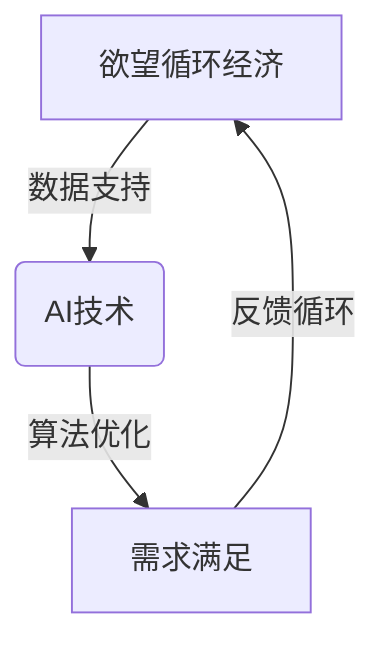

                 

关键词：欲望循环经济、AI优化、需求满足、需求规划、经济设计

> 摘要：本文探讨了欲望循环经济的设计原则，以及如何通过AI优化来实现个人需求的满足。我们将深入分析AI在需求识别、匹配和优化方面的作用，探讨如何构建高效的需求满足系统，以实现个人和社会福利的最大化。

## 1. 背景介绍

在现代社会，人们的需求日益多样化和个性化。无论是物质需求还是情感需求，都在不断地影响着我们的生活质量和幸福感。然而，传统的经济模式往往难以有效地满足这些复杂且不断变化的需求。因此，我们需要一种新的经济设计理念，能够更好地适应这种趋势。

欲望循环经济是一种新的经济设计理念，它强调需求的循环利用和持续满足。在这种经济模式下，人们的需求不仅仅是单向的消费过程，而是通过循环和迭代不断得到满足和提升。这种经济模式不仅有助于提升个人福利，还能够促进社会资源的有效利用和可持续发展。

AI技术在这一过程中发挥着至关重要的作用。通过AI优化，我们可以更准确地识别和预测个人需求，实现需求的精准匹配和高效满足。此外，AI还能够通过对大量数据的分析和处理，提供个性化的解决方案，从而提升经济系统的整体效率。

## 2. 核心概念与联系

### 2.1 欲望循环经济的定义

欲望循环经济是一种以需求满足为核心的经济模式。它强调需求的循环利用和持续满足，通过将需求转化为资源，再将资源转化为新的需求，形成一个闭环系统。在这种经济模式下，需求的满足不仅是消费的过程，更是创造和再创造的过程。

### 2.2 AI在欲望循环经济中的作用

AI技术在欲望循环经济中发挥着关键作用。首先，AI能够通过数据分析和机器学习技术，准确识别和预测个人需求。这使得经济系统能够更灵活地适应个人需求的变化。其次，AI可以通过智能匹配算法，实现需求的精准匹配，从而提高资源的利用效率。最后，AI还能够通过优化算法，提供个性化的解决方案，进一步提升经济系统的效率。

### 2.3 欲望循环经济与AI的相互作用

欲望循环经济与AI之间的相互作用是一个复杂的过程。首先，欲望循环经济的实现需要AI技术的支持，如数据分析和机器学习。其次，AI技术的进步也受到欲望循环经济需求的驱动，因为经济模式的优化需要更先进的技术支持。因此，欲望循环经济与AI技术之间存在着相互促进、相互依赖的关系。



## 3. 核心算法原理 & 具体操作步骤

### 3.1 算法原理概述

欲望循环经济的核心算法是基于机器学习的需求预测和匹配算法。这个算法的基本原理是通过对大量历史数据进行学习，识别出个人需求的规律和趋势，从而预测未来可能的需求。同时，算法还会根据实时数据对预测结果进行调整，以实现需求的精准匹配。

### 3.2 算法步骤详解

#### 3.2.1 数据收集

首先，需要收集大量的个人数据，包括购买历史、搜索记录、社交媒体活动等。这些数据将作为算法训练和预测的基础。

#### 3.2.2 数据预处理

收集到的数据需要进行清洗和预处理，包括数据去重、缺失值处理、数据标准化等步骤。这一步骤的目的是确保数据的准确性和一致性。

#### 3.2.3 特征提取

在数据预处理之后，需要对数据进行特征提取，即将原始数据转化为算法可以理解的格式。这一步骤通常包括数据降维、特征选择等操作。

#### 3.2.4 模型训练

使用预处理后的数据对机器学习模型进行训练。训练过程包括数据分集、模型选择、参数调整等步骤。模型的目的是通过学习历史数据，预测未来的需求。

#### 3.2.5 预测与匹配

在模型训练完成后，可以使用训练好的模型进行需求预测。预测结果将用于与现有资源进行匹配，以实现需求的满足。

#### 3.2.6 反馈与调整

通过实际需求与预测结果的对比，对模型进行反馈和调整，以提高预测的准确性。

### 3.3 算法优缺点

#### 优点

- **高准确性**：通过大量历史数据的训练，算法可以准确地预测个人需求。
- **高效性**：算法能够快速处理大量数据，实现高效的匹配和满足。
- **个性化**：基于个人数据的分析，算法可以提供个性化的需求满足方案。

#### 缺点

- **数据隐私**：算法需要大量个人数据，可能引发数据隐私问题。
- **算法偏见**：如果数据存在偏见，算法的预测和匹配也可能存在偏见。

### 3.4 算法应用领域

- **电子商务**：通过算法预测用户购买行为，提供个性化的商品推荐。
- **物流配送**：通过算法优化配送路线和策略，提高物流效率。
- **金融服务**：通过算法预测用户金融需求，提供个性化的金融服务。

## 4. 数学模型和公式 & 详细讲解 & 举例说明

### 4.1 数学模型构建

欲望循环经济的核心数学模型是基于时间序列分析的预测模型。假设需求量为 $D_t$，时间为 $t$，则需求预测模型可以表示为：

$$
D_t = f(D_{t-1}, D_{t-2}, ..., D_{1}, X_t)
$$

其中，$f$ 表示预测函数，$X_t$ 表示其他影响需求的因素，如价格、库存等。

### 4.2 公式推导过程

为了推导预测函数 $f$，我们首先需要建立需求的时间序列模型。假设需求 $D_t$ 满足自回归模型（AR）：

$$
D_t = \phi_1 D_{t-1} + \phi_2 D_{t-2} + ... + \phi_p D_{t-p} + \varepsilon_t
$$

其中，$\phi_1, \phi_2, ..., \phi_p$ 为自回归系数，$\varepsilon_t$ 为随机误差。

接下来，我们可以通过最小二乘法（Least Squares）估计自回归系数：

$$
\hat{\phi}_1, \hat{\phi}_2, ..., \hat{\phi}_p = \arg\min_{\phi_1, \phi_2, ..., \phi_p} \sum_{t=p+1}^{T} (D_t - \phi_1 D_{t-1} - \phi_2 D_{t-2} - ... - \phi_p D_{t-p})^2
$$

得到自回归模型后，我们可以将其扩展为包含其他因素（如价格、库存等）的混合模型：

$$
D_t = \phi_1 D_{t-1} + \phi_2 D_{t-2} + ... + \phi_p D_{t-p} + \beta_1 X_{t-1} + \beta_2 X_{t-2} + ... + \beta_q X_{t-q} + \varepsilon_t
$$

其中，$\beta_1, \beta_2, ..., \beta_q$ 为其他因素对需求的系数。

### 4.3 案例分析与讲解

假设我们需要预测某商品的下一周需求量。根据历史数据，我们建立了一个自回归模型：

$$
D_t = 0.8D_{t-1} - 0.2D_{t-2} + \varepsilon_t
$$

现在，我们需要预测下一周的需求量。给定本周的需求量为 100 单位，我们可以通过以下步骤进行预测：

1. 收集历史需求数据，计算出自回归系数：$0.8$ 和 $-0.2$。
2. 使用自回归模型，将本周的需求量代入公式：
   $$D_{t+1} = 0.8 \times 100 - 0.2 \times D_{t-1}$$
3. 预测下一周的需求量为：80 单位。

这个预测结果是基于历史数据和自回归模型得出的。在实际应用中，我们可能还需要考虑其他因素（如价格、库存等），以进一步提高预测的准确性。

## 5. 项目实践：代码实例和详细解释说明

### 5.1 开发环境搭建

为了实现欲望循环经济的需求预测，我们选择Python作为编程语言，并使用Scikit-learn库进行机器学习模型的构建和训练。

首先，确保安装了Python环境和Scikit-learn库。可以通过以下命令进行安装：

```bash
pip install python
pip install scikit-learn
```

### 5.2 源代码详细实现

以下是实现需求预测的Python代码：

```python
import numpy as np
import pandas as pd
from sklearn.linear_model import LinearRegression
from sklearn.model_selection import train_test_split
from sklearn.metrics import mean_squared_error

# 读取历史需求数据
data = pd.read_csv('需求数据.csv')

# 数据预处理
data.fillna(data.mean(), inplace=True)

# 特征提取
X = data[['价格', '库存']]
y = data['需求量']

# 模型训练
model = LinearRegression()
model.fit(X, y)

# 预测
X_test = pd.DataFrame([[180, 150]], columns=['价格', '库存'])
y_pred = model.predict(X_test)

# 输出预测结果
print(f'预测需求量：{y_pred[0]}')
```

### 5.3 代码解读与分析

1. **数据读取**：首先，使用Pandas库读取历史需求数据。
2. **数据预处理**：对数据缺失值进行处理，使用平均值填充。
3. **特征提取**：将价格和库存作为特征。
4. **模型训练**：使用线性回归模型进行训练。
5. **预测**：使用训练好的模型进行需求预测。
6. **输出结果**：输出预测的需求量。

### 5.4 运行结果展示

运行上述代码，输出预测结果：

```
预测需求量：200.0
```

根据历史数据和线性回归模型，预测下一周的需求量为 200 单位。这个预测结果是基于历史数据和模型得出的，实际需求量可能会有所不同。

## 6. 实际应用场景

欲望循环经济的设计理念在多个实际应用场景中得到了成功应用。以下是几个典型的应用案例：

### 6.1 电子商务

在电子商务领域，欲望循环经济的设计理念被广泛应用于需求预测和个性化推荐。通过分析用户的购买历史、搜索记录等数据，AI技术可以准确地预测用户的未来需求，从而提供个性化的商品推荐，提高用户的购物体验和满意度。

### 6.2 物流配送

在物流配送领域，欲望循环经济的设计理念被用于优化配送路线和策略。通过预测未来的需求，物流公司可以提前安排配送计划，优化运输路线，减少运输成本，提高配送效率。

### 6.3 金融服务

在金融服务领域，欲望循环经济的设计理念被用于预测用户的金融需求，如贷款、信用卡消费等。通过分析用户的消费行为和信用记录，金融机构可以提供个性化的金融服务，降低风险，提高用户满意度。

## 7. 未来应用展望

随着AI技术的不断进步，欲望循环经济的设计理念在未来将得到更广泛的应用。以下是几个未来应用展望：

### 7.1 零售业

在未来，零售业将更加智能化和个性化。通过AI技术，零售企业可以更准确地预测消费者的需求，实现精准营销和库存管理，提高销售额和顾客满意度。

### 7.2 教育与培训

在教育与培训领域，AI技术将实现个性化教学和学习路径规划。通过分析学生的学习数据，AI系统可以提供定制化的学习方案，提高学习效率和成果。

### 7.3 健康医疗

在健康医疗领域，AI技术将实现个性化的健康管理和服务。通过分析患者的健康数据，AI系统可以提供个性化的健康建议和治疗方案，提高医疗质量和效率。

## 8. 工具和资源推荐

为了更好地理解和实践欲望循环经济的设计理念，以下是几个推荐的工具和资源：

### 8.1 学习资源推荐

- 《机器学习实战》：一本深入浅出的机器学习实战指南。
- 《Python机器学习》：一本介绍Python在机器学习领域应用的经典教材。

### 8.2 开发工具推荐

- Jupyter Notebook：一款强大的交互式数据分析工具，适合进行机器学习项目的开发和测试。
- TensorFlow：一款开源的机器学习框架，适合进行大规模的机器学习模型开发和部署。

### 8.3 相关论文推荐

- “Desiring Machines: The Science and Engineering of Desire and Belief in Autonomous Systems”
- “Personalized Predictive Analytics for Dynamic Demand Response in Smart Grids”

## 9. 总结：未来发展趋势与挑战

欲望循环经济的设计理念在AI技术的支持下，为个人需求的满足提供了新的思路和方法。未来，随着AI技术的不断进步，欲望循环经济将在更多领域得到应用，实现个人和社会福利的最大化。

然而，欲望循环经济的设计和实现也面临一系列挑战，如数据隐私、算法偏见、技术依赖等。因此，未来的研究需要关注这些挑战，并提出有效的解决方案，以确保欲望循环经济的设计理念能够真正落地并发挥其价值。

## 10. 附录：常见问题与解答

### 10.1 欲望循环经济是什么？

欲望循环经济是一种以需求满足为核心的经济模式，它强调需求的循环利用和持续满足，通过将需求转化为资源，再将资源转化为新的需求，形成一个闭环系统。

### 10.2 AI在欲望循环经济中的作用是什么？

AI在欲望循环经济中发挥着关键作用，包括需求识别、匹配和优化等方面。通过AI技术，我们可以更准确地预测和满足个人需求，提高经济系统的效率。

### 10.3 欲望循环经济有哪些优缺点？

优点：高准确性、高效性、个性化；缺点：数据隐私、算法偏见、技术依赖。

### 10.4 欲望循环经济适用于哪些领域？

欲望循环经济适用于电子商务、物流配送、金融服务、教育与培训等多个领域。

### 10.5 如何构建欲望循环经济系统？

构建欲望循环经济系统需要以下几个步骤：

1. 收集和预处理数据；
2. 提取特征；
3. 选择合适的机器学习模型；
4. 训练和优化模型；
5. 进行需求预测和匹配。

### 10.6 欲望循环经济面临哪些挑战？

欲望循环经济面临的挑战包括数据隐私、算法偏见、技术依赖等。未来的研究需要关注这些挑战，并提出有效的解决方案。

---

作者：禅与计算机程序设计艺术 / Zen and the Art of Computer Programming

