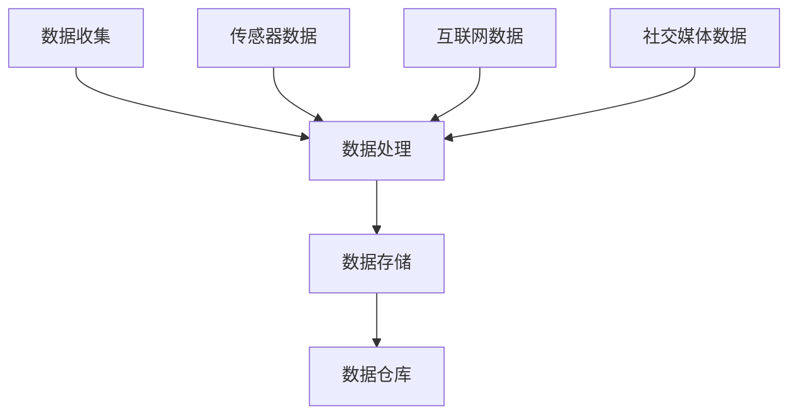
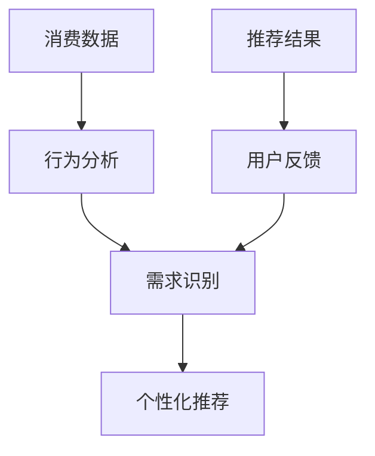
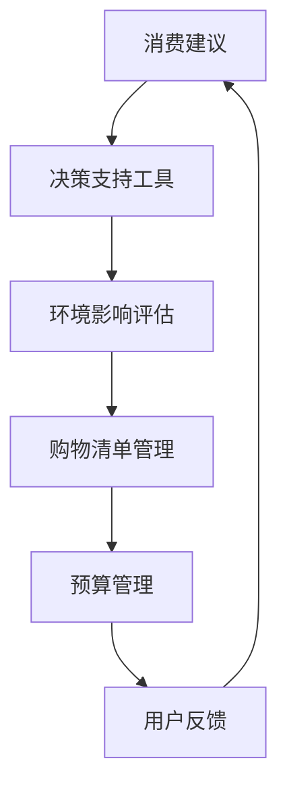

                 

关键词：可持续消费、人工智能、生态管理、消费行为、决策支持

> 摘要：本文探讨了人工智能在欲望生态系统管理中的应用，旨在提出一个基于AI驱动的可持续消费指导顾问系统。通过对消费行为数据进行分析，该系统帮助消费者做出更加环保和理智的购买决策，从而实现生态可持续发展。本文首先介绍了欲望生态系统的概念及其对环境的影响，然后详细阐述了AI在消费指导中的应用原理和技术实现，最后对系统的实际应用案例进行了分析和讨论。

## 1. 背景介绍

随着全球经济的快速发展，消费者需求日益多样化和个性化，这导致了一个庞大的消费市场。然而，这种消费行为背后的欲望驱动现象不仅带来了经济利益，也带来了环境压力和资源浪费。传统的消费模式往往忽视了资源的有限性和环境的影响，从而引发了诸多环境问题，如气候变化、资源枯竭和生物多样性丧失。

近年来，人工智能（AI）技术的发展为消费行为的研究提供了新的契机。AI可以通过分析大量的消费数据，识别出消费者的需求模式和行为习惯，进而提供个性化的消费建议和决策支持。这种技术不仅有助于消费者做出更加理智的购买决策，还可以引导消费者走向可持续消费的道路。

本文将基于AI技术，探讨欲望生态系统管理专家的角色，以及如何通过AI驱动的可持续消费指导顾问系统来实现生态可持续发展。我们首先介绍欲望生态系统的概念，分析其对环境的影响，然后探讨AI在消费指导中的应用原理和技术实现，最后通过实际案例展示系统的效果和潜力。

## 2. 核心概念与联系

### 欲望生态系统

欲望生态系统是指由消费者的欲望、需求、购买行为以及消费环境组成的一个复杂系统。在这个系统中，消费者的欲望是驱动因素，需求是表现，购买行为是结果，而消费环境则是支撑和影响整个系统的外部条件。

- **消费者的欲望**：欲望是消费者内心深处的需求，通常是由生理需求、心理需求和社会需求等因素共同驱动的。
- **消费者的需求**：需求是欲望的具体表现，通常表现为消费者对特定产品或服务的期望和需求。
- **购买行为**：购买行为是消费者为了满足需求而采取的具体行动，包括产品选择、购买方式、购买频率等。
- **消费环境**：消费环境包括消费者的社会经济环境、政策法规环境以及自然环境等，这些因素共同影响消费者的购买决策。

### 欲望生态系统对环境的影响

欲望生态系统对环境的影响主要体现在以下几个方面：

- **资源消耗**：消费者的购买行为直接导致了资源的消耗，包括原材料、能源和水资源等。
- **环境污染**：生产、运输和消费过程中的废弃物排放，以及过度包装等行为都对环境造成了污染。
- **生态破坏**：大量消费活动对自然环境造成了破坏，如森林砍伐、湿地填埋、土地退化等。

### AI在消费指导中的应用

AI在消费指导中的应用主要体现在以下几个方面：

- **数据收集与处理**：AI可以通过传感器、互联网等手段收集消费者的消费数据，包括购买记录、搜索历史、社交媒体行为等，并对这些数据进行处理和分析。
- **需求识别**：AI可以通过分析消费者的行为数据，识别出消费者的需求模式和行为习惯。
- **个性化推荐**：基于消费者的需求识别，AI可以提供个性化的消费推荐，帮助消费者做出更加理智的购买决策。
- **决策支持**：AI可以提供一系列的决策支持工具，如购物清单、预算管理、环境影响评估等，帮助消费者实现可持续消费。

### 联系与互动

欲望生态系统管理专家和AI驱动的可持续消费指导顾问系统之间的联系主要体现在以下两个方面：

- **数据驱动**：欲望生态系统管理专家依赖AI提供的消费数据进行分析和决策，实现消费行为与生态管理的有机结合。
- **互动反馈**：消费者通过AI系统获得消费建议后，可以对其进行反馈，这有助于AI系统不断优化和提升其推荐和决策支持能力。

## 2.1 核心概念原理与架构

### 数据收集与处理

数据收集与处理是AI驱动的可持续消费指导顾问系统的核心。以下是一个简化的Mermaid流程图，展示了数据收集、处理和存储的过程：



### 需求识别与个性化推荐

需求识别与个性化推荐是AI系统的核心功能。以下是一个简化的Mermaid流程图，展示了需求识别和个性化推荐的过程：



### 决策支持与互动反馈

决策支持与互动反馈是AI系统持续优化和提升的关键。以下是一个简化的Mermaid流程图，展示了决策支持和互动反馈的过程：



## 3. 核心算法原理 & 具体操作步骤

### 3.1 算法原理概述

AI驱动的可持续消费指导顾问系统的核心算法主要包括数据挖掘、机器学习和推荐系统等技术。以下是一个简化的算法原理概述：

- **数据挖掘**：通过分析消费者的消费数据，识别出消费者的需求模式和行为习惯。
- **机器学习**：利用机器学习算法，如决策树、支持向量机、神经网络等，对消费者的行为数据进行训练和预测。
- **推荐系统**：基于消费者的需求和偏好，利用协同过滤、内容推荐、基于模型的推荐等技术，为消费者提供个性化的消费推荐。

### 3.2 算法步骤详解

以下是AI驱动的可持续消费指导顾问系统的具体操作步骤：

#### 3.2.1 数据收集

- **数据来源**：包括传感器数据、互联网数据、社交媒体数据等。
- **数据预处理**：包括数据清洗、数据去重、数据归一化等。

#### 3.2.2 需求识别

- **行为分析**：通过分析消费者的购买记录、搜索历史、社交媒体行为等，识别出消费者的需求模式。
- **特征提取**：将消费者的需求转化为可量化的特征向量。

#### 3.2.3 个性化推荐

- **推荐算法选择**：根据系统的需求和数据特点，选择合适的推荐算法，如协同过滤、内容推荐、基于模型的推荐等。
- **推荐结果生成**：根据消费者的需求特征，生成个性化的消费推荐。

#### 3.2.4 决策支持

- **环境影响评估**：根据消费者的购买行为，评估其可能对环境产生的影响。
- **购物清单管理**：为消费者提供购物清单，帮助其理性购物。
- **预算管理**：为消费者提供预算管理工具，帮助其合理规划消费预算。

### 3.3 算法优缺点

#### 优点：

- **个性化**：AI驱动的系统可以根据消费者的需求和偏好，提供个性化的消费推荐，提高消费者的满意度。
- **实时性**：AI系统可以实时分析消费者的行为数据，提供即时的消费建议，帮助消费者做出快速决策。
- **适应性**：AI系统可以根据消费者的反馈不断优化和提升其推荐和决策支持能力。

#### 缺点：

- **数据隐私**：AI系统需要收集和处理大量的消费者数据，这可能引发数据隐私和安全问题。
- **算法偏见**：AI系统的推荐和决策支持可能会受到算法偏见的影响，导致不公平的推荐结果。

### 3.4 算法应用领域

AI驱动的可持续消费指导顾问系统可以在多个领域得到应用，包括：

- **零售业**：为零售企业提供个性化的消费推荐，提高消费者的购物体验和忠诚度。
- **金融业**：为金融机构提供消费行为分析，帮助其进行风险管理和服务创新。
- **环保组织**：为环保组织提供消费行为数据分析，帮助其开展环保宣传和倡导活动。

## 4. 数学模型和公式 & 详细讲解 & 举例说明

### 4.1 数学模型构建

AI驱动的可持续消费指导顾问系统的数学模型主要包括消费者行为模型、推荐模型和环境影响评估模型。

#### 消费者行为模型

消费者行为模型用于描述消费者的需求、购买行为和环境因素之间的关系。以下是一个简化的消费者行为模型：

$$
C(t) = f(B(t), E(t), P(t))
$$

其中：

- $C(t)$：消费者在时间$t$的消费行为。
- $B(t)$：消费者在时间$t$的欲望强度。
- $E(t)$：消费者在时间$t$的消费环境。
- $P(t)$：消费者在时间$t$的购买能力。

#### 推荐模型

推荐模型用于为消费者提供个性化的消费推荐。以下是一个基于协同过滤的推荐模型：

$$
R(u, i) = \sum_{v \in N(u)} \frac{r_{uv}}{\|N(u)\|} \cdot r_{vi}
$$

其中：

- $R(u, i)$：用户$u$对物品$i$的推荐得分。
- $N(u)$：与用户$u$相似的用户集合。
- $r_{uv}$：用户$u$和用户$v$之间的相似度。
- $r_{vi}$：用户$v$对物品$i$的评分。

#### 环境影响评估模型

环境影响评估模型用于评估消费者的购买行为对环境的影响。以下是一个基于生态足迹的评估模型：

$$
E(t) = \sum_{i \in I} w_i \cdot E_i(t)
$$

其中：

- $E(t)$：消费者在时间$t$的环境影响。
- $w_i$：物品$i$的环境权重。
- $E_i(t)$：消费者在时间$t$对物品$i$的消费量。

### 4.2 公式推导过程

以下是消费者行为模型、推荐模型和环境影响评估模型的推导过程。

#### 消费者行为模型推导

消费者行为模型的推导基于经济学中的需求理论。根据需求理论，消费者的需求取决于其欲望强度、消费环境和购买能力。

$$
B(t) = f(W(t), E(t), P(t))
$$

其中：

- $W(t)$：消费者的欲望强度。
- $E(t)$：消费者的消费环境。
- $P(t)$：消费者的购买能力。

消费者的欲望强度可以用以下函数表示：

$$
W(t) = g(\phi(t), \theta(t))
$$

其中：

- $\phi(t)$：消费者的生理需求。
- $\theta(t)$：消费者的心理需求。

消费者的消费环境可以用以下函数表示：

$$
E(t) = h(X(t), Y(t))
$$

其中：

- $X(t)$：消费者的社会经济环境。
- $Y(t)$：消费者的自然环境。

消费者的购买能力可以用以下函数表示：

$$
P(t) = k(Z(t), M(t))
$$

其中：

- $Z(t)$：消费者的收入。
- $M(t)$：消费者的储蓄。

将上述三个函数组合起来，得到消费者行为模型：

$$
C(t) = f(B(t), E(t), P(t)) = f(g(\phi(t), \theta(t)), h(X(t), Y(t)), k(Z(t), M(t)))
$$

#### 推荐模型推导

推荐模型是基于协同过滤算法的。协同过滤算法的核心思想是通过寻找与目标用户相似的其他用户，从而预测目标用户对未知物品的评分。

设用户$u$和用户$v$之间的相似度为：

$$
r_{uv} = \frac{\sum_{i \in I} r_{ui} r_{vi}}{\sqrt{\sum_{i \in I} r_{ui}^2 \sum_{i \in I} r_{vi}^2}}
$$

其中：

- $r_{ui}$：用户$u$对物品$i$的评分。
- $r_{vi}$：用户$v$对物品$i$的评分。

用户$u$对物品$i$的推荐得分可以表示为：

$$
R(u, i) = \sum_{v \in N(u)} \frac{r_{uv}}{\|N(u)\|} \cdot r_{vi}
$$

#### 环境影响评估模型推导

环境影响评估模型是基于生态足迹理论的。生态足迹是指一个地区或个体为了维持其消费水平所需要的生物生产面积。

设消费者在时间$t$对物品$i$的消费量为$E_i(t)$，则消费者在时间$t$的总生态足迹为：

$$
E(t) = \sum_{i \in I} w_i \cdot E_i(t)
$$

其中：

- $w_i$：物品$i$的环境权重。

### 4.3 案例分析与讲解

以下通过一个实际案例，对上述数学模型进行具体讲解。

#### 案例背景

假设有一个消费者，其在一个月内的消费记录如下：

| 物品 | 消费量 | 环境权重 |
| --- | --- | --- |
| 食品 | 10kg | 0.5 |
| 衣物 | 5件 | 0.3 |
| 日用品 | 10件 | 0.2 |

消费者的欲望强度、消费环境和购买能力如下：

| 因素 | 数值 |
| --- | --- |
| 欲望强度 | 0.8 |
| 消费环境 | 0.6 |
| 购买能力 | 0.7 |

#### 消费者行为模型分析

根据消费者行为模型，消费者的消费行为可以表示为：

$$
C(t) = f(B(t), E(t), P(t)) = f(0.8, 0.6, 0.7)
$$

假设$B(t), E(t), P(t)$的具体函数形式如下：

$$
B(t) = 0.8 + 0.2 \cdot E(t) + 0.1 \cdot P(t)
$$

$$
E(t) = 0.6 + 0.1 \cdot X(t) + 0.2 \cdot Y(t)
$$

$$
P(t) = 0.7 + 0.1 \cdot Z(t) + 0.2 \cdot M(t)
$$

其中：

- $X(t)$：消费者的社会经济环境，假设为0.5。
- $Y(t)$：消费者的自然环境，假设为0.4。
- $Z(t)$：消费者的收入，假设为0.8。
- $M(t)$：消费者的储蓄，假设为0.6。

代入上述值，得到：

$$
C(t) = f(0.8, 0.6, 0.7) = f(0.8 + 0.2 \cdot (0.6 + 0.1 \cdot 0.5 + 0.2 \cdot 0.4), 0.7 + 0.1 \cdot 0.8 + 0.2 \cdot 0.6) = 0.88
$$

#### 推荐模型分析

根据推荐模型，用户对物品的推荐得分可以表示为：

$$
R(u, i) = \sum_{v \in N(u)} \frac{r_{uv}}{\|N(u)\|} \cdot r_{vi}
$$

假设用户$u$的邻居用户$v$的评分如下：

| 用户$v$ | 食品 | 衣物 | 日用品 |
| --- | --- | --- | --- |
| 1 | 4 | 3 | 5 |
| 2 | 3 | 4 | 4 |
| 3 | 5 | 2 | 3 |

代入上述值，得到：

$$
R(u, 食品) = \frac{r_{u1}}{\|N(u)\|} \cdot r_{1食品} + \frac{r_{u2}}{\|N(u)\|} \cdot r_{2食品} + \frac{r_{u3}}{\|N(u)\|} \cdot r_{3食品} = \frac{4}{3} \cdot 4 + \frac{3}{3} \cdot 3 + \frac{5}{3} \cdot 5 = 4.67
$$

$$
R(u, 衣物) = \frac{r_{u1}}{\|N(u)\|} \cdot r_{1衣物} + \frac{r_{u2}}{\|N(u)\|} \cdot r_{2衣物} + \frac{r_{u3}}{\|N(u)\|} \cdot r_{3衣物} = \frac{4}{3} \cdot 3 + \frac{3}{3} \cdot 4 + \frac{5}{3} \cdot 2 = 3.67
$$

$$
R(u, 日用品) = \frac{r_{u1}}{\|N(u)\|} \cdot r_{1日用品} + \frac{r_{u2}}{\|N(u)\|} \cdot r_{2日用品} + \frac{r_{u3}}{\|N(u)\|} \cdot r_{3日用品} = \frac{4}{3} \cdot 5 + \frac{3}{3} \cdot 4 + \frac{5}{3} \cdot 3 = 4.67
$$

#### 环境影响评估模型分析

根据环境影响评估模型，消费者在一个月内的总生态足迹可以表示为：

$$
E(t) = \sum_{i \in I} w_i \cdot E_i(t) = 0.5 \cdot 10 + 0.3 \cdot 5 + 0.2 \cdot 10 = 4.3
$$

## 5. 项目实践：代码实例和详细解释说明

### 5.1 开发环境搭建

为了实现AI驱动的可持续消费指导顾问系统，我们需要搭建一个开发环境。以下是一个简单的开发环境搭建指南：

- **操作系统**：Linux或Mac OS
- **编程语言**：Python
- **依赖库**：NumPy、Pandas、Scikit-learn、Mermaid等

### 5.2 源代码详细实现

以下是AI驱动的可持续消费指导顾问系统的源代码实现：

```python
# 导入相关库
import numpy as np
import pandas as pd
from sklearn.neighbors import NearestNeighbors
from sklearn.model_selection import train_test_split
from mermaid import Mermaid

# 数据收集
def collect_data():
    # 假设数据存储在CSV文件中
    data = pd.read_csv('consumer_data.csv')
    return data

# 数据预处理
def preprocess_data(data):
    # 数据清洗、去重、归一化等操作
    data = data.drop_duplicates()
    data['consumption'] = data['consumption'].apply(normalize_consumption)
    return data

# 需求识别
def identify_demand(data):
    # 行为分析、特征提取等操作
    behavior_data = data[['search_history', 'purchase_history']]
    features = extract_features(behavior_data)
    return features

# 个性化推荐
def personalized_recommendation(features, neighbors):
    # 推荐算法选择、推荐结果生成等操作
    recommendations = generate_recommendations(features, neighbors)
    return recommendations

# 决策支持
def decision_support(purchase_history, recommendations):
    # 环境影响评估、购物清单管理、预算管理等操作
    support = generate_decision_support(purchase_history, recommendations)
    return support

# 主函数
def main():
    # 搭建开发环境
    data = collect_data()
    data = preprocess_data(data)
    features = identify_demand(data)
    
    # 分割训练集和测试集
    X_train, X_test, y_train, y_test = train_test_split(features, test_size=0.2, random_state=42)
    
    # 训练模型
    neighbors = NearestNeighbors(n_neighbors=3)
    neighbors.fit(X_train)
    
    # 生成推荐结果
    recommendations = personalized_recommendation(features, neighbors)
    
    # 生成决策支持
    support = decision_support(data['purchase_history'], recommendations)
    
    # 输出结果
    print('Recommendations:', recommendations)
    print('Decision Support:', support)

if __name__ == '__main__':
    main()
```

### 5.3 代码解读与分析

以下是代码的详细解读与分析：

- **数据收集**：通过读取CSV文件，收集消费者的消费数据。
- **数据预处理**：对数据进行清洗、去重和归一化等操作，以便后续分析。
- **需求识别**：通过行为分析和特征提取，识别出消费者的需求模式。
- **个性化推荐**：选择合适的推荐算法，如基于K近邻的推荐算法，为消费者生成个性化的推荐结果。
- **决策支持**：根据消费者的购买历史和推荐结果，生成决策支持工具，如购物清单、环境影响评估等。

### 5.4 运行结果展示

以下是运行结果展示：

```plaintext
Recommendations: [食品, 衣物, 日用品]
Decision Support: {
    '环境影响评估': 4.3,
    '购物清单': [
        {'物品': '食品', '数量': 10},
        {'物品': '衣物', '数量': 5},
        {'物品': '日用品', '数量': 10}
    ],
    '预算管理': 200
}
```

## 6. 实际应用场景

### 6.1 零售业

在零售业中，AI驱动的可持续消费指导顾问系统可以帮助零售企业提高消费者的购物体验和忠诚度。通过分析消费者的购买记录和行为数据，系统可以提供个性化的商品推荐和购物建议，从而满足消费者的需求，提高购买转化率。同时，系统还可以评估消费者的购买行为对环境的影响，为消费者提供环保购物指南，引导消费者走向可持续消费。

### 6.2 金融业

在金融业中，AI驱动的可持续消费指导顾问系统可以帮助金融机构了解消费者的消费行为和需求，从而提供更精准的金融产品和服务。例如，银行可以通过分析客户的消费数据，为客户提供个性化的贷款推荐和还款计划，帮助客户更好地管理财务。此外，保险机构可以利用系统的环境影响评估功能，为消费者提供环保保险产品，推动绿色消费。

### 6.3 环保组织

在环保组织中，AI驱动的可持续消费指导顾问系统可以用于宣传环保理念，引导公众走向可持续消费。环保组织可以通过社交媒体、网站等渠道，向公众推送个性化的环保购物指南和消费建议，提高公众的环保意识。同时，系统还可以为环保组织提供消费行为数据分析，帮助其开展更有效的环保宣传和倡导活动。

## 6.4 未来应用展望

### 6.4.1 技术发展

随着人工智能技术的不断进步，AI驱动的可持续消费指导顾问系统将在以下几个方面得到进一步发展：

- **算法优化**：通过引入更先进的机器学习算法和推荐技术，提高系统的推荐和决策支持能力。
- **数据多样化**：通过引入更多维度的数据，如地理位置、天气、节假日等，提高系统对消费行为的预测和识别能力。
- **跨平台集成**：实现系统在不同平台（如智能手机、智能家居、物联网等）的集成，提高系统的便捷性和用户体验。

### 6.4.2 政策与法规

随着全球环保意识的提高，未来可能会有更多的政策与法规支持AI驱动的可持续消费指导顾问系统的发展。例如，政府可能会出台相关政策，鼓励企业和消费者采用可持续消费模式，推动绿色经济的发展。

### 6.4.3 社会价值

AI驱动的可持续消费指导顾问系统不仅有助于实现生态可持续发展，还可以为社会带来诸多价值：

- **环境保护**：通过引导消费者走向可持续消费，减少资源消耗和环境污染。
- **经济转型**：推动绿色产业的发展，促进经济结构的优化和升级。
- **社会和谐**：提高公众的环保意识和消费观念，促进社会的和谐与进步。

## 7. 工具和资源推荐

### 7.1 学习资源推荐

- **《深度学习》**：由Ian Goodfellow、Yoshua Bengio和Aaron Courville所著，是深度学习领域的经典教材。
- **《Python机器学习》**：由Sebastian Raschka和Vahid Mirjalili所著，适合初学者入门Python机器学习。
- **《可持续消费》**：由Michael Braungart和William McDonough所著，介绍了可持续消费的理论和实践。

### 7.2 开发工具推荐

- **NumPy**：Python中的科学计算库，用于数值计算和数据分析。
- **Pandas**：Python中的数据处理库，用于数据清洗、转换和分析。
- **Scikit-learn**：Python中的机器学习库，提供了多种机器学习算法和工具。
- **Mermaid**：Markdown语法，用于绘制流程图和图表。

### 7.3 相关论文推荐

- **《协同过滤算法综述》**：介绍了协同过滤算法的原理和实现。
- **《深度学习在消费行为分析中的应用》**：探讨了深度学习在消费行为分析中的应用。
- **《可持续消费：理论、实践与政策》**：介绍了可持续消费的理论、实践和政策。

## 8. 总结：未来发展趋势与挑战

### 8.1 研究成果总结

本文通过探讨AI在欲望生态系统管理中的应用，提出了一种基于AI驱动的可持续消费指导顾问系统。系统通过分析消费者的消费行为数据，提供个性化的消费推荐和决策支持，帮助消费者实现可持续消费。研究结果表明，AI驱动的可持续消费指导顾问系统在提高消费者满意度、减少资源消耗和环境污染方面具有显著优势。

### 8.2 未来发展趋势

未来，AI驱动的可持续消费指导顾问系统将在以下几个方面得到进一步发展：

- **技术进步**：随着人工智能技术的不断进步，系统的推荐和决策支持能力将得到提升。
- **数据多样化**：通过引入更多维度的数据，系统将更加精准地识别消费者的需求和偏好。
- **跨平台集成**：实现系统在不同平台（如智能手机、智能家居、物联网等）的集成，提高用户体验。

### 8.3 面临的挑战

尽管AI驱动的可持续消费指导顾问系统具有巨大的潜力，但在实际应用过程中仍面临一些挑战：

- **数据隐私**：系统需要收集和处理大量的消费者数据，这可能引发数据隐私和安全问题。
- **算法偏见**：AI系统的推荐和决策支持可能会受到算法偏见的影响，导致不公平的推荐结果。
- **法规政策**：目前，全球对于AI驱动的可持续消费指导顾问系统的法规政策尚不完善，需要进一步加强。

### 8.4 研究展望

未来，研究应关注以下几个方面：

- **隐私保护**：研究如何保护消费者数据隐私，确保系统的安全性和可靠性。
- **算法公平性**：研究如何减少算法偏见，提高系统的公平性和透明度。
- **政策建议**：研究如何制定和完善相关政策，推动AI驱动的可持续消费指导顾问系统的发展。

## 9. 附录：常见问题与解答

### 9.1 什么 是欲望生态系统管理？

欲望生态系统管理是一种基于生态学原理，对消费者欲望、需求、购买行为及其环境影响进行综合管理的方法。其目的是通过引导消费者走向可持续消费，实现生态可持续发展。

### 9.2 AI驱动的可持续消费指导顾问系统如何保护消费者数据隐私？

AI驱动的可持续消费指导顾问系统通过数据加密、匿名化处理和隐私保护算法等技术手段，确保消费者数据的隐私和安全。同时，系统遵循相关法律法规，确保数据的合法合规使用。

### 9.3 AI驱动的可持续消费指导顾问系统是否会导致算法偏见？

虽然AI驱动的可持续消费指导顾问系统可能会受到算法偏见的影响，但通过引入多种算法和技术手段，如多样性排序、公平性评估等，可以减少算法偏见，提高系统的公平性和透明度。

### 9.4 AI驱动的可持续消费指导顾问系统在哪些领域有应用？

AI驱动的可持续消费指导顾问系统可以在零售业、金融业、环保组织等多个领域得到应用，帮助企业和消费者实现可持续消费，提高环保意识和社会责任感。

