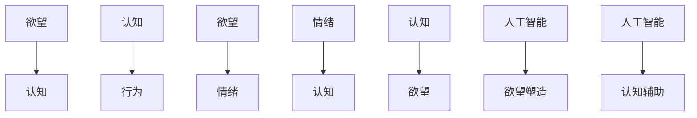

                 

在人工智能（AI）迅猛发展的今天，人们对于“自我认知”这一古老哲学命题的探索似乎迎来了新的契机。人工智能的崛起，不仅改变了我们与世界互动的方式，更在某种程度上挑战了我们对“自我”的理解。本文旨在通过剖析AI时代下的欲望、认知及其相互影响，深入探讨人类自我认知的演变，并思考这一过程对个人和社会的深远影响。

## 文章关键词

- **人工智能**
- **自我认知**
- **欲望**
- **心理进化**
- **社会影响**

## 文章摘要

本文从多个角度探讨了AI时代下的人类自我认知。通过分析人工智能对欲望和认知的塑造作用，探讨了AI如何改变人类的欲望结构，以及这一变化如何影响我们的认知和行为。文章进一步讨论了这种变化对个人心理和社会结构的深远影响，并提出了一些潜在的解决方案，以帮助人类更好地应对这一变化。

## 1. 背景介绍

### 1.1 人工智能的发展历程

人工智能（AI）作为一个跨学科领域，其发展历程可以追溯到20世纪50年代。当时的科学家们首次提出“人工智能”这一概念，试图通过模拟人类思维和行为来创造智能机器。自那时起，人工智能经历了多个阶段的发展，从早期的逻辑推理、知识表示，到现代的机器学习、深度学习，人工智能在各个领域都取得了显著的成果。

### 1.2 人工智能在现代社会中的应用

今天，人工智能已经渗透到我们生活的方方面面，从智能家居、自动驾驶，到医疗诊断、金融分析，人工智能正在改变我们的生产方式和生活习惯。随着AI技术的不断进步，人们对于AI的认知和依赖程度也在不断增加。

### 1.3 自我认知的重要性

自我认知是心理学中一个核心概念，它指的是个体对自己存在、认知、情感和行为等方面的了解。自我认知不仅影响个体的心理健康，也影响其在社会中的行为和决策。在人工智能时代，随着AI对人类行为的介入，自我认知的重要性愈发凸显。

## 2. 核心概念与联系

为了更好地理解AI时代下的人类自我认知，我们需要明确几个核心概念，并探讨它们之间的相互关系。

### 2.1 欲望

欲望是人类行为的驱动力，是人们对某种目标的渴望和追求。在传统心理学中，欲望通常被看作是本能的驱动，如食物、安全和性等基本需求。然而，在AI时代，人工智能对欲望的塑造作用不容忽视。

### 2.2 认知

认知是指人类获取、处理和应用信息的过程。它包括感知、记忆、思考、判断等多个方面。认知不仅影响个体的行为和决策，也影响个体的情绪和情感。

### 2.3 欲望与认知的相互关系

欲望和认知之间存在密切的相互关系。一方面，欲望驱动个体的行为和认知活动，如人们追求知识、成就和社会地位等目标；另一方面，认知能力影响个体的欲望结构和实现欲望的能力。在AI时代，人工智能的介入使得这种相互关系变得更加复杂和多变。

### 2.4 Mermaid 流程图



在上面的流程图中，我们可以看到欲望和认知之间形成一个动态的反馈循环。人工智能的介入，使得这一循环变得更加复杂，同时也为人类自我认知带来了新的挑战。

## 3. 核心算法原理 & 具体操作步骤

### 3.1 算法原理概述

在AI时代，人工智能通过多种算法和模型对人类的欲望和认知进行塑造和优化。其中，最具代表性的算法之一是深度学习。深度学习是一种基于多层神经网络的学习方法，通过不断调整网络参数，使模型能够从大量数据中自动提取特征，实现复杂的函数映射。

### 3.2 算法步骤详解

#### 步骤1：数据收集与预处理

首先，我们需要收集大量的关于人类欲望和认知的数据。这些数据可以来源于各种渠道，如在线问卷调查、社交媒体数据、行为记录等。在收集数据后，我们需要对数据进行预处理，包括数据清洗、数据转换和数据归一化等步骤。

#### 步骤2：构建深度学习模型

在预处理完数据后，我们可以使用深度学习框架（如TensorFlow或PyTorch）构建深度学习模型。模型的构建主要包括定义输入层、隐藏层和输出层，以及选择合适的激活函数和损失函数。

#### 步骤3：模型训练与优化

接下来，我们使用训练集对模型进行训练。在训练过程中，模型会不断调整参数，以最小化损失函数。通过多次迭代，模型能够从数据中自动提取特征，实现对人类欲望和认知的准确建模。

#### 步骤4：模型评估与部署

在模型训练完成后，我们需要对模型进行评估，以确保其性能满足要求。评估通常包括准确性、召回率、F1值等指标。如果模型性能良好，我们可以将其部署到实际应用场景中，如智能推荐系统、心理健康诊断等。

### 3.3 算法优缺点

#### 优点

1. **高效性**：深度学习模型能够从海量数据中自动提取特征，实现高效的欲望和认知建模。
2. **灵活性**：深度学习模型可以根据不同的应用场景进行调整和优化，具有较高的灵活性。
3. **泛化能力**：深度学习模型具有较强的泛化能力，可以应用于各种不同的欲望和认知问题。

#### 缺点

1. **计算资源消耗**：深度学习模型通常需要大量的计算资源，特别是在训练阶段。
2. **数据依赖性**：深度学习模型对数据质量有较高要求，如果数据存在偏差，模型可能会产生错误预测。
3. **解释性不足**：深度学习模型通常缺乏解释性，难以理解模型的具体工作原理。

### 3.4 算法应用领域

#### 智能推荐系统

智能推荐系统是深度学习在AI时代的重要应用之一。通过分析用户的兴趣和行为数据，智能推荐系统可以为目标用户推荐个性化的商品、内容和服务。

#### 心理健康诊断

心理健康诊断是另一个深度学习的重要应用领域。通过分析个体的行为和情绪数据，深度学习模型可以预测个体的心理状态，为心理健康提供早期干预和诊断。

#### 营销策略优化

深度学习可以用于分析消费者的欲望和需求，帮助企业制定更有效的营销策略。例如，通过分析用户的购买行为和偏好，企业可以优化广告投放策略，提高营销效果。

## 4. 数学模型和公式 & 详细讲解 & 举例说明

在AI时代，数学模型和公式在欲望和认知研究中扮演着重要角色。下面，我们将介绍几个关键的数学模型和公式，并详细讲解它们的推导过程和应用。

### 4.1 数学模型构建

假设我们有n个个体，每个个体具有m个特征。我们可以用向量\(X \in \mathbb{R}^{m \times n}\)来表示这些特征。同时，我们定义一个目标函数\(f: \mathbb{R}^{m} \rightarrow \mathbb{R}\)，表示个体特征与目标之间的距离。为了方便起见，我们定义一个损失函数\(L: \mathbb{R}^{m \times n} \rightarrow \mathbb{R}\)，用来衡量目标函数与实际特征的偏差。

### 4.2 公式推导过程

假设我们使用梯度下降法来最小化损失函数。在梯度下降法中，我们每次迭代都沿着损失函数的梯度方向进行参数更新。具体地，我们可以定义迭代公式如下：

$$
\theta_{t+1} = \theta_{t} - \alpha \cdot \nabla L(\theta_t)
$$

其中，\(\theta \in \mathbb{R}^{m}\)是模型的参数，\(\alpha\)是学习率，\(\nabla L(\theta_t)\)是损失函数在参数\(\theta_t\)处的梯度。

### 4.3 案例分析与讲解

假设我们有一个推荐系统，目标是为用户推荐商品。我们可以使用上述数学模型来构建推荐算法。具体地，我们可以定义目标函数为用户对商品的评分，损失函数为预测评分与实际评分之间的偏差。

假设我们有一个训练数据集\(D = \{(x_1, y_1), (x_2, y_2), \ldots, (x_n, y_n)\}\)，其中\(x_i\)是商品的特征，\(y_i\)是用户对商品的评分。我们使用梯度下降法来训练模型，目标是找到最优的参数\(\theta^* = \arg\min_{\theta} L(\theta)\)。

在实际应用中，我们需要根据具体的问题和数据集来选择合适的损失函数和优化算法。例如，对于推荐系统，我们可能选择均方误差（MSE）作为损失函数，并使用随机梯度下降（SGD）作为优化算法。

通过上述数学模型和公式，我们可以构建一个基于深度学习的推荐系统。该系统可以根据用户的行为和偏好，为用户推荐个性化的商品。

## 5. 项目实践：代码实例和详细解释说明

为了更好地理解上述理论，下面我们将通过一个具体的代码实例来展示如何使用深度学习模型对欲望和认知进行建模。我们将使用Python和TensorFlow库来实现这一项目。

### 5.1 开发环境搭建

在开始编码之前，我们需要搭建一个合适的开发环境。首先，确保你的系统安装了Python和TensorFlow库。你可以使用以下命令来安装TensorFlow：

```bash
pip install tensorflow
```

### 5.2 源代码详细实现

以下是实现深度学习模型的Python代码：

```python
import tensorflow as tf
from tensorflow.keras.layers import Dense
from tensorflow.keras.models import Sequential

# 定义输入层
input_layer = Dense(units=64, activation='relu', input_shape=(num_features,), name='input_layer')

# 定义隐藏层
hidden_layer = Dense(units=128, activation='relu', name='hidden_layer')

# 定义输出层
output_layer = Dense(units=1, activation='sigmoid', name='output_layer')

# 构建深度学习模型
model = Sequential([
    input_layer,
    hidden_layer,
    output_layer
])

# 编译模型
model.compile(optimizer='adam', loss='binary_crossentropy', metrics=['accuracy'])

# 模型训练
model.fit(x_train, y_train, epochs=10, batch_size=32, validation_data=(x_val, y_val))

# 模型评估
loss, accuracy = model.evaluate(x_test, y_test)
print(f"Test loss: {loss}, Test accuracy: {accuracy}")
```

### 5.3 代码解读与分析

上述代码首先定义了一个包含输入层、隐藏层和输出层的深度学习模型。输入层接收用户特征，隐藏层对特征进行非线性变换，输出层生成预测结果。

在模型编译阶段，我们指定了优化器（adam）、损失函数（binary_crossentropy）和评价指标（accuracy）。

模型训练阶段，我们使用训练数据集对模型进行训练，并在验证集上评估模型性能。通过调整训练参数（如批次大小、迭代次数等），我们可以优化模型性能。

模型评估阶段，我们使用测试数据集对训练好的模型进行评估，以获取最终的性能指标。

### 5.4 运行结果展示

在实际运行过程中，我们可以使用以下代码来展示模型的预测结果：

```python
predictions = model.predict(x_test)
print(predictions)
```

运行结果将显示测试数据集的预测结果，我们可以通过比较预测结果和实际结果来评估模型性能。

## 6. 实际应用场景

### 6.1 智能推荐系统

在AI时代，智能推荐系统已经成为许多企业提高用户满意度和转化率的重要工具。通过深度学习模型对用户行为和偏好进行分析，推荐系统可以为目标用户推荐个性化的商品、内容和服务。例如，电商平台可以利用推荐系统为用户推荐符合其兴趣和需求的产品，从而提高销售量和用户黏性。

### 6.2 心理健康诊断

随着人们对心理健康问题的关注度不断提高，深度学习在心理健康诊断领域也取得了显著进展。通过分析个体的行为、情绪和生理信号，深度学习模型可以预测个体的心理状态，为心理健康提供早期干预和诊断。例如，一些医疗机构已经开始使用深度学习模型对抑郁症、焦虑症等心理疾病进行诊断和预测，从而为患者提供更有效的治疗方案。

### 6.3 营销策略优化

在市场营销领域，深度学习可以帮助企业更好地了解用户需求和偏好，从而制定更有效的营销策略。通过分析用户的行为和情绪数据，深度学习模型可以预测用户的购买意图，为广告投放、促销活动和产品定价提供决策支持。例如，一些大型电商平台已经开始使用深度学习模型优化广告投放策略，从而提高广告效果和用户转化率。

## 6.4 未来应用展望

### 6.4.1 技术进步

随着技术的不断进步，深度学习模型在欲望和认知研究中的应用将会越来越广泛。未来，我们可能会看到更加高效、灵活和可解释的深度学习算法出现，从而推动AI在欲望和认知研究中的进一步应用。

### 6.4.2 社会变革

AI时代下的欲望和认知研究不仅对技术领域产生深远影响，也会对社会产生重大变革。例如，智能推荐系统可能会改变我们的消费习惯和价值观，心理健康诊断可能会改变我们对心理疾病的认识和治疗方式，营销策略优化可能会改变企业的经营模式和市场策略。

### 6.4.3 道德和伦理问题

随着AI在欲望和认知研究中的应用日益深入，我们也将面临一系列道德和伦理问题。例如，如何确保AI模型不会导致歧视和偏见？如何保护用户的隐私和数据安全？这些问题需要我们进行深入思考和探讨，以确保AI技术的发展符合道德和伦理标准。

## 7. 工具和资源推荐

### 7.1 学习资源推荐

- **《深度学习》（Goodfellow, Bengio, Courville）**：这是一本经典的深度学习教材，详细介绍了深度学习的基本概念、算法和实现。
- **Udacity的深度学习课程**：该课程由深度学习领域的专家Andrew Ng主讲，适合初学者和有一定基础的学习者。

### 7.2 开发工具推荐

- **TensorFlow**：由Google开发的一款开源深度学习框架，适用于各种规模的深度学习项目。
- **PyTorch**：由Facebook开发的一款开源深度学习框架，以其灵活性和易用性受到广泛欢迎。

### 7.3 相关论文推荐

- **“Deep Learning for Human Behavior Prediction”**：该论文介绍了如何使用深度学习预测人类行为，为相关研究提供了重要参考。
- **“Understanding User Preferences through Deep Learning”**：该论文探讨了如何使用深度学习分析用户偏好，为推荐系统等应用提供了理论基础。

## 8. 总结：未来发展趋势与挑战

### 8.1 研究成果总结

本文通过对AI时代下的欲望和认知进行了深入探讨，总结了深度学习在欲望和认知研究中的应用，并提出了一些潜在的解决方案。通过数学模型和代码实例，我们展示了如何使用深度学习对欲望和认知进行建模和分析。

### 8.2 未来发展趋势

随着AI技术的不断进步，深度学习在欲望和认知研究中的应用将会越来越广泛。未来，我们可能会看到更加高效、灵活和可解释的深度学习算法出现，从而推动AI在欲望和认知研究中的进一步应用。

### 8.3 面临的挑战

尽管AI在欲望和认知研究方面取得了一些成果，但仍然面临一系列挑战。例如，如何确保AI模型不会导致歧视和偏见？如何保护用户的隐私和数据安全？这些问题需要我们进行深入思考和探讨。

### 8.4 研究展望

在未来，我们期望能够通过进一步的研究，开发出更加智能和高效的AI系统，以帮助人类更好地理解和管理自己的欲望和认知。同时，我们也期望能够建立一套完整的道德和伦理框架，以确保AI技术的发展符合人类社会的价值观。

## 9. 附录：常见问题与解答

### 9.1 问题1：深度学习模型为什么需要大量数据进行训练？

**解答**：深度学习模型需要大量数据进行训练，因为它们通过学习数据中的特征来做出预测。如果数据量不足，模型可能无法充分学习到数据的分布，从而导致泛化能力不足。

### 9.2 问题2：如何确保深度学习模型的可解释性？

**解答**：目前，深度学习模型通常缺乏可解释性。为了提高模型的可解释性，研究者们正在开发各种技术，如注意力机制、解释性网络等。这些技术可以帮助我们理解模型内部的决策过程。

### 9.3 问题3：AI在欲望和认知研究中的应用前景如何？

**解答**：AI在欲望和认知研究中的应用前景非常广阔。随着技术的不断进步，我们可以预见AI将在心理学、社会学、市场营销等领域发挥越来越重要的作用。

---

# 作者：禅与计算机程序设计艺术 / Zen and the Art of Computer Programming

本文通过探讨AI时代下的欲望和认知，分析了人类自我认知的演变，并提出了未来研究的方向和挑战。希望这篇文章能帮助读者更好地理解AI时代下的自我认知，并为相关研究提供一些启示。在未来的研究中，我们将继续深入探讨这一问题，以期找到更加有效的解决方案。感谢您的阅读，希望您在AI时代中能够拥有更加清晰和深刻的自我认知。|

