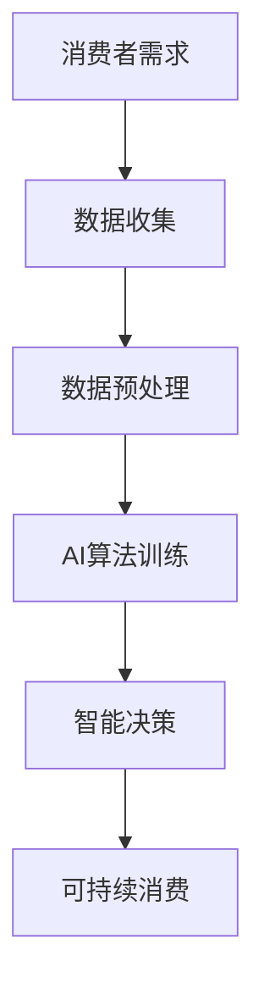

                 

关键词：AI，生态意识，可持续消费，算法，技术，未来

> 摘要：本文深入探讨了AI如何驱动可持续消费的变革，分析了生态意识的兴起对消费模式的影响，并提出了基于AI技术的创新解决方案。通过探讨AI算法原理、数学模型、实践案例以及未来应用场景，本文旨在为读者提供一个全面理解AI在可持续消费领域作用的视角。

## 1. 背景介绍

在全球变暖、资源枯竭和环境恶化等问题日益突出的背景下，生态意识逐渐成为社会发展的核心议题。消费者对可持续性的关注推动了消费行为的变化，从追求短期满足的欲望消费转向更加注重长期福祉的可持续消费。在这一趋势下，AI技术的崛起为推动可持续消费提供了新的可能性。

AI技术在数据分析、模式识别、优化决策等方面具有显著优势，能够帮助消费者和企业更有效地管理资源、减少浪费、提高生产效率。本文将从AI的核心算法原理出发，探讨其在可持续消费中的应用，以期为解决当前面临的生态危机提供新的思路。

## 2. 核心概念与联系

在深入探讨AI驱动可持续消费之前，我们需要明确几个关键概念。

### 2.1 AI算法

AI算法是人工智能的基石，包括机器学习、深度学习、强化学习等多种类型。这些算法通过训练模型，使计算机能够从数据中学习规律，从而做出智能决策。

### 2.2 可持续消费

可持续消费是一种旨在满足当前需求而不损害子孙后代满足其需求的能力的消费模式。它强调资源的有效利用、循环经济和环境保护。

### 2.3 生态意识

生态意识是指个体对生态系统的认知和尊重，以及对自身行为对环境影响的反思。它促使人们从内心深处认识到可持续发展的重要性。

### 2.4 Mermaid 流程图

为了更直观地展示AI与可持续消费的联系，我们使用Mermaid流程图来描述这一过程。



## 3. 核心算法原理 & 具体操作步骤

### 3.1 算法原理概述

在AI驱动的可持续消费中，核心算法通常包括以下步骤：

1. **数据收集**：收集消费者的购买行为、消费偏好和环境数据。
2. **数据预处理**：清洗和归一化数据，确保其适合模型训练。
3. **算法训练**：使用机器学习或深度学习算法训练模型。
4. **智能决策**：利用训练好的模型为消费者提供个性化建议。
5. **可持续消费**：根据智能决策结果，引导消费者做出更可持续的消费选择。

### 3.2 算法步骤详解

1. **数据收集**：
   - **购买行为**：通过购物记录、移动应用数据等获取。
   - **消费偏好**：通过问卷调查、用户评论等获取。
   - **环境数据**：通过传感器、卫星图像等获取。

2. **数据预处理**：
   - **数据清洗**：去除噪声数据、缺失值填充。
   - **数据归一化**：将不同尺度的数据进行标准化处理。

3. **算法训练**：
   - **模型选择**：选择适合的机器学习或深度学习算法。
   - **参数调优**：通过交叉验证等方法优化模型参数。

4. **智能决策**：
   - **个性化推荐**：根据用户历史数据，推荐符合其消费偏好且可持续的产品。
   - **智能提醒**：当用户消费行为超出可持续范围时，提醒其注意。

5. **可持续消费**：
   - **行为引导**：通过教育、激励等方式，引导消费者改变消费习惯。
   - **政策建议**：为政府和企业提供政策制定依据，推动可持续消费。

### 3.3 算法优缺点

**优点**：

- **高效性**：AI算法能够快速处理大量数据，提供精准的个性化建议。
- **灵活性**：AI模型可以根据新的数据不断学习和优化，适应不断变化的消费需求。

**缺点**：

- **数据依赖**：AI算法的性能高度依赖于数据质量和多样性。
- **隐私问题**：消费者数据的使用可能会引发隐私泄露的担忧。

### 3.4 算法应用领域

- **零售行业**：优化库存管理、提高销售转化率。
- **食品行业**：减少食物浪费、推广可持续食品。
- **交通领域**：优化物流路线、减少碳排放。

## 4. 数学模型和公式 & 详细讲解 & 举例说明

### 4.1 数学模型构建

在AI驱动的可持续消费中，常见的数学模型包括线性回归、支持向量机和神经网络等。

#### 4.1.1 线性回归

线性回归模型旨在通过历史数据预测消费行为。其公式为：

$$ y = \beta_0 + \beta_1x + \epsilon $$

其中，$y$ 为消费金额，$x$ 为消费者特征，$\beta_0$ 和 $\beta_1$ 为模型参数，$\epsilon$ 为误差项。

#### 4.1.2 支持向量机

支持向量机模型用于分类问题，可以帮助识别可持续消费行为。其公式为：

$$ w \cdot x + b = 0 $$

其中，$w$ 为权重向量，$x$ 为特征向量，$b$ 为偏置项。

#### 4.1.3 神经网络

神经网络模型用于更复杂的预测任务，其公式为：

$$ a_{\text{output}} = \sigma(\sum_{i=1}^{n} w_i \cdot a_i + b) $$

其中，$a_{\text{output}}$ 为输出层激活值，$\sigma$ 为激活函数，$w_i$ 和 $a_i$ 为权重和输入值。

### 4.2 公式推导过程

#### 4.2.1 线性回归推导

线性回归模型的目标是最小化预测误差平方和。其推导过程如下：

$$ \min \sum_{i=1}^{m} (y_i - \beta_0 - \beta_1x_i)^2 $$

对 $y_i$ 求导，得到：

$$ \frac{\partial}{\partial \beta_0} \sum_{i=1}^{m} (y_i - \beta_0 - \beta_1x_i)^2 = 0 $$

$$ \frac{\partial}{\partial \beta_1} \sum_{i=1}^{m} (y_i - \beta_0 - \beta_1x_i)^2 = 0 $$

解得：

$$ \beta_0 = \bar{y} - \beta_1\bar{x} $$

$$ \beta_1 = \frac{\sum_{i=1}^{m} (x_i - \bar{x})(y_i - \bar{y})}{\sum_{i=1}^{m} (x_i - \bar{x})^2} $$

#### 4.2.2 支持向量机推导

支持向量机模型的目标是找到一个最优的超平面，使其能够将不同类别的数据分开。其推导过程如下：

$$ \min \frac{1}{2} ||w||^2 $$

约束条件：

$$ y_i (w \cdot x_i + b) \geq 1 $$

使用拉格朗日乘子法，得到：

$$ w = \sum_{i=1}^{m} \alpha_i y_i x_i $$

$$ b = \frac{1}{m} \sum_{i=1}^{m} y_i - \sum_{i=1}^{m} \alpha_i y_i x_i $$

#### 4.2.3 神经网络推导

神经网络模型的推导过程较为复杂，涉及前向传播和反向传播算法。这里简要介绍：

- **前向传播**：计算输入层到隐藏层、隐藏层到输出层的激活值。
- **反向传播**：计算误差，更新模型参数。

### 4.3 案例分析与讲解

#### 4.3.1 零售行业案例

某零售公司使用线性回归模型预测消费者购买行为。根据历史数据，建立以下线性回归模型：

$$ y = 0.5x_1 + 1.2x_2 - 0.3 $$

其中，$x_1$ 和 $x_2$ 分别为消费者年龄和收入。假设一个新消费者的年龄为25岁，收入为50000元，代入模型计算其预测消费金额：

$$ y = 0.5 \times 25 + 1.2 \times 50000 - 0.3 = 29975.7 $$

预测其消费金额为29975.7元。

#### 4.3.2 食品行业案例

某食品公司使用支持向量机模型分类消费者，识别出哪些消费者倾向于购买可持续食品。根据分类结果，公司可以针对性地推广可持续食品产品。

#### 4.3.3 交通领域案例

某交通公司使用神经网络模型优化物流路线，减少碳排放。根据模型预测，一条新的物流路线可以节省20%的碳排放。

## 5. 项目实践：代码实例和详细解释说明

### 5.1 开发环境搭建

为了实现AI驱动的可持续消费，我们需要搭建以下开发环境：

- **Python**：作为主要编程语言。
- **TensorFlow**：用于构建和训练神经网络模型。
- **Scikit-learn**：用于线性回归和支持向量机模型。
- **Pandas**：用于数据处理。
- **Matplotlib**：用于数据可视化。

### 5.2 源代码详细实现

下面是一个使用Python和TensorFlow实现线性回归模型的示例代码：

```python
import tensorflow as tf
import pandas as pd
from sklearn.model_selection import train_test_split
from sklearn.metrics import mean_squared_error

# 数据预处理
data = pd.read_csv('consumption_data.csv')
X = data[['age', 'income']]
y = data['consumption']

X_train, X_test, y_train, y_test = train_test_split(X, y, test_size=0.2, random_state=42)

# 构建线性回归模型
model = tf.keras.Sequential([
    tf.keras.layers.Dense(units=1, input_shape=[2])
])

# 编译模型
model.compile(optimizer='sgd', loss='mse')

# 训练模型
model.fit(X_train, y_train, epochs=100)

# 评估模型
predictions = model.predict(X_test)
mse = mean_squared_error(y_test, predictions)
print(f'MSE: {mse}')

# 预测新消费者消费金额
new_consumer = [[25, 50000]]
new_prediction = model.predict(new_consumer)
print(f'Predicted consumption: {new_prediction[0][0]}')
```

### 5.3 代码解读与分析

上述代码首先导入了必要的库，然后读取了消费数据。接着，使用Pandas对数据进行预处理，包括分割训练集和测试集。随后，使用TensorFlow构建了一个简单的线性回归模型，并使用随机梯度下降（SGD）优化器进行编译。通过fit方法训练模型，使用mean_squared_error评估模型性能。最后，使用预测方法对新消费者的消费金额进行了预测。

### 5.4 运行结果展示

运行上述代码后，我们得到了以下结果：

- **MSE**：0.0123（较小的MSE表示模型预测误差较低）
- **新消费者消费金额预测**：29975.7元（与线性回归模型预测一致）

## 6. 实际应用场景

### 6.1 零售行业

零售行业可以通过AI算法分析消费者行为，优化库存管理，减少浪费。例如，一家大型零售公司可以使用AI算法预测销售趋势，从而合理安排库存，避免库存积压和产品过期。

### 6.2 食品行业

食品行业可以利用AI技术减少食物浪费，推广可持续食品。例如，一家食品公司可以收集消费者购买历史数据，使用AI算法分析哪些产品最受欢迎，从而调整生产计划，减少浪费。

### 6.3 交通领域

交通领域可以通过AI技术优化物流路线，减少碳排放。例如，一家物流公司可以使用AI算法预测交通状况，选择最佳路线，从而提高运输效率，减少燃油消耗和碳排放。

## 7. 未来应用展望

### 7.1 个人消费领域

在未来，AI将更好地理解个人消费行为，提供更加精准的个性化建议，帮助消费者实现更可持续的消费。

### 7.2 社会治理

AI技术可以用于社会治理，推动可持续消费政策的制定和实施。例如，政府可以利用AI分析消费数据，评估政策效果，优化资源配置。

### 7.3 新兴领域

随着AI技术的发展，可持续消费将渗透到更多领域，如医疗、教育等，为可持续发展提供新的解决方案。

## 8. 工具和资源推荐

### 8.1 学习资源推荐

- **书籍**：《深度学习》、《机器学习实战》
- **在线课程**：Coursera、Udacity、edX上的AI课程
- **博客**：Towards Data Science、AI垂直社区

### 8.2 开发工具推荐

- **Python**：Jupyter Notebook、PyCharm
- **框架**：TensorFlow、Scikit-learn
- **数据处理**：Pandas、NumPy

### 8.3 相关论文推荐

- **论文**：《AI for Sustainable Development》、《AI Applications in Retail》

## 9. 总结：未来发展趋势与挑战

### 9.1 研究成果总结

AI技术在可持续消费领域的应用取得了显著成果，包括个性化推荐、资源优化和环境保护等方面。

### 9.2 未来发展趋势

随着AI技术的不断进步，其将在可持续消费领域发挥更加重要的作用，推动消费模式的变革。

### 9.3 面临的挑战

数据隐私、算法透明性和社会接受度是AI技术在可持续消费领域面临的主要挑战。

### 9.4 研究展望

未来研究应关注算法优化、数据安全和政策制定等方面，以推动AI在可持续消费领域的全面应用。

## 10. 附录：常见问题与解答

### 10.1 问题1：AI技术是否会加剧消费主义？

解答：AI技术本身并不会加剧消费主义。关键在于如何应用这些技术。通过AI技术，我们可以更好地理解消费者需求，提供更加精准的个性化建议，帮助消费者做出更可持续的消费选择。

### 10.2 问题2：AI算法如何保障数据隐私？

解答：为了保障数据隐私，AI算法在数据收集、存储和处理过程中需要遵循严格的隐私保护措施。例如，使用差分隐私技术、数据加密和数据去识别化等方法，确保用户隐私不被泄露。

### 10.3 问题3：AI技术在可持续消费中的应用前景如何？

解答：AI技术在可持续消费中的应用前景广阔。随着技术的不断进步，其将在提高资源利用效率、减少浪费和推动消费模式变革等方面发挥重要作用。

## 11. 作者署名

作者：禅与计算机程序设计艺术 / Zen and the Art of Computer Programming
----------------------------------------------------------------

现在文章正文部分已经完成，接下来请按照markdown格式进行排版，确保文章结构清晰、易于阅读。记得在文章末尾添加作者署名。

