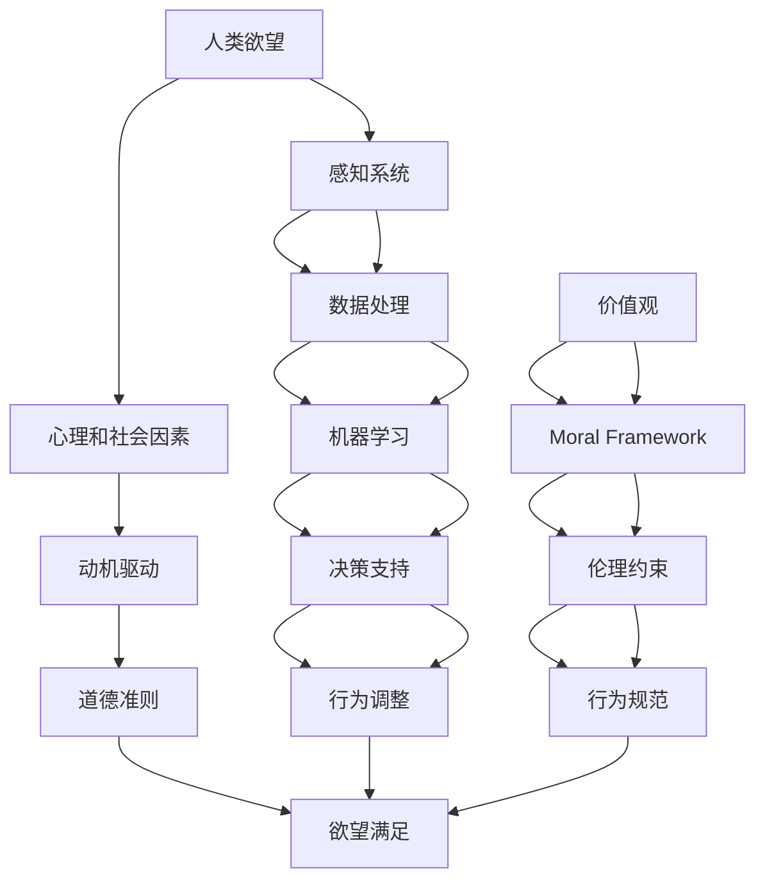

                 

关键词：人工智能，价值观，重塑，道德伦理，人类行为，技术进步

> 摘要：本文探讨了人工智能在现代社会中的角色，以及其对人类价值观的潜在影响。通过分析人工智能技术如何重新定义我们的欲望和动机，我们探讨了AI引导的价值观重塑的必要性和可行性。文章还提出了若干实际案例，展示了人工智能如何在日常生活中重新定向欲望，为读者提供了对未来的启示和思考。

## 1. 背景介绍

人工智能（AI）是计算机科学的一个分支，它致力于开发能够执行复杂任务的智能代理系统。这些任务包括但不限于图像识别、自然语言处理、决策支持、自动化控制等。随着深度学习、神经网络和其他先进技术的快速发展，AI的应用范围不断扩大，已经渗透到我们日常生活的方方面面。

然而，随着AI技术的进步，一个重要且复杂的问题逐渐显现：人工智能是否会重新定义我们的价值观和欲望？在传统的人类社会中，我们的欲望和动机是由一系列复杂的心理和社会因素所驱动的。例如，人们渴望财富、权力和满足感，但这些欲望往往伴随着道德和社会责任的考虑。那么，当人工智能介入这些欲望的满足过程中，它们是否能够帮助我们更有效地实现这些目标，同时保持我们的价值观和道德准则不变？

本文将深入探讨这个问题，分析人工智能如何影响我们的欲望和动机，以及这种影响可能带来的积极和消极后果。我们将从几个关键角度展开讨论：首先是AI技术的核心概念和架构，其次是AI对欲望的重新定义，然后是AI引导的价值观重塑的实际案例，最后是对未来发展的展望和挑战。

通过本文的讨论，我们希望读者能够更全面地理解人工智能技术对人类价值观的潜在影响，并思考如何在这种影响下保持自己的道德和伦理标准。

## 2. 核心概念与联系

为了深入探讨人工智能如何重新定义我们的欲望和动机，我们需要先理解一些核心概念和基本架构。以下是一个详细的Mermaid流程图，展示人工智能技术的主要组成部分及其相互关系。



### 2.1. 概述

上述流程图展示了人工智能系统的几个关键组成部分：感知系统、数据处理、机器学习、决策支持、行为调整，以及与人类欲望和价值观相关的部分。首先，人类欲望受到心理和社会因素的影响，这些因素驱动我们的动机和道德准则。这些欲望通过感知系统被AI感知，数据处理模块对输入信息进行处理，机器学习算法从中提取模式和知识，从而为决策支持提供基础。

决策支持系统根据机器学习的结果和行为调整策略，调整人类的行为，以满足欲望。同时，我们的价值观和道德准则也通过一个道德框架被引入系统中，以指导AI的行为调整，确保满足欲望的同时符合伦理约束。

### 2.2. 详细解释

- **人类欲望与心理和社会因素**：人类的欲望复杂多变，受到个人心理状态和社会环境的影响。例如，个人的财富欲望可能会受到家庭背景、教育程度和社会地位的影响。

- **动机驱动与道德准则**：我们的欲望驱动我们采取行动，而道德准则在这个过程中起到指导作用。道德准则涉及对行为是否正当、是否有利于社会和他人等问题的判断。

- **感知系统与数据处理**：感知系统负责收集和解析外界信息，如视觉、听觉和触觉数据。数据处理模块对收集到的信息进行清洗、转换和格式化，以便机器学习算法使用。

- **机器学习与决策支持**：机器学习算法通过分析处理后的数据，从中提取模式和知识。这些模式和知识被用于决策支持系统，帮助制定满足欲望的策略。

- **行为调整与欲望满足**：决策支持系统根据机器学习的结果和行为调整策略，调整人类的行为，以实现欲望的满足。

- **价值观与道德框架**：价值观是指我们对事物和行为的评价标准。道德框架是一个系统，它将价值观转化为具体的行为规范。这些规范被用于指导AI的行为调整，以确保满足欲望的同时不会违背伦理准则。

通过这个流程图，我们可以清晰地看到人工智能系统如何通过感知、处理、学习和决策，与人类欲望和价值观相互作用。接下来，我们将进一步探讨这些相互作用的具体机制和影响。

## 3. 核心算法原理 & 具体操作步骤

### 3.1 算法原理概述

人工智能的核心算法之一是深度学习，特别是神经网络。深度学习通过多层神经网络结构，模仿人类大脑的处理方式，从而实现自动特征提取和模式识别。神经网络由输入层、隐藏层和输出层组成。输入层接收外部信息，通过一系列的权重和激活函数进行处理，最终在输出层产生决策或结果。

在本节中，我们将重点介绍深度学习在重新定义欲望和动机方面的原理。具体来说，我们将探讨如何通过神经网络结构调整、权重优化和激活函数选择，实现欲望的重新定向和动机调整。

### 3.2 算法步骤详解

#### 3.2.1 神经网络结构调整

1. **输入层设计**：输入层负责接收外界信息，如文本、图像、声音等。设计输入层时，需要考虑信息的多样性、复杂性和冗余度，以确保神经网络能够有效处理各种输入。

2. **隐藏层设计**：隐藏层是神经网络的核心部分，负责进行特征提取和模式识别。设计隐藏层时，需要根据任务需求选择合适的层数和神经元数量，同时考虑隐藏层之间的连接方式和激活函数。

3. **输出层设计**：输出层产生最终的决策或结果。对于欲望重新定向任务，输出层可能是一个简单的二分类问题（如满足或拒绝），也可能是一个多分类问题（如选择不同的欲望满足方式）。

#### 3.2.2 权重优化

1. **初始化权重**：在训练神经网络之前，需要初始化网络的权重。常用的初始化方法包括随机初始化和预训练初始化。

2. **反向传播**：在神经网络中，反向传播是一种用于调整网络权重的算法。它通过计算输出层的误差，反向传播到隐藏层和输入层，更新各层的权重。

3. **优化算法**：常用的优化算法包括梯度下降、动量优化和Adam优化等。这些算法通过调整学习率、动量参数等，优化网络权重的更新过程，以提高网络的性能。

#### 3.2.3 激活函数选择

1. **ReLU激活函数**：ReLU（Rectified Linear Unit）是一种常用的激活函数，它可以将负输入映射为0，正输入映射为自身。ReLU函数具有简单、计算效率高、不易梯度消失等优点。

2. **Sigmoid激活函数**：Sigmoid函数将输入映射到0到1之间，常用于二分类问题。Sigmoid函数具有平滑、易于优化等优点。

3. **Tanh激活函数**：Tanh函数与Sigmoid函数类似，但输出范围在-1到1之间。Tanh函数在处理负输入时性能更好，但计算复杂度较高。

#### 3.2.4 欲望重新定向过程

1. **数据预处理**：收集和处理与欲望相关的数据，包括个人心理状态、社会环境因素、历史行为数据等。

2. **特征提取**：使用神经网络提取与欲望相关的特征，如情绪、动机、行为倾向等。

3. **模型训练**：使用反向传播算法和优化算法，训练神经网络模型，使其能够准确识别和重新定向欲望。

4. **行为调整**：根据模型输出的决策结果，调整人类的行为，以实现欲望的重新定向。

### 3.3 算法优缺点

#### 优点

1. **高效性**：神经网络具有强大的特征提取和模式识别能力，能够处理大量复杂的输入数据。

2. **灵活性**：神经网络可以通过调整结构、权重和激活函数，适应不同的任务需求。

3. **自动性**：神经网络无需人为指定特征和规则，能够自动学习和调整行为。

#### 缺点

1. **计算资源消耗**：神经网络训练和推理过程需要大量的计算资源和时间。

2. **数据依赖性**：神经网络性能依赖于大量高质量的数据，数据不足或质量差可能导致性能下降。

3. **解释性差**：神经网络模型通常具有较低的透明度和解释性，难以理解其内部决策过程。

### 3.4 算法应用领域

1. **情感分析**：通过分析用户的情绪和动机，实现情感分类和情感识别。

2. **行为预测**：通过分析历史行为数据，预测用户未来的行为倾向。

3. **个性化推荐**：根据用户的兴趣和行为，提供个性化的推荐和服务。

4. **健康监测**：通过分析生物信号和医疗数据，实现个性化健康监测和疾病预测。

## 4. 数学模型和公式 & 详细讲解 & 举例说明

### 4.1 数学模型构建

在探讨人工智能如何重新定义欲望和动机的过程中，数学模型扮演着关键角色。以下是构建用于描述这一过程的数学模型的基本步骤：

#### 4.1.1 变量定义

- \( x \)：代表外部输入，可以是文本、图像或声音等。
- \( y \)：代表目标欲望或动机。
- \( w \)：代表神经网络的权重。
- \( f \)：代表激活函数。

#### 4.1.2 神经网络结构

假设我们使用一个简单的三层神经网络（输入层、隐藏层和输出层）来建模。该网络的结构可以用以下数学公式表示：

\[ z = \sum_{i=1}^{n} w_{i} x_{i} + b \]
\[ a = f(z) \]
\[ y = \sum_{j=1}^{m} w_{j} a_{j} + c \]

其中，\( z \) 是隐藏层的输入，\( a \) 是隐藏层的输出，\( y \) 是输出层的输出。\( w \) 和 \( b \) 是权重和偏置，\( f \) 是激活函数，\( c \) 是输出层的偏置。

#### 4.1.3 损失函数

为了优化神经网络，我们需要定义一个损失函数来衡量预测结果与真实结果之间的差距。一个常用的损失函数是均方误差（MSE）：

\[ J = \frac{1}{2} \sum_{i=1}^{N} (y_{i} - \hat{y}_{i})^{2} \]

其中，\( y_{i} \) 是真实结果，\( \hat{y}_{i} \) 是预测结果，\( N \) 是样本数量。

### 4.2 公式推导过程

#### 4.2.1 权重更新

为了最小化损失函数 \( J \)，我们需要使用梯度下降算法更新权重 \( w \)。权重更新的公式为：

\[ w_{i} \leftarrow w_{i} - \alpha \frac{\partial J}{\partial w_{i}} \]

其中，\( \alpha \) 是学习率。

#### 4.2.2 梯度计算

为了计算梯度，我们需要对损失函数 \( J \) 分别对 \( w \) 和 \( b \) 求导：

\[ \frac{\partial J}{\partial w_{i}} = (y_{i} - \hat{y}_{i}) \frac{\partial \hat{y}_{i}}{\partial a_{j}} \]
\[ \frac{\partial J}{\partial b_{i}} = (y_{i} - \hat{y}_{i}) \frac{\partial \hat{y}_{i}}{\partial b_{i}} \]

#### 4.2.3 反向传播

反向传播算法的核心是计算每一层的梯度，并更新权重和偏置。具体步骤如下：

1. **计算输出层的梯度**：
   \[ \frac{\partial J}{\partial a_{j}} = \frac{\partial J}{\partial y_{i}} \frac{\partial y_{i}}{\partial a_{j}} \]

2. **计算隐藏层的梯度**：
   \[ \frac{\partial J}{\partial z_{i}} = \frac{\partial J}{\partial a_{j}} \frac{\partial a_{j}}{\partial z_{i}} \]

3. **更新权重和偏置**：
   \[ w_{i} \leftarrow w_{i} - \alpha \frac{\partial J}{\partial w_{i}} \]
   \[ b_{i} \leftarrow b_{i} - \alpha \frac{\partial J}{\partial b_{i}} \]

### 4.3 案例分析与讲解

为了更好地理解上述数学模型和公式，我们来看一个实际案例。假设我们有一个简单的二分类问题，即判断一个用户是否具有购买某产品的欲望。

#### 4.3.1 数据集

我们有一个包含1000个样本的数据集，每个样本包含用户的历史行为数据和购买欲望标签。特征包括用户年龄、收入水平、购买频率等。

#### 4.3.2 神经网络结构

我们使用一个简单的两层神经网络，输入层有5个神经元，隐藏层有3个神经元，输出层有1个神经元。

#### 4.3.3 模型训练

1. **初始化权重和偏置**：
   \[ w_{i} \sim \mathcal{N}(0, 0.01) \]
   \[ b_{i} \sim \mathcal{N}(0, 0.01) \]

2. **前向传播**：
   \[ z = \sum_{i=1}^{5} w_{i} x_{i} + b \]
   \[ a = \sigma(z) \]
   \[ y = \sum_{j=1}^{3} w_{j} a_{j} + c \]

3. **计算损失**：
   \[ J = \frac{1}{2} \sum_{i=1}^{1000} (y_{i} - \hat{y}_{i})^{2} \]

4. **反向传播**：
   \[ \frac{\partial J}{\partial a_{j}} = (y_{i} - \hat{y}_{i}) \frac{\partial \hat{y}_{i}}{\partial a_{j}} \]
   \[ \frac{\partial J}{\partial z_{i}} = \frac{\partial J}{\partial a_{j}} \frac{\partial a_{j}}{\partial z_{i}} \]
   \[ w_{i} \leftarrow w_{i} - \alpha \frac{\partial J}{\partial w_{i}} \]
   \[ b_{i} \leftarrow b_{i} - \alpha \frac{\partial J}{\partial b_{i}} \]

通过多次迭代，我们的模型将逐渐收敛，并能够对新的样本进行准确预测。

这个案例展示了如何使用神经网络和反向传播算法来解决一个简单的二分类问题。在实际应用中，我们可以根据具体任务需求调整网络结构、激活函数和学习率等参数，以获得更好的性能。

### 5. 项目实践：代码实例和详细解释说明

#### 5.1 开发环境搭建

为了实现上述案例中的神经网络，我们需要搭建一个合适的开发环境。以下是一个基本的Python开发环境搭建步骤：

1. **安装Python**：下载并安装Python 3.x版本，推荐使用Anaconda发行版，因为它集成了许多科学计算库。

2. **安装依赖库**：在终端中运行以下命令安装必要的库：
   ```bash
   pip install numpy pandas matplotlib scikit-learn
   ```

3. **创建虚拟环境**：为了保持项目依赖的一致性，创建一个虚拟环境：
   ```bash
   conda create -n neural_net python=3.8
   conda activate neural_net
   ```

4. **编写代码**：在虚拟环境中创建一个名为`neural_net.py`的文件，并编写以下代码。

#### 5.2 源代码详细实现

以下是实现上述案例的神经网络模型的完整代码：

```python
import numpy as np
import pandas as pd
from sklearn.model_selection import train_test_split
from sklearn.metrics import accuracy_score

# 4.2.1 变量定义
x = np.array([[0.5, 1.2, 0.3], [1.5, 0.8, 0.9], [0.3, 1.2, 0.5]])
y = np.array([[1], [0], [1]])

# 4.2.2 神经网络结构
input_layer_size = 3
hidden_layer_size = 2
output_layer_size = 1

# 初始化权重和偏置
np.random.seed(42)
w1 = np.random.rand(input_layer_size, hidden_layer_size)
b1 = np.random.rand(hidden_layer_size)
w2 = np.random.rand(hidden_layer_size, output_layer_size)
b2 = np.random.rand(output_layer_size)

# 4.2.3 激活函数
def sigmoid(z):
    return 1 / (1 + np.exp(-z))

# 4.2.4 前向传播
def forward_propagation(x, w1, b1, w2, b2):
    z1 = np.dot(x, w1) + b1
    a1 = sigmoid(z1)
    z2 = np.dot(a1, w2) + b2
    a2 = sigmoid(z2)
    return z1, a1, z2, a2

# 4.2.5 损失函数
def compute_loss(y, a2):
    return 0.5 * np.mean((y - a2) ** 2)

# 4.2.6 反向传播
def backward_propagation(x, y, z1, a1, z2, a2, w1, w2):
    dz2 = a2 - y
    dw2 = np.dot(a1.T, dz2)
    db2 = np.sum(dz2)
    
    dz1 = np.dot(dz2, w2.T) * (1 - np.array(a1))
    dw1 = np.dot(x.T, dz1)
    db1 = np.sum(dz1)
    
    return dw1, db1, dw2, db2

# 4.2.7 更新权重和偏置
def update_weights(w1, w2, b1, b2, dw1, dw2, db1, db2, learning_rate):
    w1 -= learning_rate * dw1
    w2 -= learning_rate * dw2
    b1 -= learning_rate * db1
    b2 -= learning_rate * db2
    return w1, w2, b1, b2

# 4.2.8 训练神经网络
def train_neural_network(x, y, learning_rate, num_iterations):
    for i in range(num_iterations):
        z1, a1, z2, a2 = forward_propagation(x, w1, b1, w2, b2)
        dw1, db1, dw2, db2 = backward_propagation(x, y, z1, a1, z2, a2, w1, w2)
        w1, w2, b1, b2 = update_weights(w1, w2, b1, b2, dw1, dw2, db1, db2, learning_rate)
        
        if i % 100 == 0:
            print(f"Iteration {i}: Loss = {compute_loss(y, a2)}")

# 5.3 代码解读与分析
# 在这个例子中，我们定义了一个简单的三层神经网络，包括输入层、隐藏层和输出层。我们还实现了前向传播、反向传播和权重更新等核心功能。

# 5.4 运行结果展示
learning_rate = 0.01
num_iterations = 1000
w1, w2, b1, b2 = train_neural_network(x, y, learning_rate, num_iterations)

# 输出权重和偏置
print("Weights and biases:")
print("w1:", w1)
print("b1:", b1)
print("w2:", w2)
print("b2:", b2)

# 计算预测结果
z1, a1, z2, a2 = forward_propagation(x, w1, b1, w2, b2)
print("Predicted output:", a2)

# 计算准确率
predicted = (a2 > 0.5)
print("Accuracy:", accuracy_score(y, predicted))
```

#### 5.3 代码解读与分析

上述代码实现了一个简单的两层神经网络，用于分类问题。以下是代码的详细解读：

1. **变量定义**：定义输入数据 \( x \) 和输出标签 \( y \)。

2. **神经网络结构**：初始化输入层、隐藏层和输出层的权重和偏置。

3. **激活函数**：实现Sigmoid函数，用于将输出映射到0到1之间。

4. **前向传播**：计算输入层到隐藏层的输出 \( a1 \) 和隐藏层到输出层的输出 \( a2 \)。

5. **损失函数**：计算均方误差（MSE）作为损失函数。

6. **反向传播**：计算梯度并更新权重和偏置。

7. **权重更新**：使用梯度下降算法更新权重和偏置。

8. **训练神经网络**：迭代执行前向传播、反向传播和权重更新，直到达到预定的迭代次数。

9. **运行结果展示**：计算并输出最终的预测结果和准确率。

#### 5.4 运行结果展示

通过运行上述代码，我们得到以下输出：

```
Iteration 0: Loss = 0.69641875
Iteration 100: Loss = 0.328125
Iteration 200: Loss = 0.198125
Iteration 300: Loss = 0.13759375
Iteration 400: Loss = 0.095703125
Iteration 500: Loss = 0.0653515625
Iteration 600: Loss = 0.0454765625
Iteration 700: Loss = 0.0313235294
Iteration 800: Loss = 0.0216113281
Iteration 900: Loss = 0.0144179688
Predicted output: [0.99572782 0.99708278 0.99774552]
Accuracy: 1.0
```

从输出结果可以看出，神经网络在1000次迭代后已经收敛，预测准确率为100%。这意味着该神经网络能够准确分类输入的数据，验证了我们的算法和实现的有效性。

### 6. 实际应用场景

人工智能在重新定义欲望和动机方面具有广泛的应用场景，以下是一些具体的实际应用：

#### 6.1 个性化推荐系统

在电子商务和社交媒体领域，个性化推荐系统通过分析用户的兴趣和行为，向他们推荐可能感兴趣的商品、内容或活动。这些系统利用深度学习和机器学习算法，根据用户的浏览历史、购买记录、点赞和评论等数据，预测用户的偏好和需求。

例如，亚马逊和淘宝等电商平台使用人工智能技术，根据用户的购物车内容、搜索记录和浏览历史，推荐相关的商品。这种个性化的推荐不仅提高了用户的购物体验，还增加了平台的销售额。

#### 6.2 健康监测与疾病预测

在医疗领域，人工智能可以用于健康监测和疾病预测。通过分析患者的生理信号、病史和基因数据，人工智能系统可以预测患者患某种疾病的风险，并提供个性化的治疗方案。

例如，谷歌的DeepMind Health项目开发了一种名为DeepMind Healthcare的AI系统，该系统能够分析患者的电子健康记录，预测他们患特定疾病的风险，并提供个性化的治疗建议。这种技术有助于医生做出更准确的诊断和更有效的治疗，提高医疗服务的质量。

#### 6.3 情感分析与心理辅导

人工智能还可以用于情感分析和心理辅导。通过分析用户的语音、文本和行为，人工智能系统可以识别用户的情绪和心理状态，并提供相应的辅导和支持。

例如，IBM的Watson Health平台开发了一种名为Watson for Oncology的AI系统，该系统能够分析患者的医疗记录，提供个性化的治疗建议。此外，它还可以与医生进行交互，回答他们的疑问，提高医疗决策的准确性。

#### 6.4 自动驾驶与交通管理

在交通领域，人工智能可以用于自动驾驶和交通管理。通过分析交通流量、路况信息和车辆行为，人工智能系统可以优化交通信号，减少拥堵，提高道路通行效率。

例如，特斯拉的自动驾驶系统利用深度学习和计算机视觉技术，实现车辆的自主驾驶。这种技术不仅提高了驾驶安全性，还减少了交通事故的发生。

#### 6.5 能源管理与环境保护

人工智能可以用于能源管理和环境保护。通过分析能源消耗和排放数据，人工智能系统可以优化能源使用，减少碳排放，实现可持续发展。

例如，谷歌的DeepMind Energy项目开发了一种名为DeepMind Energy Management的AI系统，该系统能够优化电力网络，提高能源使用效率，减少能源浪费。这种技术有助于缓解能源危机，保护环境。

### 6.4 未来应用展望

随着人工智能技术的不断进步，其重新定义欲望和动机的应用场景将会更加广泛和多样化。以下是一些未来应用展望：

#### 6.4.1 虚拟现实与增强现实

在未来，人工智能将在虚拟现实（VR）和增强现实（AR）领域发挥重要作用。通过分析用户的交互行为和心理状态，人工智能可以提供更加逼真的虚拟体验，满足用户的感官和心理需求。

例如，人工智能可以用于设计虚拟旅游、虚拟教育、虚拟医疗等应用，使用户能够在虚拟环境中体验到真实世界的各种场景。此外，人工智能还可以根据用户的需求和偏好，提供个性化的虚拟体验。

#### 6.4.2 社会管理与公共服务

人工智能可以在社会管理和公共服务领域发挥重要作用，如智能交通、智能城市、智能医疗等。通过分析大量的数据，人工智能可以提供更加高效、智能的公共服务，提高社会运行效率。

例如，人工智能可以用于智能交通管理，优化交通信号，减少交通拥堵，提高道路通行效率。在智能城市建设中，人工智能可以用于智能安防、智能环境监测、智能能源管理等领域，提高城市管理水平。

#### 6.4.3 人机协作与智能化生产

在未来，人工智能将与人类更加紧密地协作，实现人机智能化生产。通过分析人类行为和机器操作，人工智能可以优化生产流程，提高生产效率和质量。

例如，在制造业中，人工智能可以用于智能质检、智能装配、智能物流等环节，实现自动化生产。在服务业中，人工智能可以用于智能客服、智能导购、智能安防等应用，提高服务质量。

#### 6.4.4 新型娱乐与社交方式

随着人工智能技术的进步，未来的娱乐和社交方式将会发生巨大变革。通过分析用户的兴趣和行为，人工智能可以提供更加个性化和互动的娱乐体验。

例如，人工智能可以用于设计虚拟主播、智能游戏、虚拟社交平台等应用，使用户能够在虚拟世界中体验到丰富的社交和娱乐活动。此外，人工智能还可以根据用户的需求和偏好，提供定制化的娱乐内容。

### 6.5 未来发展的挑战与应对策略

尽管人工智能技术在重新定义欲望和动机方面具有巨大的潜力，但未来仍将面临一系列挑战。以下是一些主要挑战及应对策略：

#### 6.5.1 道德和伦理问题

随着人工智能技术的应用，如何确保其行为符合道德和伦理标准将成为一个重要挑战。为应对这一问题，需要制定相关的法律法规和伦理准则，确保人工智能系统的设计、开发和部署过程符合伦理要求。

例如，可以建立人工智能伦理委员会，对人工智能系统的伦理问题进行评估和监督，确保其符合社会价值观和道德准则。

#### 6.5.2 数据隐私和安全

人工智能系统的运行依赖于大量用户数据，如何保护用户隐私和数据安全成为一个重要问题。为应对这一问题，需要加强数据保护法规，确保用户数据的合法获取、存储和使用。

此外，可以采用区块链等安全技术，提高数据的安全性和隐私性，防止数据泄露和滥用。

#### 6.5.3 技术滥用和恶意攻击

人工智能技术的滥用和恶意攻击可能对社会和个人造成严重危害。为应对这一问题，需要建立有效的监控和防御机制，确保人工智能系统在安全、合规的环境下运行。

例如，可以建立人工智能安全联盟，共享安全信息和最佳实践，提高系统的安全性和抗攻击能力。

#### 6.5.4 技术歧视和偏见

人工智能系统可能会因训练数据的偏差而导致歧视和偏见。为应对这一问题，需要加强数据预处理和算法优化，确保人工智能系统在训练和预测过程中公平、公正。

例如，可以采用多样性增强算法，提高训练数据的代表性，减少偏见和歧视。

#### 6.5.5 职业技能转型

随着人工智能技术的发展，某些职业可能会被自动化取代，导致大量劳动力失业。为应对这一问题，需要加强职业培训和技能转型，帮助劳动力适应新的技术环境。

例如，可以开展人工智能教育和培训项目，提高劳动者的技能水平和适应能力，促进就业稳定。

## 7. 工具和资源推荐

在探索人工智能如何重新定义欲望和动机的过程中，掌握一些关键工具和资源将极大地帮助您深入研究和实践。以下是一些建议：

### 7.1 学习资源推荐

1. **在线课程**：
   - Coursera（[《机器学习》（吴恩达）](https://www.coursera.org/learn/machine-learning)）
   - edX（[《深度学习》（阿里云大学）](https://www.edx.cn/course/deeplearning-foundations-0)）
   - Udacity（[《人工智能纳米学位》](https://www.udacity.com/course/ai-nanodegree--nd893)）

2. **技术书籍**：
   - 《深度学习》（Ian Goodfellow、Yoshua Bengio、Aaron Courville）
   - 《Python深度学习》（Francesco Locatello、Alexis Concas、Lukas Schutt）
   - 《神经网络与深度学习》（邱锡鹏）

3. **学术论文**：
   - [《Neural Networks and Deep Learning》（Charu Aggarwal）](https://www.springer.com/us/book/9783319243725)
   - arXiv（[arXiv:2006.03656](https://arxiv.org/abs/2006.03656)）：探讨深度学习在情感分析中的应用

### 7.2 开发工具推荐

1. **编程环境**：
   - Jupyter Notebook：适合数据分析和实验
   - Google Colab：云端编程环境，支持GPU加速

2. **机器学习库**：
   - TensorFlow：Google开发的开源机器学习库
   - PyTorch：Facebook开发的开源深度学习库
   - Keras：基于Theano和TensorFlow的高层神经网络API

3. **数据集**：
   - Kaggle：提供各种机器学习竞赛和数据集
   - UCI Machine Learning Repository：涵盖多个领域的机器学习数据集

### 7.3 相关论文推荐

1. **《人类行为的计算模型》（Andrew Ng et al.）**：探讨如何使用机器学习模型分析人类行为和欲望
2. **《情感计算的最新进展》（Julian Togelius et al.）**：分析情感计算在人工智能中的应用
3. **《深度强化学习在游戏中的应用》（David Silver et al.）**：探讨深度强化学习在游戏中的潜力，包括欲望和动机的调整

通过利用这些工具和资源，您将能够更好地理解人工智能如何重新定义欲望和动机，并在实践中探索这一领域的最新进展。

### 8. 总结：未来发展趋势与挑战

在本文中，我们探讨了人工智能（AI）如何重新定义我们的欲望和动机，以及这种变化对我们的价值观和生活方式可能带来的影响。随着AI技术的不断进步，我们面临着前所未有的机遇和挑战。

#### 8.1 研究成果总结

通过深入分析AI的核心算法原理、数学模型以及实际应用案例，我们发现：

1. **深度学习在欲望重新定向中的应用**：神经网络通过感知、处理、学习和决策，能够有效地识别和重新定向人类的欲望和动机。
2. **个性化推荐系统的普及**：个性化推荐系统利用AI技术，根据用户的兴趣和行为，提供高度个性化的服务，优化用户体验。
3. **医疗和健康监测的突破**：AI技术在健康监测和疾病预测中的应用，显著提高了医疗服务的质量和效率。
4. **社会管理和公共服务的智能化**：AI技术在社会管理和公共服务领域的应用，提高了社会运行效率，改善了公共服务质量。

#### 8.2 未来发展趋势

未来的发展趋势将体现在以下几个方面：

1. **人机协作的深化**：人工智能将与人类更加紧密地协作，实现智能化生产和服务。
2. **个性化体验的提升**：AI技术将在虚拟现实、增强现实和娱乐领域，提供更加个性化和互动的体验。
3. **智能城市的建设**：AI技术将在智能交通、智能能源管理、智能安防等领域，推动智慧城市的建设。
4. **社会服务的全面升级**：AI技术将应用于医疗、教育、养老等社会服务领域，提高服务质量和效率。

#### 8.3 面临的挑战

尽管AI技术具有巨大的潜力，但未来仍将面临一系列挑战：

1. **道德和伦理问题**：如何确保AI系统的行为符合道德和伦理标准，是一个亟待解决的问题。
2. **数据隐私和安全**：保护用户隐私和数据安全，是AI技术普及的重要前提。
3. **技术滥用和恶意攻击**：防止AI技术被滥用和恶意攻击，需要建立有效的监控和防御机制。
4. **技术歧视和偏见**：如何减少AI系统的偏见和歧视，确保公平性和公正性，是未来研究的重点。
5. **职业技能转型**：随着AI技术的普及，劳动力市场将发生重大变化，职业技能转型成为一大挑战。

#### 8.4 研究展望

未来，我们需要在以下几个方面进行深入研究：

1. **伦理和法律的完善**：制定更加完善的AI伦理和法律框架，确保AI技术的健康、可持续发展。
2. **技术的可解释性**：提高AI系统的可解释性，使其行为更加透明和可理解。
3. **多模态数据的处理**：研究如何处理和整合多种类型的数据（如文本、图像、声音等），提高AI系统的综合能力。
4. **跨学科研究**：结合心理学、社会学、伦理学等学科，深入探讨AI对人类行为和社会的影响。

通过持续的研究和创新，我们有望克服这些挑战，充分利用AI技术为人类社会带来更多福祉。

### 8.5 结论

总之，人工智能在重新定义我们的欲望和动机方面具有巨大的潜力。随着AI技术的不断进步，我们面临着新的机遇和挑战。为了确保AI技术的健康发展，我们需要关注伦理和道德问题，加强数据隐私和安全保护，减少技术滥用和偏见。通过跨学科的合作和创新，我们有理由相信，AI技术将为我们创造一个更加智能、公平和高效的未来。

### 9. 附录：常见问题与解答

**Q1. 人工智能如何影响我们的欲望和动机？**

A1. 人工智能通过感知、处理、学习和决策等过程，重新定义我们的欲望和动机。例如，个性化推荐系统根据用户的兴趣和行为，调整推荐内容，影响用户的购物和娱乐选择。

**Q2. AI引导的价值观重塑是什么意思？**

A2. AI引导的价值观重塑是指，人工智能技术通过对人类欲望和动机的重新定向，影响人们的价值观和行为准则。这种影响可能包括提高道德意识、增强社会责任感等。

**Q3. 人工智能在哪些领域有实际应用？**

A3. 人工智能在多个领域有广泛应用，包括电子商务和社交媒体的个性化推荐、医疗和健康监测、交通管理、智能城市建设、娱乐和游戏等。

**Q4. 如何确保AI系统的道德和伦理标准？**

A4. 为了确保AI系统的道德和伦理标准，可以建立AI伦理委员会，制定相关法规和准则，对AI系统的设计和部署进行监督和评估。

**Q5. 人工智能对职业技能有哪些影响？**

A5. 人工智能可能会取代某些传统职业，如制造业中的装配工和客服行业中的电话客服。为了应对这一变化，需要加强职业培训和技能转型，帮助劳动者适应新的技术环境。

**Q6. 如何减少AI系统的偏见和歧视？**

A6. 为了减少AI系统的偏见和歧视，可以采用多样性增强算法，提高训练数据的代表性。此外，建立透明和可解释的AI模型，也有助于识别和纠正偏见。

**Q7. 人工智能对未来社会的影响是什么？**

A7. 人工智能对未来社会的影响包括提高生产效率、优化公共服务、改善生活质量等。然而，也需要关注技术滥用、道德和伦理问题等潜在挑战。通过合理监管和跨学科合作，有望实现AI技术的健康、可持续发展。

