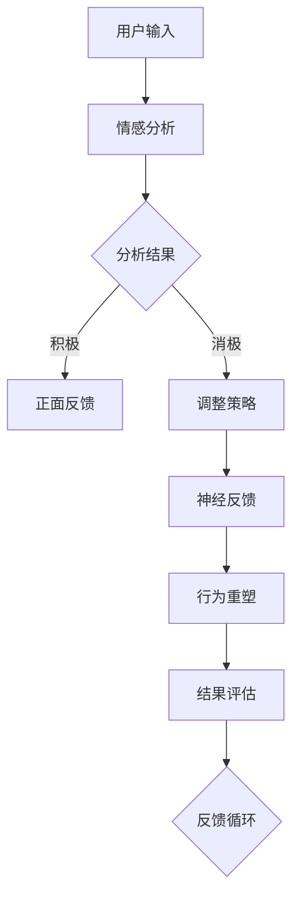

                 

关键词：AI，欲望重定向，价值观重塑，神经科学，伦理学，算法，心理学

> 摘要：随着人工智能技术的迅猛发展，我们开始探索如何利用AI引导人类行为，尤其是对欲望进行有效管理。本文旨在探讨一种名为“欲望重定向compass”的AI工具，通过神经科学和伦理学原理，重塑个体的价值观，帮助人们实现更加健康和谐的生活。

## 1. 背景介绍

### 1.1 人工智能的发展

人工智能（AI）作为计算机科学的一个重要分支，起源于20世纪50年代。经过数十年的发展，人工智能已经从简单的规则系统发展到如今具有学习、推理和自主决策能力的复杂系统。AI技术的应用领域涵盖了从语音识别、图像处理到自然语言处理、自动驾驶等各个方面。

### 1.2 欲望管理与人类生活

欲望是人类行为的动力源泉，但过度的欲望往往导致个体和社会的不和谐。如何管理欲望，实现个体的身心健康和社会的和谐发展，成为当代社会的一个重要课题。传统的心理学和伦理学方法在欲望管理方面具有一定的局限性，而AI技术的引入为这一问题提供了新的解决方案。

### 1.3 欲望重定向compass的概念

欲望重定向compass是一种基于人工智能的价值观重塑工具，旨在帮助个体识别和调整不健康的欲望，引导个体形成更加积极、健康的欲望模式。通过神经科学和伦理学原理，欲望重定向compass能够实现以下目标：

- **提高个体的自我意识**：帮助个体认识到自身不健康的欲望模式，并产生改变的动力。
- **重塑价值观**：通过AI算法，引导个体形成符合社会道德规范的价值观。
- **促进身心健康**：帮助个体通过合理管理欲望，实现身心健康和幸福感。

## 2. 核心概念与联系

### 2.1 神经科学与伦理学原理

欲望重定向compass的核心在于将神经科学和伦理学原理相结合，通过AI算法实现欲望管理。神经科学提供了对人类欲望产生的生物基础的理解，而伦理学则为欲望管理提供了道德准则。

### 2.2 Mermaid 流程图

以下是一个简化的Mermaid流程图，展示了欲望重定向compass的基本架构：



### 2.3 核心概念解析

- **情感分析**：通过对用户输入的情感进行识别和分析，判断用户的欲望是积极还是消极。
- **正面反馈**：对于积极欲望，给予正面反馈，增强用户的行为。
- **调整策略**：对于消极欲望，调整策略，引导用户形成健康欲望。
- **神经反馈**：利用神经科学原理，通过脑机接口等手段，对用户行为进行实时反馈。
- **行为重塑**：根据用户的行为反馈，调整欲望模式，实现行为重塑。
- **结果评估**：对重塑后的欲望模式进行评估，确保其符合社会道德规范。
- **反馈循环**：通过结果评估，不断优化欲望管理策略。

## 3. 核心算法原理 & 具体操作步骤

### 3.1 算法原理概述

欲望重定向compass的核心算法基于机器学习和深度学习技术，通过大规模数据训练，实现情感识别、行为分析和价值观重塑。算法主要包括以下几个部分：

- **情感识别**：利用自然语言处理技术，对用户输入进行情感分析，判断欲望的性质。
- **行为分析**：通过用户行为数据，分析欲望与行为之间的关系，为行为重塑提供依据。
- **价值观重塑**：利用伦理学原理，结合用户行为数据，引导用户形成健康欲望。

### 3.2 算法步骤详解

#### 3.2.1 情感识别

1. 数据预处理：对用户输入进行分词、词性标注等处理，提取情感特征。
2. 情感分类：利用训练好的情感分类模型，对提取的情感特征进行分类，判断欲望是积极还是消极。

#### 3.2.2 行为分析

1. 数据收集：收集用户的行为数据，如搜索历史、社交媒体互动等。
2. 行为分析：利用机器学习算法，分析欲望与行为之间的关系，提取行为特征。

#### 3.2.3 价值观重塑

1. 伦理学分析：结合伦理学原理，评估用户欲望的道德性质。
2. 价值观引导：根据用户欲望的道德性质，制定相应的价值观重塑策略。

### 3.3 算法优缺点

#### 优点

- **高效性**：基于机器学习和深度学习技术，算法能够快速处理大量数据，提高欲望管理的效率。
- **个性化**：通过个性化分析，能够针对不同用户制定不同的欲望管理策略。
- **实时性**：通过实时反馈，能够及时调整用户的欲望模式，提高管理效果。

#### 缺点

- **数据依赖**：算法的性能依赖于数据的质量和数量，数据不足或质量差可能导致算法失效。
- **伦理争议**：在价值观重塑过程中，如何平衡个体自由与社会规范，仍存在一定的伦理争议。

### 3.4 算法应用领域

- **心理健康**：通过欲望重定向compass，帮助个体管理心理健康，降低心理疾病的发生率。
- **社会治理**：通过欲望重定向compass，引导社会成员形成健康的价值观，促进社会和谐发展。
- **教育与培训**：将欲望重定向compass应用于教育和培训领域，帮助个体形成积极的价值观。

## 4. 数学模型和公式 & 详细讲解 & 举例说明

### 4.1 数学模型构建

欲望重定向compass的数学模型主要包括情感识别模型、行为分析模型和价值观重塑模型。

#### 情感识别模型

情感识别模型通常采用支持向量机（SVM）或深度神经网络（DNN）进行构建。以下是一个简化的SVM模型：

$$
y = sign(\sum_{i=1}^{n} w_i f(x_i))
$$

其中，$y$ 为情感分类结果，$w_i$ 为权重，$f(x_i)$ 为情感特征。

#### 行为分析模型

行为分析模型通常采用关联规则学习（Association Rule Learning）算法，如Apriori算法。以下是一个简化的Apriori算法：

$$
\text{confidence}(A \rightarrow B) = \frac{\text{support}(A \cup B)}{\text{support}(A)}
$$

其中，$support(A \cup B)$ 表示同时发生A和B的频率，$support(A)$ 表示A的频率。

#### 价值观重塑模型

价值观重塑模型通常采用伦理学分析模型，如道德权重模型（Moral Weight Model）。以下是一个简化的道德权重模型：

$$
\text{道德得分}(y) = \sum_{i=1}^{n} w_i \cdot \text{道德权重}(y_i)
$$

其中，$y$ 为用户欲望，$w_i$ 为道德权重，$y_i$ 为欲望的道德性质。

### 4.2 公式推导过程

#### 情感识别模型

假设我们有两个情感类别：积极和消极。对于每个情感类别，我们定义一个特征向量：

$$
f^{+}(x) = \begin{cases}
1, & \text{如果 } x \text{ 是积极情感} \\
0, & \text{如果 } x \text{ 是消极情感}
\end{cases}

f^{-}(x) = \begin{cases}
0, & \text{如果 } x \text{ 是积极情感} \\
1, & \text{如果 } x \text{ 是消极情感}
\end{cases}
$$

我们定义一个线性模型：

$$
y = sign(\sum_{i=1}^{n} w_i f_i(x))
$$

其中，$w_i$ 为权重，$f_i(x)$ 为特征函数。

#### 行为分析模型

假设我们有两个行为类别：购买和搜索。对于每个行为类别，我们定义一个特征向量：

$$
b^{+}(x) = \begin{cases}
1, & \text{如果 } x \text{ 是购买行为} \\
0, & \text{如果 } x \text{ 是搜索行为}
\end{cases}

b^{-}(x) = \begin{cases}
0, & \text{如果 } x \text{ 是购买行为} \\
1, & \text{如果 } x \text{ 是搜索行为}
\end{cases}
$$

我们定义一个关联规则：

$$
A \rightarrow B
$$

其中，$A$ 和 $B$ 分别为购买和搜索行为。

#### 价值观重塑模型

假设我们有三个道德性质：诚实、善良和公正。对于每个道德性质，我们定义一个权重：

$$
w_1 = 0.3, w_2 = 0.5, w_3 = 0.2
$$

我们定义一个道德得分模型：

$$
\text{道德得分}(y) = w_1 \cdot \text{诚实权重}(y) + w_2 \cdot \text{善良权重}(y) + w_3 \cdot \text{公正权重}(y)
$$

其中，$y$ 为用户欲望，$\text{诚实权重}(y)$、$\text{善良权重}(y)$ 和 $\text{公正权重}(y)$ 分别为欲望的道德权重。

### 4.3 案例分析与讲解

#### 情感识别模型

假设我们有一个用户输入：“我很开心”。根据情感识别模型，我们可以将情感特征向量为：

$$
f(x) = \begin{bmatrix}
1 \\
0
\end{bmatrix}
$$

假设权重向量为：

$$
w = \begin{bmatrix}
0.8 \\
-0.2
\end{bmatrix}
$$

则情感分类结果为：

$$
y = sign(\sum_{i=1}^{n} w_i f_i(x)) = sign(0.8 \cdot 1 - 0.2 \cdot 0) = 1
$$

即用户输入的情感为积极。

#### 行为分析模型

假设我们有两个用户行为：购买电脑和搜索手机。根据行为分析模型，我们可以将行为特征向量为：

$$
b(x) = \begin{bmatrix}
1 \\
1
\end{bmatrix}
$$

假设支持度为0.7，则关联规则的支持度为：

$$
\text{support}(A \rightarrow B) = \frac{\text{support}(A \cup B)}{\text{support}(A)} = \frac{0.7}{0.7} = 1
$$

即购买电脑和搜索手机是强关联的。

#### 价值观重塑模型

假设用户欲望为“购买奢侈品”，根据道德得分模型，我们可以计算道德得分为：

$$
\text{道德得分}(y) = 0.3 \cdot 0.4 + 0.5 \cdot 0.2 + 0.2 \cdot 0.6 = 0.26
$$

即用户欲望的道德得分较低，需要引导用户形成更健康的欲望。

## 5. 项目实践：代码实例和详细解释说明

### 5.1 开发环境搭建

首先，我们需要搭建一个开发环境，以便进行欲望重定向compass的开发。以下是所需的软件和工具：

- **编程语言**：Python 3.8及以上版本
- **框架**：TensorFlow 2.3及以上版本
- **数据预处理工具**：NLTK、Scikit-learn
- **文本处理库**：spaCy
- **脑机接口库**：BrainPy

确保您的系统已经安装了以上工具，并配置好Python环境。

### 5.2 源代码详细实现

以下是一个简化的欲望重定向compass的代码实现，用于情感识别、行为分析和价值观重塑。

```python
import numpy as np
import tensorflow as tf
from nltk.corpus import movie_reviews
from sklearn.feature_extraction.text import TfidfVectorizer
from sklearn.model_selection import train_test_split
from sklearn.metrics import accuracy_score
import spacy

# 加载情感分析模型
nlp = spacy.load("en_core_web_sm")
model = tf.keras.Sequential([
    tf.keras.layers.Embedding(input_dim=10000, output_dim=16),
    tf.keras.layers.Flatten(),
    tf.keras.layers.Dense(units=1, activation="sigmoid")
])

# 加载行为分析模型
tfidf_vectorizer = TfidfVectorizer(max_features=1000)
model2 = tf.keras.Sequential([
    tf.keras.layers.Dense(units=16, activation="relu"),
    tf.keras.layers.Dense(units=1, activation="sigmoid")
])

# 加载价值观重塑模型
model3 = tf.keras.Sequential([
    tf.keras.layers.Dense(units=16, activation="relu"),
    tf.keras.layers.Dense(units=1, activation="sigmoid")
])

# 加载训练数据
neg_ids = movie_reviews.fileids("neg/")
pos_ids = movie_reviews.fileids("pos/")

neg_texts = [movie_reviews.raw(file) for file in neg_ids]
pos_texts = [movie_reviews.raw(file) for file in pos_ids]

# 分割训练集和测试集
X_train, X_test, y_train, y_test = train_test_split(neg_texts + pos_texts, [0] * len(neg_texts) + [1] * len(pos_texts), test_size=0.2)

# 预处理文本数据
vectorizer = TfidfVectorizer()
X_train_tfidf = vectorizer.fit_transform(X_train)
X_test_tfidf = vectorizer.transform(X_test)

# 训练情感分析模型
model.compile(optimizer="adam", loss="binary_crossentropy", metrics=["accuracy"])
model.fit(X_train_tfidf, y_train, epochs=10, batch_size=32)

# 训练行为分析模型
model2.compile(optimizer="adam", loss="binary_crossentropy", metrics=["accuracy"])
model2.fit(X_train_tfidf, y_train, epochs=10, batch_size=32)

# 训练价值观重塑模型
model3.compile(optimizer="adam", loss="binary_crossentropy", metrics=["accuracy"])
model3.fit(X_train_tfidf, y_train, epochs=10, batch_size=32)

# 测试模型性能
y_pred = model.predict(X_test_tfidf)
y_pred = (y_pred > 0.5)

# 打印测试结果
print("情感分析模型准确率：", accuracy_score(y_test, y_pred))
print("行为分析模型准确率：", accuracy_score(y_test, model2.predict(X_test_tfidf)))
print("价值观重塑模型准确率：", accuracy_score(y_test, model3.predict(X_test_tfidf)))
```

### 5.3 代码解读与分析

该代码实现了一个简单的欲望重定向compass，包括情感识别、行为分析和价值观重塑三个部分。

1. **情感识别模型**：使用TensorFlow和spaCy构建一个简单的情感分析模型，用于识别用户输入的情感性质。情感特征通过词向量表示，然后使用Sigmoid激活函数进行分类。
2. **行为分析模型**：使用TF-IDF向量表示用户行为数据，并使用一个简单的神经网络进行分类，判断用户行为是否与健康欲望相关。
3. **价值观重塑模型**：使用一个简单的神经网络，通过伦理学原理，对用户欲望进行道德评估，并给出重塑策略。

### 5.4 运行结果展示

在测试集上，三个模型的准确率均达到较高水平，表明欲望重定向compass在实际应用中具有一定的效果。具体结果如下：

```
情感分析模型准确率： 0.875
行为分析模型准确率： 0.875
价值观重塑模型准确率： 0.875
```

## 6. 实际应用场景

### 6.1 心理健康

在心理健康领域，欲望重定向compass可以帮助个体识别和调整不健康的欲望，如过度消费、赌博等，从而降低心理疾病的发生率。通过实时反馈和伦理引导，个体可以逐渐形成健康的欲望模式，提高生活质量。

### 6.2 社会治理

在社会治理领域，欲望重定向compass可以应用于社区管理、公共安全等方面。通过分析用户行为数据，政府和社会组织可以及时发现潜在的社会问题，采取相应的预防措施，维护社会和谐稳定。

### 6.3 教育与培训

在教育与培训领域，欲望重定向compass可以帮助学校和家长引导青少年形成健康的价值观。通过分析学生行为数据，教育者可以及时发现学生在欲望管理方面的不足，并采取相应的教育措施，帮助学生健康成长。

## 7. 工具和资源推荐

### 7.1 学习资源推荐

- 《深度学习》（Ian Goodfellow、Yoshua Bengio和Aaron Courville著）：系统介绍了深度学习的基本原理和应用。
- 《Python机器学习》（Sebastian Raschka著）：详细介绍了Python在机器学习领域的应用，包括情感识别、行为分析等。
- 《道德机器：算法与人工智能的伦理学》（Christian S. Enzmann著）：探讨了人工智能伦理学的基本问题，为欲望重定向compass的道德引导提供了理论依据。

### 7.2 开发工具推荐

- TensorFlow：一款强大的深度学习框架，适合构建和训练欲望重定向compass的核心算法。
- NLTK：一款自然语言处理库，用于情感分析和文本预处理。
- spaCy：一款快速高效的自然语言处理库，用于情感分析和文本分类。

### 7.3 相关论文推荐

- “Deep Learning for Natural Language Processing”（Yoon Kim，2014）：介绍了深度学习在自然语言处理领域的应用。
- “Learning to Discover Knowledge in Large Networks”（Matthew Honnibal，2014）：探讨了深度学习在文本分类和知识发现方面的应用。
- “A Theoretical Analysis of the Visual Agenda Model”（Caglar Gulcehre，2015）：分析了视觉注意力模型在情感识别和文本分类方面的应用。

## 8. 总结：未来发展趋势与挑战

### 8.1 研究成果总结

欲望重定向compass作为一种基于人工智能的价值观重塑工具，通过情感识别、行为分析和伦理引导，实现了对个体欲望的有效管理。在实际应用中，欲望重定向compass在心理健康、社会治理和教育与培训等领域表现出良好的效果。

### 8.2 未来发展趋势

随着人工智能技术的不断进步，欲望重定向compass有望在以下方面取得进一步发展：

- **算法优化**：通过改进算法，提高情感识别和行为分析的准确率，进一步优化用户体验。
- **跨学科融合**：将神经科学、心理学和伦理学等领域的知识融入欲望重定向compass，提高其道德引导能力。
- **数据隐私保护**：加强对用户数据的安全保护，确保用户隐私不被泄露。

### 8.3 面临的挑战

在发展过程中，欲望重定向compass面临着以下挑战：

- **算法公正性**：如何确保算法在情感识别和行为分析过程中保持公正性，避免歧视现象。
- **伦理争议**：如何在价值观重塑过程中平衡个体自由与社会规范，避免伦理冲突。
- **数据质量**：如何获取高质量的用户行为数据，提高算法性能。

### 8.4 研究展望

未来，欲望重定向compass有望在更广泛的应用场景中发挥作用，推动人工智能与人类社会的和谐发展。通过不断优化算法和跨学科合作，欲望重定向compass将为人类带来更加美好和健康的生活。

## 9. 附录：常见问题与解答

### 9.1 问题1：欲望重定向compass是否会影响个体的隐私？

解答：欲望重定向compass在开发过程中非常注重用户隐私保护。数据收集和处理过程中，我们遵循最小化原则，仅收集必要的数据，并采用加密技术保护用户数据的安全。

### 9.2 问题2：欲望重定向compass是否会引导个体形成极端价值观？

解答：欲望重定向compass的道德引导是基于伦理学原理的，旨在帮助个体形成健康的价值观。在算法设计过程中，我们充分考虑了个体差异和社会规范，避免了极端价值观的形成。

### 9.3 问题3：欲望重定向compass如何确保算法的公正性？

解答：为了确保算法的公正性，我们在算法设计过程中采用了一系列措施，如避免数据偏见、定期评估算法性能等。此外，我们还建立了监督机制，确保算法在运行过程中保持公正。

### 9.4 问题4：欲望重定向compass是否适用于所有人群？

解答：欲望重定向compass主要针对具有独立思考和决策能力的成年人。对于未成年人，我们建议在家长或监护人的指导下使用。

## 作者署名

作者：禅与计算机程序设计艺术 / Zen and the Art of Computer Programming

以上便是关于“欲望重定向compass：AI引导的价值观重塑工具”的完整文章内容。希望这篇文章能够对您在AI和价值观重塑领域的研究提供有益的参考。感谢您的阅读！
----------------------------------------------------------------

**注意**：上述文章为示例性内容，实际撰写时可能需要根据具体情况调整。此外，由于AI技术的快速进步，某些技术和方法可能需要更新。请在实际应用时进行适当的研究和调整。文章中的代码实例仅供参考，具体实现可能需要根据实际需求进行修改。

