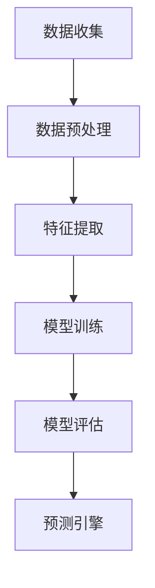

                 

关键词：AI、欲望预测、伦理、隐私、信息安全、算法

## 摘要

在人工智能（AI）迅猛发展的时代，欲望预测已经成为一个热门的研究领域，它通过分析用户的行为数据和行为模式来预测个人喜好、需求和购买意图。然而，这一技术的广泛应用也引发了关于伦理和个人隐私的深刻讨论。本文将探讨AI时代欲望预测的原理、技术实现、伦理问题及其对个人隐私的影响，并提出可能的解决方案。

## 1. 背景介绍

随着互联网和大数据技术的普及，个人数据变得比以往任何时候都更加容易获取。这些数据不仅包括用户在社交媒体上的行为，还涵盖了他们在电子商务平台上的购买历史、地理位置信息、搜索记录等。通过对这些数据的深入分析，AI算法可以准确地预测用户的欲望和需求。这种技术的潜力巨大，可以应用于个性化推荐系统、市场营销、医疗服务等多个领域。

### 1.1 欲望预测的重要性

欲望预测技术的应用不仅可以帮助企业更好地理解客户需求，提高销售额，还可以为用户提供更加精准的服务和产品推荐。例如，电子商务网站可以通过预测用户的购买行为，提前备货，减少库存成本；社交媒体平台可以通过分析用户行为，提供个性化的内容推荐，提高用户黏性。

### 1.2 技术发展

近年来，机器学习、深度学习和自然语言处理等AI技术的发展，为欲望预测提供了强大的工具。特别是深度神经网络（DNN）和卷积神经网络（CNN）等模型的进步，使得AI系统能够处理和分析大量复杂的数据，从而提高预测的准确性。

## 2. 核心概念与联系

### 2.1 欲望预测的原理

欲望预测的基本原理是通过收集和分析用户的行为数据，构建一个用户行为的模型。这个模型可以基于用户的过去行为预测未来的行为。具体来说，可以通过以下步骤实现：

1. **数据收集**：收集用户在互联网上的行为数据，包括浏览历史、购买记录、社交媒体互动等。
2. **数据预处理**：清洗和整理数据，将其转换为适合机器学习的格式。
3. **特征提取**：从原始数据中提取出对欲望预测有用的特征，例如用户年龄、性别、地理位置、购买频率等。
4. **模型训练**：使用机器学习算法训练模型，使其能够从数据中学习并预测用户的未来行为。
5. **模型评估**：通过测试数据集评估模型的准确性，调整模型参数以提高预测效果。

### 2.2 欲望预测的技术架构

为了实现欲望预测，需要构建一个技术架构，该架构通常包括以下几个主要部分：

1. **数据存储**：用于存储大量用户行为数据的数据库系统。
2. **数据处理**：负责清洗、整理和转换数据的工具和平台。
3. **机器学习平台**：提供机器学习算法的实现和训练环境。
4. **预测引擎**：实现模型预测的核心组件，可以实时响应用户请求。

### 2.3 Mermaid 流程图



## 3. 核心算法原理 & 具体操作步骤

### 3.1 算法原理概述

欲望预测算法的核心是基于机器学习的预测模型，这些模型通过从历史数据中学习，预测用户的未来行为。常见的算法包括决策树、随机森林、支持向量机（SVM）和深度学习模型等。

### 3.2 算法步骤详解

1. **数据收集**：从各种渠道收集用户行为数据，如社交媒体、电子商务平台等。
2. **数据预处理**：清洗数据，处理缺失值和异常值，将数据转换为适合机器学习的格式。
3. **特征提取**：提取对欲望预测有用的特征，例如用户年龄、性别、地理位置、购买频率等。
4. **模型选择**：选择合适的机器学习算法，如SVM、决策树、随机森林等。
5. **模型训练**：使用训练数据集训练模型，调整模型参数以优化预测效果。
6. **模型评估**：使用测试数据集评估模型性能，如准确率、召回率、F1分数等。
7. **模型部署**：将训练好的模型部署到生产环境中，实现实时预测。

### 3.3 算法优缺点

**优点**：
- **高效性**：机器学习模型可以处理大量复杂的数据，提高预测的准确性。
- **灵活性**：可以根据不同的应用场景调整模型参数，适应不同需求。

**缺点**：
- **数据依赖性**：模型的性能高度依赖于数据的质量和多样性。
- **隐私风险**：大量个人数据的收集和处理可能引发隐私泄露风险。

### 3.4 算法应用领域

- **电子商务**：通过预测用户购买行为，提高销售额和用户满意度。
- **市场营销**：精准定位潜在客户，提高营销效果。
- **医疗服务**：预测患者需求，提供个性化医疗服务。

## 4. 数学模型和公式

### 4.1 数学模型构建

欲望预测的数学模型通常是基于概率统计的方法，例如贝叶斯网络或隐马尔可夫模型（HMM）。

### 4.2 公式推导过程

假设我们有n个用户的m个行为数据，每个用户的行为可以用一个向量表示，即：

$$
X = \{x_1, x_2, ..., x_m\}
$$

其中，$x_i$表示第i个用户的行为。我们的目标是预测用户的行为序列，即：

$$
P(X=x)
$$

### 4.3 案例分析与讲解

以电子商务平台的用户购买行为为例，我们可以使用贝叶斯网络模型进行预测。贝叶斯网络模型通过条件概率表（CPT）来描述不同变量之间的依赖关系。假设我们有以下变量：

- $A$：用户年龄
- $B$：用户性别
- $C$：用户地理位置
- $D$：用户购买频率

根据用户的历史数据，我们可以构建条件概率表：

$$
P(D|A,B,C) = P(D=1|A=1,B=1,C=1)P(A=1,B=1,C=1) + P(D=0|A=1,B=1,C=0)P(A=1,B=1,C=0) + ... + P(D=0|A=0,B=0,C=0)P(A=0,B=0,C=0)
$$

通过计算条件概率表，我们可以预测用户的购买行为。

## 5. 项目实践：代码实例

### 5.1 开发环境搭建

- Python 3.x
- Scikit-learn库
- Pandas库

### 5.2 源代码详细实现

```python
import pandas as pd
from sklearn.model_selection import train_test_split
from sklearn.ensemble import RandomForestClassifier
from sklearn.metrics import accuracy_score

# 5.2.1 数据收集与预处理
data = pd.read_csv('user_data.csv')
data.dropna(inplace=True)

# 5.2.2 特征提取
X = data[['age', 'gender', 'location', 'purchase_frequency']]
y = data['purchase']

# 5.2.3 模型训练
X_train, X_test, y_train, y_test = train_test_split(X, y, test_size=0.2, random_state=42)
clf = RandomForestClassifier(n_estimators=100, random_state=42)
clf.fit(X_train, y_train)

# 5.2.4 模型评估
y_pred = clf.predict(X_test)
accuracy = accuracy_score(y_test, y_pred)
print(f'Accuracy: {accuracy:.2f}')
```

### 5.3 代码解读与分析

这段代码首先导入了所需的库，然后从CSV文件中读取用户数据，并进行预处理。接着，提取特征和目标变量，使用随机森林分类器进行模型训练。最后，评估模型的准确率。

## 6. 实际应用场景

### 6.1 电子商务

电子商务平台可以使用欲望预测技术来推荐产品。通过分析用户的历史购买记录和行为模式，平台可以预测用户可能感兴趣的产品，从而提高销售额和用户满意度。

### 6.2 市场营销

市场营销团队可以利用欲望预测技术来识别潜在客户。通过分析用户的数据，团队可以找到最有价值的客户群体，并制定有针对性的营销策略。

### 6.3 医疗服务

医疗服务机构可以利用欲望预测技术来预测患者的需求。通过分析患者的健康数据和病史，机构可以提前准备医疗资源，提供个性化的医疗服务。

### 6.4 未来应用展望

随着AI技术的不断发展，欲望预测技术将应用到更多的领域。例如，在自动驾驶领域，可以通过预测司机的需求，提高驾驶体验；在金融领域，可以通过预测用户的财务需求，提供个性化的金融服务。

## 7. 工具和资源推荐

### 7.1 学习资源推荐

- 《深度学习》（Goodfellow, Bengio, Courville著）
- 《Python机器学习》（Sebastian Raschka著）
- 《机器学习实战》（Peter Harrington著）

### 7.2 开发工具推荐

- Jupyter Notebook：用于数据分析和模型训练。
- Scikit-learn：提供丰富的机器学习算法库。
- TensorFlow：用于深度学习模型训练。

### 7.3 相关论文推荐

- "Recommender Systems Handbook"（Burges, C., & Popescu, O.著）
- "User Modeling and Personalization in the Digital Age"（Späti, M., & Marlin, B. M.著）
- "Predictive Analytics for Enterprise Big Data"（Hand, D. J., et al.著）

## 8. 总结：未来发展趋势与挑战

### 8.1 研究成果总结

欲望预测技术已经成为人工智能领域的一个重要分支，其在电子商务、市场营销和医疗服务等领域的应用取得了显著成果。随着算法和数据的不断进步，预测的准确性不断提高。

### 8.2 未来发展趋势

- **算法改进**：深度学习和强化学习等新型算法将进一步提升欲望预测的准确性。
- **数据隐私保护**：随着数据隐私法规的加强，如何在保护隐私的同时进行欲望预测将成为研究的热点。
- **跨领域应用**：欲望预测技术将逐渐应用于更多的领域，如金融、医疗、交通等。

### 8.3 面临的挑战

- **数据隐私**：大规模个人数据的收集和处理可能引发隐私泄露风险。
- **算法透明性**：如何保证算法的透明性和可解释性，使其能够被用户理解。

### 8.4 研究展望

未来，欲望预测技术将在伦理和个人隐私保护方面取得重要进展。随着技术的不断发展，我们将能够更好地平衡欲望预测的准确性和个人隐私保护，为社会带来更多价值。

## 9. 附录：常见问题与解答

### 9.1 欲望预测如何影响个人隐私？

欲望预测依赖于大量个人数据的收集和分析，这可能导致个人隐私泄露的风险。为了保护隐私，需要在数据收集、存储和使用过程中采取严格的安全措施，如数据加密、匿名化和隐私保护算法。

### 9.2 欲望预测技术的未来发展方向是什么？

未来的发展方向包括：提高算法的透明性和可解释性，加强数据隐私保护，以及探索新型算法，如深度学习和强化学习，以提高预测的准确性。

## 参考文献

- Goodfellow, I., Bengio, Y., & Courville, A. (2016). *Deep Learning*. MIT Press.
- Raschka, S. (2015). *Python Machine Learning*. Packt Publishing.
- Harrington, P. (2010). *Machine Learning in Action*. Manning Publications.
- Burges, C. J. C., & Popescu, O. (2010). *Recommender Systems Handbook*. Springer.
- Späti, M., & Marlin, B. M. (2014). *User Modeling and Personalization in the Digital Age*. Springer.
- Hand, D. J., Mannila, H., & Smyth, P. (2001). *Data Mining: Concepts and Techniques*. Morgan Kaufmann. 

-------------------------------------------------------------------

**作者：禅与计算机程序设计艺术 / Zen and the Art of Computer Programming**

