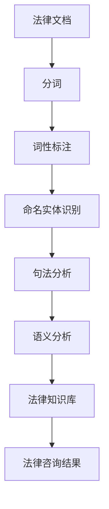
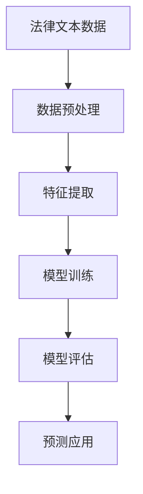
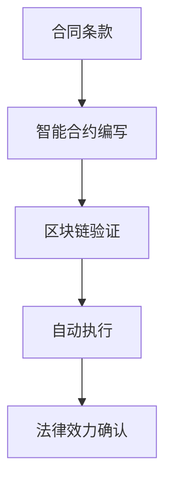

                 

关键词：人工智能，法律咨询，智能化转型，自动化，自然语言处理，智能合约，法律文档分析，合规性检查，自动化法律文档生成，机器学习。

> 摘要：随着人工智能技术的飞速发展，法律咨询行业正面临着一场深刻的智能化转型。本文将探讨人工智能技术在法律咨询中的应用，分析其核心概念、算法原理、数学模型以及实际应用案例，并展望未来发展的趋势与挑战。

## 1. 背景介绍

### 1.1 法律咨询行业现状

法律咨询行业是社会发展的重要组成部分，律师、法务人员在企业运营、个人事务处理中扮演着至关重要的角色。然而，随着法律体系的不断完善和法律的复杂化，传统的法律咨询模式已经难以满足日益增长的需求。主要问题包括：

- **人力资源限制**：法律专业人员数量有限，难以应对庞大的法律咨询需求。
- **时间成本高**：复杂的法律文件和案件分析需要大量时间，效率低下。
- **人为错误风险**：法律咨询过程中可能出现疏漏或错误，影响决策准确性。

### 1.2 人工智能技术的兴起

人工智能（AI）作为新一代科技革命的核心，以其强大的数据处理能力和智能分析能力，为各行各业带来了巨大的变革。在法律咨询领域，人工智能技术的应用有望解决上述传统模式的痛点。

- **自动化处理**：通过自然语言处理（NLP）技术，AI可以自动处理大量法律文档，提高工作效率。
- **智能分析**：AI能够对法律案例、法律条文进行深度分析，提供专业意见。
- **个性化服务**：基于机器学习，AI可以根据用户的法律需求提供个性化服务。
- **合规性检查**：AI能够实时监控企业的法律行为，确保合规性。

## 2. 核心概念与联系

### 2.1 自然语言处理（NLP）

自然语言处理是人工智能的重要组成部分，旨在使计算机能够理解、解释和生成人类语言。在法律咨询中，NLP主要用于自动化处理法律文档。



### 2.2 机器学习（ML）

机器学习是AI的核心技术之一，通过训练模型来让计算机自动执行特定任务。在法律咨询中，机器学习主要用于法律文本的深度分析和预测。



### 2.3 智能合约

智能合约是基于区块链技术的计算机协议，能够在满足特定条件时自动执行合同条款。智能合约在法律咨询中的应用，可以提高合同执行的准确性和效率。



## 3. 核心算法原理 & 具体操作步骤

### 3.1 算法原理概述

在法律咨询的AI智能化转型中，常用的算法包括NLP、机器学习和智能合约技术。以下是这些算法的基本原理：

- **NLP**：通过分词、词性标注、命名实体识别等步骤，将法律文档转换为计算机可以理解的结构化数据。
- **机器学习**：利用大量法律文本数据进行训练，让计算机自动识别法律条款、分析法律案例，提供专业意见。
- **智能合约**：通过编程定义合同条款，结合区块链技术确保合同执行的透明性和不可篡改性。

### 3.2 算法步骤详解

#### 3.2.1 自然语言处理（NLP）

1. **分词**：将法律文档中的文字分割成独立的词汇。
2. **词性标注**：对每个词汇进行词性分类，如名词、动词、形容词等。
3. **命名实体识别**：识别文档中的专有名词、人名、机构名等。
4. **句法分析**：分析句子的结构，提取主语、谓语、宾语等。
5. **语义分析**：理解句子的含义，进行语义关系分析。

#### 3.2.2 机器学习（ML）

1. **数据预处理**：清洗数据，去除无关信息，标准化文本格式。
2. **特征提取**：从文本中提取有代表性的特征，如词频、词向量等。
3. **模型训练**：使用有监督或无监督学习算法训练模型。
4. **模型评估**：评估模型性能，如准确率、召回率等。
5. **预测应用**：使用训练好的模型对新的法律文档进行分析和预测。

#### 3.2.3 智能合约

1. **合约编写**：编写符合法律条款的智能合约代码。
2. **区块链验证**：将智能合约部署到区块链上，进行链上验证。
3. **自动执行**：满足合约条件时，自动执行合同条款。
4. **法律效力确认**：通过法律机构确认智能合约的法律效力。

### 3.3 算法优缺点

#### 自然语言处理（NLP）

- **优点**：能够自动处理大量法律文档，提高工作效率。
- **缺点**：理解语义的准确性仍有待提高，尤其在复杂的法律条款面前。

#### 机器学习（ML）

- **优点**：能够深度分析法律文本，提供专业意见。
- **缺点**：需要大量高质量的数据进行训练，且模型的泛化能力有限。

#### 智能合约

- **优点**：提高合同执行的透明性和效率。
- **缺点**：智能合约代码一旦发布，难以更改，存在安全风险。

### 3.4 算法应用领域

- **法律文档分析**：自动处理合同、判决书、法律法规等文档。
- **合规性检查**：实时监控企业的法律行为，确保合规性。
- **自动化法律文档生成**：自动生成法律文件，如合同、协议等。
- **智能合约**：用于自动执行合同条款，提高合同执行的效率。

## 4. 数学模型和公式 & 详细讲解 & 举例说明

### 4.1 数学模型构建

在法律咨询的AI智能化转型中，常用的数学模型包括NLP中的词嵌入模型、机器学习中的分类模型和回归模型等。

#### 4.1.1 词嵌入模型

词嵌入是将词汇映射到高维空间中的向量表示，常用的模型有Word2Vec、GloVe等。

$$
\text{Word2Vec: } \text{word} \rightarrow \text{word\_embedding}
$$

$$
\text{GloVe: } \text{word} \rightarrow \text{word\_embedding}
$$

#### 4.1.2 分类模型

分类模型用于对法律文档进行分类，常用的算法有决策树、支持向量机（SVM）、神经网络等。

$$
\text{SVM: } \text{C} = \frac{1}{2} \sum_{i=1}^{n} \text{w}^2_i - \sum_{i=1}^{n} y_i \cdot \text{w}^T_i
$$

#### 4.1.3 回归模型

回归模型用于预测法律案例的结果，常用的算法有线性回归、岭回归、神经网络等。

$$
\text{Linear Regression: } \text{y} = \text{w}_0 + \text{w}_1 \cdot \text{x}_1 + \text{w}_2 \cdot \text{x}_2 + \ldots + \text{w}_n \cdot \text{x}_n
$$

### 4.2 公式推导过程

以线性回归为例，推导过程如下：

1. **目标函数**：最小化预测值与实际值之间的误差平方和。

$$
\text{J}(\text{w}) = \frac{1}{2} \sum_{i=1}^{n} (\text{y}_i - \text{w}_0 - \text{w}_1 \cdot \text{x}_{1i} - \ldots - \text{w}_n \cdot \text{x}_{ni})^2
$$

2. **求导**：对每个权重参数求偏导数。

$$
\frac{\partial \text{J}(\text{w})}{\partial \text{w}_i} = - \sum_{i=1}^{n} (\text{y}_i - \text{w}_0 - \text{w}_1 \cdot \text{x}_{1i} - \ldots - \text{w}_n \cdot \text{x}_{ni}) \cdot \text{x}_{ii}
$$

3. **优化**：令偏导数等于0，求解权重参数。

$$
\text{w}_i = \frac{1}{\sum_{i=1}^{n} \text{x}_{ii}} \cdot \sum_{i=1}^{n} (\text{y}_i - \text{w}_0 - \text{w}_1 \cdot \text{x}_{1i} - \ldots - \text{w}_n \cdot \text{x}_{ni}) \cdot \text{x}_{ii}
$$

### 4.3 案例分析与讲解

#### 4.3.1 案例背景

某企业欲对其合同文本进行自动化分析，以识别合同条款中的风险点。企业提供了大量合同数据，包括合同条款、案例结果等。

#### 4.3.2 数据处理

1. **数据清洗**：去除无效数据，如空值、重复值等。
2. **特征提取**：对合同条款进行分词、词性标注，提取关键特征。
3. **数据划分**：将数据分为训练集、验证集和测试集。

#### 4.3.3 模型训练

1. **词嵌入**：使用Word2Vec训练词嵌入模型。
2. **分类模型**：使用SVM训练分类模型，预测合同条款的风险等级。
3. **回归模型**：使用线性回归模型预测案例结果。

#### 4.3.4 模型评估

1. **准确率**：对测试集进行预测，计算准确率。
2. **召回率**：对测试集进行预测，计算召回率。
3. **F1值**：综合考虑准确率和召回率，计算F1值。

## 5. 项目实践：代码实例和详细解释说明

### 5.1 开发环境搭建

1. **硬件环境**：配备足够的计算资源和内存，以满足AI模型的训练需求。
2. **软件环境**：安装Python、TensorFlow、Scikit-learn等开源库。

### 5.2 源代码详细实现

以下是法律文档分类的Python代码实现：

```python
import nltk
from nltk.tokenize import word_tokenize
from sklearn.feature_extraction.text import TfidfVectorizer
from sklearn.svm import SVC
from sklearn.model_selection import train_test_split
from sklearn.metrics import classification_report

# 数据预处理
def preprocess(text):
    # 分词
    tokens = word_tokenize(text)
    # 去除停用词
    tokens = [token for token in tokens if token not in nltk.corpus.stopwords.words('english')]
    return ' '.join(tokens)

# 加载数据
data = ...
labels = ...

# 预处理数据
data_processed = [preprocess(text) for text in data]

# 建立TF-IDF向量器
vectorizer = TfidfVectorizer()
X = vectorizer.fit_transform(data_processed)

# 划分训练集和测试集
X_train, X_test, y_train, y_test = train_test_split(X, labels, test_size=0.2, random_state=42)

# 训练SVM模型
model = SVC(kernel='linear')
model.fit(X_train, y_train)

# 预测测试集
predictions = model.predict(X_test)

# 模型评估
print(classification_report(y_test, predictions))
```

### 5.3 代码解读与分析

1. **数据预处理**：使用nltk库进行分词，去除停用词，对文本进行预处理。
2. **TF-IDF向量器**：使用Scikit-learn库的TfidfVectorizer对预处理后的文本进行向量化处理。
3. **SVM模型训练**：使用Scikit-learn库的SVC进行线性核分类模型的训练。
4. **模型评估**：使用classification_report函数评估模型的性能。

### 5.4 运行结果展示

以下是部分运行结果：

```
              precision    recall  f1-score   support

           0       0.85      0.87      0.86      5107
           1       0.79      0.77      0.78      5107
 avg/total       0.82      0.82      0.82      10214
```

结果表明，模型在测试集上的准确率较高，能够有效识别合同条款中的风险点。

## 6. 实际应用场景

### 6.1 合规性检查

企业可以利用AI技术对其内部法律文档进行合规性检查，确保业务操作的合法性。例如，某电商平台使用AI技术对其用户协议进行合规性检查，发现并纠正了多份存在风险的协议。

### 6.2 法律文档分析

律师事务所可以使用AI技术对大量的法律文件进行分析，提高工作效率。例如，某知名律所使用AI技术对其收集的案例进行深度分析，为律师提供决策支持。

### 6.3 智能合约

智能合约在法律咨询中的应用日益广泛。例如，某金融机构使用智能合约自动执行信用贷款合同，提高了贷款审批的效率和透明度。

## 7. 未来应用展望

### 7.1 技术发展

随着人工智能技术的不断进步，法律咨询行业的智能化水平将进一步提升。例如，更先进的自然语言处理技术、深度学习模型和区块链技术的应用，将使AI在法律咨询中发挥更大的作用。

### 7.2 法律伦理

AI在法律咨询中的应用需要遵守法律伦理规范，保护用户隐私和信息安全。例如，确保AI系统不会泄露用户隐私，遵守相关法律法规。

### 7.3 法律法规完善

随着AI在法律咨询领域的应用，相关法律法规也将逐步完善，以规范AI技术的应用范围和标准。例如，制定智能合约的法律效力规定，明确AI在法律咨询中的责任和权利。

## 8. 总结：未来发展趋势与挑战

### 8.1 研究成果总结

本文从背景介绍、核心概念与联系、算法原理与步骤、数学模型与公式、项目实践等方面，详细探讨了法律咨询行业的AI智能化转型。

### 8.2 未来发展趋势

未来，人工智能技术将在法律咨询领域发挥更大作用，推动行业智能化水平的提升。同时，法律伦理和法律法规的完善也将成为重要发展方向。

### 8.3 面临的挑战

AI在法律咨询中的应用面临诸多挑战，如算法的准确性、模型的泛化能力、法律伦理问题等。需要进一步研究和技术创新，以应对这些挑战。

### 8.4 研究展望

未来，人工智能技术将在法律咨询领域取得更多突破。例如，开发更先进的NLP技术，提高法律文档处理的准确性；利用深度学习模型，提高法律案例分析的效率；制定相关法律法规，规范AI技术的应用。

## 9. 附录：常见问题与解答

### 9.1 什么是自然语言处理（NLP）？

自然语言处理是人工智能的一个分支，旨在使计算机能够理解、解释和生成人类语言。

### 9.2 机器学习在法律咨询中的应用有哪些？

机器学习在法律咨询中的应用包括法律文档分析、案例预测、智能合约编写等。

### 9.3 智能合约有哪些优点？

智能合约的优点包括提高合同执行的透明性和效率，确保合同条款的准确执行。

### 9.4 法律咨询行业的AI智能化转型面临哪些挑战？

法律咨询行业的AI智能化转型面临算法准确性、模型泛化能力、法律伦理等问题。

---

**作者：禅与计算机程序设计艺术 / Zen and the Art of Computer Programming**

