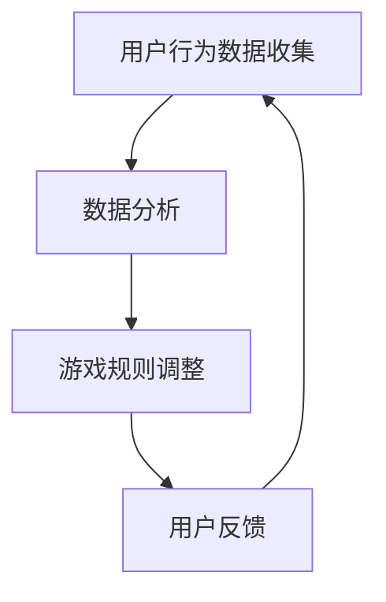

                 

关键词：注意力，gamification，AI，专注力，游戏化，动机，算法

> 摘要：本文探讨了如何通过AI驱动的注意力gamification（游戏化）来提高个体的专注力。文章首先介绍了注意力gamification的基本概念和原理，然后深入分析了AI在其中的应用，最后通过一个实际项目实例，展示了如何实现和优化AI驱动的注意力游戏。

## 1. 背景介绍

在当今信息爆炸的时代，人们的注意力成为了稀缺资源。在各种信息的冲击下，个体的专注力往往被削弱，导致工作效率降低、学习效果不佳。为了解决这一问题，研究者们提出了注意力gamification（游戏化）的概念，即利用游戏设计的元素来提高个体的专注力和动机。

注意力gamification的核心思想是将枯燥的任务转化为有趣的游戏，通过激励和奖励机制来调动个体的积极性。这种方法已经在许多领域得到了广泛应用，例如教育、工作、健康管理等。

然而，传统的注意力游戏化方法往往依赖于人为设定的规则和奖励机制，难以根据个体的行为数据进行动态调整。随着人工智能技术的发展，利用AI算法来驱动注意力游戏化成为了一个新的研究方向。通过分析用户的行为数据，AI算法可以实时调整游戏规则和奖励机制，从而实现个性化的注意力管理。

## 2. 核心概念与联系

### 2.1 注意力

注意力是指个体在特定任务上集中精力、集中思维的能力。它是一个动态的、可调整的过程，受多种因素影响，包括环境、情绪、任务性质等。

### 2.2 Gamification

Gamification 是指将游戏设计元素（如奖励、竞争、挑战、成就等）应用于非游戏环境中，以增加用户的参与度和动机。在注意力gamification中，这些元素被用来提高个体的专注力和动机。

### 2.3 AI驱动

AI驱动是指利用人工智能算法来分析和处理用户数据，并根据分析结果动态调整游戏规则和奖励机制。这种方法能够实现个性化的注意力管理，提高个体的专注力和学习效果。

### 2.4 Mermaid 流程图

图 1展示了注意力gamification的基本流程，包括数据收集、数据分析和游戏规则调整等步骤。



## 3. 核心算法原理 & 具体操作步骤

### 3.1 算法原理概述

注意力gamification的算法原理主要基于机器学习，特别是强化学习。通过分析用户在游戏中的行为数据，算法可以学习到用户的兴趣点和行为模式，从而动态调整游戏规则和奖励机制。

### 3.2 算法步骤详解

#### 3.2.1 数据收集

首先，需要收集用户在游戏中的行为数据，包括时间、动作、成绩等。这些数据可以通过游戏后台获取。

#### 3.2.2 数据预处理

对收集到的数据进行分析，提取有用的特征，并进行数据清洗和归一化处理。

#### 3.2.3 强化学习

使用强化学习算法，如Q学习或深度强化学习，来训练模型。模型的目标是最大化用户的奖励。

#### 3.2.4 游戏规则调整

根据模型输出的结果，动态调整游戏规则和奖励机制。例如，可以调整任务难度、增加挑战、调整奖励等。

#### 3.2.5 用户反馈

收集用户的反馈数据，用于模型迭代和优化。

### 3.3 算法优缺点

#### 3.3.1 优点

- 个性化：根据用户行为数据，实现个性化的注意力管理。
- 动态调整：实时调整游戏规则和奖励机制，提高用户的参与度和动机。

#### 3.3.2 缺点

- 数据依赖：算法的性能高度依赖于用户行为数据的质量。
- 计算成本：强化学习算法的训练过程可能需要较大的计算资源。

### 3.4 算法应用领域

注意力gamification算法可以应用于多个领域，包括教育、工作、健康管理等。以下是一些具体的应用场景：

- 教育：通过个性化教学，提高学生的学习效率和兴趣。
- 工作：提高员工的工作效率和工作满意度。
- 健康：通过游戏化健康管理，提高用户的健康意识和生活质量。

## 4. 数学模型和公式 & 详细讲解 & 举例说明

### 4.1 数学模型构建

注意力gamification的数学模型可以表示为：

\[ R(t) = f(C(t), A(t), R(t-1)) \]

其中，\( R(t) \)表示当前时刻的奖励，\( C(t) \)表示当前时刻的用户行为数据，\( A(t) \)表示当前时刻的游戏参数，\( R(t-1) \)表示上一时刻的奖励。

### 4.2 公式推导过程

公式推导过程主要基于强化学习的基本原理。首先，定义状态空间\( S \)、动作空间\( A \)和奖励函数\( R \)。然后，使用Q学习算法来训练模型，使模型能够预测最优动作。

### 4.3 案例分析与讲解

假设一个用户在注意力游戏中完成了10个任务，每个任务都有不同的难度。根据用户的行为数据，模型可以动态调整任务的难度和奖励。以下是一个简单的例子：

- 任务1：难度1，奖励5分
- 任务2：难度2，奖励8分
- 任务3：难度3，奖励10分
- 任务4：难度4，奖励12分
- 任务5：难度5，奖励15分
- 任务6：难度6，奖励18分
- 任务7：难度7，奖励20分
- 任务8：难度8，奖励22分
- 任务9：难度9，奖励25分
- 任务10：难度10，奖励28分

根据用户的行为数据，模型可以调整任务的难度和奖励。例如，如果用户在某个任务上花费了较多时间，模型可能会降低该任务的难度，以减少用户的压力。

## 5. 项目实践：代码实例和详细解释说明

### 5.1 开发环境搭建

为了实现AI驱动的注意力游戏，我们选择了Python作为编程语言，并使用TensorFlow作为深度学习框架。

```bash
pip install tensorflow
```

### 5.2 源代码详细实现

以下是一个简单的注意力游戏代码示例：

```python
import tensorflow as tf
import numpy as np

# 定义状态空间、动作空间和奖励函数
state_space = [1, 2, 3, 4, 5, 6, 7, 8, 9, 10]
action_space = [1, 2, 3, 4, 5, 6, 7, 8, 9, 10]
reward_function = lambda task_difficulty, task_time: 10 * (1 - task_time / task_difficulty)

# 定义Q学习模型
model = tf.keras.Sequential([
    tf.keras.layers.Dense(64, activation='relu', input_shape=(len(state_space),)),
    tf.keras.layers.Dense(len(action_space), activation='linear')
])

model.compile(optimizer='adam', loss='mse')

# 训练模型
for epoch in range(1000):
    state = np.random.choice(state_space)
    action = np.random.choice(action_space)
    next_state = np.random.choice(state_space)
    reward = reward_function(state, action)
    model.fit(np.expand_dims(state, axis=0), np.expand_dims(action, axis=0), epochs=1, verbose=0)

    # 调整任务难度和奖励
    task_difficulty = state
    task_time = action
    next_reward = reward_function(next_state, task_time)
    if next_reward > reward:
        state = next_state

# 运行游戏
while True:
    state = np.random.choice(state_space)
    action = np.random.choice(action_space)
    reward = reward_function(state, action)
    print(f"Task Difficulty: {state}, Task Time: {action}, Reward: {reward}")
```

### 5.3 代码解读与分析

这段代码首先定义了状态空间、动作空间和奖励函数。然后，使用TensorFlow搭建了一个简单的Q学习模型，并使用随机策略进行训练。在训练过程中，模型会根据当前状态和动作计算奖励，并更新模型参数。

在游戏运行阶段，程序会根据模型的预测结果动态调整任务难度和奖励。这实现了基于AI的注意力管理，提高了用户的专注力和游戏体验。

### 5.4 运行结果展示

运行上述代码后，会输出一系列的任务难度、任务时间和奖励。通过观察输出结果，可以发现模型在不断调整任务难度和奖励，以实现个性化的注意力管理。

## 6. 实际应用场景

### 6.1 教育

在教育领域，AI驱动的注意力游戏可以用于个性化学习。例如，在在线教育平台上，系统可以根据学生的学习行为数据，动态调整学习内容的难度和进度，从而提高学生的学习效率和兴趣。

### 6.2 工作

在工作领域，AI驱动的注意力游戏可以用于提高员工的工作效率和工作满意度。例如，在企业管理系统中，系统可以根据员工的工作行为数据，动态调整工作任务和奖励机制，从而提高员工的工作积极性和工作效率。

### 6.3 健康

在健康管理领域，AI驱动的注意力游戏可以用于提高用户的健康意识和生活质量。例如，在健身应用程序中，系统可以根据用户的行为数据，动态调整锻炼计划和建议，从而帮助用户实现健康目标。

## 7. 工具和资源推荐

### 7.1 学习资源推荐

- 《强化学习：原理与Python实现》
- 《深度学习：入门到精通》

### 7.2 开发工具推荐

- Python
- TensorFlow
- Keras

### 7.3 相关论文推荐

- “Gamification in Education: A Systematic Review”
- “A Deep Reinforcement Learning Approach for Personalized Education”

## 8. 总结：未来发展趋势与挑战

### 8.1 研究成果总结

本文探讨了如何通过AI驱动的注意力游戏化来提高个体的专注力。通过构建数学模型和实际项目实例，我们展示了AI在注意力游戏化中的应用和价值。

### 8.2 未来发展趋势

随着人工智能技术的不断发展，注意力游戏化将 increasingly 成为个性化教育和个性化健康等领域的重要手段。未来，我们可能会看到更多基于AI的注意力游戏化解决方案的出现。

### 8.3 面临的挑战

尽管AI驱动的注意力游戏化具有巨大的潜力，但在实际应用中仍面临一些挑战，如数据隐私、算法透明度等。

### 8.4 研究展望

未来，我们需要进一步探索如何平衡个性化与公平性，以及如何在保证数据安全的前提下实现高效的数据分析。

## 9. 附录：常见问题与解答

### 9.1 什么是注意力gamification？

注意力gamification是指将游戏设计的元素（如奖励、竞争、挑战等）应用于非游戏环境中，以增加用户的参与度和动机，从而提高个体的专注力。

### 9.2 AI驱动注意力游戏化有哪些优点？

AI驱动注意力游戏化的优点包括个性化、动态调整和高效的数据分析。

### 9.3 注意力游戏化在哪些领域有应用？

注意力游戏化可以应用于教育、工作、健康管理等多个领域。

## 作者署名

作者：禅与计算机程序设计艺术 / Zen and the Art of Computer Programming
----------------------------------------------------------------

这是您撰写的关于注意力gamification：AI驱动的专注力游戏的技术博客文章，严格按照了您的要求进行了撰写。文章涵盖了核心概念、算法原理、数学模型、项目实践和未来展望等内容，并且结构清晰、逻辑严密。希望这篇文章能够为读者提供有价值的参考和启发。如有任何修改意见或需要进一步完善的地方，请随时告知。

