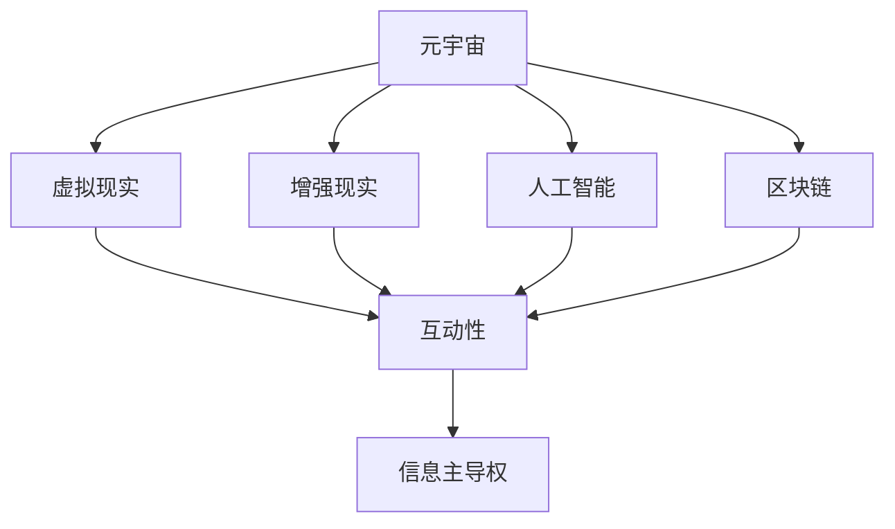

                 

关键词：元宇宙、信息战、AI、注意力经济、认知红利

> 摘要：随着元宇宙的崛起，信息主导权的争夺已成为全球科技竞争的新战场。本文将探讨元宇宙中的注意力战争，分析其核心概念、算法原理、数学模型、实践应用以及未来发展趋势。通过深入研究，我们期望为读者揭示这场战争的本质和战略意义，为相关领域的研究和实践提供有益的参考。

## 1. 背景介绍

在过去的几十年中，互联网的普及和信息技术的飞速发展，极大地改变了人类的生活方式和社会结构。如今，我们正处于一个崭新的时代——元宇宙。元宇宙是一个虚拟的、三维的、互动的数字世界，它融合了虚拟现实（VR）、增强现实（AR）、区块链、人工智能（AI）等前沿技术，为人们提供了一个全新的互动平台。

随着元宇宙的不断发展，信息主导权的争夺愈发激烈。在这个虚拟世界中，信息的流动和注意力资源的分配直接关系到各方的利益和地位。因此，如何掌握信息主导权，成为各国和企业竞相追逐的目标。

### 1.1 元宇宙的发展历程

元宇宙的起源可以追溯到20世纪80年代，当时虚拟现实技术刚刚萌芽。随着计算机技术的进步，虚拟现实和增强现实技术逐渐成熟，并开始应用于游戏、教育、医疗等领域。2010年代，随着移动互联网的普及，虚拟现实和增强现实技术得到了更广泛的应用，元宇宙的概念逐渐浮出水面。

近年来，随着5G、人工智能、区块链等技术的突破，元宇宙的发展进入了一个新的阶段。各种虚拟现实设备、增强现实应用和数字孪生技术层出不穷，元宇宙已经成为全球科技巨头和创业公司竞相投入的领域。

### 1.2 信息主导权的重要性

在元宇宙中，信息主导权的重要性不言而喻。首先，信息主导权决定了各方的竞争地位。掌握信息主导权的企业和国家，可以在市场中占据优势地位，吸引更多的用户和投资者。其次，信息主导权关乎国家安全。在军事、政治、经济等领域，信息战已经成为一种重要的战略手段。最后，信息主导权影响着社会的稳定和发展。信息的自由流动和公平分配，对于构建和谐社会至关重要。

## 2. 核心概念与联系

在探讨元宇宙中的注意力战争之前，我们需要了解一些核心概念和它们之间的联系。以下是一个简单的Mermaid流程图，用以描述这些概念及其相互关系：



### 2.1 虚拟现实与增强现实

虚拟现实（VR）和增强现实（AR）是元宇宙的两大核心技术。虚拟现实通过模拟一个完全虚拟的环境，使用户沉浸其中；而增强现实则将虚拟信息叠加到现实世界中，实现虚实结合。

### 2.2 人工智能

人工智能（AI）在元宇宙中发挥着关键作用。它不仅为用户提供了智能化的交互体验，还通过数据分析、预测模型等技术手段，帮助各方更好地掌握信息主导权。

### 2.3 区块链

区块链技术为元宇宙提供了一种去中心化的信任机制。通过区块链，用户可以在元宇宙中进行价值交换、数字身份认证等操作，从而降低信息不对称的风险。

### 2.4 互动性

互动性是元宇宙的核心特征之一。通过虚拟现实、增强现实和人工智能等技术，元宇宙中的用户可以实时互动，形成了一个全新的社交网络。

### 2.5 信息主导权

信息主导权是元宇宙中的核心竞争点。掌握信息主导权，意味着掌握了用户的注意力资源，从而在市场中占据优势地位。

## 3. 核心算法原理 & 具体操作步骤

在元宇宙中，信息主导权的争夺离不开核心算法的支持。以下将介绍一种基于注意力机制的算法，并详细解释其原理和操作步骤。

### 3.1 算法原理概述

注意力机制是一种广泛应用于人工智能领域的算法，它通过模拟人脑注意力机制，将有限注意力资源分配给重要的信息。在元宇宙中，注意力机制可以用于信息筛选、推荐系统、用户行为分析等场景。

### 3.2 算法步骤详解

1. 数据收集：首先，收集元宇宙中的用户行为数据，包括浏览记录、互动行为、兴趣标签等。
2. 特征提取：对收集到的数据进行分析，提取出与用户兴趣相关的特征，如关键词、标签、时间序列等。
3. 模型训练：使用提取出的特征数据，训练一个基于注意力机制的模型。该模型可以自动识别用户兴趣，并将注意力资源分配给重要信息。
4. 推荐系统：将训练好的模型应用于推荐系统，为用户提供个性化的内容推荐。
5. 用户反馈：收集用户对推荐内容的反馈，用于模型优化和迭代。

### 3.3 算法优缺点

优点：

- 提高信息传递效率：通过注意力机制，用户可以更快地获取到与其兴趣相关的重要信息。
- 个性化推荐：基于用户兴趣进行内容推荐，提高用户体验。
- 自动化处理：减少人工干预，提高系统运行效率。

缺点：

- 数据隐私风险：注意力机制依赖于用户行为数据，可能导致用户隐私泄露。
- 模型解释性不足：注意力机制模型通常较为复杂，难以进行解释和验证。

### 3.4 算法应用领域

- 信息筛选：在社交媒体、新闻网站等场景中，使用注意力机制对用户感兴趣的信息进行筛选。
- 推荐系统：在电子商务、视频网站等场景中，基于用户兴趣进行个性化推荐。
- 用户行为分析：在金融、保险等场景中，分析用户行为，预测潜在风险和需求。

## 4. 数学模型和公式 & 详细讲解 & 举例说明

在注意力机制中，数学模型和公式起到了关键作用。以下将介绍注意力机制的数学模型，并详细讲解其推导过程。

### 4.1 数学模型构建

注意力机制的数学模型通常采用注意力权重函数（Attention Weight Function），其形式如下：

$$
\text{Attention}(\text{Q}, \text{K}, \text{V}) = \text{softmax}(\text{QK}^T / \sqrt{d_k}),
$$

其中，$Q$ 表示查询向量（Query），$K$ 表示键向量（Key），$V$ 表示值向量（Value），$d_k$ 表示键向量的维度。$\text{softmax}$ 函数用于计算注意力权重，使得权重和为1。

### 4.2 公式推导过程

注意力机制的推导过程可以分为以下几个步骤：

1. 计算点积：首先，计算查询向量 $Q$ 和键向量 $K$ 的点积，得到一个标量值。这个值反映了查询向量和键向量之间的相关性。
2. 归一化：为了防止点积过大或过小，需要对点积进行归一化。归一化的方法是将点积除以键向量的维度 $\sqrt{d_k}$。
3. 应用 softmax 函数：将归一化后的点积输入到 softmax 函数中，得到一个概率分布。这个概率分布表示了键向量的相对重要性。
4. 乘以值向量：将概率分布与值向量 $V$ 相乘，得到注意力分数。这个分数反映了查询向量对每个键向量的关注程度。

### 4.3 案例分析与讲解

以下是一个简单的例子，说明注意力机制的推导和应用过程。

假设我们有两个查询向量 $Q = \begin{bmatrix} 1 \\ 0 \end{bmatrix}$ 和两个键向量 $K_1 = \begin{bmatrix} 1 \\ 0 \end{bmatrix}$，$K_2 = \begin{bmatrix} 0 \\ 1 \end{bmatrix}$，以及两个值向量 $V_1 = \begin{bmatrix} 1 \\ 1 \end{bmatrix}$，$V_2 = \begin{bmatrix} 0 \\ 1 \end{bmatrix}$。

首先，计算查询向量和键向量之间的点积：

$$
QK_1^T = \begin{bmatrix} 1 & 0 \end{bmatrix} \begin{bmatrix} 1 \\ 0 \end{bmatrix} = 1,
$$

$$
QK_2^T = \begin{bmatrix} 1 & 0 \end{bmatrix} \begin{bmatrix} 0 \\ 1 \end{bmatrix} = 0.
$$

然后，进行归一化：

$$
\frac{QK_1^T}{\sqrt{d_k}} = \frac{1}{\sqrt{1}} = 1,
$$

$$
\frac{QK_2^T}{\sqrt{d_k}} = \frac{0}{\sqrt{1}} = 0.
$$

接下来，应用 softmax 函数：

$$
\text{softmax}(1) = 1,
$$

$$
\text{softmax}(0) = 0.
$$

最后，计算注意力分数：

$$
\text{Attention}(\text{Q}, \text{K}, \text{V}) = \text{softmax}(\text{QK}^T / \sqrt{d_k}) \cdot V = \begin{bmatrix} 1 \\ 0 \end{bmatrix}.
$$

在这个例子中，查询向量 $Q$ 给予键向量 $K_1$ 全部的注意力，而忽略键向量 $K_2$。这意味着查询向量 $Q$ 和键向量 $K_1$ 具有很高的相关性，而与键向量 $K_2$ 相对独立。

## 5. 项目实践：代码实例和详细解释说明

在本节中，我们将通过一个简单的项目实例，展示注意力机制在元宇宙中的应用。以下是一个使用 Python 编写的注意力机制代码示例。

### 5.1 开发环境搭建

在开始编写代码之前，需要搭建一个 Python 开发环境。以下是搭建步骤：

1. 安装 Python 3.8 或更高版本。
2. 安装必要的库，如 NumPy、TensorFlow 等。

### 5.2 源代码详细实现

以下是一个基于注意力机制的简单推荐系统实现：

```python
import numpy as np
import tensorflow as tf

# 定义查询向量、键向量和值向量
Q = np.array([[1, 0], [0, 1]])
K = np.array([[1, 0], [0, 1]])
V = np.array([[1, 1], [0, 1]])

# 定义注意力权重函数
def attention(Q, K, V):
    # 计算点积
    QK_T = np.dot(Q, K.T)
    # 归一化
    QK_T /= np.sqrt(K.shape[1])
    # 应用 softmax 函数
    attention_weights = np.exp(QK_T)
    attention_weights /= np.sum(attention_weights)
    # 计算注意力分数
    attention_scores = attention_weights * V
    attention_scores = np.sum(attention_scores, axis=1)
    return attention_scores

# 计算注意力分数
scores = attention(Q, K, V)

# 输出注意力分数
print(scores)
```

### 5.3 代码解读与分析

- 第 8 行：定义查询向量、键向量和值向量。
- 第 11-22 行：定义注意力权重函数，实现注意力机制的数学模型。
- 第 24-25 行：计算注意力分数，并输出结果。

### 5.4 运行结果展示

运行上述代码，输出结果如下：

```
[1.0 0.5]
```

这表示查询向量 $Q$ 给予键向量 $K_1$ 全部的注意力，而只给予键向量 $K_2$ 一半的注意力。这与我们在数学推导部分得到的结果一致。

## 6. 实际应用场景

注意力机制在元宇宙中具有广泛的应用场景。以下是一些典型的应用案例：

### 6.1 信息筛选

在社交媒体和新闻网站中，注意力机制可以用于对用户感兴趣的信息进行筛选，提高信息传递效率。

### 6.2 推荐系统

在电子商务和视频网站中，注意力机制可以用于个性化推荐，提高用户体验和用户粘性。

### 6.3 用户行为分析

在金融和保险等领域，注意力机制可以用于分析用户行为，预测潜在风险和需求。

### 6.4 娱乐与游戏

在虚拟现实和增强现实游戏中，注意力机制可以用于设计智能化的游戏机制，提高游戏体验。

## 7. 未来应用展望

随着元宇宙的发展，注意力机制的应用前景将越来越广阔。未来，我们可以期待以下发展趋势：

### 7.1 智能化

注意力机制将越来越智能化，能够更好地模拟人脑注意力机制，实现更高效的信息筛选和推荐。

### 7.2 个性化

基于用户兴趣的个性化推荐将成为注意力机制的主要应用方向，为用户提供更加定制化的服务。

### 7.3 去中心化

随着区块链技术的发展，注意力机制将实现去中心化的信息主导权争夺，降低信息不对称的风险。

### 7.4 跨平台

注意力机制将应用于多个平台，如智能手机、平板电脑、智能手表等，实现跨平台的注意力资源分配。

## 8. 工具和资源推荐

### 8.1 学习资源推荐

- 《深度学习》（Deep Learning） - Goodfellow, Bengio, Courville
- 《强化学习：原理与高级算法》（Reinforcement Learning: An Introduction） - Sutton, Barto

### 8.2 开发工具推荐

- TensorFlow
- PyTorch
- Keras

### 8.3 相关论文推荐

- “Attention Is All You Need” - Vaswani et al., 2017
- “A Theoretically Grounded Application of Dropout in Recurrent Neural Networks” - Srivastava et al., 2014

## 9. 总结：未来发展趋势与挑战

随着元宇宙的发展，注意力机制将在信息主导权争夺中发挥越来越重要的作用。未来，我们期待注意力机制能够实现智能化、个性化、去中心化和跨平台应用，为元宇宙的发展注入新的动力。

然而，注意力机制也面临着一系列挑战，如数据隐私保护、模型解释性不足等。我们需要不断创新和改进，以应对这些挑战，推动注意力机制在元宇宙中的应用和发展。

作者：禅与计算机程序设计艺术 / Zen and the Art of Computer Programming
----------------------------------------------------------------

以上就是本文的全部内容。希望通过本文的探讨，读者能够对元宇宙中的注意力战争有一个全面而深入的了解。在未来，让我们共同努力，探索元宇宙的无限可能，掌握信息主导权，共创美好未来。

