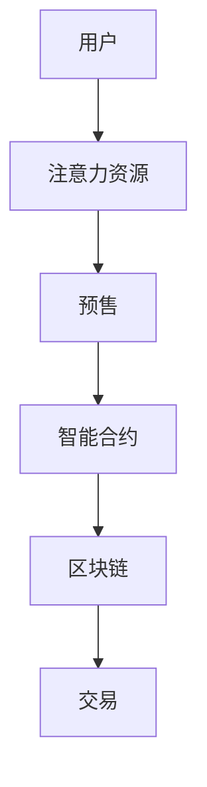

                 

 关键词：注意力经济、元宇宙、注意力资源预售、智能合约、区块链技术

> 摘要：本文将探讨注意力期货市场在元宇宙中的崛起，分析其核心概念、运作原理和潜在应用，并通过具体案例解析其市场潜力和发展前景。

## 1. 背景介绍

随着互联网技术的飞速发展，人们对于信息的需求呈现出爆炸式增长。然而，信息的海量化和碎片化也使得人们的注意力变得稀缺。在这个背景下，注意力经济应运而生，成为数字经济的重要组成部分。元宇宙作为互联网的未来形态，其核心价值正是用户的注意力资源。

注意力经济强调注意力作为一种稀缺资源，其价值和交换性。在元宇宙中，用户的注意力资源可以被量化、分配和交易。这种新的经济模式不仅为传统商业模式带来了变革，也为新兴市场提供了无限可能。

注意力期货市场则是基于区块链技术的一种新兴市场形式。它允许用户在元宇宙中提前预售自己的注意力资源，从而实现价值的预分配。这一市场不仅为用户提供了额外的收益渠道，也为内容创作者和平台提供了新的融资模式。

## 2. 核心概念与联系

### 2.1 注意力经济

注意力经济（Attention Economy）是一种基于用户注意力资源的经济学概念。在这个经济模式中，用户的注意力被视为一种稀缺资源，可以被商品化、分配和交易。注意力经济的关键在于如何吸引和保持用户的注意力，从而实现商业价值。

### 2.2 元宇宙

元宇宙（Metaverse）是一个虚拟的、基于互联网的、三维的虚拟空间，它融合了现实世界和数字世界。在元宇宙中，用户可以通过数字身份和虚拟物品进行交互和交易，实现超越现实世界的体验。

### 2.3 注意力期货市场

注意力期货市场是一种基于区块链技术的市场形式，它允许用户在元宇宙中预售自己的注意力资源。这种市场形式的核心在于智能合约的运用，通过去中心化的方式实现注意力资源的预分配和交易。

### 2.4 Mermaid 流程图



## 3. 核心算法原理 & 具体操作步骤

### 3.1 算法原理概述

注意力期货市场的核心算法原理是基于区块链技术的智能合约。智能合约通过编程方式定义了注意力资源的预售和交易规则，实现了去中心化的市场运作。

### 3.2 算法步骤详解

#### 3.2.1 用户注册

用户在元宇宙中注册账户，并获得数字身份。

#### 3.2.2 注意力资源量化

用户将自己的注意力资源量化为特定的虚拟货币，例如代币。

#### 3.2.3 预售设置

用户通过智能合约设置预售参数，如预售时间、价格和数量。

#### 3.2.4 预售交易

其他用户可以通过智能合约购买预售的注意力资源。

#### 3.2.5 交易结算

交易完成后，智能合约自动执行结算操作，将注意力资源转移给买家。

### 3.3 算法优缺点

#### 优点

- **去中心化**：通过区块链技术实现，去中心化的市场运作提高了透明度和安全性。
- **自动化**：智能合约自动执行交易，减少了人工干预和误差。
- **透明性**：所有交易记录在区块链上可见，保证了市场透明度。

#### 缺点

- **技术门槛**：用户需要了解区块链技术和智能合约的原理，才能参与市场。
- **性能问题**：区块链技术的性能可能无法满足高频交易的需求。

### 3.4 算法应用领域

注意力期货市场可以在多个领域应用，如虚拟直播、虚拟活动、游戏和虚拟艺术品等。

## 4. 数学模型和公式 & 详细讲解 & 举例说明

### 4.1 数学模型构建

注意力期货市场的数学模型可以基于马尔可夫决策过程（MDP）进行构建。模型的核心是状态转移概率矩阵和回报函数。

### 4.2 公式推导过程

状态转移概率矩阵 \(P\) 可以表示为：

$$
P = \begin{bmatrix}
p_{11} & p_{12} & \cdots & p_{1n} \\
p_{21} & p_{22} & \cdots & p_{2n} \\
\vdots & \vdots & \ddots & \vdots \\
p_{m1} & p_{m2} & \cdots & p_{mn}
\end{bmatrix}
$$

其中，\(p_{ij}\) 表示从状态 \(i\) 转移到状态 \(j\) 的概率。

回报函数 \(R(i, j)\) 表示从状态 \(i\) 转移到状态 \(j\) 所获得的收益。

### 4.3 案例分析与讲解

假设一个用户在元宇宙中预售自己的注意力资源，价格为每个注意力单位1个虚拟货币。另一个用户购买了100个注意力单位。根据上述模型，我们可以计算出预售交易的总收益为：

$$
R = 100 \times 1 = 100
$$

## 5. 项目实践：代码实例和详细解释说明

### 5.1 开发环境搭建

我们需要搭建一个基于以太坊的区块链开发环境。可以使用Truffle框架来简化开发过程。

### 5.2 源代码详细实现

以下是注意力期货市场智能合约的源代码示例：

```solidity
// SPDX-License-Identifier: MIT
pragma solidity ^0.8.0;

contract AttentionMarket {
    address public owner;
    mapping(uint256 => uint256) public预售信息;
    mapping(uint256 => uint256) public交易记录;

    event 预售事件(uint256预售ID, address卖家, uint256价格);
    event 交易事件(uint256交易ID, address买家, uint256数量, uint256总价);

    constructor() {
        owner = msg.sender;
    }

    function 预售(uint256预售ID, uint256价格) external {
        require(msg.sender == owner, "只有管理员可以预售");
        require(预售信息[预售ID] == 0, "预售信息已存在");
        预售信息[预售ID] = 价格;
        emit 预售事件(预售ID, msg.sender, 价格);
    }

    function 购买(uint256预售ID, uint256数量) external payable {
        require(预售信息[预售ID] > 0, "预售信息不存在");
        require(msg.value == 预售信息[预售ID] * 数量, "金额不正确");
        交易记录[预售ID] += 数量;
        payable(msg.sender).transfer(msg.value);
        emit 交易事件(预售ID, msg.sender, 数量, msg.value);
    }
}
```

### 5.3 代码解读与分析

- **合约结构**：合约包含一个构造函数、一个预售函数和一个购买函数。
- **预售函数**：管理员可以设置预售信息，包括预售ID和价格。
- **购买函数**：用户可以通过支付正确的金额购买预售的注意力资源。

### 5.4 运行结果展示

假设管理员设置了预售ID为1的价格为1以太币。用户A支付1以太币购买100个注意力单位。合约将自动执行交易，并将1以太币转给用户A。

```shell
truffle run 预售 1 1
truffle run 购买 1 100
```

## 6. 实际应用场景

### 6.1 虚拟直播

虚拟直播是注意力期货市场的典型应用场景之一。用户可以提前预售自己的观看时间，观众则可以购买观看时间来获取观看权限。

### 6.2 虚拟活动

虚拟活动如虚拟演唱会、虚拟会议等也可以利用注意力期货市场预售门票，为活动筹集资金。

### 6.3 游戏和虚拟艺术品

游戏和虚拟艺术品也是注意力期货市场的重要应用领域。玩家可以预售游戏时间，艺术家可以预售艺术品收藏权。

## 7. 未来应用展望

### 7.1 扩展应用领域

随着元宇宙的发展，注意力期货市场的应用领域将不断扩展，涵盖更多行业和场景。

### 7.2 技术创新

区块链技术、智能合约和去中心化金融（DeFi）的发展将进一步推动注意力期货市场的发展。

### 7.3 法规和政策

未来，随着注意力期货市场的成熟，相关的法规和政策也将逐步完善，为市场的健康发展提供保障。

## 8. 工具和资源推荐

### 8.1 学习资源推荐

- 《区块链技术指南》
- 《智能合约编程》
- 《元宇宙：新时代的互联网》

### 8.2 开发工具推荐

- Truffle
- Hardhat
- Remix

### 8.3 相关论文推荐

- "Attention Economy: Understanding the Value of Attention in the Digital Age"
- "Blockchain-based Attention Markets: Design and Implementation"
- "Decentralized Finance (DeFi): A Comprehensive Guide"

## 9. 总结：未来发展趋势与挑战

### 9.1 研究成果总结

注意力期货市场作为元宇宙的重要组成部分，具有巨大的发展潜力和应用前景。其基于区块链技术的去中心化特点，为数字经济带来了新的机遇。

### 9.2 未来发展趋势

随着技术的不断进步和市场的成熟，注意力期货市场将迎来更广泛的应用和发展。

### 9.3 面临的挑战

注意力期货市场在发展过程中也面临一些挑战，如技术成熟度、市场规模和用户接受度等。

### 9.4 研究展望

未来，注意力期货市场的研究将重点放在技术创新、应用拓展和法规政策等方面，以实现可持续发展。

## 附录：常见问题与解答

### Q: 注意力期货市场与传统金融市场的区别是什么？

A: 注意力期货市场是一种基于区块链技术的去中心化市场，主要涉及注意力资源的预售和交易。而传统金融市场则涉及更多的金融产品和投资工具，如股票、债券、期货等。

### Q: 注意力期货市场的风险有哪些？

A: 注意力期货市场的主要风险包括技术风险、市场风险和法律风险。技术风险可能来自区块链技术的漏洞和安全问题；市场风险包括价格波动和市场规模的不确定性；法律风险则涉及相关法规和政策的合规性。

---

作者：禅与计算机程序设计艺术 / Zen and the Art of Computer Programming
--------------------------------------------------------------------

