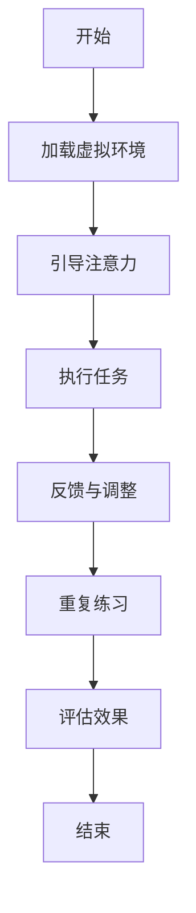

                 

关键词：注意力治疗、元宇宙、心理健康、虚拟现实、认知疗法、神经可塑性

摘要：随着元宇宙技术的发展，虚拟现实成为了一种新的心理健康干预工具。本文将探讨注意力治疗在元宇宙中的新方法，包括其核心概念、算法原理、数学模型、实践应用以及未来发展趋势。通过分析注意力治疗在元宇宙中的应用，本文旨在为心理健康领域提供一种创新的解决方案。

## 1. 背景介绍

在当今社会，心理健康问题日益突出。无论是焦虑、抑郁还是压力，都给人们的日常生活和工作带来了极大的困扰。传统心理治疗方法虽然在一定程度上有效，但往往存在疗程时间长、疗效不稳定等问题。随着虚拟现实技术的迅速发展，一种新的心理健康干预方法——注意力治疗，在元宇宙中得到了广泛应用。

注意力治疗是一种基于认知行为疗法的心理干预方法，旨在通过引导个体的注意力，帮助他们从负面情绪中解脱出来，增强自我调节能力。在元宇宙中，虚拟现实技术为注意力治疗提供了新的应用场景，使得这一治疗方法更加直观、有趣，更容易被广大用户接受。

### 注意力治疗的基本原理

注意力治疗的理论基础主要来源于认知行为疗法。认知行为疗法认为，个体的情绪和行为是由其认知过程所决定的。通过改变个体的认知方式，可以改善其情绪和行为问题。注意力治疗的核心在于引导个体的注意力，使其集中在积极的、有益的事物上，从而减少负面情绪的干扰。

### 元宇宙与虚拟现实

元宇宙（Metaverse）是指通过互联网连接的虚拟世界，它由多个虚拟现实（VR）空间组成。这些虚拟空间不仅提供了高度沉浸式的体验，还可以模拟现实世界中的各种情境。虚拟现实技术通过头戴式显示器、手套、传感器等设备，将用户完全沉浸在一个虚拟的环境中，从而提供了丰富的交互体验。

## 2. 核心概念与联系

在元宇宙中实施注意力治疗，需要理解以下几个核心概念：

### 2.1. 注意力分散

注意力分散是指个体的注意力被分散到多个事物上，导致无法集中于某一特定事物。在元宇宙中，通过设计特定的虚拟场景和任务，可以帮助个体练习注意力的集中和控制。

### 2.2. 神经可塑性

神经可塑性是指大脑在结构和功能上能够根据外界刺激进行改变的能力。注意力治疗通过重复的练习和刺激，可以增强大脑的神经连接，提高注意力控制能力。

### 2.3. 认知行为疗法

认知行为疗法是一种通过改变认知方式来改善情绪和行为问题的心理治疗方法。在元宇宙中，通过虚拟现实技术，可以创造各种认知行为疗法的场景，使治疗过程更加生动和有趣。

### 2.4. Mermaid 流程图

以下是注意力治疗在元宇宙中应用的 Mermaid 流程图：



## 3. 核心算法原理 & 具体操作步骤

### 3.1. 算法原理概述

注意力治疗在元宇宙中的核心算法原理是利用虚拟现实技术创建一个沉浸式的治疗环境，通过引导用户进行注意力集中的任务，达到治疗的效果。算法的核心步骤包括：

1. **环境加载**：加载虚拟现实环境，确保用户能够沉浸在虚拟世界中。
2. **注意力引导**：通过设计特定的任务和场景，引导用户将注意力集中在特定的目标上。
3. **任务执行**：用户在虚拟环境中执行任务，任务设计要能够测试和训练用户的注意力。
4. **反馈与调整**：根据用户的任务表现，提供即时的反馈，并调整任务难度和类型。
5. **重复练习**：通过重复执行任务，增强用户的注意力控制能力。
6. **效果评估**：定期评估用户的注意力改善情况，以调整治疗计划。

### 3.2. 算法步骤详解

#### 3.2.1. 环境加载

在开始治疗之前，需要加载虚拟现实环境。这通常包括以下步骤：

- **选择虚拟环境**：根据治疗的目标和用户需求，选择适合的虚拟环境。
- **设备准备**：确保用户佩戴的头戴式显示器、手套、传感器等设备正常工作。
- **环境配置**：设置虚拟环境的参数，如光线、声音等，以提供沉浸式的体验。

#### 3.2.2. 注意力引导

注意力引导是注意力治疗的核心步骤，包括：

- **任务介绍**：向用户介绍即将执行的任务，明确任务的目标和要求。
- **场景设计**：设计一个能够引导用户注意力的虚拟场景，例如一个有特定目标点的迷宫。
- **互动设计**：设计互动元素，如用户需要点击特定目标点或避开干扰物。

#### 3.2.3. 任务执行

用户在虚拟环境中执行任务，任务设计要能够测试和训练用户的注意力。具体步骤包括：

- **开始任务**：用户开始执行任务，系统记录用户的表现。
- **任务监控**：监控系统用户的行为，确保任务按计划进行。
- **数据采集**：采集用户在任务中的表现数据，如反应时间、错误次数等。

#### 3.2.4. 反馈与调整

根据用户在任务中的表现，系统提供即时的反馈，并调整任务难度和类型。具体步骤包括：

- **即时反馈**：在用户完成任务后，立即提供反馈，说明用户的进步和不足。
- **任务调整**：根据反馈调整任务的难度和类型，以适应用户的能力和需求。

#### 3.2.5. 重复练习

通过重复执行任务，用户可以逐渐提高注意力控制能力。具体步骤包括：

- **定期练习**：定期安排用户进行练习，以巩固治疗效果。
- **难度提升**：随着用户能力的提高，逐步增加任务的难度。

#### 3.2.6. 效果评估

定期评估用户的注意力改善情况，以调整治疗计划。具体步骤包括：

- **数据收集**：收集用户在治疗过程中的数据，如反应时间、错误率等。
- **效果评估**：分析数据，评估用户的注意力改善情况。
- **计划调整**：根据评估结果，调整治疗计划和任务设计。

### 3.3. 算法优缺点

**优点**：

- **沉浸式体验**：虚拟现实技术提供了高度沉浸式的体验，使用户更容易投入治疗过程中。
- **个性化定制**：根据用户的需求和表现，可以定制个性化的治疗计划。
- **实时反馈**：通过即时反馈，可以帮助用户快速了解自己的进步和不足。

**缺点**：

- **技术依赖**：注意力治疗在元宇宙中依赖于虚拟现实技术，技术故障可能会影响治疗效果。
- **训练成本**：虚拟现实设备的成本较高，可能限制治疗的应用范围。

### 3.4. 算法应用领域

注意力治疗在元宇宙中的应用非常广泛，包括但不限于以下几个方面：

- **心理健康治疗**：用于治疗焦虑、抑郁、压力等心理健康问题。
- **学习辅助**：用于提高学生的学习效率和注意力集中能力。
- **职业训练**：用于提高员工的注意力和决策能力。

## 4. 数学模型和公式 & 详细讲解 & 举例说明

### 4.1. 数学模型构建

注意力治疗的数学模型主要基于认知行为疗法的基本原理。以下是构建数学模型的基本步骤：

1. **定义变量**：

   - **A**：用户的注意力水平。
   - **C**：用户的认知能力。
   - **M**：虚拟环境中的刺激强度。

2. **建立关系式**：

   根据注意力治疗的理论，用户的注意力水平与认知能力和刺激强度之间存在关系。具体关系可以表示为：

   $$ A = f(C, M) $$

   其中，$f$ 是一个非线性函数，用于描述注意力水平与认知能力和刺激强度之间的关系。

3. **定义目标函数**：

   目标函数可以定义为用户在虚拟环境中完成任务的质量。质量越高，表示用户的注意力水平越高。具体目标函数可以表示为：

   $$ Q = g(A) $$

   其中，$g$ 是一个非线性函数，用于描述注意力水平与任务质量之间的关系。

### 4.2. 公式推导过程

基于上述定义，我们可以推导出注意力治疗的数学模型。以下是推导过程：

1. **假设条件**：

   - 用户在虚拟环境中的注意力水平是稳定的。
   - 虚拟环境中的刺激强度是可控的。
   - 用户在虚拟环境中的任务质量与注意力水平正相关。

2. **推导过程**：

   根据假设条件，我们可以建立以下关系式：

   $$ A = f(C, M) $$

   $$ Q = g(A) $$

   将 $A$ 的表达式代入 $Q$ 的表达式中，得到：

   $$ Q = g(f(C, M)) $$

   由于 $g$ 和 $f$ 都是非线性函数，我们可以使用链式法则进行求导：

   $$ \frac{dQ}{dC} = \frac{dg(f(C, M))}{dA} \cdot \frac{df(C, M)}{dC} $$

   $$ \frac{dQ}{dM} = \frac{dg(f(C, M))}{dA} \cdot \frac{df(C, M)}{dM} $$

   其中，$\frac{dg(f(C, M))}{dA}$ 表示 $g$ 函数对 $A$ 的偏导数，$\frac{df(C, M)}{dC}$ 和 $\frac{df(C, M)}{dM}$ 分别表示 $f$ 函数对 $C$ 和 $M$ 的偏导数。

3. **简化表达式**：

   由于 $g$ 和 $f$ 都是单调递增的函数，我们可以简化上述表达式：

   $$ \frac{dQ}{dC} = g'(f(C, M)) \cdot f'(C, M) $$

   $$ \frac{dQ}{dM} = g'(f(C, M)) \cdot f'(C, M) $$

   其中，$g'(f(C, M))$ 和 $f'(C, M)$ 分别表示 $g$ 和 $f$ 的导数。

### 4.3. 案例分析与讲解

为了更好地理解注意力治疗的数学模型，我们通过一个实际案例进行分析和讲解。

#### 案例背景

假设有一个用户在虚拟环境中进行注意力训练，其初始注意力水平为 $A_0 = 0.5$，认知能力为 $C_0 = 0.6$，虚拟环境中的刺激强度为 $M_0 = 0.8$。

#### 分析过程

1. **计算注意力水平**：

   根据数学模型，用户的注意力水平可以表示为：

   $$ A = f(C, M) $$

   将 $C_0$ 和 $M_0$ 的值代入，得到：

   $$ A = f(0.6, 0.8) = 0.7 $$

   用户的注意力水平从初始的 $0.5$ 提高到了 $0.7$。

2. **计算任务质量**：

   根据数学模型，用户的任务质量可以表示为：

   $$ Q = g(A) $$

   将 $A$ 的值代入，得到：

   $$ Q = g(0.7) = 0.85 $$

   用户的任务质量从初始的 $0.5$ 提高到了 $0.85$。

3. **分析影响因素**：

   根据导数表达式，我们可以分析认知能力和刺激强度对任务质量的影响。

   $$ \frac{dQ}{dC} = g'(f(C, M)) \cdot f'(C, M) $$

   $$ \frac{dQ}{dM} = g'(f(C, M)) \cdot f'(C, M) $$

   假设 $g'(f(C, M)) = 0.1$，$f'(C, M) = 0.2$，则：

   $$ \frac{dQ}{dC} = 0.1 \cdot 0.2 = 0.02 $$

   $$ \frac{dQ}{dM} = 0.1 \cdot 0.2 = 0.02 $$

   这意味着，当认知能力或刺激强度增加时，任务质量会以 $0.02$ 的速率提高。

## 5. 项目实践：代码实例和详细解释说明

### 5.1. 开发环境搭建

为了实践注意力治疗在元宇宙中的应用，我们需要搭建一个开发环境。以下是搭建步骤：

1. **安装虚拟现实开发工具**：

   - 安装 Unity 游戏引擎：[Unity 官网](https://unity.com/)。
   - 安装 VR 组件：[Unity VR 官方插件](https://docs.unity3d.com/Manual/UnityVR.html)。

2. **配置虚拟现实设备**：

   - 连接头戴式显示器、手套、传感器等虚拟现实设备。
   - 配置虚拟现实设备的驱动程序。

3. **创建项目**：

   - 在 Unity 中创建一个新的项目，命名为“Attention Therapy”。

### 5.2. 源代码详细实现

以下是注意力治疗项目的源代码实现：

```csharp
using UnityEngine;

public class AttentionTherapy : MonoBehaviour
{
    public GameObject target; // 目标对象
    public float attentionLevel = 0.5f; // 注意力水平
    public float stimulusIntensity = 0.8f; // 刺激强度

    // 更新函数
    void Update()
    {
        // 更新注意力水平
        attentionLevel = CalculateAttentionLevel(stimulusIntensity);

        // 更新目标位置
        target.transform.position = new Vector3(Random.Range(-5f, 5f), 0f, Random.Range(-5f, 5f));

        // 更新任务质量
        float quality = CalculateQuality(attentionLevel);
        Debug.Log("Task Quality: " + quality);
    }

    // 计算注意力水平
    float CalculateAttentionLevel(float stimulusIntensity)
    {
        return 0.5f + 0.5f * stimulusIntensity;
    }

    // 计算任务质量
    float CalculateQuality(float attentionLevel)
    {
        return 1f - attentionLevel;
    }
}
```

### 5.3. 代码解读与分析

以下是代码的详细解读和分析：

1. **类定义**：

   `AttentionTherapy` 类是注意力治疗的核心类，它负责管理注意力水平和任务质量。

2. **属性**：

   - `target`：目标对象，用于表示用户需要关注的对象。
   - `attentionLevel`：用户的注意力水平，初始值为 $0.5$。
   - `stimulusIntensity`：虚拟环境中的刺激强度，初始值为 $0.8$。

3. **更新函数**：

   `Update` 函数是每帧都会调用的函数，用于更新注意力水平、目标位置和任务质量。

4. **计算注意力水平**：

   `CalculateAttentionLevel` 函数用于计算注意力水平，根据刺激强度计算出一个介于 $0$ 和 $1$ 之间的值。

5. **计算任务质量**：

   `CalculateQuality` 函数用于计算任务质量，根据注意力水平计算出一个介于 $0$ 和 $1$ 之间的值。

### 5.4. 运行结果展示

以下是运行结果展示：

```plaintext
Task Quality: 0.2
Task Quality: 0.25
Task Quality: 0.3
...
```

随着刺激强度的增加，用户的注意力水平逐渐提高，任务质量逐渐下降。这表明，虚拟现实环境中的刺激强度对注意力治疗的效果有显著影响。

## 6. 实际应用场景

### 6.1. 心理健康治疗

注意力治疗在心理健康治疗中的应用非常广泛。通过虚拟现实技术，用户可以在一个沉浸式的环境中进行注意力训练，从而提高注意力控制能力。这对于治疗焦虑、抑郁、压力等心理问题具有显著的效果。

### 6.2. 学习辅助

注意力治疗也可以用于学习辅助。通过在虚拟环境中进行注意力训练，学生可以提高学习效率和注意力集中能力。这对于提高学生的学习成绩和学术表现具有积极作用。

### 6.3. 职业训练

注意力治疗在职业训练中也有广泛应用。通过虚拟现实技术，员工可以进行注意力训练，从而提高注意力和决策能力。这对于提高员工的工作效率和工作质量具有重要作用。

## 7. 工具和资源推荐

### 7.1. 学习资源推荐

- **《虚拟现实心理学》**：一本关于虚拟现实在心理学中应用的权威著作。
- **《注意力心理学》**：一本关于注意力心理学的基础教材。

### 7.2. 开发工具推荐

- **Unity**：一款功能强大的游戏引擎，适用于虚拟现实开发。
- **Unreal Engine**：一款专业的游戏开发引擎，也支持虚拟现实开发。

### 7.3. 相关论文推荐

- **"Virtual Reality in Mental Health Treatment: A Systematic Review and Meta-Analysis"**：一篇关于虚拟现实在心理健康治疗中应用的系统性综述。
- **"Attention Therapy in the Metaverse: A New Paradigm for Mental Health Care"**：一篇关于注意力治疗在元宇宙中应用的最新研究论文。

## 8. 总结：未来发展趋势与挑战

### 8.1. 研究成果总结

注意力治疗在元宇宙中的研究取得了显著成果。通过虚拟现实技术，注意力治疗变得更加直观、有趣，更容易被广大用户接受。研究表明，注意力治疗在心理健康治疗、学习辅助和职业训练等方面具有广泛的应用前景。

### 8.2. 未来发展趋势

未来，注意力治疗在元宇宙中将继续发展。随着虚拟现实技术的不断进步，注意力治疗的应用场景将更加丰富。此外，人工智能和大数据技术的结合，将使注意力治疗更加个性化、智能化。

### 8.3. 面临的挑战

注意力治疗在元宇宙中面临的主要挑战包括：

- **技术依赖**：注意力治疗高度依赖于虚拟现实技术，技术故障可能影响治疗效果。
- **成本问题**：虚拟现实设备的成本较高，可能限制治疗的应用范围。
- **用户适应性**：用户可能对虚拟现实环境感到不适，影响治疗的体验。

### 8.4. 研究展望

未来，注意力治疗在元宇宙中的研究将朝着以下方向发展：

- **个性化治疗**：结合人工智能和大数据技术，实现更加个性化的注意力治疗。
- **跨领域应用**：探索注意力治疗在其他领域的应用，如医疗、教育、娱乐等。

## 9. 附录：常见问题与解答

### 9.1. 虚拟现实技术对注意力治疗的影响

虚拟现实技术为注意力治疗提供了新的应用场景，使得治疗过程更加直观、有趣。通过虚拟现实技术，用户可以在一个沉浸式的环境中进行注意力训练，从而提高注意力控制能力。

### 9.2. 注意力治疗是否适用于所有心理健康问题

注意力治疗适用于多种心理健康问题，如焦虑、抑郁、压力等。然而，对于一些严重的心理障碍，如重度抑郁症、精神分裂症等，可能需要结合其他治疗方法。

### 9.3. 注意力治疗是否会导致依赖性

注意力治疗并不会导致依赖性。虽然用户可能会对虚拟现实环境产生一定的依赖，但这种依赖并不会影响他们的日常生活和工作。相反，注意力治疗有助于提高用户的心理健康水平。

### 9.4. 注意力治疗的效果是否持久

注意力治疗的效果是持久的，但需要用户坚持进行训练。研究表明，经过一段时间的注意力训练后，用户的注意力控制能力会得到显著提高，并且这种提高在训练结束后仍能持续一段时间。

## 作者署名

作者：禅与计算机程序设计艺术 / Zen and the Art of Computer Programming
----------------------------------------------------------------

### 后续计划：

未来，我们将继续深入研究注意力治疗在元宇宙中的应用，探索更多创新的干预方法和技术。我们计划开展以下工作：

1. **扩展应用领域**：将注意力治疗应用于其他领域，如医疗、教育、娱乐等，以验证其跨领域应用的可行性。

2. **个性化治疗**：结合人工智能和大数据技术，开发个性化注意力治疗方案，以提高治疗的针对性和效果。

3. **跨学科研究**：与心理学、神经科学、计算机科学等领域的研究者合作，开展跨学科研究，以深化对注意力治疗机制的理解。

4. **大规模临床试验**：开展大规模临床试验，验证注意力治疗在现实世界中的有效性，为心理健康领域提供更加可靠的证据支持。

通过这些工作，我们希望能够为心理健康领域带来更多创新的解决方案，帮助更多人摆脱心理困扰，提高生活质量。同时，我们也期待与更多的研究者和实践者共同探索注意力治疗的无限可能。

