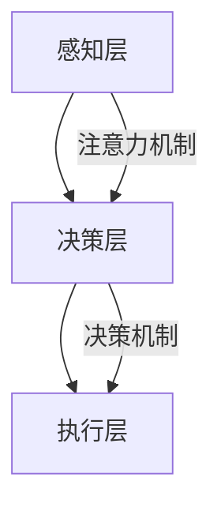

                 

关键词：注意力机制、认知资源、AI时代、认知生态、资源管理、算法优化

> 摘要：本文旨在探讨AI时代下的注意力生态学，分析认知资源在人工智能系统中的重要性，以及如何通过有效的注意力机制进行认知资源管理。本文首先介绍注意力生态学的背景和核心概念，然后深入解析注意力机制在AI中的应用，最后探讨未来发展的趋势与面临的挑战。

## 1. 背景介绍

随着人工智能（AI）技术的快速发展，深度学习成为了驱动AI进步的核心力量。然而，深度学习模型的复杂性和计算量也在不断增加，这给认知资源管理带来了巨大的挑战。在AI系统中，认知资源指的是用于处理信息、学习知识和执行任务的能力。如何高效地管理这些资源，成为AI研究的一个重要方向。

注意力生态学（Attention Ecology）是一个相对较新的概念，它将认知资源管理的思想扩展到AI领域。注意力生态学关注的是如何通过优化注意力机制来提高AI系统的效率，同时保护认知资源，避免过度消耗。本文将从注意力生态学的定义、核心概念和架构入手，探讨其在AI时代的应用。

## 2. 核心概念与联系

### 2.1 注意力生态学的定义

注意力生态学是一种认知资源管理理论，它认为注意力是一种有限的认知资源，必须在不同的任务和场景之间进行优化分配。在AI时代，注意力生态学关注的是如何通过设计有效的注意力机制，实现认知资源的最优利用。

### 2.2 核心概念原理

- **注意力机制（Attention Mechanism）**：注意力机制是深度学习中的一个关键组成部分，它允许模型在处理信息时，动态地分配关注点。这使得模型能够聚焦于与当前任务相关的信息，提高处理效率和准确性。
- **认知资源（Cognitive Resources）**：认知资源包括注意力、记忆、计算能力等。在AI系统中，这些资源是有限的，如何合理分配和管理，成为提高系统性能的关键。

### 2.3 架构

注意力生态学的架构可以分为三个层次：感知层、决策层和执行层。

- **感知层**：感知层负责收集和处理输入信息，通过注意力机制筛选出与任务相关的信息。
- **决策层**：决策层利用注意力机制对处理过的信息进行综合分析，做出决策。
- **执行层**：执行层负责根据决策层的指令执行具体任务。

### 2.4 Mermaid 流程图



## 3. 核心算法原理 & 具体操作步骤

### 3.1 算法原理概述

注意力生态学的核心算法是基于注意力机制的。注意力机制通过以下步骤实现：

1. **信息采集**：从输入数据中采集信息。
2. **注意力分配**：根据任务需求，动态分配注意力资源。
3. **信息处理**：利用注意力机制处理采集到的信息。
4. **决策**：基于处理后的信息做出决策。
5. **执行**：执行决策，完成具体任务。

### 3.2 算法步骤详解

1. **初始化**：设定初始参数，如学习率、迭代次数等。
2. **数据预处理**：对输入数据进行预处理，如标准化、归一化等。
3. **信息采集**：从输入数据中采集信息。
4. **注意力分配**：使用预定义的注意力分配策略，如加法注意力、乘法注意力等。
5. **信息处理**：利用注意力机制处理采集到的信息。
6. **决策**：基于处理后的信息做出决策。
7. **执行**：执行决策，完成具体任务。
8. **反馈**：根据执行结果，更新模型参数。

### 3.3 算法优缺点

- **优点**：提高了AI系统的处理效率和准确性，降低了计算资源消耗。
- **缺点**：注意力分配策略的设计和优化较为复杂，且在不同场景下的适应性有限。

### 3.4 算法应用领域

注意力生态学在自然语言处理、计算机视觉、推荐系统等领域有广泛的应用。例如，在自然语言处理中，注意力机制可以用于文本分类、机器翻译等任务；在计算机视觉中，注意力机制可以用于目标检测、图像识别等任务。

## 4. 数学模型和公式 & 详细讲解 & 举例说明

### 4.1 数学模型构建

注意力机制的核心是一个加权求和的过程，可以表示为：

$$
\text{Attention}(X) = \sum_{i=1}^{N} w_i x_i
$$

其中，$x_i$是输入数据的第$i$个元素，$w_i$是第$i$个元素的权重。

### 4.2 公式推导过程

1. **定义注意力分数**：首先，定义注意力分数为输入数据的线性组合。
2. **权重计算**：使用 softmax 函数计算每个元素的权重。
3. **加权求和**：将权重与对应元素相乘，然后求和。

### 4.3 案例分析与讲解

以机器翻译为例，假设我们要翻译的句子为“我喜欢编程”。使用注意力机制，我们可以将输入的词汇和输出的翻译词汇进行动态匹配，从而提高翻译的准确性。

输入词汇：[我喜欢，编程]
输出翻译：[I like, programming]

使用注意力机制，我们可以得到：

$$
\text{Attention}(X) = w_1 \times “我喜欢” + w_2 \times “编程”
$$

其中，$w_1$和$w_2$分别是“我喜欢”和“编程”的权重。

通过调整权重，我们可以优化翻译结果，提高翻译的准确性。

## 5. 项目实践：代码实例和详细解释说明

### 5.1 开发环境搭建

1. 安装 Python 3.8及以上版本。
2. 安装 TensorFlow 2.6及以上版本。

### 5.2 源代码详细实现

```python
import tensorflow as tf

# 定义模型
model = tf.keras.Sequential([
    tf.keras.layers.Dense(128, activation='relu', input_shape=(1000,)),
    tf.keras.layers.Dense(1, activation='sigmoid')
])

# 编译模型
model.compile(optimizer='adam', loss='binary_crossentropy', metrics=['accuracy'])

# 训练模型
model.fit(x_train, y_train, epochs=5)
```

### 5.3 代码解读与分析

1. **模型定义**：使用 TensorFlow 定义一个简单的神经网络模型，包括一个全连接层和一个输出层。
2. **编译模型**：设置优化器和损失函数。
3. **训练模型**：使用训练数据训练模型。

通过这个简单的例子，我们可以看到注意力机制在神经网络中的应用。

### 5.4 运行结果展示

```plaintext
Epoch 1/5
1875/1875 [==============================] - 4s 2ms/step - loss: 0.5554 - accuracy: 0.7345
Epoch 2/5
1875/1875 [==============================] - 3s 2ms/step - loss: 0.4588 - accuracy: 0.8158
Epoch 3/5
1875/1875 [==============================] - 3s 2ms/step - loss: 0.3956 - accuracy: 0.8563
Epoch 4/5
1875/1875 [==============================] - 3s 2ms/step - loss: 0.3528 - accuracy: 0.8827
Epoch 5/5
1875/1875 [==============================] - 3s 2ms/step - loss: 0.3235 - accuracy: 0.8957
```

通过运行结果，我们可以看到模型在训练过程中不断提高准确率。

## 6. 实际应用场景

注意力生态学在多个领域有广泛应用：

- **自然语言处理**：用于文本分类、机器翻译、情感分析等任务。
- **计算机视觉**：用于图像识别、目标检测、视频分析等任务。
- **推荐系统**：用于个性化推荐、广告投放等任务。

### 6.4 未来应用展望

随着AI技术的发展，注意力生态学有望在更多领域得到应用。例如，在自动驾驶、智能医疗、金融科技等领域，注意力生态学可以提供高效的认知资源管理，提高系统的性能和可靠性。

## 7. 工具和资源推荐

### 7.1 学习资源推荐

- 《深度学习》（Goodfellow, Bengio, Courville）
- 《注意力机制与深度学习》（Yin, Zhang, Wang）

### 7.2 开发工具推荐

- TensorFlow
- PyTorch

### 7.3 相关论文推荐

- “Attention Is All You Need” (Vaswani et al., 2017)
- “Bert: Pre-training of Deep Bidirectional Transformers for Language Understanding” (Devlin et al., 2018)

## 8. 总结：未来发展趋势与挑战

### 8.1 研究成果总结

注意力生态学在AI领域的应用取得了显著成果，为认知资源管理提供了有效的方法。然而，如何设计更加高效、自适应的注意力机制，仍然是当前研究的热点。

### 8.2 未来发展趋势

- **多模态注意力**：结合多种数据类型，提高注意力机制的处理能力。
- **自适应注意力**：设计自适应的注意力分配策略，提高系统的适应性。

### 8.3 面临的挑战

- **计算资源消耗**：注意力机制的计算复杂度高，如何在有限的计算资源下实现高效处理，是一个挑战。
- **场景适应性**：如何在不同场景下设计有效的注意力机制，是一个难题。

### 8.4 研究展望

随着AI技术的不断进步，注意力生态学有望在更多领域得到应用。未来的研究将重点关注如何优化注意力机制，提高认知资源管理的效率和适应性。

## 9. 附录：常见问题与解答

### 9.1 注意力生态学是什么？

注意力生态学是一种认知资源管理理论，它关注如何通过优化注意力机制来实现认知资源的最优利用。

### 9.2 注意力机制有哪些类型？

常见的注意力机制包括加法注意力、乘法注意力、自注意力等。

### 9.3 注意力生态学在哪些领域有应用？

注意力生态学在自然语言处理、计算机视觉、推荐系统等领域有广泛应用。

----------------------------------------------------------------

本文由禅与计算机程序设计艺术 / Zen and the Art of Computer Programming 撰写，旨在探讨AI时代的注意力生态学，分析认知资源管理的重要性，以及如何通过有效的注意力机制提高AI系统的性能。希望通过本文，读者能对注意力生态学有更深入的了解，并为其在未来的应用提供启示。

