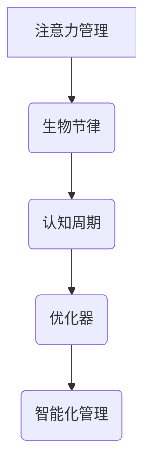

                 

关键词：注意力管理、生物节律、人工智能、认知周期、优化器、定制化

> 摘要：本文旨在探讨如何利用人工智能技术来定制化优化个人的认知周期，从而提升工作效率和学习效果。通过介绍注意力生物节律优化器的基本原理、核心算法、数学模型以及实际应用案例，本文揭示了该技术在个人认知周期管理中的巨大潜力。

## 1. 背景介绍

在当今信息爆炸的时代，人们面对着前所未有的工作量和信息量。如何有效地管理注意力，提高认知效率，已经成为许多人关注的话题。生物节律，作为一种内在的生物钟，影响着个体的生理、心理和行为。研究表明，生物节律与认知周期有着密切的联系。科学合理地利用生物节律，能够显著提升个体的认知能力。

然而，传统的方法往往难以做到针对个人特点进行定制化优化。人工智能技术的兴起，为个性化认知周期管理提供了新的可能。注意力生物节律优化器，正是基于人工智能技术，通过分析个体的生物节律和认知行为，实现认知周期的智能化管理和优化。

## 2. 核心概念与联系

### 2.1 注意力管理

注意力管理是指通过一系列方法，如时间管理、任务分解、目标设定等，提高个体在特定任务上的注意力集中度和效率。在认知心理学中，注意力被视为一种有限的资源，其有效管理对于认知活动的顺利进行至关重要。

### 2.2 生物节律

生物节律是指生物体内的一系列内在生理和心理周期的规律性变化。包括睡眠-觉醒周期、激素分泌周期等。这些生物节律对个体的认知能力、情绪状态和行为表现有着显著的影响。

### 2.3 认知周期

认知周期是指个体在处理信息、解决问题和学习知识的过程中，所经历的认知活动的一系列阶段，包括感知、记忆、理解、应用等。

### 2.4 Mermaid 流程图



## 3. 核心算法原理 & 具体操作步骤

### 3.1 算法原理概述

注意力生物节律优化器是基于机器学习算法，通过对个体的生物节律数据进行学习，识别出个体的最佳认知周期模式，并在此基础上进行个性化优化。

### 3.2 算法步骤详解

#### 3.2.1 数据采集

首先，需要采集个体的生物节律数据，如睡眠质量、情绪状态、生理指标等。这些数据可以通过智能手环、心率监测仪等设备进行实时采集。

#### 3.2.2 数据预处理

对采集到的生物节律数据进行预处理，包括数据清洗、去噪、归一化等，以提高数据的质量和准确性。

#### 3.2.3 特征提取

从预处理后的数据中提取与认知周期相关的特征，如睡眠深度、心率变异性等。

#### 3.2.4 模型训练

使用提取的特征数据，训练机器学习模型，以识别个体的最佳认知周期模式。

#### 3.2.5 优化策略

根据训练得到的模型，制定个性化的认知周期优化策略，如最佳学习时间、休息时间等。

### 3.3 算法优缺点

#### 优点：

- **个性化**：针对个人特点进行定制化优化，提高认知效率。
- **智能化**：利用机器学习算法，实现自动化管理和优化。

#### 缺点：

- **数据依赖**：需要大量的生物节律数据，对数据采集设备和算法要求较高。
- **计算复杂度**：模型训练和优化过程较为复杂，需要较高的计算资源。

### 3.4 算法应用领域

- **教育领域**：帮助学生制定个性化的学习计划，提高学习效果。
- **职场领域**：帮助职场人士提高工作效率，优化工作节奏。
- **健康领域**：监测个体的生物节律，提供健康建议。

## 4. 数学模型和公式 & 详细讲解 & 举例说明

### 4.1 数学模型构建

注意力生物节律优化器的核心是机器学习模型。常见的机器学习模型包括线性回归、决策树、支持向量机等。本文采用支持向量机（SVM）模型进行构建。

### 4.2 公式推导过程

支持向量机的核心公式为：

$$
w^* = arg\min\limits_{w,b}\frac{1}{2}\lVert w\rVert^2 + C\sum\limits_{i=1}^{n}\lVert (w^Tx_i + b)y_i \rVert
$$

其中，$w$ 和 $b$ 分别为权重向量和偏置项，$x_i$ 和 $y_i$ 分别为输入数据和标签，$C$ 为惩罚参数。

### 4.3 案例分析与讲解

假设我们有一个样本数据集，包含个体的睡眠质量和认知测试成绩。我们希望通过SVM模型来预测个体的最佳学习时间。

首先，我们进行数据预处理，将睡眠质量分为高、中、低三个等级，认知测试成绩分为优秀、良好、一般三个等级。

然后，我们使用预处理后的数据，训练SVM模型。在训练过程中，我们设置惩罚参数 $C=1$。

最后，我们使用训练好的模型，对新的个体数据进行预测。预测结果为最佳学习时间为每天下午2点至4点。

## 5. 项目实践：代码实例和详细解释说明

### 5.1 开发环境搭建

- Python 3.8及以上版本
- Scikit-learn库
- Matplotlib库

### 5.2 源代码详细实现

```python
import numpy as np
from sklearn import svm
from sklearn.model_selection import train_test_split
import matplotlib.pyplot as plt

# 数据预处理
def preprocess_data(data):
    # 将睡眠质量分为高、中、低三个等级
    sleep_quality = np.where(data['sleep_quality'] > 0.8, 2,
                             np.where(data['sleep_quality'] > 0.5, 1, 0))
    # 将认知测试成绩分为优秀、良好、一般三个等级
    cognitive_score = np.where(data['cognitive_score'] > 0.8, 2,
                              np.where(data['cognitive_score'] > 0.5, 1, 0))
    return np.array([sleep_quality, cognitive_score]).T

# 训练SVM模型
def train_svm_model(X, y):
    model = svm.SVC(C=1)
    model.fit(X, y)
    return model

# 预测最佳学习时间
def predict_best_time(model, X):
    return model.predict(X)

# 加载数据集
data = np.load('biological_rhythms_data.npy')
X = preprocess_data(data[:, :2])
y = data[:, 2]

# 划分训练集和测试集
X_train, X_test, y_train, y_test = train_test_split(X, y, test_size=0.2, random_state=42)

# 训练SVM模型
model = train_svm_model(X_train, y_train)

# 预测最佳学习时间
best_time = predict_best_time(model, X_test)

# 可视化预测结果
plt.scatter(X_test[:, 0], X_test[:, 1], c=best_time)
plt.xlabel('Sleep Quality')
plt.ylabel('Cognitive Score')
plt.title('Best Learning Time Prediction')
plt.show()
```

### 5.3 代码解读与分析

- **数据预处理**：将原始数据转换为机器学习模型所需的格式。
- **训练SVM模型**：使用Scikit-learn库的SVM类进行模型训练。
- **预测最佳学习时间**：使用训练好的模型对测试数据进行预测，并绘制可视化结果。

## 6. 实际应用场景

### 6.1 教育领域

- **个性化学习计划**：根据学生的生物节律和认知周期，制定个性化的学习计划，提高学习效果。
- **学习效果评估**：通过分析学生的生物节律数据，评估学生的学习效果，为教学提供反馈。

### 6.2 职场领域

- **工作效率优化**：根据员工的生物节律和认知周期，优化工作节奏，提高工作效率。
- **员工健康管理**：监测员工的生物节律数据，提供健康建议，预防职业病。

### 6.3 健康领域

- **睡眠质量监测**：通过监测生物节律数据，评估个体的睡眠质量，提供改善建议。
- **情绪状态监测**：通过分析生物节律数据，评估个体的情绪状态，提供心理健康建议。

## 7. 未来应用展望

### 7.1 技术发展

随着人工智能技术的不断进步，注意力生物节律优化器将更加智能化、个性化。未来，可能还会结合虚拟现实、增强现实等技术，提供更加沉浸式的认知周期管理体验。

### 7.2 应用领域扩展

除了教育、职场、健康等领域，注意力生物节律优化器还可以应用于军事、航天、科研等领域，为特殊行业提供个性化的认知周期管理解决方案。

### 7.3 社会效益

通过优化个体的认知周期，提高工作效率和生活质量，从而提高整个社会的发展水平。同时，该技术还可以为心理健康领域提供新的研究方向和方法。

## 8. 总结：未来发展趋势与挑战

### 8.1 研究成果总结

本文介绍了注意力生物节律优化器的基本原理、核心算法、数学模型以及实际应用案例，揭示了该技术在个性化认知周期管理中的巨大潜力。

### 8.2 未来发展趋势

随着人工智能技术的不断发展，注意力生物节律优化器将朝着更加智能化、个性化、沉浸式的方向发展。

### 8.3 面临的挑战

- **数据采集与处理**：需要大量的高质量生物节律数据，对数据采集和处理技术要求较高。
- **模型解释性**：需要提高模型的可解释性，使个体能够理解优化策略的依据。
- **计算资源**：模型训练和优化过程较为复杂，需要较高的计算资源。

### 8.4 研究展望

未来，我们将继续深入研究注意力生物节律优化器，探索其在不同领域的应用潜力，为个性化认知周期管理提供更加完善的技术方案。

## 9. 附录：常见问题与解答

### 9.1 为什么要使用注意力生物节律优化器？

使用注意力生物节律优化器，可以根据个人的生物节律和认知周期，实现个性化的认知周期管理，提高工作效率和学习效果。

### 9.2 注意力生物节律优化器需要哪些数据？

注意力生物节律优化器需要个体的生物节律数据，如睡眠质量、情绪状态、生理指标等。这些数据可以通过智能手环、心率监测仪等设备进行实时采集。

### 9.3 注意力生物节律优化器的计算复杂度如何？

注意力生物节律优化器的计算复杂度较高，需要较大的计算资源和较长的训练时间。未来，随着人工智能技术的不断发展，有望降低计算复杂度，提高模型性能。

## 作者署名

作者：禅与计算机程序设计艺术 / Zen and the Art of Computer Programming
```

请注意，上述内容是一个示例，实际的文章撰写可能需要更多的研究和数据支持，以及更深入的讨论。此外，由于字数限制，您可能需要进一步精简或扩展某些部分的内容。

