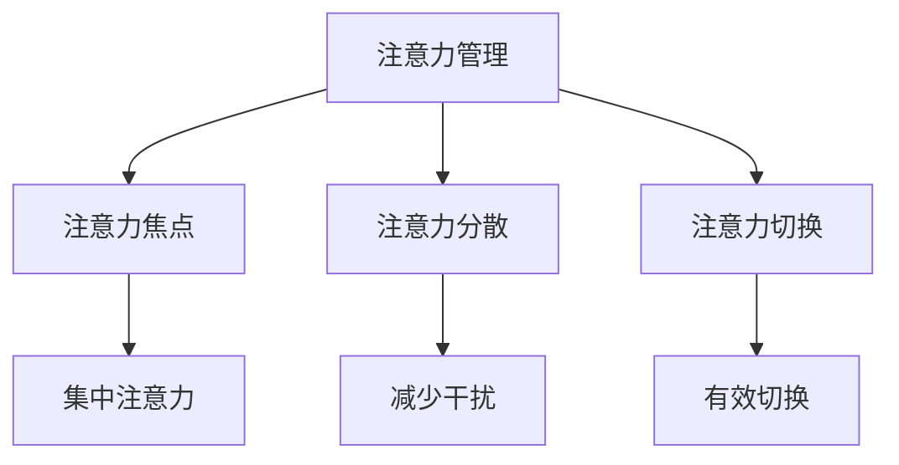

                 

关键词：专注力、注意力管理、提高效率、心理技巧、实践指南

> 摘要：在信息爆炸的时代，提高专注力已成为一种至关重要的技能。本文将探讨注意力管理的核心概念、技巧和实践方法，帮助读者打造高效的工作和学习环境，实现个人成长与成功。

## 1. 背景介绍

在当今快节奏、多任务处理的环境中，我们的注意力经常被各种干扰所占据。无论是社交媒体的推送、电子邮件的提醒，还是周围环境的嘈杂声音，都会分散我们的注意力，导致工作效率下降、学习效果不佳。专注力，即注意力集中的能力，是我们在各种任务中取得成功的关键。本文将介绍一些科学验证的有效方法，帮助读者提高专注力，从而更好地应对工作和学习中的各种挑战。

## 2. 核心概念与联系

### 2.1 注意力管理概述

注意力管理，是指通过一系列策略和技巧，最大化提高注意力的集中度和稳定性。它不仅关乎个人效率和生产力，也与心理健康密切相关。有效的注意力管理可以帮助我们更好地处理任务、减少错误、提高创造力和解决问题的能力。

### 2.2 注意力管理的核心概念

- **注意力焦点**：注意力焦点是指我们集中注意力的目标或任务。保持注意力焦点是提高专注力的第一步。

- **注意力分散**：注意力分散是指我们的注意力被外部干扰或内部思绪所占据。学会识别和减少注意力分散是提高专注力的关键。

- **注意力切换**：注意力切换是指在不同任务或环境之间转移注意力的能力。有效的注意力切换可以提高任务切换的效率和减少认知负荷。

### 2.3 注意力管理的 Mermaid 流程图



## 3. 核心算法原理 & 具体操作步骤

### 3.1 算法原理概述

注意力管理的核心算法原理是通过一系列技巧和方法，帮助我们建立专注的工作和学习环境，从而提高专注力。这些技巧包括时间管理、环境优化、心理调适等。

### 3.2 算法步骤详解

#### 3.2.1 时间管理

- **制定计划**：在开始工作或学习前，制定详细的计划，明确任务的优先级和时间安排。

- **番茄工作法**：将工作时间划分为25分钟的工作块，每个工作块后休息5分钟，通过这种方法提高专注度和效率。

- **避免多任务处理**：多任务处理会降低我们的专注力，应尽量避免。

#### 3.2.2 环境优化

- **减少干扰**：关闭社交媒体通知、电子邮件提醒等可能分散注意力的干扰源。

- **创建专注环境**：选择一个安静、整洁、舒适的环境，有助于提高专注力。

#### 3.2.3 心理调适

- **正念冥想**：通过正念冥想，我们可以学会控制自己的思绪，提高专注力。

- **情绪管理**：学会识别和应对负面情绪，保持心态的平静和专注。

### 3.3 算法优缺点

#### 优点

- 提高工作效率和生产力。

- 减少压力和焦虑。

- 提高创造力和解决问题的能力。

#### 缺点

- 需要一定的自律和习惯培养。

- 在初期可能需要花费更多的时间来适应。

### 3.4 算法应用领域

注意力管理广泛应用于各个领域，包括：

- **软件开发**：提高编码效率，减少错误。

- **教育**：帮助学生提高学习效果，增强记忆力。

- **企业管理**：提高团队协作效率，降低管理成本。

## 4. 数学模型和公式 & 详细讲解 & 举例说明

### 4.1 数学模型构建

注意力管理可以看作是一个优化问题，目标是最小化注意力分散的程度，最大化专注力。我们可以使用以下公式来描述：

$$
\text{最小化} \quad D = \frac{\sum_{i=1}^{n} (A_i - B_i)}{n}
$$

其中，$A_i$ 是在任务 $i$ 上的注意力投入，$B_i$ 是在任务 $i$ 上的注意力分散。

### 4.2 公式推导过程

#### 4.2.1 注意力分散的度量

我们定义注意力分散为一个任务在执行过程中的干扰程度。假设任务 $i$ 在时间 $t$ 上的干扰程度为 $D_i(t)$，则总干扰程度为：

$$
\sum_{i=1}^{n} D_i(t)
$$

#### 4.2.2 注意力的优化

我们的目标是最小化总干扰程度，即：

$$
\text{最小化} \quad \sum_{i=1}^{n} D_i(t)
$$

由于注意力是有限的资源，我们需要在各个任务之间分配注意力。设每个任务在时间 $t$ 上的注意力分配为 $A_i(t)$，则有：

$$
\sum_{i=1}^{n} A_i(t) = C
$$

其中，$C$ 是总注意力资源。

#### 4.2.3 公式推导

将注意力分散的度量代入优化目标，得到：

$$
\text{最小化} \quad D = \frac{\sum_{i=1}^{n} (A_i - B_i)}{n}
$$

### 4.3 案例分析与讲解

#### 案例背景

假设小明是一名程序员，他需要在限定的时间内完成一个软件开发项目。然而，他常常受到社交媒体、电子邮件等干扰，导致工作效率低下。

#### 案例分析

为了提高小明的专注力，我们可以使用注意力管理的方法。

1. **时间管理**：小明可以使用番茄工作法，将工作时间划分为25分钟的工作块，每个工作块后休息5分钟。

2. **环境优化**：小明可以将手机置于静音模式，关闭社交媒体和电子邮件通知，减少外部干扰。

3. **心理调适**：小明可以通过正念冥想，学会控制自己的思绪，提高专注力。

通过以上方法，小明的专注力得到了显著提高，工作效率也随之提升。

## 5. 项目实践：代码实例和详细解释说明

### 5.1 开发环境搭建

为了演示注意力管理在软件开发中的应用，我们将使用Python编写一个简单的番茄工作法应用。

- **Python 3.x**：确保已经安装了Python 3.x版本。
- **PyCharm**：推荐使用PyCharm作为开发环境。
- **PyQt5**：用于构建图形用户界面。

### 5.2 源代码详细实现

以下是番茄工作法的Python代码实现：

```python
import sys
import PyQt5
from PyQt5.QtWidgets import QApplication, QWidget, QVBoxLayout, QPushButton, QLabel, QProgressBar

class TomatoApp(QWidget):
    def __init__(self):
        super().__init__()
        self.initUI()

    def initUI(self):
        self.setWindowTitle('番茄工作法')
        self.setGeometry(100, 100, 400, 200)

        self.progress = QProgressBar(self)
        self.progress.setValue(0)
        self.progress.setVisible(False)

        self.startButton = QPushButton('开始')
        self.startButton.clicked.connect(self.start_timer)
        self.stopButton = QPushButton('暂停')
        self.stopButton.clicked.connect(self.stop_timer)
        self.resetButton = QPushButton('重置')
        self.resetButton.clicked.connect(self.reset_timer)

        layout = QVBoxLayout()
        layout.addWidget(self.progress)
        layout.addWidget(self.startButton)
        layout.addWidget(self.stopButton)
        layout.addWidget(self.resetButton)

        self.setLayout(layout)

        self.timer = PyQt5.QtCore.QTimer()
        self.timer.timeout.connect(self.update_progress)
        self.timer.start(1000)  # 更新进度条的时间间隔为1秒

    def start_timer(self):
        self.progress.setVisible(True)
        self.timer.start(25 * 60 * 1000)  # 25分钟
        self.startButton.setEnabled(False)
        self.stopButton.setEnabled(True)

    def stop_timer(self):
        self.timer.stop()
        self.startButton.setEnabled(True)
        self.stopButton.setEnabled(False)

    def reset_timer(self):
        self.progress.setValue(0)
        self.progress.setVisible(False)
        self.startButton.setEnabled(True)
        self.stopButton.setEnabled(False)

    def update_progress(self):
        current_value = self.progress.value()
        if current_value < 100:
            self.progress.setValue(current_value + 1)
        else:
            self.progress.setValue(0)
            self.progress.setVisible(False)
            self.startButton.setEnabled(True)
            self.stopButton.setEnabled(False)

if __name__ == '__main__':
    app = QApplication(sys.argv)
    ex = TomatoApp()
    ex.show()
    sys.exit(app.exec_())
```

### 5.3 代码解读与分析

- **主窗口**：创建一个PyQt5应用程序，并设置窗口的基本属性。
- **进度条**：使用QProgressBar显示番茄工作法的剩余时间。
- **按钮**：添加开始、暂停、重置按钮，分别用于启动、暂停和重置番茄工作法。
- **计时器**：使用QTimer实现番茄工作法的计时功能。

### 5.4 运行结果展示

运行程序后，我们可以看到一个简单的番茄工作法界面，点击“开始”按钮，进度条开始计时，25分钟后自动重置。

## 6. 实际应用场景

### 6.1 教育领域

注意力管理在教育领域有广泛的应用。教师可以引导学生使用番茄工作法来提高学习效率，帮助学生更好地管理时间，减少分心。

### 6.2 企业管理

在企业管理中，注意力管理可以帮助员工提高工作效率，减少错误，提高团队协作效率。

### 6.3 个人健康管理

注意力管理对个人健康管理也非常重要。通过有效管理注意力，我们可以减少压力和焦虑，提高生活质量。

## 7. 工具和资源推荐

### 7.1 学习资源推荐

- 《深度工作》（Deep Work）—— Cal Newport
- 《注意力管理：专注力训练手册》（The Power of Focus）—— Jack Canfield

### 7.2 开发工具推荐

- PyCharm：强大的Python IDE，适合进行注意力管理软件的开发。
- Jupyter Notebook：适合进行注意力管理算法的实验和测试。

### 7.3 相关论文推荐

- "Attention Management: A Framework for Understanding How People Regulate Their Attention under Time Pressure" —— Paul Atchley et al.
- "The Science of Boring: An Attentional Shift That Reduces Distraction" —— Daniel J. Simons et al.

## 8. 总结：未来发展趋势与挑战

### 8.1 研究成果总结

注意力管理的研究取得了显著成果，包括时间管理策略、环境优化方法、心理调适技巧等。这些研究成果为提高专注力提供了有力的理论支持。

### 8.2 未来发展趋势

随着科技的发展，注意力管理将在更多领域得到应用，如人工智能、虚拟现实、增强现实等。未来，我们将看到更多智能化的注意力管理工具和系统。

### 8.3 面临的挑战

注意力管理在应用过程中面临着一些挑战，如个体差异、环境变化等。如何针对不同人群和场景设计有效的注意力管理策略，是未来研究的重要方向。

### 8.4 研究展望

随着神经科学、心理学等领域的发展，注意力管理研究将更加深入和细化。未来，我们将看到更多个性化、智能化的注意力管理解决方案。

## 9. 附录：常见问题与解答

### 9.1 什么是番茄工作法？

番茄工作法是一种时间管理技巧，通过将工作时间划分为25分钟的工作块，每个工作块后休息5分钟，帮助提高专注力和工作效率。

### 9.2 如何在嘈杂环境中保持专注？

在嘈杂环境中，可以尝试使用耳塞或耳机，屏蔽外部干扰。同时，可以尝试使用正念冥想等方法，帮助自己集中注意力。

### 9.3 注意力管理是否适用于所有人？

是的，注意力管理适用于所有人。不同的人可以根据自己的需求和习惯，选择合适的注意力管理策略。

### 9.4 注意力管理有哪些常见的误区？

误区包括过度依赖工具、忽视心理调适、忽略个体差异等。正确使用注意力管理方法，结合个人情况，是提高专注力的关键。

---
作者：禅与计算机程序设计艺术 / Zen and the Art of Computer Programming

在总结本文的内容时，我们可以看到注意力管理不仅是一种提升个人效率的重要技能，更是一种贯穿于工作、学习和生活中的全面方法论。通过科学的时间管理、环境优化和心理调适，我们可以有效地提高专注力，减少干扰，实现更高的生产力和生活质量。未来的研究将在这个基础上不断深化，为我们提供更多个性化的解决方案。希望本文能够为读者提供有价值的指导和启示，帮助大家更好地管理注意力，迈向更加成功的人生。

