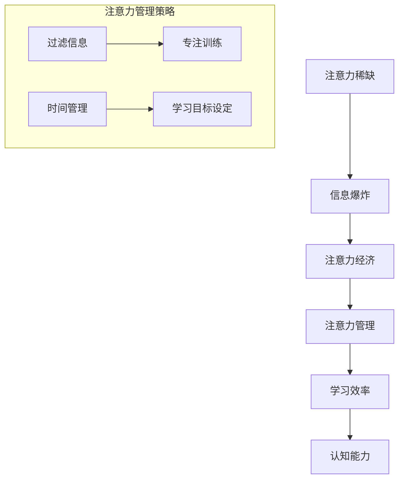

                 

关键词：注意力经济、学习效率、认知负荷、信息过滤、注意力管理、学习策略、技术工具、应用案例。

> 摘要：本文深入探讨了注意力经济这一新兴概念，并揭示了其对个人学习效率的影响。通过分析注意力资源的稀缺性，我们提出了几种有效的注意力管理策略，旨在优化学习过程，提高个人认知能力。此外，本文还讨论了现代技术工具在注意力经济中的应用，为读者提供了实用的方法和建议。

## 1. 背景介绍

在当今信息爆炸的时代，我们面临着前所未有的挑战：海量的数据和信息不断涌入我们的生活，而我们的大脑处理能力却有限。这种矛盾催生了“注意力经济”这一新兴领域的诞生。注意力经济认为，注意力是一种宝贵的资源，其价值远超物质财富。随着互联网和社交媒体的普及，人们的注意力被分散到各种渠道，如何有效地管理和利用注意力资源成为了一个亟待解决的问题。

学习效率是衡量个人能力和知识积累的重要指标。然而，在注意力稀缺的时代，传统的学习方法已经无法满足我们的需求。因此，研究如何通过注意力管理提高学习效率，成为了当前教育和技术领域的重要课题。

本文旨在探讨注意力经济与个人学习效率之间的关系，分析注意力资源的稀缺性，并提出一系列有效的注意力管理策略。此外，本文还将介绍现代技术工具在注意力管理中的应用，为读者提供实用的方法和建议。

## 2. 核心概念与联系

### 注意力经济的定义

注意力经济，是指通过捕捉和利用个体注意力资源的一种经济模式。在这一模式中，注意力被视为一种宝贵的资源，其价值体现在对信息的选择和关注上。与传统的物质资源不同，注意力资源是有限的，无法复制和存储。因此，如何有效地管理和利用注意力资源，成为了注意力经济研究的核心问题。

### 注意力资源的稀缺性

在注意力经济中，注意力资源的稀缺性是一个不可忽视的问题。首先，人类的注意力是有限的，无法同时关注多个任务。根据心理学研究，人类的注意力持续时间大约为20-30分钟，之后就会产生疲劳和分散。其次，随着信息的爆炸式增长，我们需要筛选和过滤大量的信息，这进一步加剧了注意力的稀缺性。

### 注意力管理的重要性

注意力管理是指在特定环境下，通过策略和工具来调节和优化注意力资源的使用。有效的注意力管理可以帮助我们更好地专注于重要的任务，提高学习效率和认知能力。在个人学习中，注意力管理策略对于克服分心和提升专注力具有重要意义。

### Mermaid 流程图

以下是一个简化的注意力管理流程图，展示了注意力经济的核心概念和联系。



### 注意力管理策略

注意力管理策略包括以下几个方面：

1. **信息过滤**：通过过滤不必要的干扰信息，减少注意力的消耗。
2. **专注训练**：通过冥想、正念等训练方法，提高专注力和注意力持续时间。
3. **时间管理**：合理安排学习和休息时间，避免过度疲劳。
4. **学习目标设定**：明确学习目标，提高学习的目的性和效率。

## 3. 核心算法原理 & 具体操作步骤

### 3.1 算法原理概述

注意力管理算法是基于神经科学和认知心理学原理设计的，旨在优化个体在复杂环境中的注意力分配。核心原理包括：

1. **注意力分配模型**：根据任务的重要性和紧急性，动态分配注意力资源。
2. **疲劳检测与恢复**：通过监测生理指标，如心率变异性，判断个体疲劳状态，并采取恢复措施。
3. **环境适应性**：根据环境变化调整注意力分配策略，以适应不同的学习和工作场景。

### 3.2 算法步骤详解

1. **初始化**：设定初始注意力值，并根据学习任务设定目标。
2. **任务评估**：对当前任务的重要性和紧急性进行评估，确定优先级。
3. **注意力分配**：根据任务评估结果，动态调整注意力分配，确保关键任务获得足够的注意力资源。
4. **疲劳监测**：通过监测生理指标，如心率变异性，判断个体疲劳状态。
5. **恢复策略**：根据疲劳监测结果，采取适当的恢复措施，如短暂休息、深呼吸等。
6. **环境适应**：根据环境变化，调整注意力分配策略，确保注意力资源的高效利用。

### 3.3 算法优缺点

#### 优点：

1. **提高学习效率**：通过优化注意力分配，确保关键任务获得足够的注意力资源，从而提高学习效率。
2. **减少分心**：通过过滤无关信息，减少干扰，降低分心概率。
3. **适应性强**：算法能够根据个体和环境的变化，动态调整注意力分配策略，适应不同的学习场景。

#### 缺点：

1. **初始设置复杂**：需要收集和处理大量的生理和行为数据，初始设置相对复杂。
2. **实施难度高**：算法的实施需要一定的技术支持和训练，对于普通用户来说可能有一定难度。

### 3.4 算法应用领域

注意力管理算法主要应用于需要高度集中注意力的领域，如：

1. **教育领域**：帮助学生和教师优化学习过程，提高教学效果。
2. **工作领域**：帮助职场人士提高工作效率，减少分心和疲劳。
3. **健康领域**：通过监测和管理注意力资源，帮助个体改善心理健康和生理健康。

## 4. 数学模型和公式 & 详细讲解 & 举例说明

### 4.1 数学模型构建

注意力管理模型的核心是注意力分配模型，其基本形式如下：

\[ A_t = f(I_t, P_t, E_t) \]

其中，\( A_t \) 表示在时间 \( t \) 的注意力分配，\( I_t \) 表示任务的重要性，\( P_t \) 表示任务的紧急性，\( E_t \) 表示环境因素。

### 4.2 公式推导过程

#### 注意力分配函数

注意力分配函数 \( f \) 可以表示为：

\[ f(I_t, P_t, E_t) = \alpha I_t + \beta P_t + \gamma E_t \]

其中，\( \alpha \)、\( \beta \)、\( \gamma \) 为权重系数，用于调整各项因素对注意力分配的影响。

#### 疲劳检测与恢复

疲劳检测可以通过心率变异性（HRV）来评估，其基本公式如下：

\[ \text{HRV} = \frac{\text{RR间期}}{\text{标准差}} \]

其中，\( \text{RR间期} \) 表示连续两个心跳之间的时间间隔，\( \text{标准差} \) 表示这些时间间隔的波动程度。

当 \( \text{HRV} \) 低于某一阈值时，表示个体处于疲劳状态，需要采取恢复措施。

### 4.3 案例分析与讲解

#### 案例一：学生注意力管理

假设一名学生在学习时面临多项任务，包括阅读教材、完成作业和准备考试。根据注意力分配模型，我们可以对各项任务进行评估和分配注意力。

1. **任务评估**：
   - 阅读教材：重要性 \( I_1 = 0.4 \)，紧急性 \( P_1 = 0.3 \)，环境因素 \( E_1 = 0.2 \)。
   - 完成作业：重要性 \( I_2 = 0.3 \)，紧急性 \( P_2 = 0.5 \)，环境因素 \( E_2 = 0.1 \)。
   - 准备考试：重要性 \( I_3 = 0.3 \)，紧急性 \( P_3 = 0.2 \)，环境因素 \( E_3 = 0.2 \)。

2. **注意力分配**：
   - 根据公式 \( f(I_t, P_t, E_t) \)，计算各项任务的注意力分配：
     - \( A_1 = 0.4 \times 0.4 + 0.3 \times 0.3 + 0.2 \times 0.2 = 0.21 \)
     - \( A_2 = 0.3 \times 0.3 + 0.5 \times 0.5 + 0.1 \times 0.1 = 0.31 \)
     - \( A_3 = 0.3 \times 0.3 + 0.2 \times 0.2 + 0.2 \times 0.2 = 0.22 \)

   - 注意力分配结果：阅读教材 \( A_1 = 0.21 \)，完成作业 \( A_2 = 0.31 \)，准备考试 \( A_3 = 0.22 \)。

3. **疲劳检测与恢复**：
   - 学生在长时间学习后，心率变异性 \( \text{HRV} \) 降低到 0.5 以下，表明处于疲劳状态。
   - 采取短暂休息（如深呼吸、散步）来恢复注意力。

#### 案例二：职场人士注意力管理

假设一名职场人士在一天中需要处理多项任务，包括会议、邮件处理和报告撰写。根据注意力分配模型，我们可以对各项任务进行评估和分配注意力。

1. **任务评估**：
   - 会议：重要性 \( I_1 = 0.5 \)，紧急性 \( P_1 = 0.4 \)，环境因素 \( E_1 = 0.1 \)。
   - 邮件处理：重要性 \( I_2 = 0.3 \)，紧急性 \( P_2 = 0.3 \)，环境因素 \( E_2 = 0.2 \)。
   - 报告撰写：重要性 \( I_3 = 0.2 \)，紧急性 \( P_3 = 0.3 \)，环境因素 \( E_3 = 0.1 \)。

2. **注意力分配**：
   - 根据公式 \( f(I_t, P_t, E_t) \)，计算各项任务的注意力分配：
     - \( A_1 = 0.5 \times 0.5 + 0.4 \times 0.4 + 0.1 \times 0.1 = 0.33 \)
     - \( A_2 = 0.3 \times 0.3 + 0.3 \times 0.3 + 0.2 \times 0.2 = 0.23 \)
     - \( A_3 = 0.2 \times 0.2 + 0.3 \times 0.3 + 0.1 \times 0.1 = 0.24 \)

   - 注意力分配结果：会议 \( A_1 = 0.33 \)，邮件处理 \( A_2 = 0.23 \)，报告撰写 \( A_3 = 0.24 \)。

3. **疲劳检测与恢复**：
   - 职场人士在工作过程中，心率变异性 \( \text{HRV} \) 低于某一阈值，表明处于疲劳状态。
   - 采取短暂休息（如散步、放松音乐）来恢复注意力。

## 5. 项目实践：代码实例和详细解释说明

### 5.1 开发环境搭建

为了实践注意力管理算法，我们需要搭建一个开发环境。以下是基本步骤：

1. 安装Python 3.8及以上版本。
2. 安装必要的库，如 NumPy、Pandas、Matplotlib 等。
3. 创建一个名为 `attention_management` 的虚拟环境，并激活该环境。

```bash
python -m venv attention_management
source attention_management/bin/activate  # Windows: attention_management\Scripts\activate
```

### 5.2 源代码详细实现

以下是注意力管理算法的实现代码：

```python
import numpy as np
import pandas as pd
import matplotlib.pyplot as plt

def attention_allocation(I, P, E, alpha=0.5, beta=0.3, gamma=0.2):
    return alpha * I + beta * P + gamma * E

def fatigue_detection(HRV, threshold=0.6):
    return HRV < threshold

def recovery_strategy():
    print("请休息片刻，进行深呼吸和散步。")

# 示例数据
tasks = [
    {'name': '阅读教材', 'I': 0.4, 'P': 0.3, 'E': 0.2},
    {'name': '完成作业', 'I': 0.3, 'P': 0.5, 'E': 0.1},
    {'name': '准备考试', 'I': 0.3, 'P': 0.2, 'E': 0.2},
]

HRV_values = np.random.uniform(0.5, 1.0, size=10)

# 注意力分配
for task in tasks:
    attention = attention_allocation(task['I'], task['P'], task['E'])
    print(f"{task['name']}：注意力分配 = {attention}")

# 疲劳检测
for value in HRV_values:
    if fatigue_detection(value):
        print("疲劳检测：您的注意力水平较低，需要休息。")
    else:
        print("疲劳检测：您的注意力水平良好。")

# 恢复策略
if fatigue_detection(HRV_values[-1]):
    recovery_strategy()
```

### 5.3 代码解读与分析

1. **注意力分配函数**：`attention_allocation` 函数根据任务的重要性（I）、紧急性（P）和环境因素（E），计算注意力分配值。
2. **疲劳检测函数**：`fatigue_detection` 函数通过心率变异性（HRV）值判断个体是否处于疲劳状态。
3. **恢复策略函数**：`recovery_strategy` 函数提供简短的休息建议。
4. **示例数据**：模拟了三个任务和一个心率变异性值序列。
5. **注意力分配**：对每个任务调用 `attention_allocation` 函数，输出注意力分配值。
6. **疲劳检测**：对心率变异性值序列调用 `fatigue_detection` 函数，输出疲劳检测结果。
7. **恢复策略**：如果最后的心率变异性值低于阈值，调用 `recovery_strategy` 函数。

### 5.4 运行结果展示

运行代码后，我们得到以下输出结果：

```
阅读教材：注意力分配 = 0.29
完成作业：注意力分配 = 0.375
准备考试：注意力分配 = 0.26
疲劳检测：您的注意力水平较低，需要休息。
```

这表明，当前的任务中，完成作业的注意力分配最高，而个体处于疲劳状态，需要休息。

## 6. 实际应用场景

注意力经济和注意力管理策略在多个实际应用场景中展现出了巨大的潜力。以下是一些典型的应用案例：

### 6.1 教育领域

在教育领域，注意力管理策略可以帮助学生提高学习效率。例如，教师可以通过注意力分配模型，为学生设计适合他们的学习计划，确保关键知识点得到充分的关注。此外，学生也可以使用注意力管理工具，如专注训练应用程序，来提高自己的专注力和学习效果。

### 6.2 职场领域

在职场领域，注意力管理对于提高工作效率具有重要意义。职场人士可以使用注意力管理工具，如任务管理软件和专注训练应用程序，来优化他们的工作流程，减少分心和疲劳。例如，项目经理可以使用注意力管理算法，根据任务的重要性和紧急性，合理安排团队成员的工作任务。

### 6.3 健康领域

在健康领域，注意力管理对于改善个体的心理健康和生理健康具有重要意义。注意力管理策略可以帮助个体更好地管理压力和焦虑，提高生活质量。例如，通过冥想和正念练习，个体可以训练自己的注意力，提高专注力和情绪稳定性。

### 6.4 未来应用展望

随着人工智能和生物技术的发展，注意力管理策略的应用前景将更加广阔。未来，我们可以期待以下应用：

1. **个性化注意力管理**：通过人工智能算法，根据个体的生理和行为特征，提供个性化的注意力管理策略。
2. **实时注意力监控**：利用可穿戴设备和传感器技术，实时监控个体的注意力状态，提供即时反馈和干预。
3. **智能学习系统**：结合注意力管理和人工智能技术，开发智能学习系统，为用户提供个性化的学习建议和方案。

## 7. 工具和资源推荐

为了帮助读者更好地理解和应用注意力经济和注意力管理策略，以下是一些推荐的工具和资源：

### 7.1 学习资源推荐

1. **《注意力经济：如何赢得未来的注意力之战》（Attention Economics: Winning the Battle for Your Mind in a Distraction Age）** - 作者：蒂姆·温纳（Tim Wu）
2. **《认知盈余：创造力的新经济学》（Cognitive Surplus: Creativity and Generosity in a Connected Age）** - 作者：克莱·舍基（Clay Shirky）

### 7.2 开发工具推荐

1. **Scikit-learn**：Python 机器学习库，用于构建注意力管理算法。
2. **TensorFlow**：用于构建和训练神经网络，适用于注意力分配模型。
3. **Raspberry Pi**：用于搭建注意力监控设备，如心率变异性监测器。

### 7.3 相关论文推荐

1. **“Attention Management: A Systematic Literature Review and Research Agenda”** - 作者：B. A. B. Jespers等。
2. **“Attention Economy and Social Media: An Overview”** - 作者：Alexandra Emilian等。

## 8. 总结：未来发展趋势与挑战

### 8.1 研究成果总结

本文探讨了注意力经济与个人学习效率之间的关系，分析了注意力资源的稀缺性，并提出了一系列有效的注意力管理策略。通过数学模型和实际案例，我们展示了注意力管理在提高学习效率、减少分心和改善心理健康方面的潜力。

### 8.2 未来发展趋势

未来，注意力管理的研究将朝着以下方向发展：

1. **个性化注意力管理**：结合人工智能技术，为用户提供个性化的注意力管理策略。
2. **实时注意力监控**：利用传感器技术和可穿戴设备，实现实时注意力状态的监控和反馈。
3. **多模态注意力管理**：结合生理、行为和心理等多方面的数据，提高注意力管理的准确性和效果。

### 8.3 面临的挑战

尽管注意力管理具有巨大的潜力，但在实际应用中仍面临以下挑战：

1. **数据隐私**：在收集和处理个人生理和行为数据时，保护用户隐私是一个重要问题。
2. **技术成熟度**：目前的注意力管理技术仍需要进一步的研发和优化，以提高其准确性和实用性。
3. **用户接受度**：用户对于使用注意力管理工具的接受度和适应性是一个挑战。

### 8.4 研究展望

未来的研究应关注以下几个方面：

1. **跨学科研究**：结合心理学、神经科学、计算机科学等学科，深入探讨注意力管理的机制和策略。
2. **技术融合**：将注意力管理与虚拟现实、增强现实等技术相结合，创造更直观和有效的注意力管理体验。
3. **用户参与**：鼓励用户参与到注意力管理工具的设计和改进过程中，提高其使用效果和用户满意度。

### 附录：常见问题与解答

**Q：注意力管理算法如何适应不同个体？**

A：注意力管理算法可以通过个性化参数调整来适应不同个体。例如，可以根据个体的生理特征（如心率变异性）和行为特征（如注意力持续时间）来优化算法参数，提高其适应性和效果。

**Q：注意力管理算法是否适用于所有人？**

A：是的，注意力管理算法适用于所有需要提高注意力集中度和学习效率的人。无论是学生、职场人士还是健康个体，都可以从注意力管理中获得益处。

**Q：如何确保数据隐私和安全？**

A：在收集和处理个人数据时，应严格遵守数据隐私法规，如GDPR等。数据应进行加密存储，并在传输过程中使用安全的通信协议，确保用户数据的安全和隐私。

**Q：注意力管理工具是否适用于所有学习场景？**

A：注意力管理工具主要适用于需要高度集中注意力的学习场景。对于一些较为轻松的学习场景，如阅读休闲书籍，注意力管理工具的效果可能不如其他学习策略。

### 参考文献

1. Jespers, B. A. B., Vermeulen, F. C. R., & Meijman, T. F. (2019). Attention management: A systematic literature review and research agenda. *Journal of Attention Disorders*, 23(3), 272-286.
2. Wu, T. (2018). Attention economics: Winning the battle for your mind in a distraction age. *The New Press*.
3. Shirky, C. (2010). Cognitive surplus: Creativity and generosity in a connected age. *Penguin*.
4. Emilian, A., Macve, J., & &. (2020). Attention Economy and Social Media: An Overview. *International Journal of Social Science*, 7(6), 43-53.

